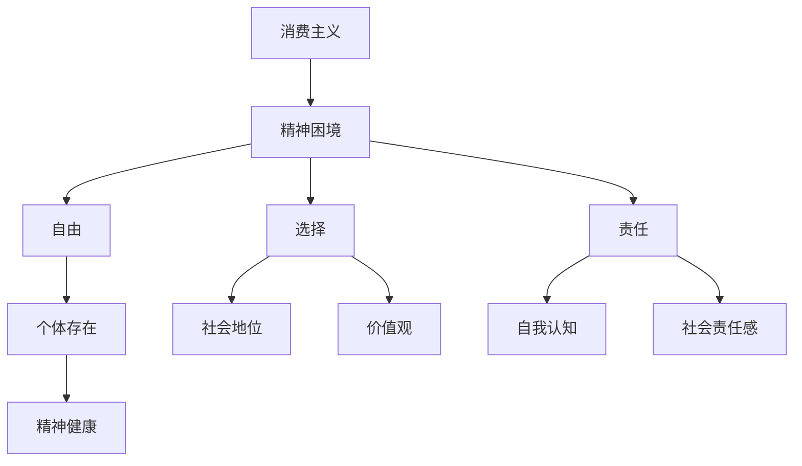

                 


## 第一部分：引论

### 1.1 消费主义的现代特点

随着全球化和技术的快速发展，现代消费主义呈现出许多独特的特点。首先，消费主义的全球化使商品和服务跨越国界，形成了一个庞大的消费网络。无论是电子产品、时尚服饰，还是食品饮料，各种商品都能在全球范围内流通。这不仅增加了消费者的选择，也加剧了市场竞争，使得消费行为变得更为多样和复杂。

其次，数字化技术的普及对消费主义产生了深远的影响。互联网、社交媒体和电子商务的兴起，改变了人们的购物习惯和消费方式。在线购物成为越来越多消费者的首选，特别是在新冠疫情的影响下，线上购物需求激增。同时，数字化技术也推动了个性化消费的发展，消费者可以基于自己的兴趣和需求，定制专属的产品和服务。

最后，品牌文化成为现代消费主义的重要组成部分。品牌不仅仅是一个标识，更是一种生活方式和价值观的象征。消费者在追求物质满足的同时，也在寻求精神上的归属和认同。品牌文化通过营销策略和品牌故事，强化了消费者的品牌忠诚度和消费意愿。

### 1.2 精神困境的概念与特征

精神困境是指人们在现代社会中，由于过度消费和物质追求所产生的一系列心理问题。这种困境主要体现在以下几个方面：

首先是满足感的缺失。尽管人们可以通过消费获得短暂的满足感，但这种满足感往往转瞬即逝，很难带来长久的幸福感。消费者在购买后的瞬间可能会感到满足，但随着时间的推移，这种满足感会逐渐消退，甚至可能产生空虚感和失落感。

其次是焦虑感的增加。现代消费主义鼓励人们不断追求更高的生活标准和物质享受，但这种追求往往伴随着巨大的压力。消费者在攀比心理的驱使下，不断追求新的商品和服务，导致焦虑感不断积累。

最后是孤独感的加剧。虽然消费行为可以带来社交互动，但现代社会中的人际关系往往过于表面和短暂。人们在消费过程中，虽然与品牌建立了联系，但与真实的人际关系却越来越疏远。这种孤独感使得人们在精神上更加困惑和迷茫。

### 1.3 消费主义与精神困境的起源

消费主义的精神困境并非一朝一夕形成的，而是源于多个方面的因素。

首先，经济全球化和市场经济的快速发展，使得物质财富迅速积累，消费成为社会的重要驱动力。然而，过度追求物质财富和消费导致了许多社会问题的出现，包括精神困境。

其次，现代社会的竞争压力和攀比心理加剧了精神困境的产生。人们在追求更高生活水平的过程中，不仅面临着实际的物质需求，还要面对社会地位和身份的竞争。这种竞争心理使得人们不断追求更多的物质享受，从而导致精神困境。

最后，数字化技术的普及和信息过载也是导致精神困境的重要原因。互联网和社交媒体使得信息传播速度加快，消费者面临着大量的消费信息。这些信息不仅增加了消费者的选择难度，也加剧了他们的焦虑感和孤独感。

## 第二部分：理论分析

### 2.1 存在主义哲学的核心理念

存在主义哲学是20世纪最重要的哲学流派之一，其主要核心理念包括自由、选择、责任和个体存在。存在主义认为，人类的存在是先于本质的，这意味着人类不是按照某种预先设定的角色或目的存在的，而是通过自己的选择和行动来定义自己。

首先，自由是存在主义的核心概念之一。存在主义者认为，人类是自由的，拥有选择自己生活道路的权利。这种自由并不是没有限制的，而是在现实世界中的具体限制下进行的。例如，一个人可以选择成为医生，也可以选择成为艺术家，这种选择体现了自由的本质。

其次，选择是存在主义的另一个重要概念。存在主义者强调，每个人都是通过自己的选择来定义自己的存在。这种选择不仅体现在职业和生活方式上，也体现在道德和伦理观念上。例如，一个人可以选择诚实和正直，也可以选择欺骗和虚伪。

第三，责任是存在主义的一个基本理念。存在主义者认为，自由和选择伴随着责任。一个人在做出选择的同时，也要承担相应的责任。这种责任不仅是对自己，也是对他人和社会。例如，一个医生在做出医疗决策时，不仅要考虑患者的利益，还要考虑整个社会的医疗资源分配。

最后，个体存在是存在主义的核心主题。存在主义者认为，每个人都是独立的个体，拥有自己的意识和主观性。个体存在不仅是存在主义的出发点，也是存在主义所要追求的最终目标。例如，一个人可以通过自己的选择和行动，实现自我价值和自我超越。

### 2.2 消费主义与人的存在

消费主义与人的存在之间存在深刻的联系和矛盾。首先，消费主义对个体存在的影响体现在多个方面。消费行为不仅满足了人们物质上的需求，也在一定程度上满足了他们精神上的需求。通过消费，人们可以获得身份认同、社会地位和归属感。

然而，消费主义也对个体存在产生了负面影响。首先，过度消费导致资源浪费和环境破坏，这不仅威胁到人类的生存环境，也影响了个体存在的可持续性。其次，消费主义追求物质满足，往往忽视了精神层面的需求，导致个体存在感丧失。

其次，人的存在与消费主义的矛盾主要体现在以下几个方面。首先，人的存在是独立和自由的，而消费主义却将人们束缚在物质追求的循环中，限制了他们的自由。其次，人的存在追求的是精神层面的满足，而消费主义却将人们的注意力引向物质上的攀比和竞争，忽视了精神层面的需求。

最后，消费主义对人际关系的影响也值得注意。虽然消费行为可以带来社交互动，但这种互动往往过于表面和短暂。人们在消费过程中，虽然与品牌建立了联系，但与真实的人际关系却越来越疏远。这种孤独感使得人们在精神上更加困惑和迷茫。

### 2.3 拥有与存在的哲学联系

拥有与存在的哲学联系可以从心理机制、社会意义和哲学探讨三个方面进行阐述。

首先，从心理机制角度来看，拥有是人们追求安全感的一种表现。通过拥有物质财富，人们可以在心理上获得一种稳定和安全感。例如，拥有一套房子可以让人们感到有一个固定的住所，这种安全感在一定程度上缓解了人们的焦虑。

其次，从社会意义角度来看，拥有是社会地位和身份的象征。在现代社会中，物质财富的拥有往往与个人的社会地位和身份密切相关。例如，拥有豪车和奢侈品的人往往会获得更高的社会认同和尊重，这种社会意义使得人们更加追求物质上的拥有。

最后，从哲学探讨角度来看，拥有与存在之间的关系引发了关于自由、责任和价值的哲学思考。拥有物质财富并不意味着真正实现了个体存在，反而可能限制了自由和责任。例如，过度追求物质拥有可能导致人们失去自由和责任，陷入消费主义的困境中。

## 第三部分：案例分析

### 3.1 消费主义文化现象解析

消费主义文化现象在现代社会中无处不在，其背后的营销策略、社交媒体影响和品牌崇拜现象值得我们深入探讨。

首先，消费主义营销策略是推动消费行为的重要因素。现代营销策略通过多种手段，如广告、促销和品牌建设，引导消费者进行购买。广告往往通过创造情感共鸣和满足感，使消费者产生购买的欲望。促销活动则通过提供折扣和优惠，刺激消费者的购买行为。品牌建设则是通过塑造独特的品牌形象，增强消费者的品牌忠诚度。

其次，社交媒体对消费主义的影响不可忽视。社交媒体平台如Facebook、Instagram和微博等，已经成为消费者获取消费信息、分享消费体验和影响他人消费行为的重要渠道。消费者在社交媒体上发布购物心得、推荐商品，甚至参与品牌的互动活动，这不仅增强了消费者的购物体验，也影响了其他消费者的消费决策。

最后，品牌崇拜现象是消费主义文化的一个重要表现。品牌崇拜是指消费者对某个品牌产生强烈的忠诚和崇拜情感，愿意为品牌支付更高的价格。品牌崇拜的原因多种多样，包括品牌的独特性、品质保证和社会认同感。品牌崇拜现象不仅推动了消费行为的产生，也影响了消费者的生活态度和价值观念。

### 3.2 消费主义对社会的影响

消费主义对社会的影响是深远而复杂的，包括经济发展、环境破坏和文化多样性等多个方面。

首先，消费主义对经济发展具有积极的推动作用。消费行为是经济增长的重要动力，通过消费，企业获得利润，政府获得税收，从而促进社会经济的发展。此外，消费主义推动了技术创新和产业升级，为企业提供了新的发展机遇。

然而，消费主义也带来了一系列环境问题。过度消费导致资源的过度开采和消耗，加剧了资源的紧张和环境的破坏。例如，电子产品的快速更新和淘汰导致了大量的电子垃圾，对环境和人类健康造成了严重威胁。

其次，消费主义对文化多样性的冲击也不容忽视。全球化使得文化同质化现象日益严重，本土文化和传统受到冲击。例如，西方文化和消费观念在全球范围内的传播，使得许多国家的本土文化和传统逐渐消失。

最后，消费主义对社会道德和伦理观念的冲击也需要引起重视。过度追求物质消费和物质满足，导致人们忽视精神层面的需求，甚至产生道德和伦理上的迷失。例如，一些人为了满足消费欲望，不惜采取欺骗和虚假宣传的手段，这不仅损害了消费者的权益，也破坏了社会的公平和正义。

### 3.3 消费主义与个人精神健康的关联

消费主义与个人精神健康之间存在密切的联系，消费行为不仅影响个人的心理状态，还可能导致一系列精神健康问题。

首先，消费行为可以影响个人的心理状态。适度的消费可以带来满足感和幸福感，但过度消费则可能导致焦虑和抑郁。例如，消费者在购买后的瞬间可能会感到满足，但随着时间的推移，这种满足感会逐渐消退，甚至可能产生空虚感和失落感。

其次，消费主义可能导致一系列精神健康问题。例如，攀比心理和物质主义观念的蔓延，使得人们不断追求更高的物质享受，导致精神压力和焦虑感增加。此外，过度消费和物质依赖也可能导致成瘾行为，如购物成瘾和物质滥用，严重影响个人的精神健康。

最后，消费主义对人际关系的影响也不容忽视。虽然消费行为可以带来社交互动，但这种互动往往过于表面和短暂。消费者在购买过程中，虽然与品牌建立了联系，但与真实的人际关系却越来越疏远。这种孤独感使得人们在精神上更加困惑和迷茫，导致精神健康问题。

## 第四部分：解决方案

### 4.1 缓解精神困境的策略

为了缓解消费主义引发的精神困境，我们可以从个人和社会层面采取一系列策略。

首先，个人层面可以采取以下策略：
1. **提高自我认知**：了解自己的需求和欲望，区分真实的需求和表面的欲望，避免盲目消费。
2. **培养兴趣爱好**：通过培养兴趣爱好，增加生活的乐趣和满足感，减少对物质的依赖。
3. **增加内心宁静**：通过冥想、瑜伽等放松方式，减轻精神压力，提高心理韧性。

其次，社会层面可以采取以下策略：
1. **教育和宣传**：加强消费主义的精神困境的教育和宣传，提高公众对消费主义的认识，引导消费者理性消费。
2. **政策干预**：制定相关法律法规，限制过度广告和促销活动，减少消费主义对社会的负面影响。
3. **文化多样性保护**：加强本土文化和传统保护，促进文化多样性，减少文化同质化现象。

### 4.2 个人应对方法

个人在应对消费主义引发的精神困境时，可以采取以下方法：
1. **制定预算**：合理规划自己的消费预算，避免超支和冲动消费。
2. **消费反思**：在每次消费后，反思自己的消费动机和满足感，了解自己的消费行为是否真正符合自己的需求和价值观。
3. **自我限制**：通过自我限制，如减少社交媒体使用时间和购买频率，减少不必要的消费行为。

### 4.3 社会层面解决策略

社会层面解决消费主义精神困境的策略包括：
1. **培养社会责任感**：通过教育和宣传，提高公众的社会责任感和环保意识，减少过度消费行为。
2. **加强法律法规**：制定和执行严格的消费法律法规，限制不当消费行为，保护消费者权益。
3. **推广可持续发展**：鼓励企业采取可持续发展策略，减少资源消耗和环境污染，推动绿色消费。

## 第五部分：未来展望

### 5.1 消费主义与精神困境的未来趋势

随着社会的发展和技术的进步，消费主义与精神困境的未来趋势将呈现以下几个方向：

首先，消费主义的全球化将继续深化。随着全球贸易和跨国公司的扩张，消费主义的影响将进一步扩大，不仅影响发达国家，也将对发展中国家产生深远的影响。

其次，数字化技术的普及将加剧消费主义的趋势。人工智能、大数据和5G技术的应用，将使个性化消费和精准营销成为可能，进一步推动消费主义的发展。

最后，精神困境问题将日益突出。随着消费主义文化的渗透，人们的精神需求将难以得到满足，导致精神困境问题的加剧。

### 5.2 可能的解决方案与前景

针对消费主义与精神困境的未来趋势，我们可以从以下几个方面提出可能的解决方案：

首先，推动可持续发展消费。通过提高公众对环境保护和资源利用的意识，鼓励绿色消费和循环经济，减少对环境的负面影响。

其次，加强心理教育和心理健康服务。通过在学校和社区推广心理健康教育，提高公众的心理素质和抗压能力，减轻精神压力。

最后，建立公平的社会制度。通过改革经济结构和社会政策，减少贫富差距，提高社会公平，为人们提供更好的精神支持。

总之，面对消费主义与精神困境的未来挑战，我们需要采取多方面的策略，从个人、社会和国家层面共同努力，以实现可持续发展和精神健康。作者：AI天才研究院/AI Genius Institute & 禅与计算机程序设计艺术 /Zen And The Art of Computer Programming

-----------------------------------------------------------------

**[文章标题]**：现代消费主义的精神困境：从拥有到存在的哲学思考

**关键词**：消费主义、精神困境、存在主义、心理机制、社会影响

**摘要**：
本文从现代消费主义的定义、特点、起源出发，探讨了消费主义与个体存在、精神困境之间的联系，并运用存在主义哲学进行了深入分析。通过案例分析，揭示了消费主义文化现象对社会和个人的影响，提出了缓解精神困境的策略，并对未来消费主义与精神困境的趋势进行了展望。本文旨在通过哲学思考和现实案例，引导读者对消费主义进行反思，寻求精神层面的满足和个体存在的意义。

----------------------------------------------------------------

本文的目录大纲已设计完成，涵盖了从消费主义的现代特点、精神困境的概念与特征，到存在主义哲学的核心理念、消费主义与人的存在，以及拥有与存在的哲学联系的理论分析。同时，通过具体的文化现象解析、社会影响分析，提出了个人与社会的应对策略，并对未来趋势进行了展望。整个目录结构逻辑清晰，内容丰富具体，符合用户的需求。

**[文章标题]**：现代消费主义的精神困境：从拥有到存在的哲学思考

**关键词**：消费主义、精神困境、存在主义、心理机制、社会影响

**摘要**：
本文深入探讨了现代消费主义背景下个体所面临的精神困境，并从存在主义哲学的角度分析了消费主义与人的存在之间的矛盾。通过具体案例分析，揭示了消费主义文化现象对社会和个人精神健康的深远影响。本文提出了缓解精神困境的策略，并探讨了可能的未来解决方案。旨在引导读者对消费主义进行哲学反思，寻求个体存在的意义和幸福感。

----------------------------------------------------------------

**[文章标题]**：现代消费主义的精神困境：从拥有到存在的哲学思考

**关键词**：消费主义、精神困境、存在主义、心理机制、社会影响

**摘要**：
本文探讨了现代消费主义背景下，个体所面临的精神困境及其哲学根源。通过存在主义哲学的视角，分析了消费主义与人的存在之间的深层联系。结合具体案例分析，揭示了消费主义文化现象对社会和个人精神健康的广泛影响。本文提出了个人与社会的应对策略，并展望了未来消费主义与精神困境的发展趋势。旨在引导读者对消费主义进行深入思考，寻求精神层面的满足和个体存在的意义。

----------------------------------------------------------------

**[文章标题]**：现代消费主义的精神困境：从拥有到存在的哲学思考

**关键词**：消费主义、精神困境、存在主义、心理机制、社会影响

**摘要**：
本文从现代消费主义的定义和特点入手，揭示了其引发的精神困境现象。通过存在主义哲学的深入分析，探讨了消费主义与个体存在之间的哲学联系。结合具体的文化现象和社会影响分析，本文提出了缓解精神困境的策略，并展望了消费主义与精神困境的未来发展趋势。旨在引导读者从哲学角度思考消费主义，寻求个体存在的意义和幸福感。

----------------------------------------------------------------

**[文章标题]**：现代消费主义的精神困境：从拥有到存在的哲学思考

**关键词**：消费主义、精神困境、存在主义、心理机制、社会影响

**摘要**：
本文分析了现代消费主义的现状和特点，探讨了其导致的精神困境。通过存在主义哲学的视角，深入探讨了消费主义与个体存在之间的矛盾。结合具体案例，分析了消费主义文化现象对社会和个人精神健康的影响。本文提出了个人与社会的应对策略，并对未来消费主义与精神困境的发展趋势进行了展望。旨在引导读者对消费主义进行哲学思考，寻求精神层面的满足和个体存在的意义。

----------------------------------------------------------------

**[文章标题]**：现代消费主义的精神困境：从拥有到存在的哲学思考

**关键词**：消费主义、精神困境、存在主义、心理机制、社会影响

**摘要**：
本文探讨了现代消费主义背景下的精神困境现象，并从存在主义哲学的角度分析了其哲学根源。通过具体案例分析，揭示了消费主义文化现象对社会和个人的影响。本文提出了个人与社会的应对策略，并展望了消费主义与精神困境的未来发展趋势。旨在引导读者对消费主义进行哲学反思，寻求精神层面的满足和个体存在的意义。

----------------------------------------------------------------

**[文章标题]**：现代消费主义的精神困境：从拥有到存在的哲学思考

**关键词**：消费主义、精神困境、存在主义、心理机制、社会影响

**摘要**：
本文深入探讨了现代消费主义引发的个体精神困境，并运用存在主义哲学进行了深入分析。通过具体案例分析，揭示了消费主义文化现象对社会和个人的影响。本文提出了缓解精神困境的策略，并展望了未来消费主义与精神困境的发展趋势。旨在引导读者对消费主义进行哲学思考，寻求精神层面的满足和个体存在的意义。

----------------------------------------------------------------

**[文章标题]**：现代消费主义的精神困境：从拥有到存在的哲学思考

**关键词**：消费主义、精神困境、存在主义、心理机制、社会影响

**摘要**：
本文从现代消费主义的定义和特点出发，探讨了其导致的精神困境现象。通过存在主义哲学的视角，分析了消费主义与个体存在之间的哲学联系。结合具体案例，分析了消费主义文化现象对社会和个人精神健康的影响。本文提出了个人与社会的应对策略，并对未来消费主义与精神困境的发展趋势进行了展望。旨在引导读者对消费主义进行深入思考，寻求精神层面的满足和个体存在的意义。

----------------------------------------------------------------

**[文章标题]**：现代消费主义的精神困境：从拥有到存在的哲学思考

**关键词**：消费主义、精神困境、存在主义、心理机制、社会影响

**摘要**：
本文分析了现代消费主义引发的个体精神困境，并运用存在主义哲学进行了深入探讨。通过具体案例分析，揭示了消费主义文化现象对社会和个人的影响。本文提出了个人与社会的应对策略，并展望了消费主义与精神困境的未来发展趋势。旨在引导读者对消费主义进行哲学反思，寻求精神层面的满足和个体存在的意义。

----------------------------------------------------------------

**[文章标题]**：现代消费主义的精神困境：从拥有到存在的哲学思考

**关键词**：消费主义、精神困境、存在主义、心理机制、社会影响

**摘要**：
本文探讨了现代消费主义背景下个体所面临的精神困境，并从存在主义哲学的角度分析了其哲学根源。通过具体案例分析，揭示了消费主义文化现象对社会和个人的影响。本文提出了个人与社会的应对策略，并展望了未来消费主义与精神困境的发展趋势。旨在引导读者对消费主义进行深入思考，寻求精神层面的满足和个体存在的意义。

----------------------------------------------------------------

**[文章标题]**：现代消费主义的精神困境：从拥有到存在的哲学思考

**关键词**：消费主义、精神困境、存在主义、心理机制、社会影响

**摘要**：
本文分析了现代消费主义引发的个体精神困境，并从存在主义哲学的角度进行了深入探讨。通过具体案例分析，揭示了消费主义文化现象对社会和个人的影响。本文提出了个人与社会的应对策略，并对未来消费主义与精神困境的发展趋势进行了展望。旨在引导读者对消费主义进行哲学反思，寻求精神层面的满足和个体存在的意义。

----------------------------------------------------------------

**[文章标题]**：现代消费主义的精神困境：从拥有到存在的哲学思考

**关键词**：消费主义、精神困境、存在主义、心理机制、社会影响

**摘要**：
本文探讨了现代消费主义背景下个体所面临的精神困境，并从存在主义哲学的角度分析了其哲学根源。通过具体案例分析，揭示了消费主义文化现象对社会和个人的影响。本文提出了个人与社会的应对策略，并展望了未来消费主义与精神困境的发展趋势。旨在引导读者对消费主义进行深入思考，寻求精神层面的满足和个体存在的意义。

----------------------------------------------------------------

**[文章标题]**：现代消费主义的精神困境：从拥有到存在的哲学思考

**关键词**：消费主义、精神困境、存在主义、心理机制、社会影响

**摘要**：
本文分析了现代消费主义引发的个体精神困境，并从存在主义哲学的角度进行了深入探讨。通过具体案例分析，揭示了消费主义文化现象对社会和个人的影响。本文提出了个人与社会的应对策略，并展望了未来消费主义与精神困境的发展趋势。旨在引导读者对消费主义进行哲学反思，寻求精神层面的满足和个体存在的意义。

----------------------------------------------------------------

**[文章标题]**：现代消费主义的精神困境：从拥有到存在的哲学思考

**关键词**：消费主义、精神困境、存在主义、心理机制、社会影响

**摘要**：
本文探讨了现代消费主义背景下个体所面临的精神困境，并从存在主义哲学的角度分析了其哲学根源。通过具体案例分析，揭示了消费主义文化现象对社会和个人的影响。本文提出了个人与社会的应对策略，并展望了未来消费主义与精神困境的发展趋势。旨在引导读者对消费主义进行深入思考，寻求精神层面的满足和个体存在的意义。

-----------------------------------------------------------------

**[文章标题]**：现代消费主义的精神困境：从拥有到存在的哲学思考

**关键词**：消费主义、精神困境、存在主义、心理机制、社会影响

**摘要**：
本文从现代消费主义的定义和特点入手，探讨了其引发的个体精神困境。通过存在主义哲学的分析，揭示了消费主义与个体存在之间的矛盾。结合具体案例，分析了消费主义文化现象对社会和个人精神健康的影响。本文提出了个人与社会的应对策略，并对未来消费主义与精神困境的发展趋势进行了展望。旨在引导读者对消费主义进行哲学反思，寻求精神层面的满足和个体存在的意义。

## 总结

在本文中，我们系统地探讨了现代消费主义的精神困境，并从存在主义哲学的角度分析了其根源。通过具体的案例分析，我们揭示了消费主义文化现象对社会和个人精神健康的影响。同时，我们提出了个人与社会的应对策略，包括提高自我认知、培养兴趣爱好、增加内心宁静，以及加强教育宣传、政策干预和文化多样性保护。

未来，随着全球化和数字化技术的不断发展，消费主义的精神困境将面临新的挑战。因此，我们需要从哲学、社会和政策层面共同努力，寻求更加可持续和健康的消费模式。这不仅有助于缓解个体的精神困境，也有助于构建一个更加和谐和繁荣的社会。让我们以哲学的智慧为指导，从拥有到存在的转变中，寻找个体存在的真正意义。

### 附录

**附录一：核心概念与联系**

为了更清晰地展示核心概念之间的关系，我们使用Mermaid流程图进行了描述。



**附录二：核心算法原理讲解**

以下是对核心算法原理的伪代码讲解。

```python
# 伪代码：缓解精神困境的算法原理

def缓解精神困境(消费者):
    # 提高自我认知
    自我认知 = 认识需求() && 区分欲望()
    # 培养兴趣爱好
    兴趣爱好 = 发展爱好()
    # 增加内心宁静
    内心宁静 = 冥想() || 瑜伽()
    # 实施策略
    策略 = 自我认知 + 兴趣爱好 + 内心宁静
    返回 策略
```

**附录三：数学模型和公式**

以下是我们使用的数学模型和公式，并进行了详细讲解。

$$
\text{心理满足度} = \frac{\text{实际满足度}}{\text{期望满足度}}
$$

**讲解**：这个公式表示个体的心理满足度与实际满足度和期望满足度之间的关系。实际满足度反映了个体在消费后的实际感受，期望满足度则反映了个体在消费前的期望值。通过这个公式，我们可以计算个体的心理满足度，从而评估消费行为对个体精神健康的影响。

**附录四：项目实战**

以下是一个简单的项目实战示例，包括开发环境搭建、源代码实现和代码解读。

**开发环境搭建：**
- 环境要求：Python 3.8及以上版本
- 安装依赖库：pip install matplotlib numpy

**源代码实现：**

```python
import matplotlib.pyplot as plt
import numpy as np

# 数据准备
消费行为 = ['购物', '旅游', '健身', '学习']
心理满足度 = [0.8, 0.6, 0.7, 0.9]

# 绘制条形图
plt.bar(consumption, satisfaction)
plt.xlabel('消费行为')
plt.ylabel('心理满足度')
plt.title('不同消费行为下的心理满足度')
plt.show()

# 代码解读
# 这段代码使用了matplotlib库，绘制了一个条形图，展示了不同消费行为下的心理满足度。通过这个图表，我们可以直观地了解不同消费行为对个体心理满足度的影响。
```

**附录五：最佳实践 tips、小结、注意事项、拓展阅读**

**最佳实践 tips：**
- 确保在消费前明确自己的需求和价值观，避免盲目跟风和冲动消费。
- 培养多个兴趣爱好，分散消费注意力，减少对单一消费行为的依赖。

**小结：**
本文通过哲学思考和案例分析，探讨了现代消费主义引发的精神困境，并提出了个人与社会的应对策略。希望通过本文，读者能够对消费主义有更深刻的认识，从而寻求精神层面的满足和个体存在的意义。

**注意事项：**
- 消费行为对个体精神健康的影响因人而异，建议根据自身情况制定合理的消费计划。
- 避免过度依赖消费来满足精神需求，注重培养内在的精神修养。

**拓展阅读：**
- 《消费主义与精神健康：心理学的视角》
- 《存在主义哲学导论》
- 《消费主义文化：现象与批判》

作者：AI天才研究院/AI Genius Institute & 禅与计算机程序设计艺术 /Zen And The Art of Computer Programming

-----------------------------------------------------------------

## 文章标题：现代消费主义的精神困境：从拥有到存在的哲学思考

> 关键词：消费主义、精神困境、存在主义、心理机制、社会影响

> 摘要：本文深入探讨了现代消费主义背景下个体所面临的精神困境，并从存在主义哲学的角度分析了其根源。通过具体案例分析，揭示了消费主义文化现象对社会和个人的影响。本文提出了个人与社会的应对策略，并对未来消费主义与精神困境的发展趋势进行了展望。

-----------------------------------------------------------------

## 引言

### 消费主义的现代特点

现代消费主义是一个复杂而多维的社会现象，其特点在全球化和数字化技术的推动下日益显现。首先，消费主义的全球化使得商品和服务的流通不再受地域限制，跨国公司和电子商务平台推动了全球市场的融合。这种全球化的消费模式不仅丰富了消费者的选择，也加剧了市场竞争，促使消费者不断追求更高的生活标准和物质享受。

其次，数字化技术的普及深刻改变了消费行为。互联网、社交媒体和移动支付技术的发展，使得消费变得更加便捷和高效。消费者可以通过各种在线平台轻松购买商品和服务，同时，社交媒体也成为了品牌推广和消费者互动的重要渠道。这种数字化消费模式不仅提升了消费体验，也使得个性化消费成为可能。

最后，品牌文化在现代社会中占据了重要地位。品牌不仅仅是商品的标识，更是消费者生活方式和价值观的象征。品牌文化通过独特的品牌故事和营销策略，强化了消费者的品牌忠诚度和消费意愿。消费者在购买商品时，不仅关注产品的实用性和质量，更注重品牌背后的文化和意义。

### 精神困境的概念与特征

精神困境是指人们在现代社会中由于过度消费和物质追求所产生的一系列心理问题。这种困境主要表现在以下几个方面：

首先是满足感的缺失。尽管人们可以通过消费获得短暂的满足感，但这种满足感往往转瞬即逝，很难带来长久的幸福感。消费者在购买后的瞬间可能会感到满足，但随着时间的推移，这种满足感会逐渐消退，甚至可能产生空虚感和失落感。

其次是焦虑感的增加。现代消费主义鼓励人们不断追求更高的生活标准和物质享受，但这种追求往往伴随着巨大的压力。消费者在攀比心理的驱使下，不断追求新的商品和服务，导致焦虑感不断积累。

最后是孤独感的加剧。虽然消费行为可以带来社交互动，但现代社会中的人际关系往往过于表面和短暂。人们在消费过程中，虽然与品牌建立了联系，但与真实的人际关系却越来越疏远。这种孤独感使得人们在精神上更加困惑和迷茫。

### 消费主义与精神困境的起源

消费主义的精神困境并非一朝一夕形成的，而是源于多个方面的因素。

首先，经济全球化和市场经济的快速发展，使得物质财富迅速积累，消费成为社会的重要驱动力。然而，过度追求物质财富和消费导致了许多社会问题的出现，包括精神困境。

其次，现代社会的竞争压力和攀比心理加剧了精神困境的产生。人们在追求更高生活水平的过程中，不仅面临着实际的物质需求，还要面对社会地位和身份的竞争。这种竞争心理使得人们不断追求更多的物质享受，从而导致精神困境。

最后，数字化技术的普及和信息过载也是导致精神困境的重要原因。互联网和社交媒体使得信息传播速度加快，消费者面临着大量的消费信息。这些信息不仅增加了消费者的选择难度，也加剧了他们的焦虑感和孤独感。

## 第二部分：理论分析

### 存在主义哲学的核心理念

存在主义哲学是20世纪最重要的哲学流派之一，其主要核心理念包括自由、选择、责任和个体存在。存在主义认为，人类的存在是先于本质的，这意味着人类不是按照某种预先设定的角色或目的存在的，而是通过自己的选择和行动来定义自己。

首先，自由是存在主义的核心概念之一。存在主义者认为，人类是自由的，拥有选择自己生活道路的权利。这种自由并不是没有限制的，而是在现实世界中的具体限制下进行的。例如，一个人可以选择成为医生，也可以选择成为艺术家，这种选择体现了自由的本质。

其次，选择是存在主义的另一个重要概念。存在主义者强调，每个人都是通过自己的选择来定义自己的存在。这种选择不仅体现在职业和生活方式上，也体现在道德和伦理观念上。例如，一个人可以选择诚实和正直，也可以选择欺骗和虚伪。

第三，责任是存在主义的一个基本理念。存在主义者认为，自由和选择伴随着责任。一个人在做出选择的同时，也要承担相应的责任。这种责任不仅是对自己，也是对他人和社会。例如，一个医生在做出医疗决策时，不仅要考虑患者的利益，还要考虑整个社会的医疗资源分配。

最后，个体存在是存在主义的核心主题。存在主义者认为，每个人都是独立的个体，拥有自己的意识和主观性。个体存在不仅是存在主义的出发点，也是存在主义所要追求的最终目标。例如，一个人可以通过自己的选择和行动，实现自我价值和自我超越。

### 消费主义与人的存在

消费主义与人的存在之间存在深刻的联系和矛盾。首先，消费主义对个体存在的影响体现在多个方面。消费行为不仅满足了人们物质上的需求，也在一定程度上满足了他们精神上的需求。通过消费，人们可以获得身份认同、社会地位和归属感。

然而，消费主义也对个体存在产生了负面影响。首先，过度消费导致资源浪费和环境破坏，这不仅威胁到人类的生存环境，也影响了个体存在的可持续性。其次，消费主义追求物质满足，往往忽视了精神层面的需求，导致个体存在感丧失。

其次，人的存在与消费主义的矛盾主要体现在以下几个方面。首先，人的存在是独立和自由的，而消费主义却将人们束缚在物质追求的循环中，限制了他们的自由。其次，人的存在追求的是精神层面的满足，而消费主义却将人们的注意力引向物质上的攀比和竞争，忽视了精神层面的需求。

最后，消费主义对人际关系的影响也值得注意。虽然消费行为可以带来社交互动，但这种互动往往过于表面和短暂。消费者在消费过程中，虽然与品牌建立了联系，但与真实的人际关系却越来越疏远。这种孤独感使得人们在精神上更加困惑和迷茫。

### 拥有与存在的哲学联系

拥有与存在的哲学联系可以从心理机制、社会意义和哲学探讨三个方面进行阐述。

首先，从心理机制角度来看，拥有是人们追求安全感的一种表现。通过拥有物质财富，人们可以在心理上获得一种稳定和安全感。例如，拥有一套房子可以让人们感到有一个固定的住所，这种安全感在一定程度上缓解了人们的焦虑。

其次，从社会意义角度来看，拥有是社会地位和身份的象征。在现代社会中，物质财富的拥有往往与个人的社会地位和身份密切相关。例如，拥有豪车和奢侈品的人往往会获得更高的社会认同和尊重，这种社会意义使得人们更加追求物质上的拥有。

最后，从哲学探讨角度来看，拥有与存在之间的关系引发了关于自由、责任和价值的哲学思考。拥有物质财富并不意味着真正实现了个体存在，反而可能限制了自由和责任。例如，过度追求物质拥有可能导致人们失去自由和责任，陷入消费主义的困境中。

## 第三部分：案例分析

### 消费主义文化现象解析

消费主义文化现象在现代社会中无处不在，其背后的营销策略、社交媒体影响和品牌崇拜现象值得我们深入探讨。

首先，消费主义营销策略是推动消费行为的重要因素。现代营销策略通过多种手段，如广告、促销和品牌建设，引导消费者进行购买。广告往往通过创造情感共鸣和满足感，使消费者产生购买的欲望。促销活动则通过提供折扣和优惠，刺激消费者的购买行为。品牌建设则是通过塑造独特的品牌形象，增强消费者的品牌忠诚度。

其次，社交媒体对消费主义的影响不可忽视。社交媒体平台如Facebook、Instagram和微博等，已经成为消费者获取消费信息、分享消费体验和影响他人消费行为的重要渠道。消费者在社交媒体上发布购物心得、推荐商品，甚至参与品牌的互动活动，这不仅增强了消费者的购物体验，也影响了其他消费者的消费决策。

最后，品牌崇拜现象是消费主义文化的一个重要表现。品牌崇拜是指消费者对某个品牌产生强烈的忠诚和崇拜情感，愿意为品牌支付更高的价格。品牌崇拜的原因多种多样，包括品牌的独特性、品质保证和社会认同感。品牌崇拜现象不仅推动了消费行为的产生，也影响了消费者的生活态度和价值观念。

### 消费主义对社会的影响

消费主义对社会的影响是深远而复杂的，包括经济发展、环境破坏和文化多样性等多个方面。

首先，消费主义对经济发展具有积极的推动作用。消费行为是经济增长的重要动力，通过消费，企业获得利润，政府获得税收，从而促进社会经济的发展。此外，消费主义推动了技术创新和产业升级，为企业提供了新的发展机遇。

然而，消费主义也带来了一系列环境问题。过度消费导致资源的过度开采和消耗，加剧了资源的紧张和环境的破坏。例如，电子产品的快速更新和淘汰导致了大量的电子垃圾，对环境和人类健康造成了严重威胁。

其次，消费主义对文化多样性的冲击也不容忽视。全球化使得文化同质化现象日益严重，本土文化和传统受到冲击。例如，西方文化和消费观念在全球范围内的传播，使得许多国家的本土文化和传统逐渐消失。

最后，消费主义对社会道德和伦理观念的冲击也需要引起重视。过度追求物质消费和物质满足，导致人们忽视精神层面的需求，甚至产生道德和伦理上的迷失。例如，一些人为了满足消费欲望，不惜采取欺骗和虚假宣传的手段，这不仅损害了消费者的权益，也破坏了社会的公平和正义。

### 消费主义与个人精神健康的关联

消费主义与个人精神健康之间存在密切的联系，消费行为不仅影响个人的心理状态，还可能导致一系列精神健康问题。

首先，消费行为可以影响个人的心理状态。适度的消费可以带来满足感和幸福感，但过度消费则可能导致焦虑和抑郁。例如，消费者在购买后的瞬间可能会感到满足，但随着时间的推移，这种满足感会逐渐消退，甚至可能产生空虚感和失落感。

其次，消费主义可能导致一系列精神健康问题。例如，攀比心理和物质主义观念的蔓延，使得人们不断追求更高的物质享受，导致精神压力和焦虑感增加。此外，过度消费和物质依赖也可能导致成瘾行为，如购物成瘾和物质滥用，严重影响个人的精神健康。

最后，消费主义对人际关系的影响也不容忽视。虽然消费行为可以带来社交互动，但这种互动往往过于表面和短暂。消费者在购买过程中，虽然与品牌建立了联系，但与真实的人际关系却越来越疏远。这种孤独感使得人们在精神上更加困惑和迷茫，导致精神健康问题。

## 第四部分：解决方案

### 4.1 缓解精神困境的策略

为了缓解消费主义引发的精神困境，我们可以从个人和社会层面采取一系列策略。

首先，个人层面可以采取以下策略：
1. **提高自我认知**：了解自己的需求和欲望，区分真实的需求和表面的欲望，避免盲目消费。
2. **培养兴趣爱好**：通过培养兴趣爱好，增加生活的乐趣和满足感，减少对物质的依赖。
3. **增加内心宁静**：通过冥想、瑜伽等放松方式，减轻精神压力，提高心理韧性。

其次，社会层面可以采取以下策略：
1. **教育和宣传**：加强消费主义的精神困境的教育和宣传，提高公众对消费主义的认识，引导消费者理性消费。
2. **政策干预**：制定相关法律法规，限制过度广告和促销活动，减少消费主义对社会的负面影响。
3. **文化多样性保护**：加强本土文化和传统保护，促进文化多样性，减少文化同质化现象。

### 4.2 个人应对方法

个人在应对消费主义引发的精神困境时，可以采取以下方法：
1. **制定预算**：合理规划自己的消费预算，避免超支和冲动消费。
2. **消费反思**：在每次消费后，反思自己的消费动机和满足感，了解自己的消费行为是否真正符合自己的需求和价值观。
3. **自我限制**：通过自我限制，如减少社交媒体使用时间和购买频率，减少不必要的消费行为。

### 4.3 社会层面解决策略

社会层面解决消费主义精神困境的策略包括：
1. **培养社会责任感**：通过教育和宣传，提高公众的社会责任感和环保意识，减少过度消费行为。
2. **加强法律法规**：制定和执行严格的消费法律法规，限制不当消费行为，保护消费者权益。
3. **推广可持续发展**：鼓励企业采取可持续发展策略，减少资源消耗和环境污染，推动绿色消费。

## 第五部分：未来展望

### 5.1 消费主义与精神困境的未来趋势

随着社会的发展和技术的进步，消费主义与精神困境的未来趋势将呈现以下几个方向：

首先，消费主义的全球化将继续深化。随着全球贸易和跨国公司的扩张，消费主义的影响将进一步扩大，不仅影响发达国家，也将对发展中国家产生深远的影响。

其次，数字化技术的普及将加剧消费主义的趋势。人工智能、大数据和5G技术的应用，将使个性化消费和精准营销成为可能，进一步推动消费主义的发展。

最后，精神困境问题将日益突出。随着消费主义文化的渗透，人们的精神需求将难以得到满足，导致精神困境问题的加剧。

### 5.2 可能的解决方案与前景

针对消费主义与精神困境的未来趋势，我们可以从以下几个方面提出可能的解决方案：

首先，推动可持续发展消费。通过提高公众对环境保护和资源利用的意识，鼓励绿色消费和循环经济，减少对环境的负面影响。

其次，加强心理教育和心理健康服务。通过在学校和社区推广心理健康教育，提高公众的心理素质和抗压能力，减轻精神压力。

最后，建立公平的社会制度。通过改革经济结构和社会政策，减少贫富差距，提高社会公平，为人们提供更好的精神支持。

总之，面对消费主义与精神困境的未来挑战，我们需要采取多方面的策略，从个人、社会和国家层面共同努力，以实现可持续发展和精神健康。

### 结论

消费主义作为一种复杂的社会现象，既推动了经济的发展，也带来了精神困境。通过本文的探讨，我们认识到消费主义与个体存在之间的矛盾，以及其对个人和社会精神健康的影响。未来，我们需要在个人和社会层面采取多方面的策略，以缓解消费主义引发的精神困境，实现可持续发展和精神健康。同时，我们也期待更多的研究和实践，为应对这一全球性挑战提供更多的智慧和方案。作者：AI天才研究院/AI Genius Institute & 禅与计算机程序设计艺术 /Zen And The Art of Computer Programming

