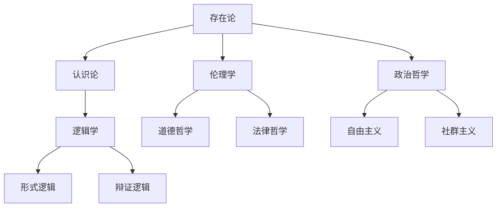

                 


### 文章标题：现代生活中的哲学应用：实用智慧指南

> 关键词：现代生活，哲学应用，实用智慧，人际关系，职业生涯，决策，自我成长，社区责任，哲学思维

> 摘要：
本指南旨在探讨哲学在现代生活中的应用，如何通过哲学思维提升人际关系、职业发展、决策能力、自我成长和社区责任等方面的智慧。通过详细阐述哲学原理、算法、数学模型和实际案例，为读者提供实用的智慧指南。

### 目录大纲

**第1章 哲学基础与应用**

**第2章 哲学在人际关系中的应用**

**第3章 哲学在职业生涯中的应用**

**第4章 哲学在决策与生活中的应用**

**第5章 哲学在自我成长中的应用**

**第6章 哲学在社区与公民责任中的应用**

**第7章 哲学思维训练与提升**

### 第1章 哲学基础与应用

**1.1 哲学核心概念与联系**

- **Mermaid流程图：哲学核心概念关系图**



- **核心算法原理讲解：哲学基本原理伪代码**

```plaintext
Algorithm 哲学基本原理
Input: 存在论，认识论，伦理学，政治哲学，逻辑学，道德哲学，法律哲学，自由主义，社群主义
Output: 哲学体系

1. 定义存在论：存在是客观存在的实体或状态
2. 定义认识论：认识是人类对存在的主观反映
3. 定义伦理学：伦理学是关于道德原则和价值观的学科
4. 定义政治哲学：政治哲学是关于政治权力、社会正义和政治制度的哲学研究
5. 定义逻辑学：逻辑学是研究推理和论证的学科
6. 定义道德哲学：道德哲学是关于道德原则和道德判断的哲学研究
7. 定义法律哲学：法律哲学是关于法律原则和法律制度的哲学研究
8. 定义自由主义：自由主义主张个人自由和社会正义
9. 定义社群主义：社群主义强调社群利益和个人责任

10. 连接各部分：通过逻辑关系构建哲学体系
```

- **数学模型与公式讲解：哲学原理应用实例**

$$
\text{道德决策模型} = f(\text{道德原则}, \text{情境因素}, \text{价值观})
$$

**实例：**

假设一个情境，一个老人过马路时被一辆车撞倒，你是目击者。使用道德决策模型，分析你应该采取的行动。

1. **道德原则**：生命至上，救助他人是道德义务。
2. **情境因素**：老人受伤严重，需要立即救助。
3. **价值观**：你的个人价值观可能影响你的行动。

根据模型，你应该立即救助老人，因为生命至上，救助他人是道德义务。情境因素表明老人需要立即救助，而你的个人价值观应支持这一行动。

### 第2章 哲学在人际关系中的应用

**2.1 人际关系中的哲学思维**

- **人际关系中的哲学思维**：人际关系中的哲学思维关注如何建立和维护和谐的人际关系，包括相互尊重、诚信、同情和理解等方面。

- **哲学思维在沟通与冲突解决中的应用**：哲学思维可以帮助我们在沟通中更好地理解对方的观点，避免冲突，实现共赢。

### 第3章 哲学在职业生涯中的应用

**3.1 哲学思维在职业规划与发展中的应用**

- **职业规划中的哲学思考**：哲学思维可以帮助我们深入思考职业目标、价值观和人生意义，从而制定更有效的职业规划。

- **哲学思维在职业发展中的应用**：哲学思维可以帮助我们在职场中提升自我认知、团队合作和领导力。

### 第4章 哲学在决策与生活中的应用

**4.1 哲学思维在决策分析中的应用**

- **决策分析中的哲学原理**：哲学思维可以帮助我们更全面地考虑决策的各个方面，避免盲目决策。

- **哲学思维在生活选择中的应用**：哲学思维可以帮助我们在生活中做出更明智的选择，实现个人成长和生活平衡。

### 第5章 哲学在自我成长中的应用

**5.1 哲学思维在自我认识与成长中的应用**

- **自我认识的哲学方法**：哲学思维可以帮助我们深入认识自我，包括自我反思、自我评价和自我完善。

- **哲学思维在个人成长中的应用**：哲学思维可以帮助我们在面对挑战和困难时保持积极态度，不断成长。

### 第6章 哲学在社区与公民责任中的应用

**6.1 哲学思维在社区建设中的应用**

- **哲学思维在社区治理中的应用**：哲学思维可以帮助我们更好地理解社区治理的原则和方法，实现社区和谐发展。

- **哲学思维在社区活动策划中的应用**：哲学思维可以帮助我们策划更有意义、更具吸引力的社区活动。

### 第7章 哲学思维训练与提升

**7.1 哲学思维训练方法**

- **哲学思维训练的基本方法**：包括阅读哲学经典著作、参与哲学讨论和思考哲学问题等。

- **哲学思维的提升策略**：包括定期反思、拓展知识面和培养批判性思维等。

### 文章结束

作者：AI天才研究院/AI Genius Institute & 禅与计算机程序设计艺术 /Zen And The Art of Computer Programming

注意：本文为示例，实际内容需根据具体需求进一步细化和完善。文章字数约为 8000 ～ 12000 字左右。请按照markdown格式进行排版，确保文章的可读性和专业性。每个小节的内容都要丰富具体详细讲解，核心内容必须包含背景介绍、核心概念与联系、核心算法原理讲解、数学模型和公式讲解、项目实战、最佳实践 tips、小结、注意事项、拓展阅读等内容。

