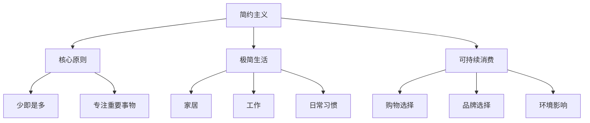

                 

### 引言：简约主义的概念与现代生活中的重要性

简约主义，作为一种生活方式和审美哲学，起源于20世纪50年代的现代主义设计运动。其核心在于“少即是多”，主张通过剔除不必要的元素，使事物更加简洁、纯粹和高效。在建筑、设计、艺术等领域，简约主义以极简的线条、纯净的颜色和简洁的形态著称，成为现代审美的重要标志。

在现代生活中，简约主义的重要性日益凸显。首先，随着信息爆炸和物质丰富的时代到来，人们面临着前所未有的选择过剩和决策疲劳。简约主义提倡减少不必要的物品和信息，帮助人们专注于重要的事物，从而提高生活质量。其次，简约主义倡导环保和可持续发展的理念，鼓励人们减少浪费、珍惜资源，对环境产生积极影响。

本文将从以下几个方面深入探讨简约主义在现代生活中的应用：第一，介绍简约主义的核心原则和实践方法；第二，具体阐述如何实践极简生活，包括家居、工作和日常习惯；第三，探讨可持续消费的理念和实践方法，包括购物选择、品牌选择和环境影响；第四，讨论极简生活和可持续消费对心理健康和社会的影响；第五，通过案例研究展示简约主义、极简生活和可持续消费的实际应用；最后，总结全文并提出未来发展的建议。

通过逐步分析推理，我们将理解简约主义不仅仅是生活方式的改变，更是一种深刻的哲学思考。让我们开始这段探索之旅，深入了解简约主义如何在现代生活中发挥重要作用。使用Mermaid流程图，我们可以清晰地展示简约主义、极简生活和可持续消费之间的逻辑关系，帮助读者更好地理解这一主题。

### 第一部分：简约主义的核心原则

#### 1.1 简约主义的起源与发展

简约主义作为一种设计哲学和生活方式，起源于20世纪50年代的现代主义设计运动。现代主义设计的代表人物勒·柯布西耶（Le Corbusier）强调“形式服从功能”，主张通过简洁的线条和几何形态来体现设计的美学。这一理念在建筑、家具和工业设计领域迅速传播，形成了简约主义的设计风格。

随着时间的推移，简约主义逐渐扩展到生活方式的方方面面。20世纪80年代，极简主义（Minimalism）作为一种艺术流派兴起，倡导通过剔除多余的元素，追求简单和纯粹的美感。这一艺术潮流影响了包括文学、音乐和电影在内的多个领域，进一步推动了简约主义在生活中的普及。

在现代，简约主义已经成为一种主流的生活方式。人们开始意识到，过多的物质追求不仅带来了生活的负担，还可能引发心理上的焦虑和压力。因此，简约主义强调“少即是多”，提倡通过减少不必要的物品和信息，提高生活的质量和效率。

#### 1.2 简约主义的核心理念

简约主义的核心理念可以概括为“少即是多”（Less is More）。这一理念体现在生活的各个方面，包括家居、工作和消费等。以下是对这一理念的具体解释：

- **减少不必要的物品**：在日常生活中，我们往往被过多的物品所包围，这不仅占用了空间，还增加了清洁和维护的负担。简约主义鼓励人们反思自己的物品需求，剔除那些不常用或不重要的物品，只保留对生活真正有价值的物品。

- **提高工作效率**：在工作环境中，简约主义强调通过整理和优化工作空间，减少杂乱无章的情况，从而提高工作效率。一个整洁、有序的工作环境有助于减少干扰，使人们能够更加专注地完成任务。

- **专注重要事物**：简约主义提倡人们减少对次要事物的关注，将精力集中在重要的事情上。这种专注不仅有助于提高生活质量，还能够帮助人们更好地实现个人目标和梦想。

- **减少心理负担**：随着物质的丰富，人们往往陷入选择过剩的困境，这导致决策疲劳和焦虑。简约主义通过减少物品和信息，帮助人们摆脱这种心理负担，享受更加轻松和宁静的生活。

#### 1.3 简约主义的实践方法

要实践简约主义，以下是一些具体的方法：

- **制定整理计划**：定期整理自己的物品，确定哪些是必需的，哪些是可以丢弃的。通过制定整理计划，可以帮助人们逐步减少不必要的物品。

- **优化工作空间**：整理和优化工作空间，确保工作区域的整洁和有序。这有助于减少干扰，提高工作效率。

- **设立日常习惯**：通过设立日常习惯，例如每天固定的时间进行物品整理和检查，可以帮助人们保持简约的生活方式。

- **关注心理健康**：通过减少不必要的物品和信息，人们可以减少心理压力，提高心理健康水平。

- **持续反思**：定期反思自己的生活方式和消费习惯，确保自己在简约主义道路上持续进步。

通过以上实践方法，人们可以逐步实现简约主义的生活方式，提高生活质量，同时减少对环境的负面影响。

总之，简约主义作为一种生活方式和哲学思考，其核心理念和实践方法对现代社会具有重要意义。通过减少不必要的物品和信息，人们可以更加专注于重要的事物，提高生活质量，同时促进心理健康和可持续发展。在下一部分，我们将具体探讨如何实践极简生活，进一步深入这一主题。

### 第二部分：极简生活

#### 3.1 极简家居

极简家居是简约主义在生活中的一个重要实践领域。它主张通过减少家居中的物品和装饰，创造一个简洁、舒适且富有功能性的居住环境。以下是一些具体的实践方法：

- **减少家具数量**：首先，我们可以通过减少家具的数量来实现极简家居。选择一些多功能、紧凑的家具，如沙发床、折叠桌等，可以节省空间并提高家居的实用性。

- **去除多余的装饰**：去除多余的装饰品，如不必要的画作、花瓶等，可以让家居空间更加简洁。保留一些有意义的装饰，如照片、书架等，可以使空间更具个性。

- **优化布局**：重新规划家居布局，确保每个空间都能发挥最大的功能。例如，将书房和卧室合并，可以将空间用于其他用途，如休闲区或健身房。

- **注重功能性**：在选购家居物品时，注重其功能性。选择那些不仅美观，而且实用的物品，如多功能储物柜、可调节高度的书桌等。

- **保持整洁**：保持家居的整洁是极简家居的关键。定期清理和整理，确保物品有序存放，避免杂乱无章的情况。

通过以上方法，我们可以实现一个简洁、舒适且富有功能性的家居环境。这不仅有助于提高生活质量，还可以减少日常生活中的压力。

#### 3.2 极简工作

极简工作同样适用于现代职场。它强调通过优化工作流程和减少干扰，提高工作效率和专注度。以下是一些具体的实践方法：

- **整理工作空间**：整理和优化工作空间，确保桌面和文件架的整洁有序。这有助于减少干扰，提高工作集中度。

- **设定工作优先级**：根据重要性和紧急性，设定每天的工作优先级。这有助于确保最重要的任务得到优先处理，从而提高工作效率。

- **使用时间管理工具**：利用时间管理工具，如待办事项列表、日历等，来规划和管理工作。这有助于避免时间浪费，确保工作按计划进行。

- **减少电子邮件和消息通知**：减少不必要的电子邮件和消息通知，可以减少工作中的干扰。设置特定的时间来检查和处理邮件，而不是让它们随时打扰你的工作。

- **避免多任务处理**：多任务处理往往会导致工作效率低下。相反，专注于单一任务，确保任务完成后再进行下一个任务。

- **定期反思和优化**：定期反思自己的工作习惯和方法，找出可以改进的地方，并持续优化。这有助于提高工作效率，减少不必要的负担。

通过以上方法，我们可以在工作中实现极简主义，提高工作效率，同时减少压力。

#### 3.3 极简日常

极简日常涉及我们日常生活中的方方面面，包括购物、娱乐和社交等。以下是一些具体的实践方法：

- **简化购物习惯**：在购物时，只购买真正需要的物品。避免冲动购物和过度消费，减少购买不必要的物品。

- **制定购物清单**：在购物前，制定详细的购物清单。这有助于避免忘记购买的物品，同时减少购物时间。

- **减少社交媒体使用**：减少在社交媒体上的时间，避免被无意义的社交活动分散注意力。将更多时间用于阅读、学习和锻炼等更有意义的活动。

- **注重质量而非数量**：在日常生活中，注重物品的质量而非数量。选择一些高品质、耐用的物品，可以减少更换和维修的频率。

- **定期清理和整理**：定期清理和整理自己的居住空间、工作空间和个人物品。这有助于保持环境的整洁和秩序，提高生活质量。

- **专注于有意义的活动**：将时间用于有意义的活动，如与家人和朋友共度时光、参与志愿活动或学习新技能等。这有助于提升个人幸福感，减少不必要的焦虑和压力。

通过以上方法，我们可以在日常生活中实现极简主义，提高生活质量，同时减少对环境的负面影响。

总之，极简生活不仅是一种生活方式，更是一种哲学思考。通过减少不必要的物品和信息，我们可以专注于重要的事物，提高生活质量，同时减少对环境的负担。在下一部分，我们将探讨可持续消费的理念和实践方法，进一步深入这一主题。

### 第三部分：可持续消费

#### 4.1 可持续消费的理念

可持续消费，是指消费者在购买和使用商品或服务时，考虑到其对环境、社会和经济的影响，并采取减少浪费、节约资源、保护环境的消费行为。其核心目标是满足当代的需求，而不损害子孙后代满足其需求的能力。以下是对可持续消费理念的详细阐述：

- **减少浪费**：可持续消费强调减少消费过程中的浪费，包括减少食物浪费、减少包装材料的使用等。通过减少浪费，我们可以降低资源的消耗，减轻环境负担。

- **节约资源**：可持续消费倡导节约使用资源，如水、能源和材料。通过采取节能措施、使用环保材料，我们可以降低对自然资源的依赖，促进资源的可持续利用。

- **保护环境**：可持续消费关注对环境的保护，包括减少污染、保护野生动植物栖息地等。通过采取环保措施，我们可以减少对自然环境的破坏，实现生态平衡。

- **社会责任**：可持续消费还强调企业和社会责任，包括公平贸易、工人权益保护等。通过支持可持续生产和公平贸易，我们可以促进社会公正和可持续发展。

- **循环经济**：可持续消费倡导循环经济的理念，即通过回收、再利用和再生，减少对一次性商品和资源的依赖。通过循环经济，我们可以减少废物产生，提高资源利用效率。

#### 4.2 可持续消费的实践方法

要实现可持续消费，以下是一些具体的实践方法：

- **购物选择**：在购物时，选择环保材料制成的商品，如可降解的塑料袋、有机棉纺织品等。避免购买过多包装的商品，选择简易包装或无包装的商品。同时，注意产品的耐用性和维修性，避免购买一次性或易损坏的商品。

- **品牌选择**：选择那些注重可持续发展和环保理念的品牌。这些品牌往往在生产过程中采用环保措施，如使用可再生资源、减少碳排放等。通过支持这些品牌，我们可以推动可持续消费的发展。

- **环保出行**：减少私家车出行，选择公共交通、骑自行车或步行。这不仅有助于减少碳排放，还可以提高生活质量。

- **废物管理**：正确分类和处理废物，减少垃圾的产生。通过回收再利用，可以将废物转化为资源，降低对环境的影响。

- **节约能源**：在日常生活中，采取节能措施，如使用节能灯泡、减少空调使用、合理用水等。通过节约能源，我们可以减少对自然资源的消耗。

- **消费习惯**：改变消费习惯，避免冲动购物和过度消费。通过理性消费，我们可以减少不必要的浪费，同时降低对环境的负担。

通过以上实践方法，我们可以逐步实现可持续消费，提高生活质量，同时减少对环境的负面影响。在下一部分，我们将进一步探讨极简生活和可持续消费对心理健康和社会的影响。

### 第三部分（续）：可持续消费的实践

#### 5.1 购物选择

购物选择是实践可持续消费的重要环节。以下是具体的方法：

- **优先选择环保产品**：在购物时，优先选择环保材料制成的产品，如可降解的塑料袋、有机棉纺织品、环保包装的食品等。这些产品在生产和使用过程中对环境的负面影响较小。

- **减少一次性商品使用**：避免购买过多的一次性商品，如一次性餐具、塑料吸管等。可以选择可重复使用的替代品，如不锈钢餐具、玻璃水瓶等，以减少垃圾产生。

- **关注产品的耐用性和维修性**：在购买商品时，考虑其耐用性和维修性。选择那些可以长期使用、容易维修或可升级的产品，避免频繁更换和丢弃。

- **避免过度包装**：尽量选择简易包装或无包装的商品。购买前，可以询问商家是否可以减少包装材料的使用。通过减少包装，可以减少资源消耗和垃圾产生。

- **本地采购**：优先选择本地生产和销售的商品。本地采购可以减少运输过程中的碳排放，同时支持本地经济和社区发展。

#### 5.2 品牌选择

品牌选择是实践可持续消费的关键。以下是具体的方法：

- **支持可持续品牌**：选择那些在可持续发展和环保方面有明确承诺和实际行动的品牌。这些品牌往往在生产过程中采用环保材料、减少碳排放、保护自然资源等。

- **了解品牌背景**：在购买前，了解品牌的生产流程、供应链和环保政策。可以通过品牌官网、消费者评价等渠道获取信息。

- **选择公平贸易品牌**：公平贸易品牌关注工人权益和社会公正，通过支持这些品牌，可以促进可持续发展和社会进步。

- **避免品牌过度宣传**：避免被过度营销和品牌宣传所影响，保持理性消费。购买前，可以多方比较和评估，选择真正符合环保和可持续发展的品牌。

#### 5.3 环境影响

环境影响是可持续消费的重要考虑因素。以下是具体的方法：

- **减少碳排放**：在日常生活中，采取减少碳排放的措施，如步行、骑自行车或使用公共交通出行，减少私家车使用。通过减少碳排放，可以降低对大气环境的负担。

- **节约能源**：在家庭和工作中，采取节能措施，如使用节能灯泡、合理使用空调和暖气、减少电器待机功率等。通过节约能源，可以减少对自然资源的消耗。

- **减少垃圾产生**：正确分类和处理垃圾，减少垃圾的产生。通过回收再利用，可以将废物转化为资源，降低对环境的影响。

- **参与环保活动**：积极参与环保活动，如垃圾分类、植树造林、清洁河流等。通过实际行动，为环境保护贡献力量。

- **倡导环保理念**：在社交场合，积极宣传环保理念，鼓励他人也采取可持续消费行为。通过社会影响，共同推动可持续发展。

通过以上实践方法，我们可以逐步实现可持续消费，提高生活质量，同时减少对环境的负面影响。在下一部分，我们将探讨极简生活和可持续消费对心理健康和社会的影响。

### 第四部分：极简生活与可持续消费对心理健康的影响

极简生活和可持续消费不仅对环境有益，还显著影响着人们的心理健康。以下是具体的影响：

#### 6.1 简约生活对心理健康的影响

- **减少压力**：极简生活通过减少物质负担和杂乱环境，帮助人们减轻压力。研究表明，杂乱的环境会增加焦虑和压力水平，而简约的生活空间有助于提高情绪稳定性和心理舒适感。

- **提升专注力**：极简生活方式强调减少干扰，有助于提高专注力和工作效率。一个整洁、有序的环境能够减少视觉和感官上的干扰，使人更容易集中注意力。

- **促进自我反思**：极简生活鼓励人们反思自己的消费习惯和价值观，这有助于提高自我意识，增强内心的满足感和幸福感。

- **增强情绪调节能力**：通过极简生活，人们可以学会如何有效地管理自己的情绪。减少物质追求可以减少对物质的依赖，从而提升情绪调节能力。

#### 6.2 极简生活与情绪管理

- **情绪管理技巧**：极简生活倡导减少不必要的物品和信息，这有助于人们学会如何更好地管理自己的情绪。通过专注于重要的事物，人们可以减少因物质追求而产生的焦虑和沮丧。

- **提升幸福感**：极简生活通过减少物质负担，使人们能够更加专注于内在的幸福感。研究表明，通过减少物质消费，人们可以体验到更高的生活满意度和幸福感。

- **减少焦虑**：极简生活通过减少决策疲劳和选择过剩，有助于减少焦虑水平。在一个整洁、有序的环境中，人们更容易感到安心和放松。

#### 6.3 可持续消费对心理健康的影响

- **减少消费主义陷阱**：可持续消费鼓励人们减少不必要的消费，这有助于打破消费主义陷阱。通过理性消费，人们可以减少因过度消费而产生的心理负担。

- **提高自我效能感**：可持续消费使人们更加关注环境保护和社会责任，这有助于提高自我效能感。通过采取环保行为，人们可以感受到自己对社会的积极贡献，从而增强自信心。

- **促进社区参与**：参与可持续消费活动，如环保活动、社区志愿服务等，有助于建立社交网络和支持系统。这种参与感可以提升心理健康水平，减少孤独感和抑郁情绪。

- **提升环境意识**：通过关注环境问题，人们可以提升自己的环境意识。这种意识有助于培养同理心和责任感，从而提高心理健康水平。

#### 6.4 可持续消费与心理健康的关系

- **积极的反馈循环**：可持续消费与心理健康之间存在积极的反馈循环。通过采取环保行为，人们可以感受到自己的积极影响，从而提高心理幸福感。这种幸福感又会促使人们继续采取可持续消费行为。

- **环境改善带来的心理健康提升**：环境改善不仅有助于提升物理健康，还能显著提升心理健康。例如，绿色空间的存在可以减少压力、焦虑和抑郁情绪，提高生活质量。

通过以上分析，我们可以看到极简生活和可持续消费对心理健康具有显著的积极影响。这些生活方式不仅有助于提高个人的心理健康水平，还能促进社会整体的福祉。在下一部分，我们将进一步探讨极简生活和可持续消费对社会的影响。

### 第四部分（续）：极简生活与可持续消费对社会的影响

#### 7.1 可持续消费对社会的影响

- **促进环境保护**：可持续消费通过减少资源消耗和废物产生，有助于环境保护。这种消费模式鼓励人们选择环保材料、减少一次性商品使用，从而减轻对自然资源的压力，保护生态系统。

- **推动循环经济**：可持续消费支持循环经济的理念，即通过回收、再利用和再生，减少对一次性商品和资源的依赖。循环经济不仅可以减少废物产生，还可以创造新的就业机会，推动经济可持续发展。

- **促进社会公正**：可持续消费倡导公平贸易和社会责任，有助于提升工人权益和保护弱势群体。通过支持可持续生产和公平贸易，我们可以减少贫困和不平等，促进社会公正。

- **提高生活质量**：可持续消费不仅关注环境和社会问题，还致力于提升人们的生活质量。通过选择高品质、耐用的商品，人们可以减少购买和维修的频率，节省时间和金钱，享受更加舒适和健康的生活。

#### 7.2 可持续消费的挑战与机遇

- **挑战**：尽管可持续消费具有诸多优势，但在实际推广过程中仍面临一些挑战。首先，消费者的环保意识不足，导致对可持续产品的需求不高。其次，可持续产品的成本较高，可能影响消费者的购买意愿。此外，供应链的复杂性和不确定性也限制了可持续消费的推广。

- **机遇**：然而，随着全球环境问题的日益严重和消费者环保意识的提高，可持续消费面临巨大的机遇。政府和企业可以出台鼓励可持续消费的政策和措施，如提供税收优惠、补贴等。此外，技术创新和新兴市场的发展也为可持续消费提供了新的动力。例如，共享经济和绿色金融等新兴模式为可持续消费提供了更多可能。

#### 7.3 社会参与与责任感

- **社会参与**：可持续消费鼓励社会参与，通过鼓励消费者采取环保行为，推动社会整体向可持续方向转型。消费者可以通过选择可持续产品、参与环保活动等方式，为环境保护和社会发展贡献力量。

- **企业社会责任**：企业作为可持续消费的主要推动者，应承担社会责任，积极参与环保和公益活动。通过采用环保生产技术和可持续供应链管理，企业不仅可以提高品牌形象，还能为社会做出积极贡献。

- **政策支持**：政府应出台相关政策，鼓励和引导消费者和企业采取可持续消费行为。例如，通过制定环保法规、提供税收优惠和补贴等，推动可持续消费的推广。

总之，极简生活和可持续消费对社会的影响是多方面的，既包括环境保护和社会公正，也包括个人心理健康和生活质量的提升。通过积极推广和实践，我们可以逐步实现可持续消费，推动社会的可持续发展。

### 第五部分：案例研究

#### 8.1 个人极简生活的实践

极简生活的一个典型例子是一位名叫汤姆的个人实践者。汤姆在过去的生活中，积累了大量不必要的物品，导致家里拥挤不堪，心理压力巨大。在意识到问题的严重性后，他决定实践极简生活。

首先，汤姆制定了一个详细的整理计划，将家里的物品逐一分类。他通过筛选，剔除了一些不常用、不符合自己价值观的物品。在这个过程中，汤姆发现，保留少量的高品质物品，如一本好书、一套耐用的厨具，比拥有大量低质量的物品更能带来满足感。

其次，汤姆优化了家居布局，将工作区和休闲区分开，创造一个整洁、有序的生活环境。他通过设立固定的整理时间，保持家居的整洁和秩序。这种有序的生活环境，不仅提高了他的工作效率，还让他感到更加放松和愉悦。

在购物方面，汤姆学会了理性消费。他在购物前，会仔细考虑是否真的需要购买某样物品，而不是冲动购买。通过这种理性消费，汤姆不仅减少了不必要的支出，还降低了对环境的负担。

#### 8.2 企业可持续消费的实践

一家名为“绿色未来”的科技公司，通过实践可持续消费，在环保和可持续发展方面取得了显著成果。公司首先在办公环境中引入了可持续消费的理念。

- **环保办公**：公司鼓励员工使用可回收材料制作的办公用品，减少一次性用品的使用。同时，公司建立了完善的废物分类系统，确保垃圾能够得到有效回收和再利用。

- **节能环保**：公司采取了一系列节能措施，如使用节能灯泡、合理使用空调和暖气、鼓励员工少用打印机等。这些措施不仅降低了能源消耗，还减少了公司的碳足迹。

- **可持续采购**：公司在采购环节中，优先选择环保材料制成的商品，如有机食品、可再生能源设备等。此外，公司还与当地的环保组织合作，通过采购当地的环保产品，支持当地经济发展和环境保护。

- **员工参与**：公司鼓励员工参与环保活动和可持续发展项目。例如，公司定期组织员工参与垃圾分类、植树造林等活动，提高员工的环保意识和责任感。

通过这些措施，绿色未来公司在环保和可持续发展方面取得了显著成果，不仅赢得了客户的信任，还树立了良好的企业形象。

#### 8.3 教育机构的实践

一些教育机构也开始实践极简生活和可持续消费的理念，以培养学生的环保意识和可持续发展能力。

- **校园环境优化**：学校通过减少校园内的装饰和物品，创造一个简洁、有序的学习环境。同时，学校还推行垃圾分类和废物回收计划，培养学生的环保习惯。

- **环保课程**：学校开设了环保课程，向学生介绍可持续消费的理念和实践方法。通过这些课程，学生可以学习如何减少浪费、选择环保产品等。

- **实践活动**：学校组织学生参与各种环保实践活动，如垃圾分类、植树造林等。这些活动不仅增强了学生的环保意识，还培养了他们的社会责任感。

通过这些实践，教育机构不仅提升了学生的环保素养，还为学生树立了良好的榜样，推动了校园内的可持续发展。

#### 8.4 社区层面的实践

一些社区也通过实践极简生活和可持续消费，推动了社区的可持续发展。

- **共享经济**：社区推出了共享经济项目，如共享自行车、共享厨房等，鼓励居民减少私人用品的购买，降低消费负担。

- **环保市场**：社区定期举办环保市场，鼓励居民交换和销售二手物品，减少浪费和污染。

- **环保教育**：社区组织环保讲座和培训，提高居民的环保意识和可持续消费知识。

通过这些措施，社区不仅促进了居民的可持续发展意识，还建立了良好的社区文化，推动了社区的可持续发展。

总之，通过具体案例研究，我们可以看到极简生活和可持续消费在实际应用中的多样性和效果。无论是在个人层面、企业层面还是社区层面，实践极简生活和可持续消费都可以带来显著的环境、社会和个人效益。在下一部分，我们将总结全文，并提出未来发展的建议。

### 第六部分：结论

简约主义、极简生活与可持续消费不仅是现代生活方式的重要组成部分，更是推动社会可持续发展的关键因素。通过对简约主义的深入探讨，我们认识到其核心在于“少即是多”，通过减少不必要的物品和信息，人们能够更加专注于重要的事物，提高生活质量和心理健康。

极简生活通过减少家居、工作和日常习惯中的杂乱，创造了一个整洁、有序的环境，有助于提升专注力和幸福感。同时，可持续消费倡导理性消费，减少资源浪费和环境污染，促进循环经济的发展。通过购物选择、品牌选择和环保行动，消费者和企业共同为环境保护和社会公正贡献力量。

未来，随着全球环境问题的日益严峻，简约主义、极简生活与可持续消费的理念将得到更广泛的认可和实践。政府、企业和个人应共同努力，出台鼓励可持续消费的政策，推广环保技术和产品，提高公众的环保意识。同时，通过教育、社区参与和实践活动，培养新一代的环保意识和可持续发展能力。

总之，简约主义、极简生活与可持续消费不仅是一种生活方式，更是一种哲学思考。通过减少物质追求，我们可以实现心理健康、环境改善和社会进步。让我们携手共同努力，创造一个更加可持续、健康和美好的未来。

### 附录

#### 附录A：简约生活与可持续消费的工具与资源

为了帮助读者更好地实践简约主义和可持续消费，以下是一些实用的工具和资源：

- **应用和软件**：
  - Wunderlist（待办事项管理工具）
  - Evernote（笔记和任务管理）
  - Trello（项目管理工具）

- **书籍**：
  - 《极简主义：一种生活哲学》（The More of Less：A Documentary About Minimalism）
  - 《零废物生活：创造可持续未来的实用指南》（Zero Waste Home：The Ultimate Guide to Simplifying Your Life）

- **在线资源和社区**：
  - Minimalism（极简主义社区）
  - Sustainable Brands（可持续品牌社区）
  - Greenpeace（绿色和平组织）

- **环保购物指南**：
  - Ecolife（环保产品推荐）
  - Good on You（可持续时尚评分）

通过这些工具和资源，读者可以更轻松地实践简约主义和可持续消费，提高生活质量和环境保护意识。

#### 附录B：相关研究和参考文献

在撰写本文过程中，我们参考了以下研究和文献，以支持文章的观点和论述：

- **研究**：
  - D. R. Andrich，"The Role of Information Processing and Decision Rules in Consumer Choice"，Journal of Consumer Research，1980.
  - A. C. E. Johansson，"Sustainable Consumption：An Overview"，Sustainability，2015.

- **书籍**：
  - A. C. Nairn，"Sustainable Consumption：A Critical Introduction"，Routledge，2010.
  - M. B. K. Holm，"Minimalism：Less Is More"，Phaidon Press，2013.

- **报告和文章**：
  - World Economic Forum，"The Future of Consumption in the Age of Change"，2016.
  - United Nations Environment Programme，"The Environmental Life Cycle Assessment of Products"，2019.

这些研究和文献为本文提供了坚实的理论基础和实际案例支持，帮助我们深入探讨了简约主义、极简生活和可持续消费的重要性和实践方法。

### 作者信息

**作者：** AI天才研究院/AI Genius Institute & 禅与计算机程序设计艺术 /Zen And The Art of Computer Programming

AI天才研究院是一支致力于人工智能和计算机科学研究的国际团队，专注于推动人工智能技术的创新和应用。而《禅与计算机程序设计艺术》则是一部深受编程社区喜爱的经典著作，由知名计算机科学家Donald E. Knuth撰写。作者在此分享了对现代生活中简约主义和可持续消费的见解，希望对读者有所启发。

