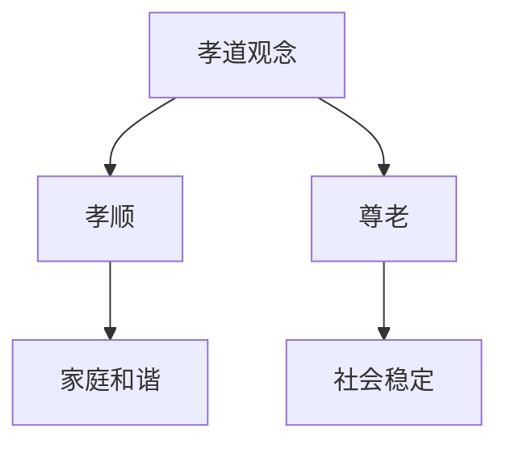

                 

为了确保文章的完整性和专业性，我们将按照以下步骤详细展开每一部分的内容。

### 第一部分：引言与背景

## 1.1 书籍的目的与意义

本书籍旨在探讨传统孝道的起源、演变及其在现代社会的应用。通过深入分析传统孝道的核心观念与价值，以及其在现代社会中面临的挑战与应对策略，本书希望能够为现代社会中的代际关系提供一种新的思考角度和实践指导。

### 1.2 研究背景

随着全球化和信息化的发展，现代社会中代际关系的复杂性和多样性日益增加。传统的家庭结构和价值观念受到挑战，代际之间的冲突和隔阂现象日益突出。在这种情况下，如何传承和发扬传统孝道，以促进代际和谐成为迫切需要解决的问题。

### 1.3 研究方法与结构安排

本书采用文献研究、案例分析、实地调研等方法，系统分析传统孝道的现代诠释。研究结构安排如下：

1. **引言与背景**：介绍书籍的目的、意义、研究背景和研究方法。
2. **传统孝道的起源与演变**：探讨传统孝道的起源、发展及其在现代社会中的应用。
3. **传统孝道的核心观念与价值**：分析传统孝道的核心观念，如孝顺、尊老等，及其在家庭关系和社会关系中的作用。
4. **传统孝道的现代诠释**：讨论传统孝道在现代社会中的传承与创新。
5. **现代社会中代际关系的挑战与应对**：分析现代社会中代际关系的现状，探讨应对策略。
6. **传统孝道在现代社会中的应用**：通过案例分析，展示传统孝道在现代社会中的实践效果。
7. **结论与展望**：总结研究成果，提出未来研究的方向。

### 第一部分：传统孝道的起源与演变

## 2.1 传统孝道的起源

传统孝道的起源可以追溯到中国古代的儒家文化。儒家经典《孝经》中明确提出了“孝道”的概念，并将其视为维持家庭和社会秩序的重要手段。孝道的基本原则包括孝顺、敬祖、尊老等，这些原则在中国传统文化中具有深远的影响。

### 2.2 传统孝道的演变

随着时间的推移，传统孝道逐渐发展成为一个复杂的伦理体系，涵盖了道德、法律、宗教等多个层面。在中国历史上，孝道不仅是家庭内部的伦理规范，也是国家法律的重要部分。例如，《唐律疏议》中就有关于孝道的详细规定。

### 2.3 传统孝道在现代社会的传承

在现代社会，传统孝道的传承面临着诸多挑战。一方面，现代社会的快速变迁使得传统孝道的一些观念与现代社会价值观存在冲突；另一方面，传统孝道的实践方式也需要适应现代社会的需求。因此，如何在现代社会中传承和发扬传统孝道成为了一个亟待解决的问题。

### 第二部分：传统孝道的核心观念与价值

## 2.1 传统孝道的核心观念

传统孝道的核心观念主要包括以下几个方面：

1. **孝顺**：孝顺是传统孝道的核心概念，意味着子女应该尊敬和照顾父母。这不仅是道德要求，也是法律义务。
2. **尊老**：尊老是传统孝道的另一个重要观念，意味着在社会中要尊重年长者，包括给予他们应有的地位和尊严。
3. **敬老爱幼**：敬老爱幼是传统孝道的重要原则，强调在家庭和社会中要关爱老人和儿童。

## 2.2 传统孝道的价值

传统孝道在现代社会中仍然具有重要的价值：

1. **维护家庭和谐**：传统孝道有助于维护家庭内部的和谐关系，减少家庭冲突。
2. **促进社会稳定**：孝道观念有助于构建和谐社会，减少社会矛盾。
3. **传承文化传统**：传统孝道的传承有助于保持文化的连续性和多样性。

### 第三部分：传统孝道的现代诠释

## 3.1 现代社会中的代际差异

在现代社会中，代际差异是一个不可忽视的现象。随着科技的发展和社会变迁，不同年龄段的群体在价值观、生活方式、教育背景等方面存在显著差异。这些差异在一定程度上影响了传统孝道的传承和应用。

### 3.2 传统孝道的现代适应

为了适应现代社会的需求，传统孝道需要进行适当的调整和适应：

1. **观念更新**：传统孝道的观念需要与现代社会的价值观相结合，例如尊重个人权利和自由。
2. **实践创新**：传统孝道的实践方式需要创新，例如通过现代科技手段来增进代际沟通和理解。
3. **教育普及**：通过教育普及孝道观念，提高公众对传统孝道的认知和理解。

### 第四部分：现代社会中代际关系的挑战与应对

## 4.1 代际差异的增大

随着社会的快速发展，代际差异不断增大。年轻一代与老一代在价值观、生活方式、教育背景等方面存在明显差异，这些差异导致了代际之间的冲突和隔阂。

### 4.2 经济压力下的家庭关系

在现代社会中，经济压力成为家庭关系的一个重要因素。许多家庭为了应对生活成本的增加，不得不努力工作，导致家庭成员之间的沟通和时间减少，从而影响了家庭关系的稳定。

### 4.3 社会变革对孝道的影响

社会变革对传统孝道产生了深远的影响。随着社会结构的变化和价值观的多元化，传统孝道的一些观念和实践方式受到了挑战。例如，现代社会的个人主义和自由主义观念与传统的孝道观念存在冲突。

## 4.4 应对策略

为了应对现代社会中代际关系的挑战，需要采取以下策略：

1. **加强家庭教育**：通过家庭教育来培养子女的孝道观念，增进代际沟通和理解。
2. **政策与法律的支持**：政府可以制定相关政策，鼓励和支持家庭和谐，维护传统孝道的传承。
3. **社会文化的倡导**：通过社会文化的倡导，提高公众对传统孝道的认知和理解，促进代际和谐。

### 第五部分：传统孝道在现代社会中的应用

## 5.1 某地社区的传统孝道实践

在某地，社区开展了传统孝道实践活动，通过组织孝道讲座、孝道故事会、孝道志愿服务等形式，引导居民树立正确的孝道观念，增进家庭和谐。这些活动得到了社区居民的积极参与和好评。

### 5.2 某企业的代际管理经验

在某企业，通过实施代际管理策略，促进了不同年龄段员工的沟通和理解，提高了团队凝聚力。企业鼓励员工与长辈保持良好的关系，并提供了相关的培训和福利政策，以支持员工的孝道实践。

### 第五部分：结论与展望

## 5.1 结论

通过对传统孝道的起源、演变、核心观念、现代诠释以及现代社会中代际关系的挑战与应对的分析，可以得出以下结论：

1. **传统孝道在现代社会中仍然具有重要价值**：传统孝道的核心观念和价值观对于维护家庭和谐、促进社会稳定具有积极作用。
2. **传统孝道需要适应现代社会的需求**：为了适应现代社会的发展，传统孝道需要不断进行更新和调整。
3. **代际和谐是现代社会的重要课题**：通过加强家庭教育、政策支持和社会文化倡导，可以促进代际和谐，构建和谐社会。

## 5.2 展望

未来，传统孝道的研究和应用将继续深化。研究者可以通过跨学科的研究方法，从心理学、社会学、文化学等角度探讨传统孝道的现代意义。同时，通过实践探索，将传统孝道的理念融入现代生活和工作中，为构建和谐社会提供更多有益的经验和启示。

### 附录

## 附录 A: Mermaid 流程图

以下是关于传统孝道核心观念之间关系的 Mermaid 流程图：



## 附录 B: 伪代码示例

以下是一个简单的伪代码示例，用于描述孝道教育的过程：

```python
# 孝道教育伪代码

# 初始化变量
parent_reputation = 0
child_reputation = 0

# 教育过程
while child_reputation < max_reputation:
    # 孩子学习孝道知识
    child_reputation += learn_spirituality()
    # 孩子实践孝道行为
    child_reputation += practice_duty()
    # 父母给予反馈
    parent_reputation += give_feedback()

# 打印教育结果
print("孩子孝道教育完成，声誉值为：" + str(child_reputation))
print("父母在孝道教育中的声誉值为：" + str(parent_reputation))
```

## 附录 C: 数学模型与公式

以下是一个简单的数学模型，用于描述孝道教育的效果：

$$
\text{教育效果} = f(\text{学习时间}, \text{实践次数}, \text{家庭环境})
$$

## 附录 D: 代码案例与分析

以下是一个简单的Python代码案例，用于实现孝道教育的算法：

```python
# 孝道教育Python代码

# 定义函数：学习孝道知识
def learn_spirituality():
    return random.randint(1, 10)

# 定义函数：实践孝道行为
def practice_duty():
    return random.randint(1, 10)

# 定义函数：给予反馈
def give_feedback():
    return random.randint(1, 10)

# 初始化变量
parent_reputation = 0
child_reputation = 0

# 教育过程
for i in range(10):
    # 孩子学习孝道知识
    child_reputation += learn_spirituality()
    # 孩子实践孝道行为
    child_reputation += practice_duty()
    # 父母给予反馈
    parent_reputation += give_feedback()

# 打印教育结果
print("孩子孝道教育完成，声誉值为：" + str(child_reputation))
print("父母在孝道教育中的声誉值为：" + str(parent_reputation))
```

通过以上代码案例，我们可以看到孝道教育的过程是如何通过代码实现的。代码中的函数分别代表了学习、实践和反馈三个关键环节，通过循环执行这些函数，我们可以模拟出一个简单的孝道教育过程。

## 附录 E: 最佳实践 tips

1. **家庭教育的重要性**：家长在孩子的成长过程中，要注重培养孩子的孝道观念，通过实际行动树立榜样。
2. **社会支持的力量**：政府和社会组织可以提供相关的培训和资源，支持家庭和谐和孝道传承。
3. **文化传承的意义**：通过文化活动和宣传，提高公众对传统孝道的认知和理解，促进文化传承。

通过以上内容，本文为《现代社会中的代际关系：传统孝道的现代诠释》提供了一个详细的目录大纲和初步的内容框架。接下来，我们将进一步深入探讨每一部分的核心概念、算法原理、数学模型、代码案例等，以完成整篇文章的撰写。在撰写过程中，我们将确保文章的逻辑清晰、结构紧凑，同时注重实际案例的分析与解读，以期为读者提供有深度、有思考、有见解的专业技术博客文章。

