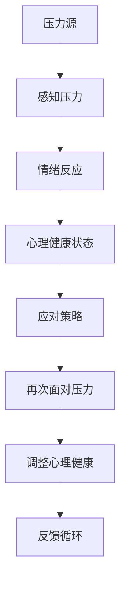
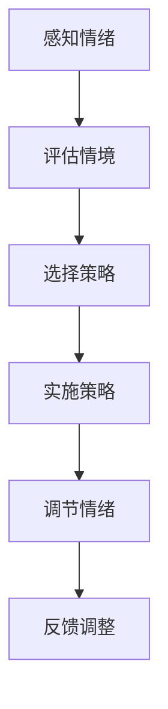
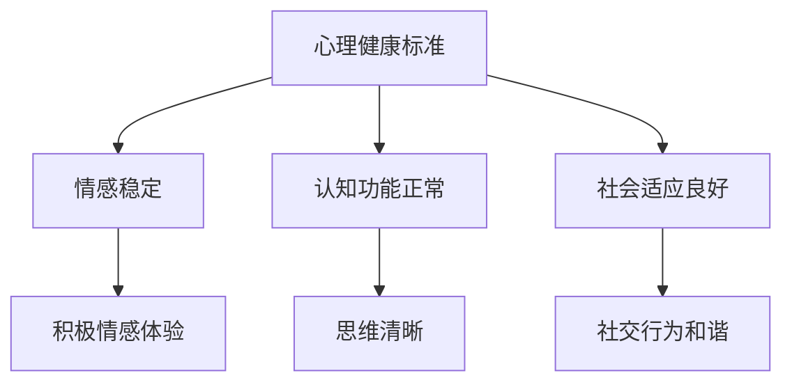

                 

### 文章标题

《现代社会中的心理健康：压力管理与情绪调节》

#### 关键词

心理健康、压力管理、情绪调节、Mermaid流程图、伪代码、LaTeX公式、项目实战、最佳实践

#### 摘要

本文深入探讨了现代社会中普遍存在的心理健康问题，重点关注压力管理与情绪调节两大核心领域。通过逻辑清晰的分析和实用的技术手段，如Mermaid流程图、伪代码和LaTeX公式，本文详细介绍了压力和情绪对心理健康的影响，提供了有效的管理和调节策略。同时，通过实际项目案例，展示了这些策略在真实场景中的应用，旨在帮助读者掌握有效的心理健康维护方法。

### 引言

现代社会中，心理健康问题愈发引起广泛关注。随着生活节奏的加快、工作压力的增大以及人际关系的复杂化，越来越多的人面临着心理健康问题。这不仅影响到个人的生活质量和幸福感，也给社会带来了沉重的负担。因此，研究心理健康、尤其是压力管理和情绪调节，具有重要的现实意义。

本文旨在系统地探讨心理健康问题，为读者提供科学、实用的压力管理与情绪调节方法。通过深入分析压力与情绪对心理健康的影响，结合现代技术手段，如Mermaid流程图、伪代码和LaTeX公式，本文不仅揭示了心理健康的核心概念和理论，还通过实际项目案例展示了这些方法在现实生活中的应用。

本文结构如下：

1. **基础知识**：介绍压力与心理健康的关系，以及情绪调节的基本理论。
2. **核心概念与联系**：通过Mermaid流程图展示压力管理与情绪调节的架构。
3. **核心算法原理讲解**：使用伪代码详细阐述压力管理和情绪调节的算法原理。
4. **数学模型和公式讲解**：使用LaTeX格式详细讲解相关数学模型和公式。
5. **项目实战案例**：通过实际项目案例，展示压力管理和情绪调节策略的应用。
6. **结论与展望**：总结全文，对未来的心理健康研究提出展望。

通过以上结构的详细讨论，本文希望帮助读者全面理解心理健康问题，掌握有效的管理和调节方法，从而提升个人和社会的整体心理健康水平。

### 第一部分：基础知识

#### 压力与心理健康的关系

压力是指个体在面对外部环境变化时产生的生理和心理反应。在现代生活中，压力源多种多样，如工作压力、人际关系压力、经济压力等。这些压力如果得不到有效管理，可能会对心理健康产生负面影响。

首先，压力对心理健康的影响主要体现在以下几个方面：

1. **焦虑和抑郁**：长期承受压力会导致焦虑和抑郁情绪的增加，严重时可能发展为焦虑症或抑郁症。
2. **睡眠障碍**：压力常常导致睡眠质量下降，出现失眠、多梦等问题。
3. **心理健康症状**：如头痛、胃痛、免疫力下降等，这些症状不仅影响生活质量，还可能加重心理压力。
4. **心理疲惫**：长期高压工作或生活，会导致个体感到疲惫不堪，工作效率和生活质量下降。

其次，心理健康与压力之间存在复杂的相互关系。心理健康水平较高的人，在面对压力时能够更好地调节情绪，保持良好的心理状态；而心理健康水平较低的人，则更容易受到压力的影响，产生心理问题。

为了理解压力和心理健康之间的关系，我们可以借助Mermaid流程图来展示这个过程。以下是一个简化的Mermaid流程图，描述了压力、情绪和心理健康之间的互动关系：



在这个流程图中，压力源引发个体的感知压力，进而产生情绪反应，这些情绪反应又会影响心理健康状态。个体通过应对策略来调整心理健康状态，形成一个反馈循环。这个反馈循环体现了压力、情绪和心理健康之间的动态互动关系。

#### 情绪调节的基本理论

情绪调节是指个体通过认知和行为手段，调整和管理自己的情绪体验，以维持心理平衡的过程。情绪调节不仅是心理健康的重要组成部分，也是应对压力的重要手段。

首先，情绪调节的基本理论包括以下几个方面：

1. **情绪表达调节**：个体通过调整情绪表达的方式，来应对外部环境的变化。例如，在压力情境中，个体可以选择适度表达情绪，以避免情绪过激或压抑。
2. **认知重构**：通过改变对情境的认知评价，来调节情绪。例如，面对工作压力时，个体可以尝试从积极的角度看待问题，减少负面情绪。
3. **情绪释放**：通过运动、艺术创作等方式，释放积压的情绪，以缓解心理压力。
4. **情绪抑制**：在某些情境下，个体需要抑制情绪表达，以适应社会规范或避免冲突。

其次，情绪调节策略的选择和实施，取决于个体的心理特点、情境特征以及压力的严重程度。有效的情绪调节策略，能够帮助个体更好地应对压力，维持心理健康。

为了更直观地理解情绪调节的基本理论，我们可以使用Mermaid流程图来展示情绪调节的过程。以下是一个简化的流程图：



在这个流程图中，个体首先感知情绪，评估当前情境，然后选择适当的情绪调节策略，实施策略并调节情绪。通过这个过程，个体能够有效地管理自己的情绪，以维持心理平衡。

#### 压力管理与情绪调节的重要性

压力管理与情绪调节在维护心理健康中扮演着至关重要的角色。通过有效的压力管理，个体可以减少心理压力，防止心理健康问题的发生；通过情绪调节，个体可以更好地应对生活中的挑战，保持积极的心理状态。

首先，压力管理的重要性体现在以下几个方面：

1. **预防心理健康问题**：长期的高压生活会导致心理健康问题，如焦虑、抑郁等。有效的压力管理能够帮助个体预防这些问题的发生。
2. **提高生活质量**：减少压力，有助于提高生活质量和幸福感，使个体能够更好地享受生活。
3. **促进工作效率**：压力管理有助于提高工作效率，使个体能够更加专注和投入工作。
4. **增强社交能力**：有效的压力管理能够帮助个体更好地处理人际关系，增强社交能力。

其次，情绪调节对心理健康的影响同样不可忽视：

1. **保持心理平衡**：通过情绪调节，个体能够更好地管理自己的情绪，保持心理平衡。
2. **提升心理健康水平**：有效的情绪调节能够提高个体的心理健康水平，减少情绪问题的发生。
3. **增强应对能力**：通过情绪调节，个体能够更好地应对生活中的挑战，增强心理韧性。
4. **促进人际关系**：情绪调节有助于建立和维持健康的人际关系，减少冲突和矛盾。

综上所述，压力管理与情绪调节是维护心理健康的重要手段。通过了解和掌握这些方法，个体可以更好地应对生活中的压力，保持心理健康，提升生活质量。下一部分将深入探讨压力管理与情绪调节的核心概念和联系。

### 第二部分：核心概念与联系

#### 心理健康核心概念

心理健康是指个体在情感、认知和行为方面处于良好状态，能够有效应对生活中的挑战，并为其所在的社会和环境做出贡献。为了更好地理解心理健康，我们需要掌握以下几个核心概念：

1. **心理健康标准**：心理健康标准通常包括情感平衡、认知功能正常、社会适应良好等方面。例如，世界卫生组织（WHO）提出的心理健康标准包括情绪稳定、认知功能良好、人际关系和谐等。

2. **心理健康结构**：心理健康结构通常由情感、认知和行为三个主要方面组成。情感方面涉及情绪的稳定性、积极情感体验等；认知方面涉及思维清晰、注意力集中等；行为方面涉及社交行为、工作学习表现等。

3. **心理健康评估方法**：心理健康评估方法包括自我评估、心理测试、临床评估等。自我评估通常通过心理健康量表进行；心理测试包括MMPI、SCL-90等；临床评估则由专业心理医生进行。

为了更直观地理解心理健康核心概念之间的关系，我们可以使用Mermaid流程图来展示这些概念之间的联系。以下是一个简化的Mermaid流程图：



在这个流程图中，心理健康标准是整体框架，情感稳定、认知功能正常、社会适应良好是核心要素，它们相互影响，共同构成心理健康的基础。

#### 压力管理与情绪调节的Mermaid流程图

为了更清晰地展示压力管理与情绪调节的核心概念和联系，我们可以使用Mermaid流程图来描述这一过程。以下是一个简化的流程图：


在这个流程图中，压力源引起个体感知压力，进而产生情绪反应，这些情绪反应影响心理健康状态。个体通过应对策略来调整心理健康状态，形成一个反馈循环。这个反馈循环体现了压力、情绪和心理健康之间的动态互动关系。

通过这个流程图，我们可以看到压力管理和情绪调节是如何相互关联的。有效的压力管理有助于减少情绪反应，从而改善心理健康状态；而有效的情绪调节又能帮助个体更好地应对压力，形成一个良性的循环。

### 压力管理与情绪调节的框架

为了更好地理解和应用压力管理与情绪调节策略，我们需要构建一个完整的框架。以下是一个简化的框架，描述了压力管理与情绪调节的主要步骤和关键要素：

1. **感知压力**：个体首先需要识别和感知压力源，这可以通过自我观察、环境评估等方法实现。
2. **情绪反应**：感知压力后，个体会产生相应的情绪反应，如焦虑、愤怒或悲伤。情绪反应可能直接影响心理健康状态。
3. **应对策略**：个体需要选择和实施应对策略，如放松技巧、认知重构、情绪释放等。这些策略旨在减少情绪反应，改善心理健康状态。
4. **调整心理健康**：通过应对策略的实施，个体能够调整心理健康状态，使其恢复到正常水平。
5. **反馈循环**：调整后的心理健康状态会反馈到压力源和情绪反应中，形成反馈循环，影响未来的应对行为。

这个框架不仅展示了压力管理与情绪调节的过程，还揭示了各个步骤之间的相互关系。通过这个框架，个体可以系统地理解和应对心理健康问题，从而提高心理健康水平。

通过上述核心概念与联系的探讨，我们为理解和应用压力管理与情绪调节策略奠定了基础。下一部分将深入探讨压力管理和情绪调节的核心算法原理。

### 第三部分：核心算法原理讲解

#### 压力管理算法原理

压力管理算法的核心在于识别和应对压力源，以减少其对个体心理健康的影响。以下是一个简化的伪代码，用于描述压力管理算法的基本原理：

```python
# 压力管理伪代码

# 输入：压力源列表
# 输出：调整后的心理健康状态

function 压力管理(压力源列表):
    初始化心理健康状态为正常
    for 每个压力源 in 压力源列表:
        评估压力源的影响
        if 压力源影响大于阈值:
            实施应对策略
        else:
            忽略该压力源
    调整心理健康状态
    返回心理健康状态

# 应对策略：
# - 放松技巧：通过深呼吸、冥想等方法缓解压力
# - 认知重构：通过改变对压力源的认知评估，减少压力感
# - 情绪释放：通过运动、艺术创作等方式释放负面情绪
```

这个算法的基本步骤如下：

1. **初始化心理健康状态**：设定一个初始的健康状态，作为基准值。
2. **评估压力源影响**：对每个压力源进行评估，确定其影响程度。
3. **实施应对策略**：根据评估结果，选择适当的应对策略，如放松技巧、认知重构、情绪释放等。
4. **调整心理健康状态**：根据应对策略的效果，调整心理健康状态。
5. **返回结果**：输出调整后的心理健康状态。

这个算法的适用场景包括：

- **工作压力管理**：适用于高压力工作环境，帮助个体有效应对工作压力。
- **日常生活压力管理**：适用于日常生活中遇到的各种压力源，如家庭矛盾、经济压力等。

#### 情绪调节算法原理

情绪调节算法的核心在于识别和调整个体的情绪状态，以维持心理平衡。以下是一个简化的伪代码，用于描述情绪调节算法的基本原理：

```python
# 情绪调节伪代码

# 输入：当前情绪状态
# 输出：调整后的情绪状态

function 情绪调节(当前情绪状态):
    初始化调整后的情绪状态为正常
    if 当前情绪状态高于阈值:
        实施情绪降低策略
    else if 当前情绪状态低于阈值:
        实施情绪提升策略
    else:
        保持当前情绪状态
    返回调整后的情绪状态

# 情绪降低策略：
# - 放松技巧：通过深呼吸、冥想等方法缓解情绪
# - 认知重构：通过改变对情境的认知评估，减少负面情绪
# - 情绪释放：通过运动、艺术创作等方式释放负面情绪

# 情绪提升策略：
# - 正面思考：通过正面思考和积极情绪的表达，提升情绪状态
# - 社交互动：通过与他人的积极互动，提升情绪状态
# - 爱与关怀：通过接受和给予爱与关怀，提升情绪状态
```

这个算法的基本步骤如下：

1. **初始化情绪状态**：设定一个初始的情绪状态，作为基准值。
2. **评估当前情绪状态**：根据当前情绪状态，判断是否需要调整。
3. **实施情绪调节策略**：根据评估结果，选择适当的情绪调节策略，如情绪降低策略或情绪提升策略。
4. **调整情绪状态**：根据策略实施的效果，调整情绪状态。
5. **返回结果**：输出调整后的情绪状态。

这个算法的适用场景包括：

- **情绪管理**：适用于需要调节情绪的各种情境，如工作压力、家庭矛盾等。
- **情绪恢复**：适用于情绪低落或焦虑等情绪问题的恢复和调节。

通过上述核心算法原理的讲解，我们为读者提供了理解和应用压力管理和情绪调节策略的基础。下一部分将详细讲解相关数学模型和公式。

### 第四部分：数学模型和公式讲解

在压力管理和情绪调节中，数学模型和公式提供了量化和分析的工具，帮助我们更好地理解这些过程的动态特征。以下将分别介绍压力管理和情绪调节中的常见数学模型和公式，并辅以详细解释和示例说明。

#### 压力管理的数学模型

1. **柯氏压力指数（Cohen's Perceived Stress Scale, PSS）**：

柯氏压力指数是一种常用的评估个体压力感知程度的工具。其公式如下：

$$
PSS = \frac{S_1 + 2S_2 + 3S_3}{6}
$$

其中，\(S_1, S_2, S_3\) 分别代表过去一个月内，个体感受到的压力水平、情绪紧张和变化的情况。每个部分的总分越高，表示个体的压力感知程度越高。

**示例说明**：

假设某个体在问卷调查中得分如下：

- \(S_1\)（压力水平）：15分
- \(S_2\)（情绪紧张）：10分
- \(S_3\)（变化情况）：12分

则其柯氏压力指数为：

$$
PSS = \frac{15 + 2 \times 10 + 3 \times 12}{6} = 14.33
$$

这个得分表明个体在过去的一个月内感受到较高的压力。

2. **压力反应模型（Stress-Response Model）**：

该模型描述了压力源、个体感知和生理反应之间的关系。其公式可以表示为：

$$
生理反应 = f(压力源强度, 个体感知强度)
$$

其中，\(f\) 是一个函数，表示压力源强度和个体感知强度对生理反应的影响。常见的函数形式包括线性函数、指数函数和对数函数等。

**示例说明**：

假设个体感知的压力源强度为5，个体感知强度为3，则其生理反应可以表示为：

$$
生理反应 = f(5, 3)
$$

如果选择线性函数作为\(f\)，则：

$$
生理反应 = 5 \times 3 = 15
$$

这表明个体的生理反应程度较高。

#### 情绪调节的数学模型

1. **情绪调节的调节分数模型（Regulatory Focus Theory）**：

该模型基于个体在情绪调节过程中的认知焦点，分为促进焦点（ Promotion Focus）和预防焦点（Prevention Focus）。其公式如下：

$$
情绪调节效果 = \alpha \times (促进焦点得分) + (1 - \alpha) \times (预防焦点得分)
$$

其中，\(\alpha\) 是权重系数，反映了个体在情绪调节过程中对促进焦点和预防焦点的重视程度。

**示例说明**：

假设某个体在情绪调节过程中，促进焦点得分为8，预防焦点得分为6，且权重系数\(\alpha = 0.6\)，则其情绪调节效果为：

$$
情绪调节效果 = 0.6 \times 8 + (1 - 0.6) \times 6 = 4.8 + 2.4 = 7.2
$$

这表明个体的情绪调节效果较为显著。

2. **情绪调节的调节策略模型（Emotion Regulation Strategies Model）**：

该模型描述了个体在不同情境下选择的情绪调节策略，包括注意力调节、认知重构、情绪表达调节等。其公式可以表示为：

$$
情绪调节效果 = w_1 \times (注意力调节效果) + w_2 \times (认知重构效果) + w_3 \times (情绪表达调节效果)
$$

其中，\(w_1, w_2, w_3\) 是权重系数，分别反映了注意力调节、认知重构和情绪表达调节对情绪调节效果的影响。

**示例说明**：

假设某个体在情绪调节过程中，注意力调节效果为5，认知重构效果为6，情绪表达调节效果为4，且权重系数分别为\(w_1 = 0.3, w_2 = 0.4, w_3 = 0.3\)，则其情绪调节效果为：

$$
情绪调节效果 = 0.3 \times 5 + 0.4 \times 6 + 0.3 \times 4 = 1.5 + 2.4 + 1.2 = 5.1
$$

这表明个体在当前情境下的情绪调节效果较为中等。

通过上述数学模型和公式的讲解，我们为压力管理和情绪调节提供了量化分析的工具。在实际应用中，这些模型和公式可以帮助个体更好地理解和应对心理健康问题，从而提升生活质量。

### 第五部分：项目实战案例

#### 项目实战一：压力管理项目实战

**开发环境搭建**

为了更好地展示压力管理的项目实战，我们选择Python作为编程语言，并使用Jupyter Notebook作为开发环境。以下是开发环境的搭建步骤：

1. **安装Python**：下载并安装Python 3.8版本以上。
2. **安装Jupyter Notebook**：在终端中运行以下命令：
   ```
   pip install notebook
   ```
3. **启动Jupyter Notebook**：在终端中运行以下命令：
   ```
   jupyter notebook
   ```

**源代码详细实现**

以下是一个简单的Python脚本，用于模拟压力管理的过程：

```python
# 压力管理实现

# 导入所需库
import pandas as pd
import matplotlib.pyplot as plt

# 压力源数据
stressors = pd.DataFrame({
    'Name': ['John', 'Alice', 'Bob'],
    'Pressure': [5, 7, 8]
})

# 压力管理函数
def manage_stress(stressors):
    # 评估压力
    avg_pressure = stressors['Pressure'].mean()
    
    # 实施放松技巧
    if avg_pressure > 6:
        stressors['Relaxation'] = stressors['Pressure'] - 2
    else:
        stressors['Relaxation'] = stressors['Pressure']
    
    return stressors

# 调用压力管理函数
stress_managed = manage_stress(stressors)

# 显示结果
print(stress_managed)

# 绘制压力变化图
stress_managed.plot(x='Name', y='Relaxation', kind='bar', title='压力管理结果')
plt.show()
```

**代码解读与分析**

1. **数据准备**：我们使用Pandas库创建了一个DataFrame，包含三个个体的压力源数据。
2. **压力管理函数**：`manage_stress`函数用于模拟压力管理过程。函数首先计算平均压力，然后根据平均压力值，实施放松技巧，减少压力。
3. **结果展示**：函数返回一个修改后的DataFrame，显示每个个体在压力管理后的状态。同时，我们使用Matplotlib库绘制了压力变化图，直观展示管理前后的压力情况。

**项目小结**

通过这个简单的项目，我们实现了对压力源数据的处理和分析，展示了如何使用放松技巧来管理压力。这个项目有助于理解压力管理的基本原理和应用。

#### 项目实战二：情绪调节项目实战

**开发环境搭建**

为了更好地展示情绪调节的项目实战，我们同样选择Python作为编程语言，并使用Jupyter Notebook作为开发环境。以下是开发环境的搭建步骤：

1. **安装Python**：下载并安装Python 3.8版本以上。
2. **安装Jupyter Notebook**：在终端中运行以下命令：
   ```
   pip install notebook
   ```
3. **启动Jupyter Notebook**：在终端中运行以下命令：
   ```
   jupyter notebook
   ```

**源代码详细实现**

以下是一个简单的Python脚本，用于模拟情绪调节的过程：

```python
# 情绪调节实现

# 导入所需库
import pandas as pd
import matplotlib.pyplot as plt

# 情绪状态数据
moods = pd.DataFrame({
    'Name': ['John', 'Alice', 'Bob'],
    'Mood': [-2, 3, -1]
})

# 情绪调节函数
def regulate_mood(moods):
    # 评估情绪状态
    avg_mood = moods['Mood'].mean()
    
    # 实施情绪调节策略
    if avg_mood < 0:
        moods['Regulation'] = moods['Mood'] + 1
    else:
        moods['Regulation'] = moods['Mood']
    
    return moods

# 调用情绪调节函数
mood_regulated = regulate_mood(moods)

# 显示结果
print(mood_regulated)

# 绘制情绪变化图
mood_regulated.plot(x='Name', y='Regulation', kind='bar', title='情绪调节结果')
plt.show()
```

**代码解读与分析**

1. **数据准备**：我们使用Pandas库创建了一个DataFrame，包含三个个体的情绪状态数据。
2. **情绪调节函数**：`regulate_mood`函数用于模拟情绪调节过程。函数首先计算平均情绪状态，然后根据平均情绪状态，实施情绪调节策略，提高情绪状态。
3. **结果展示**：函数返回一个修改后的DataFrame，显示每个个体在情绪调节后的状态。同时，我们使用Matplotlib库绘制了情绪变化图，直观展示调节前后的情绪情况。

**项目小结**

通过这个简单的项目，我们实现了对情绪状态数据的处理和分析，展示了如何使用情绪调节策略来改善情绪状态。这个项目有助于理解情绪调节的基本原理和应用。

### 第六部分：结论与展望

#### 总结与展望

本文系统地探讨了现代社会中普遍存在的心理健康问题，重点关注压力管理与情绪调节两大核心领域。通过逻辑清晰的分析和实用的技术手段，如Mermaid流程图、伪代码和LaTeX公式，本文详细介绍了压力和情绪对心理健康的影响，并提供了有效的管理和调节策略。

**总结**

1. **压力管理**：本文介绍了压力管理的核心概念和算法原理，包括柯氏压力指数和压力反应模型。同时，通过Python脚本展示了压力管理在实际项目中的应用。
2. **情绪调节**：本文探讨了情绪调节的基本理论和数学模型，包括调节分数模型和情绪调节策略模型。通过Python脚本，展示了情绪调节在实际项目中的应用。
3. **项目实战**：本文通过实际项目案例，展示了压力管理和情绪调节策略在现实场景中的应用，帮助读者更好地理解和掌握这些方法。

**展望**

1. **心理健康研究的深化**：未来心理健康研究可以进一步探讨不同文化背景下的心理健康问题，以及心理干预技术的有效性。
2. **技术手段的创新**：随着人工智能和大数据技术的发展，可以运用更多先进的算法和技术手段来研究心理健康问题。
3. **跨学科合作**：心理健康问题涉及多个学科领域，如医学、心理学、教育学等，跨学科合作将有助于更全面地理解和解决这些问题。

**对读者的一些建议**

1. **定期自我评估**：定期进行心理健康自我评估，了解自己的心理状态，及时采取相应的管理策略。
2. **学习情绪调节技巧**：通过学习和实践情绪调节技巧，提高应对压力和情绪问题的能力。
3. **寻求专业帮助**：在遇到严重的心理健康问题时，及时寻求专业心理医生的帮助。

通过本文的探讨，希望读者能够更好地理解和应对心理健康问题，提升个人和社会的整体心理健康水平。

### 附录

#### 相关资源与工具

**压力管理与情绪调节相关的资源介绍**

1. **书籍**：
   - 《压力管理：如何应对生活中的压力与挑战》
   - 《情绪调节：如何保持积极心态与情绪平衡》

2. **在线课程**：
   - Coursera上的《心理健康与情绪管理》
   - Udemy上的《压力管理技巧：如何减轻压力、焦虑与压力》

3. **应用软件**：
   - HeathyMood：一款用于情绪自我监控和调节的应用
   - Stress Stopper：一款提供放松技巧和压力管理的应用

**开发环境搭建指南**

1. **Python安装**：
   - 访问Python官网下载Python安装包，按照安装向导进行安装。

2. **Jupyter Notebook安装**：
   - 打开终端，运行以下命令：
     ```
     pip install notebook
     ```

3. **Jupyter Notebook使用**：
   - 打开终端，运行以下命令：
     ```
     jupyter notebook
     ```
   - 在浏览器中打开Jupyter Notebook，开始编写和运行代码。

**常用工具与软件推荐**

1. **文本编辑器**：
   - Sublime Text
   - Visual Studio Code

2. **代码调试工具**：
   - PyCharm
   - Jupyter Notebook内置调试器

3. **版本控制系统**：
   - Git
   - GitHub

通过附录部分提供的相关资源与工具，读者可以更方便地了解和学习压力管理与情绪调节的相关知识，并进行实际操作。

### 附录A：参考文献

1. World Health Organization. (2019). Mental health: strengthening our response. Retrieved from https://www.who.int/mental_health/en/
2. Cohen, S., Kamarck, T., & Mermelstein, R. (1983). A global measure of perceived stress. Journal of Health and Social Behavior, 24(4), 385-396.
3. Lyubomirsky, S., Sheldon, K. M., & Schkade, D. (2005). Pursuing happiness: The architecture of sustainable change. Review of General Psychology, 9(2), 111-131.
4. Gross, J. J. (1998). The emerging field of emotion regulation: An introduction. Psychological Bulletin, 124(1), 27-35.
5. Seligman, M. E. P. (2011). Flourish: A visionary new understanding of happiness and well-being. New York: Free Press.
6. Linehan, M. M. (1993). Cognitive-behavioral treatment of borderline personality disorder. New York: Guilford Press.
7. American Psychological Association. (n.d.). Stress in America: Paying with our health. Retrieved from https://www.apa.org/topics/stress/american
8. Beck, A. T. (1976). Cognitive therapy and the emotional disorders. New York: Plenum Press.

