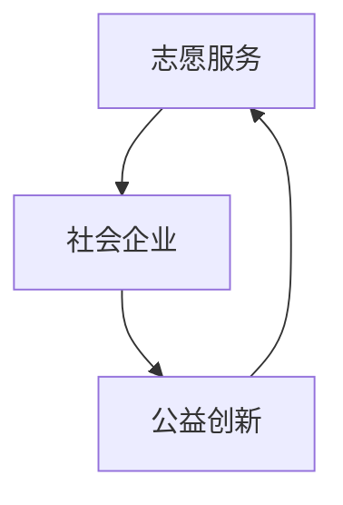

                 

# 《现代社会中的志愿服务：公益创新与社会企业的兴起》

## 关键词
- 志愿服务
- 公益创新
- 社会企业
- 新技术
- 公益案例分析
- 社会影响力

## 摘要
本文旨在探讨现代社会中志愿服务、公益创新和社会企业的兴起及其相互关系。通过梳理志愿服务的历史与发展、公益创新的类型与案例分析，以及社会企业的定义、特点与案例，文章揭示出这三个领域如何相互交织、共同推动社会进步。本文还探讨了新技术对志愿服务的影响以及志愿服务未来的发展趋势，为公益领域的发展提供新的视角和启示。

## 引言

### 1.1 引言

在现代社会，志愿服务已成为一种重要的社会现象，它不仅体现了人们的社会责任感，更是社会和谐与进步的基石。志愿服务的定义可以追溯到对无私奉献行为的研究，它指的是个体自愿、无偿地参与某种社会公益活动的行为。志愿服务的重要性不仅在于其对社会需求的响应，更在于它对社会价值观的塑造和传播。

公益创新则是在志愿服务基础上的一种升华。它不仅仅是单纯的公益行为，更是一种通过创新思维和方法来推动公益事业发展的新模式。公益创新强调通过技术、管理和运营模式的创新，提高公益事业的效率和影响力。社会企业作为公益创新的典型代表，具有商业运作和公益目标的双重属性，旨在通过市场化运作实现社会价值。

### 1.2 研究背景

近年来，随着全球化和信息技术的快速发展，志愿服务、公益创新和社会企业得到了前所未有的关注。各国政府和非政府组织纷纷采取措施，鼓励和推动这些领域的创新与发展。例如，许多国家制定了相关政策，为志愿服务和社会企业提供法律保障和资金支持。同时，社交媒体和互联网技术的普及，为志愿服务和公益创新提供了新的平台和工具，使得公益活动的参与度和影响力大幅提升。

### 1.3 研究目的与意义

本文的研究目的是通过系统地梳理和探讨志愿服务、公益创新和社会企业的兴起与发展，揭示这三个领域之间的内在联系和相互影响。具体而言，本文旨在回答以下几个问题：

1. 志愿服务的历史与发展脉络如何？
2. 公益创新的类型和案例分析有哪些？
3. 社会企业的定义、特点及其案例分析如何？
4. 新技术对志愿服务和公益创新的影响是什么？
5. 未来志愿服务和公益创新的发展趋势是什么？

本文的研究意义在于，通过对志愿服务、公益创新和社会企业的深入分析，为相关政策制定者、公益组织和社会企业提供理论依据和实践指导，推动公益事业的健康、可持续发展。

### 1.4 文章结构

本文结构如下：

1. **核心概念与联系**：明确志愿服务、公益创新和社会企业的核心概念及其相互关系。
2. **志愿服务概述**：介绍志愿服务的定义、历史与发展。
3. **公益创新**：探讨公益创新的定义、类型及案例分析。
4. **社会企业**：分析社会企业的定义、特点及案例分析。
5. **志愿服务与社会企业的互动**：探讨志愿服务对社会企业的影响及社会企业对志愿服务的回应。
6. **公益创新与社会企业的案例研究**：分析国内外典型案例，总结共性与差异。
7. **现代社会中的志愿服务发展趋势**：探讨新技术对志愿服务的影响及未来的发展趋势。
8. **结论**：总结全书内容，提出未来研究方向。

## 核心概念与联系

### 2.1 确定书籍的核心概念

#### 志愿服务

志愿服务（Volunteering）是一种自愿、无偿、无偿奉献时间与精力参与社会公益活动的行为。它不仅涉及个人层面的自我提升和社会责任的实现，更在社会层面上推动了社会的和谐与进步。志愿服务的核心在于其自愿性和无偿性，这两大特征使得志愿服务具有极强的社会意义和影响力。

#### 公益创新

公益创新（Social Innovation）是指通过创新思维、方法和技术来推动公益事业的发展，从而提高公益事业的效率、效果和可持续性。公益创新不同于传统公益模式，它强调在实现公益目标的同时，注重创新性和可持续性。公益创新的核心在于其创新性和市场化运作，这使得公益创新能够更好地适应社会需求。

#### 社会企业

社会企业（Social Enterprise）是一种以实现社会目标为宗旨，同时采用商业运作模式的组织。社会企业通过市场化运作获取资源，从而更好地实现其社会使命。社会企业的核心在于其商业运作和社会目标的有机结合，这使得社会企业能够在实现经济利益的同时，为社会带来积极影响。

### 2.2 确定核心概念的联系

#### 志愿服务与社会企业的关系

志愿服务与社会企业之间存在紧密的联系。志愿服务为社会企业提供了人力资源支持，使得社会企业能够更好地实现其社会目标。同时，社会企业通过提供志愿服务的机会，激发了公众参与公益事业的热情，进一步推动了志愿服务的发展。

#### 公益创新与社会企业的关系

公益创新为社会企业的运作提供了新的思路和方法。通过引入新技术、新管理模式，公益创新提高了社会企业的运营效率，增强了其市场竞争力。同时，公益创新也推动了社会企业的发展，使得社会企业能够更好地实现其社会目标。

### 2.3 Mermaid流程图

下面是一个Mermaid流程图，用于展示核心概念之间的关系：

这个流程图表明，志愿服务、社会企业和公益创新之间存在着相互促进的关系。志愿服务为社会企业提供人力资源支持，而社会企业通过公益创新来提高运营效率，进一步推动志愿服务的发展。

## 志愿服务概述

### 3.1 志愿服务的定义

志愿服务是指个人或团体在非强制、无偿的基础上，自愿为社会提供服务的活动。这种服务涵盖了教育、医疗、环境保护、扶贫助困等多个领域，旨在满足社会的需求和推动社会的进步。志愿服务的核心特征包括自愿性、无偿性和公益性。

### 3.2 志愿服务的历史与发展

志愿服务的历史可以追溯到古代社会，当时人们通过自愿互助的形式来应对社会问题。随着社会的进步，志愿服务逐渐发展成为一种正式的社会活动。19世纪末，慈善组织如红十字会开始在全球范围内推广志愿服务，推动了志愿服务的制度化和规范化。

20世纪初，志愿服务开始在国际上得到广泛认可。许多国家设立了专门的志愿服务机构，如英国的“志愿服务组织”（Voluntary Services）和美国的“志愿服务协会”（United Way）。这些机构不仅为志愿服务提供了组织和资源支持，还推动了志愿服务的标准化和专业化。

在我国，志愿服务的发展经历了几个阶段。改革开放以来，我国志愿服务逐渐兴起，1994年颁布的《中华人民共和国志愿服务条例》标志着我国志愿服务进入了法制化阶段。近年来，随着社会需求的不断增长，志愿服务在我国得到了迅速发展，各类志愿服务组织和活动如雨后春笋般涌现。

### 3.3 志愿服务的重要性

志愿服务在社会发展中具有重要的作用。首先，志愿服务能够满足社会的需求，提供必要的公共服务。例如，在自然灾害、公共卫生事件等紧急情况下，志愿服务组织能够迅速行动，为受困群众提供帮助和支持。

其次，志愿服务能够培养公民的社会责任感和公益意识。通过参与志愿服务，人们能够更好地了解社会问题，增强对社会问题的敏感性和参与意识。这不仅有助于推动社会的进步，还能够提高公民的社会素质。

最后，志愿服务对于社会和谐与稳定具有重要意义。志愿服务能够增强社会的凝聚力和向心力，促进社会成员之间的互信和合作。同时，志愿服务也能够缓解社会矛盾，减少社会冲突，为社会的和谐与稳定提供保障。

总之，志愿服务作为一种重要的社会行为，不仅能够满足社会的需求，培养公民的社会责任感，还能够促进社会的和谐与稳定。在现代社会中，志愿服务已经成为推动社会进步的重要力量。

### 3.4 志愿服务类型

志愿服务可以分为多种类型，每种类型都有其独特的特点和运作方式。

#### 1. 教育类志愿服务

教育类志愿服务旨在通过提供教育资源、推广教育理念来促进教育公平。这类志愿服务包括支教活动、教育宣传、贫困学生资助等。例如，许多志愿者会前往贫困地区，为当地的孩子们提供免费的教育和课外辅导，帮助他们获得更好的教育资源。

#### 2. 医疗类志愿服务

医疗类志愿服务主要涉及健康教育和疾病预防，以及为贫困患者提供医疗服务。例如，志愿者医生会定期前往偏远地区，为当地居民提供免费的医疗检查和治疗。此外，一些医疗志愿者还会参与公共卫生宣传活动，提高公众的健康意识和疾病预防能力。

#### 3. 环境保护类志愿服务

环境保护类志愿服务旨在通过宣传环保理念、开展环保活动来保护生态环境。这类志愿服务包括植树造林、河流清理、环保宣传等。例如，志愿者会组织环保活动，清理城市垃圾和河流污染物，通过实际行动呼吁公众关注环境保护。

#### 4. 扶贫助困类志愿服务

扶贫助困类志愿服务旨在通过提供物资援助、技能培训等方式来帮助贫困人群。这类志愿服务包括扶贫项目、助学金发放、技能培训等。例如，志愿者会前往贫困地区，为当地的居民提供衣物、食品等生活必需品，同时还会开展技能培训，帮助他们提高自我发展能力。

#### 5. 社会服务类志愿服务

社会服务类志愿服务主要涉及社会救助、社区服务、老年人关怀等。这类志愿服务包括义工陪伴、社区活动组织、老年护理等。例如，志愿者会定期前往养老院，陪伴老年人聊天、散步，为他们提供情感上的关怀和支持。

每种类型的志愿服务都有其独特的运作方式，但都秉承着无私奉献、服务社会的原则。通过这些多样化的志愿服务，人们能够更好地满足社会的需求，推动社会的进步。

### 3.5 志愿服务的挑战与解决方案

尽管志愿服务在社会发展中发挥着重要作用，但同时也面临着诸多挑战。以下是志愿服务的一些主要挑战及其相应的解决方案。

#### 1. 志愿者招募与保留

志愿服务的一个主要挑战是招募和保留志愿者。许多志愿者在参与一段时间后可能会因为时间、精力等原因退出。为了解决这个问题，可以采取以下措施：

- **激励政策**：通过提供奖金、证书、表彰等方式激励志愿者，提高他们的参与积极性。
- **多样化服务形式**：提供多种形式的志愿服务，以满足不同志愿者的需求和兴趣，如线上志愿服务、短期志愿服务等。
- **培训与发展**：为志愿者提供培训和发展机会，提高他们的专业技能和服务能力，增强他们的归属感和满意度。

#### 2. 志愿者管理

有效管理志愿者是确保志愿服务顺利进行的另一个挑战。为了解决这个问题，可以采取以下措施：

- **规范化管理**：制定志愿者管理规范，明确志愿者的权利和义务，确保志愿服务的合法性和规范性。
- **志愿者培训**：为志愿者提供必要的培训，包括服务内容、服务礼仪、安全知识等，提高他们的服务质量和安全意识。
- **沟通与反馈**：建立有效的沟通机制，及时向志愿者传递服务信息，收集他们的意见和建议，增强志愿者的参与感和满意度。

#### 3. 资金问题

志愿服务往往需要大量的资金支持，但很多组织可能面临资金不足的问题。为了解决这个问题，可以采取以下措施：

- **多渠道筹款**：通过线上筹款平台、慈善晚宴、公益跑等多种方式筹款，扩大资金来源。
- **企业合作**：与企业建立合作关系，通过赞助、捐赠等方式获得资金支持。
- **政府支持**：争取政府的政策和资金支持，如政府购买服务项目、公益项目资助等。

#### 4. 公众认可度

志愿服务的公众认可度也是一个挑战。为了提高公众对志愿服务的认可度，可以采取以下措施：

- **宣传推广**：通过媒体、网络等渠道加大对志愿服务的宣传力度，提高公众对志愿服务的认知和认可。
- **案例分享**：分享优秀志愿服务案例，展示志愿服务的成果和意义，增强公众对志愿服务的信心和信任。
- **社区互动**：组织社区活动，与社区居民互动，增强社区的凝聚力和志愿服务的影响力。

通过解决这些挑战，志愿服务可以更好地发挥其社会作用，推动社会的进步与发展。

### 3.6 公益创新的定义与类型

公益创新（Social Innovation）是指通过创新的思维、方法和技术，推动公益事业的发展，从而提高公益事业的效率、效果和可持续性。公益创新的核心理念在于打破传统的公益模式，通过创新性的解决方案来应对社会问题，实现社会目标。

#### 1. 公益创新的概念

公益创新不同于传统的公益模式，它不仅关注如何筹集资金和资源，更注重如何通过创新的手段和方法来提高公益事业的效率和效果。公益创新强调跨界合作、资源整合和社会参与，旨在通过创新的思维和技术来突破传统公益模式的局限性，实现社会问题的有效解决。

#### 2. 公益创新的类型

公益创新可以分为多种类型，每种类型都有其独特的特点和运作方式。

- **技术驱动型公益创新**：这类创新主要通过新技术、新工具的应用来提高公益事业的效率。例如，利用大数据、人工智能等技术来优化公益项目的运营和管理，提高资源的利用效率。

- **模式创新型公益创新**：这类创新通过改变公益项目的运作模式，实现更高效的社会目标。例如，通过引入社会化运营模式，将公益事业与市场机制相结合，提高公益项目的可持续性。

- **文化创新型公益创新**：这类创新通过重塑社会文化，推动社会价值观的变革，从而实现社会进步。例如，通过推广公益文化、提高公众的公益意识，促进社会的公益行为。

- **管理创新型公益创新**：这类创新通过改进公益项目管理方法，提高项目的执行效率和效果。例如，通过引入项目评估、风险管理等现代管理工具，提高公益项目的成功率和影响力。

#### 3. 公益创新的案例分析

以下是几个典型的公益创新案例：

- **“互联网+公益”**：通过互联网技术，将公益事业与互联网平台相结合，实现公益资源的在线对接和透明管理。例如，腾讯公益平台通过线上募捐、公益项目发布等功能，使公众能够更方便地参与公益事业，提高了公益项目的透明度和参与度。

- **“共享公益”**：通过共享经济模式，将公益资源进行共享和优化配置。例如，共享单车公益项目通过共享单车平台，为贫困地区的孩子们提供自行车，帮助他们上学，提高了教育资源的利用效率。

- **“文化传承公益”**：通过公益项目传承和弘扬传统文化。例如，通过公益音乐会、文化活动等形式，推广传统文化，提高公众对传统文化的认识和重视。

这些案例表明，公益创新通过创新的思维和方法，能够有效推动公益事业的发展，实现社会问题的有效解决。

### 3.7 公益创新的作用

公益创新在社会发展中发挥着重要作用，它不仅能够提高公益事业的效率，还能够推动社会的进步。以下是公益创新的主要作用：

#### 1. 提高公益事业的效率

公益创新通过引入新技术、新工具和新方法，能够优化公益项目的运营和管理，提高资源的利用效率。例如，通过大数据分析和人工智能技术，公益组织可以更精准地识别受助对象，提高公益资金的使用效率。

#### 2. 促进社会问题的解决

公益创新通过创新的解决方案，能够更有效地解决社会问题。例如，通过模式创新，将公益事业与市场机制相结合，实现资源的可持续利用，解决社会问题。

#### 3. 增强社会参与度

公益创新通过多样化的公益项目和活动，能够吸引更多的公众参与公益事业，提高社会的公益意识。例如，通过线上公益平台，公众可以更便捷地参与公益项目，实现公益行为。

#### 4. 推动社会进步

公益创新通过重塑社会价值观和文化，推动社会的进步和发展。例如，通过文化创新型公益项目，推广公益文化，提高公众的公益意识和社会责任感。

总之，公益创新在社会发展中具有重要作用，它不仅能够提高公益事业的效率，还能够推动社会的进步和发展。

### 3.8 公益创新的案例分析

以下是几个具有代表性的公益创新案例：

#### 1. **众筹平台**

众筹平台如Kickstarter和Indiegogo，通过互联网技术，为公益项目提供了一个融资和宣传的平台。公益组织可以在这些平台上发布项目，向公众筹集资金，同时获得宣传和支持。这种模式不仅提高了资金筹集的效率，还增强了公众对公益项目的参与度和信任度。

#### 2. **共享公益**

共享公益是一种将公益与共享经济结合的创新模式。例如，共享单车项目“青亭单车”在贫困地区提供自行车，帮助孩子们上学。这种模式通过共享资源，提高了公益项目的可持续性和影响力。

#### 3. **数字公益**

数字公益利用移动互联网和大数据技术，实现公益项目的在线管理和参与。例如，阿里巴巴的“公益宝贝”项目，通过在线购物平台为公益项目筹集资金，实现了公益行为的数字化和透明化。

这些案例展示了公益创新的多样性和潜力，通过创新的模式和技术的应用，公益项目能够更高效地实现社会目标。

### 3.9 社会企业概述

#### 4.1 定义

社会企业（Social Enterprise）是一种以实现社会目标为宗旨，同时采用商业运作模式的企业。与传统的商业企业不同，社会企业不仅追求经济效益，更注重实现社会价值。社会企业的核心理念是“商业手段 + 社会目标”，通过市场化运作来筹集资源，实现对社会问题的解决和改善。

#### 4.2 特点

社会企业的特点主要体现在以下几个方面：

- **双重目标**：社会企业同时追求商业利润和社会价值，注重经济效益与社会效益的平衡。
- **市场化运作**：社会企业采用商业化的运作模式，通过市场化手段获取资源，提高运营效率。
- **社会责任**：社会企业承担更多的社会责任，关注社会问题，致力于实现社会目标。
- **创新能力**：社会企业注重创新，通过创新的商业模式和解决方案来应对社会挑战。

#### 4.3 分类

社会企业可以根据其运作模式和社会目标的不同进行分类，常见的类型包括：

- **服务型社会企业**：通过提供服务来支持社会目标，如教育培训、医疗服务等。
- **生产型社会企业**：通过生产产品或提供服务来支持社会目标，如环保产品、可持续发展产品等。
- **混合型社会企业**：同时采用多种商业模式和社会目标，如联合基金会、社会责任投资等。

#### 4.4 社会企业在现代社会的地位和作用

社会企业在现代社会中扮演着重要角色，其地位和作用主要体现在以下几个方面：

- **推动社会进步**：社会企业通过市场化运作实现社会目标，推动社会问题的解决和改善。
- **提高社会参与度**：社会企业的运作模式激发了公众的公益热情，提高了社会的参与度。
- **创新公益模式**：社会企业通过创新的商业模式和解决方案，推动了公益事业的发展。

总之，社会企业在现代社会中具有独特的地位和作用，通过其独特的运作模式和商业手段，为社会问题的解决提供了新的思路和方法。

### 4.10 社会企业的案例分析

社会企业在全球范围内取得了显著的成功，以下是几个典型的社会企业案例：

#### 1. **skunkworks**

skunkworks是一家以环保为宗旨的社会企业，专注于开发可持续建筑解决方案。该公司通过设计和实施绿色建筑项目，减少建筑行业的碳排放。skunkworks的成功在于其创新的产品和可持续商业模式，使公司不仅实现了商业盈利，还为社会环境做出了积极贡献。

#### 2. **EarthSpark International**

EarthSpark International是一家致力于推动非洲和拉丁美洲能源可及性的社会企业。该公司通过开发和推广高效、可靠的太阳能解决方案，为偏远地区的家庭和企业提供清洁能源。EarthSpark International的成功在于其创新的业务模式，通过技术培训和本地化运营，确保项目的长期可持续性。

#### 3. **d.light**

d.light是一家提供可负担的太阳能照明和电力解决方案的社会企业。该公司通过在发展中国家推广太阳能灯具和太阳能系统，帮助数百万家庭改善生活质量。d.light的成功在于其创新的商业模式，通过小额信贷和分期付款，使产品更易于购买和普及。

这些案例展示了社会企业在不同领域的成功经验，通过创新的商业模式和可持续的解决方案，社会企业不仅实现了商业盈利，还为社会带来了积极的影响。

### 4.11 志愿服务与社会企业的互动

#### 5.1 志愿服务对社会企业的影响

志愿服务对社会企业的发展具有深远的影响，主要体现在以下几个方面：

- **人力资源支持**：志愿服务为社会企业提供了宝贵的人力资源，使得社会企业能够以较低的成本实现更大的社会影响力。例如，许多社会企业在开展项目时，会招募志愿者参与项目执行，降低运营成本。
- **品牌建设**：志愿服务有助于提升社会企业的品牌形象和公信力。通过参与志愿服务，社会企业能够向公众展示其社会责任感和公益精神，增强公众对企业的信任和支持。
- **创新能力**：志愿服务带来了新的视角和思维方式，促进了社会企业的创新。志愿者们往往能够提出独特的解决方案，为社会企业提供创新的思路和方法。

#### 5.2 社会企业对志愿服务的回应

社会企业对志愿服务的回应体现在以下几个方面：

- **激励机制**：社会企业通过设立激励机制，鼓励志愿者参与企业活动。例如，社会企业可以为志愿者提供培训、表彰和奖励，提高他们的参与积极性和满意度。
- **合作平台**：社会企业建立合作平台，与志愿者组织和公益项目合作，共同推动社会进步。例如，社会企业可以通过合作项目，与志愿者组织共同实施公益项目，实现资源共享和协同发展。
- **资源整合**：社会企业通过整合资源和能力，为志愿服务提供支持和保障。例如，社会企业可以利用其商业资源和网络，为志愿服务提供资金、物资和技术支持。

总之，志愿服务与社会企业之间的互动，不仅促进了双方的发展，也推动了社会进步。通过相互支持和合作，志愿服务和社会企业共同为社会做出了积极贡献。

### 4.12 公益创新与社会企业的案例研究

为了更好地理解公益创新和社会企业如何在实际运作中相互作用，以下是几个国内外典型案例的深入分析，这些案例展示了如何通过创新的公益模式和商业策略实现社会目标。

#### 6.1 国内外典型案例分析

1. **案例一：印度的Sesame Workshop India**

Sesame Workshop India是一家专注于儿童教育和发展的社会企业，其采用创新的公益模式，通过电视节目、网络和社区活动，向儿童传授重要的生活技能和教育知识。Sesame Workshop India的成功在于其创新的传播方式，将教育内容融入到儿童喜爱的电视节目中，使得教育过程既有趣又富有教育意义。此外，Sesame Workshop India还通过社区活动，与家长和志愿者合作，强化教育效果。这种模式不仅提高了教育资源的利用效率，还增强了社区的凝聚力。

2. **案例二：中国的爱德基金会**

爱德基金会是一家致力于扶贫、教育和社会服务的公益组织，通过创新的公益模式和商业策略，实现了社会目标。例如，爱德基金会推出的“爱德乐购”项目，通过电子商务平台销售农产品，帮助贫困地区的农民增加收入。该项目不仅为农民提供了稳定的销售渠道，还通过品牌化和标准化，提高了农产品的附加值。爱德基金会的创新模式，使得公益事业与商业运作有机结合，实现了可持续的社会效益。

3. **案例三：美国的BluEd**

BluEd是一家致力于为非洲和拉丁美洲的偏远学校提供教育技术支持的社会企业。BluEd通过提供定制化的教育软件和在线教学服务，解决了这些地区教育资源匮乏的问题。BluEd的创新之处在于其技术驱动模式，通过大数据分析和人工智能，优化教学资源的使用，提高教学效果。此外，BluEd还建立了社区支持系统，通过培训当地教师和社区领袖，确保教育服务的可持续性。

#### 6.2 案例的共性与差异

1. **共性**

- **社会目标导向**：所有案例都以实现社会目标为核心，通过创新的商业模式和策略，解决社会问题。
- **资源整合能力**：案例中的社会企业都具有强大的资源整合能力，能够有效地调动政府、企业、非政府组织和社会力量的资源，实现社会目标。
- **创新性**：案例中的社会企业都采用了创新的方法和技术，提高了公益事业的效率和效果。

2. **差异**

- **领域差异**：不同案例专注于不同的社会领域，如教育、扶贫、环保等，这反映了社会企业的多样性和社会需求的多元化。
- **文化背景**：国内外案例在文化背景和运营环境上存在差异，这影响了其具体的操作方式和策略选择。
- **发展水平**：不同地区的社会企业发展水平和成熟度存在差异，影响了其商业模式和运营策略的可行性和效果。

#### 6.3 案例的共性与差异分析

共性方面，案例的共同点在于它们都遵循了社会目标导向、资源整合和创新性的原则，这为社会企业的可持续发展提供了坚实的基础。差异方面，不同案例在领域、文化背景和发展水平上的差异，反映了社会企业面临的多样性和挑战。通过分析这些共性和差异，我们可以更好地理解社会企业如何在不同环境和背景下实现其社会目标，并为未来的发展提供有益的启示。

### 4.13 现代社会中的志愿服务发展趋势

#### 7.1 新技术对志愿服务的影响

随着科技的不断进步，新技术在志愿服务中的应用日益广泛，极大地改变了志愿服务的形式和效率。以下是新技术对志愿服务的几个主要影响：

1. **在线志愿服务平台**：互联网和社交媒体的发展，为志愿服务提供了新的平台。例如，全球志愿者平台如DoGooder、VolunteerMark等，使得志愿者可以在线注册、报名参与各类志愿服务活动，提高了志愿服务的便捷性和覆盖面。

2. **大数据分析**：大数据技术在志愿服务中的应用，使得公益组织能够更精准地识别受助对象，优化志愿服务的资源配置。例如，通过分析志愿者的技能和偏好，公益组织可以为他们匹配最适合的志愿服务项目，提高志愿服务的效率和满意度。

3. **人工智能与机器学习**：人工智能和机器学习技术的应用，使得志愿服务能够更高效地处理数据和任务。例如，智能客服系统可以实时回答志愿者的疑问，智能调度系统可以优化志愿者的分配和任务安排，提高志愿服务的效率。

4. **移动应用**：移动应用的普及，使得志愿服务可以随时随地开展。例如，志愿者可以通过手机应用报名参加活动、记录志愿服务时间，甚至通过应用进行在线培训和学习，提升了志愿服务的灵活性和互动性。

#### 7.2 志愿服务未来的发展趋势

在未来，志愿服务将继续向多元化、智能化和专业化方向发展。以下是志愿服务未来可能的发展趋势：

1. **智能化志愿服务**：随着人工智能技术的不断进步，志愿服务将进一步智能化。例如，智能机器人可以在公共场所提供志愿服务，智能穿戴设备可以实时监测志愿者的健康状况，提高志愿服务的安全性和效率。

2. **多元化志愿服务形式**：随着社会需求的多样化，志愿服务的形式也将更加多元化。例如，除了传统的现场服务，线上志愿服务、虚拟现实志愿服务等新兴形式将逐渐兴起，为公众提供更多参与志愿服务的途径。

3. **专业化志愿服务**：志愿服务将更加专业化，志愿者将接受专业的培训，掌握更专业的技能，提供更高质量的志愿服务。例如，医疗、教育、应急救援等领域的志愿服务将更加专业化，确保志愿服务的专业性和安全性。

4. **国际化志愿服务**：随着全球化的推进，志愿服务将更加国际化。志愿者将有机会参与跨国志愿服务项目，推动国际间的文化交流和合作，实现全球范围内的社会进步。

总之，新技术为志愿服务带来了前所未有的发展机遇，未来志愿服务将在智能化、多元化、专业化和国际化等方面取得新的突破。

### 7.3 志愿服务未来的发展前景

展望未来，志愿服务领域预计将迎来以下几个重要趋势：

1. **技术赋能**：随着人工智能、大数据和区块链等新技术的广泛应用，志愿服务将变得更加高效和精准。智能化的管理系统和工具将帮助志愿者更好地匹配需求和资源，实现更高效的志愿服务。

2. **跨界合作**：志愿服务将与更多行业和领域进行跨界合作，推动跨部门、跨领域的资源整合和协同发展。例如，科技企业、社会组织和政府部门将共同推动志愿服务的创新和发展。

3. **可持续发展**：志愿服务将更加注重可持续发展，推动绿色公益和生态保护。通过引入环保技术和理念，志愿服务将在环境保护和可持续发展方面发挥重要作用。

4. **社会参与**：公众的公益意识和社会责任感将持续提升，越来越多的人将参与到志愿服务中来。志愿服务将成为社会和谐与进步的重要力量。

5. **国际化扩展**：志愿服务将更加国际化，通过跨国合作和交流，推动全球范围内的社会进步。国际志愿服务项目将更加多样化和多元化，为解决全球性问题提供有效方案。

总之，志愿服务的未来充满机遇和挑战，通过技术创新、跨界合作和可持续发展，志愿服务将不断拓展其社会影响力，推动社会进步。

### 结论

#### 8.1 总结全书内容

本文通过系统地探讨志愿服务、公益创新和社会企业的兴起与发展，揭示了这三个领域之间的内在联系和相互影响。首先，我们介绍了志愿服务的定义、历史与发展，以及其在社会中的重要性。接着，我们分析了公益创新的定义、类型和案例分析，展示了公益创新如何通过技术、模式和文化的创新，推动公益事业的发展。然后，我们探讨了社会企业的定义、特点和案例分析，揭示了社会企业如何通过商业运作实现社会目标。最后，我们分析了志愿服务与社会企业的互动，以及新技术对志愿服务的影响，展望了志愿服务的未来发展趋势。

#### 8.2 提出未来研究的方向

未来的研究可以从以下几个方面进行：

1. **深度分析**：对志愿服务、公益创新和社会企业的具体案例进行深度分析，探讨其成功的关键因素和面临的挑战。
2. **跨学科研究**：结合社会学、管理学、心理学等多学科理论，深入研究志愿服务、公益创新和社会企业的发展机制。
3. **技术创新**：研究新技术在志愿服务和公益创新中的应用，探讨如何利用人工智能、大数据等先进技术提升志愿服务的效率和效果。
4. **国际化视角**：从国际化的视角研究志愿服务、公益创新和社会企业在全球范围内的应用和发展，为全球社会问题的解决提供参考。
5. **政策建议**：基于研究结果，提出针对志愿服务、公益创新和社会企业的政策建议，为政策制定者提供科学依据。

作者：AI天才研究院/AI Genius Institute & 禅与计算机程序设计艺术 /Zen And The Art of Computer Programming

