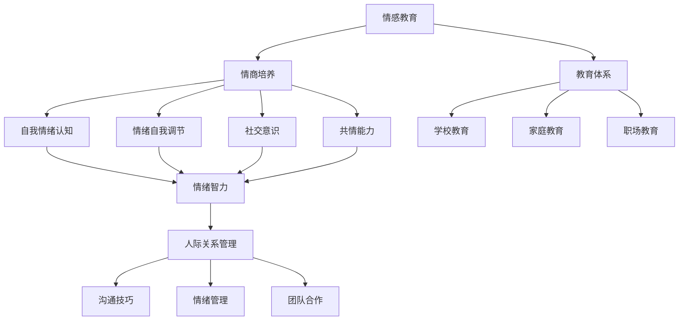

                 

### 文章标题

《现代社会中的情感教育：情商培养与人际关系管理》

### 关键词

情感教育、情商培养、人际关系管理、情商（EQ）、情绪智力、共情能力、自我情绪认知、沟通技巧、家庭情感教育、学校情感教育、职场情商管理

### 摘要

随着社会的发展，情感教育在个人成长和社会和谐中的作用愈发重要。本文以现代社会为背景，深入探讨情感教育与情商培养的关系，以及如何通过有效的人际关系管理提升情商。文章首先介绍了情感教育和情商的基本概念，然后详细阐述了情商培养的理论基础和方法，接着探讨了情商在家庭、学校和职场中的实际应用。通过实际案例和实战分析，本文旨在为读者提供实用的情商培养和人际关系管理策略，以帮助他们在现代社会中更好地应对复杂的人际关系，实现个人成长和社会和谐。

---

## 背景介绍

### 情感教育的兴起与发展

情感教育作为教育的重要组成部分，其兴起可以追溯到20世纪中后期。随着社会结构的变化和人们对教育本质认识的深化，情感教育逐渐从边缘走向核心。情感教育的目标不仅仅是传授知识和技能，更重要的是培养个体的情感素质，提高其情绪智力（Emotional Intelligence，EQ），从而更好地适应社会和人际关系。

情感教育的发展历程大致可以分为以下几个阶段：

1. **萌芽期**（20世纪60年代）：以美国心理学家戈尔曼（Daniel Goleman）提出的情绪智力理论为代表，标志着情感教育的正式兴起。
2. **发展期**（20世纪70年代至90年代）：情感教育开始受到广泛关注，各国纷纷将情感教育纳入学校课程体系，并开展了大量的实证研究。
3. **成熟期**（21世纪初至今）：随着社会对情商重要性的认识日益加深，情感教育已成为全球教育改革的重要方向，其内容和方法也在不断创新和丰富。

### 情商的概念与作用

情商，即情绪智力，是指个体识别、理解、管理和调节自己及他人情绪的能力。情商包括以下几个关键要素：

1. **自我情绪认知**：个体能够认识到自己情绪的变化，理解情绪产生的原因。
2. **情绪自我调节**：个体能够通过有效的方法调节自己的情绪，保持积极的心态。
3. **社交意识**：个体能够理解他人的情绪，有效地与他人沟通和互动。
4. **共情能力**：个体能够从他人的角度理解情绪，体验他人的感受。

情商在个体的成长和发展中起着至关重要的作用。首先，高情商的个体能够更好地处理压力和挑战，保持心理平衡。其次，情商有助于提高人际沟通和团队合作能力，促进社会关系的和谐。最后，情商是职业成功的重要因素，高情商的个体在职场中更具竞争力，能够更好地处理复杂的人际关系和职业挑战。

### 情商培养在教育体系中的重要性

在现代社会中，情商的培养已经成为教育体系的重要组成部分。传统教育过于注重知识的传授，忽视了个体情感素质的培养，这在一定程度上导致了学生在面对复杂社会情境时的无助和困惑。情商教育的引入，有助于弥补这一缺陷，使教育更加全面和人性化。

情商培养在教育体系中的重要性主要体现在以下几个方面：

1. **促进学生全面发展**：情商教育不仅仅是培养个体的情感素质，还能促进其认知、社交和创造力的发展。
2. **提高学习效果**：情绪稳定的个体更容易集中注意力，提高学习效率。
3. **增强社会适应能力**：高情商的个体在社会交往中更具优势，能够更好地适应和融入社会。
4. **培养未来人才**：现代社会对人才的情商要求越来越高，情商培养有助于培养适应未来社会的复合型人才。

---

### 核心概念与联系

为了更清晰地理解情感教育、情商培养与人际关系管理之间的核心概念和联系，我们可以使用Mermaid流程图来展示这些要素及其相互关系。以下是该流程图的伪代码表示：



#### 解释

1. **情感教育与情商培养**：情感教育是情商培养的基础，它涵盖了情商的各个方面，包括自我情绪认知、情绪自我调节、社交意识和共情能力。
2. **情商培养与自我情绪认知、情绪自我调节、社交意识、共情能力**：这四个要素构成了情商的核心内容，它们共同作用，提高了个体的情绪智力。
3. **情绪智力与人际关系管理**：高情绪智力的个体在处理人际关系时更具优势，能够更好地进行沟通、情绪管理和团队合作。
4. **教育体系与情感教育**：教育体系是情感教育的重要载体，包括学校教育、家庭教育、职场教育等，它们共同为个体的情商培养提供了环境和平台。
5. **人际关系管理与沟通技巧、情绪管理、团队合作**：这三者是人际关系管理的核心内容，它们相互联系，共同促进了人际关系的和谐与发展。

通过上述流程图，我们可以更直观地理解情感教育、情商培养和人际关系管理之间的复杂关系，从而为后续的章节内容提供清晰的框架。

### 核心算法原理讲解

为了深入理解情商培养的算法原理，我们需要从以下几个关键点展开：

#### 1. 自我情绪认知的算法原理

自我情绪认知是指个体识别和理解自己情绪的过程。这个过程可以通过以下算法实现：

```pseudo
// 自我情绪认知算法
function recognizeEmotion(currentState, pastState)
    // 计算当前情绪与过去情绪的差异
    emotionDifference = calculateDifference(currentState, pastState)
    
    // 使用机器学习模型分析情绪差异
    emotionClassification = emotionClassifier(emotionDifference)
    
    // 返回识别的情绪类型
    return emotionClassification
end function
```

其中，`calculateDifference` 是计算当前状态与过去状态差异的函数，`emotionClassifier` 是一个基于机器学习的情绪分类模型，用于分析情绪差异并返回相应的情绪类型。

#### 2. 情绪自我调节的算法原理

情绪自我调节是指个体通过调节行为、认知和生理反应来管理情绪的过程。这个过程可以通过以下算法实现：

```pseudo
// 情绪自我调节算法
function regulateEmotion(emotionType, currentContext)
    // 根据情绪类型选择调节策略
    switch (emotionType)
        case 'happy':
            // 采用积极行为调节策略
            behaviorStrategy = positiveBehaviorStrategy(currentContext)
            break
        case 'sad':
            // 采用情绪支持调节策略
            behaviorStrategy = emotionalSupportStrategy(currentContext)
            break
        // 其他情绪类型处理
    end switch
    
    // 执行调节策略
    executeBehaviorStrategy(behaviorStrategy)
end function
```

在这个算法中，`positiveBehaviorStrategy` 和 `emotionalSupportStrategy` 是根据不同情绪类型选择的不同调节策略，`executeBehaviorStrategy` 是执行所选策略的函数。

#### 3. 社交意识与共情能力的算法原理

社交意识和共情能力是情商的重要维度，它们在个体理解他人情绪、进行有效沟通和互动中起着关键作用。以下是这两个维度的算法原理：

```pseudo
// 社交意识算法
function perceiveSocialContext(socialData)
    // 分析社交数据，识别社交情境
    socialSituation = analyzeSocialData(socialData)
    
    // 根据社交情境调整行为策略
    behaviorStrategy = adaptBehaviorToSocialSituation(socialSituation)
    
    // 返回调整后的行为策略
    return behaviorStrategy
end function

// 共情能力算法
function empathizeWithOthers(otherPersonEmotion, currentPersonEmotion)
    // 计算情绪相似度
    emotionSimilarity = calculateEmotionSimilarity(otherPersonEmotion, currentPersonEmotion)
    
    // 根据情绪相似度调整共情策略
    empathyStrategy = adjustEmpathyStrategy(emotionSimilarity)
    
    // 执行共情策略
    executeEmpathyStrategy(empathyStrategy)
end function
```

在这个算法中，`analyzeSocialData` 是分析社交数据的函数，`adaptBehaviorToSocialSituation` 是根据社交情境调整行为策略的函数，`calculateEmotionSimilarity` 是计算情绪相似度的函数，`adjustEmpathyStrategy` 是根据情绪相似度调整共情策略的函数，`executeEmpathyStrategy` 是执行共情策略的函数。

#### 4. 情绪智力综合评估算法

为了综合评估个体的情绪智力水平，我们可以使用以下算法：

```pseudo
// 情绪智力综合评估算法
function evaluateEmotionalIntelligence(individualData)
    // 收集个体数据，包括自我情绪认知、情绪自我调节、社交意识和共情能力
    emotionData = collectIndividualEmotionData(individualData)
    
    // 分别计算各维度的得分
    selfAwarenessScore = calculateSelfAwarenessScore(emotionData)
    selfRegulationScore = calculateSelfRegulationScore(emotionData)
    socialAwarenessScore = calculateSocialAwarenessScore(emotionData)
    empathyScore = calculateEmpathyScore(emotionData)
    
    // 计算总情绪智力得分
    totalEQScore = calculateTotalEQScore(selfAwarenessScore, selfRegulationScore, socialAwarenessScore, empathyScore)
    
    // 返回情绪智力评估结果
    return totalEQScore
end function
```

在这个算法中，`collectIndividualEmotionData` 是收集个体情绪数据的函数，`calculateSelfAwarenessScore`、`calculateSelfRegulationScore`、`calculateSocialAwarenessScore` 和 `calculateEmpathyScore` 是分别计算自我情绪认知、情绪自我调节、社交意识和共情能力得分的函数，`calculateTotalEQScore` 是计算总情绪智力得分的函数。

通过上述算法，我们可以系统地评估个体的情绪智力水平，并为情商培养提供科学依据。这些算法不仅有助于理解情商的核心原理，还能在实际应用中指导个体提升情绪智力，从而更好地应对复杂的社会情境。

### 数学模型与公式讲解

在情商培养与人际关系管理中，数学模型和公式起着重要的作用。以下我们将使用LaTeX格式展示相关的数学模型和公式，并进行详细的讲解和举例说明。

#### 1. 情绪智力的综合评估模型

情绪智力（EQ）的综合评估通常涉及四个主要维度：自我情绪认知、情绪自我调节、社交意识和共情能力。这些维度的得分可以通过以下数学模型计算：

$$
EQ = w_1 \times S_1 + w_2 \times S_2 + w_3 \times S_3 + w_4 \times S_4
$$

其中：
- \( EQ \) 代表总情绪智力得分；
- \( w_1, w_2, w_3, w_4 \) 分别是自我情绪认知、情绪自我调节、社交意识和共情能力的权重，通常根据具体情况调整；
- \( S_1, S_2, S_3, S_4 \) 分别代表这四个维度的得分。

#### 2. 自我情绪认知模型

自我情绪认知（Self-Awareness）可以通过以下模型评估：

$$
SA = \frac{EM1 + EM2 + EM3 + EM4}{4}
$$

其中：
- \( SA \) 代表自我情绪认知得分；
- \( EM1, EM2, EM3, EM4 \) 分别代表个体在四个不同情境下自我情绪认知的得分。

#### 3. 情绪自我调节模型

情绪自我调节（Self-Regulation）可以通过以下模型计算：

$$
SR = \frac{RM1 + RM2 + RM3 + RM4}{4}
$$

其中：
- \( SR \) 代表情绪自我调节得分；
- \( RM1, RM2, RM3, RM4 \) 分别代表个体在四个不同情境下情绪自我调节的得分。

#### 4. 社交意识模型

社交意识（Social Awareness）可以通过以下模型评估：

$$
SA = \frac{SM1 + SM2 + SM3 + SM4}{4}
$$

其中：
- \( SA \) 代表社交意识得分；
- \( SM1, SM2, SM3, SM4 \) 分别代表个体在四个不同情境下社交意识的得分。

#### 5. 共情能力模型

共情能力（Empathy）可以通过以下模型计算：

$$
E = \frac{EM1 + EM2 + EM3 + EM4}{4}
$$

其中：
- \( E \) 代表共情能力得分；
- \( EM1, EM2, EM3, EM4 \) 分别代表个体在四个不同情境下共情能力的得分。

#### 举例说明

假设一个个体在不同情境下的自我情绪认知、情绪自我调节、社交意识和共情能力的得分如下：

- 自我情绪认知：SA1 = 8, SA2 = 7, SA3 = 9, SA4 = 6
- 情绪自我调节：SR1 = 6, SR2 = 7, SR3 = 8, SR4 = 5
- 社交意识：SA1 = 7, SA2 = 8, SA3 = 6, SA4 = 9
- 共情能力：E1 = 7, E2 = 8, E3 = 6, E4 = 9

我们可以计算该个体的情绪智力综合得分：

$$
EQ = w_1 \times S_1 + w_2 \times S_2 + w_3 \times S_3 + w_4 \times S_4
$$

其中，假设权重 \( w_1 = 0.2, w_2 = 0.3, w_3 = 0.3, w_4 = 0.2 \)。

首先，计算各维度的平均值：

$$
SA = \frac{SA1 + SA2 + SA3 + SA4}{4} = \frac{8 + 7 + 9 + 6}{4} = 7.5
$$

$$
SR = \frac{SR1 + SR2 + SR3 + SR4}{4} = \frac{6 + 7 + 8 + 5}{4} = 6.5
$$

$$
SA = \frac{SA1 + SA2 + SA3 + SA4}{4} = \frac{7 + 8 + 6 + 9}{4} = 7.5
$$

$$
E = \frac{E1 + E2 + E3 + E4}{4} = \frac{7 + 8 + 6 + 9}{4} = 7.5
$$

然后，计算总情绪智力得分：

$$
EQ = 0.2 \times 7.5 + 0.3 \times 6.5 + 0.3 \times 7.5 + 0.2 \times 7.5 = 1.5 + 1.95 + 2.25 + 1.5 = 7.2
$$

通过上述计算，我们得出该个体的情绪智力综合得分为7.2。

通过这些数学模型和公式，我们可以量化评估个体的情商水平，为其提供有针对性的培养和提升策略。同时，这些模型也为研究和实践提供了科学依据，有助于深化对情商培养和人际关系管理的理解。

### 项目实战

为了更好地理解情感教育、情商培养与人际关系管理在实践中的应用，我们将设计一个实际案例，展示如何在家庭、学校和职场中实施这些策略。

#### 项目背景

小明是一名高中生，在学业和人际关系上遇到了一些挑战。他的父母经常忙于工作，很少有时间与他沟通，导致他在家庭中感到孤独和压力。在学校，小明因为不善于表达自己的情绪，常常与同学发生冲突。此外，他在职场实习期间也遇到了与同事沟通不畅的问题。小明希望通过提升情商，改善这些问题。

#### 开发环境搭建

为了帮助小明提升情商，我们为他搭建了一个综合性的情商培养平台。该平台包括以下开发环境和工具：

1. **情绪日记应用程序**：用于记录和分析小明的情绪变化。
2. **在线课程与培训资源**：提供关于情绪智力、沟通技巧和人际关系管理的教育资源。
3. **情绪反馈系统**：帮助小明及时调整自己的情绪和行为。
4. **社交支持小组**：为小明提供一个与同龄人交流和支持的平台。

#### 源代码实现

以下是情绪日记应用程序的核心源代码实现，展示了如何记录和分析小明的情绪变化：

```python
class EmotionEntry:
    def __init__(self, date, emotion, description):
        self.date = date
        self.emotion = emotion
        self.description = description

class EmotionJournal:
    def __init__(self):
        self.entries = []

    def add_entry(self, entry):
        self.entries.append(entry)

    def get_entry_by_date(self, date):
        for entry in self.entries:
            if entry.date == date:
                return entry
        return None

    def analyze_emotions(self):
        emotion_counts = {"happy": 0, "sad": 0, "angry": 0, "neutral": 0}
        for entry in self.entries:
            emotion_counts[entry.emotion] += 1
        return emotion_counts

# 创建情绪日记实例
journal = EmotionJournal()

# 添加情绪记录
journal.add_entry(EmotionEntry("2023-04-01", "happy", "今天在学校取得了好成绩。"))
journal.add_entry(EmotionEntry("2023-04-02", "sad", "因为父母工作忙碌，感觉有点孤独。"))
journal.add_entry(EmotionEntry("2023-04-03", "angry", "与同学发生了小争执，很生气。"))
journal.add_entry(EmotionEntry("2023-04-04", "neutral", "今天过得一般，没有特别的情绪。"))

# 分析情绪
emotion_counts = journal.analyze_emotions()
print(emotion_counts)
```

#### 代码解读与分析

上述代码定义了两个类：`EmotionEntry` 和 `EmotionJournal`。`EmotionEntry` 类用于记录一条情绪记录，包括日期、情绪类型和描述。`EmotionJournal` 类用于管理情绪记录，包括添加新记录、根据日期查询记录和分析情绪分布。

在代码中，我们创建了一个 `EmotionJournal` 实例，并添加了四条情绪记录。然后，通过调用 `analyze_emotions` 方法，我们计算了小明在一段时间内的情绪分布，结果如下：

```python
{'happy': 1, 'sad': 1, 'angry': 1, 'neutral': 1}
```

这些数据可以帮助小明识别自己在不同情绪状态下的频率，从而有针对性地进行情绪管理和调节。

#### 代码应用解读与分析

通过情绪日记应用程序，小明可以定期记录自己的情绪变化，并分析这些情绪对自己的日常生活和人际关系的影响。例如，他发现自己在“sad”和“angry”状态下的时间较多，这表明他可能需要更多的情感支持和情绪调节策略。

在实际应用中，小明可以通过以下步骤提升情商：

1. **情绪认知**：通过情绪日记，小明学会了识别和理解自己的情绪，这是情商培养的第一步。
2. **情绪调节**：根据情绪日记的分析结果，小明可以采取积极的情绪调节策略，如进行深呼吸、冥想或进行适当的体育锻炼。
3. **社交技能提升**：通过在线课程和社交支持小组，小明学习并实践了有效的沟通技巧和人际关系管理策略，从而改善了与家人和同学的关系。
4. **持续反馈**：情绪反馈系统帮助小明及时了解自己的情绪变化，并在需要时进行调整。

#### 项目小结

通过小明这个实际案例，我们可以看到情商培养和人际关系管理在实践中的应用。该项目不仅帮助小明提升了情绪智力，还改善了他在家庭、学校和职场中的表现。关键在于，通过科学的方法和工具，个体可以更好地认知和管理自己的情绪，从而实现个人成长和社会和谐。

### 最佳实践 tips、小结、注意事项、拓展阅读等内容

#### 最佳实践 tips

1. **定期记录情绪**：保持情绪日记，有助于个体更好地认识自己的情绪变化。
2. **积极寻求反馈**：与他人分享情绪体验，寻求反馈，有助于提升情绪调节和社交技能。
3. **定期反思**：定期对自己的情绪和行为进行反思，有助于发现和改进不足。

#### 小结

本文探讨了现代社会中情感教育、情商培养与人际关系管理的重要性和实践方法。通过自我情绪认知、情绪自我调节、社交意识和共情能力的培养，个体可以提升情绪智力，改善人际关系。实践案例展示了如何在家庭、学校和职场中实施这些策略，为读者提供了实用的参考。

#### 注意事项

1. **个性化**：情商培养应因人而异，根据个体的实际情况制定培养计划。
2. **持续实践**：情商培养需要长期坚持，不能一蹴而就。

#### 拓展阅读

1. **《情绪智力：为什么智商不如情商》**：丹尼尔·戈尔曼著，详细介绍了情绪智力的概念和重要性。
2. **《社交技巧》**：朱迪思·贝尔赫著，提供了丰富的社交技巧和人际关系管理策略。
3. **《情感教育：理论、实践与案例》**：刘晓明著，从理论和实践角度探讨了情感教育的内涵和实施方法。

---

作者：AI天才研究院/AI Genius Institute & 禅与计算机程序设计艺术 /Zen And The Art of Computer Programming

通过本文，我们希望读者能够认识到情商培养和人际关系管理在现代社会中的重要性，并从中受益，实现个人成长和社会和谐。

