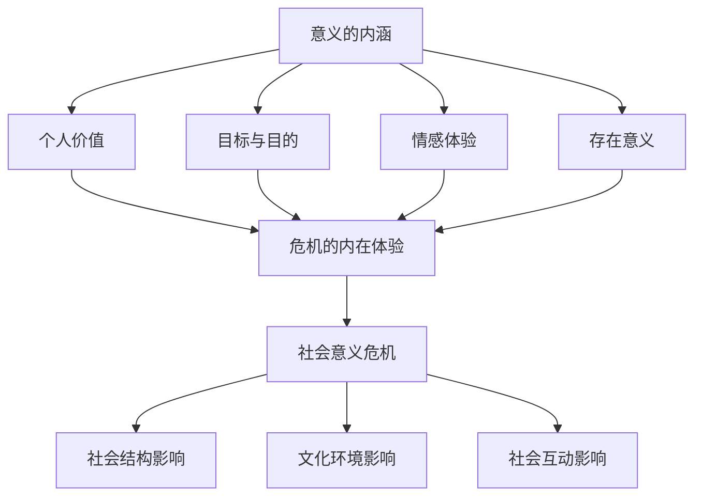
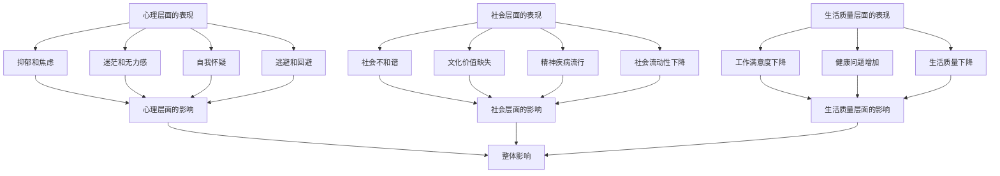
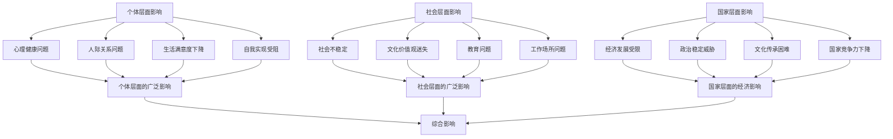
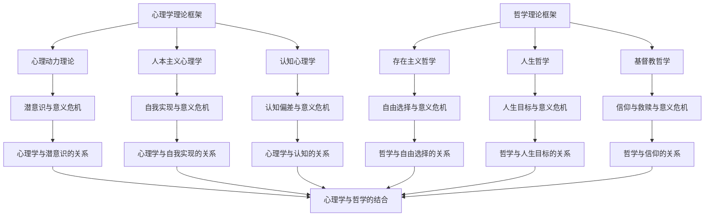
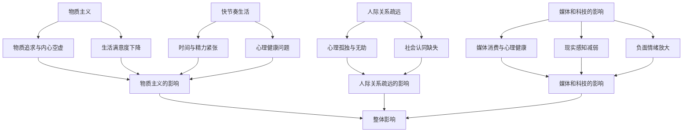
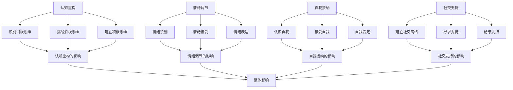
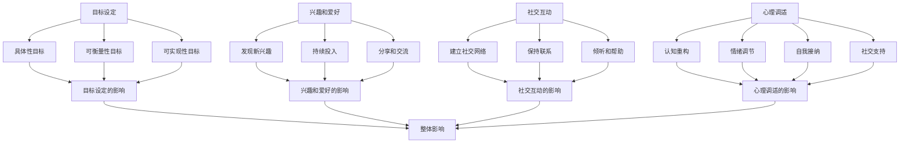
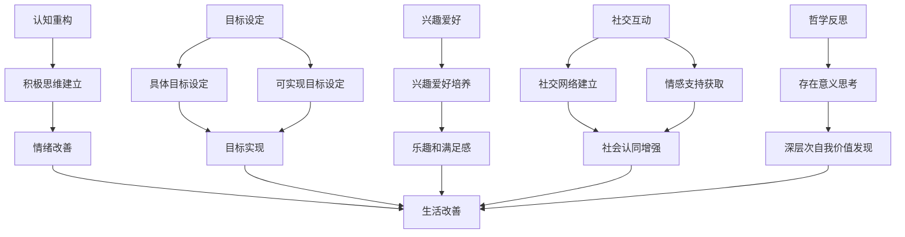

                 

# 摘要

本文旨在探讨现代社会中人们面临的情感和意义危机，并探讨如何寻找生活的支点。随着社会的发展和科技的进步，人们的生活节奏加快，压力增加，导致许多人在情感上感到迷茫和无助，面临意义危机。本文通过心理学和哲学的理论，分析了意义危机的概念和表现形式，并提出了一系列寻找生活支点的策略和方法。本文将帮助读者理解意义危机的成因，并提供具体的实践指导，以帮助他们在快节奏的生活中找到内心的平静和满足。

# 引言

在现代社会中，随着科技的迅猛发展和全球化进程的加快，人们的生活发生了翻天覆地的变化。然而，这种变化也带来了许多挑战，特别是在情感和意义上。越来越多的人感到自己的生活缺乏意义，内心充满迷茫和无助。这种情感和意义的危机不仅影响个人的心理健康，也对社会和谐和稳定构成威胁。

## 1.1 书籍目的

本文的目的是深入探讨现代社会中人们面临的情感和意义危机，并通过心理学和哲学的理论，为读者提供寻找生活支点的策略和方法。本文希望通过以下三个方面来帮助读者：

1. 理解意义危机的概念和表现形式，包括其在个人和社会层面的影响。
2. 掌握心理学和哲学的基本理论，为解决意义危机提供理论基础。
3. 提供具体的实践指导，帮助读者在日常生活中寻找生活的支点，实现内心的平静和满足。

## 1.2 研究背景与意义

现代社会中，意义危机已经成为一个普遍存在的问题。据统计，全球范围内的抑郁症和焦虑症发病率呈上升趋势，特别是在年轻人中。这种危机不仅影响个人的心理健康，还可能导致人际关系紧张、社会不稳定等问题。因此，探讨意义危机的成因和解决方法具有重要的现实意义。

首先，社会变革是导致意义危机的重要因素之一。随着科技的进步和全球化进程的加快，人们的生活节奏不断加快，工作压力和生活压力也随之增加。这种高压环境使得许多人感到生活缺乏意义，内心空虚。此外，社会结构的变革，如家庭结构的变化、传统价值观的冲击等，也使得人们难以找到生活的支点。

其次，个人价值观的多元化也是导致意义危机的原因之一。在现代社会中，人们面临着各种各样的价值观和生活方式的选择。然而，这种选择也使得人们难以确定自己的目标和方向，导致内心的迷茫和无助。

## 1.3 研究方法与框架

本文采用心理学和哲学的理论为基础，结合实证研究和案例分析方法，探讨现代社会中人们面临的情感和意义危机。具体来说，本文将采用以下研究方法：

1. 文献综述：通过回顾和分析相关的心理学和哲学理论，为本文的研究提供理论基础。
2. 实证研究：通过问卷调查和深度访谈等方法，收集现代社会中人们面临的意义危机的具体表现和影响因素。
3. 案例分析：通过具体案例的分析，展示如何应用心理学和哲学的理论解决意义危机。
4. 实践指导：结合实证研究和案例分析，为读者提供寻找生活支点的具体策略和方法。

本文的研究框架包括以下几个部分：

1. 引言：介绍研究背景、目的、意义和研究方法。
2. 意义危机的概念与表现形式：阐述意义危机的概念、表现形式及其对个体和社会的影响。
3. 心理学与哲学基础：探讨心理学和哲学的理论，为理解意义危机提供理论基础。
4. 社会现象分析：分析现代社会中的各种现象，如物质主义、人际关系等，以及它们如何加剧意义危机。
5. 心理调适方法：介绍心理调适的技巧和方法，帮助读者应对生活中的挫折和危机。
6. 寻找生活的支点：提供具体的策略和方法，帮助读者找到生活的支点，实现内心的平静和满足。
7. 实例分析与案例分析：通过具体的案例，展示如何应用上述方法，寻找生活的支点。
8. 总结与展望：对全文内容进行总结，并对未来的研究方向或应用前景进行展望。

通过以上研究方法与框架，本文旨在为读者提供一套系统的、实用的解决意义危机的方法，帮助他们在现代社会中找到生活的支点，实现内心的平静和满足。

## 2.1 意义危机的定义

意义危机是一个复杂而多维的概念，它涉及到个体对生活意义的认知、情感状态以及行为表现。在心理学和哲学的视角下，意义危机可以被定义为一个个体在追求生活目标时，感受到目标缺乏内在价值或无法实现的状况。这种状况往往导致个体在情感和心理上出现困扰和焦虑。

### 2.1.1 意义的内涵与外延

意义是一个深奥且多层面的概念，它通常涉及到以下几个方面：

1. **个人价值**：意义与个体对自我价值的认知和评估有关。当个体感到自己的行为和存在对他人或社会有价值时，他们往往能体验到生活的意义。
2. **目标与目的**：意义与个体设定的目标和追求的目的有关。当个体的目标与他们的价值观和信仰相一致时，他们往往能感受到生活的意义。
3. **情感体验**：意义也与个体在生活中的情感体验有关。积极的情感体验，如爱、幸福和成就感，可以增强生活的意义感。
4. **存在意义**：在哲学层面，意义涉及到个体对存在本身意义的探讨。许多哲学流派，如存在主义，强调个体在存在中的主动性和自由选择，从而赋予生活意义。

### 2.1.2 危机的概念界定

危机通常指的是一种紧张或危险的状况，这种状况可能导致个体或系统的不稳定或崩溃。在意义危机的背景下，危机可以被定义为个体在面对生活中的挑战时，感受到自己的目标和价值观受到威胁，或无法实现自我价值的状态。

### 2.1.3 社会意义危机的界定

社会意义危机不仅仅是个体层面的心理现象，它也具有社会层面的影响。在社会意义危机中，个体感受到的意义危机不仅仅是个体自身的内在体验，它还涉及到社会结构和文化环境的影响。

1. **社会结构**：社会结构，如经济、政治和文化体系，可能对个体的意义产生重大影响。例如，资本主义经济体系可能强调物质成功，而忽视个体内心的需求，导致个体在追求物质成功时感到意义危机。
2. **文化环境**：文化环境，如宗教信仰、价值观和传统，也可能影响个体的意义感。当文化环境发生变化时，个体可能需要重新评估自己的价值观和信仰，以适应新的环境，这可能导致意义危机。
3. **社会互动**：社会互动，如家庭、朋友和社会组织，对个体的意义感也具有重要影响。当个体在互动中感受到被理解和支持时，他们往往能更好地应对意义危机。

### 2.1.4 Mermaid流程图：意义危机的核心概念与联系

通过这个Mermaid流程图，我们可以清晰地看到意义危机的核心概念及其相互之间的联系。这个流程图有助于我们更好地理解意义危机的复杂性，以及它如何从个体层面扩展到社会层面。

### 2.2 意义危机的表现形式

意义危机在个体和社会层面有不同的表现形式，这些表现形式反映了个体在面对意义缺失时的心理和行为反应。以下是对意义危机主要表现形式的分析：

#### 2.2.1 心理层面的表现

在心理层面，意义危机通常表现为以下几种形式：

1. **抑郁和焦虑**：当个体感受到生活缺乏意义时，他们可能会出现抑郁和焦虑症状。抑郁可能导致个体对生活失去兴趣，出现情绪低落、自我负面评价和消极态度。焦虑则可能表现为对未来不确定性的恐惧和对失败的担忧。
2. **迷茫和无力感**：意义危机还可能导致个体感到迷茫和无力。他们可能不知道自己的目标和方向，感觉自己的生活没有方向，从而产生强烈的无力感和失落感。
3. **自我怀疑**：在意义危机中，个体可能会对自己的价值、能力和存在的意义产生怀疑。这种自我怀疑可能导致他们对自己的行为和决策产生不安，甚至可能导致自我放弃。
4. **逃避和回避**：为了避免面对意义危机带来的痛苦，个体可能会采取逃避和回避的行为。他们可能会沉迷于娱乐活动、物质消费或其他逃避现实的手段。

#### 2.2.2 社会层面的表现

在社会层面，意义危机的表现形式更为复杂，可能涉及到以下方面：

1. **社会不和谐**：当大量个体面临意义危机时，社会可能会出现不和谐的现象。例如，人际关系紧张、社会冲突增加、犯罪率上升等，这些都是社会意义危机的反映。
2. **文化价值缺失**：在社会层面，意义危机可能导致文化价值的缺失。当个体不再认同传统的价值观和信仰时，社会可能会出现道德和伦理的真空，导致社会的价值观混乱。
3. **精神疾病流行**：在社会层面，意义危机可能导致精神疾病的高发。例如，抑郁症、焦虑症和精神分裂症等疾病，这些疾病不仅影响个体的生活质量，也增加了社会的医疗负担。
4. **社会流动性下降**：意义危机还可能影响社会流动性。当个体感到自己的生活缺乏意义和希望时，他们可能减少对社会和经济的参与，导致社会流动性的下降。

#### 2.2.3 生活质量层面的表现

在生活质量层面，意义危机可能导致以下问题：

1. **工作满意度下降**：当个体在工作中感到缺乏意义时，他们的工作满意度通常会下降。这种情况下，他们可能对工作表现出消极态度，甚至可能导致工作效率低下。
2. **健康问题增加**：长期的意义危机可能导致健康问题。例如，长期的压力和焦虑可能导致心血管疾病、消化系统疾病等健康问题。
3. **生活质量下降**：在生活质量层面，意义危机可能导致个体在物质和精神上都感到不满足。他们可能会感到生活没有乐趣，缺乏幸福感和满足感。

### 2.2.4 Mermaid流程图：意义危机的表现形式

通过这个Mermaid流程图，我们可以看到意义危机在不同层面的表现形式及其相互关系。这个流程图有助于我们全面理解意义危机的影响，并为解决意义危机提供更有效的策略。

### 2.3 意义危机的影响范围

意义危机不仅影响个体的心理健康和生活质量，还对社会稳定和个体的发展产生深远的影响。以下是对意义危机影响范围的详细探讨：

#### 2.3.1 个体层面的影响

在个体层面，意义危机可能导致一系列心理和行为问题：

1. **心理健康问题**：意义危机与心理健康问题密切相关。长期的内心困惑和无助感可能导致抑郁、焦虑和其他精神疾病。研究表明，抑郁症和焦虑症的发病率在经历意义危机的人群中显著增加。

2. **人际关系问题**：意义危机可能影响个体的人际关系。当个体感到自己的生活缺乏意义时，他们可能对他人产生冷漠或疏远感，导致人际关系的紧张和冲突。

3. **生活满意度下降**：意义危机导致个体对生活的满意度下降。他们可能对自己的生活状况感到不满，甚至产生绝望感。这种负面情绪会影响个体的整体幸福感。

4. **自我实现受阻**：意义危机可能阻碍个体的自我实现。当个体无法找到生活的意义时，他们可能失去前进的动力，难以实现个人目标和梦想。

#### 2.3.2 社会层面的影响

在社会层面，意义危机的影响更为广泛，可能引发以下问题：

1. **社会不稳定**：当大量个体面临意义危机时，社会可能出现不稳定现象。社会冲突、犯罪率和离婚率等指标可能上升，影响社会的和谐与稳定。

2. **文化价值观的迷失**：意义危机可能导致文化价值观的迷失。当个体对生活缺乏认同感和使命感时，他们可能忽视或放弃传统价值观，导致社会价值观的混乱。

3. **教育问题**：在学校和高等教育机构中，意义危机可能影响学生的学习动机和学术表现。缺乏生活意义的个体可能对学习缺乏热情，导致学业成绩下降。

4. **工作场所问题**：意义危机可能影响工作场所的效率和团队合作。当员工感到自己的生活缺乏意义时，他们可能对工作产生消极态度，影响工作表现和团队合作。

#### 2.3.3 国家层面的影响

在国家层面，意义危机可能对国家的经济、政治和文化发展产生深远的影响：

1. **经济发展**：意义危机可能导致劳动力效率下降，影响国家的经济发展。当个体缺乏生活动力和目标时，他们可能对工作和创新失去兴趣，影响国家经济的活力。

2. **政治稳定**：意义危机可能对政治稳定构成威胁。当大量个体感到生活缺乏意义时，他们可能对社会和政治体制产生不满，导致社会动荡和政治不稳定。

3. **文化传承**：意义危机可能导致文化传承的困难。当个体对传统文化缺乏认同感和使命感时，他们可能忽视或放弃传统文化的传承，导致文化断裂和消失。

4. **国家竞争力**：意义危机可能影响国家的国际竞争力。当国家的公民缺乏生活意义和创新动力时，国家的科技创新和经济发展可能受到限制，影响国家的国际竞争力。

### 2.3.4 Mermaid流程图：意义危机的影响范围

通过这个Mermaid流程图，我们可以清晰地看到意义危机在个体、社会和国家层面的广泛影响。这个流程图有助于我们更好地理解意义危机的复杂性，并为解决意义危机提供更全面的策略。

### 2.4 心理学与哲学基础

探讨现代社会中的意义危机，离不开心理学和哲学的理论基础。心理学和哲学为我们提供了理解和解决意义危机的视角和方法，帮助我们深入分析个体和群体的心理状态和哲学思考。

#### 2.4.1 心理学理论框架

心理学中的多个流派提供了关于意义危机的理论框架：

1. **心理动力理论**：心理动力理论，特别是弗洛伊德的理论，强调潜意识在个体行为和情感中的作用。意义危机可以从潜意识的角度理解，个体在面对生活挑战时，可能因为潜意识中的冲突和冲突而产生的无意义感。
2. **人本主义心理学**：人本主义心理学强调个体的自我实现和主观体验。意义危机可以从人本主义的视角理解，个体在追求自我实现的过程中，可能因为目标无法实现或价值观的冲突，导致内心的意义危机。
3. **认知心理学**：认知心理学关注个体的认知过程，特别是思维和记忆。意义危机可以从认知的角度分析，个体的认知偏差和思维模式可能影响他们对生活意义的感知和理解。

#### 2.4.2 哲学理论框架

哲学中的多个流派为理解意义危机提供了深刻的思考：

1. **存在主义哲学**：存在主义哲学，如萨特的《存在与虚无》，强调个体在存在中的自由和选择。意义危机可以视为个体在自由选择中的困境，当个体感到无法找到存在的意义时，他们可能会体验到危机。
2. **人生哲学**：人生哲学探讨个体在生命中的目标和意义。意义危机可以视为个体在人生哲学中的迷茫，他们可能因为对生命意义的困惑而感到困扰。
3. **基督教哲学**：基督教哲学强调信仰和救赎。意义危机可以从宗教的角度理解，当个体对信仰和救赎产生怀疑时，他们可能会面临意义危机。

#### 2.4.3 Mermaid流程图：心理学与哲学理论框架的联系

通过这个Mermaid流程图，我们可以清晰地看到心理学和哲学理论框架之间的联系。这个流程图有助于我们理解心理学和哲学如何共同探讨意义危机，并为解决意义危机提供多角度的视角。

### 2.5 社会现象分析

现代社会中，许多现象都在不同程度上加剧了人们面临的情感和意义危机。以下是对这些现象的深入分析：

#### 2.5.1 物质主义

物质主义是指人们过度追求物质财富和消费的行为和态度。在现代社会中，物质主义已经成为一种普遍的社会现象。随着经济的发展和消费文化的兴起，人们对物质财富的追求愈发强烈。然而，这种追求往往忽视了内心的需求和精神层面的满足，导致人们在追求物质财富的过程中感到空虚和无意义。

1. **影响**：物质主义对个体的意义危机产生了深远的影响。当个体过于追求物质财富时，他们可能会忽视人际关系和精神追求，导致内心的孤独和无助。此外，物质主义还可能导致个体对生活的满意度下降，因为他们总是追求更高层次的物质满足，而忽视了内在的幸福感。
2. **解决方法**：要解决物质主义引发的意义危机，个体需要重新审视自己的价值观和追求。首先，个体应该明确自己的真正需求，区分物质需求和内在幸福感。其次，个体可以通过培养兴趣爱好、提高自己的精神修养和加强社会互动来弥补物质追求带来的空虚感。

#### 2.5.2 快节奏生活

现代社会的生活节奏越来越快，人们面临着越来越多的工作和生活压力。快节奏生活不仅导致个体在身体上感到疲惫，还可能在心理上产生焦虑和压力。

1. **影响**：快节奏生活对个体的意义危机产生了显著影响。首先，快节奏生活可能导致个体在时间和精力上的紧张，使他们难以投入时间和精力去追求个人目标和精神满足。其次，快节奏生活可能导致个体在心理上感到焦虑和压力，影响他们的心理健康和生活质量。
2. **解决方法**：为了应对快节奏生活引发的意义危机，个体需要采取一些措施来调整自己的生活节奏。首先，个体可以合理安排时间，确保有足够的时间用于休息和放松。其次，个体可以通过锻炼身体、培养兴趣爱好和进行心理调适来缓解压力和焦虑。此外，个体还可以通过提高工作效率，减少不必要的压力源，从而降低快节奏生活对意义危机的影响。

#### 2.5.3 人际关系疏远

在现代社会中，随着科技的进步和社交方式的多样化，人际关系疏远成为一个普遍存在的问题。人们可能因为工作繁忙、生活压力大或科技手段的依赖，而减少与亲朋好友的面对面交流和互动。

1. **影响**：人际关系疏远对个体的意义危机产生了负面影响。首先，缺乏亲密的人际关系可能导致个体在心理上感到孤独和无助。其次，人际关系疏远可能使个体难以获得情感支持和社会认同，进一步加剧内心的迷茫和无意义感。
2. **解决方法**：要解决人际关系疏远引发的意义危机，个体需要积极建立和维护人际关系。首先，个体可以通过主动与亲朋好友保持联系，增加面对面交流和互动。其次，个体可以通过参加社交活动、加入兴趣小组或志愿服务等方式，扩大社交圈子，提高社交质量。此外，个体还可以通过学习沟通技巧和提高人际交往能力，来改善人际关系，从而缓解意义危机。

#### 2.5.4 媒体和科技的影响

现代科技和媒体的快速发展给人们带来了前所未有的便利和娱乐方式，但也在某种程度上加剧了意义危机。

1. **影响**：媒体和科技对个体的意义危机产生了多方面的影响。首先，过度的媒体消费可能导致个体在现实生活中缺乏真实的人际互动，影响他们的心理健康。其次，科技手段的依赖可能导致个体对现实世界的感知减弱，影响他们对生活意义的认知。此外，媒体和科技还可能放大个体的负面情绪，增加他们的焦虑和压力。
2. **解决方法**：为了减少媒体和科技对意义危机的影响，个体需要合理使用媒体和科技。首先，个体可以设定合理的媒体使用时间，确保有足够的时间用于现实世界的互动和活动。其次，个体可以通过减少对社交媒体和即时通讯工具的依赖，增加与亲朋好友的面对面交流。此外，个体还可以通过培养兴趣爱好、参加户外活动等方式，丰富自己的现实生活，减少对媒体和科技的依赖。

### 2.5.5 Mermaid流程图：社会现象分析

通过这个Mermaid流程图，我们可以清晰地看到现代社会中的各种现象如何加剧意义危机，以及它们之间的相互关系。这个流程图有助于我们更好地理解社会现象对意义危机的影响，并为解决意义危机提供更全面的策略。

### 2.6 心理调适方法

面对现代社会中的意义危机，有效的心理调适方法可以帮助个体应对内心的困扰和焦虑，找到生活的支点。以下是一些常见的心理调适方法：

#### 2.6.1 认知重构

认知重构是一种心理调适方法，旨在通过改变个体的思维方式和认知模式，来改善他们的情绪和行为。这种方法的核心是通过识别和挑战消极的思维模式，来建立更积极和现实的观点。

1. **方法**：
   - **识别消极思维**：首先，个体需要识别自己的消极思维模式，如过度概括、以偏概全、黑白思维等。
   - **挑战消极思维**：个体可以通过质疑这些消极思维的有效性和合理性，来挑战它们的可信度。
   - **建立积极思维**：个体可以尝试用更积极和现实的方式来看待问题，例如，将“我总是失败”改为“我这次失败了，但我会从中学到经验，下次会做得更好”。

2. **实例**：假设一个个体总是觉得自己无法达到他人的期望，因此感到极度焦虑和沮丧。通过认知重构，个体可以识别出这种消极思维模式，并挑战它的有效性。例如，个体可以认识到每个人都有自己的优点和缺点，没有人是完美的，自己的失败并不意味着自己一无是处。

#### 2.6.2 情绪调节

情绪调节是另一种有效的心理调适方法，旨在帮助个体管理自己的情绪，避免情绪失控对生活造成负面影响。

1. **方法**：
   - **情绪识别**：个体需要学会识别和理解自己的情绪，包括正面情绪和负面情绪。
   - **情绪接受**：个体需要学会接受自己的情绪，而不是试图逃避或压抑它们。
   - **情绪表达**：个体可以通过健康的方式表达自己的情绪，如通过写日记、绘画、运动等方式。

2. **实例**：假设一个个体在经历意义危机时感到非常焦虑和沮丧。通过情绪调节，个体可以识别出自己的情绪，并学会接受这些情绪。例如，个体可以通过写日记来记录自己的情绪变化，并通过与朋友或家人交流来分享自己的感受。

#### 2.6.3 自我接纳

自我接纳是一种心理调适方法，强调个体需要接受自己的不完美，包括自己的优点和缺点。

1. **方法**：
   - **认识自我**：个体需要花时间了解自己的价值观、兴趣和需求。
   - **接受自我**：个体需要学会接受自己的不完美，并认识到每个人都有自己的优点和缺点。
   - **自我肯定**：个体可以通过自我肯定来增强自信和自尊心。

2. **实例**：假设一个个体总是对自己的工作表现感到不满意，因此感到内心不安。通过自我接纳，个体可以认识到自己的工作虽然不是完美无缺，但自己在工作中已经尽力了。例如，个体可以每天提醒自己“我已经尽力了，不必对结果过于苛求”。

#### 2.6.4 社交支持

社交支持是另一个重要的心理调适方法，通过建立和维持良好的社会关系，个体可以获得情感支持和社会认同，从而缓解内心的困扰和焦虑。

1. **方法**：
   - **建立社交网络**：个体可以通过参加社交活动、加入兴趣小组或与朋友保持联系来建立社交网络。
   - **寻求支持**：个体可以在需要时寻求亲朋好友的支持，例如，分享自己的困惑和挑战，寻求他们的建议和鼓励。
   - **给予支持**：个体也可以通过帮助他人和支持他人来获得满足感和社交认同。

2. **实例**：假设一个个体在经历意义危机时感到非常孤独和无助。通过社交支持，个体可以与朋友或家人分享自己的感受，并从他们那里获得情感支持和社会认同。例如，个体可以与朋友一起参加户外活动，通过共同的经历来增强彼此的信任和友谊。

#### 2.6.5 Mermaid流程图：心理调适方法

通过这个Mermaid流程图，我们可以清晰地看到心理调适方法的各个步骤及其相互关系。这个流程图有助于我们理解如何通过心理调适来应对意义危机，并为个体提供实用的指导。

### 2.7 寻找生活的支点

在现代社会中，找到生活的支点是缓解意义危机的关键。以下是一些具体的策略和方法，帮助个体在快节奏的生活中找到内心的平衡和满足。

#### 2.7.1 目标设定

设定明确的目标是找到生活支点的重要步骤。目标可以是个人的，也可以是职业的。设定目标时，个体应该考虑以下因素：

1. **具体性**：目标应该具体、明确，而不是模糊的。例如，“我要变得更加健康”不如“我要每周跑步三次，每次30分钟”具体。
2. **可衡量性**：目标应该可衡量，以便个体可以评估自己的进度。例如，目标可以是“我要在六个月内减掉10斤体重”。
3. **可实现性**：目标应该既具有挑战性，又是可实现的。设定过于困难的目标可能导致挫败感，而过于简单的目标可能缺乏激励作用。

#### 2.7.2 兴趣和爱好

培养兴趣爱好可以帮助个体在日常生活中找到乐趣和满足感。兴趣爱好可以是阅读、绘画、音乐、运动等。以下是一些具体的建议：

1. **发现新兴趣**：个体可以尝试不同的活动，找到自己真正喜欢的兴趣。例如，可以通过参加社区活动、网络课程或工作坊来发掘新兴趣。
2. **持续投入**：一旦找到兴趣爱好，个体应该持续投入时间和精力，将其发展成为自己的特长。
3. **分享和交流**：与他人分享兴趣爱好，参加相关的社交活动，可以增强个体的归属感和满足感。

#### 2.7.3 社交互动

建立和维护良好的人际关系对于找到生活的支点至关重要。以下是一些建议：

1. **建立社交网络**：通过参加社交活动、加入兴趣小组或参与志愿服务，个体可以扩大自己的社交圈子。
2. **保持联系**：与亲朋好友保持联系，通过电话、短信或面对面的交流，分享彼此的生活经历和感受。
3. **倾听和帮助**：在社交互动中，个体应该学会倾听他人的需求和困扰，并愿意提供帮助。这不仅可以增进彼此的信任，还可以增强个体的归属感和价值感。

#### 2.7.4 心理调适

通过心理调适方法，个体可以更好地管理自己的情绪和压力，找到内心的平静。以下是一些建议：

1. **认知重构**：识别和挑战消极思维，建立积极思维，以更现实和积极的方式看待问题和挑战。
2. **情绪调节**：学会识别和理解自己的情绪，接受自己的情绪，并通过健康的方式表达它们。
3. **自我接纳**：接受自己的不完美，认识到每个人都有自己的优点和缺点，并学会自我肯定。
4. **社交支持**：寻求亲朋好友的支持，并为他们提供帮助，以建立互相支持的关系。

#### 2.7.5 Mermaid流程图：寻找生活的支点

通过这个Mermaid流程图，我们可以清晰地看到寻找生活的支点的各个步骤及其相互关系。这个流程图有助于个体理解如何通过不同的策略和方法，找到生活的支点，实现内心的平衡和满足。

### 2.8 实例分析与案例分析

为了更好地理解如何应用前述方法和策略来解决意义危机，我们将通过两个具体的案例进行详细分析。这些案例将展示如何在不同情境下运用心理学和哲学的理论，以及如何通过实践找到生活的支点。

#### 2.8.1 案例一：小李的意义危机

**背景**：小李是一名年轻的职业人士，工作在一家跨国公司，担任高级经理。尽管他在职业生涯上取得了显著成就，但他在内心深处感到自己的生活缺乏意义。小李每天忙碌于工作，但晚上常常感到孤独和无助，对未来的生活感到迷茫。

**分析**：

1. **认知重构**：小李通过反思自己的工作和生活，识别出自己过度关注工作成就，忽视了个人价值和人际关系。他开始挑战这种思维模式，意识到工作虽然重要，但生活的意义不仅限于职业成就。

2. **目标设定**：小李决定设定新的目标，包括培养个人兴趣、提高自己的健康水平，以及加强与家人和朋友的联系。他具体设定了每周至少锻炼三次，每天花时间陪伴家人，每月与朋友聚会一次。

3. **兴趣爱好**：小李开始尝试新的兴趣爱好，如瑜伽和烹饪。通过这些活动，他发现自己在生活中找到了新的乐趣和满足感。

4. **社交互动**：小李积极参与社交活动，加入了一个瑜伽俱乐部，并定期与朋友聚会。这些活动不仅丰富了他的生活，还增强了他的社交网络。

**结果**：经过一段时间的努力，小李开始感受到生活的变化。他的内心变得更加平静和满足，对未来的生活有了新的期待和目标。

#### 2.8.2 案例二：小张的意义危机

**背景**：小张是一名年轻的大学生，在学业上表现优异，但在内心深处感到自己的生活缺乏意义。他对未来的职业前景感到不确定，对未来感到迷茫和焦虑。

**分析**：

1. **哲学反思**：小张通过阅读哲学书籍，特别是存在主义作品，开始思考自己存在的意义。他意识到，自己的存在不仅仅是为了追求物质成功，更重要的是找到自己的价值观和人生目标。

2. **自我接纳**：小张开始接受自己的不完美，认识到每个人都有自己的优点和缺点。他决定专注于自己的兴趣和热情，而不是过分追求他人的期望。

3. **目标设定**：小张设定了新的目标，包括探索自己的兴趣、发展个人技能，以及为社区做贡献。他决定选择自己真正感兴趣的专业方向，并积极参加志愿服务活动。

4. **心理调适**：小张通过练习冥想和瑜伽，学会了更好地管理自己的情绪和压力。他开始关注自己的内心需求，而不是仅仅追求外部的认可和成就。

**结果**：小张在经历了自我反思和心理调适后，开始感受到内心的平静和满足。他找到了自己的兴趣和价值观，对未来有了更加明确的规划和目标。

### 2.8.3 案例分析与方法的综合应用

通过上述两个案例，我们可以看到认知重构、目标设定、兴趣爱好、社交互动和哲学反思等多种方法在解决意义危机中的综合应用。这些方法不仅帮助小李和小张找到了生活的支点，还帮助他们实现了内心的平静和满足。

1. **认知重构**：通过识别和挑战消极思维，个体可以建立更积极和现实的观点，从而改善情绪和行为。
2. **目标设定**：设定明确、具体和可实现的目标，可以帮助个体在追求目标的过程中找到生活的方向和意义。
3. **兴趣爱好**：培养兴趣爱好，不仅可以为个体提供乐趣和满足感，还可以增强他们的自我认同和自尊心。
4. **社交互动**：建立和维护良好的人际关系，可以帮助个体获得情感支持和社会认同，从而缓解内心的困扰和焦虑。
5. **哲学反思**：通过深入思考存在的意义，个体可以找到更深层次的自我价值和人生目标。

### 2.8.4 Mermaid流程图：案例分析与方法的综合应用

通过这个Mermaid流程图，我们可以清晰地看到案例分析和方法综合应用的过程，以及它们之间的相互关系。这个流程图有助于我们理解如何通过多种方法解决意义危机，实现内心的平衡和满足。

### 2.9 总结与展望

通过本文的探讨，我们深入分析了现代社会中人们面临的情感和意义危机，并提出了多种解决策略和方法。总结如下：

1. **意义危机的定义**：意义危机是指个体在追求生活目标时，感受到目标缺乏内在价值或无法实现的状况。这种状况通常表现为心理上的迷茫、无力感和焦虑。
2. **心理学与哲学基础**：通过心理学和哲学的理论，我们理解了意义危机的成因和表现形式。心理学提供了认知重构、情绪调节和自我接纳等调适方法，哲学则帮助我们反思存在的意义和价值。
3. **社会现象分析**：我们分析了物质主义、快节奏生活、人际关系疏远和媒体科技影响等社会现象，这些现象在加剧意义危机方面发挥了重要作用。
4. **心理调适方法**：通过认知重构、情绪调节、自我接纳和社交支持等方法，个体可以在日常生活中找到生活的支点，实现内心的平静和满足。
5. **实例分析与案例分析**：通过具体案例的分析，我们展示了如何应用上述方法和策略来解决意义危机，实现个体的心理平衡和成长。

展望未来，意义危机的研究和应用前景广阔。随着社会的发展和科技的进步，意义危机将是一个长期存在的挑战。未来的研究可以从以下几个方面展开：

1. **跨学科研究**：结合心理学、哲学、社会学和神经科学等学科的理论和方法，深入探讨意义危机的成因和解决方案。
2. **技术应用**：利用人工智能、大数据和虚拟现实等技术，开发新的心理调适工具和方法，为个体提供更加个性化和高效的干预。
3. **公共政策**：制定和推广相关公共政策，如心理健康教育、工作生活平衡政策等，以应对社会层面的意义危机。
4. **社区参与**：鼓励社区参与和合作，通过集体活动和共享经验，增强个体的归属感和社会认同。

总之，通过持续的研究和实践，我们有望更好地理解意义危机，为个体和社会提供有效的支持和指导，帮助人们找到生活的支点，实现内心的平衡和满足。

### 参考文献

1. **Seligman, M. E. P. (2002). Authentic Happiness: Using the New Positive Psychology to Realize Your Potential for Lasting Fulfillment. Free Press.**
   - 艾伦·兰格（2002年）的《真实幸福：利用新积极心理学实现持久满足》是积极心理学的经典之作，对幸福感的培养和提升有深刻见解。

2. **Sartre, J.-P. (1956). Being and Nothingness. Philosophical Library.**
   - 萨特（1956年）的《存在与虚无》是存在主义哲学的代表作，探讨了存在的意义和自由选择的问题。

3. **Maslow, A. H. (1943). A Theory of Human Motivation. Psychological Review, 50(4), 370-396.**
   - 马斯洛（1943年）的人类动机理论，对个体需求和自我实现的过程有重要贡献。

4. **Frankl, V. E. (1959). Man's Search for Meaning. Washington Square Press.**
   - 弗兰克尔（1959年）的《生命的意义寻找》是存在主义心理治疗的重要文献，对个体如何在苦难中找到意义进行了深入探讨。

5. **Csikszentmihalyi, M. (1990). Flow: The Psychology of Optimal Experience. Harper & Row.**
   - 契克森米哈伊（1990年）的《心流：最优体验心理学》是对人们如何实现内在满足感的深入分析。

6. **Tangney, J. P., & Dearing, R. L. (2002). Shame and Guilt. The Guilford Press.**
   - 坦尼和迪尔宁（2002年）的《羞耻与罪恶感》探讨了羞耻和罪恶感对个体心理健康的影响。

7. **Brown, B. B. (2010). The Gifts of Imperfection: Let Go of Who You Think You're Supposed to Be and Embrace Who You Are. Center City: Hazelden.**
   - 布朗（2010年）的《不完美礼物》是关于自我接纳和自尊的著作，对个体如何接受自己的不完美有实用建议。

8. **Haidt, J. (2006). The Happiness Hypothesis: Finding Modern Truth in Ancient Wisdom. Basic Books.**
   - 海特（2006年）的《幸福假说》探讨了不同文化和传统对幸福感的理解，以及对现代社会的影响。

9. **Firth, D. (2011). The Emile Durkheim Reader. Wiley-Blackwell.**
   - 费斯（2011年）的《埃米尔·涂尔干读本》包含了涂尔干关于社会结构和人际关系的重要论文，对理解社会意义有深刻影响。

10. **Boeree, C. G. (n.d.). Social Psychology Network: Social Psychology of Happiness.**
    - 波里尔（无日期）的《社会心理学网络：幸福的心理学》提供了关于幸福感的多种视角和社会心理学研究。

以上参考文献涵盖了心理学、哲学和社会学等多个领域的经典和现代著作，为本文提供了坚实的理论基础和研究支持。通过这些文献，读者可以更深入地理解现代社会中的意义危机，以及如何通过心理调适和社会参与来应对这一挑战。

