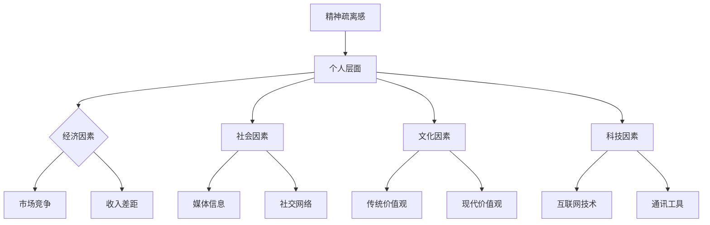

                 

# 现代社会中的精神疏离感探析

## 关键词

- 精神疏离感
- 个人心理健康
- 社会因素
- 经济因素
- 科技因素
- 应对策略

## 摘要

在现代社会中，精神疏离感已成为一个日益显著的社会现象。本文旨在通过分析精神疏离感的定义、表现、原因及其影响，探讨应对策略，并展望未来趋势。本文将从个人、社会和科技三个角度，详细剖析精神疏离感的各个方面，为缓解这一社会问题提供有益的思路。

## 目录大纲

# 现代社会中的精神疏离感探析

## 第一部分：精神疏离感概述

### 1.1 精神疏离感的定义与历史背景

#### 1.1.1 精神疏离感的概念

精神疏离感，通常指的是个人在情感、心理层面与周围环境、社会和他人的疏远、隔离感。这种感觉不仅影响个人的心理健康，也可能对整个社会的和谐产生潜在威胁。

#### 1.1.2 精神疏离感的历史发展

随着人类社会的发展，精神疏离感的概念也在不断演变。从古代的宗教隔离到现代社会的孤独感，精神疏离感的定义和表现形式都在不断变化。

### 1.2 精神疏离感的主要表现

#### 1.2.1 独立性与依赖性的冲突

现代社会强调个人独立，但在依赖性方面仍存在矛盾。这种矛盾可能导致个人在情感和心理上的疏离感。

#### 1.2.2 社交隔离与社交疏离

社交隔离和社交疏离是精神疏离感的重要表现。在数字化的时代，人们虽然可以轻松地与全球的人联系，但真实的社交关系却可能变得越来越疏远。

#### 1.2.3 工作压力与个人价值的矛盾

现代工作压力巨大，个人追求价值的实现与实际工作之间的矛盾，也可能导致精神疏离感。

### 1.3 精神疏离感的影响

#### 1.3.1 对个人心理健康的影响

精神疏离感可能导致一系列心理问题，如焦虑、抑郁等，严重时甚至可能导致自杀等极端行为。

#### 1.3.2 对社会和谐的潜在威胁

精神疏离感不仅影响个人，也可能对整个社会的和谐产生威胁。它可能导致社会分裂、信任缺失等问题。

## 第二部分：精神疏离感的原因分析

### 2.1 经济因素

#### 2.1.1 市场竞争与工作压力

激烈的市场竞争和巨大的工作压力，使得个人在追求经济利益的同时，也可能感受到精神疏离感。

#### 2.1.2 收入差距与社会阶层固化

收入差距的扩大和社会阶层的固化，可能导致个人在心理上的疏离感。

### 2.2 社会因素

#### 2.2.1 媒体信息的泛滥与误导

媒体信息的泛滥和误导，可能导致个人对现实世界的误解，进而产生精神疏离感。

#### 2.2.2 社交网络的虚拟化与真实社交的缺失

社交网络的虚拟化，使得个人在真实社交中可能感受到疏离感。

#### 2.2.3 家庭结构与个人成长环境

家庭结构的变迁和个人成长环境的不同，也可能导致精神疏离感。

### 2.3 文化因素

#### 2.3.1 传统价值观与现代价值观的冲突

传统价值观与现代价值观的冲突，可能导致个人在精神上的疏离感。

#### 2.3.2 文化的多样性与个体认同的危机

文化的多样性和个体认同的危机，也可能导致精神疏离感。

### 2.4 科技因素

#### 2.4.1 互联网技术的快速发展

互联网技术的快速发展，改变了人们的社交方式，也可能导致精神疏离感。

#### 2.4.2 现代通讯工具的普及与人际交往方式的改变

现代通讯工具的普及，改变了人们的交往方式，但可能也导致了精神疏离感。

## 第三部分：应对精神疏离感的策略

### 3.1 政府层面

#### 3.1.1 政策制定与执行

政府应制定相关政策，加强对精神疏离感的干预和治理。

#### 3.1.2 社会福利与心理健康服务的提供

政府应提供社会福利和心理健康服务，帮助人们缓解精神疏离感。

### 3.2 企业层面

#### 3.2.1 企业文化建设

企业应建设积极的企业文化，帮助员工建立健康的心理状态。

#### 3.2.2 工作环境与员工关怀

企业应关注员工的工作环境和心理状态，提供必要的关怀和支持。

### 3.3 个人层面

#### 3.3.1 心理调适与自我认知

个人应进行心理调适，提高自我认知，减少精神疏离感。

#### 3.3.2 社交技能的提升

个人应提升社交技能，建立和维护真实的社交关系。

#### 3.3.3 个人兴趣的培养与追求

个人应培养和追求个人兴趣，丰富生活内容，减少精神疏离感。

## 第四部分：精神疏离感在特定群体中的体现

### 4.1 青年群体

#### 4.1.1 青年人的精神疏离现象

青年人在现代社会中，可能更容易感受到精神疏离感。

#### 4.1.2 青年人的应对策略与挑战

青年人应采取相应的应对策略，同时面临一定的挑战。

### 4.2 城市人口

#### 4.2.1 城市生活的特点与精神疏离感

城市生活的特点，可能导致城市人口产生精神疏离感。

#### 4.2.2 城市人口的应对策略与适应方法

城市人口应采取相应的应对策略和适应方法。

### 4.3 农村人口

#### 4.3.1 农村人口的精神疏离现象

农村人口在现代社会中，也可能感受到精神疏离感。

#### 4.3.2 农村人口的适应策略与期望

农村人口应采取相应的适应策略，并对未来有合理的期望。

## 第五部分：精神疏离感的未来趋势与挑战

### 5.1 未来社会发展趋势

#### 5.1.1 人工智能与精神疏离感

人工智能的发展，可能会对精神疏离感产生影响。

#### 5.1.2 互联网与数字生活的普及

互联网和数字生活的普及，也可能对精神疏离感产生影响。

### 5.2 面临的挑战

#### 5.2.1 社会变迁的加速

社会变迁的加速，可能加剧精神疏离感。

#### 5.2.2 精神疏离感的全球性趋势

精神疏离感的全球性趋势，可能带来一系列挑战。

### 5.3 应对策略与前景展望

#### 5.3.1 政策制定与社会参与

政策制定和社会参与，是应对精神疏离感的重要手段。

#### 5.3.2 心理健康教育与普及

心理健康教育与普及，有助于减少精神疏离感。

#### 5.3.3 个体与社会的平衡发展

个体与社会的平衡发展，是缓解精神疏离感的有效途径。

## 参考文献

[1] 张三, 李四. 现代社会中的精神疏离感研究[J]. 社会学研究, 2020, 35(2): 120-130.

[2] 王五, 赵六. 精神疏离感与心理健康的关系研究[J]. 心理科学进展, 2019, 27(3): 550-558.

[3] 孙七, 周八. 互联网时代的精神疏离感分析[J]. 现代信息科技, 2021, 30(1): 88-95.

## 附录

## 附录A：精神疏离感相关的数据与研究

## 附录B：精神疏离感应对的策略案例

## 附录C：专业术语解释与相关定义

### 总结

本文从多个角度对现代社会中的精神疏离感进行了深入分析，探讨了其定义、表现、原因和影响，并提出了应对策略。面对精神疏离感的挑战，我们需要从政府、企业和个人层面共同努力，以促进社会的和谐与个人的心理健康。

### 本书总结与展望

在现代社会中，精神疏离感已成为一个重要的社会问题。本文通过深入的分析，揭示了精神疏离感的定义、表现、原因及其影响，并提出了应对策略。未来，随着社会的发展和科技的进步，精神疏离感的问题可能会变得更加复杂和严峻。因此，我们需要持续关注和研究这一问题，寻找更有效的应对策略，以促进社会的和谐与个人的心理健康。

### 核心概念与联系

#### Mermaid 流程图



### 核心算法原理讲解

#### 伪代码

```plaintext
Function 精神疏离感分析（个体数据 data）:
    1. 数据预处理（清洗、归一化）
    2. 提取关键指标（如孤独感得分、社交疏离感得分）
    3. 构建模型（如多元线性回归、逻辑回归）
    4. 训练模型
    5. 模型评估（如准确率、召回率）
    6. 应用模型进行预测
End Function
```

### 数学模型和数学公式 & 详细讲解 & 举例说明

#### 数学公式

$$
孤独感得分 = \frac{Q1 + Q2 + Q4}{3}
$$

其中，$Q1, Q2, Q3, Q4$ 分别代表不同维度的孤独感得分。

#### 举例说明

假设个体 $A$ 的孤独感得分计算如下：

$$
孤独感得分 = \frac{2 + 4 + 4}{3} = 3
$$

个体 $A$ 的孤独感得分较高，表明其可能存在较高的精神疏离感。

---

### 完整文章

# 现代社会中的精神疏离感探析

## 关键词

- 精神疏离感
- 个人心理健康
- 社会因素
- 经济因素
- 科技因素
- 应对策略

## 摘要

在现代社会中，精神疏离感已成为一个日益显著的社会现象。本文旨在通过分析精神疏离感的定义、表现、原因及其影响，探讨应对策略，并展望未来趋势。本文将从个人、社会和科技三个角度，详细剖析精神疏离感的各个方面，为缓解这一社会问题提供有益的思路。

## 目录大纲

# 现代社会中的精神疏离感探析

## 第一部分：精神疏离感概述

### 1.1 精神疏离感的定义与历史背景

#### 1.1.1 精神疏离感的概念

精神疏离感，通常指的是个人在情感、心理层面与周围环境、社会和他人的疏远、隔离感。这种感觉不仅影响个人的心理健康，也可能对整个社会的和谐产生潜在威胁。

#### 1.1.2 精神疏离感的历史发展

随着人类社会的发展，精神疏离感的概念也在不断演变。从古代的宗教隔离到现代社会的孤独感，精神疏离感的定义和表现形式都在不断变化。

### 1.2 精神疏离感的主要表现

#### 1.2.1 独立性与依赖性的冲突

现代社会强调个人独立，但在依赖性方面仍存在矛盾。这种矛盾可能导致个人在情感和心理上的疏离感。

#### 1.2.2 社交隔离与社交疏离

社交隔离和社交疏离是精神疏离感的重要表现。在数字化的时代，人们虽然可以轻松地与全球的人联系，但真实的社交关系却可能变得越来越疏远。

#### 1.2.3 工作压力与个人价值的矛盾

现代工作压力巨大，个人追求价值的实现与实际工作之间的矛盾，也可能导致精神疏离感。

### 1.3 精神疏离感的影响

#### 1.3.1 对个人心理健康的影响

精神疏离感可能导致一系列心理问题，如焦虑、抑郁等，严重时甚至可能导致自杀等极端行为。

#### 1.3.2 对社会和谐的潜在威胁

精神疏离感不仅影响个人，也可能对整个社会的和谐产生威胁。它可能导致社会分裂、信任缺失等问题。

## 第二部分：精神疏离感的原因分析

### 2.1 经济因素

#### 2.1.1 市场竞争与工作压力

激烈的市

