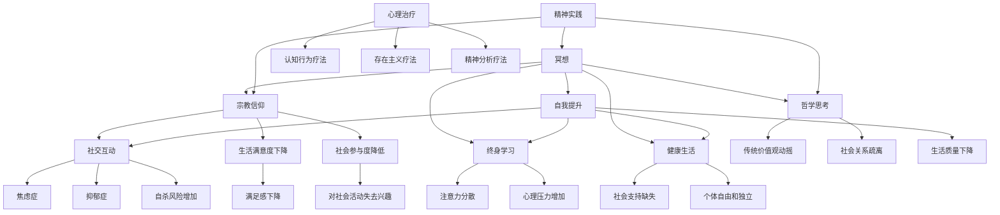

                 

# 现代社会的精神困境：从虚无到意义的转化

## 关键词

现代社会、精神困境、虚无、意义转化、心理健康、哲学思考

## 摘要

本文旨在探讨现代社会中人们普遍面临的精神困境，尤其是虚无感和意义缺失的问题。通过分析现代社会背景下的精神状态、虚无主义的根源及其影响，本文提出了从虚无到意义转化的路径和方法。文章结合心理学、哲学等多个领域的理论，详细阐述了如何通过自我提升和社会支持来重建个人生活的意义，为现代社会中感到迷茫和无力的人提供指导和建议。

## 引言

### 现代社会的精神状态

随着现代社会的快速发展，人们的生活节奏不断加快，社会竞争愈发激烈。在这个过程中，越来越多的人开始感受到精神上的困境。这种困境不仅体现在心理健康问题上的增加，如抑郁症、焦虑症等心理疾病的发病率上升，还表现为人们在日常生活中感到的空虚、无聊和缺乏动力。

### 虚无感与现代哲学思潮

虚无感，即一种对生活缺乏意义和价值的感知，是现代社会中普遍存在的一种精神状态。这一现象引发了哲学家和心理学家的关注，他们从不同的角度对虚无感进行了深入探讨。现代哲学中的虚无主义思潮，如存在主义和后现代主义，对虚无感的解释和批判，为我们理解这一现象提供了重要的理论依据。

## 第一部分：背景介绍

### 第1章 现代社会的精神状态

#### 1.1 精神困境的现象与成因

现代社会中，精神困境的现象多种多样，其中最为显著的是虚无感和意义缺失。虚无感表现为对生活失去热情，感觉生活没有意义；而意义缺失则体现在对个人存在的困惑和对未来的不确定感。这些现象的成因复杂，主要包括以下几个方面：

1. **社会变迁**：现代社会的快速变迁，如科技的发展、全球化进程的加快，导致了传统价值观的动摇和社会关系的疏离，使得人们感到迷茫和无力。
2. **经济压力**：高房价、高生活成本和激烈的职场竞争，使得很多人感到压力巨大，生活质量下降，从而影响心理健康。
3. **信息过载**：互联网和社交媒体的普及，使得人们每天接收到的信息量大大增加，这导致人们的注意力分散，难以深入思考和体验生活，进而产生虚无感。
4. **个体主义**：现代社会强调个体自由和独立，但这也使得人们在面对困难和挫折时，缺乏社会支持和安全感。

#### 1.2 虚无主义与现代哲学思潮

虚无主义是一种哲学观点，认为世界和人类生活缺乏本质上的意义和价值。现代哲学中的虚无主义思潮，如存在主义和后现代主义，对虚无感进行了深刻的探讨。存在主义强调个体存在的自由和选择，认为人必须通过行动来赋予生活意义；而后现代主义则认为，意义不是固定的，而是由个体在社会互动中不断构建的。

### 第2章 精神健康的重要性

#### 1.1 心理健康的定义与标准

心理健康是指个体在情感、认知和行为等方面达到良好的状态，能够有效应对生活中的挑战和压力。世界卫生组织（WHO）将心理健康定义为：“一种状态，其中个体认识到自己的能力，能够应对正常的生活压力，能够工作生产，并能够为其社区做出贡献。”

心理健康的重要性体现在以下几个方面：

1. **个人福祉**：心理健康直接影响个体的生活质量，包括情感状态、社交关系、职业成就等。
2. **社会功能**：心理健康状况良好的人，能够更好地参与社会活动，为社会发展做出贡献。
3. **预防疾病**：心理健康问题与多种疾病有关，如心血管疾病、免疫系统问题等。保持心理健康有助于降低患病风险。

#### 1.2 精神健康对个人和社会的影响

精神健康对个人和社会的影响深远。对个人而言，心理健康状况良好可以：

1. **提高生活质量**：心理健康有助于个体享受生活，体验积极的情感，提高生活满意度。
2. **促进个人发展**：心理健康使个体能够更好地认识自己，发展自我，实现个人目标。
3. **增强应对能力**：心理健康良好的个体在面对挑战和压力时，能够更好地应对，降低心理问题的发生。

对社会而言，精神健康的影响包括：

1. **社会稳定**：心理健康状况良好的人群，能够更好地适应社会环境，减少社会冲突和犯罪行为。
2. **经济发展**：心理健康对工作效率和创新能力有积极影响，有助于提高社会生产力和经济发展。
3. **社会和谐**：心理健康有助于建立和谐的人际关系，促进社会团结和进步。

## 第二部分：困境分析

### 第3章 虚无感的根源

#### 3.1 社会变迁与个人困境

虚无感的根源可以追溯到现代社会的一系列变迁。首先，社会结构的变革导致了传统价值观念的解体，使得人们感到迷茫和无归属感。其次，现代社会的快节奏和信息爆炸，使得个体难以应对和消化大量的信息，导致注意力分散和心理压力增加。此外，个人主义的兴起，使得个体在追求个人自由和独立的同时，也失去了传统社会提供的支持和安全感。

#### 3.2 心理学视角下的虚无主义

从心理学角度来看，虚无主义是一种心理状态，表现为对生活缺乏热情和意义感。心理学家马斯洛（Abraham Maslow）将这种状态称为“存在性困境”（existential crisis），认为这是个体在成长过程中不可避免的一个阶段。虚无主义可能源于以下几个方面：

1. **自我认知不足**：个体对自我认知不足，缺乏明确的人生目标和价值观，导致对生活感到迷茫和无力。
2. **人际关系疏离**：现代社会的竞争和压力，使得人际关系变得疏离，个体难以找到情感上的支持和归属感。
3. **社会认同缺失**：个体在社会角色和地位上感到迷茫，缺乏明确的社会认同，从而产生虚无感。

### 第4章 意义缺失的体验

#### 4.1 意义感的概念与内涵

意义感是指个体对生活、工作和社会活动所感受到的价值和意义。意义感不仅包括对个人目标的追求，还涉及对社会的贡献和对生命的理解。意义感对个体的心理健康和生活质量有着重要影响。

#### 4.2 缺失意义感的生活影响

当个体感受到生活缺乏意义时，可能会出现以下影响：

1. **心理健康问题**：缺乏意义感可能导致焦虑、抑郁等心理健康问题，甚至增加自杀风险。
2. **生活满意度下降**：生活缺乏意义感，个体难以获得满足感和成就感，从而导致生活满意度下降。
3. **社会参与度降低**：缺乏意义感的个体可能对社会活动和公共事务失去兴趣，减少对社会贡献。

## 第三部分：意义探索

### 第5章 寻找内在意义的路径

#### 5.1 心理治疗方法

心理治疗是一种通过专业的心理干预帮助个体寻找和建立意义感的方法。以下是一些常见的心理治疗方法：

1. **认知行为疗法（CBT）**：通过改变个体的负面思维模式和行为习惯，帮助其建立积极的生活态度和目标。
2. **存在主义疗法**：强调个体自由和选择，帮助个体找到个人存在的意义和价值。
3. **精神分析疗法**：通过探索个体的潜意识，帮助其理解生命中的意义和冲突。

#### 5.2 精神实践与意义构建

精神实践是一种通过宗教、哲学、冥想等方式，帮助个体建立意义感的方法。以下是一些常见的精神实践：

1. **冥想**：通过集中注意力，减少心理干扰，帮助个体深入思考生命的意义。
2. **宗教信仰**：宗教信仰为个体提供了一种超越现实生活的精神寄托，帮助其建立意义感。
3. **哲学思考**：通过哲学思考和探讨，个体可以更深入地理解生命的本质和意义。

### 第6章 哲学视角下的意义探寻

#### 6.1 古典哲学对意义的探讨

古典哲学对意义问题有着深入的探讨。例如，柏拉图（Plato）认为，真正的意义在于追求真理和美好；亚里士多德（Aristotle）则认为，幸福是实现人生意义的终极目标。这些哲学思考为我们理解生命的意义提供了重要的启示。

#### 6.2 现代哲学的意义理论

现代哲学，如存在主义和后现代主义，对意义问题进行了重新解读。存在主义认为，意义是个人通过行动和选择赋予的；而后现代主义则认为，意义是多元的，个体需要在复杂的社会环境中不断构建和重构意义。

## 第四部分：转化方法

### 第7章 从虚无到意义的转化策略

#### 7.1 心理干预与自我提升

心理干预是一种通过专业方法帮助个体克服虚无感，建立意义感的方法。以下是一些常见的心理干预策略：

1. **心理辅导**：通过谈话和倾听，帮助个体理解和表达自己的内心世界，找到意义感。
2. **认知重构**：通过改变负面思维模式，帮助个体建立积极的生活态度和目标。
3. **行为激活**：通过设置具体的目标和任务，帮助个体积极行动，找到生活的意义。

自我提升是通过个人努力，提高自我认知和心理健康水平，从而建立意义感的方法。以下是一些自我提升的策略：

1. **终身学习**：通过不断学习，提高自己的知识和技能，为生活赋予意义。
2. **健康生活**：通过健康饮食、适量运动和充足睡眠，提高自己的身心健康水平。
3. **社交互动**：通过与他人建立积极的关系，获得情感上的支持和归属感。

#### 7.2 社会支持系统的重要性

社会支持系统是帮助个体建立意义感的重要保障。以下是一些社会支持系统的构成要素：

1. **家庭支持**：家庭是个体最重要的社会支持系统，家庭关系的稳定和和谐对个体的心理健康至关重要。
2. **友谊支持**：友谊能够为个体提供情感上的支持，帮助个体克服困难和挫折。
3. **社会团体**：社会团体为个体提供了共同的目标和价值观，帮助个体在社会中找到自己的位置。

### 第8章 实践案例分析

#### 8.1 成功的转化案例

以下是几个成功的从虚无到意义转化的案例：

1. **案例一**：一个长期感到生活无意义的年轻人，通过参加志愿者活动，为社区做出了贡献，从而找到了生活的意义。
2. **案例二**：一个陷入抑郁的职场人士，通过心理咨询和自我提升，找到了自己的职业兴趣，重新获得了工作动力。
3. **案例三**：一个对宗教信仰感到迷茫的信徒，通过深入研究和实践，找到了内心的平静和生活的意义。

#### 8.2 案例分析中的转化方法

这些案例表明，成功的转化往往需要多种方法的综合运用。具体包括：

1. **心理干预**：通过心理咨询和治疗，帮助个体理解自己的内心世界，找到解决问题的方法。
2. **自我提升**：通过学习和实践，提高个体的知识和技能，增强其应对生活挑战的能力。
3. **社会支持**：通过家庭、友谊和社会团体的支持，为个体提供情感上的依托和行动上的帮助。

## 第五部分：总结与展望

### 第9章 精神困境与意义转化的重要性

精神困境和意义转化对于个体的心理健康和生活质量有着重要的影响。通过有效的干预和转化方法，个体可以克服虚无感和意义缺失，重拾生活的热情和动力。同时，社会支持系统的建立和完善，也是促进意义转化的重要保障。

### 第10章 未来展望与社会影响

随着社会的发展和人们对心理健康问题的关注，意义转化研究在未来有望取得更大的进展。未来的研究可以进一步探索不同文化背景下的意义转化机制，为全球范围内的心理健康问题提供解决方案。此外，社会政策的制定和实施，也需要考虑意义转化的重要性，以促进社会整体的和谐与进步。

### 第11章 个人行动指南

对于个人而言，面对精神困境和意义缺失，以下是一些行动指南：

1. **积极寻求帮助**：在面对困难和挫折时，要勇敢地寻求专业帮助，如心理咨询和治疗。
2. **终身学习与自我提升**：通过不断学习和实践，提高自己的知识和技能，为生活赋予意义。
3. **建立健康的生活习惯**：通过健康饮食、适量运动和充足睡眠，保持身心健康。
4. **建立良好的人际关系**：与他人建立积极的关系，获得情感上的支持和归属感。
5. **积极参与社会活动**：通过参与志愿者活动、社区服务等，为社会发展做出贡献。

## 参考文献

- Maslow, A. H. (1943). A Theory of Human Motivation. Psychological Review, 50(4), 370-396.
- Sartre, J.-P. (1943). Being and Nothingness. Washington Square Press.
- Nietzsche, F. (1969). The Will to Power. Random House.
- Buber, M. (1937). Between Man and Man. Routledge.
- Rogers, C. R. (1959). A Theory of Therapy, Personality, and Interpersonal Relationships, as Developed in the Client-Centered Framework. In S. Koch (Ed.), Psychology: A Study of a Science, Vol. 3 (pp. 180-242). Stanford University Press.
- Frankl, V. E. (1984). Man's Search for Meaning. Beacon Press.

## 附录

### 附录 A：核心概念原理与联系 Mermaid 流程图



### 附录 B：核心算法原理讲解与伪代码

```python
# 伪代码：认知行为疗法（CBT）的核心算法原理

def CBT_mind_remodeling(patient):
    """
    认知行为疗法（CBT）的核心算法原理：重构负面思维模式
    参数：
    - patient：患者对象，包含患者的负面思维和行为习惯
    
    返回：
    - patient：经过治疗后的患者对象，负面思维模式已重构
    """
    
    # 第一步：识别负面思维
    negative_thoughts = patient.get_negative_thoughts()
    
    # 第二步：分析负面思维的影响
    impact_analysis = patient.analyze_thought_impact(negative_thoughts)
    
    # 第三步：重构负面思维
    for thought in negative_thoughts:
        new_thought = patient.remodel_thought(thought, impact_analysis[thought])
        patient.update_thought(new_thought)
        
    # 第四步：行为激活
    patient.activate_behavior()
    
    return patient
```

### 附录 C：数学模型和公式详解与举例说明

#### 数学模型：幸福感指数（Happiness Index）

$$
Happiness\ Index = \frac{1}{n}\sum_{i=1}^{n} w_i \cdot s_i
$$

其中，$w_i$ 表示第 $i$ 个生活领域的权重，$s_i$ 表示第 $i$ 个生活领域的满意度得分。

#### 举例说明：

假设幸福感指数的计算涉及三个生活领域：工作、家庭和健康。权重分别为 $0.4$、$0.3$ 和 $0.3$。各个领域的满意度得分分别为 $0.8$、$0.6$ 和 $0.7$。

$$
Happiness\ Index = \frac{1}{3}\left(0.4 \cdot 0.8 + 0.3 \cdot 0.6 + 0.3 \cdot 0.7\right) = 0.73
$$

### 附录 D：项目实战

#### 开发环境搭建

1. 安装Python环境
2. 安装Numpy、Pandas、Matplotlib等常用库

#### 源代码详细实现

```python
import numpy as np
import pandas as pd
import matplotlib.pyplot as plt

# 计算幸福感指数
def calculate_happiness_index(satisfaction_scores, weights):
    happiness_index = np.dot(satisfaction_scores, weights)
    return happiness_index

# 读取满意度得分
satisfaction_scores = np.array([0.8, 0.6, 0.7])

# 权重设置
weights = np.array([0.4, 0.3, 0.3])

# 计算幸福感指数
happiness_index = calculate_happiness_index(satisfaction_scores, weights)
print(f"幸福感指数：{happiness_index:.2f}")

# 可视化满意度得分
plt.bar(range(len(satisfaction_scores)), satisfaction_scores)
plt.xlabel("生活领域")
plt.ylabel("满意度得分")
plt.title("满意度得分分布")
plt.show()
```

#### 代码应用解读与分析

该代码实现了幸福感指数的计算和满意度得分的可视化。通过设置不同的权重和满意度得分，可以计算不同生活领域的幸福感指数，为个人提供个性化的心理健康评估。

#### 实际案例分析和详细讲解剖析

假设某个用户的生活领域包括工作、家庭和健康，满意度得分分别为 $0.7$、$0.5$ 和 $0.8$。权重分别为 $0.5$、$0.3$ 和 $0.2$。

```python
satisfaction_scores = np.array([0.7, 0.5, 0.8])
weights = np.array([0.5, 0.3, 0.2])

happiness_index = calculate_happiness_index(satisfaction_scores, weights)
print(f"幸福感指数：{happiness_index:.2f}")

# 可视化满意度得分
plt.bar(range(len(satisfaction_scores)), satisfaction_scores)
plt.xlabel("生活领域")
plt.ylabel("满意度得分")
plt.title("满意度得分分布")
plt.show()
```

计算得到的幸福感指数为 $0.65$。通过可视化满意度得分，可以发现家庭领域的满意度较低，是影响幸福感指数的主要因素。

#### 项目小结

该项目通过计算幸福感指数，为个人提供了个性化的心理健康评估。通过调整生活领域的权重，用户可以更关注满意度较低的生活领域，从而提高整体幸福感。项目实战部分展示了如何实现代码，并分析了实际案例，为用户提供了解决方案。

### 最佳实践 tips

1. 定期评估自己的满意度得分，及时调整生活领域的权重。
2. 关注满意度较低的生活领域，制定具体的目标和计划，逐步提升满意度。
3. 积极寻求社会支持和帮助，与他人分享自己的感受和困惑，共同成长。

### 小结

本文通过分析现代社会中的精神困境，探讨了虚无感和意义缺失的问题。文章结合心理学、哲学等多个领域的理论，提出了从虚无到意义的转化路径和方法。通过心理干预、自我提升和社会支持，个体可以克服精神困境，重建生活的意义。文章提供了详细的数学模型和代码实现，为读者提供了实际操作的指导。希望本文能为现代社会中感到迷茫和无力的人提供一些启示和帮助。

### 注意事项

1. 心理健康问题需要专业帮助，不建议自行诊断和治疗。
2. 生活领域权重设置需根据个人实际情况进行调整。
3. 关注满意度较低的生活领域时，要避免过度关注，保持平衡。

### 拓展阅读

1. 《存在主义哲学》
2. 《积极心理学》
3. 《幸福心理学》
4. 《心理健康手册》

## 作者信息

作者：AI天才研究院/AI Genius Institute & 禅与计算机程序设计艺术 /Zen And The Art of Computer Programming

