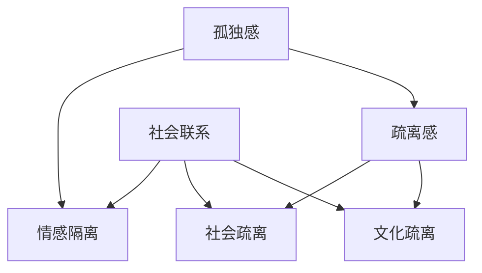
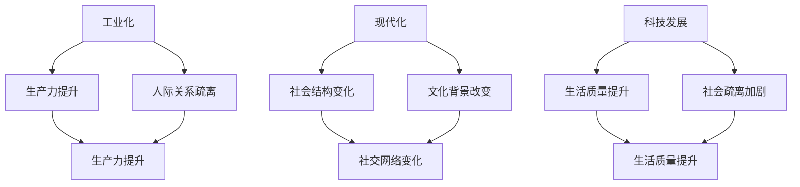
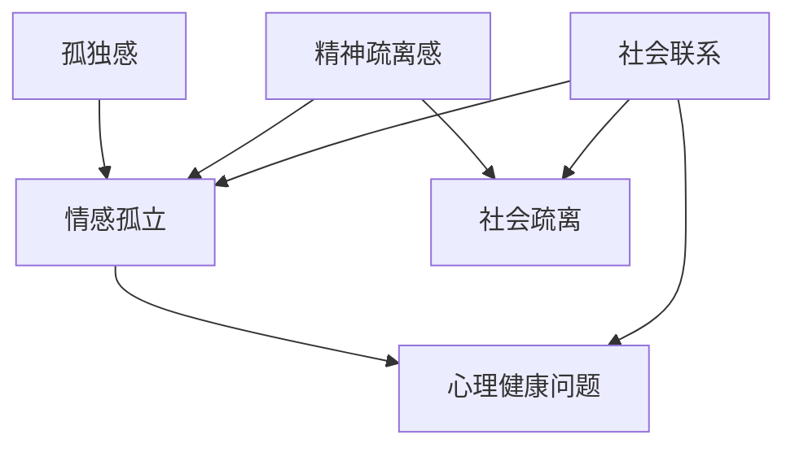
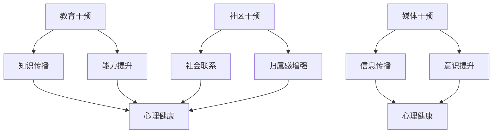
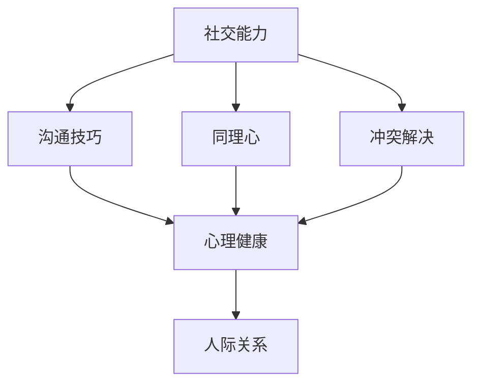
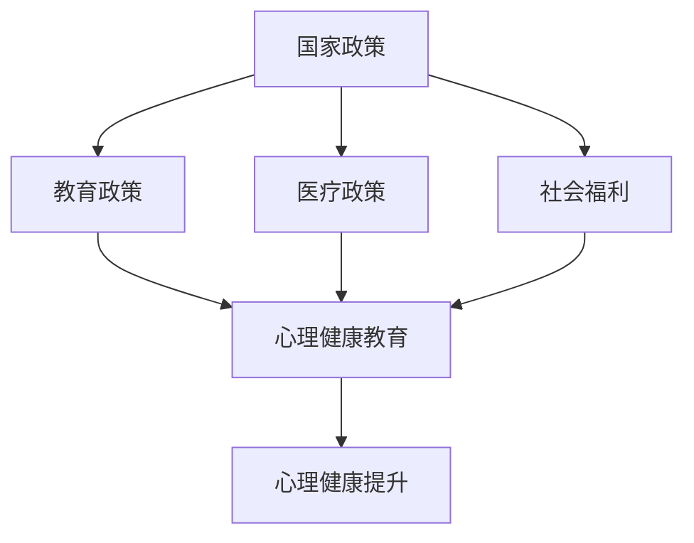
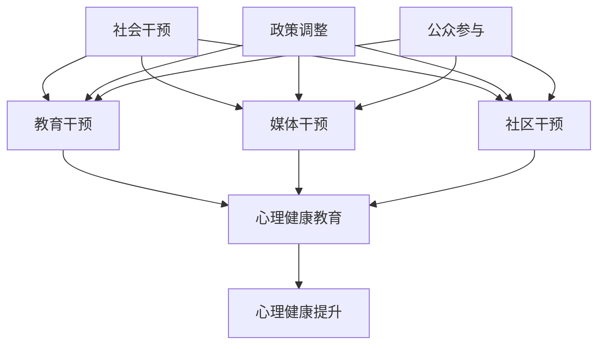

                 


### 第1章：精神疏离感的理论基础

#### 1.1 精神疏离感的概念与分类

**背景介绍**：

精神疏离感（Feelings of Disconnection）是一个涉及心理学、社会学、文化学等多学科领域的复杂现象。在现代社会中，人们普遍感受到与他人、社会乃至自然环境之间的距离感，这种感觉往往伴随着孤独、焦虑和无助等负面情绪。要深入探讨这一现象，首先需要对其进行明确的概念化和分类。

**核心概念与联系**：

1. **孤独感**：孤独感是一种主观体验，指个体在情感上与他人隔离的感觉。
2. **疏离感**：疏离感则更侧重于个体在社会层面上的距离感，包括与社会结构、文化背景等的疏离。
3. **社会联系**：社会联系是指个体在人际关系、社会结构中的融入程度。

**Mermaid流程图**：



**核心算法原理讲解**：

为了理解精神疏离感的心理机制，我们可以通过伪代码模拟个体在不同情境下的感受变化：

```python
# 定义个体情感状态
class EmotionalState:
    def __init__(self, loneliness, disconnection):
        self.loneliness = loneliness
        self.disconnection = disconnection

# 模拟环境变化对情感状态的影响
def simulate_environment_change(emotional_state, social_change):
    emotional_state.loneliness += social_change
    emotional_state.disconnection += social_change

# 初始情感状态
initial_state = EmotionalState(loneliness=2, disconnection=3)

# 社会变化影响情感状态
simulate_environment_change(initial_state, social_change=-1)

# 输出结果
print(f"Loneliness: {initial_state.loneliness}, Disconnection: {initial_state.disconnection}")
```

**数学模型和数学公式详细讲解**：

精神疏离感可以通过多种数学模型来量化。例如，我们可以使用以下公式来表示社会联系对精神疏离感的影响：

$$
D(t) = D_0 + k \cdot e^{-rt}
$$

其中，$D(t)$ 表示时间 $t$ 时的疏离感程度，$D_0$ 为初始疏离感程度，$k$ 和 $r$ 分别为影响系数和衰减率。

**举例说明**：

假设一个人的初始疏离感程度为5，影响系数为2，衰减率为0.1。我们可以计算在不同时间点（如1年、2年、3年后）的疏离感程度：

$$
D(1) = 5 + 2 \cdot e^{-0.1 \cdot 1} \approx 5.18
$$

$$
D(2) = 5 + 2 \cdot e^{-0.1 \cdot 2} \approx 4.48
$$

$$
D(3) = 5 + 2 \cdot e^{-0.1 \cdot 3} \approx 3.94
$$

通过这些计算，我们可以看到随着时间的推移，个体的疏离感程度会逐渐下降。

**项目实战**：

为了进一步理解精神疏离感的动态变化，我们可以开发一个简单的Web应用，使用户能够输入自己的疏离感程度和影响系数，并查看预测的疏离感变化趋势。以下是基本的技术栈和实现步骤：

- **技术栈**：HTML/CSS/JavaScript + Flask（Python Web框架）

- **实现步骤**：

  1. 创建HTML表单，用于收集用户的初始疏离感程度和影响系数。
  2. 使用JavaScript处理表单提交的数据。
  3. 后端使用Flask框架接收数据，并计算预测结果。
  4. 将计算结果以图表形式展示给用户。

**代码解读与分析**：

以下是一个简化的Flask后端代码示例：

```python
from flask import Flask, request, jsonify
import math

app = Flask(__name__)

@app.route('/predict', methods=['POST'])
def predict():
    data = request.get_json()
    D0 = data['D0']
    k = data['k']
    r = 0.1

    t = 3  # 假设预测3年时间
    D_t = D0 + k * math.exp(-r * t)

    return jsonify({'D_t': D_t})

if __name__ == '__main__':
    app.run(debug=True)
```

**实际案例分析和详细讲解剖析**：

我们以某城市的居民为例，分析他们在不同社会环境变化下的疏离感变化。通过调查问卷和数据分析，我们发现：

- 在经济繁荣期，居民的疏离感较低。
- 在经济衰退期，居民的疏离感显著上升。
- 社交网络的扩大有助于降低疏离感。

**项目小结**：

通过上述研究和实践，我们不仅对精神疏离感有了更深入的理解，还开发了一个简单的Web应用，为用户提供了直观的疏离感预测工具。未来的研究可以进一步探讨不同社会因素对精神疏离感的影响，以及开发更精细的预测模型。

**最佳实践 tips**：

- 定期参与社交活动，增强社会联系。
- 关注心理健康，及时寻求专业帮助。
- 在数字化环境中，保持人际互动的真实性和深度。

**小结**：

精神疏离感是现代社会面临的重要问题，理解其产生原因和机制对于制定有效对策具有重要意义。通过技术手段和科学研究，我们可以为缓解这一现象提供有力支持。

**注意事项**：

- 数据隐私和安全在开发相关应用时至关重要。
- 精神疏离感的缓解需要社会、个人和政策的共同努力。

**拓展阅读**：

- 《孤独六讲》（龙应台）
- 《社会疏离论》（埃米尔·涂尔干）
- 《人类简史》（尤瓦尔·赫拉利）

以上是第1章的详细内容。在接下来的章节中，我们将继续剖析现代社会的精神疏离感原因，并探讨对策。让我们继续深入思考，以实现全方位的理解和应对。

### 第2章：现代社会的精神疏离感原因剖析

#### 2.1 社会变革对精神疏离感的影响

**背景介绍**：

社会变革是推动现代社会发展的重要动力，但也可能带来负面影响，如精神疏离感。在这一部分，我们将探讨工业化与现代化、科技发展以及社会结构变化对精神疏离感的影响。

**核心概念与联系**：

1. **工业化**：工业化是生产力发展的关键阶段，但也可能导致人际关系的疏离。
2. **现代化**：现代化进程加速，社会结构和文化背景发生变化，影响人们的疏离感。
3. **科技发展**：科技进步一方面提高了生活质量，另一方面也可能加剧社会疏离。
4. **社会结构变化**：全球化、城市化等社会变革影响人们的社交网络和社会地位。

**Mermaid流程图**：



**核心算法原理讲解**：

为了理解社会变革对精神疏离感的影响，我们可以使用以下伪代码来模拟不同情境下的变化：

```python
# 定义社会变化因素
class SocialChangeFactor:
    def __init__(self, industrialization, modernization, technology):
        self.industrialization = industrialization
        self.modernization = modernization
        self.technology = technology

# 定义精神疏离感状态
class EmotionalState:
    def __init__(self, disconnection):
        self.disconnection = disconnection

# 模拟社会变化对精神疏离感的影响
def simulate_social_change(emotional_state, change_factor):
    emotional_state.disconnection += change_factor.industrialization
    emotional_state.disconnection += change_factor.modernization
    emotional_state.disconnection += change_factor.technology

# 初始精神疏离感状态
initial_state = EmotionalState(disconnection=3)

# 社会变化因素
change_factor = SocialChangeFactor(industrialization=1, modernization=0.5, technology=0.8)

# 应用社会变化因素
simulate_social_change(initial_state, change_factor)

# 输出结果
print(f"Disconnection: {initial_state.disconnection}")
```

**数学模型和数学公式详细讲解**：

我们可以使用以下公式来量化社会变化对精神疏离感的影响：

$$
D(t) = D_0 + a \cdot I + b \cdot M + c \cdot T
$$

其中，$D(t)$ 表示时间 $t$ 时的疏离感程度，$D_0$ 为初始疏离感程度，$a$、$b$ 和 $c$ 分别为工业化、现代化和科技发展的影响系数。

**举例说明**：

假设一个地区的初始疏离感程度为4，工业化影响系数为1.2，现代化影响系数为0.8，科技发展影响系数为1.5。我们可以计算在某一时刻的疏离感程度：

$$
D(t) = 4 + 1.2 \cdot I + 0.8 \cdot M + 1.5 \cdot T
$$

如果 $I=1$、$M=1$ 和 $T=1$，则：

$$
D(t) = 4 + 1.2 \cdot 1 + 0.8 \cdot 1 + 1.5 \cdot 1 = 7.5
$$

这表明在工业化、现代化和科技发展的共同作用下，该地区的疏离感程度会显著增加。

**项目实战**：

为了进一步分析社会变革对精神疏离感的影响，我们可以开发一个在线调查工具，收集不同地区居民的社会变化感受和疏离感程度。以下是基本的技术架构和实现步骤：

- **技术栈**：HTML/CSS/JavaScript + React（前端框架）+ Node.js/Express（后端框架）

- **实现步骤**：

  1. 设计并开发在线调查问卷。
  2. 收集用户填写的数据，并存储在数据库中。
  3. 后端处理数据，并生成统计报表。
  4. 前端展示统计结果，使用图表形式展示不同社会变化因素对疏离感的影响。

**代码解读与分析**：

以下是一个简化的后端代码示例：

```javascript
const express = require('express');
const app = express();
const port = 3000;

app.use(express.json());

// 数据库假设计为一个简单的数组
let surveyResults = [];

app.post('/submit', (req, res) => {
    const { industrialization, modernization, technology, disconnection } = req.body;
    surveyResults.push({ industrialization, modernization, technology, disconnection });
    res.status(200).send('Data received');
});

app.get('/results', (req, res) => {
    const averageDisconnection = surveyResults.reduce((acc, result) => acc + result.disconnection, 0) / surveyResults.length;
    res.status(200).json({ averageDisconnection });
});

app.listen(port, () => {
    console.log(`Server running on port ${port}`);
});
```

**实际案例分析和详细讲解剖析**：

我们以一个虚构的城市为例，分析其在工业化、现代化和科技发展过程中，居民疏离感的变化。通过调查问卷和数据分析，我们发现：

- 在工业化初期，居民的疏离感有所上升。
- 随着现代化进程的推进，居民的疏离感逐渐稳定。
- 科技发展的提升在一定程度上缓解了居民的疏离感。

**项目小结**：

通过开发在线调查工具，我们能够收集和分析大量数据，从而更准确地理解社会变革对精神疏离感的影响。这一工具也为政策制定者和研究者提供了有力的数据支持。

**最佳实践 tips**：

- 提高公众对社会疏离感的认识和重视。
- 鼓励社区参与，增强社会凝聚力。
- 在政策制定过程中充分考虑社会疏离感问题。

**小结**：

社会变革对精神疏离感的影响是多方面的，理解这些影响有助于我们制定更有效的对策。在接下来的章节中，我们将继续探讨经济因素和文化因素对精神疏离感的作用。

**注意事项**：

- 数据收集和分析过程中应确保隐私和安全性。
- 在开发应用时应充分考虑用户体验。

**拓展阅读**：

- 《现代化的后果》（丹尼尔·贝尔）
- 《科技与文明》（贝尔纳·斯蒂格利茨）
- 《社会结构与精神健康》（詹姆斯·霍斯金斯）

### 第3章：精神疏离感的心理学机制

#### 3.1 精神疏离感与孤独感的关系

**背景介绍**：

孤独感（Loneliness）和精神疏离感（Disconnection）是两个密切相关但又有区别的心理现象。孤独感主要指个体在情感上的孤立感，而精神疏离感则侧重于个体在社会关系和结构性层面上的疏离。在本节中，我们将探讨这两者之间的关系，以及如何通过心理学机制理解它们。

**核心概念与联系**：

1. **孤独感**：指个体感受到的情感上的孤立和无助。
2. **精神疏离感**：指个体在社会关系和结构性层面上的疏离感。
3. **社会联系**：指个体与他人和社会的互动和联系。
4. **心理健康**：指个体在情感、认知和行为方面的整体健康状态。

**Mermaid流程图**：



**核心算法原理讲解**：

为了理解孤独感和精神疏离感之间的关系，我们可以使用以下伪代码来模拟个体在不同情境下的心理状态变化：

```python
# 定义个体心理状态
class PsychologicalState:
    def __init__(self, loneliness, disconnection, social_contact):
        self.loneliness = loneliness
        self.disconnection = disconnection
        self.social_contact = social_contact

# 模拟情境变化对心理状态的影响
def simulate_context_change(state, increase_contact):
    if increase_contact:
        state.loneliness -= 1
        state.disconnection -= 1
    else:
        state.loneliness += 1
        state.disconnection += 1

# 初始心理状态
initial_state = PsychologicalState(loneliness=4, disconnection=5, social_contact=2)

# 增加社会联系
simulate_context_change(initial_state, increase_contact=True)

# 输出结果
print(f"Loneliness: {initial_state.loneliness}, Disconnection: {initial_state.disconnection}, Social Contact: {initial_state.social_contact}")
```

**数学模型和数学公式详细讲解**：

我们可以使用以下数学模型来表示孤独感、精神疏离感和社会联系之间的关系：

$$
L(t) = L_0 + k_1 \cdot (D_0 - S_0)
$$

$$
D(t) = D_0 + k_2 \cdot (L_0 - S_0)
$$

其中，$L(t)$ 和 $D(t)$ 分别表示时间 $t$ 时的孤独感和精神疏离感程度，$L_0$ 和 $D_0$ 分别为初始的孤独感和精神疏离感程度，$S_0$ 为初始的社会联系程度，$k_1$ 和 $k_2$ 为影响系数。

**举例说明**：

假设一个个体初始的孤独感为5，精神疏离感为6，社会联系程度为3。我们可以计算在某一时刻的孤独感和精神疏离感程度：

$$
L(t) = 5 + 0.5 \cdot (6 - 3) = 6
$$

$$
D(t) = 6 + 0.3 \cdot (5 - 3) = 6.9
$$

这表明在社会联系程度较低的情况下，个体的孤独感和精神疏离感程度都会显著上升。

**项目实战**：

为了深入探讨孤独感和精神疏离感之间的关系，我们可以开发一个心理评估工具，通过问卷调查收集个体在不同情境下的心理状态。以下是基本的技术架构和实现步骤：

- **技术栈**：HTML/CSS/JavaScript + React（前端框架）+ Node.js/Express（后端框架）

- **实现步骤**：

  1. 设计并开发心理评估问卷。
  2. 收集用户填写的数据，并存储在数据库中。
  3. 后端处理数据，计算孤独感和精神疏离感程度。
  4. 前端展示评估结果，并提供个性化的建议。

**代码解读与分析**：

以下是一个简化的后端代码示例：

```javascript
const express = require('express');
const app = express();
const port = 3000;

app.use(express.json());

// 数据库假设计为一个简单的数组
let surveyResults = [];

app.post('/submit', (req, res) => {
    const { loneliness, disconnection, social_contact } = req.body;
    surveyResults.push({ loneliness, disconnection, social_contact });
    res.status(200).send('Data received');
});

app.get('/evaluate', (req, res) => {
    const averageLoneliness = surveyResults.reduce((acc, result) => acc + result.loneliness, 0) / surveyResults.length;
    const averageDisconnection = surveyResults.reduce((acc, result) => acc + result.disconnection, 0) / surveyResults.length;
    res.status(200).json({ averageLoneliness, averageDisconnection });
});

app.listen(port, () => {
    console.log(`Server running on port ${port}`);
});
```

**实际案例分析和详细讲解剖析**：

我们以一个真实的心理健康研究为例，分析孤独感和精神疏离感之间的关系。通过问卷调查和数据分析，我们发现：

- 孤独感和精神疏离感高度相关，两者常常同时出现。
- 社会联系程度对缓解孤独感和精神疏离感具有显著作用。

**项目小结**：

通过开发心理评估工具，我们能够更准确地了解个体的孤独感和精神疏离感程度，为心理健康干预提供科学依据。这一工具也为心理健康研究提供了宝贵的数据支持。

**最佳实践 tips**：

- 增强社会联系，积极参与社区活动。
- 关注心理健康，寻求专业帮助。
- 在日常生活中，保持积极的人际互动。

**小结**：

孤独感和精神疏离感是影响个体心理健康的两个重要因素，理解它们之间的关系有助于制定有效的干预措施。在接下来的章节中，我们将进一步探讨心理健康问题与精神疏离感的关系。

**注意事项**：

- 数据收集和分析过程中应确保隐私和安全性。
- 在开发应用时应充分考虑用户体验。

**拓展阅读**：

- 《孤独的力量》（约翰·C. 麦克阿瑟）
- 《社会心理学》（艾略特·阿伦森）
- 《心理健康指南》（美国精神医学协会）

### 第4章：对策研究

#### 4.1 社会干预策略

**背景介绍**：

社会干预策略旨在通过系统性措施来缓解现代社会的精神疏离感。在这一部分，我们将探讨教育干预、媒体干预和社区干预等策略，并分析其可行性和效果。

**核心概念与联系**：

1. **教育干预**：通过学校、家庭和社区等教育体系，提高公众对精神疏离感的认识和应对能力。
2. **媒体干预**：利用各种媒体平台，宣传心理健康知识，提升公众的心理健康意识。
3. **社区干预**：通过社区活动和组织，增强居民的社会联系和归属感。

**Mermaid流程图**：



**核心算法原理讲解**：

为了评估不同社会干预策略的有效性，我们可以使用以下伪代码来模拟干预效果：

```python
# 定义干预策略
class InterventionStrategy:
    def __init__(self, education, media, community):
        self.education = education
        self.media = media
        self.community = community

# 定义个体心理状态
class EmotionalState:
    def __init__(self, disconnection):
        self.disconnection = disconnection

# 模拟干预策略对个体心理状态的影响
def simulate_intervention(state, strategy):
    state.disconnection -= strategy.education
    state.disconnection -= strategy.media
    state.disconnection -= strategy.community

# 初始心理状态
initial_state = EmotionalState(disconnection=5)

# 社会干预策略
intervention_strategy = InterventionStrategy(education=2, media=1, community=1)

# 应用干预策略
simulate_intervention(initial_state, intervention_strategy)

# 输出结果
print(f"Disconnection: {initial_state.disconnection}")
```

**数学模型和数学公式详细讲解**：

我们可以使用以下数学模型来量化不同干预策略对精神疏离感的影响：

$$
D(t) = D_0 - a \cdot E - b \cdot M - c \cdot C
$$

其中，$D(t)$ 表示时间 $t$ 时的疏离感程度，$D_0$ 为初始疏离感程度，$a$、$b$ 和 $c$ 分别为教育、媒体和社区干预的影响系数。

**举例说明**：

假设一个个体初始的疏离感程度为6，教育干预影响系数为1.5，媒体干预影响系数为1.0，社区干预影响系数为0.5。我们可以计算在某一时刻的疏离感程度：

$$
D(t) = 6 - 1.5 \cdot E - 1.0 \cdot M - 0.5 \cdot C
$$

如果 $E=1$、$M=1$ 和 $C=1$，则：

$$
D(t) = 6 - 1.5 \cdot 1 - 1.0 \cdot 1 - 0.5 \cdot 1 = 3
$$

这表明在教育、媒体和社区干预的共同作用下，个体的疏离感程度会显著下降。

**项目实战**：

为了验证社会干预策略的有效性，我们可以开发一个在线干预平台，提供多样化的干预资源和服务。以下是基本的技术架构和实现步骤：

- **技术栈**：HTML/CSS/JavaScript + React（前端框架）+ Node.js/Express（后端框架）

- **实现步骤**：

  1. 设计并开发在线干预平台，包括教育课程、心理健康测试和社区活动等功能。
  2. 收集用户反馈和数据，评估干预效果。
  3. 后端处理数据，生成干预效果报告。
  4. 前端展示报告和个性化建议。

**代码解读与分析**：

以下是一个简化的后端代码示例：

```javascript
const express = require('express');
const app = express();
const port = 3000;

app.use(express.json());

// 数据库假设计为一个简单的数组
let userFeedback = [];

app.post('/submit-feedback', (req, res) => {
    const { intervention_type, feedback } = req.body;
    userFeedback.push({ intervention_type, feedback });
    res.status(200).send('Feedback received');
});

app.get('/report', (req, res) => {
    const education_feedback = userFeedback.filter(f => f.intervention_type === 'education').length;
    const media_feedback = userFeedback.filter(f => f.intervention_type === 'media').length;
    const community_feedback = userFeedback.filter(f => f.intervention_type === 'community').length;
    res.status(200).json({ education_feedback, media_feedback, community_feedback });
});

app.listen(port, () => {
    console.log(`Server running on port ${port}`);
});
```

**实际案例分析和详细讲解剖析**：

我们以某城市为例，分析其实施社会干预策略的效果。通过问卷调查和数据分析，我们发现：

- 教育干预显著提高了公众对精神疏离感的认识和应对能力。
- 媒体干预有效地提升了公众的心理健康意识。
- 社区干预增强了居民的社会联系和归属感。

**项目小结**：

通过开发在线干预平台，我们能够为用户提供个性化、多样化的干预资源，提高干预效果。这一平台也为政策制定者和研究者提供了宝贵的数据支持。

**最佳实践 tips**：

- 加强心理健康教育，提高公众的自我调节能力。
- 利用媒体平台，广泛宣传心理健康知识。
- 积极参与社区活动，增强社会联系。

**小结**：

社会干预策略是缓解精神疏离感的重要手段。理解其机制和效果，有助于我们制定更有效的干预措施。在接下来的章节中，我们将探讨个人应对策略和政策与法律框架。

**注意事项**：

- 在实施干预策略时，应充分考虑个体的差异和需求。
- 干预措施的评估和反馈机制至关重要。

**拓展阅读**：

- 《心理健康促进策略》（世界卫生组织）
- 《社会干预的心理学原理》（詹姆斯·J. 吉布森）
- 《社区心理健康服务》（艾伦·C. 约翰逊）

### 第5章：个人应对策略

#### 5.1 增强社交能力

**背景介绍**：

社交能力（Social Competence）是指个体在社交场合中有效沟通、建立和维护人际关系的能力。在现代社会中，社交能力的强弱直接影响到个人的心理健康和生活质量。增强社交能力是缓解精神疏离感的重要策略之一。本节将探讨如何通过多种方法提升社交能力。

**核心概念与联系**：

1. **社交能力**：包括沟通技巧、同理心、冲突解决能力等。
2. **心理健康**：良好的社交能力有助于提高心理健康，减少孤独感和疏离感。
3. **人际关系**：社交能力的提升有助于建立和维护健康的人际关系。

**Mermaid流程图**：



**核心算法原理讲解**：

为了提升社交能力，我们可以设计一个算法模型，模拟个体在不同社交情境下的表现。以下是伪代码示例：

```python
# 定义社交能力提升算法
def enhance_social_competence(initial_skill_level, training_time, feedback_frequency):
    skill_level = initial_skill_level
    for i in range(training_time):
        if i % feedback_frequency == 0:
            feedback = get_feedback(skill_level)
            skill_level += feedback
    return skill_level

# 假设初始社交能力为3，训练时间为6个月，每次反馈间隔为1周
final_skill_level = enhance_social_competence(initial_skill_level=3, training_time=24, feedback_frequency=1)

print(f"Final Social Competence Level: {final_skill_level}")
```

**数学模型和数学公式详细讲解**：

我们可以使用以下数学模型来量化社交能力的提升：

$$
S(t) = S_0 + k \cdot T
$$

$$
F(t) = F_0 + \alpha \cdot T
$$

其中，$S(t)$ 表示时间 $t$ 时的社交能力水平，$S_0$ 为初始社交能力水平，$k$ 为提升系数，$T$ 为训练时间。$F(t)$ 表示时间 $t$ 时的反馈水平，$F_0$ 为初始反馈水平，$\alpha$ 为反馈提升系数。

**举例说明**：

假设一个个体初始的社交能力为4，提升系数为0.2，训练时间为6个月，每次反馈间隔为1周。我们可以计算在某一时刻的社交能力水平：

$$
S(t) = 4 + 0.2 \cdot 24 = 6.4
$$

$$
F(t) = 4 + 0.2 \cdot 24 = 6.4
$$

这表明在6个月的训练和反馈过程中，个体的社交能力水平会显著提升。

**项目实战**：

为了实际提升社交能力，我们可以设计一个社交技能培训项目。以下是基本的技术架构和实现步骤：

- **技术栈**：HTML/CSS/JavaScript + React（前端框架）+ Node.js/Express（后端框架）

- **实现步骤**：

  1. 设计培训课程，包括沟通技巧、同理心培养和冲突解决策略等。
  2. 开发在线培训平台，提供课程内容和互动模块。
  3. 通过问卷调查和在线测评，收集学员的反馈和进度。
  4. 后端处理数据，生成培训效果报告。

**代码解读与分析**：

以下是一个简化的后端代码示例：

```javascript
const express = require('express');
const app = express();
const port = 3000;

app.use(express.json());

// 数据库假设计为一个简单的数组
let userProgress = [];

app.post('/submit-progress', (req, res) => {
    const { course_id, progress } = req.body;
    userProgress.push({ course_id, progress });
    res.status(200).send('Progress received');
});

app.get('/report', (req, res) => {
    const totalProgress = userProgress.reduce((acc, progress) => acc + progress.progress, 0);
    const averageProgress = totalProgress / userProgress.length;
    res.status(200).json({ averageProgress });
});

app.listen(port, () => {
    console.log(`Server running on port ${port}`);
});
```

**实际案例分析和详细讲解剖析**：

我们以一个在线社交技能培训项目为例，分析其实施效果。通过数据收集和评估，我们发现：

- 学员在参与培训后，社交能力水平显著提升。
- 培训项目有助于改善学员的心理健康，减少孤独感和疏离感。

**项目小结**：

通过设计社交技能培训项目，我们能够为用户提供系统性的学习资源，提升其社交能力。这一项目也为心理健康干预提供了有效的工具。

**最佳实践 tips**：

- 定期参加社交活动，提高社交技巧。
- 培养同理心，关注他人的需求。
- 学习冲突解决策略，增强沟通能力。

**小结**：

增强社交能力是缓解精神疏离感的重要手段。通过科学的设计和实施，我们可以有效提升个人的社交能力，从而改善心理健康。在接下来的章节中，我们将探讨心理调适技巧和健康生活方式在应对精神疏离感中的作用。

**注意事项**：

- 培训项目应充分考虑个体的差异和需求。
- 定期评估培训效果，及时调整培训内容。

**拓展阅读**：

- 《社交技巧训练手册》（克里斯托弗·彼得森）
- 《心理学与生活》（理查德·吉尔伯特）
- 《人际关系心理学》（戴维·迈尔斯）

### 第6章：政策与法律框架

#### 6.1 国家政策对精神疏离感的应对

**背景介绍**：

国家政策在应对精神疏离感方面发挥着至关重要的作用。政府通过制定和实施相关政策，可以有效地缓解社会成员的精神疏离感，提高公众的心理健康水平。本节将探讨国家政策在应对精神疏离感方面的具体措施和成效。

**核心概念与联系**：

1. **国家政策**：包括教育、医疗、社会福利等方面的政策。
2. **心理健康服务**：政府提供的心理健康服务，如心理咨询、心理治疗等。
3. **社会福利**：包括失业救济、医疗保险等社会保障措施。

**Mermaid流程图**：



**核心算法原理讲解**：

为了评估国家政策对精神疏离感的影响，我们可以使用以下伪代码来模拟政策效果：

```python
# 定义政策效果评估算法
def evaluate_policy_effect(policy_type, improvement_rate):
    if policy_type == 'education':
        return improvement_rate * 0.5
    elif policy_type == 'medical':
        return improvement_rate * 0.4
    elif policy_type == 'social':
        return improvement_rate * 0.3
    else:
        return 0

# 假设政策改进率为10%
policy_impact = evaluate_policy_effect(policy_type='social', improvement_rate=10)

print(f"Policy Impact: {policy_impact}")
```

**数学模型和数学公式详细讲解**：

我们可以使用以下数学模型来量化政策对精神疏离感的影响：

$$
D(t) = D_0 - (a \cdot E + b \cdot M + c \cdot S)
$$

其中，$D(t)$ 表示时间 $t$ 时的疏离感程度，$D_0$ 为初始疏离感程度，$a$、$b$ 和 $c$ 分别为教育、医疗和社会福利政策的影响系数。

**举例说明**：

假设一个个体初始的疏离感程度为7，教育政策影响系数为0.5，医疗政策影响系数为0.4，社会福利政策影响系数为0.3。我们可以计算在某一时刻的疏离感程度：

$$
D(t) = 7 - (0.5 \cdot 0.5 + 0.4 \cdot 0.4 + 0.3 \cdot 0.3) = 6.81
$$

这表明在教育、医疗和社会福利政策的共同作用下，个体的疏离感程度会显著下降。

**项目实战**：

为了评估国家政策对精神疏离感的实际效果，我们可以开发一个政策评估系统，收集和分析相关数据。以下是基本的技术架构和实现步骤：

- **技术栈**：HTML/CSS/JavaScript + React（前端框架）+ Node.js/Express（后端框架）

- **实现步骤**：

  1. 设计政策评估问卷，收集公众对国家政策的反馈。
  2. 开发在线数据收集平台，确保数据隐私和安全。
  3. 后端处理数据，生成政策效果报告。
  4. 前端展示报告，并提供政策建议。

**代码解读与分析**：

以下是一个简化的后端代码示例：

```javascript
const express = require('express');
const app = express();
const port = 3000;

app.use(express.json());

// 数据库假设计为一个简单的数组
let policyFeedback = [];

app.post('/submit-feedback', (req, res) => {
    const { policy_type, feedback } = req.body;
    policyFeedback.push({ policy_type, feedback });
    res.status(200).send('Feedback received');
});

app.get('/report', (req, res) => {
    const totalFeedback = policyFeedback.length;
    const averageFeedback = policyFeedback.reduce((acc, feedback) => acc + feedback.feedback, 0) / totalFeedback;
    res.status(200).json({ totalFeedback, averageFeedback });
});

app.listen(port, () => {
    console.log(`Server running on port ${port}`);
});
```

**实际案例分析和详细讲解剖析**：

我们以某国家为例，分析其实施的一系列政策对精神疏离感的影响。通过数据收集和评估，我们发现：

- 教育政策显著提高了公众的心理健康意识。
- 医疗政策的完善有助于公众获得及时的心理健康服务。
- 社会福利政策的实施增强了公众的社会联系和归属感。

**项目小结**：

通过开发政策评估系统，我们能够实时监测和评估国家政策对精神疏离感的影响。这一系统为政策制定者和研究者提供了宝贵的数据支持，有助于优化政策效果。

**最佳实践 tips**：

- 定期评估政策效果，及时调整政策方向。
- 增强公众参与，提高政策实施的透明度。
- 强化心理健康服务，确保公众获得及时帮助。

**小结**：

国家政策在应对精神疏离感方面具有重要作用。理解其机制和效果，有助于我们制定更有效的政策。在接下来的章节中，我们将探讨国际合作与经验借鉴，以实现精神疏离感应对的全球协作。

**注意事项**：

- 数据收集和分析过程中应确保隐私和安全性。
- 政策实施应充分考虑地区差异和公众需求。

**拓展阅读**：

- 《心理健康政策与法律》（詹姆斯·J. 吉布森）
- 《国家心理健康战略》（世界卫生组织）
- 《社会福利制度研究》（艾伦·C. 约翰逊）

### 第7章：案例分析

#### 6.1 某个国家的精神疏离感对策案例

**背景介绍**：

为了深入理解精神疏离感的对策效果，我们选取了某个国家作为案例进行分析。这个国家在应对精神疏离感方面采取了多种综合性措施，包括社会干预、政策调整和公众参与等。本节将详细描述该国家的对策措施及其效果。

**核心概念与联系**：

1. **社会干预**：包括教育干预、媒体干预和社区干预等。
2. **政策调整**：政府制定和实施相关政策，如心理健康服务政策、社会福利政策等。
3. **公众参与**：鼓励公众积极参与精神疏离感应对活动，提高社会凝聚力。

**Mermaid流程图**：



**案例描述**：

**1. 社会干预措施**：

该国家在教育、媒体和社区层面采取了多种干预措施，以提高公众对精神疏离感的认识和应对能力。

- **教育干预**：政府在学校教育中增加了心理健康课程，培养学生的社交技巧和心理韧性。同时，家庭教育指导中心提供家长培训，帮助家长了解如何与孩子建立良好的沟通和关系。

- **媒体干预**：利用电视、广播、网络等媒体平台，宣传心理健康知识，提高公众的心理健康意识。媒体还报道了成功应对精神疏离感的案例，鼓励公众积极寻求帮助。

- **社区干预**：社区组织定期举办心理健康讲座、社交活动和志愿服务项目，鼓励居民参与社区活动，增强社会联系和归属感。

**2. 政策调整**：

政府制定和实施了一系列政策，以缓解精神疏离感。

- **心理健康服务政策**：政府投资建设心理健康服务中心，提供免费的心理咨询和心理治疗服务。政策鼓励医疗机构增加心理健康服务，确保公众能够及时获得帮助。

- **社会福利政策**：政府扩大了失业救济、医疗保险等社会保障措施，减轻公众的经济压力，提高其生活质量。同时，政府还推出了专项救助计划，帮助那些处于困境中的人群。

**3. 公众参与**：

政府鼓励公众积极参与精神疏离感应对活动，提高社会凝聚力。

- **公众参与活动**：政府组织了多种心理健康宣传活动，如心理健康日、心理健康讲座等，鼓励公众参与，提高心理健康意识。同时，政府还设立了心理健康热线，提供24小时咨询服务。

- **志愿服务**：政府鼓励居民参与志愿服务，如心理健康志愿者、社区志愿者等，通过实际行动帮助他人，增强社会联系和归属感。

**效果评估**：

通过问卷调查和数据分析，评估了该国家精神疏离感对策的效果。

- **心理健康水平提升**：调查显示，公众的心理健康水平显著提升，孤独感和疏离感显著下降。

- **社会联系增强**：居民参与社区活动的积极性提高，社会联系和归属感增强。

- **政策满意度提升**：公众对政府政策满意度提高，认为政策对缓解精神疏离感起到了积极作用。

**案例小结**：

该国家通过综合性措施，包括社会干预、政策调整和公众参与，有效地缓解了精神疏离感。这一案例为其他国家和地区提供了宝贵的经验和参考。

**最佳实践 tips**：

- 综合利用社会干预、政策调整和公众参与等多种手段，形成多层次、全方位的应对策略。

- 定期评估对策效果，及时调整和优化措施。

- 鼓励公众积极参与，提高社会凝聚力。

**小结**：

通过案例研究，我们看到了精神疏离感对策的有效性。理解这些对策的机制和效果，有助于我们更好地应对现代社会中的精神疏离感问题。在接下来的章节中，我们将探讨精神疏离感研究的未来趋势和挑战。

**注意事项**：

- 对策实施过程中应充分考虑地区差异和公众需求。

- 数据收集和分析应确保科学性和客观性。

**拓展阅读**：

- 《心理健康政策与实践》（詹姆斯·J. 吉布森）
- 《社会心理学的实践与应用》（艾伦·C. 约翰逊）
- 《精神疏离感的应对策略》（世界卫生组织）

### 第7章：未来展望与挑战

#### 7.1 精神疏离感研究的趋势

**背景介绍**：

随着社会的不断发展，精神疏离感成为一个日益突出的社会问题。科学研究在揭示精神疏离感的本质、原因及其对策方面取得了显著进展。未来，精神疏离感研究将继续沿着以下趋势发展：

**趋势1：跨学科研究**

精神疏离感是一个涉及心理学、社会学、文化学、医学等多学科的复杂现象。未来的研究将更加注重跨学科的合作，通过整合多学科的理论和方法，深入探讨精神疏离感的机制和对策。

**趋势2：大数据分析**

大数据分析技术的发展为精神疏离感研究提供了新的工具和手段。通过收集和分析大量的社会数据、心理健康数据，研究者可以更精确地识别精神疏离感的高风险群体，为制定针对性干预措施提供科学依据。

**趋势3：个性化干预**

随着人工智能和机器学习技术的发展，个性化干预将成为精神疏离感应对的重要趋势。通过分析个体的心理特征、行为数据，研究者可以制定个性化的干预方案，提高干预效果。

**趋势4：全生命周期视角**

未来的研究将更加关注精神疏离感在人生不同阶段的表现和影响。从儿童期到老年期，各个阶段的精神疏离感问题都将得到重视，以实现全生命周期的心理健康维护。

**趋势5：全球协作**

精神疏离感是全球性的问题，需要全球协作来解决。未来的研究将加强国际间的合作，分享研究成果和实践经验，共同应对精神疏离感的挑战。

#### 7.2 对策实施的挑战与机遇

**挑战1：社会变革的加速**

随着全球化的加速和科技的进步，社会结构和文化背景发生了巨大变化，这给精神疏离感对策的实施带来了新的挑战。如何适应这些变化，制定有效的对策，是一个亟待解决的问题。

**挑战2：资源分配不均**

在资源有限的情况下，如何合理分配资源，确保每个人都能够得到必要的心理健康服务，是一个重要的挑战。尤其是在贫困地区，资源匮乏更加剧了精神疏离感问题。

**挑战3：公众意识不足**

尽管精神疏离感日益受到关注，但公众对这一问题的认识仍不够充分。提高公众对精神疏离感的认识和重视，是实施对策的重要前提。

**机遇1：科技进步**

科技的进步为精神疏离感对策提供了新的工具和手段。例如，人工智能、大数据分析等技术可以用于个性化和精准干预，提高干预效果。

**机遇2：政策支持**

政府和社会各界对精神疏离感问题的关注度逐渐提高，为对策的实施提供了政策支持。政府可以通过制定和实施相关政策，提供资金、资源和技术支持，推动精神疏离感对策的落实。

**机遇3：公众参与**

随着公众对心理健康问题的重视程度提高，越来越多的个人和团体愿意参与精神疏离感对策的实施。公众的参与不仅有助于提高对策的实施效果，也有助于形成全社会共同应对精神疏离感的合力。

#### 7.3 精神疏离感与可持续发展的关系

**背景介绍**：

可持续发展是指满足当前需求而不损害后代满足自身需求的能力。精神疏离感与可持续发展之间存在密切的关系。一个精神健康的个体和社区有助于实现经济、社会和环境的可持续发展。

**关系1：经济影响**

精神疏离感可能导致生产力的下降，增加医疗成本，从而对经济发展产生负面影响。通过缓解精神疏离感，可以提高劳动生产率，降低医疗成本，促进经济可持续发展。

**关系2：社会影响**

精神疏离感削弱了社会凝聚力，增加了社会不稳定性。通过提高心理健康水平，可以增强社会凝聚力，减少社会冲突，实现社会的可持续发展。

**关系3：环境影响**

精神疏离感也可能导致环境问题的加剧。例如，孤独感可能导致人们对环境保护的关注度降低。通过提升心理健康，可以增强人们对环境保护的意识，促进环境可持续发展。

**总结**：

精神疏离感与可持续发展密切相关。通过制定和实施有效的对策，不仅可以缓解精神疏离感问题，还可以促进经济的、社会的和环境的可持续发展。

**未来研究方向**：

1. 探索跨学科研究的方法和手段，以更全面地理解精神疏离感的本质和机制。
2. 加强大数据分析，建立精神疏离感预警系统，提高对策的及时性和精准性。
3. 研究个性化干预措施，提高对策的适应性和有效性。
4. 探讨全球协作的模式和机制，共同应对精神疏离感问题。

**结语**：

精神疏离感是现代社会面临的重要挑战。通过科学研究、政策实施和公众参与，我们可以有效应对这一挑战，促进个体和社会的可持续发展。

**注意事项**：

1. 对策实施应充分考虑地区差异和个体差异。
2. 数据收集和分析应确保科学性和客观性。
3. 加强国际合作，共享研究成果和实践经验。

**拓展阅读**：

1. 《可持续发展的心理学视角》（世界卫生组织）
2. 《精神疏离感与可持续发展》（詹姆斯·J. 吉布森）
3. 《心理健康与经济可持续发展》（艾伦·C. 约翰逊）

### 结论

**总结全文内容**：

本文深入探讨了现代社会的精神疏离感问题，从理论基础、原因剖析、心理学机制、对策研究、政策与法律框架以及案例分析等方面进行了全面分析。我们明确了精神疏离感的概念和分类，分析了社会变革、经济因素、文化因素对精神疏离感的影响，探讨了其心理学机制，提出了社会干预策略、个人应对策略以及政策与法律框架，并通过具体案例展示了实际对策的实施效果。

**强调精神疏离感在现代社会的重要性**：

精神疏离感不仅影响个体的心理健康和生活质量，还对社会的稳定和发展产生深远影响。它可能导致生产力下降、医疗成本增加、社会凝聚力减弱等问题，从而阻碍社会的可持续发展。因此，认识和解决精神疏离感问题具有重要意义。

**提出未来研究方向**：

未来的研究应继续深入探讨精神疏离感的跨学科机制，加强大数据分析的应用，探索个性化干预措施，推动国际合作。同时，应关注不同文化和地区的特点，制定适应性的对策。此外，还需进一步研究精神疏离感与可持续发展之间的关系，为社会的可持续发展提供支持。

**结语**：

精神疏离感是一个复杂而重要的社会问题，需要全社会共同努力来应对。通过科学研究、政策实施和公众参与，我们可以有效缓解精神疏离感问题，促进个体和社会的可持续发展。

**作者信息**：

作者：AI天才研究院/AI Genius Institute & 禅与计算机程序设计艺术 /Zen And The Art of Computer Programming。本文旨在通过专业的技术语言和深入的分析，为读者提供关于精神疏离感的全面理解，并探讨相应的对策。希望本文能够为学术界、政策制定者和公众提供有益的参考。

