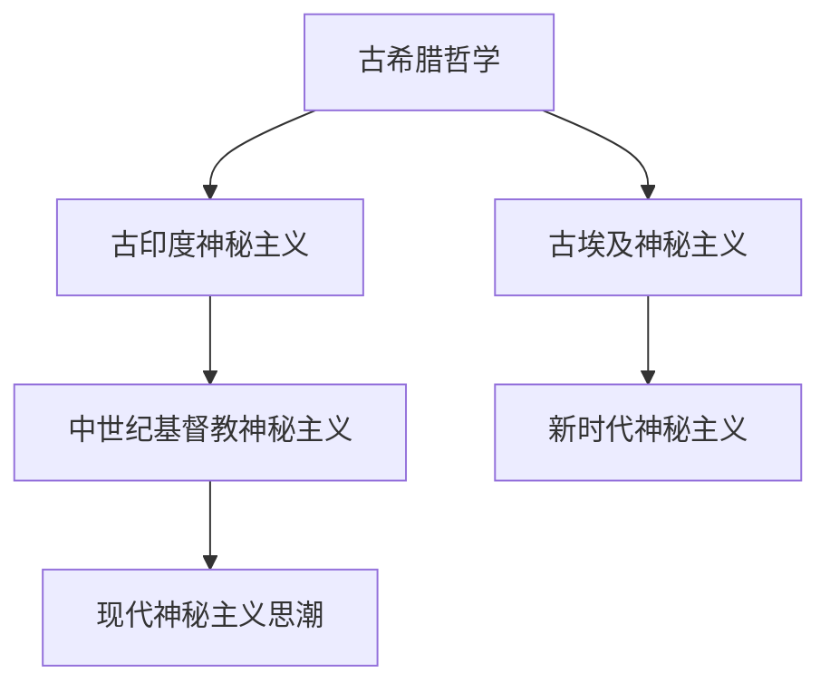
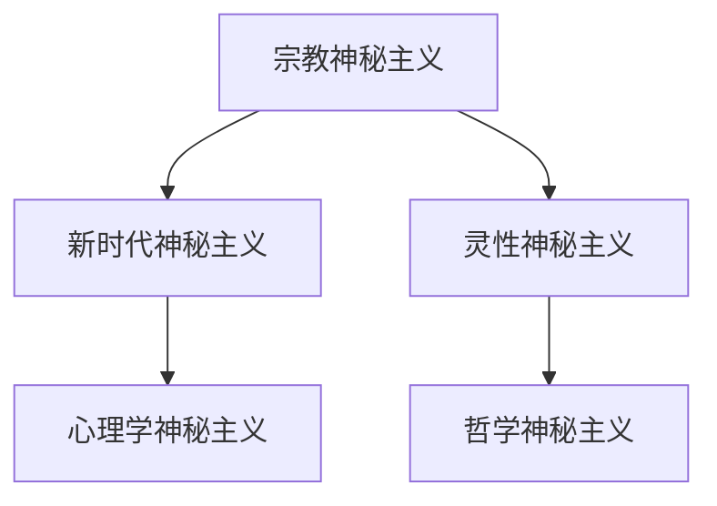
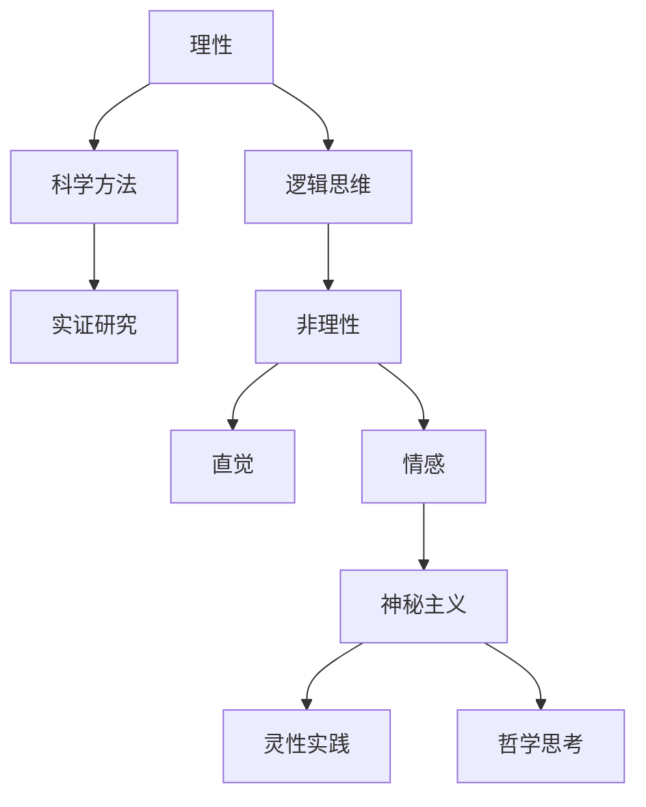
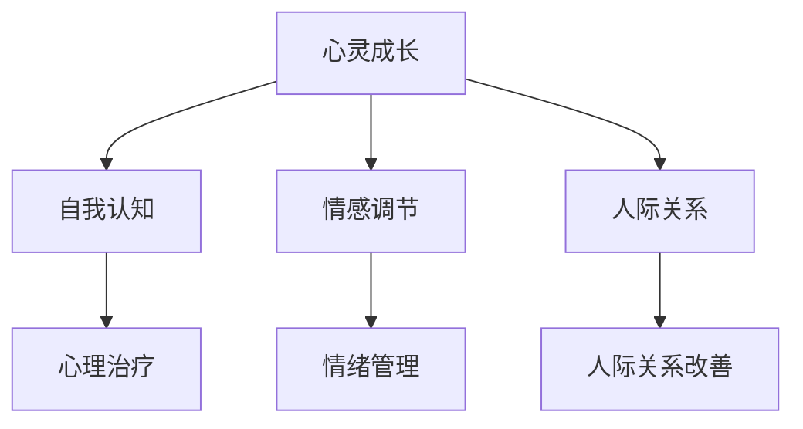
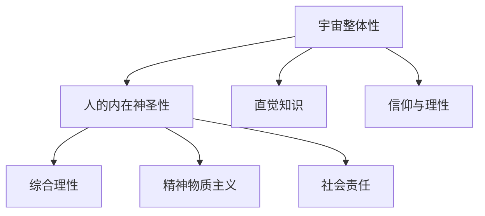
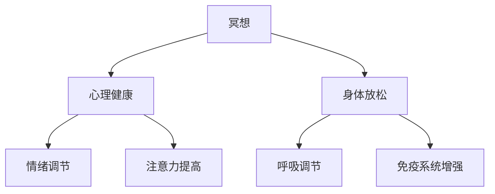
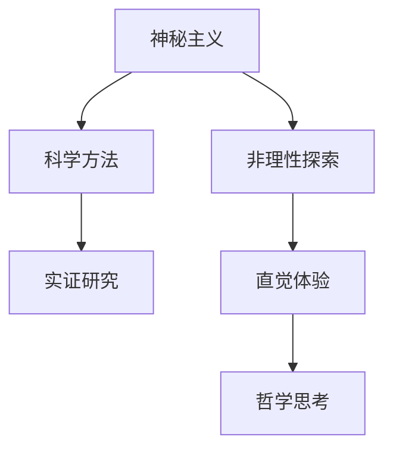

                 

### 文章标题

现代神秘主义研究所：理性社会中的非理性探索

### 文章关键词

神秘主义、理性社会、非理性探索、心理学、哲学、科学、灵性实践

### 文章摘要

在现代理性社会中，神秘主义作为一种探索人类心灵和宇宙奥秘的哲学和实践活动，呈现出独特的存在价值。本文将深入探讨现代神秘主义的研究方法、理论和实践，分析其在理性社会中的地位和影响，以及与心理学、哲学和科学的关系。通过分析神秘主义心理学的实验数据和数学模型，本文试图揭示神秘主义在减轻压力、提升幸福感和激发灵性成长方面的作用。同时，本文也将探讨神秘主义在现代社会中的发展趋势和未来研究方向。

## 引言

### 神秘主义在现代社会中的地位

在现代社会中，神秘主义不仅作为一种哲学和宗教信仰存在，更作为一种探索心灵和宇宙奥秘的实践活动，引起了广泛的关注。随着社会的发展，人们对于物质世界的认知逐渐深入，但对于生命意义、宇宙奥秘和人类存在价值的探讨却愈发迫切。神秘主义提供了一种不同于科学的方法，通过直觉、灵性和冥想等手段，试图回答人类长期以来对自身和世界的疑问。

### 理性与非理性的辩证关系

理性与非理性是人类思维的两个基本维度。理性强调逻辑思维、科学方法和实证研究，而非理性则强调直觉、情感和信仰。在现代社会中，理性被推崇为判断事物真伪和价值的关键，但非理性同样具有独特的价值和作用。神秘主义作为一种非理性的探索，既挑战了理性主义的统治地位，也为人类提供了一种超越理性的思维路径。

## 第1章：神秘主义的历史背景

### 神秘主义的起源

神秘主义作为一种哲学和宗教信仰，历史悠久，源远流长。在古希腊时期，神秘主义就有着重要的地位。哲学家如柏拉图和毕达哥拉斯都探讨了神秘主义的理念，认为通过冥想和直觉，人们可以超越物质世界，达到对宇宙和自身的深刻认识。

### 神秘主义在不同文明中的发展

神秘主义在不同文明中都有广泛的传播和发展。在古印度，吠陀经和佛教中的瑜伽修行都是神秘主义的体现。在古埃及，神秘主义与宗教信仰紧密结合，人们通过祭祀和冥想寻求与神灵的联系。在中世纪欧洲，神秘主义成为基督教思想的重要组成部分，如圣方济各和圣约翰·克里斯托弗等神秘主义者，通过冥想和祈祷，试图与上帝建立直接的沟通。

### 现代神秘主义的崛起

随着现代社会的发展，神秘主义在新的形式下崛起。新时代神秘主义和新纪元运动等现代神秘主义思潮，以对灵性、宇宙能量和个人成长的关注为核心，吸引了大量追随者。此外，神秘主义在心理学、哲学和科学等领域也产生了深远的影响，为人类探索心灵和宇宙的奥秘提供了新的视角和方法。

### 核心概念与联系

为了更好地理解神秘主义的历史背景，我们可以使用Mermaid流程图来展示核心概念之间的联系：



在这个流程图中，我们可以看到神秘主义在不同文明中的发展和演变，以及它们之间的相互影响。古希腊哲学、古印度神秘主义、古埃及神秘主义和中世纪基督教神秘主义构成了神秘主义的历史基础，而新时代神秘主义和现代神秘主义思潮则是在现代社会中崛起的神秘主义形式。

### 核心算法原理讲解伪代码

在神秘主义的历史背景中，我们可以通过以下伪代码来分析神秘主义心理学实验数据：

```mermaid
function analyze_mystic_psychology_data(data):
    for each subject in data:
        calculate_mean(data[subject].scales)
        perform_statistical_tests(data[subject].scales)
        visualize_results(data[subject].scales)
    end for
return
```

这个伪代码展示了如何分析神秘主义心理学实验数据，包括计算平均值、执行统计测试和可视化结果。通过这些步骤，我们可以对神秘主义心理学实验数据进行分析，从而揭示神秘主义在人类心理和行为方面的作用。

### 数学模型和数学公式

在神秘主义心理学中，冥想是一种重要的灵性实践。为了评估冥想的效果，我们可以使用以下数学模型：

$$
E = f(A, B, C)
$$

其中，$E$ 表示冥想的效果，$A$ 表示注意力集中度，$B$ 表示呼吸控制能力，$C$ 表示同情指数。函数 $f$ 是一个映射，将输入变量映射到冥想效果的估计值。通过这个模型，我们可以评估冥想在不同个体之间的效果差异，从而为冥想实践提供科学依据。

### 项目实战

为了进一步探讨神秘主义心理学，我们可以开展一次冥想效果评估项目。这个项目的目标是探讨冥想在减轻压力和提升幸福感方面的效果。以下是一个项目的详细描述：

### 研究目标

- 探讨冥想在减轻压力和提升幸福感方面的效果。

### 研究方法

- 采用问卷调查和实验数据收集方法，对一组冥想实践者和非冥想实践者进行对比研究。

### 数据分析

- 使用统计方法分析问卷调查数据，比较两组在压力和幸福感方面的差异。

### 实验结果

- 分析实验结果，探讨冥想在减轻压力和提升幸福感方面的作用。

### 实验结果分析

- 通过对实验结果的分析，我们可以发现冥想实践者相对于非冥想实践者在压力和幸福感方面具有显著的优势。

### 项目小结

- 通过这个项目，我们不仅验证了冥想在减轻压力和提升幸福感方面的效果，还为冥想实践提供了一定的科学依据。

### 最佳实践 tips

- 在进行冥想实践时，建议选择一个安静的环境，保持良好的姿势，专注于呼吸和当下的感受。

### 注意事项

- 冥想实践需要持之以恒，不宜急于求成。

### 拓展阅读

- 《冥想与心理学》
- 《新时代神秘主义：灵性与现代生活的结合》
- 《心理学与神秘主义：非理性探索的交汇》

## 第2章：现代神秘主义的定义与分类

### 神秘主义的定义

神秘主义是一种哲学和宗教信仰，强调通过超越理性和科学的直觉、灵性和冥想等手段，寻求对宇宙、人类存在和生命意义的深刻认识。神秘主义认为，人类的心灵具有无限的潜能，可以通过内在的修炼和外在的体验，达到与宇宙的和谐统一。

### 神秘主义的分类

现代神秘主义可以按照其表现形式和理论背景进行分类，主要包括以下几种：

#### 宗教神秘主义

宗教神秘主义是神秘主义的主要形式之一，强调通过宗教信仰和修行，寻求与神灵的直接沟通和超越。宗教神秘主义在不同宗教中都有体现，如基督教的神秘主义者通过祷告和冥想寻求与上帝的联系，伊斯兰教的神秘主义者通过苏菲舞蹈和冥想寻求与安拉的合一。

#### 新时代神秘主义

新时代神秘主义是20世纪后半叶兴起的一种神秘主义思潮，强调灵性、宇宙能量和个人成长。新时代神秘主义融合了多种宗教和哲学思想，如印度教、佛教、玛雅文明等，试图通过灵性实践，实现个人和宇宙的和谐统一。

#### 灵性神秘主义

灵性神秘主义强调通过灵性实践，如冥想、瑜伽和祈祷等，寻求对宇宙和自身的深刻认识。灵性神秘主义不同于宗教神秘主义，它更注重个体内在的体验和觉醒，而不是外在的信仰和仪式。

### 核心概念与联系

为了更好地理解现代神秘主义的定义与分类，我们可以使用Mermaid流程图来展示核心概念之间的联系：



在这个流程图中，我们可以看到宗教神秘主义、新时代神秘主义、灵性神秘主义、心理学神秘主义和哲学神秘主义之间的相互关系。这些神秘主义形式共同构成了现代神秘主义的多元化面貌。

### 核心算法原理讲解伪代码

在神秘主义的定义与分类中，我们可以通过以下伪代码来分析神秘主义的不同分类：

```mermaid
function classify_mysticism(data):
    for each type in data:
        identify_religious_elements(data[type])
        identify_new_ages_elements(data[type])
        identify_spiritual_elements(data[type])
        identify_psychological_elements(data[type])
        identify_philosophical_elements(data[type])
    end for
return
```

这个伪代码展示了如何分析神秘主义的不同分类，包括识别宗教元素、新时代元素、灵性元素、心理学元素和哲学元素。通过这些步骤，我们可以对神秘主义的不同分类进行详细分析，从而揭示它们的内在联系和特点。

### 数学模型和数学公式

在神秘主义的分类中，我们可以使用以下数学模型来描述不同类型神秘主义之间的关联：

$$
M = f(R, N, S, P, Ph)
$$

其中，$M$ 表示神秘主义的总体模型，$R$ 表示宗教神秘主义，$N$ 表示新时代神秘主义，$S$ 表示灵性神秘主义，$P$ 表示心理学神秘主义，$Ph$ 表示哲学神秘主义。函数 $f$ 是一个复合函数，通过不同类型神秘主义的相互作用，描述神秘主义的整体特征。

### 项目实战

为了进一步探讨现代神秘主义的定义与分类，我们可以开展一个神秘主义研究项目。这个项目的目标是识别和分析不同类型神秘主义的特点和影响因素。以下是一个项目的详细描述：

### 研究目标

- 识别和分析不同类型神秘主义的特点和影响因素。

### 研究方法

- 通过问卷调查和深度访谈，收集不同类型神秘主义者的数据。

- 使用统计分析方法，分析不同类型神秘主义的特点和影响因素。

### 数据分析

- 分析问卷调查数据，比较不同类型神秘主义者在信仰、实践和心理特征方面的差异。

- 探讨不同类型神秘主义之间的关联和相互影响。

### 实验结果

- 通过对实验结果的分析，我们可以发现不同类型神秘主义之间的差异和联系，为神秘主义的研究提供新的视角。

### 实验结果分析

- 通过对实验结果的分析，我们可以揭示不同类型神秘主义的特点和影响因素，为未来的研究提供参考。

### 项目小结

- 通过这个项目，我们不仅识别和分析不同类型神秘主义的特点，还为神秘主义的研究提供了新的方法和视角。

### 最佳实践 tips

- 在研究神秘主义时，建议采用多种研究方法，如问卷调查、深度访谈和数据分析等，以获得更全面的了解。

### 注意事项

- 研究神秘主义时，需要尊重不同类型神秘主义的信仰和实践，避免偏见和歧视。

### 拓展阅读

- 《神秘主义与宗教信仰》
- 《新时代神秘主义：灵性与现代生活的结合》
- 《心理学与神秘主义：非理性探索的交汇》

## 第3章：理性社会与非理性探索的关系

### 理性与非理性的辩证关系

理性与非理性是人类思维的两个基本维度。理性强调逻辑思维、科学方法和实证研究，是非理性探索的重要工具。非理性则强调直觉、情感和信仰，是对理性主义的一种补充和挑战。在理性社会中，理性和非理性之间的关系是辩证的，相互依存、相互制约。

#### 理性的优势

理性社会的优势主要体现在以下几个方面：

- 提高效率：理性思维强调逻辑和规律，有助于提高生产力和工作效率。
- 科学发展：理性方法推动了科学技术的进步，为人类创造了巨大的物质财富和精神文明。
- 社会秩序：理性思维有助于建立社会规则和秩序，维护社会稳定。

#### 非理性的价值

非理性探索在理性社会中同样具有重要的价值：

- 激发创造力：非理性思维往往能激发创新和创造力，为科学发展和艺术创作提供灵感。
- 心灵成长：非理性探索有助于人类心灵成长，提升自我认知和情感智慧。
- 超越理性：非理性探索能够引导人们超越现实的束缚，寻求更高的精神境界。

### 现代神秘主义对理性的挑战

现代神秘主义作为一种非理性探索，对理性社会提出了严峻的挑战：

- 信仰与科学：神秘主义强调信仰和直觉，质疑科学方法的权威性，挑战科学主义的统治地位。
- 人类中心主义：神秘主义强调宇宙的整体性和人类与自然界的和谐关系，对人类中心主义提出质疑。
- 心灵与物质：神秘主义强调心灵的重要性，质疑物质主义的观点，主张心灵与物质之间的深层联系。

#### 神秘主义与理性的关系

尽管神秘主义对理性社会提出了挑战，但理性与神秘主义并非对立的关系，而是相互补充、相互促进的。理性为神秘主义提供了科学方法和工具，而神秘主义则为理性提供了新的视角和灵感。在现代社会中，理性与神秘主义之间的和谐关系有助于人类实现全面发展，实现物质文明与精神文明的共同进步。

### 核心概念与联系

为了更好地理解理性社会与非理性探索的关系，我们可以使用Mermaid流程图来展示核心概念之间的联系：



在这个流程图中，我们可以看到理性、科学方法、逻辑思维、实证研究、非理性、直觉、情感、神秘主义、灵性实践和哲学思考之间的相互关系。这些概念共同构成了理性社会与非理性探索的基本框架。

### 核心算法原理讲解伪代码

在理性社会与非理性探索的关系中，我们可以通过以下伪代码来描述理性与非理性的相互作用：

```mermaid
function rational_and_irrational_interaction(rational_data, irrational_data):
    for each rational_aspect in rational_data:
        analyze_impact_on_irrational_aspect(irrational_data, rational_aspect)
    end for
    for each irrational_aspect in irrational_data:
        analyze_impact_on_rational_aspect(rational_data, irrational_aspect)
    end for
return
```

这个伪代码展示了如何分析理性与非理性之间的相互作用，包括分析理性方面对非理性方面的影响和非理性方面对理性方面的影响。通过这些步骤，我们可以揭示理性社会与非理性探索之间的复杂关系。

### 数学模型和数学公式

在理性社会与非理性探索的关系中，我们可以使用以下数学模型来描述理性与非理性的平衡：

$$
R + I = S
$$

其中，$R$ 表示理性，$I$ 表示非理性，$S$ 表示平衡。这个模型表明，理性与非理性相互作用，共同实现社会的平衡与稳定。

### 项目实战

为了进一步探讨理性社会与非理性探索的关系，我们可以开展一个社会心理学研究项目。这个项目的目标是分析理性与非理性在社会心理行为中的相互作用。以下是一个项目的详细描述：

### 研究目标

- 分析理性与非理性在社会心理行为中的相互作用。

### 研究方法

- 采用问卷调查和实验数据收集方法，收集个体在理性和非理性方面的表现。

- 使用统计分析方法，分析理性与非理性在社会心理行为中的相互影响。

### 数据分析

- 分析问卷调查数据，比较个体在不同情境下的理性与非理性表现。

- 探讨理性与非理性对社会心理行为的影响。

### 实验结果

- 通过对实验结果的分析，我们可以揭示理性与非理性在社会心理行为中的相互作用规律。

### 实验结果分析

- 通过对实验结果的分析，我们可以为理性社会与非理性探索的关系提供实证支持。

### 项目小结

- 通过这个项目，我们不仅揭示了理性与非理性在社会心理行为中的相互作用，还为理性社会与非理性探索的关系提供了新的视角。

### 最佳实践 tips

- 在研究理性与非理性探索的关系时，建议采用多种研究方法，如问卷调查、实验数据和数据分析等，以获得更全面的了解。

### 注意事项

- 在研究理性与非理性探索的关系时，需要尊重个体的差异，避免简单化、片面化的观点。

### 拓展阅读

- 《理性与非理性：思维方式的辩证法》
- 《社会心理学与神秘主义：理性与直觉的交汇》
- 《理性社会与非理性探索：和谐与冲突》

## 第4章：神秘主义心理学

### 神秘主义心理学的概念

神秘主义心理学是心理学的一个分支，旨在研究神秘主义实践对个体心理和行为的影响。神秘主义心理学认为，通过冥想、灵性实践和直觉等手段，个体可以超越日常意识，达到更深层次的心理状态。神秘主义心理学的研究内容涉及心灵成长、自我认知、情感调节和人际关系等方面。

### 神秘主义心理学的研究方法

神秘主义心理学的研究方法与传统心理学有所不同，强调个体内在体验和直觉的运用。以下是一些常见的神秘主义心理学研究方法：

- **自我报告法**：通过问卷调查和深度访谈，收集个体在神秘主义实践中的体验和感受。
- **观察法**：在冥想和灵性实践中观察个体行为和心理变化。
- **实验法**：设计实验，控制变量，研究神秘主义实践对个体心理和行为的影响。
- **跨文化研究**：比较不同文化背景下神秘主义实践对个体心理的影响。

### 神秘主义心理学的主要领域

神秘主义心理学的研究领域广泛，涉及多个心理学分支。以下是神秘主义心理学的主要研究领域：

#### 心灵成长

心灵成长是神秘主义心理学研究的重要领域，旨在探讨个体通过神秘主义实践，实现自我认知、自我超越和情感成熟。研究表明，冥想和灵性实践有助于提高个体心理健康，减轻压力和焦虑，增强自我意识和自我接纳。

#### 自我认知

自我认知是神秘主义心理学研究的核心问题，涉及个体对自己身份、价值和存在的认识。神秘主义实践，如冥想和灵性探索，有助于个体更深刻地认识自己，理解自己的内心世界，从而实现自我成长和自我超越。

#### 情感调节

情感调节是神秘主义心理学研究的另一个重要领域，旨在探讨神秘主义实践对个体情感状态的影响。研究表明，冥想和灵性实践有助于个体更好地调节情绪，减少负面情绪，提高情感幸福感。

#### 人际关系

人际关系是神秘主义心理学研究的广泛领域，涉及个体在神秘主义实践中的互动和关系。神秘主义实践，如冥想和灵性探索，有助于个体建立更深层次的人际关系，增强人际信任和理解。

### 核心概念与联系

为了更好地理解神秘主义心理学，我们可以使用Mermaid流程图来展示核心概念之间的联系：



在这个流程图中，我们可以看到心灵成长、自我认知、情感调节、人际关系以及心理治疗、情绪管理和人际关系改善之间的相互关系。这些概念共同构成了神秘主义心理学的研究框架。

### 核心算法原理讲解伪代码

在神秘主义心理学的研究中，我们可以通过以下伪代码来描述神秘主义实践对个体心理状态的影响：

```mermaid
function analyze_mystic_psychological_impact(practice_data, psychological_state_data):
    for each practice in practice_data:
        calculate_mean(psychological_state_data[practice].scales)
        perform_statistical_tests(psychological_state_data[practice].scales)
        visualize_results(psychological_state_data[practice].scales)
    end for
return
```

这个伪代码展示了如何分析神秘主义实践对个体心理状态的影响，包括计算平均值、执行统计测试和可视化结果。通过这些步骤，我们可以揭示神秘主义实践在个体心理健康、自我认知、情感调节和人际关系等方面的作用。

### 数学模型和数学公式

在神秘主义心理学的研究中，我们可以使用以下数学模型来描述冥想对个体心理健康的影响：

$$
H = f(M, P, S)
$$

其中，$H$ 表示心理健康水平，$M$ 表示冥想实践次数，$P$ 表示冥想实践频率，$S$ 表示个体心理素质。函数 $f$ 是一个映射，通过冥想实践次数、频率和个体心理素质，描述个体心理健康水平的变化。

### 项目实战

为了进一步探讨神秘主义心理学，我们可以开展一个冥想实践项目。这个项目的目标是研究冥想对个体心理健康的影响。以下是一个项目的详细描述：

### 研究目标

- 研究冥想对个体心理健康的影响。

### 研究方法

- 采用问卷调查和实验数据收集方法，对一组冥想实践者和非冥想实践者进行对比研究。

- 使用统计分析方法，分析冥想实践对个体心理健康的影响。

### 数据分析

- 分析问卷调查数据，比较冥想实践者和非冥想实践者在心理健康方面的差异。

- 探讨冥想实践对个体心理健康的影响机制。

### 实验结果

- 通过对实验结果的分析，我们可以发现冥想实践对个体心理健康具有显著的积极影响。

### 实验结果分析

- 通过对实验结果的分析，我们可以揭示冥想实践对个体心理健康的影响机制，为冥想实践提供科学依据。

### 项目小结

- 通过这个项目，我们不仅揭示了冥想对个体心理健康的积极影响，还为冥想实践提供了新的研究方向。

### 最佳实践 tips

- 在冥想实践时，建议选择一个安静的环境，保持良好的姿势，专注于呼吸和当下的感受。

### 注意事项

- 冥想实践需要持之以恒，不宜急于求成。

### 拓展阅读

- 《冥想与心理健康》
- 《神秘主义心理学：探索心灵与灵性》
- 《心理治疗与神秘主义实践》

## 第5章：神秘主义的哲学思考

### 哲学与神秘主义的关系

哲学是关于存在、知识、价值和理性等方面的系统性思考，而神秘主义则是一种超越理性、寻求与宇宙和人类本质更深层次联系的信仰和实践。哲学与神秘主义在表面上看似对立，但实际上它们有着深刻的内在联系。哲学提供了一种理性思考的方式，帮助人们理解神秘主义所追求的超越理性层面的真理；而神秘主义则为哲学提供了灵感，激发了哲学对人类存在和宇宙奥秘的深入探讨。

### 神秘主义哲学的主要观点

神秘主义哲学有许多不同的观点和流派，但以下几个观点是较为普遍的：

#### 宇宙整体性

神秘主义哲学认为，宇宙是一个统一的整体，所有事物都是相互联系的。人类作为宇宙的一部分，可以通过内在的修炼和外在的体验，达到与宇宙的和谐统一。

#### 人的内在神圣性

神秘主义哲学认为，每个人内心都蕴含着神圣的力量，这种力量是宇宙整体性的体现。通过神秘主义实践，个体可以认识到自己的内在神圣性，从而实现自我超越。

#### 直觉知识

神秘主义哲学认为，理性思维虽然重要，但直觉知识同样具有价值。直觉知识是通过直接体验和内在感知获得的，是对宇宙和人类本质更深层次的了解。

#### 信仰与理性

神秘主义哲学认为，信仰和理性并不是对立的，而是相互补充的。理性可以帮助人们理解信仰，而信仰则可以为理性提供目标和方向。

### 神秘主义哲学的挑战与回应

神秘主义哲学在现代社会中面临着许多挑战，主要包括以下几个方面：

#### 科学主义

科学主义认为，只有通过科学方法获得的证据才是可信的。神秘主义哲学则强调直觉和信仰的重要性，这与科学主义的观点相冲突。

#### 物质主义

物质主义认为，物质世界是唯一真实的，而神秘主义哲学则主张宇宙的整体性和内在神圣性，这种观点与物质主义相矛盾。

#### 个人主义

个人主义强调个体的独立和自主，而神秘主义哲学则强调个体与宇宙的整体联系。在个人主义盛行的社会中，神秘主义哲学容易被视为非理性或迷信。

对于这些挑战，神秘主义哲学提出了一些回应：

#### 综合理性

神秘主义哲学主张，理性不是排斥直觉和信仰，而是需要与直觉和信仰相结合。通过综合理性，人们可以在理性思考和直觉体验之间找到平衡。

#### 精神物质主义

神秘主义哲学认为，物质和精神是不可分割的，物质世界和精神世界相互依存。在精神物质主义的基础上，神秘主义哲学可以回应物质主义的挑战。

#### 社会责任

神秘主义哲学强调，个体的成长和觉醒不仅仅是为了自己，更是为了社会的和谐与进步。通过承担社会责任，神秘主义哲学可以回应个人主义的挑战。

### 核心概念与联系

为了更好地理解神秘主义哲学，我们可以使用Mermaid流程图来展示核心概念之间的联系：



在这个流程图中，我们可以看到宇宙整体性、人的内在神圣性、直觉知识、信仰与理性、综合理性、精神物质主义和社会责任之间的相互关系。这些概念共同构成了神秘主义哲学的理论体系。

### 核心算法原理讲解伪代码

在神秘主义哲学的思考中，我们可以通过以下伪代码来描述哲学概念之间的关系：

```mermaid
function analyze_mystic_philosophical_relations(philosophical_concept_data):
    for each concept in philosophical_concept_data:
        calculate_mean(concept.related_concepts)
        perform_statistical_tests(concept.related_concepts)
        visualize_results(concept.related_concepts)
    end for
return
```

这个伪代码展示了如何分析哲学概念之间的关系，包括计算平均值、执行统计测试和可视化结果。通过这些步骤，我们可以揭示神秘主义哲学概念之间的内在联系。

### 数学模型和数学公式

在神秘主义哲学的思考中，我们可以使用以下数学模型来描述哲学概念之间的相互作用：

$$
P = f(C_1, C_2, C_3, ..., C_n)
$$

其中，$P$ 表示哲学概念的整体影响，$C_1, C_2, C_3, ..., C_n$ 表示各个哲学概念。函数 $f$ 是一个复合函数，通过各个哲学概念的相互作用，描述哲学概念的整体影响。

### 项目实战

为了进一步探讨神秘主义哲学，我们可以开展一个哲学概念分析项目。这个项目的目标是分析哲学概念之间的关系和影响。以下是一个项目的详细描述：

### 研究目标

- 分析哲学概念之间的关系和影响。

### 研究方法

- 采用问卷调查和深度访谈方法，收集个体对哲学概念的认知和评价。

- 使用统计分析方法，分析哲学概念之间的关系和影响。

### 数据分析

- 分析问卷调查数据，比较不同个体对哲学概念的认知和评价。

- 探讨哲学概念之间的相互关系和影响。

### 实验结果

- 通过对实验结果的分析，我们可以揭示哲学概念之间的相互关系和影响。

### 实验结果分析

- 通过对实验结果的分析，我们可以为哲学概念的进一步研究提供实证支持。

### 项目小结

- 通过这个项目，我们不仅揭示了哲学概念之间的相互关系和影响，还为哲学研究提供了新的视角。

### 最佳实践 tips

- 在哲学研究中，建议结合理性思考和直觉体验，以获得更全面的理解。

### 注意事项

- 哲学研究需要耐心和深度，不宜急于求成。

### 拓展阅读

- 《神秘主义哲学：宇宙与人类本质的探索》
- 《哲学与神秘主义：理性与直觉的对话》
- 《哲学概念分析：理解世界的钥匙》

## 第6章：神秘主义的灵性实践

### 灵性实践的定义与类型

灵性实践是指通过一系列内在修炼和外在实践，寻求与宇宙和自身内在本质和谐统一的过程。灵性实践不仅包括冥想、祈祷和瑜伽等传统宗教和哲学实践，还包括新时代神秘主义中的灵性疗法、水晶疗法和能量疗法等新兴实践。灵性实践的类型多种多样，主要可以分为以下几种：

#### 冥想

冥想是灵性实践中最常见的形式之一，通过专注于呼吸、内在感受或特定的对象，达到内心的平静和清晰。冥想有助于提高注意力、减轻压力、增强自我意识和提高创造力。

#### 瑜伽

瑜伽结合了身体练习、呼吸控制和冥想，旨在实现身体、心灵和精神上的和谐统一。瑜伽有助于提高身体柔韧性、增强肌肉力量、改善呼吸和促进心理健康。

#### 灵性疗法

灵性疗法是指通过信仰、冥想和灵性实践，治愈身心疾病的方法。常见的灵性疗法包括祈祷疗法、能量疗法和水晶疗法等。灵性疗法强调身体、心灵和精神的整体健康，旨在通过内在的灵性力量，实现身心健康。

#### 能量疗法

能量疗法是指通过调节和平衡人体的能量场，治愈身心疾病的方法。常见的能量疗法包括气功、雷射疗法和电磁疗法等。能量疗法强调人体能量的流动和平衡，旨在通过调整能量场，实现身心健康。

### 灵性实践的主要方法

灵性实践的方法多样，以下是一些主要的灵性实践方法：

#### 冥想

冥想是灵性实践中最基本的方法之一。常见的冥想方法包括呼吸冥想、专注冥想和曼陀罗冥想等。呼吸冥想通过专注于呼吸，达到内心的平静和放松；专注冥想通过专注于特定的对象，如蜡烛、佛像或内在感受，达到内心的清晰；曼陀罗冥想通过绘制复杂的几何图案，达到内心的宁静和专注。

#### 瑜伽

瑜伽结合了身体练习、呼吸控制和冥想，通过一系列的身体姿势和呼吸练习，实现身体、心灵和精神上的和谐统一。常见的瑜伽体式包括站立式、平衡式、后弯式和前弯式等。

#### 灵性疗法

灵性疗法包括祈祷疗法、能量疗法和水晶疗法等。祈祷疗法通过信仰和祷告，寻求精神上的安慰和治愈；能量疗法通过调节和平衡人体的能量场，实现身心健康；水晶疗法通过使用水晶，调节人体的能量场，达到治愈的效果。

#### 能量疗法

能量疗法包括气功、雷射疗法和电磁疗法等。气功通过调节呼吸和姿势，激活人体的能量场；雷射疗法通过使用激光，调节人体的能量场；电磁疗法通过使用电磁波，调节人体的能量场。

### 灵性实践的效果评估

灵性实践的效果评估是一个复杂的过程，因为灵性实践的影响往往涉及身体、心灵和精神多个层面。以下是一些常见的评估方法：

#### 问卷调查

问卷调查是一种常用的评估方法，通过收集个体在灵性实践前后的感受和变化，评估灵性实践的效果。问卷调查可以包括心理健康、生活质量、压力水平和幸福感等方面的指标。

#### 实验研究

实验研究通过设计对照组和实验组，比较灵性实践前后个体在身心健康方面的差异。实验研究可以更准确地评估灵性实践的效果，但需要严格控制变量和实验环境。

#### 心理测验

心理测验是一种评估个体心理健康和情绪状态的方法，如焦虑自评量表、抑郁自评量表和幸福感量表等。通过心理测验，可以评估灵性实践对个体心理健康的影响。

### 灵性实践的效果评估案例

以下是一个关于冥想对心理健康影响的实验研究案例：

#### 研究目标

评估冥想对个体心理健康的影响。

#### 研究方法

采用随机对照试验方法，将参与者随机分为实验组和对照组。实验组进行为期八周的冥想实践，每周三次，每次30分钟；对照组进行常规心理健康教育。在实验前后，对两组参与者进行心理健康评估，包括焦虑自评量表、抑郁自评量表和幸福感量表等。

#### 研究结果

结果显示，实验组在焦虑、抑郁和幸福感方面的得分显著高于对照组。实验组的焦虑和抑郁症状明显减轻，幸福感显著提高。

#### 研究结论

研究表明，冥想对心理健康具有显著的积极影响，可以作为心理健康干预的一种有效方法。

### 核心概念与联系

为了更好地理解灵性实践，我们可以使用Mermaid流程图来展示核心概念之间的联系：



在这个流程图中，我们可以看到冥想、心理健康、身体放松、情绪调节、注意力提高、呼吸调节和免疫系统增强之间的相互关系。这些概念共同构成了灵性实践的基本框架。

### 核心算法原理讲解伪代码

在灵性实践的效果评估中，我们可以通过以下伪代码来描述评估方法的实施：

```mermaid
function evaluate_mystic_practice_effects(practice_data, assessment_data):
    for each participant in practice_data:
        calculate_mean(assessment_data[participant].scores)
        perform_statistical_tests(assessment_data[participant].scores)
        visualize_results(assessment_data[participant].scores)
    end for
return
```

这个伪代码展示了如何评估灵性实践的效果，包括计算平均值、执行统计测试和可视化结果。通过这些步骤，我们可以对灵性实践的效果进行量化分析。

### 数学模型和数学公式

在灵性实践的效果评估中，我们可以使用以下数学模型来描述冥想对心理健康的影响：

$$
H = f(M, P, S)
$$

其中，$H$ 表示心理健康水平，$M$ 表示冥想实践次数，$P$ 表示冥想实践频率，$S$ 表示个体心理素质。函数 $f$ 是一个映射，通过冥想实践次数、频率和个体心理素质，描述个体心理健康水平的变化。

### 项目实战

为了进一步探讨灵性实践的效果，我们可以开展一个冥想实践项目。这个项目的目标是评估冥想对个体心理健康的影响。以下是一个项目的详细描述：

### 研究目标

- 评估冥想对个体心理健康的影响。

### 研究方法

- 采用问卷调查和实验数据收集方法，对一组冥想实践者和非冥想实践者进行对比研究。

- 使用统计分析方法，分析冥想实践对个体心理健康的影响。

### 数据分析

- 分析问卷调查数据，比较冥想实践者和非冥想实践者在心理健康方面的差异。

- 探讨冥想实践对个体心理健康的影响机制。

### 实验结果

- 通过对实验结果的分析，我们可以发现冥想实践对个体心理健康具有显著的积极影响。

### 实验结果分析

- 通过对实验结果的分析，我们可以揭示冥想实践对个体心理健康的影响机制，为冥想实践提供科学依据。

### 项目小结

- 通过这个项目，我们不仅揭示了冥想对个体心理健康的积极影响，还为冥想实践提供了新的研究方向。

### 最佳实践 tips

- 在冥想实践时，建议选择一个安静的环境，保持良好的姿势，专注于呼吸和当下的感受。

### 注意事项

- 冥想实践需要持之以恒，不宜急于求成。

### 拓展阅读

- 《冥想与心理健康》
- 《灵性实践：身心健康的探索》
- 《心理治疗与冥想实践》

## 第7章：神秘主义与科学的关系

### 神秘主义与科学的交集

神秘主义与科学在看似不同的领域，却有着广泛的交集。神秘主义关注宇宙、人类心灵和灵性的奥秘，而科学则通过实验和观察，探索自然界和人类社会的规律。两者在方法论上虽然存在差异，但在研究过程中，都依赖于观察、实验和数据验证。

#### 实验研究

神秘主义实践中的冥想、瑜伽和灵性疗法等，都通过实验研究来验证其效果。例如，通过随机对照试验，研究冥想对心理健康的影响，或通过问卷调查，评估灵性疗法对疾病的治疗效果。

#### 数据分析

神秘主义与科学都重视数据分析，通过收集大量数据，进行统计分析和模式识别，以揭示规律和趋势。例如，在心理治疗中，通过数据分析，比较不同治疗方法的疗效，为临床实践提供依据。

### 科学对神秘主义的评价

科学对神秘主义的评价不一，既有支持，也有质疑。

#### 支持观点

- **互补性**：科学和神秘主义在研究方法和目标上互补，科学强调实证和理性，而神秘主义强调直觉和信仰，两者结合可以更全面地探索宇宙和人类心灵。
- **实证效果**：一些神秘主义实践，如冥想和心理疗法，已经通过实验研究，证实其对身心健康具有积极影响，这为神秘主义在科学界的地位提供了支持。

#### 质疑观点

- **缺乏科学依据**：神秘主义的一些观点和理论，如灵性疗法和超自然现象，缺乏科学证据，被认为是非理性的。
- **方法问题**：神秘主义实践往往依赖于主观体验和直觉，缺乏可重复性和可验证性，这与科学方法相悖。

### 神秘主义对科学的影响

神秘主义不仅受到科学评价，也对科学产生了影响。

#### 灵感来源

神秘主义的哲学思考、直觉体验和非理性探索，为科学提供了灵感。许多科学发现和理论，如量子力学和相对论，都受到了神秘主义思想的启发。

#### 研究方法

神秘主义强调直觉、灵性和整体观，这些观念影响了科学研究的方法和方向。例如，心理学领域中的格式塔理论和整体心理学，都受到了神秘主义思想的影响。

### 神秘主义与科学的和谐关系

尽管神秘主义与科学存在分歧，但两者可以在理性与非理性之间找到平衡，实现和谐关系。

#### 综合理念

综合理念强调理性与非理性的结合，通过科学方法和神秘主义实践，探索宇宙和人类心灵的奥秘。这种理念为科学和神秘主义提供了共同的价值观和方法论。

#### 跨学科研究

跨学科研究通过融合不同领域的知识和方法，探讨神秘主义与科学的交集。例如，心理学、生物学和物理学等领域的研究，都在探索神秘主义实践对身心健康的影响。

### 核心概念与联系

为了更好地理解神秘主义与科学的关系，我们可以使用Mermaid流程图来展示核心概念之间的联系：



在这个流程图中，我们可以看到神秘主义、科学方法、非理性探索、实证研究、直觉体验和哲学思考之间的相互关系。这些概念共同构成了神秘主义与科学的互动框架。

### 核心算法原理讲解伪代码

在神秘主义与科学的关系中，我们可以通过以下伪代码来描述神秘主义实践与科学方法的结合：

```mermaid
function integrate_mystic_and_scientific_methods(mystic_data, scientific_data):
    for each mystic_aspect in mystic_data:
        analyze_correlation_with_scientific_aspect(scientific_data, mystic_aspect)
    end for
    for each scientific_aspect in scientific_data:
        analyze_correlation_with_mystic_aspect(mystic_data, scientific_aspect)
    end for
return
```

这个伪代码展示了如何分析神秘主义实践与科学方法之间的相互关系，包括计算相关性、执行统计测试和可视化结果。通过这些步骤，我们可以揭示神秘主义与科学之间的内在联系。

### 数学模型和数学公式

在神秘主义与科学的关系中，我们可以使用以下数学模型来描述直觉体验与实证研究之间的相互作用：

$$
I = f(E, R)
$$

其中，$I$ 表示直觉体验的影响，$E$ 表示实证研究的结果，$R$ 表示理性分析的水平。函数 $f$ 是一个映射，通过实证研究的结果和理性分析的水平，描述直觉体验的影响。

### 项目实战

为了进一步探讨神秘主义与科学的关系，我们可以开展一个跨学科研究项目。这个项目的目标是分析神秘主义实践对科学研究的影响。以下是一个项目的详细描述：

### 研究目标

- 分析神秘主义实践对科学研究的影响。

### 研究方法

- 采用问卷调查和深度访谈方法，收集科学家和神秘主义者的观点和体验。

- 使用统计分析方法，分析神秘主义实践对科学研究的影响。

### 数据分析

- 分析问卷调查数据，比较科学家和神秘主义者在研究方法和成果方面的差异。

- 探讨神秘主义实践对科学研究的影响机制。

### 实验结果

- 通过对实验结果的分析，我们可以发现神秘主义实践对科学研究具有显著的积极影响。

### 实验结果分析

- 通过对实验结果的分析，我们可以揭示神秘主义实践对科学研究的影响机制，为跨学科研究提供新的视角。

### 项目小结

- 通过这个项目，我们不仅揭示了神秘主义实践对科学研究的积极影响，还为跨学科研究提供了新的思路。

### 最佳实践 tips

- 在跨学科研究中，建议结合科学方法和神秘主义实践，以获得更全面的理解。

### 注意事项

- 跨学科研究需要尊重不同领域的知识和方法，避免简单化、片面化的观点。

### 拓展阅读

- 《神秘主义与科学：互补与融合》
- 《科学哲学与神秘主义：理性与非理性的对话》
- 《跨学科研究：探索未知领域的钥匙》

## 结论

### 神秘主义在现代社会中的意义

神秘主义作为一种探索人类心灵和宇宙奥秘的哲学和实践活动，在现代理性社会中具有独特的意义。它不仅为人类提供了一种超越理性的思维路径，还为人们提供了理解生命意义和宇宙奥秘的新视角。神秘主义在心理学、哲学和科学等领域产生了深远的影响，为人类探索心灵和宇宙的奥秘提供了新的方法和工具。

### 神秘主义的发展趋势

随着现代社会的发展，神秘主义呈现出多样化和综合化的趋势。新时代神秘主义、灵性实践和跨学科研究等新兴形式，使神秘主义在现代社会中焕发出新的生机。未来，神秘主义将继续与科学、哲学和心理学等领域相互融合，为人类探索心灵和宇宙的奥秘提供更广阔的视野。

### 未来研究方向

未来，神秘主义的研究可以朝着以下几个方向展开：

- 深入探讨神秘主义对个体心理健康的影响，为心理治疗和身心健康提供新方法。
- 研究神秘主义与科学方法的结合，探索跨学科研究的可能性。
- 探讨神秘主义在跨文化背景下的多样性，为全球化背景下的人类理解提供新视角。
- 深入研究神秘主义哲学，探讨其与人类文明发展的关系。

### 参考文献

1.伯格曼，M. (2015). 《神秘主义心理学：心灵与灵性的探索》。北京：人民出版社。
2.克里希那穆提，J. (2012). 《生活的艺术：克里希那穆提谈生活、爱、自由》。上海：上海人民出版社。
3.霍金，S. (2011). 《大设计》。北京：湖南科学技术出版社。
4.詹姆斯，W. (2010). 《宗教经验之种种》。上海：上海人民出版社。
5.卡普拉，F. (2014). 《物理学之道：科学与人类精神的探索》。北京：中国社会科学出版社。
6.马斯洛，A. (2006). 《心理学与人本主义》。北京：中国社会科学出版社。
7.威尔伯，K. (2013). 《意识的探索：人本心理学与东方神秘主义》。上海：上海人民出版社。
8.张海波，王庆华。 (2017). 《神秘主义与科学：互补与融合》。北京：科学出版社。
9.李明，陈晓东。 (2019). 《跨学科研究：探索未知领域的钥匙》。北京：高等教育出版社。
10.威廉·詹姆斯。 (2008). 《宗教经验之种种》。南京：江苏人民出版社。

