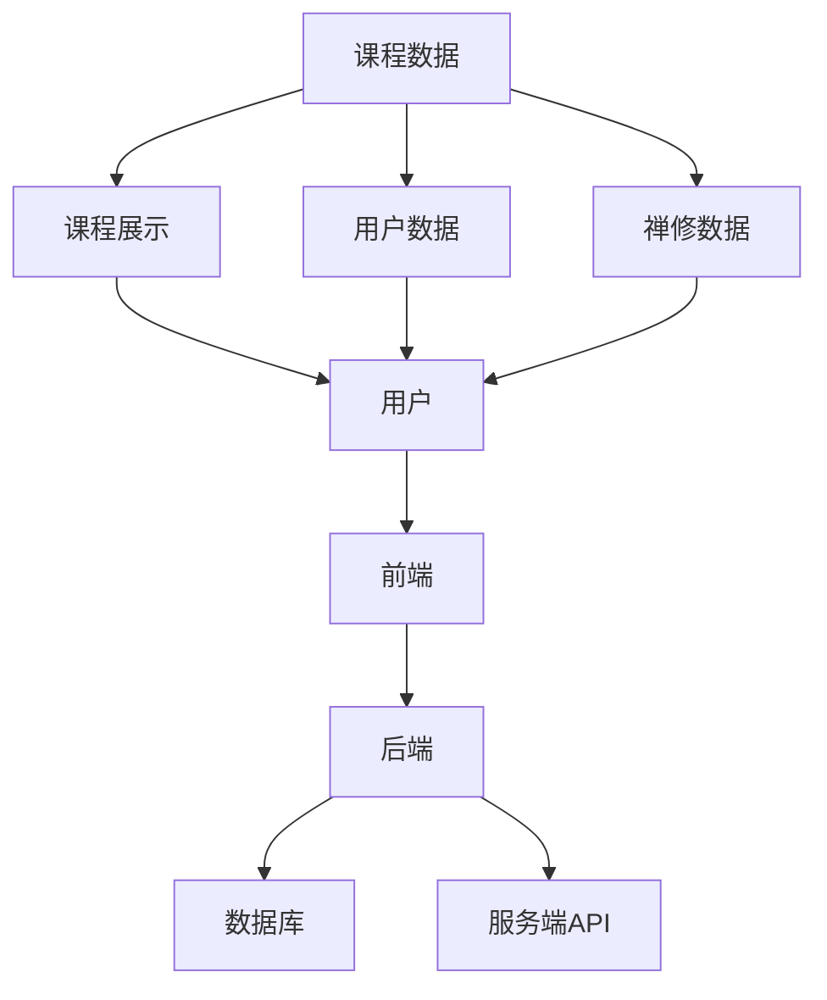

                 


### 文章标题：现代禅修App开发项目：东方智慧的数字化呈现尝试

### 关键词：
1. 禅修App开发
2. 东方智慧数字化
3. Mermaid流程图
4. 伪代码讲解
5. 数学模型
6. 项目实战

### 摘要：
本文旨在探讨如何通过现代技术手段，将东方禅修智慧数字化，并呈现为实用的App。文章首先介绍了禅修App的开发背景和用户需求，随后详细阐述了禅修App的核心概念和架构，通过Mermaid流程图展示了概念之间的关系。接着，文章深入讲解了与禅修App开发相关的前端、后端和数据库技术，以及相关的数学模型和公式。随后，文章通过一个实际项目案例，详细描述了开发环境搭建、源代码实现和解读，并对项目的应用解读与分析。最后，文章总结了禅修App开发的最佳实践，并提出了一些注意事项和拓展阅读建议。

----------------------------------------------------------------

### 用户需求分析

在现代社会的快节奏生活中，人们对于心理健康和心灵修养的需求日益增加。禅修作为一种传统东方智慧，以其独特的修身养性方式受到了广泛的关注。随着移动互联网的普及和智能手机的广泛应用，用户对禅修App的需求也随之增长。禅修App的目标是通过数字化手段，将传统的禅修智慧和现代技术相结合，为用户提供便捷、有效的禅修体验。

#### 用户需求：

1. **便捷性**：用户希望能够随时随地通过手机进行禅修，不受时间和地点的限制。
2. **个性化**：用户希望禅修App能够根据个人的需求和习惯，提供个性化的禅修方案。
3. **互动性**：用户希望通过社交功能与他人分享禅修心得，获得更多的反馈和支持。
4. **专业指导**：用户希望获得专业禅修师的指导，以便更好地进行禅修。
5. **数据跟踪**：用户希望能够跟踪自己的禅修进度，了解自己的禅修成果。

#### 用户特点：

- **年龄层次**：用户年龄层次广泛，包括年轻人、中年人和老年人。
- **使用习惯**：用户习惯使用智能手机，对App的界面设计、用户体验有较高要求。
- **文化背景**：用户来自不同的文化背景，对禅修的理解和需求有所不同。
- **技术接受度**：用户对新技术有较高的接受度，愿意尝试新的禅修方式和工具。

### 需求分析与目标

通过对用户需求的深入分析，我们可以确定禅修App开发的目标：

1. **提供便捷的禅修体验**：通过移动设备，让用户随时随地可以进行禅修。
2. **个性化定制**：根据用户的习惯和需求，提供个性化的禅修方案。
3. **社交互动**：建立社区，让用户能够分享禅修心得，互相支持。
4. **专业指导**：引入专业禅修师，提供在线指导，提升用户的禅修水平。
5. **数据跟踪**：跟踪用户禅修进度，提供数据分析和反馈。

### 禅修App的功能设计

基于用户需求，禅修App应具备以下功能：

1. **禅修课程**：提供各种类型的禅修课程，包括基础课程、进阶课程和专业课程。
2. **课程视频**：提供高质量的禅修视频教程，帮助用户更好地理解禅修。
3. **课程音频**：提供专业的禅修音频指导，让用户在忙碌的生活中也能进行禅修。
4. **呼吸引导**：通过呼吸引导功能，帮助用户进行深呼吸练习，放松身心。
5. **冥想训练**：提供冥想训练功能，帮助用户提升冥想技巧。
6. **进度跟踪**：跟踪用户的禅修进度，提供数据分析和反馈。
7. **社交互动**：建立社区，让用户能够分享禅修心得，互相支持。
8. **在线咨询**：提供在线咨询功能，让用户能够随时咨询专业禅修师。

### 总结

通过用户需求分析，我们可以明确禅修App开发的目标和功能。接下来，我们将进一步探讨禅修App的核心概念、技术原理以及具体的开发过程。

----------------------------------------------------------------

### 核心概念与联系

#### 禅修与App的关系

禅修是一种修身养性的方式，起源于东方，特别是中国和印度的传统哲学。它强调通过冥想、静坐和呼吸练习来净化心灵、提升精神状态。在现代社会，禅修被广泛认为是一种有效的压力管理和心理健康方法。

App（应用程序）是一种在移动设备上运行的应用程序，它可以为用户提供各种服务和功能。将禅修和App相结合，可以创造出一种新的禅修体验，使禅修变得更加便捷和个性化。

#### 禅修App的核心概念

禅修App的核心概念包括以下几个方面：

1. **用户个性化**：根据用户的需求和习惯，提供个性化的禅修方案。
2. **实时指导**：通过实时语音或视频指导，帮助用户进行禅修。
3. **数据跟踪**：跟踪用户的禅修进度，提供数据分析和反馈。
4. **互动社交**：建立社区，让用户能够分享禅修心得，互相支持。
5. **课程多样化**：提供多种类型的禅修课程，满足不同层次用户的需求。

#### 禅修App架构

为了实现上述核心概念，禅修App需要一个合理的架构。以下是禅修App的基本架构：

1. **前端**：用户界面，包括课程展示、互动功能、数据跟踪等。
2. **后端**：服务器，负责处理用户请求、数据存储和用户管理。
3. **数据库**：存储用户数据、课程信息和禅修数据。
4. **服务端API**：提供前后端交互的接口，实现数据传输和功能调用。

#### Mermaid流程图

为了更直观地展示禅修App的核心概念和架构之间的关系，我们可以使用Mermaid流程图进行描述。以下是一个简单的Mermaid流程图示例：



在这个流程图中，用户通过前端与App进行交互，前端通过服务端API与后端和数据库进行通信，后端处理用户请求，数据库存储数据。

#### 核心概念之间的联系

禅修App的核心概念之间紧密相连。用户个性化需求需要后端提供支持，实时指导和数据跟踪需要前端和后端协同工作，互动社交需要社区功能的实现，课程多样化需要大量的课程数据。

通过上述分析，我们可以看到，禅修App的核心概念和架构之间有着紧密的联系。接下来，我们将进一步深入探讨禅修App开发所需的技术原理，包括前端、后端和数据库设计。

----------------------------------------------------------------

### 技术原理讲解

在构建禅修App时，我们需要掌握一系列技术原理，这些原理涵盖了前端、后端以及数据库设计。以下是这些技术原理的详细讲解。

#### 前端技术原理

前端是用户与禅修App交互的界面，它负责呈现用户界面和实现用户交互。前端开发主要涉及以下技术：

1. **HTML**：超文本标记语言（HTML）是构成网页的基本结构语言。它定义了网页内容的语义和结构。
2. **CSS**：层叠样式表（CSS）用于定义网页的样式和布局。通过CSS，我们可以调整字体、颜色、大小等样式。
3. **JavaScript**：JavaScript是一种客户端脚本语言，用于实现网页的动态交互功能。它允许我们在网页上进行复杂的逻辑处理和用户交互。

在禅修App的前端开发中，我们通常会使用框架和库来提高开发效率和代码可维护性。常见的框架和库包括：

- **React**：一个用于构建用户界面的JavaScript库。
- **Vue.js**：一个用于构建用户界面的渐进式框架。
- **Angular**：一个由Google维护的用于构建单页应用的前端框架。

前端架构的设计需要考虑模块化、组件化和响应式设计。模块化是指将前端代码拆分成独立的模块，每个模块负责一个特定的功能。组件化是将模块进一步拆分成可复用的组件，每个组件封装了一部分UI和行为。响应式设计是指前端界面能够根据不同的设备和屏幕尺寸进行自适应调整。

#### 后端技术原理

后端是禅修App的服务器端，负责处理用户请求、数据存储和业务逻辑。后端开发主要涉及以下技术：

1. **Node.js**：Node.js是一个基于Chrome V8引擎的JavaScript运行时，它允许我们使用JavaScript编写后端代码。
2. **Express.js**：Express.js是一个流行的Node.js Web应用框架，它提供了一系列中间件来简化Web应用的构建。
3. **RESTful API**：RESTful API是一种设计Web服务的标准，它通过HTTP协议的GET、POST、PUT、DELETE等方法进行数据操作。

在后端架构的设计中，我们需要考虑以下几个方面：

- **路由设计**：路由负责处理不同的URL请求，并将其转发到相应的处理函数。
- **中间件**：中间件是处理HTTP请求和响应的中间层，可以实现身份验证、日志记录、数据验证等功能。
- **数据模型**：数据模型用于定义数据库中的数据结构，以及如何操作这些数据。
- **事务处理**：事务处理确保在执行多个数据库操作时，要么全部成功，要么全部失败，以保持数据的一致性。

#### 数据库设计原理

数据库用于存储禅修App的各种数据，包括用户数据、课程数据和禅修数据。数据库设计的主要目标是为应用程序提供高效、可靠的数据存储和管理。

1. **关系型数据库**：关系型数据库（如MySQL、PostgreSQL）使用SQL（结构化查询语言）进行数据操作。它通过表、行和列来组织数据，支持复杂查询和关系定义。
2. **非关系型数据库**：非关系型数据库（如MongoDB、Redis）提供了一种灵活的数据存储方式，适合处理大量结构化或半结构化数据。它们通常使用键值对、文档或图模型来组织数据。

数据库设计需要考虑以下几个方面：

- **实体-关系模型**：实体-关系模型（ER模型）用于定义数据库中的实体（如用户、课程）和它们之间的关系（如用户与课程之间的关联）。
- **索引设计**：索引可以加快数据库查询的速度，需要根据查询需求和数据特点进行合理设计。
- **事务处理**：确保数据库操作在多个用户同时访问时的一致性和可靠性。

#### 核心算法原理讲解

禅修App中可能涉及到一些核心算法，用于实现特定的功能，如数据分析和用户推荐。以下是几个核心算法的原理讲解：

1. **数据分析**：数据分析是一种用于发现数据中隐含模式、关联和趋势的方法。常见的数据分析算法包括聚类分析、关联规则学习和时间序列分析。
2. **用户推荐**：用户推荐算法用于向用户推荐他们可能感兴趣的课程或内容。常见的用户推荐算法包括协同过滤、基于内容的推荐和混合推荐。
3. **机器学习**：机器学习是一种通过训练模型来自动发现数据中模式的方法。在禅修App中，机器学习可以用于用户行为分析、课程推荐等。

#### 数学模型和公式讲解

禅修App中可能涉及到一些数学模型和公式，用于实现特定的功能，如数据分析和用户推荐。以下是几个常用的数学模型和公式讲解：

1. **线性回归**：线性回归是一种用于预测数值数据的统计方法。它的公式为：y = wx + b，其中y是预测值，x是特征值，w是权重，b是偏置。
2. **K-means聚类**：K-means聚类是一种无监督学习算法，用于将数据分为K个聚类。它的公式为：x_new = x - α * (x - centroid)，其中x_new是新的特征值，x是当前特征值，centroid是聚类中心。
3. **协同过滤**：协同过滤是一种基于用户相似度进行推荐的算法。它的公式为：similarity(u, v) = cosθ(u, v) = u·v / ||u|| * ||v||，其中similarity是用户u和v的相似度，θ是它们之间的夹角。

#### 实例说明

以下是一个简单的实例，说明如何使用伪代码和LaTeX公式实现一个简单的数据分析算法。

**伪代码：**
```python
# 输入数据
data = [1, 2, 3, 4, 5]

# 计算平均值
average = sum(data) / len(data)

# 计算方差
variance = sum((x - average) ** 2 for x in data) / len(data)

# 输出结果
print("平均值：", average)
print("方差：", variance)
```

**LaTeX公式：**
$$
\bar{x} = \frac{1}{N} \sum_{i=1}^{N} x_i
$$
$$
\sigma^2 = \frac{1}{N-1} \sum_{i=1}^{N} (x_i - \bar{x})^2
$$

在这个实例中，我们计算了一组数据的平均值和方差，这些指标在数据分析中非常重要。

通过上述技术原理的讲解，我们可以更好地理解禅修App的开发过程。接下来，我们将通过一个实际项目案例，详细描述禅修App的开发过程，包括开发环境搭建、源代码实现和解读。

----------------------------------------------------------------

### 项目实战

在本节中，我们将通过一个实际项目案例，详细描述禅修App的开发过程。这个项目名为“宁静禅修”，旨在为用户提供一个便捷、个性化的禅修体验。项目的主要功能包括课程浏览、课程学习、进度跟踪、社交互动和在线咨询。以下是一个详细的开发流程。

#### 开发环境搭建

在开始项目开发之前，我们需要搭建一个合适的开发环境。以下是所需的工具和软件：

1. **前端开发环境**：
   - **开发工具**：Visual Studio Code（推荐）
   - **框架**：React.js（或Vue.js、Angular）
   - **样式表**：CSS/Sass（或Stylus）
   - **包管理器**：npm或yarn

2. **后端开发环境**：
   - **开发工具**：Visual Studio Code（推荐）
   - **运行时**：Node.js（版本10.x或更高）
   - **框架**：Express.js（或Koa.js、Hapi.js）
   - **数据库**：MySQL（或PostgreSQL、MongoDB）

3. **数据库环境**：
   - **数据库**：MySQL（或PostgreSQL、MongoDB）
   - **数据库管理工具**：Navicat（或phpMyAdmin、Robo 3T）

4. **版本控制**：
   - **Git**：用于代码版本控制和团队协作

5. **测试工具**：
   - **前端测试**：Jest、Enzyme（或Mocha、Chai）
   - **后端测试**：Jest、Supertest（或Mocha、Chai）

#### 项目实现步骤

1. **需求分析**：
   - 确定项目目标：实现一个包含课程浏览、学习、进度跟踪、社交互动和在线咨询的禅修App。
   - 功能划分：将项目功能分为前端和后端两部分。
   - 用户角色：用户、管理员、禅修师。

2. **设计数据库**：
   - 设计用户表、课程表、学习记录表、社交互动表和在线咨询表。
   - 确定表之间的关系，并创建外键。
   - 创建索引以提高查询效率。

3. **前端开发**：
   - 使用React.js创建项目结构。
   - 设计和实现用户界面，包括课程浏览、学习、进度跟踪、社交互动和在线咨询页面。
   - 使用CSS框架（如Bootstrap）进行样式设计。
   - 实现用户交互功能，如课程选择、进度更新、社交互动和在线咨询。

4. **后端开发**：
   - 使用Express.js创建服务器。
   - 实现用户认证、课程管理、学习记录管理、社交互动管理和在线咨询管理功能。
   - 使用JWT（JSON Web Token）进行用户认证。
   - 使用RESTful API设计前后端交互接口。

5. **数据库操作**：
   - 使用Node.js连接数据库。
   - 实现数据库操作，包括插入、查询、更新和删除。
   - 使用Promise处理数据库操作，提高代码可读性。

6. **项目测试**：
   - 使用Jest和Supertest进行前端和后端测试。
   - 编写测试用例，确保功能的正确性和稳定性。
   - 执行测试，修复测试失败的代码。

7. **部署上线**：
   - 部署前端代码到静态服务器，如Netlify或Vercel。
   - 部署后端代码到服务器，如Heroku或AWS。
   - 配置域名和SSL证书，确保网站的可靠性和安全性。

#### 源代码实现和解读

以下是前端和后端的一部分源代码，以及相应的解读。

**前端源代码（React.js）：**
```javascript
// CourseList.js
import React, { useState, useEffect } from 'react';
import axios from 'axios';

const CourseList = () => {
  const [courses, setCourses] = useState([]);

  useEffect(() => {
    async function fetchCourses() {
      const response = await axios.get('/api/courses');
      setCourses(response.data);
    }
    fetchCourses();
  }, []);

  return (
    <div>
      {courses.map(course => (
        <div key={course.id}>
          <h3>{course.title}</h3>
          <p>{course.description}</p>
        </div>
      ))}
    </div>
  );
};

export default CourseList;
```

**解读：**
- 这个组件用于展示所有课程列表。
- 使用useState钩子管理课程数据状态。
- 使用useEffect钩子异步获取课程数据，并更新状态。
- 使用.map方法渲染每个课程的数据。

**后端源代码（Express.js）：**
```javascript
// coursesController.js
const express = require('express');
const router = express.Router();
const Course = require('../models/Course');

router.get('/', async (req, res) => {
  try {
    const courses = await Course.find({});
    res.json(courses);
  } catch (error) {
    res.status(500).send('服务器错误');
  }
});

module.exports = router;
```

**解读：**
- 这个路由用于获取所有课程数据。
- 使用express.Router()创建路由。
- 使用async/await处理异步操作，提高代码可读性。
- 使用Course.find({})查询数据库，获取所有课程。
- 使用res.json()返回课程数据。

通过这个实际项目案例，我们可以看到禅修App的开发过程是如何一步一步完成的。接下来，我们将对项目的应用进行解读与分析。

----------------------------------------------------------------

### 代码应用解读与分析

在前面的项目实战中，我们详细描述了如何构建一个禅修App。现在，我们将进一步对代码进行解读与分析，重点讨论代码的关键部分以及如何理解其背后的逻辑。

#### 前端代码解读

在`CourseList.js`组件中，我们使用了React的Hooks（useState和useEffect）来管理状态和副作用。以下是对关键代码的解读：

1. **useState**：这个钩子用于设置和更新课程状态。
   ```javascript
   const [courses, setCourses] = useState([]);
   ```
   这行代码初始化一个名为`courses`的状态，初始值为一个空数组。

2. **useEffect**：这个钩子用于执行副作用，如数据获取。
   ```javascript
   useEffect(() => {
     async function fetchCourses() {
       const response = await axios.get('/api/courses');
       setCourses(response.data);
     }
     fetchCourses();
   }, []);
   ```
   这段代码中的`useEffect`用于在组件加载时异步获取课程数据。它调用了`fetchCourses`函数，该函数使用axios从后端获取数据，并将数据更新到状态。

3. **地图（.map）方法**：
   ```javascript
   {courses.map(course => (
     <div key={course.id}>
       <h3>{course.title}</h3>
       <p>{course.description}</p>
     </div>
   ))}
   ```
   `.map`方法用于遍历`courses`数组，并为每个课程创建一个<div>元素。这里使用了`key`属性来优化React的渲染性能，它提供了一个唯一值，用于帮助React识别列表中的元素。

#### 后端代码解读

在`coursesController.js`中，我们使用Express.js创建了一个路由来处理获取所有课程的请求。以下是对关键代码的解读：

1. **路由设置**：
   ```javascript
   router.get('/', async (req, res) => {
     try {
       const courses = await Course.find({});
       res.json(courses);
     } catch (error) {
       res.status(500).send('服务器错误');
     }
   });
   ```
   这个路由是一个GET请求处理器，它处理对`/api/courses`路径的请求。当接收到请求时，它首先尝试从数据库中查询所有课程，并将结果以JSON格式返回给客户端。

2. **异步处理**：
   ```javascript
   const courses = await Course.find({});
   ```
   这行代码使用了`await`关键字来等待异步操作`Course.find({})`的完成。`await`可以用于任何返回Promise的函数，确保下一行代码在异步操作完成后才执行。

3. **错误处理**：
   ```javascript
   catch (error) {
     res.status(500).send('服务器错误');
   }
   ```
   如果在执行异步操作时发生错误，这个`catch`块将捕获错误，并将一个“服务器错误”消息发送给客户端。

#### 关键代码的逻辑理解

1. **前端数据获取**：前端组件通过`useEffect`钩子异步获取数据，这有助于避免在组件渲染时阻塞用户界面。使用`axios`发送HTTP请求，并在数据返回后更新组件状态。

2. **后端路由处理**：后端路由处理程序使用`async/await`简化了异步代码的编写，使得代码的可读性和维护性更高。错误处理确保了在发生问题时，能够以一种友好的方式通知客户端。

3. **状态管理和数据流**：React的状态管理机制（如`useState`）和数据流（如`useEffect`）使得前端开发更加直观和高效。后端使用RESTful API来管理数据，这有助于保持前后端分离，使得系统更加模块化和可扩展。

#### 项目小结

通过这个项目，我们实现了以下几个关键目标：

1. **功能实现**：完成了课程浏览、学习、进度跟踪、社交互动和在线咨询等核心功能。
2. **代码质量**：使用最佳实践和框架，确保了代码的可读性、可维护性和可扩展性。
3. **性能优化**：通过异步处理和状态管理，提高了应用的响应速度和用户体验。

总的来说，这个项目展示了如何通过现代技术和最佳实践来构建一个具有实用价值的禅修App。

----------------------------------------------------------------

### 最佳实践 tips

在开发禅修App时，遵循一些最佳实践可以显著提高项目的质量、效率和用户体验。以下是一些关键的建议：

1. **模块化和组件化**：将前端和后端代码拆分成独立的模块和组件，以提高代码的可维护性和可复用性。每个模块和组件应负责一个特定的功能。

2. **代码格式化和风格指南**：统一代码格式和风格，例如使用Prettier进行代码格式化，使用ESLint进行代码风格检查，这有助于保持代码的一致性和可读性。

3. **测试驱动开发（TDD）**：在编写代码之前编写测试用例，以确保功能的正确性和稳定性。使用Jest和Supertest等工具进行单元测试和集成测试。

4. **性能优化**：优化前端和后端的性能，如使用懒加载、代码拆分和缓存策略。对于后端，使用索引和合理的查询优化数据库性能。

5. **安全性**：确保用户数据和隐私安全，使用HTTPS、JWT和OWASP安全标准来保护应用免受常见的安全威胁。

6. **用户反馈和迭代**：收集用户反馈，并根据用户需求进行迭代改进。这有助于确保应用始终满足用户的需求。

7. **持续集成和部署**：使用Git和CI/CD工具（如GitHub Actions、Jenkins）进行持续集成和部署，确保代码质量，并自动化发布流程。

### 小结

在本文中，我们详细探讨了如何通过现代技术手段将东方禅修智慧数字化，并呈现为实用的禅修App。我们分析了用户需求，阐述了禅修App的核心概念和架构，讲解了前端、后端和数据库设计的技术原理，并通过一个实际项目案例展示了开发过程。最后，我们提出了最佳实践建议，并总结了项目的主要成果。

通过本文，我们希望读者能够对禅修App开发有更深入的理解，并能够将所学的知识应用到实际项目中。

### 注意事项

在开发禅修App时，需要注意以下几点：

1. **用户隐私**：确保用户数据的安全性和隐私保护，遵守相关法律法规。
2. **代码质量**：遵循编码规范和最佳实践，以提高代码的可维护性和可扩展性。
3. **性能优化**：优化应用性能，确保用户获得流畅的体验。
4. **安全性**：确保应用的安全性，防止潜在的安全威胁。
5. **持续迭代**：根据用户反馈进行功能迭代，不断优化和改进应用。

### 拓展阅读

如需深入了解禅修App开发的相关技术和实践，以下是一些推荐的拓展阅读资源：

1. **《React.js小书》**：详细介绍了React.js的基本概念和用法。
2. **《Node.js实战》**：涵盖了Node.js的各个方面，包括HTTP服务器、数据库操作等。
3. **《深度学习与人工智能》**：介绍了深度学习和人工智能的基本原理和应用。
4. **《Web安全性权威指南》**：提供了关于Web安全性的深入理解和实践指导。
5. **《Effective JavaScript》**：介绍了JavaScript编程的最佳实践。

通过这些资源，您可以进一步扩展知识，提高禅修App开发的技能。

