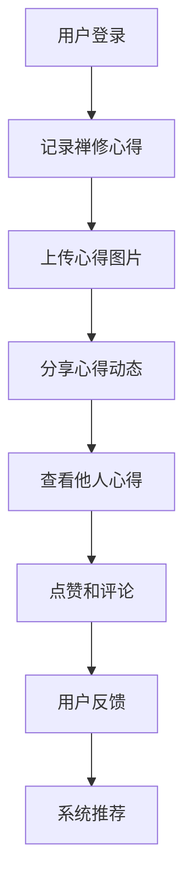
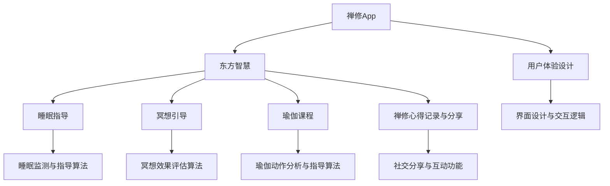

                 

# 现代禅修App：东方智慧的数字化呈现

## 关键词
- 禅修App
- 东方智慧
- 用户体验设计
- 技术架构
- 数据处理
- 运营策略

## 摘要
现代禅修App融合了东方智慧与现代科技，旨在为用户提供一种便捷、高效的心灵修养方式。本文将深入探讨现代禅修App的设计理念、技术实现、用户体验以及运营策略，展示东方智慧在数字化时代的创新呈现。

## 引言

### 1.1 现代禅修App的背景和意义

在快节奏的现代生活中，人们越来越意识到心理健康的重要性。禅修作为一种传统的心灵修养方式，受到了越来越多人的关注。现代禅修App应运而生，它通过数字化手段，将禅修的指导、冥想、瑜伽等元素融入用户日常生活，帮助用户在忙碌的生活中找到内心的平静。

现代禅修App不仅是一种工具，更是一种生活方式的变革。它为用户提供了灵活的禅修方式，不受时间和地点限制，让用户随时随地都可以进行禅修练习。同时，现代禅修App还可以根据用户的需求和反馈，提供个性化的禅修指导，提高禅修的效果。

### 1.2 东方智慧的数字化呈现：挑战与机遇

东方智慧，如禅修、冥想、瑜伽等，具有悠久的历史和深厚的文化底蕴。将这些智慧数字化，面临诸多挑战，如传统文化的现代解读、用户体验的设计、技术的融合与创新等。然而，数字化也为东方智慧带来了前所未有的机遇，通过现代科技手段，可以让东方智慧更广泛地传播，更深入地影响人们的生活。

本文将首先概述现代禅修App的发展历程和主要功能模块，然后深入解析东方智慧的数字化解析，探讨禅修App的用户体验设计和技术架构，最后讨论禅修App的运营与推广策略。希望通过本文的探讨，能够为现代禅修App的发展提供一些有益的思考和建议。

## 现代禅修App的概述

### 2.1 现代禅修App的定义

现代禅修App是一种基于移动互联网和现代科技开发的禅修指导应用程序。它集合了禅修、冥想、瑜伽等多种心灵修养方式，为用户提供了一套完整的心灵修养体系。用户可以通过这些App进行禅修练习、冥想训练、瑜伽课程学习，甚至可以记录和分享自己的禅修心得。

现代禅修App与传统禅修方式相比，具有以下几个显著特点：

1. **便捷性**：用户无需前往特定场所，只需通过智能手机或平板电脑，就可以随时随地开始禅修。
2. **个性化**：App可以根据用户的习惯和需求，提供个性化的禅修指导，提高禅修效果。
3. **互动性**：App提供社交功能，用户可以分享禅修心得，与其他用户互动交流，形成社区氛围。
4. **可扩展性**：随着技术的不断发展，App可以不断更新和扩展功能，满足用户日益增长的需求。

### 2.2 现代禅修App的发展历程

现代禅修App的发展历程可以追溯到2000年初，当时互联网和智能手机刚刚兴起，一些先行者开始探索如何将禅修与互联网技术结合。最早的禅修App主要功能较为简单，主要是提供一些基本的禅修指导和解说。随着移动互联网的普及和智能手机性能的提升，禅修App的功能逐渐丰富，开始引入更多的互动性和个性化元素。

近年来，随着人工智能和大数据技术的发展，现代禅修App进一步实现了智能化和个性化，可以根据用户的行为数据提供精准的禅修建议，甚至通过数据分析来评估用户的禅修效果。

### 2.3 现代禅修App的主要功能模块

现代禅修App通常包含以下几个主要功能模块：

1. **睡眠指导模块**：通过专业的睡眠指导算法，帮助用户改善睡眠质量，包括睡前冥想、深呼吸练习等。
2. **冥想引导模块**：提供多种冥想引导方式，如静坐冥想、动禅冥想等，用户可以根据自身需求选择。
3. **瑜伽课程模块**：提供丰富的瑜伽课程，包括初级、中级和高级课程，用户可以根据自己的瑜伽水平进行选择。
4. **禅修心得记录与分享模块**：用户可以记录自己的禅修心得，并分享到社区，与其他用户互动。
5. **用户数据分析模块**：通过分析用户的行为数据，为用户提供个性化的禅修建议和反馈。

通过这些功能模块，现代禅修App不仅帮助用户在忙碌的生活中找到内心的平静，还通过科技手段让禅修变得更加便捷、高效和有趣。

### 东方智慧的数字化解析

#### 3.1 东方智慧的核心概念

东方智慧，尤其是禅修、冥想和瑜伽，蕴含了丰富的哲学思想和实践方法，它们的核心概念包括但不限于以下几个方面：

1. **空性（Sunyata）**：佛教中的空性概念强调万物无常，无固定本质。现代禅修App通过引导用户进行深呼吸和静坐冥想，帮助用户体验到这一概念，从而达到内心的平静和解脱。
2. **专注力（Samadhi）**：瑜伽和禅修强调通过专注力来达到内心的专注和集中。现代禅修App通过提供各种冥想练习，如数呼吸、观想等，帮助用户培养专注力。
3. **呼吸（Pranayama）**：呼吸是禅修和瑜伽的重要组成部分。现代禅修App通过指导用户进行深呼吸练习，帮助用户调节身心状态，缓解压力和焦虑。
4. **慈悲（Compassion）**：佛教和瑜伽强调慈悲为怀，现代禅修App通过冥想和正念练习，帮助用户培养慈悲心，提升人际关系质量。

#### 3.2 东方智慧与现代科技结合的理论基础

将东方智慧与现代科技结合的理论基础主要体现在以下几个方面：

1. **大数据分析**：现代禅修App可以通过大数据分析，收集用户的行为数据，如禅修时间、呼吸频率、心率变化等，从而为用户提供个性化的禅修建议和反馈。
2. **人工智能**：人工智能技术可以用于设计智能化的禅修指导系统，如通过机器学习算法，根据用户的历史数据和行为习惯，自动生成个性化的禅修方案。
3. **物联网**：物联网技术可以用于整合各种禅修设备，如智能手环、心率监测仪等，实时监测用户的生理数据，提供更加精准的禅修指导。
4. **虚拟现实（VR）**：虚拟现实技术可以创造一个沉浸式的禅修环境，让用户在虚拟空间中进行禅修，增强禅修的体验感和参与度。

#### 3.3 东方智慧在禅修App中的应用实践

现代禅修App通过以下几种方式，将东方智慧融入实际应用中：

1. **禅修指导**：App提供专业的禅修指导，包括静坐、动禅、瑜伽等多种禅修方式，用户可以根据自身需求选择。
2. **冥想练习**：App提供各种冥想练习，如数呼吸、观想、正念等，帮助用户在日常生活中培养正念和专注力。
3. **瑜伽课程**：App提供丰富的瑜伽课程，从初级到高级，用户可以根据自己的水平和需求选择合适的课程。
4. **心灵成长**：App通过记录和分享禅修心得，促进用户之间的交流，形成一种共同成长、互相支持的社区氛围。

通过这些应用实践，现代禅修App不仅帮助用户实现了东方智慧的数字化呈现，还让这种古老的心灵修养方式在现代社会中焕发出新的生机和活力。

### 禅修App的用户体验设计

#### 4.1 用户体验设计的原则

用户体验设计（UX Design）是禅修App成功的关键因素之一。为了确保用户在使用禅修App时能够获得愉悦、高效和深刻的体验，用户体验设计需要遵循以下几个核心原则：

1. **用户中心**：用户体验设计的核心是用户。设计师需要深入了解用户的需求、行为和情感，确保App的功能和设计能够满足用户的需求，提升用户的满意度。
2. **简洁性**：简洁的设计能够减少用户的学习成本，让用户更容易上手。禅修App的界面设计应避免过多的装饰和复杂的功能，确保用户可以轻松、快速地找到所需的功能。
3. **一致性**：App的界面元素、操作逻辑和交互设计应保持一致性，以减少用户的困惑和操作错误。一致性包括色彩、字体、图标等视觉元素的一致性，以及操作流程的一致性。
4. **可访问性**：禅修App需要考虑不同用户的需求，包括视力障碍、听力障碍等。设计时应确保App能够满足各种用户的需求，提供可访问的功能和内容。
5. **反馈和指导**：App应提供清晰的反馈和指导，帮助用户了解自己的操作结果，以及在遇到问题时获得及时的解决方案。例如，当用户完成一次禅修练习时，App可以给出积极的反馈，或者在用户遇到问题时，提供详细的操作指导。

#### 4.2 禅修App的用户画像

为了更好地设计用户体验，我们需要了解禅修App的目标用户群体。以下是一个典型的禅修App用户画像：

1. **年龄层**：主要用户集中在25-45岁之间，这部分用户具有较高的消费能力和技术素养，对健康和生活质量有较高追求。
2. **职业背景**：用户主要包括白领、自由职业者、教师等，他们通常生活节奏较快，工作压力较大，渴望通过禅修来缓解压力，提升生活质量。
3. **生活习惯**：用户通常注重生活品质，有一定的自律能力，愿意花时间进行自我提升和修养。
4. **兴趣爱好**：用户可能对冥想、瑜伽、健身等有浓厚的兴趣，同时也可能对传统文化、哲学等有深入的研究和关注。

了解用户画像有助于设计师更好地把握用户需求，设计出符合用户期望的禅修App。

#### 4.3 界面设计与交互逻辑

禅修App的界面设计和交互逻辑直接影响用户的体验。以下是一些关键的设计要点：

1. **启动界面**：启动界面应简洁明了，用户一眼就能看到App的核心功能和亮点。可以通过一个优雅的静态画面或短视频来吸引用户。
2. **主界面**：主界面是用户进入App后看到的第一屏，设计时应确保用户可以快速浏览到各个功能模块，如睡眠指导、冥想引导、瑜伽课程等。
3. **导航设计**：导航设计应简单直观，用户可以通过菜单、按钮或手势快速切换到不同的功能模块。
4. **操作流程**：操作流程应简洁流畅，减少用户的操作步骤和思考时间。例如，用户只需点击一次即可开始冥想引导，无需进行复杂的设置。
5. **交互反馈**：交互反馈是用户体验的重要组成部分。例如，用户完成一次禅修练习后，App可以给出积极的反馈，如“恭喜您完成今天的冥想！”或者“您的专注力评分提高了5分！”。
6. **视觉设计**：视觉设计应遵循简洁、优雅的原则，使用柔和的色彩和流畅的动画，营造一个宁静、舒适的禅修环境。

通过以上界面设计与交互逻辑的设计，禅修App能够为用户带来愉悦、高效和深刻的体验，提升用户的使用满意度和忠诚度。

### 禅修App的技术架构

#### 5.1 技术架构的设计理念

禅修App的技术架构设计旨在确保系统的高性能、高可用性和可扩展性。设计理念包括以下几点：

1. **模块化**：将系统功能划分为多个模块，如用户管理、禅修指导、数据分析等，以便于系统的维护和扩展。
2. **分布式**：采用分布式架构，将系统功能分散到多个服务器上，以提高系统的容错能力和可扩展性。
3. **微服务**：采用微服务架构，将系统拆分为多个独立的微服务，每个微服务负责一个特定的功能，便于开发和部署。
4. **安全性**：确保系统的数据安全和用户隐私，采用加密传输、权限控制等技术手段，防止数据泄露和恶意攻击。
5. **实时性**：对于需要实时交互的功能，如禅修引导、心率监测等，采用实时数据处理技术，确保用户能够获得即时的反馈和指导。

#### 5.2 前端技术选型与实现

禅修App的前端技术选型应考虑到性能、易用性和用户体验。以下是前端技术选型的建议：

1. **框架**：选择主流的前端框架，如React或Vue.js，以提高开发效率和代码的可维护性。
2. **UI库**：使用流行的UI库，如Ant Design或Vuetify，以快速搭建美观、一致的界面。
3. **响应式设计**：采用响应式设计，确保App在不同设备上的展示效果和交互体验。
4. **Websocket**：对于需要实时交互的功能，如实时心率监测、实时互动等，使用WebSocket技术，以确保数据的实时传输和响应。

前端实现的要点包括：

1. **用户体验**：优化页面加载速度，减少页面跳转和等待时间，确保用户操作的流畅性。
2. **交互设计**：设计直观、易用的交互逻辑，如手势操作、语音控制等，提升用户的使用体验。
3. **可访问性**：确保前端代码符合可访问性标准，满足不同用户的需求。

#### 5.3 后端技术选型与实现

禅修App的后端技术选型应考虑到系统的性能、稳定性和可扩展性。以下是后端技术选型的建议：

1. **框架**：选择流行的后端框架，如Spring Boot或Django，以提高开发效率和代码的可维护性。
2. **数据库**：选择适合的数据存储方案，如关系型数据库（MySQL、PostgreSQL）或NoSQL数据库（MongoDB、Redis），根据应用场景进行优化。
3. **消息队列**：采用消息队列（如RabbitMQ、Kafka），实现系统模块间的异步通信，提高系统的解耦性和性能。
4. **缓存**：使用缓存（如Redis），减少数据库的访问压力，提高系统的响应速度。

后端实现的要点包括：

1. **服务拆分**：将系统功能拆分为多个微服务，每个微服务负责一个特定的功能，提高系统的可维护性和可扩展性。
2. **API设计**：设计简洁、清晰的API接口，确保前端与后端的高效通信。
3. **数据安全**：实现数据加密、权限控制等技术手段，确保用户数据的安全和隐私。
4. **日志管理**：实现完善的日志管理系统，记录系统运行过程中的关键信息，便于问题追踪和调试。

#### 5.4 数据存储与处理

禅修App的数据存储与处理是系统架构的重要组成部分。以下是数据存储与处理的建议：

1. **用户数据存储**：用户数据应存储在关系型数据库中，如MySQL，确保数据的完整性和安全性。
2. **行为数据存储**：用户行为数据（如禅修时间、呼吸频率、心率变化等）应存储在NoSQL数据库中，如MongoDB，以提高数据的读取和写入性能。
3. **数据清洗与处理**：采用大数据处理技术（如Hadoop、Spark），对用户行为数据进行清洗和预处理，为后续的数据分析和机器学习提供高质量的数据。
4. **实时数据处理**：对于需要实时处理的数据，如实时心率监测、实时互动等，采用流数据处理技术（如Apache Flink、Apache Storm），确保数据的实时性和准确性。

通过以上技术架构的设计和实现，禅修App能够为用户提供高效、稳定和可靠的禅修体验，同时确保系统的可扩展性和可维护性。

### 禅修App的核心功能模块

#### 6.1 睡眠指导模块

睡眠指导模块是禅修App中的一个重要功能，它旨在帮助用户改善睡眠质量，通过一系列的引导和指导，使用户能够更好地进入深度睡眠状态。

**功能描述**：
- **睡眠前准备**：在用户准备入睡前，App会提供一系列的准备工作，如深呼吸练习、放松肌肉等，帮助用户放松身心，减少焦虑和压力。
- **睡眠中监测**：App会通过智能手环或手机内置传感器，实时监测用户的睡眠状态，包括心率、呼吸频率、睡眠深度等，为用户提供个性化的睡眠建议。
- **睡眠后反馈**：在用户醒来后，App会根据用户的睡眠数据，给出睡眠质量的评估，并提供相应的建议，如调整睡眠时间、改善睡眠环境等。

**实现细节**：
- **算法设计**：睡眠指导模块采用了一系列专业的算法，如睡眠监测算法、睡眠质量评估算法等。例如，睡眠监测算法会根据用户的心率和呼吸频率数据，判断用户是否处于深度睡眠状态。
- **用户交互**：App提供了简洁直观的用户界面，用户可以通过简单的操作，如滑动屏幕或点击按钮，开始或停止睡眠指导。

**伪代码示例**：
```python
def sleep_guidance():
    # 获取用户睡眠偏好
    user_preference = get_user_preference()

    # 分析用户睡眠状况
    sleep_status = analyze_sleep_status(user_preference)

    # 提供个性化睡眠指导
    if sleep_status == "poor":
        suggest_tips("改善睡眠质量的建议")
    else:
        suggest_tips("保持良好睡眠的建议")
```

**应用场景**：
- **日常使用**：用户在睡前打开App，跟随指导进行放松练习，有助于改善睡眠质量。
- **问题解决**：对于经常失眠或睡眠质量差的用户，App会根据用户的反馈和数据分析，提供针对性的解决方案。

#### 6.2 冥想引导模块

冥想引导模块是禅修App的核心功能之一，它通过专业的冥想引导，帮助用户在短时间内达到冥想状态，提高专注力和心灵修养。

**功能描述**：
- **多种冥想方式**：App提供了多种冥想方式，如数呼吸、观想、动禅等，用户可以根据自己的需求和偏好选择。
- **实时反馈**：在冥想过程中，App会实时监测用户的呼吸和心率，提供即时的反馈，帮助用户调整冥想状态。
- **冥想记录**：用户可以记录每次冥想的时间、效果和感受，形成自己的冥想日志，便于后续回顾和总结。

**实现细节**：
- **算法设计**：冥想引导模块采用了多种算法，如呼吸同步算法、心率监测算法等。例如，呼吸同步算法会根据用户的呼吸节奏，调整冥想引导的节奏，帮助用户更好地进入冥想状态。
- **用户交互**：App提供了直观的界面，用户可以通过滑动屏幕或点击按钮，轻松选择不同的冥想方式。

**数学模型示例**：
$$
\text{冥想效果} = \alpha \times \text{冥想时间} + \beta \times \text{专注力评分} + \gamma \times \text{用户反馈评分}
$$
- $\alpha$：冥想时间权重系数
- $\beta$：专注力评分权重系数
- $\gamma$：用户反馈评分权重系数

**应用场景**：
- **日常冥想**：用户在早晨或晚上进行冥想，提高专注力和精神状态。
- **压力管理**：对于经常感到压力和焦虑的用户，通过冥想引导，缓解心理压力。

#### 6.3 瑜伽课程模块

瑜伽课程模块是禅修App的另一个重要功能，它通过专业的瑜伽课程，帮助用户提高身体的柔韧性和平衡性，同时达到心灵上的宁静。

**功能描述**：
- **课程分类**：App提供了丰富的瑜伽课程，包括初级、中级和高级课程，用户可以根据自己的水平和需求选择。
- **实时动作反馈**：在瑜伽课程中，App会通过摄像头实时捕捉用户的动作，提供即时的动作反馈，帮助用户纠正姿势，提高练习效果。
- **课程记录**：用户可以记录每次瑜伽课程的练习时间、动作反馈和感受，形成个人的瑜伽日志。

**实现细节**：
- **算法设计**：瑜伽课程模块采用了动作识别算法和姿态分析算法。例如，动作识别算法会根据摄像头捕捉到的用户动作，识别用户是否正确执行了瑜伽动作。
- **用户交互**：App提供了流畅的交互设计，用户可以通过触摸屏幕或语音指令，轻松选择和切换课程。

**代码解读示例**：
```python
def yoga_course():
    # 获取用户瑜伽等级和偏好
    user_level, user_preference = get_user_level(), get_user_preference()

    # 查询适合用户的瑜伽课程
    suitable_courses = search_suitable_courses(user_level, user_preference)

    # 播放瑜伽课程视频
    play_video(suitable_courses['video_url'])

    # 提供实时动作反馈
    provide_action_feedback(suitable_courses['action_feedback'])
```

**应用场景**：
- **日常练习**：用户在空闲时间进行瑜伽练习，提高身体柔韧性和平衡性。
- **健康促进**：对于希望改善身体健康和体态的用户，通过瑜伽课程，达到身心合一的效果。

#### 6.4 禅修心得记录与分享模块

禅修心得记录与分享模块是禅修App中的一个社交功能，它允许用户记录自己的禅修体验，并与社区成员分享，形成一种共同成长、互相支持的氛围。

**功能描述**：
- **心得记录**：用户可以在App中记录每次禅修的感受、体验和收获，形成个人的禅修日志。
- **心得分享**：用户可以将自己的心得分享到社区，与其他用户互动，交流心得体会。
- **点赞和评论**：用户可以对其他用户的心得进行点赞和评论，形成一种互动和反馈机制。
- **社交推荐**：App会根据用户的兴趣和行为，推荐可能感兴趣的心得分享，促进社区活跃度。

**实现细节**：
- **社交算法**：通过社交算法，推荐用户可能感兴趣的心得分享，提高社区的活跃度和用户的粘性。
- **用户互动**：提供简洁直观的互动界面，用户可以通过点赞、评论等功能，与其他用户互动。

**Mermaid流程图示例**：


**应用场景**：
- **个人成长**：用户通过记录和分享禅修心得，反思自己的成长过程，不断提升心灵修养。
- **社区互动**：用户在社区中交流心得，互相支持，形成一种积极的社区文化。

通过以上四个核心功能模块，禅修App为用户提供了一个全面、个性化的心灵修养平台，帮助用户在快节奏的现代生活中找到内心的平静和宁静。

### 禅修App的运营与推广

#### 7.1 运营策略

禅修App的运营策略是其长期发展和用户留存的关键。以下是一些关键的运营策略：

1. **用户增长**：通过市场推广活动、社交媒体宣传和合作伙伴关系，快速扩大用户基础。例如，可以通过免费试用期、限时优惠等方式吸引用户下载和使用App。
2. **用户留存**：提供高质量的内容和服务，确保用户在使用过程中感受到价值。定期推出新的功能、课程和活动，保持用户的兴趣和参与度。
3. **用户互动**：建立活跃的社区氛围，鼓励用户分享心得、反馈和建议。通过举办线上或线下的禅修活动，增加用户之间的互动和连接。
4. **数据分析**：利用大数据和人工智能技术，分析用户行为和需求，为用户提供个性化的推荐和服务。例如，根据用户的禅修记录和偏好，推荐适合的课程和指导。
5. **合作伙伴**：与相关行业（如健康、健身、教育等）的合作伙伴建立合作关系，共同推广和推广禅修App。

#### 7.2 推广渠道与手段

禅修App的推广需要多样化的渠道和手段，以下是一些有效的推广方式：

1. **线上推广**：利用社交媒体（如微博、微信、抖音等）、内容平台（如知乎、博客等）和搜索引擎（如百度、谷歌等）进行推广。可以通过发布高质量的内容、广告投放和关键词优化等方式，提高App的曝光率和下载量。
2. **线下推广**：在健身房、瑜伽馆、书店等场所设立展示区和体验区，让潜在用户亲身体验App的功能和服务。可以通过举办线下活动、讲座和研讨会等方式，增加用户的认知和信任度。
3. **内容营销**：制作和发布与禅修相关的优质内容，如文章、视频、课程等，吸引用户关注和参与。可以通过合作伙伴的网站、博客和社交媒体渠道，扩大内容的传播范围。
4. **KOL合作**：与知名博主、瑜伽教练、心理咨询师等KOL（Key Opinion Leader）合作，通过他们的推荐和分享，提高App的知名度和美誉度。
5. **品牌合作**：与相关品牌进行合作，如健康食品、健身器材、冥想设备等，通过联名活动、定制套餐等方式，共同推广和扩大用户基础。

#### 7.3 用户反馈与迭代

用户反馈是禅修App持续改进和优化的重要依据。以下是一些用户反馈的处理和迭代方法：

1. **用户调研**：定期进行用户调研，收集用户对App的使用体验、建议和反馈。可以通过问卷调查、用户访谈、用户行为分析等方式，深入了解用户的需求和痛点。
2. **反馈渠道**：提供多种反馈渠道，如App内置反馈表单、社交媒体私信、邮件反馈等，方便用户随时提出问题和建议。
3. **快速响应**：对于用户反馈的问题和建议，及时给予回应和解决方案。对于具有共性的问题，应迅速进行改进和优化，提高用户的满意度。
4. **迭代更新**：根据用户反馈和调研结果，定期发布App更新，优化用户体验、增加新功能和改进现有功能。可以通过版本迭代的方式，逐步完善App的功能和服务。
5. **用户参与**：鼓励用户参与App的迭代过程，通过用户测试、反馈收集和意见征询，确保新功能和服务符合用户期望和需求。

通过以上运营策略、推广渠道和用户反馈处理方法，禅修App能够实现持续的发展和优化，为用户提供更加优质、个性化的禅修体验。

### 结论

#### 8.1 现代禅修App的总结与展望

现代禅修App通过将东方智慧与现代科技相结合，为用户提供了便捷、高效的心灵修养方式。从睡眠指导、冥想引导、瑜伽课程到禅修心得记录与分享，现代禅修App涵盖了禅修的各个方面，帮助用户在快节奏的现代生活中找到内心的平静。通过大数据分析、人工智能和物联网技术的应用，现代禅修App不仅提供了个性化的禅修建议，还实现了禅修体验的实时反馈和优化。

未来，现代禅修App的发展前景广阔。随着技术的不断进步，如虚拟现实（VR）、增强现实（AR）和5G网络的普及，禅修App的功能将更加丰富，用户体验将更加沉浸和互动。此外，随着人们对心理健康关注的增加，禅修App有望成为健康生活的一部分，为用户提供更加全面的心灵关怀。

#### 8.2 对东方智慧数字化呈现的思考

东方智慧数字化呈现不仅是一种技术挑战，更是一种文化使命。在数字化时代，如何将东方智慧的核心思想与现代科技相结合，使之适应现代社会的需求，是一个值得深入探讨的问题。

首先，数字化东方智慧需要尊重和传承其文化内涵。在开发禅修App时，不应仅仅将其视为一种技术产品，而应将其视为一种文化载体，传递东方智慧的哲学思想和生活方式。

其次，数字化东方智慧需要关注用户体验。技术只是手段，最终目的是为用户提供有价值的服务。在开发过程中，应深入了解用户需求，设计简洁、直观、易用的界面和功能，确保用户能够轻松上手并持续使用。

最后，数字化东方智慧需要不断创新和探索。随着科技的不断发展，数字化呈现的方式和手段将不断丰富和多样化。例如，通过虚拟现实技术，用户可以置身于一个虚拟的禅修环境中，增强禅修的体验感和参与度。此外，人工智能技术的应用，可以为用户提供更加精准的禅修建议和个性化服务。

总之，现代禅修App的数字化呈现是东方智慧在新时代的一种创新表达。通过不断探索和实践，我们可以将东方智慧更好地融入现代生活，为人们的心理健康和幸福生活贡献一份力量。

### 作者信息

作者：AI天才研究院/AI Genius Institute & 禅与计算机程序设计艺术 /Zen And The Art of Computer Programming

### 附录

**核心概念与联系：禅修App与东方智慧**


**睡眠指导模块伪代码**
```python
def sleep_guidance():
    # 获取用户睡眠偏好
    user_preference = get_user_preference()

    # 分析用户睡眠状况
    sleep_status = analyze_sleep_status(user_preference)

    # 提供个性化睡眠指导
    if sleep_status == "poor":
        suggest_tips("改善睡眠质量的建议")
    else:
        suggest_tips("保持良好睡眠的建议")
```

**冥想引导模块数学模型**
$$
\text{冥想效果} = \alpha \times \text{冥想时间} + \beta \times \text{专注力评分} + \gamma \times \text{用户反馈评分}
$$
- $\alpha$：冥想时间权重系数
- $\beta$：专注力评分权重系数
- $\gamma$：用户反馈评分权重系数

**瑜伽课程模块代码解读**
```python
def yoga_course():
    # 获取用户瑜伽等级和偏好
    user_level, user_preference = get_user_level(), get_user_preference()

    # 查询适合用户的瑜伽课程
    suitable_courses = search_suitable_courses(user_level, user_preference)

    # 播放瑜伽课程视频
    play_video(suitable_courses['video_url'])

    # 提供实时动作反馈
    provide_action_feedback(suitable_courses['action_feedback'])
```

**禅修心得记录与分享模块**


本文详细介绍了现代禅修App的设计理念、技术实现、用户体验以及运营策略，展示了东方智慧在数字化时代的创新呈现。希望本文能为禅修App的开发和推广提供一些有益的参考和启示。通过不断探索和实践，我们可以将东方智慧更好地融入现代生活，为人们的心理健康和幸福生活贡献一份力量。

