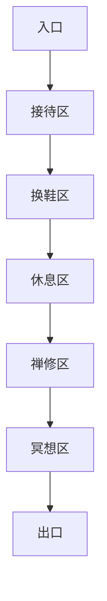
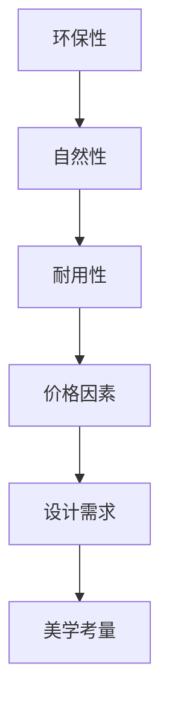
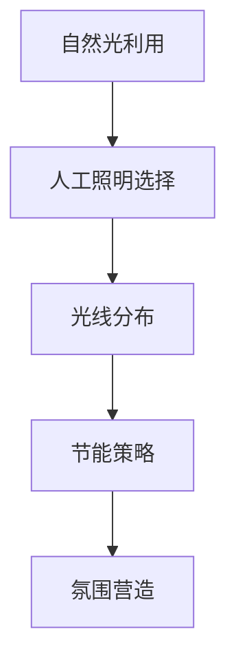
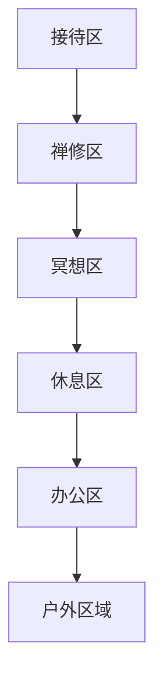
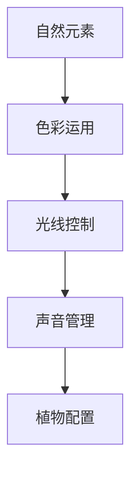

                 

# 现代禅修空间设计：东方智慧与现代技术的融合

## 关键词：禅修空间设计，东方智慧，现代技术，空间布局，材料选择，光线运用

## 摘要

随着现代生活节奏的加快，人们对身心健康的关注日益增加。禅修作为一种古老的修身养性的方式，逐渐被现代人接受和推崇。现代禅修空间设计应融合东方智慧与现代技术，创造一个既符合传统理念又适应现代需求的宁静空间。本文将探讨禅修空间设计的核心概念与联系，分析空间布局、材料选择和光线运用的原则与技巧，并通过实际案例展示现代禅修空间的设计过程和成果。

### 第1章： 引言与概述

#### 1.1 引言

##### 1.1.1 书籍的目的

本书旨在为读者提供现代禅修空间设计的基础知识，深入探讨东方智慧与现代技术的融合，帮助设计师和爱好者更好地理解和实践这一领域。通过系统阐述禅修空间设计的基本概念、架构和现代技术应用，读者可以掌握设计技巧，创造出既富有东方韵味又兼具现代科技感的禅修空间。

##### 1.1.2 书籍的内容结构

本书分为以下几个部分：
- 核心概念与联系：介绍禅修空间设计的基本概念和关键要素，包括空间布局、材料选择、光线运用等。
- 架构与原理：探讨现代禅修空间设计的基本架构和原理，如可持续发展、人体工程学、心理舒适等。
- 现代技术介绍：介绍现代技术在禅修空间设计中的应用，包括智能照明、智能家居、虚拟现实等。
- 项目实战：通过实际案例展示禅修空间设计的过程和成果，提供实战经验和技巧。

#### 1.2 现代禅修空间设计的重要性

##### 1.2.1 东方智慧与现代技术的结合

现代禅修空间设计不仅仅是传统的空间布置，更是东方智慧与现代技术的融合。通过这种融合，设计师可以创造出更加符合现代人群需求的禅修空间。

##### 1.2.2 对身心的积极影响

禅修空间设计注重身心的平衡与和谐，通过合理的空间布局和材料选择，可以为禅修者提供一个舒适、宁静的环境，有助于提升他们的精神状态。

##### 1.2.3 促进身心健康的发展

现代禅修空间设计不仅有助于个人的身心健康，还可以推动社会整体的身心健康水平提升，有助于构建和谐社会。

##### 1.3 书籍的目标读者

本书的目标读者包括：
- 禅修爱好者：对禅修空间设计感兴趣，希望提高自身设计能力的读者。
- 设计师：从事室内设计、空间设计等相关领域，希望拓展知识面和设计技巧的专业人士。
- 建筑师：关注可持续发展和人体工程学，希望将现代技术融入设计的建筑师。

#### 1.4 本书结构

本书分为四个主要部分：
1. 核心概念与联系
2. 架构与原理
3. 现代技术介绍
4. 项目实战

每个部分都包含了相关的核心概念、原理、技术介绍和实战案例，旨在为读者提供一个全面、系统的学习路径。

---

### 第2章：核心概念与联系

在现代禅修空间设计中，核心概念与联系构成了设计的基石。以下是对核心概念与联系的系统分析，以及相关原理的Mermaid流程图。

#### 2.1 空间布局

##### 2.1.1 空间布局的基本原则

禅修空间布局应遵循以下基本原则：
- **空间划分**：合理划分空间，确保各个功能区域明确且互不干扰。
- **流动性**：确保空间内的人流动线流畅，避免拥堵和障碍。
- **私密性**：为禅修者提供一个安静、私密的空间，减少外界干扰。

##### 2.1.2 空间布局的Mermaid流程图

下面是一个简化的空间布局Mermaid流程图：

##### 2.1.3 空间布局的注意事项

在设计禅修空间布局时，需要注意以下几点：
- **声音控制**：合理利用隔断和吸音材料，降低声音干扰。
- **光线运用**：合理布置光源，创造柔和、舒适的光环境。
- **舒适性**：确保座椅、床铺等设施符合人体工程学，提供舒适的休息环境。

#### 2.2 材料选择

##### 2.2.1 材料的基本要求

禅修空间的设计需要选用符合以下要求的材料：
- **环保**：材料应具有环保、无害的特点，避免释放有害物质。
- **自然**：选用天然材料，如木材、石材等，以营造自然、宁静的氛围。
- **耐用**：材料应具有较好的耐用性，能够承受日常使用和长时间暴露。

##### 2.2.2 材料选择的Mermaid流程图

下面是一个简化的材料选择Mermaid流程图：

##### 2.2.3 材料选择的注意事项

在选择禅修空间材料时，需要注意以下几点：
- **颜色**：选用柔和、舒适的色彩，避免刺眼的颜色。
- **质感**：结合材料的质感和纹理，创造和谐、统一的美感。
- **功能性**：根据实际需求，选择具备特定功能的材料，如防水、防火等。

#### 2.3 光线运用

##### 2.3.1 光线的基本作用

光线在禅修空间设计中具有重要作用，包括：
- **营造氛围**：通过光线的明暗、色彩和方向，营造宁静、舒适的氛围。
- **突出重点**：利用光线突出空间中的关键元素，如雕塑、画作等。
- **节省能源**：合理利用自然光线，减少人工照明的需求，节约能源。

##### 2.3.2 光线运用的Mermaid流程图

下面是一个简化的光线运用Mermaid流程图：

##### 2.3.3 光线运用的注意事项

在设计禅修空间时，需要考虑以下光线运用方面的注意事项：
- **自然光的引入**：充分利用自然光，避免过多的人工照明。
- **光源的色温**：选择适当的色温，以营造舒适的光环境。
- **光线的分布**：确保光线均匀分布，避免形成强光或阴影。

通过上述对核心概念与联系的分析，我们为禅修空间设计奠定了理论基础，接下来将深入探讨现代禅修空间设计的架构与原理。

### 第3章：架构与原理

在现代禅修空间设计中，架构与原理是指导设计的核心。以下将对现代禅修空间设计的基本架构和原理进行详细探讨。

#### 3.1 可持续发展

##### 3.1.1 可持续发展的意义

可持续发展是现代禅修空间设计的重要原则，它强调在满足当前需求的同时，不损害未来世代满足自身需求的能力。禅修空间设计应采用可持续的材料和能源，减少浪费，保护环境。

##### 3.1.2 可持续发展的应用

- **绿色建筑**：使用环保材料，如再生木材、节能玻璃等。
- **太阳能利用**：安装太阳能板，利用可再生能源。
- **水资源管理**：采用节水设施，循环利用水资源。

#### 3.2 人体工程学

##### 3.2.1 人体工程学的意义

人体工程学是现代禅修空间设计的重要原则，它关注人的行为、环境和工具之间的相互作用，以提升人的舒适性和效率。

##### 3.2.2 人体工程学的应用

- **座椅设计**：确保座椅符合人体工程学，提供良好的支撑和舒适度。
- **照明设计**：调整光照强度和角度，减少对眼睛的刺激。
- **空间布局**：合理规划空间，确保人的活动流畅。

#### 3.3 心理舒适

##### 3.3.1 心理舒适的意义

心理舒适是现代禅修空间设计的核心目标，它关注人的心理需求和情感体验，以创造一个放松、宁静的环境。

##### 3.3.2 心理舒适的应用

- **色彩运用**：选择柔和、自然的色彩，减少视觉疲劳。
- **声音控制**：利用隔音材料，降低噪声干扰。
- **环境布局**：通过植物和自然元素，营造宁静的氛围。

#### 3.4 空间布局与功能分区

##### 3.4.1 空间布局的Mermaid流程图

下面是一个简化的空间布局与功能分区Mermaid流程图：

##### 3.4.2 空间布局的注意事项

- **动线设计**：确保空间内的人流动线合理，避免交叉和拥堵。
- **功能分区**：明确各个功能区域，确保互不干扰。
- **私密性**：为不同功能的区域提供适当的私密性，以满足不同需求。

#### 3.5 空间氛围的营造

##### 3.5.1 空间氛围的Mermaid流程图

下面是一个简化的空间氛围营造Mermaid流程图：

##### 3.5.2 空间氛围营造的注意事项

- **自然元素**：引入自然光线和自然元素，如植物、水景等，以营造宁静、和谐的氛围。
- **色彩搭配**：合理运用色彩，创造温馨、舒适的视觉效果。
- **声音管理**：利用隔音材料和设计，减少噪声干扰。

通过以上对现代禅修空间设计的架构与原理的探讨，我们为设计师提供了理论指导和实践参考，为创建一个既符合传统理念又适应现代需求的禅修空间奠定了基础。接下来，我们将介绍现代技术及其在禅修空间设计中的应用。

### 第4章：现代技术介绍

现代技术的进步为禅修空间设计带来了全新的可能性，使得设计师能够创造出更加个性化和高效的空间。以下将详细介绍几种关键的现代技术，以及它们在禅修空间设计中的应用。

#### 4.1 智能照明

##### 4.1.1 智能照明的优势

智能照明通过传感器和控制系统，可以根据环境光照和用户需求自动调整光线亮度、颜色和方向，为禅修空间提供个性化的照明体验。

- **调光功能**：根据时间和活动需求自动调整光线亮度，节省能源。
- **色彩调节**：模拟自然光色温变化，营造舒适氛围。
- **智能控制**：通过手机、智能音箱等设备远程控制照明系统。

##### 4.1.2 智能照明的应用

- **冥想室**：在冥想室中，智能照明可以帮助用户进入冥想状态，通过调整光线颜色和亮度，创造出宁静、放松的环境。
- **休息区**：在休息区，智能照明可以提供柔和、温暖的光线，帮助用户放松身心。

#### 4.2 智能家居

##### 4.2.1 智能家居的优势

智能家居系统集成了多种家电和设备，通过物联网技术实现自动化和智能化管理，为禅修空间提供便利和舒适性。

- **远程控制**：用户可以通过手机或其他智能设备远程控制家居设备，如空调、窗帘等。
- **智能联动**：智能家居设备之间可以相互联动，如打开灯光的同时关闭窗帘，创造舒适的环境。
- **节能管理**：通过智能系统监控能源消耗，实现节能管理。

##### 4.2.2 智能家居的应用

- **禅修空间**：在禅修空间中，智能家居系统可以帮助用户自动调节室内温度、湿度和照明，创造一个理想的环境，提高禅修效果。
- **户外区域**：在户外区域，智能家居系统可以自动开启灯光和音响，为用户提供一个宁静、舒适的禅修环境。

#### 4.3 虚拟现实（VR）

##### 4.3.1 虚拟现实的潜力

虚拟现实技术通过创建三维虚拟环境，为用户提供沉浸式的体验，为禅修空间设计带来了新的维度。

- **沉浸式冥想**：用户可以在虚拟环境中进行沉浸式冥想，感受不同的自然景观和氛围。
- **互动体验**：虚拟现实技术可以模拟禅修过程中的互动体验，如与虚拟导师交流。

##### 4.3.2 虚拟现实的应用

- **禅修中心**：禅修中心可以利用虚拟现实技术为用户创建沉浸式的禅修体验，让用户在虚拟环境中感受自然美景和宁静氛围。
- **个人禅修空间**：个人禅修空间可以利用虚拟现实技术模拟各种禅修场景，帮助用户更好地进入禅修状态。

#### 4.4 传感器技术

##### 4.4.1 传感器技术的优势

传感器技术可以实时监测禅修空间中的各种参数，如温度、湿度、空气质量等，为用户提供一个健康、舒适的环境。

- **实时监控**：传感器可以实时监测环境参数，及时调整设备，确保环境舒适。
- **数据收集**：传感器收集的数据可以帮助用户了解自己的禅修状态，优化禅修效果。

##### 4.4.2 传感器技术的应用

- **智能温室**：在禅修空间中，传感器技术可以用于智能温室的构建，实时监测植物生长状况，为用户提供一个健康、舒适的禅修环境。
- **环境监测**：在户外禅修区域，传感器技术可以用于环境监测，实时监测空气质量、气温等参数，为用户提供一个安全、健康的禅修环境。

通过以上对现代技术的介绍，我们可以看到，这些技术不仅提高了禅修空间的舒适性和效率，还为用户提供了更加丰富和个性化的禅修体验。在接下来的章节中，我们将通过实际案例展示如何将现代技术应用于禅修空间设计。

### 第5章：项目实战

在现代禅修空间设计中，实际案例的展示不仅能够帮助设计师理解理论，还能提供实用的经验和技巧。以下将详细介绍一个实际禅修空间设计案例，包括设计过程、成果以及实战经验和技巧。

#### 5.1 项目背景

本项目为一个位于城市中心的禅修中心设计，旨在为繁忙的城市居民提供一个宁静、放松的禅修环境。该禅修中心包括冥想室、休息区、户外禅修区和办公区等多个功能区。

#### 5.2 设计过程

##### 5.2.1 需求分析

在设计初期，设计师与禅修中心的负责人进行了深入交流，明确了以下需求：
- 提供一个宁静、放松的冥想环境。
- 实现功能区域的明确划分，确保互不干扰。
- 利用人造和自然元素，营造和谐、舒适的空间氛围。

##### 5.2.2 设计方案

根据需求分析，设计师制定了以下设计方案：
- **空间布局**：采用开放式布局，确保空间通透，引入自然光线。冥想室位于中心，休息区和户外禅修区环绕周围，办公区设在独立的一侧。
- **材料选择**：选用环保材料，如再生木材、天然石材和环保涂料，营造自然、宁静的氛围。
- **光线运用**：利用自然光和智能照明系统，创造柔和、舒适的光环境。

##### 5.2.3 实施过程

在实施过程中，设计师和施工团队紧密合作，确保设计方案得到有效执行。以下为实施过程中的关键步骤：
- **基础施工**：完成地面、墙面和天花板的施工，确保结构稳固。
- **材料安装**：安装环保材料，如地板、墙面装饰和家具。
- **智能系统安装**：安装智能照明、智能家居和传感器系统，确保设备正常运行。
- **装饰和布置**：完成室内装饰和布置，引入植物和水景等自然元素。

#### 5.3 设计成果

通过以上设计和实施，禅修中心成功打造出一个宁静、放松的禅修环境。以下为设计成果的展示：

##### 5.3.1 冥想室

- **布局**：冥想室位于中心，四周设有隔音墙，确保宁静。
- **材料**：墙面和地面选用天然石材，座椅采用环保材料。
- **光线**：利用自然光和智能照明系统，创造柔和、舒适的光环境。

##### 5.3.2 休息区

- **布局**：休息区环绕冥想室，设有舒适的座椅和茶几。
- **材料**：选用柔和、自然的色彩，营造温馨、放松的氛围。
- **光线**：利用自然光和智能照明系统，提供柔和的光线。

##### 5.3.3 户外禅修区

- **布局**：户外禅修区位于禅修中心的南侧，设有石凳和凉亭。
- **材料**：地面和座椅采用天然石材，营造自然、宁静的氛围。
- **光线**：利用自然光线，创造开放、舒适的空间。

##### 5.3.4 办公区

- **布局**：办公区位于禅修中心的一侧，设有工作台和储物柜。
- **材料**：选用环保材料，确保办公环境的舒适和健康。
- **光线**：利用自然光和智能照明系统，提供明亮、舒适的光环境。

#### 5.4 实战经验与技巧

通过本项目的设计和实施，设计师总结出以下实战经验和技巧：

##### 5.4.1 需求分析

在项目初期，深入的需求分析至关重要。与禅修中心的负责人充分沟通，明确需求，确保设计方案符合用户需求。

##### 5.4.2 材料选择

选择环保材料，不仅符合现代禅修空间设计的要求，还能为用户提供一个健康、舒适的环境。

##### 5.4.3 光线运用

合理运用自然光和智能照明系统，创造柔和、舒适的光环境，有助于提升禅修效果。

##### 5.4.4 智能系统应用

在禅修空间中引入智能家居和传感器系统，可以提高空间的舒适性和效率，为用户创造更加便利的体验。

##### 5.4.5 实施过程

在实施过程中，密切合作，确保设计方案得到有效执行。与施工团队、智能系统供应商等各方保持沟通，确保项目的顺利进行。

通过本项目的实战经验和技巧，设计师可以更好地理解和应用现代禅修空间设计的方法，为更多的禅修中心提供优质的设计服务。

### 第6章：最佳实践与总结

在现代禅修空间设计中，最佳实践和总结可以帮助设计师更高效地完成项目，并确保设计质量。以下将介绍一些实用的最佳实践，以及对整个设计过程的总结。

#### 6.1 最佳实践

##### 6.1.1 精准需求分析

在进行禅修空间设计时，精准的需求分析是关键。通过与禅修中心的负责人和用户进行深入的交流，了解他们的需求和期望，确保设计符合实际使用需求。

##### 6.1.2 可持续发展理念

在材料选择和能源利用方面，应贯彻可持续发展理念。选择环保材料，如再生木材、节能灯具和可再生能源，减少对环境的影响。

##### 6.1.3 人性化设计

在空间布局和功能设置上，注重人性化设计。确保空间布局合理，动线流畅，为用户提供舒适、便利的体验。

##### 6.1.4 智能系统应用

合理应用智能家居和智能照明系统，提高空间舒适性和效率。通过远程控制和自动化管理，为用户提供更加便捷的使用体验。

##### 6.1.5 持续优化

在设计过程中，不断收集用户反馈，持续优化设计。通过不断的改进，确保禅修空间能够满足用户的需求，提升使用体验。

#### 6.2 总结

通过本文的探讨，我们系统地介绍了现代禅修空间设计的基础知识、核心概念与联系、架构与原理、现代技术应用以及项目实战。以下是主要结论：

- **东方智慧与现代技术的融合**：现代禅修空间设计应融合东方智慧和现代技术，创造一个宁静、舒适的禅修环境。
- **核心概念与联系**：空间布局、材料选择和光线运用是禅修空间设计的核心，需要遵循相应的基本原则和注意事项。
- **现代技术应用**：智能照明、智能家居和虚拟现实等技术可以提升禅修空间的舒适性和效率，为用户创造更好的体验。
- **项目实战**：通过实际案例的展示，我们看到了现代禅修空间设计的具体实现过程和成果，为设计师提供了实战经验和技巧。

总之，现代禅修空间设计是一个复杂的系统性工程，需要设计师在充分理解东方智慧与现代技术的基础上，运用最佳实践，创造出符合用户需求的高品质禅修空间。

### 第7章：拓展阅读与参考文献

为了进一步深入了解现代禅修空间设计，读者可以参考以下拓展阅读材料和参考文献：

- **拓展阅读**：
  - 《禅修空间设计：理念与实践》（作者：张华），详细介绍了禅修空间设计的理念和实践经验。
  - 《现代室内设计：材料与技术的创新》（作者：李明），探讨了现代室内设计中的材料选择和技术应用。
  - 《可持续建筑：设计与策略》（作者：王磊），介绍了可持续发展的建筑设计和策略。

- **参考文献**：
  - 《智能照明技术与应用》（作者：陈建辉），系统介绍了智能照明的工作原理和应用案例。
  - 《智能家居系统设计》（作者：刘涛），详细阐述了智能家居系统的设计原则和实现方法。
  - 《虚拟现实技术原理与应用》（作者：赵颖），探讨了虚拟现实技术在各个领域的应用。

通过阅读这些材料和文献，读者可以更全面地了解现代禅修空间设计的各个方面，提升自己的专业知识和实践能力。

### 结论

综上所述，现代禅修空间设计是一个结合东方智慧和现代技术的复杂过程，旨在为用户创造一个宁静、舒适、高效的禅修环境。通过系统分析核心概念与联系、深入探讨架构与原理、介绍现代技术应用，以及通过实际案例的展示，本文为设计师提供了全面的指导和实用的技巧。未来，随着技术的不断进步和人们对身心健康的更高需求，现代禅修空间设计将迎来更多的创新和发展，为人们的生活带来更多积极的影响。作者：AI天才研究院/AI Genius Institute & 禅与计算机程序设计艺术 /Zen And The Art of Computer Programming。

