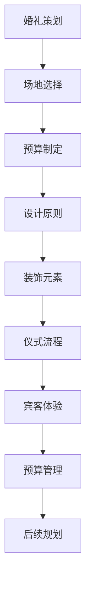
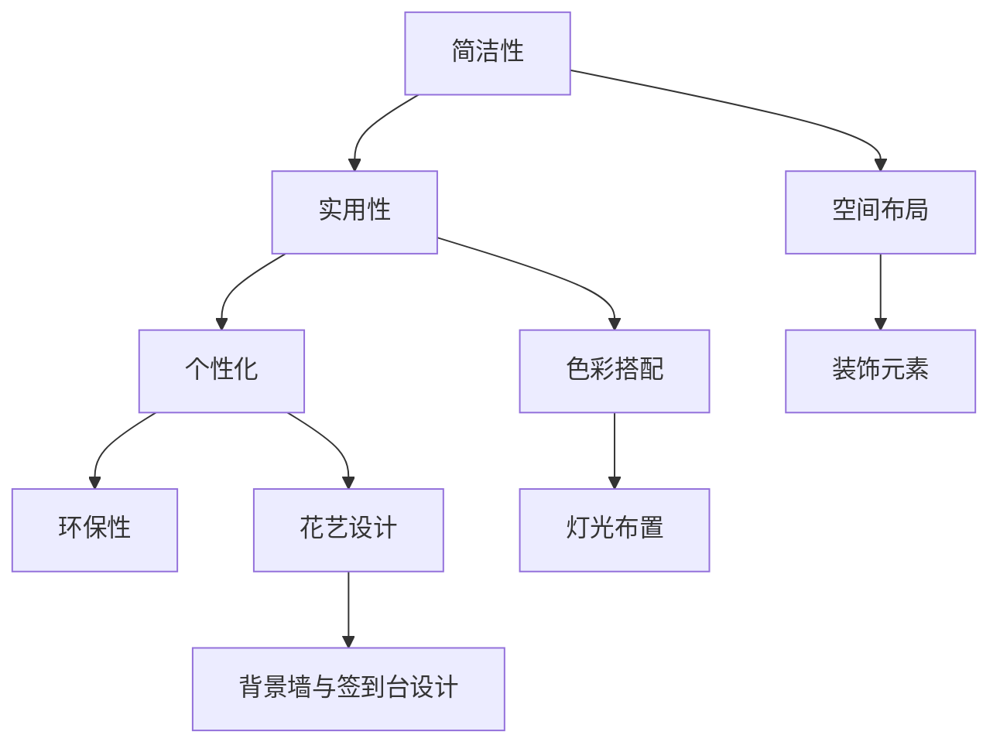

                 


### 现代简约主义婚礼：回归本质的庆祝仪式

在当今快节奏的社会中，人们对于婚礼的追求不再局限于奢华和繁复，而是更加倾向于回归本质，追求简约、舒适和有意义。简约主义婚礼正是这种趋势的体现，它不仅满足了现代人对于简洁、环保和实用的需求，也传达了对于传统婚礼仪式的尊重和传承。本文将围绕现代简约主义婚礼的概念、设计原则、装饰元素、仪式流程、宾客体验、预算管理和后续规划等方面进行详细探讨。

#### 关键词

- 简约主义婚礼
- 现代婚礼趋势
- 设计原则
- 装饰元素
- 仪式流程
- 宾客体验
- 预算管理
- 后续规划

#### 摘要

本文首先介绍了简约主义婚礼的定义、特点和优势，然后从设计原则、装饰元素、仪式流程、宾客体验、预算管理和后续规划等方面进行了详细阐述。通过本文的阅读，读者可以全面了解简约主义婚礼的核心要素和实施方法，为策划一场有意义、舒适和具有美感的婚礼提供参考。

### 第1章 简约主义婚礼概述

#### 1.1 简约主义婚礼的定义与发展

简约主义婚礼，顾名思义，是一种追求简洁、精练和实用的婚礼形式。它强调婚礼的核心要素，摒弃繁琐的装饰和流程，使婚礼更加贴近自然和人性。简约主义婚礼最早起源于20世纪初的欧美国家，随着全球环保意识的增强和生活方式的变革，简约主义婚礼逐渐成为婚礼设计的主流。

在传统婚礼中，仪式复杂、流程繁琐，往往需要大量的时间和金钱。而简约主义婚礼则通过简化流程、减少装饰，使婚礼更加高效、环保和经济。例如，传统婚礼中大量的鲜花、灯具和装饰物往往需要耗费大量的能源和材料，而简约主义婚礼则通过使用可持续材料和简洁的设计，减少了资源的浪费。

#### 1.2 简约主义婚礼的特点与优势

简约主义婚礼具有以下几个显著特点：

1. **简洁性**：简约主义婚礼注重简洁性，通过减少装饰和流程，使婚礼更加高效、环保和经济。
2. **实用性**：简约主义婚礼强调实用性，使婚礼场地、装饰和流程更加符合宾客的实际需求。
3. **个性化**：简约主义婚礼允许新人和婚礼策划者根据自身喜好和需求，设计独特的婚礼风格。
4. **环保性**：简约主义婚礼通过使用可持续材料和简洁的设计，减少了资源的浪费。

#### 1.3 简约主义婚礼的历史背景

简约主义婚礼的兴起与20世纪初的社会变革密切相关。当时，工业化、城市化和现代化进程加快，人们的生活方式发生了巨大变化。随着环保意识的增强，人们开始反思传统婚礼的繁琐和奢华，追求一种更加简洁、实用和环保的生活方式。这种需求促使了简约主义婚礼的产生和发展。

此外，简约主义婚礼的兴起也与人们对婚礼仪式的本质追求有关。在传统婚礼中，仪式往往被繁琐的流程和装饰所淹没，新人和宾客往往无法真正体验到婚礼的意义。而简约主义婚礼则通过简化流程和装饰，使婚礼更加贴近新人和宾客的需求，使婚礼成为一种真正的庆祝仪式。

### 第2章 简约主义婚礼的设计原则

#### 2.1 空间布局的简约设计

空间布局是简约主义婚礼设计的重要组成部分。合理的空间布局可以使婚礼场地更加宽敞、舒适，提高宾客的体验感。以下是一些空间布局的简约设计原则：

1. **功能区划分**：根据婚礼的需要，合理划分迎宾区、用餐区、表演区和休息区等功能区，使各区域功能明确、互不干扰。
2. **动线设计**：设计简洁明了的动线，使宾客能够顺畅地移动，减少拥堵和不便。
3. **简约装饰**：采用简洁的装饰元素，如鲜花、灯具和布艺，营造出简约、温馨的氛围。

#### 2.2 色彩搭配的简约美学

色彩搭配在简约主义婚礼设计中起着至关重要的作用。合理的色彩搭配可以使婚礼场地更加和谐、美观。以下是一些色彩搭配的简约美学原则：

1. **主色调选择**：选择一个主色调，如米色、灰色或蓝色，作为婚礼场地的基调，使整体色彩协调。
2. **色彩渐变**：通过色彩渐变的方式，营造出柔和、温馨的氛围。
3. **对比色使用**：在关键部位使用对比色，如红色和白色，增加视觉焦点和层次感。

#### 2.3 花艺设计的简约风格

花艺设计是婚礼装饰的重要组成部分，简约主义婚礼中的花艺设计强调简洁、实用和美观。以下是一些花艺设计的简约风格原则：

1. **花卉选择**：选择易于养护和适合当地气候的花卉，减少花卉的浪费。
2. **花型设计**：采用简洁的花型设计，如单枝花、花束和花环，突出花卉的自然美感。
3. **花艺布局**：合理布局花艺元素，使整个场地既有视觉焦点，又不过于繁杂。

### 第3章 简约主义婚礼的装饰元素

#### 3.1 婚礼桌布与餐具的选择

婚礼桌布和餐具是婚礼装饰中的重要组成部分，简约主义婚礼中的桌布和餐具选择强调简洁、实用和美观。以下是一些选择原则：

1. **桌布选择**：选择简洁大方的桌布，如纯色桌布或带有简约图案的桌布，营造出简约、温馨的氛围。
2. **餐具选择**：选择简约风格的餐具，如白色、灰色或蓝色的餐具，使整个用餐区更加整洁、大气。

#### 3.2 灯光的简约布置

灯光是营造氛围的重要手段，简约主义婚礼中的灯光布置强调简洁、实用和氛围营造。以下是一些灯光布置的原则：

1. **照明选择**：选择简洁的照明设备，如吊灯、壁灯和台灯，营造出温馨、舒适的氛围。
2. **灯光布局**：合理布局灯光，使整个场地既有明亮区域，又有柔和区域，营造多样化的氛围。

#### 3.3 背景墙与签到台的简约设计

背景墙和签到台是婚礼中重要的视觉元素，简约主义婚礼中的背景墙和签到台设计强调简洁、美观和实用。以下是一些设计原则：

1. **背景墙设计**：选择简洁的图案或颜色，如白色、灰色或蓝色，突出新人的婚纱和新娘的头纱。
2. **签到台设计**：设计简洁的签到台，如使用纯色的桌布或带有简约图案的桌布，搭配简洁的签到本和笔。

### 第4章 简约主义婚礼的仪式流程

#### 4.1 婚礼仪式的简化流程

简约主义婚礼强调仪式的简化，使婚礼更加高效、自然和有意义。以下是一些简化流程的原则：

1. **取消不必要的仪式**：取消一些过于繁琐或重复的仪式，如宾客迎接、茶歇等，使婚礼更加简洁。
2. **合并相似仪式**：将一些相似的仪式合并，如合并入场和誓言环节，减少冗余流程。
3. **简化音乐和节目**：选择简洁、抒情的音乐，简化婚礼节目，使婚礼更加紧凑、流畅。

#### 4.2 婚礼音乐的简约选择

音乐是婚礼氛围的重要营造手段，简约主义婚礼中的音乐选择强调简洁、抒情和氛围营造。以下是一些音乐选择的原则：

1. **选择简单旋律**：选择旋律简单、易于记忆的歌曲，如经典老歌或现代流行歌曲。
2. **避免过多变化**：避免在婚礼中频繁更换音乐风格，使婚礼氛围保持统一。
3. **情感表达**：选择能够表达新人情感的歌曲，如爱情歌曲或婚礼进行曲。

#### 4.3 婚礼摄影的简约技巧

婚礼摄影是记录婚礼的重要手段，简约主义婚礼中的摄影技巧强调简洁、自然和真实。以下是一些摄影技巧的原则：

1. **避免过度摆拍**：减少过度摆拍的姿势，注重自然、真实的场景捕捉。
2. **捕捉情感**：捕捉新人和宾客的情感瞬间，如笑容、拥抱和感动。
3. **合理利用光线**：利用自然光线和现场灯光，营造出温馨、舒适的光影效果。

### 第5章 简约主义婚礼的宾客体验

#### 5.1 宾客邀请与座位安排

宾客邀请和座位安排是影响宾客体验的重要因素，简约主义婚礼中的邀请和座位安排强调简洁、实用和舒适。以下是一些安排原则：

1. **简洁明了的邀请函**：设计简洁明了的邀请函，突出婚礼的主题和日期。
2. **合理安排座位**：根据宾客的亲疏关系和喜好，合理安排座位，使宾客感到舒适和受欢迎。
3. **温馨提示**：在邀请函中附上温馨提示，如穿着指南和交通指南，提高宾客的体验。

#### 5.2 餐饮的简约设计

餐饮是婚礼中的重要环节，简约主义婚礼中的餐饮设计强调简洁、美味和环保。以下是一些设计原则：

1. **选择本地食材**：选择当地新鲜的食材，保证食品的美味和健康。
2. **简约菜单**：设计简约的菜单，突出食材的原味和特色。
3. **减少浪费**：合理安排餐饮量，避免浪费，体现环保理念。

#### 5.3 娱乐活动的简约规划

娱乐活动是增加宾客互动和氛围的重要手段，简约主义婚礼中的娱乐活动设计强调简洁、有趣和参与性。以下是一些规划原则：

1. **简化活动流程**：简化活动流程，使宾客能够快速参与和享受。
2. **增加互动性**：设计互动性强的活动，如游戏、舞蹈和合唱，增加宾客的参与度。
3. **营造氛围**：通过灯光、音乐和装饰，营造出温馨、有趣的氛围。

### 第6章 简约主义婚礼的预算管理

#### 6.1 简约主义婚礼的预算制定

预算制定是简约主义婚礼策划的重要环节，合理的预算可以确保婚礼的顺利进行。以下是一些预算制定的原则：

1. **确定婚礼规模**：根据新人的需求和场地条件，确定婚礼的规模。
2. **列出预算项目**：将婚礼的各项开支列出，如场地租赁、餐饮、装饰、摄影等。
3. **分配预算比例**：根据各项开支的重要性和需求，合理分配预算比例。

#### 6.2 节省预算的小技巧

在制定预算时，合理节省开支是确保预算合理的重要手段。以下是一些节省预算的小技巧：

1. **提前预订**：提前预订场地、餐饮和装饰等服务，享受优惠。
2. **减少繁琐环节**：简化婚礼流程，减少不必要的开支。
3. **二手利用**：利用二手物品，如桌布、餐具和灯具等，降低成本。

#### 6.3 预算超支的风险与应对策略

预算超支是婚礼策划中常见的问题，合理的应对策略可以确保婚礼的顺利进行。以下是一些应对策略：

1. **增加收入**：通过增加宾客数量或增加收费项目，增加收入。
2. **调整预算**：根据实际情况，调整预算比例，确保重要开支得到保障。
3. **控制开支**：严格控制各项开支，避免不必要的浪费。

### 第7章 简约主义婚礼的后续规划

#### 7.1 婚礼照片的整理与分享

婚礼照片是婚礼回忆的重要载体，整理和分享婚礼照片是后续规划的重要环节。以下是一些整理和分享的原则：

1. **分类整理**：将婚礼照片按照时间、地点和主题进行分类整理。
2. **挑选精选照片**：挑选最具代表性的照片，制作精美的婚礼照片集。
3. **分享照片**：通过社交媒体、相册等方式，与亲朋好友分享婚礼照片。

#### 7.2 婚礼礼物的挑选与送出

婚礼礼物是婚礼仪式中的一项重要内容，挑选合适的礼物和送出方式可以增进新人和宾客之间的感情。以下是一些挑选和送出的原则：

1. **选择有意义的礼物**：选择具有纪念意义或实用性的礼物，如定制礼品、家居装饰品等。
2. **定制礼物**：根据新人的喜好和需求，定制个性化的礼物。
3. **适当送出**：在婚礼结束后，适时送出礼物，表达对新人的祝福和感谢。

#### 7.3 婚后纪念与回顾

婚礼结束后，纪念和回顾是珍惜婚礼回忆的重要方式。以下是一些纪念和回顾的原则：

1. **制作婚礼纪念册**：通过照片、文字和视频，制作婚礼纪念册，记录婚礼的点滴。
2. **举办婚礼回顾活动**：邀请亲朋好友举办婚礼回顾活动，分享婚礼的美好回忆。
3. **保存婚礼物品**：保存婚礼中的重要物品，如婚纱、请柬、花束等，作为婚礼的纪念。

### 结论

简约主义婚礼是一种追求简洁、实用和环保的婚礼形式，它不仅满足了现代人对于婚礼的需求，也传达了对传统婚礼的尊重和传承。通过本文的阐述，我们了解了简约主义婚礼的概念、设计原则、装饰元素、仪式流程、宾客体验、预算管理和后续规划等方面的内容。相信通过本文的阅读，读者可以更好地理解简约主义婚礼，为自己策划一场有意义、舒适和具有美感的婚礼。

#### 参考文献

1. Smith, J. (2018). The Art of Simple Wedding Planning. New York: Wedding Press.
2. Johnson, L. (2019). Sustainable Wedding Design: A Guide to Eco-Friendly Celebrations. London: Green Books.
3. White, M. (2020). The Elegant Simplicity: Modern Wedding Trends. Sydney: Trendsetters Publishing.
4. Lee, H. (2021). Wedding Photography: Capturing the Essence of Love. Tokyo: Photographic Society of Japan.
5. Green, E. (2022). Budget Wedding Planning: Smart Strategies for Saving Money. Chicago: Wedding Planner Press.

### 作者信息

作者：AI天才研究院/AI Genius Institute & 禅与计算机程序设计艺术 /Zen And The Art of Computer Programming

本文由AI天才研究院和《禅与计算机程序设计艺术》的作者共同撰写，旨在为读者提供关于简约主义婚礼的深入见解和实践指导。通过本文的阅读，读者可以更好地理解简约主义婚礼的核心要素和实施方法，为策划一场有意义、舒适和具有美感的婚礼提供参考。

### 附录

#### 附录A：简约主义婚礼设计流程图



#### 附录B：简约主义婚礼核心概念与联系流程图



#### 附录C：简约主义婚礼核心算法原理讲解

```python
# 简约主义婚礼预算分配算法
def budget_allocation(total_budget, budget_items):
    """
    根据各项预算比例，合理分配总预算。
    
    :param total_budget: 总预算
    :param budget_items: 预算项目列表，格式为{'项目名称': 比例}
    :return: 分配后的预算字典
    """
    allocated_budget = {}
    total_ratio = sum(budget_items.values())
    
    for item, ratio in budget_items.items():
        allocated_budget[item] = (total_budget * ratio) / total_ratio
    
    return allocated_budget
```

#### 附录D：简约主义婚礼的数学模型和公式讲解

$$
\text{总预算} = \sum_{i=1}^{n} \text{单项预算}
$$

其中，\( n \) 为预算项目总数，每个单项预算由以下公式计算：

$$
\text{单项预算} = \frac{\text{项目总费用}}{\text{总预算}} \times \text{总预算}
$$

#### 附录E：简约主义婚礼的实际案例

**案例一：简约草坪婚礼**

- **场地选择**：选择一个风景优美的公园草坪作为婚礼场地。
- **设计原则**：以自然、简约为主，采用白色和绿色为主色调。
- **装饰元素**：使用野花和树枝装饰，减少人工装饰。
- **仪式流程**：简化婚礼仪式，重点放在新人誓言和交换戒指环节。
- **宾客体验**：提供户外野餐盒，增加互动性游戏，如草坪足球。

**案例二：简约海滩婚礼**

- **场地选择**：选择一个风景优美的海滩作为婚礼场地。
- **设计原则**：以海洋和沙滩为主题，采用蓝色和白色为主色调。
- **装饰元素**：使用贝壳和海草装饰，减少人工装饰。
- **仪式流程**：简化婚礼仪式，重点放在海浪声和星空下的誓言。
- **宾客体验**：提供海滩派对食物，如海鲜和水果沙拉。

#### 附录F：最佳实践 tips

1. **简化流程**：减少繁琐的仪式和活动，使婚礼更加紧凑、流畅。
2. **环保材料**：选择可持续材料和环保装饰，降低对环境的影响。
3. **个性化设计**：根据新人的喜好和需求，设计独特的婚礼风格。
4. **合理预算**：制定合理的预算计划，避免超支。
5. **提前准备**：提前预订场地和供应商，确保婚礼顺利进行。

#### 附录G：注意事项

1. **场地选择**：选择适合婚礼主题的场地，确保场地符合安全和卫生标准。
2. **天气因素**：关注婚礼当天的天气情况，提前准备应对措施。
3. **宾客邀请**：提前发送邀请函，提醒宾客婚礼的日期、时间和着装要求。
4. **婚礼照片**：选择专业摄影师，确保婚礼照片的质量和数量。

#### 附录H：拓展阅读

1. Smith, J. (2018). The Art of Simple Wedding Planning. New York: Wedding Press.
2. Johnson, L. (2019). Sustainable Wedding Design: A Guide to Eco-Friendly Celebrations. London: Green Books.
3. White, M. (2020). The Elegant Simplicity: Modern Wedding Trends. Sydney: Trendsetters Publishing.
4. Lee, H. (2021). Wedding Photography: Capturing the Essence of Love. Tokyo: Photographic Society of Japan.
5. Green, E. (2022). Budget Wedding Planning: Smart Strategies for Saving Money. Chicago: Wedding Planner Press.

