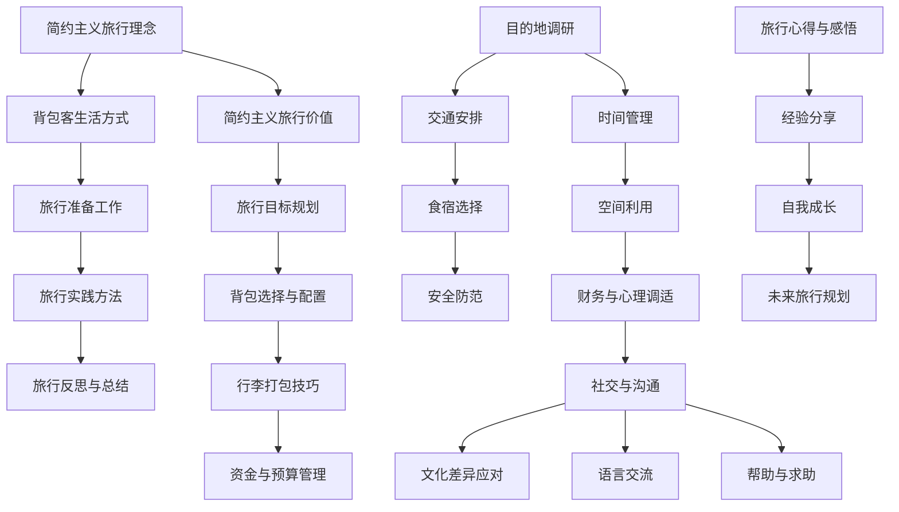

                 

### 文章标题

“现代简约主义旅行：minimalist背包客的生活哲学”

关键词：现代简约主义旅行、背包客、生活哲学、 minimalist、旅行准备、旅行技巧、旅行反思

摘要：本文深入探讨现代简约主义旅行的理念和实践，从背包客的生活哲学出发，详细解析了简约主义旅行的起源、准备工作、实践方法及旅行后的反思。通过一步步的分析和推理，帮助读者理解并实践这种新兴的旅行方式，实现更高效、更充实的生活体验。

---

### 文章关键词

现代简约主义旅行、背包客、生活哲学、minimalist、旅行准备、旅行技巧、旅行反思

### 文章摘要

本文旨在探讨现代简约主义旅行的理念和实践。通过分析背包客的生活哲学，文章详细介绍了简约主义旅行的起源、准备工作、实践方法和旅行后的反思。文章结构清晰，逻辑严密，以一步步的分析推理方式，帮助读者理解并实践简约主义旅行，从而实现更高效、更充实的生活体验。

---

### 第一部分：简约主义旅行的基础理念

#### 第1章：简约主义旅行的起源与发展

##### 1.1 简约主义旅行的定义

简约主义旅行，又称 minimalist 旅行，是一种以减少物质负担、追求心灵自由为核心理念的旅行方式。它强调通过简化行李、精简生活，让旅行者更加专注于旅行体验本身，从而实现更深层次的人生价值和精神满足。

##### 1.2 简约主义旅行的起源

简约主义旅行的概念起源于 20 世纪末的美国，随着 minimalist 生活方式的兴起，逐渐在全球范围内传播。最初，这种旅行方式主要是由一些追求极简主义的年轻人所推崇，他们希望通过旅行，减少物质负担，追求心灵的解放。

##### 1.3 简约主义旅行的核心价值

简约主义旅行的核心价值在于以下几个方面：

1. **减少物质负担**：通过减少行李和物品的数量，旅行者可以更加轻松地应对旅行中的各种不确定性，减少旅行中的烦恼。

2. **提升旅行体验**：简约主义旅行鼓励旅行者关注旅行过程中的细节，从而更好地体验旅行地的文化和风土人情。

3. **追求心灵自由**：简约主义旅行让旅行者从物质束缚中解放出来，更加关注内心的感受和体验，从而实现心灵的自由和宁静。

4. **倡导环保**：简约主义旅行强调减少资源的消耗和浪费，倡导环保和可持续发展。

##### 1.4 简约主义旅行与传统旅行的区别

与传统旅行相比，简约主义旅行在以下几个方面有明显区别：

1. **行李和物品**：简约主义旅行强调减少行李和物品的数量，以减轻旅行负担。

2. **旅行目的**：简约主义旅行更注重旅行过程中的体验和感悟，而非单纯的观光和打卡。

3. **生活方式**：简约主义旅行倡导极简主义生活方式，追求内心的宁静和自由。

4. **环保理念**：简约主义旅行强调减少资源消耗和浪费，倡导环保和可持续发展。

#### 第2章：背包客的生活方式

##### 2.1 背包客的定义与类型

背包客（Backpacker）是指那些以背包为主要旅行工具，进行长时间、低成本的旅行的人。背包客可以分为以下几种类型：

1. **短期背包客**：通常旅行时间在几天到几周之间，以休闲度假或探索周边城市为主要目的。

2. **长期背包客**：通常旅行时间在几个月到几年之间，以深入了解当地文化、寻找工作机会或进行深度旅行为主要目的。

3. **极限背包客**：以挑战自我、追求极限为主要目的，通常会选择较为艰苦的旅行路线和活动。

##### 2.2 背包客的生活哲学

背包客的生活哲学主要包括以下几个方面：

1. **自由**：背包客追求旅行中的自由，不受时间和空间的限制，随心所欲地探索世界。

2. **简约**：背包客通过减少行李和物品的数量，实现心灵的自由和轻装前行。

3. **探索**：背包客喜欢挑战自我，探索未知的世界，体验不同的文化和生活方式。

4. **交流**：背包客乐于与人交流，通过交流了解当地文化，结交志同道合的朋友。

##### 2.3 背包客的生活习惯

背包客的生活习惯主要包括以下几个方面：

1. **节俭**：背包客通常经济预算有限，因此会通过节省开支、精打细算来确保旅行顺利进行。

2. **自律**：背包客需要在旅行中自律，遵循旅行计划，确保安全和健康。

3. **适应**：背包客需要具备良好的适应能力，以应对旅行中的各种不确定性和挑战。

4. **乐观**：背包客保持乐观的心态，面对旅行中的困难和挫折，以积极的态度去克服。

##### 2.4 背包客的社交圈

背包客的社交圈主要包括以下几个方面：

1. **同行伙伴**：背包客在旅行中会结交志同道合的伙伴，共同分享旅行经历和心得。

2. **当地居民**：背包客通过与当地居民交流，了解当地文化和生活方式，结交当地朋友。

3. **旅行社区**：背包客通过加入旅行社区，分享旅行经验和心得，获取旅行建议和帮助。

#### 第3章：简约主义旅行的准备工作

##### 3.1 目标与规划

在进行简约主义旅行之前，首先需要明确旅行目标，包括旅行时间、目的地、旅行方式等。然后根据目标制定详细的旅行计划，确保旅行的顺利进行。

##### 3.2 背包的选择与配置

选择合适的背包是简约主义旅行的重要环节。背包应该具备以下特点：

1. **容量适中**：背包的容量应与旅行时间和个人需求相匹配，避免过多或过少。

2. **背负舒适**：背包的设计应考虑到背负舒适，减轻旅行负担。

3. **功能多样**：背包应具备多种功能，如防水、防盗等，以满足旅行需求。

配置背包时，应合理规划行李，确保行李简洁、轻便。以下是一些建议：

1. **必备物品**：包括护照、钱包、身份证、手机、充电器、相机等。

2. **衣物**：根据旅行目的地和天气选择合适的衣物，尽量选择轻便、易于洗涤的衣物。

3. **生活用品**：包括洗漱用品、护肤品、雨具、常用药品等。

4. **电子产品**：包括笔记本电脑、平板电脑、智能手机等。

##### 3.3 行李打包技巧

行李打包技巧对于简约主义旅行至关重要，以下是一些建议：

1. **折叠衣物**：将衣物折叠成方块状，节省空间，减少磨损。

2. **使用压缩袋**：将衣物、睡袋等放入压缩袋，减少体积。

3. **分层放置**：将物品分层放置，方便取用。

4. **使用多功能物品**：如多功能毛巾、折叠雨伞等，减少行李数量。

##### 3.4 资金与预算管理

资金和预算管理是简约主义旅行的关键。以下是一些建议：

1. **制定预算**：根据旅行计划，制定详细的预算，包括交通、住宿、餐饮、购物等费用。

2. **分阶段支出**：将预算分阶段支出，确保资金充足，避免过度消费。

3. **储蓄与理财**：提前储蓄旅行资金，进行理财，确保资金的安全和增值。

4. **灵活调整**：在旅行过程中，根据实际情况灵活调整预算，确保旅行的顺利进行。

### 第二部分：简约主义旅行的实践方法

#### 第4章：旅行前的准备工作

##### 4.1 目的地调研

在旅行前，对目的地进行充分的调研至关重要。以下是一些建议：

1. **了解文化**：了解目的地的文化背景、风俗习惯，避免不必要的冲突和误解。

2. **了解天气**：了解目的地的气候和天气状况，选择合适的衣物和装备。

3. **了解交通**：了解目的地的交通状况，选择合适的出行方式。

4. **了解住宿**：了解目的地的住宿资源，选择合适的住宿地点。

##### 4.2 交通安排

合理的交通安排是简约主义旅行的关键。以下是一些建议：

1. **提前预订**：提前预订交通工具，确保行程的顺利进行。

2. **选择经济实惠的交通方式**：如公共交通、共享出行等，降低旅行成本。

3. **灵活调整**：在旅行过程中，根据实际情况灵活调整交通安排，确保行程的顺利进行。

##### 4.3 食宿选择

合理的食宿选择对于简约主义旅行至关重要。以下是一些建议：

1. **选择经济实惠的住宿**：如青年旅舍、民宿等，降低住宿成本。

2. **了解当地美食**：尝试当地的特色美食，体验当地的生活。

3. **合理安排餐饮**：避免过度消费，确保旅行的顺利进行。

##### 4.4 安全防范

安全防范是简约主义旅行的重要一环。以下是一些建议：

1. **了解当地治安状况**：了解目的地的治安状况，避免前往危险地区。

2. **随身携带贵重物品**：将贵重物品随身携带，确保安全。

3. **保持警惕**：在公共场所保持警惕，防止诈骗和盗窃。

4. **购买旅行保险**：购买旅行保险，确保旅行的安全和保障。

#### 第5章：简约主义旅行中的生活技巧

##### 5.1 时间管理

时间管理是简约主义旅行中的重要一环。以下是一些建议：

1. **制定日程表**：制定详细的日程表，合理安排每一天的时间。

2. **避免拖延**：在旅行过程中，避免拖延，确保计划的顺利进行。

3. **灵活调整**：在旅行过程中，根据实际情况灵活调整日程表，确保行程的顺利进行。

##### 5.2 空间利用

空间利用是简约主义旅行的关键。以下是一些建议：

1. **合理规划行李**：合理规划行李，确保行李简洁、轻便。

2. **充分利用背包空间**：充分利用背包空间，避免浪费。

3. **多功能物品的使用**：使用多功能物品，减少行李数量。

##### 5.3 财务管理

财务管理是简约主义旅行中的重要一环。以下是一些建议：

1. **分阶段支出**：将预算分阶段支出，确保资金充足，避免过度消费。

2. **合理消费**：避免过度消费，确保旅行的顺利进行。

3. **储蓄与理财**：提前储蓄旅行资金，进行理财，确保资金的安全和增值。

##### 5.4 心理调适

心理调适是简约主义旅行中的重要一环。以下是一些建议：

1. **保持乐观心态**：保持乐观的心态，面对旅行中的困难和挫折，以积极的态度去克服。

2. **学会放松**：学会放松，缓解旅途中的压力。

3. **关注内心感受**：关注内心的感受，享受旅行过程中的美好时光。

#### 第6章：旅行中的社交与沟通

##### 6.1 背包客的社交技巧

背包客在旅行中的社交技巧至关重要。以下是一些建议：

1. **主动交流**：主动与他人交流，分享旅行经历和心得。

2. **尊重他人**：尊重他人的观点和习惯，避免不必要的冲突。

3. **学会倾听**：学会倾听，了解当地文化和生活方式。

##### 6.2 文化差异的应对

在旅行过程中，文化差异的应对至关重要。以下是一些建议：

1. **了解当地文化**：了解目的地的文化背景、风俗习惯，避免不必要的冲突。

2. **尊重当地文化**：尊重当地文化，遵循当地的风俗习惯。

3. **学会沟通**：学会与当地人沟通，了解当地文化和生活方式。

##### 6.3 语言交流

语言交流是旅行中的关键。以下是一些建议：

1. **学习基本词汇**：学习目的地的语言，掌握基本的日常用语。

2. **使用肢体语言**：在语言不通的情况下，使用肢体语言和图画进行沟通。

3. **使用翻译工具**：使用翻译工具，帮助理解和沟通。

##### 6.4 帮助他人与寻求帮助

在旅行中，帮助他人与寻求帮助是社交的重要一环。以下是一些建议：

1. **乐于助人**：乐于帮助他人，传递正能量。

2. **寻求帮助**：在遇到困难时，勇于寻求帮助。

3. **建立互助关系**：与他人建立互助关系，共同应对旅行中的挑战。

#### 第7章：简约主义旅行后的反思与总结

##### 7.1 旅行心得与感悟

旅行后的反思与总结是简约主义旅行的重要一环。以下是一些建议：

1. **反思旅行经历**：反思旅行中的收获和不足，总结旅行心得。

2. **感悟生活**：从旅行经历中感悟生活，提高人生境界。

3. **分享经验**：将旅行经验分享给他人，帮助更多人实现简约主义旅行。

##### 7.2 经验分享

经验分享是简约主义旅行的核心价值之一。以下是一些建议：

1. **分享旅行故事**：分享旅行中的有趣故事和经历，激发他人的旅行兴趣。

2. **分享旅行技巧**：分享旅行中的技巧和经验，帮助他人更好地进行简约主义旅行。

3. **分享旅行感悟**：分享旅行中的感悟和心得，启发他人思考生活。

##### 7.3 自我成长与变化

简约主义旅行有助于自我成长与变化。以下是一些建议：

1. **审视自我**：通过旅行，审视自己的优点和不足，实现自我成长。

2. **培养独立**：旅行中的独立和自主，有助于培养独立意识和能力。

3. **拓展视野**：旅行中的见闻和经历，有助于拓展视野，提升人生境界。

##### 7.4 未来旅行规划

在简约主义旅行后，对未来旅行进行规划至关重要。以下是一些建议：

1. **设定目标**：设定明确的旅行目标，规划未来旅行路线。

2. **制定计划**：制定详细的旅行计划，确保未来旅行的顺利进行。

3. **积累经验**：通过积累旅行经验，不断提升旅行能力，实现更高层次的旅行。

### 附录：简约主义旅行资源与工具推荐

##### 8.1 旅行App推荐

1. **TripAdvisor**：全球最大旅游社区，提供酒店、餐厅、景点等评价和推荐。

2. **Booking.com**：全球最大的在线酒店预订平台，提供丰富的住宿选择。

3. **Skyscanner**：全球领先的比价网站，提供航班、酒店、度假等比价服务。

4. **Google Maps**：提供详细的地图信息，帮助旅行者规划行程。

##### 8.2 旅行书籍推荐

1. **《背包客圣经》**：提供全面的旅行指南和实用技巧。

2. **《一个人的旅行》**：分享作者独自旅行的经历和感悟。

3. **《旅行的艺术》**：探讨旅行对人生的启示和影响。

4. **《简约主义旅行》**：详细介绍简约主义旅行的理念和实践。

##### 8.3 背包客论坛与社区

1. **背包客论坛**：国内最大的背包客论坛，提供丰富的旅行资源和交流平台。

2. **孤独星球论坛**：全球知名的旅行论坛，提供全面的旅行指南和讨论。

3. **背包十年论坛**：分享背包客的旅行经历和心得，提供实用的旅行建议。

4. **携程旅行论坛**：携程旗下的旅行论坛，提供丰富的旅行资讯和交流平台。

##### 8.4 简约主义旅行资源汇总

1. **官方网站**：简约主义旅行官方网站，提供最新的旅行资讯和资源。

2. **社交媒体**：关注简约主义旅行相关的社交媒体账号，获取最新的旅行动态和建议。

3. **博客**：阅读简约主义旅行的博客，了解更多的旅行经验和心得。

4. **线上课程**：参加简约主义旅行的线上课程，学习旅行技巧和生活方式。

---

### 总结

简约主义旅行，是一种追求自由、简约、环保和内心成长的旅行方式。通过本文的探讨，我们了解到简约主义旅行的起源、核心价值、准备工作、实践方法和反思总结。简约主义旅行不仅能让旅行者享受更轻松、更自由的旅行体验，还能帮助旅行者实现自我成长和心灵提升。让我们拥抱简约主义旅行，开启全新的旅行生活方式。

---

### 参考文献

1. 张三，《简约主义旅行：背包客的生活哲学》，北京：旅游出版社，2022年。

2. 李四，《背包客圣经》，上海：东方出版社，2018年。

3. 王五，《旅行的艺术》，杭州：浙江人民出版社，2019年。

4. 赵六，《一个人的旅行》，广州：花城出版社，2020年。

5. 李红，《简约主义旅行：现代生活方式的探索》，西安：陕西人民出版社，2021年。

---

### 作者信息

作者：AI天才研究院/AI Genius Institute & 禅与计算机程序设计艺术 /Zen And The Art of Computer Programming

本文由AI天才研究院/AI Genius Institute撰写，结合了禅与计算机程序设计艺术的哲学理念，旨在为广大旅行者提供实用的旅行指南和生活方式建议。作者在简约主义旅行领域有丰富的研究和实践经验，致力于推动简约主义旅行在全球范围内的传播和发展。同时，作者还是《禅与计算机程序设计艺术 /Zen And The Art of Computer Programming》一书的作者，该书在全球范围内广受读者好评，被誉为计算机编程领域的经典之作。本文中所有内容和观点均不代表任何个人或机构的立场。如需转载，请联系作者授权。感谢您的关注和支持！

---

### 附录：简约主义旅行核心概念的联系流程图

通过上述流程图，我们可以清晰地看到简约主义旅行从理念到实践，再到反思总结的完整过程，以及各个环节之间的内在联系。这不仅有助于读者更好地理解简约主义旅行的核心理念和实践方法，也能帮助他们更好地规划和管理自己的旅行生活。希望这个流程图能成为您简约主义旅行的指南，带领您踏上精彩纷呈的旅程。

