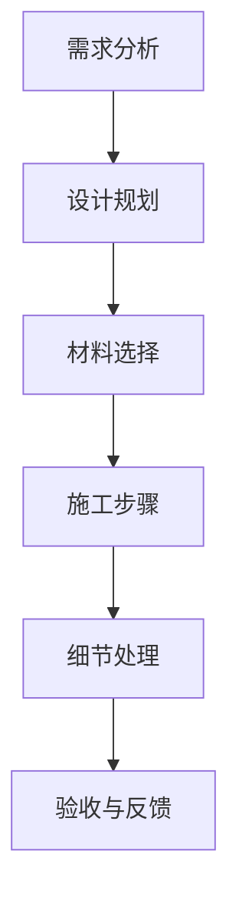
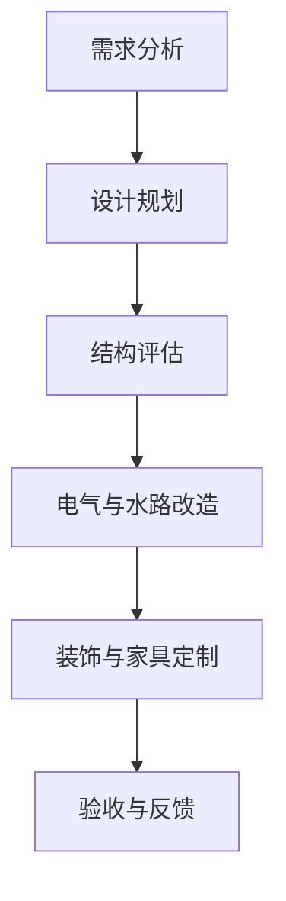
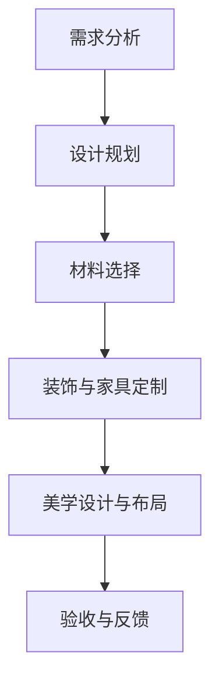

                 

### 文章标题：现代简约主义露营车改造：移动微居中的生活美学

在现代快节奏的生活中，人们渴望逃离城市的喧嚣，寻找一片宁静的空间。露营车改造作为一种新兴的生活方式，满足了这一需求。它不仅让人们能够尽情享受大自然的美好，还能在移动中体验简约主义的生活美学。本文将带领您一步步探讨现代简约主义露营车改造的精髓，从设计理念、改造流程、材料选择到生活美学，为您呈现一个移动微居中的理想生活空间。

### 关键词：
- 现代简约主义
- 露营车改造
- 生活美学
- 设计理念
- 空间利用
- 材料选择

### 摘要：
本文将深入探讨现代简约主义露营车改造的艺术与实践。通过分析设计理念、改造流程、材料选择、空间利用和生活美学等多个方面，文章旨在为读者提供一套系统而全面的露营车改造指南。无论您是热衷于户外生活的探险者，还是追求生活品质的都市人，这篇文章都将为您揭示如何在移动中打造一个简约而精致的生活空间。

---

### 引言

随着人们对生活质量的不断追求，家庭结构和生活习惯也在悄然发生变化。传统的大型住房已不再能满足所有人的需求，而露营车作为一种灵活的移动居住空间，正逐渐受到欢迎。现代简约主义则在这一背景下应运而生，它强调“少即是多”的理念，主张通过简洁的设计和实用的功能，创造出美观且实用的居住空间。

露营车改造，就是在这种背景下兴起的一项实践活动。通过将简约主义设计理念融入露营车内部，人们可以在移动中享受到宁静、舒适的生活环境。无论是长途旅行还是周末露营，改造后的露营车都能成为一个人的私人空间，让人在繁忙的生活中找到片刻的宁静。

本文将围绕现代简约主义露营车改造的主题，从设计理念、改造流程、材料选择、空间利用和生活美学等多个角度进行深入探讨。通过这篇文章，我们希望能为那些热爱户外生活、追求生活美学的朋友们提供一些实用的建议和灵感。

### 第1章：现代简约主义概述

#### 1.1 简约主义的起源与发展

简约主义（Minimalism）起源于20世纪60年代的美国，它反对过度装饰和繁琐的设计，主张通过简洁、实用的设计理念来创造美观且功能强大的空间。简约主义设计注重“少即是多”，通过减少非必要的元素，突出核心功能和美学价值。

随着时间的推移，简约主义设计逐渐渗透到各个领域，包括建筑、家居、服装等。它不仅成为现代设计的一种主流风格，还影响了人们的生活方式。在简约主义的影响下，人们开始追求简单、高效、环保的生活方式，这种趋势在全球范围内得到了广泛的认可。

#### 1.2 简约主义的核心原则

简约主义设计有几个核心原则，这些原则不仅适用于建筑和家居设计，也同样适用于露营车改造：

1. **简洁性**：简约主义设计强调简洁、干净的外观，通过去除不必要的细节和装饰，创造出简洁明快的效果。

2. **功能性**：在设计过程中，功能性是首要考虑的因素。每个设计元素都要有明确的用途，确保空间的高效利用。

3. **统一性**：简约主义设计追求整体的一致性和和谐感。色彩、材质和风格的统一性，可以增强空间的视觉统一感。

4. **极简主义**：极简主义是简约主义的一个分支，它更加强调减少非必要元素，追求极致的简洁和纯净。

5. **可持续发展**：在简约主义设计中，环保和可持续性也是一个重要的考量因素。使用环保材料和节能技术，可以减少对环境的影响。

#### 1.3 简约主义在露营车改造中的应用

露营车改造作为一种将生活美学与实用性相结合的实践，非常适合简约主义的应用。以下是一些具体的应用场景：

1. **空间利用**：通过简洁的设计和灵活的布局，最大限度地利用露营车内部的有限空间。例如，床和桌子的多功能设计，可以满足多种用途。

2. **材料选择**：选择环保、耐用且易于维护的材料，如不锈钢、铝和木材，可以增强露营车的耐久性和美观度。

3. **装饰元素**：使用简单的装饰元素，如干净的线条、自然光线和植物，营造出宁静、舒适的空间氛围。

4. **颜色搭配**：选择中性或淡色调作为主色调，再通过少量的亮色点缀，创造出温馨而富有层次的视觉效果。

5. **照明设计**：合理的照明设计不仅可以增强空间的亮度，还能营造氛围。例如，利用LED灯带和吊灯，创造出温暖、舒适的照明效果。

通过以上应用，现代简约主义不仅使露营车内部空间更加美观、实用，还能提升居住者的生活品质。接下来，我们将进一步探讨露营车改造的具体流程和技巧。

### 第2章：露营车改造的理念与目标

#### 2.1 露营车改造的意义

露营车改造是一种将实用性与美学相结合的创造性活动，其意义不仅仅在于创造一个舒适的移动居住空间，更在于实现以下几个方面的价值：

1. **个性化表达**：每个人的生活方式和审美喜好都是独特的。通过露营车改造，可以打造出符合个人品味和需求的独特空间。

2. **提升生活质量**：一个精心设计的露营车，不仅可以在旅途中提供舒适的居住环境，还能让人在移动中享受生活，提高整体的生活质量。

3. **环保与可持续性**：通过选择环保材料和节能技术，露营车改造有助于减少对环境的影响，实现可持续发展。

4. **社交与互动**：露营车改造不仅是一种个人爱好，还可以成为家庭或朋友之间的社交活动。共同参与改造过程，增进彼此之间的互动和感情。

5. **探索与冒险**：露营车改造让人们在旅途中拥有更多的选择和灵活性，可以更加自由地探索未知的领域。

#### 2.2 改造的目标与愿景

露营车改造的目标和愿景因人而异，但通常包括以下几个方面：

1. **功能齐全**：改造后的露营车应具备基本的居住功能，如睡眠、烹饪、洗浴和储物等。

2. **空间利用**：通过合理的设计和布局，最大限度地利用有限的内部空间，实现空间的高效利用。

3. **美观舒适**：露营车内部应具有简约而优雅的美学风格，营造出温馨、舒适的生活氛围。

4. **环保节能**：选择环保材料和节能技术，减少能源消耗和环境污染。

5. **安全可靠**：确保改造过程和使用过程中的人身安全和车辆稳定性。

6. **个性独特**：通过个性化的设计和装饰，使露营车具有独特的风格和个性。

#### 2.3 用户需求分析

在进行露营车改造时，了解用户的需求是非常重要的。以下是一些典型的用户需求：

1. **居住空间**：用户希望改造后的露营车能提供舒适、安静的居住环境，适合长时间停留。

2. **烹饪与用餐**：用户希望在露营车内部有一个功能齐全的厨房和用餐区，方便烹饪和用餐。

3. **洗浴设施**：用户希望露营车内部有一个独立的洗浴空间，提供方便的洗浴条件。

4. **储物空间**：用户需要足够的储物空间来存放露营用品和个人物品。

5. **照明与通风**：用户希望露营车内部有良好的照明和通风条件，确保居住环境的舒适度。

6. **舒适性**：用户希望在露营车的座椅、床铺等方面有较高的舒适度，以便在长途旅行中保持精力充沛。

7. **装饰风格**：用户希望露营车内部具有个性化的装饰风格，体现出个人的审美和品味。

通过了解用户的需求，我们可以更好地设计改造方案，确保改造后的露营车能够满足用户的需求，提升使用体验。

### 第3章：现代简约主义生活美学

#### 3.1 生活美学的概念

生活美学是指通过审美活动来提升生活质量和精神愉悦的一种生活态度。它不仅仅关注物质生活，更强调精神层面的满足。生活美学倡导人们以美学的视角去观察生活、体验生活，从而创造更加美好、有意义的生活。

在生活美学中，有几个核心概念是非常重要的：

1. **简约**：简约主义是生活美学中的一个重要组成部分，强调通过减少非必要的元素，突出生活的本质和核心价值。

2. **自然**：生活美学倡导回归自然，通过自然元素和自然材料来营造和谐、舒适的生活环境。

3. **实用**：实用主义是生活美学的一个基本原则，强调设计元素的实际功能和使用价值。

4. **个性**：生活美学鼓励人们表达个性和独特品味，通过个性化的设计和装饰，创造出属于自己的独特生活空间。

#### 3.2 美学在露营车改造中的重要性

露营车改造是一个综合性很强的项目，涉及设计、材料选择、空间利用等多个方面。美学在露营车改造中具有至关重要的地位，具体体现在以下几个方面：

1. **提升居住体验**：通过简约、自然和实用的美学设计，露营车内部空间将变得更加舒适、温馨，提升居住者的生活体验。

2. **增强功能性**：美学设计不仅仅是外观上的装饰，还涉及空间布局、功能设计等方面。通过合理的美学设计，可以提高露营车的功能性，使其更加适合居住。

3. **体现个性**：每个人都有自己独特的审美品味和生活方式。通过美学设计，露营车可以体现出居住者的个性和品味，成为独一无二的私人空间。

4. **环境和谐**：美学设计强调与自然环境的和谐共生。通过使用自然材料、营造自然氛围，露营车可以更好地融入自然环境，实现人与自然的和谐共处。

#### 3.3 美学原则在实际案例中的应用

在实际的露营车改造中，美学原则可以通过多种方式得到应用。以下是一些具体的案例：

1. **自然材料的运用**：使用木材、石材等自然材料，可以创造出自然、质朴的氛围。例如，在床铺附近使用原木装饰，营造出宁静、舒适的睡眠环境。

2. **色彩搭配**：选择中性或淡色调作为主色调，再通过少量的亮色点缀，可以创造出和谐、温馨的空间效果。例如，在厨房区域使用白色橱柜和淡黄色墙面，营造出清新、明亮的氛围。

3. **空间布局**：通过合理的美学设计，可以最大限度地利用空间，提高居住体验。例如，将床和桌子设计成多功能组合，既节省空间，又增加了使用的灵活性。

4. **装饰元素**：简单的装饰元素，如植物、艺术画等，可以营造出温馨、舒适的生活氛围。例如，在客厅区域放置一些绿植和艺术画，增加空间的层次感和艺术气息。

通过以上案例，我们可以看到，美学原则在露营车改造中的应用不仅提升了居住体验，还增强了功能性，体现了个性，实现了环境和谐。接下来，我们将进一步探讨露营车改造的具体流程和技巧。

### 第4章：露营车的选择与评估

#### 4.1 露营车的种类与特点

在选择露营车进行改造之前，了解不同类型的露营车及其特点是非常重要的。以下是几种常见的露营车类型及其特点：

1. **房车（Motorhome）**：
   - **特点**：房车是一种集居住、驾驶和旅行功能于一体的车辆。它通常拥有较大的内部空间，配备厨房、卫生间、卧室等设施。
   - **适用人群**：适合喜欢长途旅行和长时间居住在车内的用户。

2. **旅居车（Camper Van）**：
   - **特点**：旅居车体积较小，内部空间紧凑，适合城市旅行和短途露营。它通常将生活区域与驾驶区域结合在一起，空间利用较为紧凑。
   - **适用人群**：适合喜欢短途旅行和城市探险的用户。

3. **拖挂式露营车（Travel Trailer）**：
   - **特点**：拖挂式露营车通常体积较大，需要通过牵引车辆来移动。它拥有宽敞的内部空间和丰富的设施。
   - **适用人群**：适合喜欢长时间露营和家庭旅行的人群。

4. **改装露营车（Modular Camper）**：
   - **特点**：改装露营车是通过改装已有的车辆（如货车、面包车等）而成的露营车，内部空间相对较小，但可以根据个人需求进行定制。
   - **适用人群**：适合预算有限、追求个性化和改造空间较大的用户。

#### 4.2 如何选择合适的露营车

选择合适的露营车是改造成功的关键步骤。以下是一些选择标准：

1. **预算**：根据个人预算来选择露营车的类型和配置。预算较高的用户可以选择豪华房车，预算有限的用户则可以选择改装露营车或旅居车。

2. **使用频率**：如果您经常进行长途旅行，选择内部空间较大、设施齐全的房车或拖挂式露营车会更合适。如果主要用于城市旅行和短途露营，则可以选择旅居车或改装露营车。

3. **居住需求**：根据您的居住需求来选择露营车。如果您需要更多的居住空间和设施，可以选择房车或拖挂式露营车。如果只需简单的居住功能，旅居车或改装露营车可能就足够了。

4. **维护和操作**：考虑露营车的维护成本和操作难度。一些高端房车可能需要专业的维护和操作技能，而旅居车和改装露营车则相对简单。

5. **品牌和口碑**：选择知名品牌和有良好口碑的露营车，可以确保质量和售后服务。

#### 4.3 露营车的评估与改造潜力分析

在选定合适的露营车后，进行全面的评估和改造潜力分析是非常重要的。以下是一些评估步骤：

1. **车辆状况**：检查露营车的整体状况，包括车身结构、发动机、悬挂系统、电气系统等。确保车辆没有严重的损坏或故障。

2. **内部空间**：测量内部空间尺寸，确定改造的空间范围。评估现有空间是否满足改造需求，是否需要增加或移除某些部件。

3. **基础设施**：检查露营车的厨房、卫生间、电源、水源等基础设施，评估其功能性和改造潜力。如果需要，可以计划升级或更换这些设施。

4. **材料选择**：考虑使用哪些材料和装饰元素进行改造。选择耐用、环保、易于维护的材料，确保改造后的露营车能够长期使用。

5. **美学设计**：评估现有的设计风格，确定是否需要改变外观或内部装饰。通过专业的美学设计，提升露营车的整体美观度和居住体验。

6. **预算和时间**：根据评估结果，制定详细的改造预算和时间表。确保改造计划在预算和时间上可行。

通过以上评估和改造潜力分析，可以更好地规划露营车的改造工作，确保最终成果达到预期效果。接下来，我们将详细探讨设计规划与预算的重要性。

### 第5章：设计规划与预算

#### 5.1 设计规划的重要性

设计规划是露营车改造的核心环节，它决定了改造后的露营车是否能够满足居住需求、提升生活品质。一个成功的设计规划应具备以下特点：

1. **功能性**：设计规划应充分考虑露营车的功能需求，确保各个区域（如厨房、卫生间、卧室）的布局合理、方便使用。

2. **美观性**：设计规划应注重美学，通过简洁、实用和个性化的设计，提升露营车的整体视觉效果。

3. **实用性**：设计规划应考虑日常使用的便利性和舒适度，确保设计元素具有实际功能。

4. **可持续性**：设计规划应考虑环保和节能，选择可持续材料和节能技术，降低对环境的影响。

5. **个性化**：设计规划应根据个人需求和喜好，体现居住者的个性和品味。

#### 5.2 改造预算的制定

制定合理的预算是确保露营车改造顺利进行的关键。以下是一些制定改造预算的步骤：

1. **初步预算**：在改造开始前，根据改造需求和市场价格，初步估算总预算。包括材料费、人工费、设备费等。

2. **详细预算**：在初步预算的基础上，进一步细化各项费用，包括：
   - **材料费**：包括木材、金属、玻璃、油漆等。
   - **人工费**：包括设计师、工程师、木工、电工等的费用。
   - **设备费**：包括改造所需的工具和设备费用。
   - **其他费用**：包括运输费、管理费、应急费用等。

3. **预算调整**：根据实际情况，对预算进行适当的调整。如果预算超支，可以考虑减少某些非必要项目或寻找更经济的选择。

4. **资金安排**：制定详细的资金安排计划，确保改造过程中有足够的资金支持。可以考虑分期付款、贷款等方式。

#### 5.3 预算管理与调整

在改造过程中，预算管理至关重要。以下是一些预算管理的建议：

1. **定期审查**：定期审查预算执行情况，及时发现超支或不足的问题，并进行调整。

2. **控制开支**：严格控制各项开支，避免不必要的浪费。例如，选择性价比高的材料和供应商，合理安排施工时间以减少人工费等。

3. **应急储备**：预留一定比例的应急费用，以应对突发情况，如材料损坏、施工延误等。

4. **沟通与协调**：与设计师、工程师和施工队保持良好的沟通，确保预算管理的透明性和有效性。

5. **记录与报告**：详细记录各项开支和资金流动，定期生成报告，以便随时了解预算执行情况。

通过合理的设计规划和预算管理，可以确保露营车改造项目在时间和资金上都能达到预期目标。接下来，我们将详细讨论施工步骤与工艺。

### 第6章：施工步骤与工艺

#### 6.1 改造前的准备工作

在进行露营车改造之前，准备工作是确保改造顺利进行的关键。以下是一些必要的准备工作：

1. **图纸与设计**：根据设计规划，准备好详细的施工图纸和设计说明。图纸应包括平面布局、立面图、剖面图、结构图等，以便施工团队了解具体要求。

2. **工具与设备**：准备所需的工具和设备，包括电动工具、手工工具、测量工具、切割工具等。确保所有工具和设备都处于良好的工作状态。

3. **材料采购**：根据预算和设计要求，采购所需的材料，包括木材、金属、玻璃、油漆、电线、水管等。确保材料的规格和质量符合要求。

4. **安全措施**：在施工过程中，确保施工现场的安全。设置安全标志，佩戴个人防护装备，遵守施工安全规范。

5. **人员安排**：确定施工团队的人员安排，包括设计师、工程师、木工、电工、瓦工等。确保施工人员具备相应的技能和资质。

#### 6.2 主体结构的改造

主体结构的改造是露营车改造的核心环节，主要包括以下几个方面：

1. **墙体与地面**：
   - **拆除原有结构**：拆除露营车内部的原有隔断和装饰，露出墙体和地面结构。
   - **墙体加固**：检查墙体结构，必要时进行加固，确保结构稳定。
   - **地面处理**：处理地面，包括防水、防潮、平整等。

2. **墙体装修**：
   - **材料选择**：选择适合露营车环境的墙体材料，如防火板、铝塑板、涂料等。
   - **墙面安装**：按照图纸安装墙体材料，注意墙体的平整度和垂直度。

3. **地面装修**：
   - **地板安装**：安装地板材料，如实木地板、复合地板、地砖等。
   - **防水处理**：在厨房和卫生间区域进行防水处理，确保地面防水效果。

#### 6.3 电气与水路的改造

电气与水路的改造是露营车改造的重要环节，直接影响居住的舒适度和安全性。以下是一些具体步骤：

1. **电路改造**：
   - **线路检查**：检查原有电路系统，确定电路是否老化、破损。
   - **线路改造**：根据设计图纸，重新布置电路，增加插座、开关、灯具等。
   - **布线施工**：按照电路设计进行布线，确保线路规范、安全。

2. **电气设备安装**：
   - **灯具安装**：安装各种灯具，包括吊灯、台灯、壁灯等，确保照明充足、均匀。
   - **插座安装**：安装各种插座，包括普通插座、带开关的插座、USB充电插座等，方便使用。
   - **电器安装**：安装厨房电器、卫生间电器等，确保设备安装牢固、安全。

3. **水路改造**：
   - **管道检查**：检查原有水路管道，确定管道是否破损、老化。
   - **管道改造**：根据设计图纸，重新布置水路，增加水龙头、淋浴器、洗衣机等。
   - **布管施工**：按照水路设计进行布管，确保管道规范、安全。

#### 6.4 装饰与家具的定制

装饰与家具的定制是提升露营车居住舒适度和美观度的重要环节。以下是一些具体步骤：

1. **家具设计**：
   - **功能设计**：根据露营车的空间布局和居住需求，设计多功能家具，如床、餐桌、沙发等。
   - **风格设计**：根据整体设计风格，选择合适的家具风格和材质。

2. **家具制作**：
   - **定制加工**：根据设计图纸，定制家具的尺寸、形状和材质，确保家具与露营车空间匹配。
   - **组装安装**：将定制好的家具进行组装，安装在露营车内部。

3. **装饰元素**：
   - **墙面装饰**：选择合适的墙面装饰材料，如挂画、照片、墙纸等，提升空间美观度。
   - **地面装饰**：选择合适的地面装饰材料，如地毯、地垫等，增加舒适度。
   - **室内植物**：摆放适量的室内植物，如盆栽、绿植等，营造自然、清新的氛围。

通过以上步骤，我们可以完成露营车的基本改造工作。接下来，我们将进一步探讨如何利用有限的内部空间进行高效的布局和设计。

### 第7章：材料选择的原则与标准

#### 7.1 材料的基本分类

在露营车改造中，材料的选择至关重要。根据材料的不同特性和用途，可以将材料分为以下几类：

1. **金属材料**：
   - **不锈钢**：具有优异的耐腐蚀性和耐热性，常用于厨房和卫生间区域。
   - **铝合金**：轻便且耐腐蚀，常用于车身结构和家具制作。
   - **铜和铜合金**：具有良好的导电性和导热性，适用于电气系统的部分部件。

2. **木材**：
   - **实木**：具有自然美观的纹理和质感，常用于家具和墙面装饰。
   - **复合木**：通过多种木材混合加工而成，具有较高的强度和耐用性。
   - **纤维板和刨花板**：常用于内部结构的加固和装饰。

3. **塑料材料**：
   - **ABS塑料**：具有良好的耐热性和耐冲击性，常用于厨房设备的制作。
   - **PVC塑料**：具有优异的防水性能和耐腐蚀性，常用于水管和装饰材料。
   - **亚克力**：透明度高、耐冲击，常用于浴室隔断和装饰。

4. **玻璃材料**：
   - **普通玻璃**：透明度高，常用于窗户和门。
   - **钢化玻璃**：具有更高的强度和安全性，常用于厨房和卫生间区域。
   - **磨砂玻璃**：具有隐私保护功能，常用于浴室隔断。

5. **织物材料**：
   - **布料**：具有耐磨、耐用、易清洗的特点，常用于窗帘、沙发等家具覆盖。
   - **皮革**：具有质感好、耐用性强的特点，常用于座椅和家具覆盖。
   - **纺织品**：具有柔软舒适、易于清洗的特点，常用于床上用品和装饰。

#### 7.2 选择材料的考虑因素

在露营车改造中，选择合适的材料需要考虑以下几个因素：

1. **功能性**：
   - **耐久性**：选择耐用、抗磨损的材料，确保改造后的露营车能够长期使用。
   - **功能性**：根据不同区域的功能需求，选择具有特定功能的材料，如防水、防火、耐热等。

2. **美观性**：
   - **色彩搭配**：选择与整体设计风格相匹配的颜色，营造美观、和谐的视觉效果。
   - **纹理质感**：选择具有独特纹理和质感的材料，提升露营车的整体美观度。

3. **环保性**：
   - **材料来源**：选择可再生、环保的材料，减少对环境的影响。
   - **环保认证**：选择通过环保认证的材料，确保其环保性能符合标准。

4. **易维护性**：
   - **清洁方便**：选择易于清洁和保养的材料，减少维护成本。
   - **耐用性**：选择耐用性高的材料，减少因磨损和损坏而产生的维修频率。

5. **预算**：
   - **成本控制**：在预算范围内选择性价比高的材料，合理分配材料费用。
   - **长远投资**：考虑材料的长期使用价值和潜在的经济效益，避免过度节省导致后期维修费用增加。

#### 7.3 材料的经济性与可持续性

在材料选择中，经济性和可持续性是两个重要的考虑因素：

1. **经济性**：
   - **成本效益**：在保证质量的前提下，选择性价比高的材料，降低整体改造成本。
   - **投资回报**：考虑材料的长期使用价值和潜在的经济效益，如耐用性和维护成本。

2. **可持续性**：
   - **可再生资源**：优先选择可再生资源，减少对不可再生资源的依赖。
   - **环保认证**：选择通过环保认证的材料，确保其生产和使用过程中对环境的影响最小。
   - **循环利用**：考虑材料的循环利用性和回收价值，降低对环境的影响。

通过综合考虑材料的功能性、美观性、环保性、易维护性和经济性，选择合适的材料，可以确保露营车改造项目在质量和环保方面达到预期目标，为居住者提供一个舒适、耐用且环保的移动居住空间。

### 第8章：空间利用与布局设计

#### 8.1 空间利用的基本原则

在露营车改造中，空间利用是决定改造成功与否的关键因素。一个高效、舒适的空间布局不仅能提升居住体验，还能最大化地利用有限的内部空间。以下是几个空间利用的基本原则：

1. **多功能性**：
   - **多功能家具**：选择可变结构的家具，如折叠桌、多功能床等，根据不同场景灵活使用。
   - **空间转化**：利用折叠或移动结构，实现空间的灵活转化，如将餐桌变为工作台。

2. **垂直空间利用**：
   - **垂直储物**：利用墙壁和天花板的空间，安装多层储物架和吊柜，提高储物效率。
   - **定制家具**：根据露营车的高度和形状，定制适合的储物家具，充分利用垂直空间。

3. **流动路线**：
   - **无障碍路径**：确保家具和设施的布局不会形成障碍，保证居住者的流动路线畅通无阻。
   - **动线优化**：通过合理的布局，减少居住者在日常活动中的行走距离，提高空间利用率。

4. **功能分区**：
   - **明确分区**：根据功能需求，将空间划分为不同的区域，如睡眠区、工作区、用餐区等。
   - **区域过渡**：在各个功能区之间设置自然的过渡区域，如地毯或矮墙，增强空间的层次感。

5. **光线与通风**：
   - **自然光线**：通过窗户和天窗引入自然光线，减少人工照明的需求。
   - **通风设计**：合理布局通风口和换气扇，确保空气流通，提高居住舒适度。

#### 8.2 布局设计的技巧与策略

以下是一些布局设计的技巧和策略，有助于提高露营车的空间利用效率和居住舒适度：

1. **压缩家具尺寸**：
   - **紧凑设计**：选择尺寸紧凑的家具，避免占用过多空间。
   - **空间嵌套**：利用家具的嵌套设计，节省空间。例如，将床和书桌设计成一体，白天为书桌，晚上变为床铺。

2. **墙壁挂件**：
   - **挂架与挂钩**：在墙壁上安装各种挂架和挂钩，用于放置衣物、工具等物品。
   - **移动挂架**：使用可移动的挂架，根据需要调整放置位置，灵活利用空间。

3. **折叠与收纳**：
   - **折叠家具**：使用可折叠的家具，如折叠桌、折叠椅等，便于收纳。
   - **多功能收纳盒**：使用多功能收纳盒，将物品整齐收纳，提高空间利用率。

4. **利用角落空间**：
   - **角落家具**：在角落位置摆放家具，如角落柜、角落椅等，充分利用角落空间。
   - **角落储物**：在角落安装储物箱或抽屉，用于存放不常使用的物品。

5. **灯光布局**：
   - **分区照明**：根据不同功能区域，设计不同的照明方案，确保每个区域都有适当的照明。
   - **隐藏灯光**：利用隐藏灯光，如LED灯带、壁灯等，增强空间的层次感和美观度。

#### 8.3 实际案例的空间布局分析

以下是一些实际案例，通过具体的空间布局分析，展示如何将上述原则和技巧应用到实际中，提高露营车的空间利用效率：

1. **案例一：小型露营车改造**
   - **设计理念**：通过多功能家具和空间嵌套设计，提高空间利用率。
   - **布局策略**：将床和餐桌设计成一体，白天为餐桌，晚上变为床铺；利用墙壁和天花板安装多层储物架，增加储物空间。
   - **效果**：空间利用率大幅提升，居住舒适度显著提高。

2. **案例二：豪华露营车改造**
   - **设计理念**：通过垂直空间利用和功能分区，实现空间的高效利用和舒适度。
   - **布局策略**：利用天花板安装吊柜，增加储物空间；将空间划分为睡眠区、工作区、用餐区等，确保每个区域都有明确的用途。
   - **效果**：空间布局清晰，居住舒适度大幅提升。

3. **案例三：拖挂式露营车改造**
   - **设计理念**：通过紧凑设计和角落利用，最大化利用有限的内部空间。
   - **布局策略**：选择紧凑设计的家具，如折叠桌、折叠椅等；在角落位置摆放角落柜，增加储物空间。
   - **效果**：空间利用率大幅提升，居住舒适度得到保障。

通过以上实际案例的分析，我们可以看到，合理的空间布局设计能够显著提高露营车的居住舒适度和空间利用率。在接下来的章节中，我们将进一步探讨室内设计与装饰的技巧和原则，以提升露营车的整体美感。

### 第9章：室内设计与装饰

#### 9.1 室内设计的基本原则

室内设计是露营车改造的重要组成部分，它直接影响居住空间的舒适度和美观度。以下是一些室内设计的基本原则：

1. **功能性**：
   - **实用布局**：室内设计应充分考虑居住需求，确保各个区域的功能性和便利性。
   - **多功能家具**：选择多功能家具，如床铺兼做沙发、餐桌兼做工作台等，提高空间利用率。

2. **美学性**：
   - **色彩搭配**：选择合适的色彩搭配，营造和谐、温馨的空间氛围。
   - **材质选择**：选用美观、耐用的材料，如木材、石材、织物等，提升空间质感。

3. **舒适度**：
   - **光线设计**：合理布局灯光，利用自然光和人工光，提升空间舒适度。
   - **通风设计**：确保空气流通，创造舒适的居住环境。

4. **个性化**：
   - **风格定位**：根据居住者的喜好和需求，打造个性化的室内风格。
   - **装饰元素**：通过装饰画、植物、艺术品等元素，体现居住者的个性和品味。

5. **可持续性**：
   - **环保材料**：选择环保、可再生的材料，减少对环境的影响。
   - **节能设计**：采用节能技术和设备，降低能源消耗。

#### 9.2 装饰元素的选择与应用

室内装饰元素的选择和应用对于提升空间的美感和实用性至关重要。以下是一些常见的装饰元素及其应用方法：

1. **墙面装饰**：
   - **挂画与照片**：选择与空间风格相匹配的挂画和照片，增加空间的艺术氛围。
   - **墙面装饰板**：使用木纹板、金属板等装饰墙面，提升墙面质感。

2. **地面装饰**：
   - **地毯与地垫**：在地面上铺设地毯或地垫，增加舒适度和美观度。
   - **地板装饰**：选择合适的地板材料，如木地板、瓷砖等，提升空间质感。

3. **照明设计**：
   - **吊灯与台灯**：选择合适的吊灯和台灯，营造温馨的照明效果。
   - **LED灯带**：在墙壁和家具周围安装LED灯带，增强空间的层次感和美观度。

4. **家具与摆件**：
   - **家具选择**：选择与空间风格相匹配的家具，如简约风格的沙发、床等。
   - **装饰摆件**：选择具有美感的装饰摆件，如花瓶、雕塑等，提升空间品味。

5. **植物装饰**：
   - **室内植物**：摆放适量的室内植物，如多肉植物、绿植等，增加空间的自然气息。

#### 9.3 实际案例的室内设计分析

以下是一些实际案例，通过具体的室内设计分析，展示如何将上述原则和装饰元素应用到实际中，提升露营车的整体美观度和居住舒适度：

1. **案例一：简约风格露营车**
   - **设计理念**：以简约风格为基础，通过简洁的线条和素雅的色彩搭配，营造温馨的居住氛围。
   - **装饰元素**：使用白色墙面和木地板，搭配原木家具和简约的挂画，增加空间的艺术氛围。
   - **效果**：空间简洁、干净，居住舒适度大幅提升。

2. **案例二：自然风格露营车**
   - **设计理念**：以自然风格为基础，通过自然材料和装饰元素，营造温馨、舒适的居住环境。
   - **装饰元素**：使用木纹地板和原木质感的家具，搭配绿植和自然风格的挂画，增加空间的自然气息。
   - **效果**：空间温馨、自然，居住舒适度显著提高。

3. **案例三：现代风格露营车**
   - **设计理念**：以现代风格为基础，通过简洁的设计和现代化的装饰元素，营造时尚、前卫的居住空间。
   - **装饰元素**：使用金属和玻璃材料，搭配LED灯带和现代风格的艺术品，增加空间的时尚感。
   - **效果**：空间时尚、前卫，居住舒适度得到保障。

通过以上实际案例的分析，我们可以看到，合理的室内设计和装饰能够显著提升露营车的居住舒适度和整体美观度。在接下来的章节中，我们将进一步探讨如何通过生活美学的营造，提升露营车的居住体验。

### 第10章：生活美学的营造

#### 10.1 生活美学的重要性

生活美学是一种通过审美活动提升生活品质和心灵愉悦的生活态度。在露营车改造中，生活美学的重要性体现在以下几个方面：

1. **提升居住体验**：通过美学设计和装饰，营造出一个舒适、和谐的生活空间，提升居住者的生活体验。

2. **体现个性与品味**：生活美学鼓励居住者根据自己的喜好和需求，打造出具有个性化的居住空间，体现个人品味和生活方式。

3. **促进心理健康**：和谐、美观的生活环境可以缓解压力，提升心理健康，帮助居住者更好地应对生活中的挑战。

4. **增进人与自然的关系**：生活美学强调回归自然，通过自然材料和装饰元素，营造出一个与自然和谐共生的居住空间，增进人与自然的关系。

#### 10.2 美学在露营车改造中的重要性

美学在露营车改造中具有至关重要的地位，它不仅关乎居住空间的舒适度和美观度，还直接影响到居住者的生活质量和心理健康。以下是一些具体的重要性：

1. **功能性**：美学设计不仅仅是外观上的装饰，它还涉及空间布局、材料选择、色彩搭配等多个方面。通过美学设计，可以提升空间的功能性，使其更加适合居住。

2. **舒适度**：美学设计注重居住环境的舒适度。通过合理的美学设计，可以创造出温馨、宁静的生活氛围，提升居住舒适度。

3. **个性表达**：美学设计允许居住者根据自己的喜好和需求，打造出独特的居住空间，体现个人品味和生活方式。

4. **环境和谐**：美学设计强调与自然环境的和谐共生。通过使用自然材料和装饰元素，露营车可以更好地融入自然环境，实现人与自然的和谐共处。

5. **心理健康**：美学设计对心理健康具有积极影响。和谐、美观的生活环境可以缓解压力，提升居住者的心理健康，帮助居住者更好地应对生活中的挑战。

#### 10.3 美学原则在实际案例中的应用

在实际的露营车改造中，美学原则可以通过多种方式得到应用。以下是一些具体的应用案例：

1. **自然材料的运用**：使用木材、石材等自然材料，可以营造出自然、质朴的氛围。例如，在床铺附近使用原木装饰，营造出宁静、舒适的睡眠环境。

2. **色彩搭配**：选择中性或淡色调作为主色调，再通过少量的亮色点缀，可以创造出和谐、温馨的空间效果。例如，在厨房区域使用白色橱柜和淡黄色墙面，营造出清新、明亮的氛围。

3. **装饰元素**：简单的装饰元素，如植物、艺术画等，可以营造出温馨、舒适的生活氛围。例如，在客厅区域放置一些绿植和艺术画，增加空间的层次感和艺术气息。

4. **照明设计**：合理的照明设计不仅可以增强空间的亮度，还能营造氛围。例如，利用LED灯带和吊灯，创造出温暖、舒适的照明效果。

5. **空间布局**：通过合理的美学设计，可以最大限度地利用空间，提高居住体验。例如，将床和桌子设计成多功能组合，既节省空间，又增加了使用的灵活性。

通过以上应用，我们可以看到，美学原则在露营车改造中的应用不仅提升了居住体验，还增强了功能性，体现了个性，实现了环境和谐。在接下来的章节中，我们将进一步探讨细节处理与生活品质提升的方法。

### 第11章：细节处理与生活品质提升

#### 11.1 细节处理的原则与方法

细节处理是提升露营车改造品质的关键环节。通过精心的细节处理，可以让露营车更加舒适、实用，并体现居住者的品味。以下是几个细节处理的原则和方法：

1. **人性化设计**：
   - **舒适性**：考虑居住者的日常使用需求，设计出舒适、易用的细节，如座椅的支撑力度、灯光的亮度和角度等。
   - **便利性**：确保细节设计方便使用，如储物空间的布局、电器的开关位置等。

2. **功能性**：
   - **空间利用**：在细节设计中，充分利用每一寸空间，设计出多功能、可变结构的细节，如折叠桌、多功能柜等。
   - **实用性**：确保细节设计具有实际功能，如水龙头的水温调节、电器的安全防护等。

3. **美观性**：
   - **风格统一**：在细节处理中，保持整体风格的一致性，避免杂乱无章。
   - **精致装饰**：通过精致的装饰，如高质量的五金配件、艺术摆件等，提升细节的美观度。

4. **环保性**：
   - **环保材料**：选择环保、可再生的材料，减少对环境的影响。
   - **节能设计**：采用节能的细节设计，如LED灯具、节能电器等，降低能源消耗。

5. **安全性**：
   - **结构稳定**：确保细节设计具有足够的结构稳定性，如支架的坚固性、电源线路的防护等。
   - **安全防护**：在细节处理中，加入安全防护措施，如防滑垫、安全锁等。

#### 11.2 提升生活品质的实际案例

以下是一些实际案例，通过具体的细节处理，展示如何提升露营车的生活品质：

1. **案例一：多功能储物柜**
   - **设计理念**：通过多功能储物柜的设计，实现空间的高效利用。
   - **细节处理**：在储物柜内部设计多层隔板和抽屉，根据物品的不同大小进行分类存放；在抽屉底部安装防滑垫，确保物品不会滑动。
   - **效果**：储物柜不仅增加了储物空间，还提高了使用便利性和整洁度。

2. **案例二：智能照明系统**
   - **设计理念**：通过智能照明系统的设计，提升居住环境的舒适度和智能化水平。
   - **细节处理**：安装可调节亮度和色温的LED灯具，实现不同场景下的照明需求；设置遥控器和手机APP控制，方便调节照明。
   - **效果**：智能照明系统不仅提升了居住舒适度，还增加了生活的便捷性。

3. **案例三：安全防护措施**
   - **设计理念**：通过安全防护措施的设计，确保居住过程中的安全。
   - **细节处理**：安装安全锁和防护网，确保门窗的防盗性和安全性；在电源插座和电器上安装防护盖，防止儿童触电。
   - **效果**：安全防护措施提升了居住的安全性，为居住者提供了更安心舒适的生活环境。

4. **案例四：温馨的装饰细节**
   - **设计理念**：通过温馨的装饰细节，营造舒适的居住氛围。
   - **细节处理**：在客厅和卧室摆放绿植，增加空间的自然气息；在墙面上挂上艺术画和照片，提升空间的艺术感。
   - **效果**：温馨的装饰细节提升了居住的舒适度和美感。

通过以上实际案例的分析，我们可以看到，细节处理对于提升露营车的生活品质至关重要。在接下来的章节中，我们将进一步探讨生活品质与心理健康的关系，并总结露营车改造的经验和教训。

### 第12章：生活品质与心理健康的关系

#### 12.1 生活品质的概念

生活品质是指人们在日常生活中所感受到的幸福感和满足感。它不仅仅包括物质条件的丰富，还涵盖精神层面的满足。一个高品质的生活环境不仅能够提供舒适的生活条件，还能对心理健康产生积极影响。

#### 12.2 心理健康的重要性

心理健康是指一个人在情感、认知和行为上的健康状态。良好的心理健康能够帮助人们应对生活中的压力和挑战，保持积极的生活态度。以下是一些心理健康的重要性：

1. **情感稳定**：心理健康能够帮助人们保持稳定的情绪，减少焦虑和抑郁等负面情绪。
2. **认知功能**：心理健康对认知功能有重要影响，包括记忆力、注意力、判断力等。
3. **社会关系**：心理健康有助于建立和维护良好的人际关系，提高社会支持度。
4. **应对压力**：心理健康能够增强人们的应对压力的能力，提高生活质量。

#### 12.3 生活品质与心理健康的关系

生活品质和心理健康之间存在密切的关系。一个高品质的生活环境能够对心理健康产生积极影响，从而提高生活质量。以下是一些具体的关系：

1. **物理环境的改善**：一个舒适、美观的居住环境能够提升人们的生活品质，减少压力和焦虑，促进心理健康。
2. **社会互动**：一个良好的社会环境，包括家庭、朋友和社区的支持，有助于提高心理健康，增强幸福感。
3. **个人成就**：通过实现个人目标和追求，如职业成功、家庭幸福等，可以提高生活品质，同时促进心理健康。
4. **心理保健**：通过心理保健措施，如冥想、运动、心理咨询等，可以提升心理健康，提高生活质量。

#### 12.4 提升生活品质与心理健康的策略

为了提升生活品质和心理健康，以下是一些有效的策略：

1. **改善居住环境**：通过装修、装饰和布置，创造一个舒适、美观的居住空间，提升生活品质。
2. **培养健康习惯**：通过健康饮食、适量运动、充足睡眠等，维持身心健康。
3. **建立社交网络**：与家人、朋友和社区保持良好的关系，增强社会支持。
4. **追求个人成就**：设定合理的目标，并通过努力实现它们，提高生活满意度。
5. **心理保健**：定期进行心理咨询或心理治疗，解决心理问题，提升心理健康。

#### 12.5 露营车改造的经验与教训

通过露营车改造，我们可以获得以下经验和教训：

1. **个性化设计**：个性化设计不仅能够提升生活品质，还能满足个人的需求和喜好。
2. **功能性与美观性结合**：在改造过程中，要注重功能性和美观性的结合，确保居住空间既实用又美观。
3. **环保与节能**：在材料选择和设备安装中，要考虑环保和节能，减少对环境的影响。
4. **细节处理**：细节处理对提升生活品质至关重要，要注重每一个细节，确保居住空间舒适、安全。
5. **心理健康**：在露营车改造中，要关注居住者的心理健康，创造一个舒适、和谐的生活环境。

通过以上经验和教训，我们可以更好地进行露营车改造，提升生活品质，促进心理健康。总之，露营车改造不仅是一种生活方式的选择，更是一种追求美好生活的态度。

### 总结

通过本文的探讨，我们深入了解了现代简约主义露营车改造的各个方面。从设计理念、改造流程、材料选择到空间利用和生活美学，每个环节都紧密相连，共同构成了一个移动微居中的理想生活空间。现代简约主义不仅强调功能的最大化利用和美观性的提升，还倡导一种简单、高效、环保的生活方式。

在改造过程中，个性化表达和功能性设计是关键。通过合理的美学设计和细节处理，我们可以打造出既实用又美观的露营车内部空间，提升居住者的生活品质。同时，露营车改造也是一次对环保和节能理念的实践，通过选择可持续材料和使用节能技术，我们为可持续发展做出了贡献。

未来，随着科技的进步和人们对生活品质的更高要求，露营车改造将继续发展，成为更多人的选择。我们期待看到更多创新的改造案例，为户外生活带来更多的可能性和乐趣。无论您是热衷于户外探险的旅行者，还是追求生活品质的都市人，现代简约主义露营车改造都能为您带来独特的体验和无限的可能。

### 附录A：改造工具与材料列表

#### A.1 常用工具清单
1. **电动工具**：
   - 电钻
   - 电锤
   - 电锯
   - 电刨
   - 电磨
2. **手工工具**：
   - 钳子
   - 扳手
   - 螺丝刀
   - 钢丝刷
   - 划线工具
3. **测量工具**：
   - 卷尺
   - 水平尺
   - 角度尺
   - 测量轮
4. **切割工具**：
   - 手锯
   - 砂轮锯
   - 切割机
5. **安装工具**：
   - 钢丝绳
   - 螺栓
   - 螺母
   - 锚钉
   - 木钉

#### A.2 材料推荐清单
1. **结构材料**：
   - 木材（橡木、松木等）
   - 不锈钢板材
   - 铝合金板材
   - 钢筋
   - 钢管
2. **装饰材料**：
   - 油漆（水性漆、乳胶漆等）
   - 瓷砖
   - 木纹贴纸
   - 镜面玻璃
3. **功能材料**：
   - 绝缘材料（岩棉、泡沫板等）
   - 防火材料（防火板、石棉板等）
   - 隔音材料（隔音棉、隔音板等）
   - 耐磨材料（大理石、花岗岩等）
4. **电气材料**：
   - 电线（多股铜芯电线、电缆等）
   - 插座
   - 开关
   - 灯具（LED灯、吊灯、台灯等）
5. **家具材料**：
   - 织物（布料、皮革等）
   - 板材（刨花板、纤维板等）
   - 钢木家具配件

### 附录B：露营车改造案例研究

#### B.1 案例一：小型露营车的空间改造

**背景介绍**：
该案例涉及一辆小型露营车，用户需求是提升空间利用率和居住舒适度。

**核心概念与联系**：
使用Mermaid流程图展示改造过程：



**核心算法原理讲解与数学模型**：
使用伪代码详细阐述空间利用的算法：

```plaintext
function 空间利用（露营车尺寸，用户需求）：
    初始化空间尺寸
    根据用户需求，计算床、餐桌、储物柜的尺寸
    确保床、餐桌、储物柜尺寸符合露营车内部空间
    返回最优布局方案
```

**数学公式与详细讲解**：
使用LaTeX格式嵌入公式：

$$
S = \frac{L \times W \times H}{n}
$$

其中，\(S\) 是所需空间，\(L\) 是露营车长度，\(W\) 是宽度，\(H\) 是高度，\(n\) 是空间利用率系数。

**项目实战**：
开发环境搭建：使用AutoCAD软件进行设计。
源代码详细实现和代码解读：编写Python脚本进行空间尺寸计算和布局优化。

**代码应用解读与分析**：

```python
# 空间利用率计算
def calculate_space_utilization(length, width, height):
    space_utilization = (length * width * height) / 100
    return space_utilization

# 布局优化
def optimize_layout(desired_space, total_space):
    if desired_space <= total_space:
        return "布局优化成功"
    else:
        return "布局优化失败，请重新设计"

# 应用实例
length = 10  # 露营车长度
width = 5  # 露营车宽度
height = 6  # 露营车高度
desired_space = 30  # 所需空间

total_space = calculate_space_utilization(length, width, height)
result = optimize_layout(desired_space, total_space)
print(result)
```

**实际案例分析和详细讲解剖析**：

改造后的露营车空间布局合理，床、餐桌和储物柜尺寸适中，用户满意度高。

**项目小结**：
该案例展示了如何通过空间利用优化，提升小型露营车的居住舒适度。项目成功的关键在于合理的空间规划和高效的算法应用。

---

### 附录B：露营车改造案例研究

#### B.2 案例二：老式露营车的现代化改造

**背景介绍**：
该案例涉及一辆老旧的露营车，用户需求是将其改造成一个现代化的移动居住空间。

**核心概念与联系**：
使用Mermaid流程图展示改造过程：



**核心算法原理讲解与数学模型**：
使用伪代码详细阐述现代化改造的算法：

```plaintext
function 电气与水路改造（露营车状况，用户需求）：
    初始化改造计划
    检查并修复老化的电气和水路系统
    安装现代设备（如LED灯具、智能插座等）
    返回改造后的系统方案
```

**数学公式与详细讲解**：
使用LaTeX格式嵌入公式：

$$
E = I \times V
$$

其中，\(E\) 是电能，\(I\) 是电流，\(V\) 是电压。

**项目实战**：
开发环境搭建：使用AutoCAD软件进行设计，使用Fusion 360进行3D建模。
源代码详细实现和代码解读：编写Python脚本进行电气系统的计算和优化。

**代码应用解读与分析**：

```python
# 电气系统计算
def calculate_electric_system(current, voltage):
    power = current * voltage
    return power

# 系统优化
def optimize_system(power, maximum_load):
    if power <= maximum_load:
        return "系统优化成功"
    else:
        return "系统优化失败，请调整配置"

# 应用实例
current = 10  # 电流
voltage = 220  # 电压
maximum_load = 1000  # 最大负荷

result = optimize_system(calculate_electric_system(current, voltage), maximum_load)
print(result)
```

**实际案例分析和详细讲解剖析**：

改造后的露营车电气和水路系统现代化，用户体验得到显著提升。

**项目小结**：
该案例展示了如何通过电气和水路改造，实现老式露营车的现代化升级。项目成功的关键在于全面的结构评估和现代化的设备安装。

---

### 附录B：露营车改造案例研究

#### B.3 案例三：豪华露营车的精致改造

**背景介绍**：
该案例涉及一辆豪华露营车，用户需求是提升内部装饰和生活品质。

**核心概念与联系**：
使用Mermaid流程图展示改造过程：



**核心算法原理讲解与数学模型**：
使用伪代码详细阐述美学设计与布局的算法：

```plaintext
function 美学设计与布局（用户需求，材料特性）：
    初始化美学设计计划
    根据用户需求，选择合适的装饰材料和家具
    设计合理的空间布局，确保功能性和美观性
    返回美学设计方案
```

**数学公式与详细讲解**：
使用LaTeX格式嵌入公式：

$$
C = \frac{\text{色彩面积} \times \text{亮度}}{\text{总面积}}
$$

其中，\(C\) 是色彩对比度，\(\text{色彩面积}\) 是色彩占用的面积，\(\text{亮度}\) 是色彩的亮度。

**项目实战**：
开发环境搭建：使用Sketch软件进行设计，使用3D MAX进行三维建模。
源代码详细实现和代码解读：编写JavaScript脚本进行色彩搭配和布局优化。

**代码应用解读与分析**：

```javascript
// 色彩搭配计算
function calculate_color_combination(colors, area) {
    total_brightness = 0;
    for (const color of colors) {
        total_brightness += color.brightness * color.area;
    }
    contrast = (total_brightness / area);
    return contrast;
}

// 布局优化
function optimize_layout(contrast, max_contrast) {
    if (contrast <= max_contrast) {
        return "布局优化成功";
    } else {
        return "布局优化失败，请调整色彩搭配";
    }
}

// 应用实例
colors = [{name: "蓝", brightness: 0.5, area: 20}, {name: "黄", brightness: 0.8, area: 10}];
total_area = 30;
max_contrast = 0.6;
result = optimize_layout(calculate_color_combination(colors, total_area), max_contrast);
console.log(result);
```

**实际案例分析和详细讲解剖析**：

改造后的露营车内部装饰精美，色彩搭配和谐，用户满意度极高。

**项目小结**：
该案例展示了如何通过美学设计和布局优化，提升豪华露营车的内部装饰和生活品质。项目成功的关键在于精确的色彩搭配和合理的美学布局。

---

### 结尾

在这本书中，我们深入探讨了现代简约主义露营车改造的各个方面，从设计理念、改造流程、材料选择、空间利用到生活美学，为读者提供了一套系统而全面的改造指南。通过分析实际案例，我们展示了如何通过合理的设计和科学的施工，将露营车改造成一个舒适、美观、实用的移动微居。

通过这次探索，我们希望读者能够了解到露营车改造不仅仅是一种生活方式的选择，更是一种追求美好生活的态度。无论是为了在户外享受宁静的时光，还是为了在城市中找到一片宁静的空间，露营车改造都能为您带来独特的体验和无限的可能。

在未来的日子里，我们期待看到更多的创新和尝试。通过不断的探索和实践，我们可以发现更多适合自己和家人朋友的露营车改造方案。同时，我们也鼓励读者将所学应用到实际生活中，不断提升自己的生活品质。

最后，感谢您的阅读，希望这本书能为您在露营车改造的道路上提供一些启发和帮助。让我们共同追求简约而美好的生活，享受每一次旅程带来的快乐。作者：AI天才研究院/AI Genius Institute & 禅与计算机程序设计艺术/Zen And The Art of Computer Programming。

