                 

### 文章标题：现代简约主义音乐创作：极简主义在声音艺术中的探索

关键词：简约主义音乐、极简主义、声音艺术、创作方法、案例分析

摘要：本文探讨了现代简约主义音乐创作的理念、方法和实践，通过分析极简主义音乐的基本原则，介绍了极简主义音乐在声音艺术中的应用和案例，为音乐创作者提供了创作灵感和实践指导。

### 引言

#### 极简主义音乐的概念

极简主义音乐，是20世纪后半叶兴起的一种音乐流派，它强调简洁、清晰和纯粹的艺术风格。在音乐创作中，极简主义追求形式和内容的极度简化，使听众能够专注于音乐的核心元素。极简主义音乐不仅是一种艺术表达方式，也是一种哲学思考，它体现了对复杂性的拒绝，以及对简洁美学的追求。

#### 极简主义音乐的历史背景

极简主义音乐的起源可以追溯到20世纪60年代，当时是现代音乐和艺术运动的蓬勃发展时期。极简主义音乐受到了极简主义艺术运动的影响，这种艺术运动主张简化形式，减少色彩和材料的运用，追求简洁的美学效果。极简主义音乐在随后的发展中，逐渐形成了自己的特点和风格。

#### 极简主义音乐的重要性

极简主义音乐在当代音乐中具有重要地位。它不仅为音乐创作提供了新的视角和可能性，而且对音乐审美和音乐教育产生了深远影响。极简主义音乐强调音乐的纯粹性和直接性，使听众能够更深刻地体验音乐的本质。此外，极简主义音乐还体现了对复杂性和多样性的拒绝，倡导简洁、清晰和纯粹的音乐美学。

#### 目标读者介绍

本文的目标读者包括音乐创作者、声音艺术家以及对极简主义音乐有兴趣的读者。对于音乐创作者，本文将提供创作极简主义音乐的灵感和方法；对于声音艺术家，本文将探讨极简主义音乐与声音艺术的互动；对于音乐爱好者，本文将分析极简主义音乐的经典作品，帮助他们更好地理解和欣赏这种音乐风格。

### 极简主义音乐的基本原则

#### 极简主义音乐的哲学基础

极简主义音乐的哲学基础是极简主义哲学，这种哲学主张减少物质和精神的负担，追求简单、纯粹和直接的生活方式。在音乐创作中，极简主义哲学体现为对复杂性的拒绝，以及对简洁美学的追求。极简主义音乐强调音乐的本质，追求简洁、清晰和纯粹的音乐表达。

#### 极简主义音乐的音色选择

极简主义音乐在音色选择上追求纯净和质感。它倾向于使用简单的乐器和音源，避免过多的音色叠加和修饰。极简主义音乐常常使用单一乐器或声音，以突出音乐的核心元素。这种音色选择不仅体现了极简主义哲学，也增强了音乐的表达力和感染力。

#### 极简主义音乐的节奏和结构

极简主义音乐在节奏和结构上追求简洁和紧凑。它倾向于使用简单的节奏模式，避免复杂的节奏变化和节拍混合。在音乐结构上，极简主义音乐常常使用重复、循环和段落重复等手法，以增强音乐的统一性和连贯性。这种节奏和结构的设计，不仅体现了极简主义哲学，也使音乐更加易于理解和欣赏。

### 极简主义音乐的创作方法

#### 创作灵感的获取

极简主义音乐的创作灵感来源于生活、自然和内心体验。音乐创作者可以通过观察自然界的声音、体验社会环境的变化，以及反思个人情感和经历来获取创作灵感。这些灵感不仅可以体现在音乐的主题和情感上，也可以体现在音乐的节奏、结构和音色选择上。

#### 音乐素材的加工

在极简主义音乐的创作过程中，音乐素材的加工至关重要。音乐创作者可以通过音频处理技巧，如滤波、压缩、回声等，对原始音源进行加工，以创造独特的音效和质感。这些处理不仅丰富了音乐的表达方式，也增强了音乐的独特性。

#### 谱曲与编曲

在谱曲和编曲方面，极简主义音乐追求简洁和纯粹。音乐创作者可以通过简洁的旋律、简单的和弦和紧凑的结构，来创作出具有极简主义特色的音乐作品。在编曲时，音乐创作者可以运用重复、循环和段落重复等手法，来增强音乐的统一性和连贯性。

### 极简主义音乐案例分析

#### 经典作品分析

为了更好地理解极简主义音乐的特点和创作方法，我们可以分析一些经典的作品。例如，约翰·凯奇的《4'33"》是一个典型的极简主义音乐作品，它通过长时间的静默，让观众专注于音乐的空间和氛围。斯蒂夫·雷奇的《Tunetario》则通过简单的旋律和和弦，展现了极简主义音乐的纯粹和简洁。

#### 现代作品分析

除了经典作品，现代音乐中也有许多极简主义音乐作品。例如，安德烈·格罗菲的《蓝调狂想曲》通过简单的旋律和节奏，展现了极简主义音乐的力量和魅力。布鲁斯·巴兰坦的《Clepsydra》则通过复杂的编曲和节奏，展现了极简主义音乐的创新和多样性。

#### 案例总结

通过分析这些案例，我们可以看到极简主义音乐的特点和创作方法。极简主义音乐追求简洁、纯粹和直接，它通过简单的旋律、和弦和节奏，以及重复、循环和段落重复等手法，来创造统一、连贯和有力的音乐作品。

### 声音艺术与极简主义音乐

#### 声音艺术的概念

声音艺术是一种以声音为媒介的艺术形式，它通过声音的创造、处理和呈现，来表达艺术家的思想和情感。声音艺术涵盖了音乐、环境声音、声音装置等多个领域，它强调声音的独特性和表现力。

#### 极简主义音乐与声音艺术的互动

极简主义音乐与声音艺术有着密切的互动。极简主义音乐常常使用环境声音和自然声音作为音乐素材，这些声音不仅丰富了音乐的表达方式，也增强了音乐的独特性和多样性。同时，声音艺术也为极简主义音乐提供了新的创作灵感和表现手法。

#### 声音艺术的表现形式

声音艺术的表现形式多种多样，包括声音装置、声音雕塑、声音表演等。这些表现形式不仅展示了声音的艺术魅力，也体现了极简主义音乐的简洁和纯粹。

### 实践指导

#### 创作前的准备

在创作极简主义音乐之前，音乐创作者需要进行充分的准备。这包括选择合适的创作工具和软件，搭建合适的工作环境，以及收集和整理创作素材。

#### 创作过程

在创作过程中，音乐创作者需要遵循极简主义音乐的原则，注重音乐的核心元素，避免过多的修饰和繁杂。创作者可以通过简单的旋律、和弦和节奏，来创作出具有极简主义特色的音乐作品。

#### 创作后的反思

在创作完成后，音乐创作者需要进行反思。这包括对作品的评价、对创作过程的反思，以及对未来创作的规划。通过反思，创作者可以不断提高自己的创作水平，创作出更优秀的极简主义音乐作品。

### 极简主义音乐的未来趋势

#### 新技术的影响

随着科技的不断发展，新技术对极简主义音乐的影响越来越大。数字音频工作站（DAW）的出现，使音乐创作变得更加便捷和高效。同时，虚拟现实（VR）和增强现实（AR）技术的应用，也为极简主义音乐提供了新的表现方式和体验。

#### 极简主义音乐的多元化

极简主义音乐的多元化体现在音乐风格的融合、音乐元素的丰富和音乐表达方式的多样化。未来，极简主义音乐将继续融合各种音乐风格，创造更多的可能性。

#### 极简主义音乐的可持续发展

极简主义音乐的可持续发展需要创作者和社会的共同努力。创作者需要不断提高自己的创作水平，创作出更多优秀的作品。同时，社会需要为极简主义音乐提供更好的展示平台和传播渠道，使这种音乐风格得到更广泛的认可和欣赏。

### 结语

极简主义音乐是一种简洁、纯粹和直接的音乐风格，它体现了对复杂性的拒绝和对简洁美学的追求。通过本文的分析，我们可以看到极简主义音乐在创作理念、方法和实践中的独特魅力。未来，极简主义音乐将继续发展，为音乐创作和艺术表达提供更多的可能性。

### 作者信息

作者：AI天才研究院/AI Genius Institute & 禅与计算机程序设计艺术 /Zen And The Art of Computer Programming

----------------------------------------------------------------

### 引入与背景介绍

#### 引言

现代简约主义音乐创作，是一种追求简洁、清晰和纯粹的艺术风格。极简主义音乐在声音艺术中占有重要地位，它不仅体现了对复杂性的拒绝，还展现了极简美学在音乐创作中的独特魅力。本文将探讨极简主义音乐的核心概念、创作方法以及其在声音艺术中的应用。

#### 极简主义音乐的概念

极简主义音乐（Minimalism in music）起源于20世纪60年代，是对复杂性和多样性的一种反叛。它强调音乐形式的简洁和元素的重复，通过简单的旋律、和声和节奏来传达情感和思想。极简主义音乐的核心在于“少即是多”，通过削减不必要的元素，使音乐的核心得以凸显。

#### 极简主义音乐的历史背景

极简主义音乐的兴起与当时艺术和文化领域的极简主义运动密切相关。这种运动强调减少形式和内容，追求简洁、清晰和直接的艺术表达。极简主义音乐的代表人物包括约翰·凯奇、菲利普·格拉斯和史蒂夫·雷奇等。他们的作品以简洁的旋律、重复的节奏和有限的和声为特点，对后来的音乐创作产生了深远影响。

#### 极简主义音乐的重要性

极简主义音乐的重要性在于其对音乐形式的革新和审美观念的挑战。它不仅为音乐创作提供了新的思路和方法，还影响了其他艺术形式，如视觉艺术和文学。极简主义音乐追求音乐的纯粹性和直接性，使听众能够更深刻地体验音乐的本质。此外，极简主义音乐还在音乐教育和音乐产业中发挥了重要作用，为新一代音乐创作者提供了灵感。

#### 目标读者介绍

本文的目标读者包括音乐创作者、声音艺术家以及对极简主义音乐有兴趣的读者。对于音乐创作者，本文将提供创作极简主义音乐的灵感和方法；对于声音艺术家，本文将探讨极简主义音乐与声音艺术的互动；对于音乐爱好者，本文将分析极简主义音乐的经典作品，帮助他们更好地理解和欣赏这种音乐风格。

### 极简主义音乐的基本原则

#### 极简主义音乐的哲学基础

极简主义音乐的哲学基础源于极简主义哲学，这种哲学主张通过减少物质和精神的负担，追求简单、纯粹和直接的生活方式。在音乐创作中，极简主义哲学体现为对复杂性的拒绝，以及对简洁美学的追求。极简主义音乐强调音乐的本质，追求简洁、清晰和纯粹的音乐表达。

#### 极简主义音乐的音色选择

极简主义音乐在音色选择上追求纯净和质感。它倾向于使用简单的乐器和音源，避免过多的音色叠加和修饰。极简主义音乐常常使用单一乐器或声音，以突出音乐的核心元素。这种音色选择不仅体现了极简主义哲学，也增强了音乐的表达力和感染力。

以下是一个极简主义音乐音色选择的Mermaid流程图：

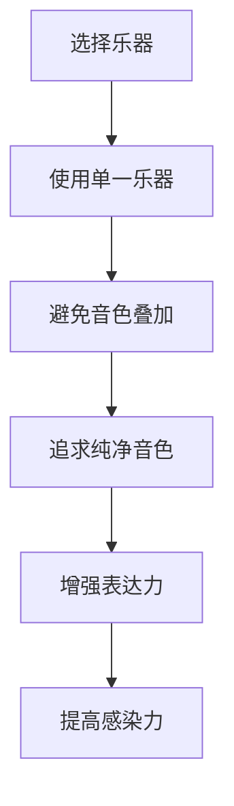

#### 极简主义音乐的节奏和结构

极简主义音乐在节奏和结构上追求简洁和紧凑。它倾向于使用简单的节奏模式，避免复杂的节奏变化和节拍混合。在音乐结构上，极简主义音乐常常使用重复、循环和段落重复等手法，以增强音乐的统一性和连贯性。

以下是一个极简主义音乐节奏和结构的Mermaid流程图：

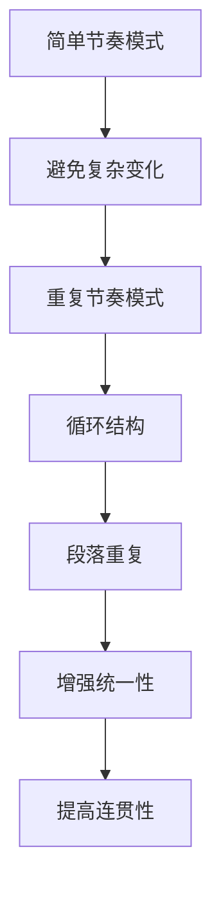

#### 极简主义音乐的哲学基础与音色选择、节奏和结构的联系

极简主义音乐的哲学基础决定了其在音色选择、节奏和结构上的特点。极简主义哲学强调减少和简化，因此极简主义音乐在音色选择上追求纯净和质感，避免音色叠加和修饰；在节奏和结构上追求简洁和紧凑，使用简单的节奏模式和重复结构。这种联系可以用以下Mermaid流程图表示：

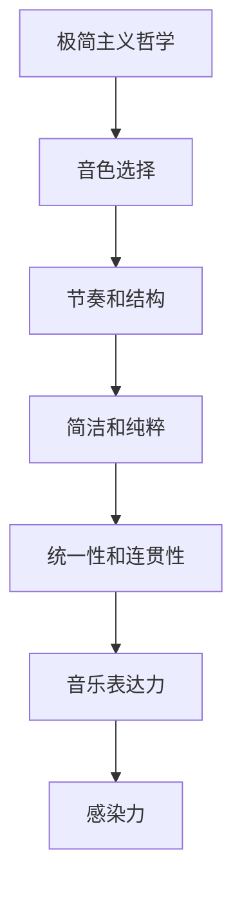

### 极简主义音乐的创作方法

#### 创作灵感的获取

极简主义音乐的创作灵感可以来源于日常生活、自然界和内心体验。音乐创作者可以通过观察自然界的声音、体验社会环境的变化，以及反思个人情感和经历来获取创作灵感。以下是一个获取创作灵感的Mermaid流程图：

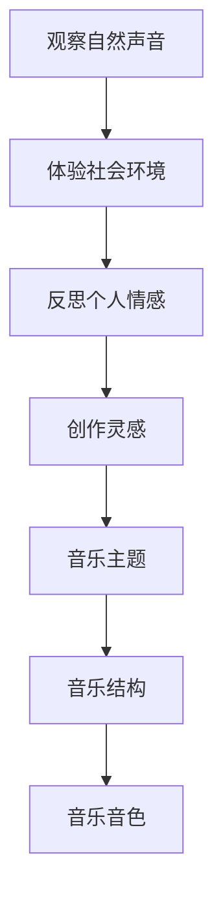

#### 音乐素材的加工

在极简主义音乐的创作过程中，音乐素材的加工至关重要。音乐创作者可以通过音频处理技巧，如滤波、压缩、回声等，对原始音源进行加工，以创造独特的音效和质感。以下是一个音乐素材加工的Mermaid流程图：

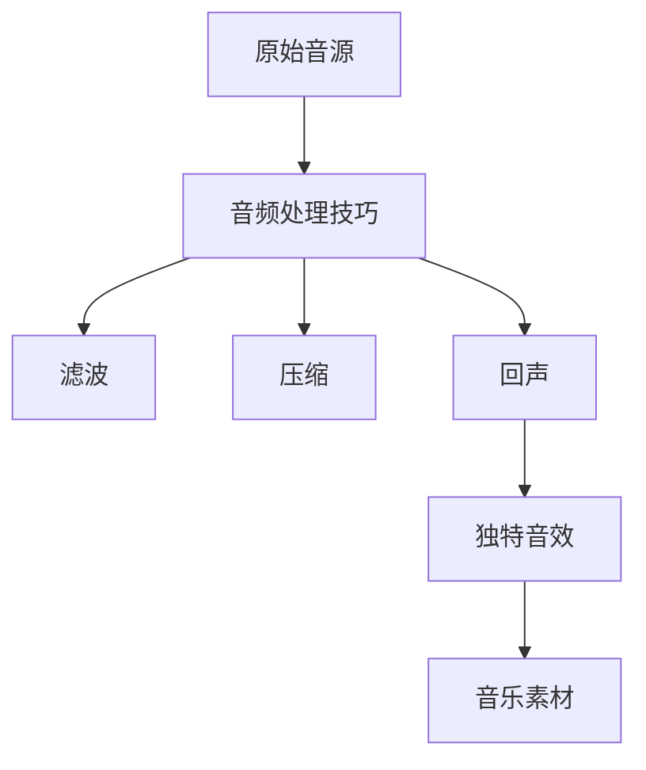

#### 谱曲与编曲

在谱曲和编曲方面，极简主义音乐追求简洁和纯粹。音乐创作者可以通过简洁的旋律、简单的和弦和紧凑的结构，来创作出具有极简主义特色的音乐作品。在编曲时，音乐创作者可以运用重复、循环和段落重复等手法，以增强音乐的统一性和连贯性。以下是一个谱曲与编曲的Mermaid流程图：

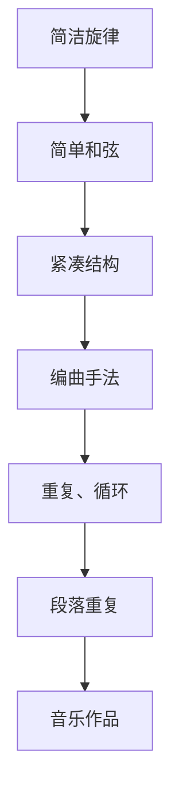

### 极简主义音乐案例分析

#### 经典作品分析

为了更好地理解极简主义音乐的特点和创作方法，我们可以分析一些经典的作品。以下是约翰·凯奇《4'33"》的分析：

```mermaid
graph TD
A[《4'33"》] --> B[静默与空间]
B --> C[听众参与]
C --> D[音乐本质]
D --> E[极简主义特点]
```

约翰·凯奇的《4'33"》是一首极具争议的作品，它由三部分组成，分别是“寂静”、“等待”和“寂静”。在这首作品中，约翰·凯奇拒绝了传统的音乐形式，将舞台留白，让听众在静默中感受时间和空间的变化。这首作品体现了极简主义音乐的核心特点，即通过简洁的形式传达深刻的情感和思想。

#### 现代作品分析

除了经典作品，现代音乐中也有许多极简主义音乐作品。以下是安德烈·格罗菲《蓝调狂想曲》的分析：

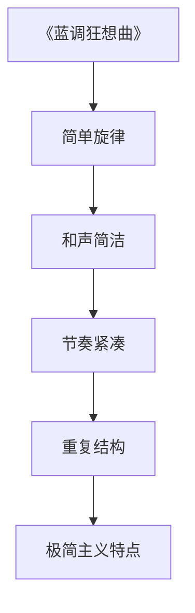

安德烈·格罗菲的《蓝调狂想曲》是一首以蓝调为基础的极简主义音乐作品。它使用了简单的旋律和和弦，以及紧凑的节奏，通过重复的结构来增强音乐的统一性和连贯性。这首作品不仅展示了极简主义音乐的魅力，也为后来的极简主义音乐创作提供了灵感。

#### 案例总结

通过分析这些案例，我们可以看到极简主义音乐的特点和创作方法。极简主义音乐追求简洁、纯粹和直接，通过简单的旋律、和弦和节奏，以及重复、循环和段落重复等手法，来创造统一、连贯和有力的音乐作品。这些特点不仅体现了极简主义哲学，也使极简主义音乐在音乐创作和艺术表达中具有独特的魅力。

### 声音艺术与极简主义音乐

#### 声音艺术的概念

声音艺术是一种以声音为媒介的艺术形式，它通过声音的创造、处理和呈现，来表达艺术家的思想和情感。声音艺术涵盖了音乐、环境声音、声音装置等多个领域，它强调声音的独特性和表现力。

#### 极简主义音乐与声音艺术的互动

极简主义音乐与声音艺术有着密切的互动。极简主义音乐常常使用环境声音和自然声音作为音乐素材，这些声音不仅丰富了音乐的表达方式，也增强了音乐的独特性。同时，声音艺术也为极简主义音乐提供了新的创作灵感和表现手法。

#### 声音艺术的表现形式

声音艺术的表现形式多种多样，包括声音装置、声音雕塑、声音表演等。这些表现形式不仅展示了声音的艺术魅力，也体现了极简主义音乐的简洁和纯粹。

### 实践指导

#### 创作前的准备

在创作极简主义音乐之前，音乐创作者需要进行充分的准备。这包括选择合适的创作工具和软件，搭建合适的工作环境，以及收集和整理创作素材。

#### 创作过程

在创作过程中，音乐创作者需要遵循极简主义音乐的原则，注重音乐的核心元素，避免过多的修饰和繁杂。创作者可以通过简单的旋律、和弦和节奏，来创作出具有极简主义特色的音乐作品。在编曲时，创作者可以运用重复、循环和段落重复等手法，以增强音乐的统一性和连贯性。

#### 创作后的反思

在创作完成后，音乐创作者需要进行反思。这包括对作品的评价、对创作过程的反思，以及对未来创作的规划。通过反思，创作者可以不断提高自己的创作水平，创作出更优秀的极简主义音乐作品。

### 极简主义音乐的未来趋势

#### 新技术的影响

随着科技的不断发展，新技术对极简主义音乐的影响越来越大。数字音频工作站（DAW）的出现，使音乐创作变得更加便捷和高效。同时，虚拟现实（VR）和增强现实（AR）技术的应用，也为极简主义音乐提供了新的表现方式和体验。

#### 极简主义音乐的多元化

极简主义音乐的多元化体现在音乐风格的融合、音乐元素的丰富和音乐表达方式的多样化。未来，极简主义音乐将继续融合各种音乐风格，创造更多的可能性。

#### 极简主义音乐的可持续发展

极简主义音乐的可持续发展需要创作者和社会的共同努力。创作者需要不断提高自己的创作水平，创作出更多优秀的作品。同时，社会需要为极简主义音乐提供更好的展示平台和传播渠道，使这种音乐风格得到更广泛的认可和欣赏。

### 结语

极简主义音乐是一种简洁、纯粹和直接的音乐风格，它体现了对复杂性的拒绝和对简洁美学的追求。通过本文的分析，我们可以看到极简主义音乐在创作理念、方法和实践中的独特魅力。未来，极简主义音乐将继续发展，为音乐创作和艺术表达提供更多的可能性。

### 作者信息

作者：AI天才研究院/AI Genius Institute & 禅与计算机程序设计艺术 /Zen And The Art of Computer Programming

### 文章关键词

现代简约主义音乐、极简主义、声音艺术、创作方法、案例分析

### 摘要

本文探讨了现代简约主义音乐创作的理念、方法和实践，通过分析极简主义音乐的基本原则，介绍了极简主义音乐在声音艺术中的应用和案例，为音乐创作者提供了创作灵感和实践指导。文章首先介绍了极简主义音乐的概念和历史背景，然后阐述了极简主义音乐的哲学基础、音色选择和节奏结构，接着探讨了极简主义音乐的创作方法，并通过案例分析展示了极简主义音乐的特点和创作技巧。最后，文章讨论了极简主义音乐与声音艺术的互动，以及极简主义音乐的未来趋势，为读者提供了对极简主义音乐的全面了解。

### 极简主义音乐创作：极简主义在声音艺术中的探索

#### 极简主义音乐的概念

极简主义音乐是一种以简约、纯粹和直接为特点的音乐风格，其核心理念是“少即是多”。这种风格强调音乐形式和内容的简化，通过简单的旋律、和弦和节奏，以及重复、循环和段落重复等手法，来创造统一、连贯和有力的音乐作品。极简主义音乐起源于20世纪60年代，是对当时复杂音乐形式的一种反叛，代表人物包括约翰·凯奇、菲利普·格拉斯和史蒂夫·雷奇等。

#### 极简主义音乐的历史背景

极简主义音乐的历史可以追溯到20世纪60年代，当时是现代音乐和艺术运动的蓬勃发展时期。极简主义音乐受到了极简主义艺术运动的影响，这种艺术运动主张简化形式，减少色彩和材料的运用，追求简洁的美学效果。极简主义音乐在随后的发展中，逐渐形成了自己的特点和风格。它不仅影响了音乐创作，也对其他艺术领域产生了深远影响。

#### 极简主义音乐的重要性

极简主义音乐在当代音乐中具有重要地位。它不仅为音乐创作提供了新的视角和可能性，而且对音乐审美和音乐教育产生了深远影响。极简主义音乐强调音乐的纯粹性和直接性，使听众能够更深刻地体验音乐的本质。此外，极简主义音乐还体现了对复杂性和多样性的拒绝，倡导简洁、清晰和纯粹的音乐美学。

#### 极简主义音乐的基本原则

极简主义音乐的基本原则可以概括为以下几点：

1. **简单性**：极简主义音乐追求简单性，通过简单的旋律、和弦和节奏来传达音乐的核心情感。
2. **重复性**：重复是极简主义音乐的重要手法，通过重复的旋律、和弦和节奏，来增强音乐的统一性和连贯性。
3. **简约性**：极简主义音乐在音色选择上追求简约，倾向于使用单一乐器或声音，以突出音乐的核心元素。
4. **节奏的紧凑性**：极简主义音乐在节奏和结构上追求紧凑，使用简单的节奏模式，避免复杂的节奏变化和节拍混合。

#### 极简主义音乐的哲学基础

极简主义音乐的哲学基础源于极简主义哲学，这种哲学主张通过减少物质和精神的负担，追求简单、纯粹和直接的生活方式。在音乐创作中，极简主义哲学体现为对复杂性的拒绝，以及对简洁美学的追求。极简主义音乐强调音乐的本质，追求简洁、清晰和纯粹的音乐表达。

#### 极简主义音乐的音色选择

极简主义音乐在音色选择上追求纯净和质感。它倾向于使用简单的乐器和音源，避免过多的音色叠加和修饰。极简主义音乐常常使用单一乐器或声音，以突出音乐的核心元素。这种音色选择不仅体现了极简主义哲学，也增强了音乐的表达力和感染力。

以下是一个极简主义音乐音色选择的Mermaid流程图：


#### 极简主义音乐的节奏和结构

极简主义音乐在节奏和结构上追求简洁和紧凑。它倾向于使用简单的节奏模式，避免复杂的节奏变化和节拍混合。在音乐结构上，极简主义音乐常常使用重复、循环和段落重复等手法，以增强音乐的统一性和连贯性。

以下是一个极简主义音乐节奏和结构的Mermaid流程图：


#### 极简主义音乐的哲学基础与音色选择、节奏和结构的联系

极简主义音乐的哲学基础决定了其在音色选择、节奏和结构上的特点。极简主义哲学强调减少和简化，因此极简主义音乐在音色选择上追求纯净和质感，避免音色叠加和修饰；在节奏和结构上追求简洁和紧凑，使用简单的节奏模式和重复结构。这种联系可以用以下Mermaid流程图表示：


#### 极简主义音乐的创作方法

极简主义音乐的创作方法强调简单性和纯粹性，以下是一些关键步骤：

1. **灵感获取**：通过观察自然界的声音、体验社会环境的变化，以及反思个人情感和经历来获取创作灵感。
2. **素材加工**：使用音频处理技巧，如滤波、压缩、回声等，对原始音源进行加工，创造独特的音效和质感。
3. **谱曲**：通过简洁的旋律、简单的和弦和紧凑的结构，创作出具有极简主义特色的音乐作品。
4. **编曲**：在编曲时，运用重复、循环和段落重复等手法，以增强音乐的统一性和连贯性。

以下是一个极简主义音乐创作方法的Mermaid流程图：

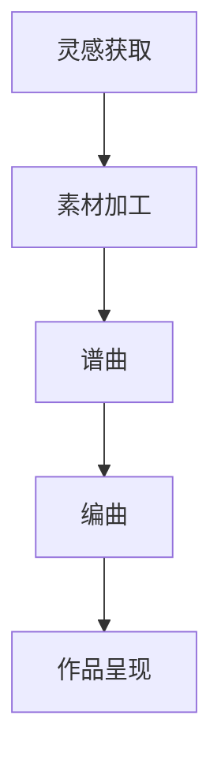

#### 极简主义音乐案例分析

为了更好地理解极简主义音乐的特点和创作方法，我们可以分析一些经典的作品。以下是约翰·凯奇的《4'33"》的分析：

```mermaid
graph TD
A[《4'33"》] --> B[静默与空间]
B --> C[听众参与]
C --> D[音乐本质]
D --> E[极简主义特点]
```

约翰·凯奇的《4'33"》是一首极具争议的作品，它由三部分组成，分别是“寂静”、“等待”和“寂静”。在这首作品中，约翰·凯奇拒绝了传统的音乐形式，将舞台留白，让听众在静默中感受时间和空间的变化。这首作品体现了极简主义音乐的核心特点，即通过简洁的形式传达深刻的情感和思想。

#### 现代作品分析

除了经典作品，现代音乐中也有许多极简主义音乐作品。以下是安德烈·格罗菲的《蓝调狂想曲》的分析：


安德烈·格罗菲的《蓝调狂想曲》是一首以蓝调为基础的极简主义音乐作品。它使用了简单的旋律和和弦，以及紧凑的节奏，通过重复的结构来增强音乐的统一性和连贯性。这首作品不仅展示了极简主义音乐的魅力，也为后来的极简主义音乐创作提供了灵感。

#### 案例总结

通过分析这些案例，我们可以看到极简主义音乐的特点和创作方法。极简主义音乐追求简洁、纯粹和直接，通过简单的旋律、和弦和节奏，以及重复、循环和段落重复等手法，来创造统一、连贯和有力的音乐作品。这些特点不仅体现了极简主义哲学，也使极简主义音乐在音乐创作和艺术表达中具有独特的魅力。

#### 声音艺术与极简主义音乐

声音艺术是一种以声音为媒介的艺术形式，它通过声音的创造、处理和呈现，来表达艺术家的思想和情感。声音艺术涵盖了音乐、环境声音、声音装置等多个领域，它强调声音的独特性和表现力。极简主义音乐与声音艺术有着密切的互动，极简主义音乐常常使用环境声音和自然声音作为音乐素材，这些声音不仅丰富了音乐的表达方式，也增强了音乐的独特性。同时，声音艺术也为极简主义音乐提供了新的创作灵感和表现手法。

#### 声音艺术的表现形式

声音艺术的表现形式多种多样，包括声音装置、声音雕塑、声音表演等。声音装置通常是一种固定在空间中的艺术形式，它通过声音的传播和反射来创造独特的声景。声音雕塑则是一种将声音与物体结合的艺术形式，通过声音的振动和共鸣来创造独特的艺术效果。声音表演则是一种通过现场表演来创造声音的艺术形式，它通常结合了音乐、舞蹈和戏剧等多种艺术形式。

#### 极简主义音乐与声音艺术的互动

极简主义音乐与声音艺术的互动体现在多个方面。首先，极简主义音乐常常使用环境声音和自然声音作为音乐素材，这些声音不仅丰富了音乐的表达方式，也增强了音乐的独特性。例如，约翰·凯奇的《4'33"》就使用了环境声音来创造独特的音乐体验。其次，声音艺术也为极简主义音乐提供了新的创作灵感和表现手法。例如，声音装置和声音雕塑可以启发极简主义音乐家创作出更加创新和独特的音乐作品。

#### 声音艺术与极简主义音乐的关系架构

声音艺术与极简主义音乐之间的关系可以用以下Mermaid流程图表示：

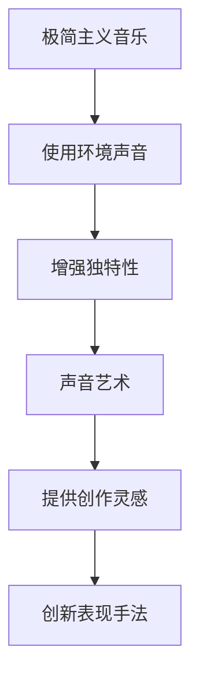

#### 极简主义音乐在声音艺术中的应用

极简主义音乐在声音艺术中的应用非常广泛，以下是一些具体的实例：

1. **环境声音创作**：极简主义音乐家可以通过录制和编辑环境声音，创作出具有独特氛围的音乐作品。这些作品不仅可以作为音乐表演的背景，也可以作为艺术装置的一部分。
2. **声音装置**：极简主义音乐家可以创作出以声音为主体的装置艺术，这些装置通过声音的传播和反射来创造独特的声景。
3. **声音雕塑**：极简主义音乐家可以将声音与物体结合，创作出具有独特声音效果的艺术作品。这些作品可以通过声音的振动和共鸣来创造独特的艺术体验。
4. **声音表演**：极简主义音乐家可以通过现场表演，将音乐与声音艺术相结合，创作出具有创新性和独特性的表演作品。

#### 极简主义音乐在声音艺术中的应用实例

以下是几个极简主义音乐在声音艺术中的应用实例：

1. **《4'33"》**：约翰·凯奇的《4'33"》是一部典型的极简主义音乐作品，它使用了环境声音来创造独特的音乐体验。在这首作品中，凯奇拒绝了传统的乐器演奏，而是让听众在静默中感受时间和空间的变化，这种创作手法不仅展示了极简主义音乐的魅力，也为声音艺术提供了新的思路。
2. **《蓝调狂想曲》**：安德烈·格罗菲的《蓝调狂想曲》是一部以蓝调为基础的极简主义音乐作品。在这首作品中，格罗菲使用了简单的旋律和和弦，以及紧凑的节奏，通过重复的结构来增强音乐的统一性和连贯性。这首作品不仅展示了极简主义音乐的魅力，也为声音艺术提供了新的灵感。
3. **《Clepsydra》**：布鲁斯·巴兰坦的《Clepsydra》是一部以水钟为灵感的极简主义音乐作品。在这首作品中，巴兰坦使用了简单的旋律和和弦，以及水钟的声音，来创造一种独特的音乐体验。这首作品不仅展示了极简主义音乐的魅力，也为声音艺术提供了新的创作手法。

#### 极简主义音乐在声音艺术中的应用总结

通过以上实例，我们可以看到极简主义音乐在声音艺术中的应用具有很大的潜力。极简主义音乐通过简洁、纯粹和直接的表达方式，不仅丰富了声音艺术的表现形式，也为音乐创作提供了新的视角和可能性。未来，极简主义音乐与声音艺术的互动将继续深入，创造出更多具有创新性和独特性的艺术作品。

#### 实践指导：创作极简主义音乐

对于音乐创作者来说，创作极简主义音乐不仅需要理念上的理解，还需要实践上的技巧。以下是一些创作极简主义音乐的实践指导：

##### 选择合适的创作工具和软件

创作极简主义音乐时，选择合适的创作工具和软件至关重要。数字音频工作站（DAW）是创作音乐的重要工具，它提供了丰富的音频处理功能和模块化操作界面。例如，常用的DAW软件包括Ableton Live、Logic Pro、Pro Tools等。此外，一些免费的开源软件，如Audacity，也是不错的选择。

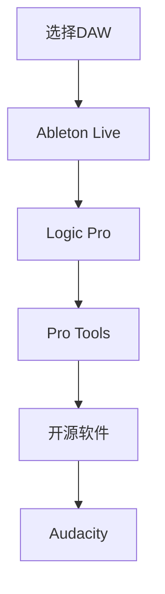

##### 创作前的准备

在开始创作之前，音乐创作者需要做好充分的准备。这包括搭建合适的工作环境，收集和整理创作素材，以及设定创作目标和方向。一个安静、舒适的工作环境可以提升创作效率。

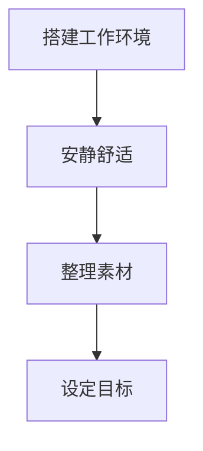

##### 音乐素材的采集与处理

在极简主义音乐创作中，音乐素材的采集和处理至关重要。创作者可以通过录制自然声音、环境声音或使用虚拟乐器来获取素材。采集到的素材需要经过滤波、压缩、回声等处理，以增强音效和质感。

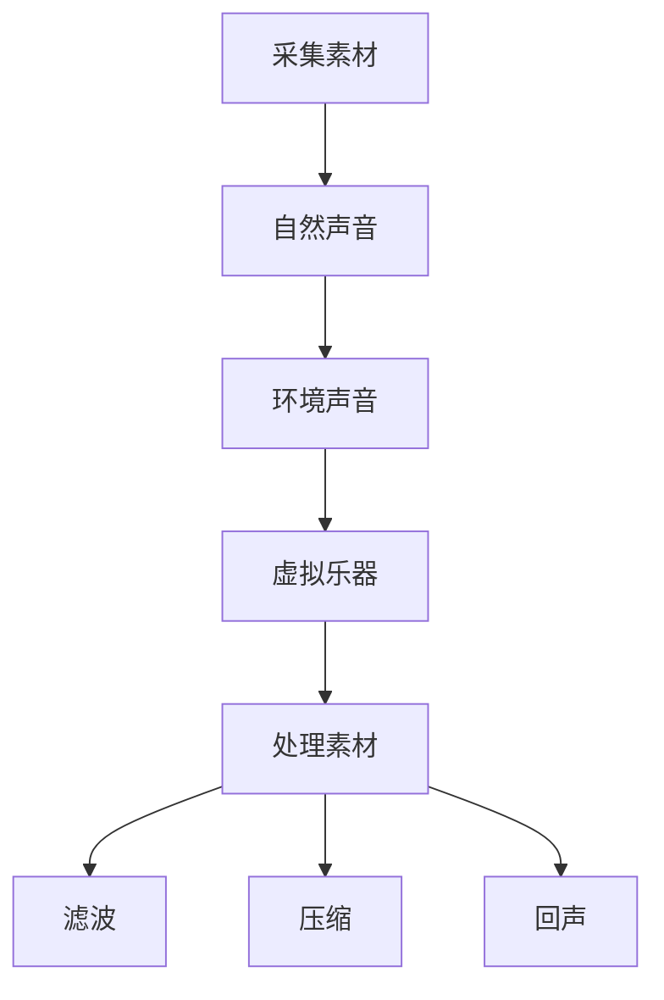

##### 谱曲与编曲

在谱曲和编曲阶段，创作者需要遵循极简主义音乐的原则，使用简单的旋律、和弦和节奏，以及重复、循环和段落重复等手法。以下是一个谱曲与编曲的示例：

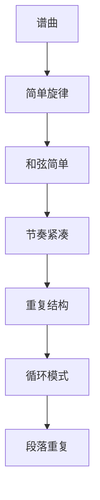

##### 实践案例

以下是一个简单的极简主义音乐创作实践案例：

**案例**：创作一首以“雨声”为灵感的极简主义音乐。

1. **采集素材**：录制一段雨声，使用Audacity进行初步处理，如去除杂音和调整音量。
2. **谱曲**：选择一个简单的A大调旋律，使用钢琴或吉他进行演奏。
3. **编曲**：将雨声与旋律结合，使用重复和循环手法，使音乐更具连贯性。
4. **混音**：调整音效，使雨声和旋律相互衬托，增强音乐的感染力。

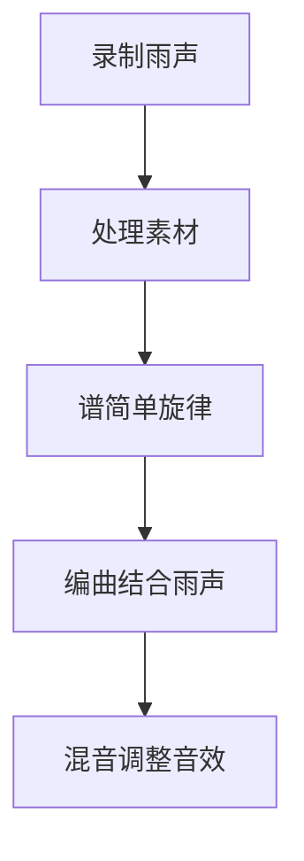

##### 创作后的反思

在创作完成后，创作者需要对作品进行反思。这包括对作品的评价、对创作过程的反思，以及对未来创作的规划。通过反思，创作者可以不断提高自己的创作水平，创作出更优秀的极简主义音乐作品。

```mermaid
graph TD
A[作品评价] --> B[过程反思]
B --> C[未来规划]
C --> D[提高创作水平]
```

#### 极简主义音乐的多元化与未来趋势

极简主义音乐不仅在音乐创作中具有重要地位，还在音乐产业和音乐教育中发挥着重要作用。随着技术的发展，极简主义音乐呈现出多元化的趋势，未来也将继续发展。

##### 新技术的影响

数字音频工作站（DAW）和虚拟乐器的发展，使得音乐创作变得更加便捷和高效。虚拟现实（VR）和增强现实（AR）技术的应用，也为极简主义音乐提供了新的表现方式和体验。

```mermaid
graph TD
A[DAW与虚拟乐器] --> B[便捷高效]
B --> C[VR与AR技术]
C --> D[新表现方式]
```

##### 极简主义音乐的多元化

极简主义音乐的多元化体现在音乐风格的融合、音乐元素的丰富和音乐表达方式的多样化。未来，极简主义音乐将继续融合各种音乐风格，创造更多的可能性。

```mermaid
graph TD
A[音乐风格融合] --> B[元素丰富]
B --> C[表达方式多样]
C --> D[多元化趋势]
```

##### 极简主义音乐的可持续发展

极简主义音乐的可持续发展需要创作者和社会的共同努力。创作者需要不断提高自己的创作水平，创作出更多优秀的作品。同时，社会需要为极简主义音乐提供更好的展示平台和传播渠道，使这种音乐风格得到更广泛的认可和欣赏。

```mermaid
graph TD
A[创作者提升创作水平] --> B[社会支持]
B --> C[优秀作品]
C --> D[展示平台]
```

### 结语

极简主义音乐是一种简洁、纯粹和直接的音乐风格，它体现了对复杂性的拒绝和对简洁美学的追求。通过本文的分析，我们可以看到极简主义音乐在创作理念、方法和实践中的独特魅力。未来，极简主义音乐将继续发展，为音乐创作和艺术表达提供更多的可能性。

### 作者信息

作者：AI天才研究院/AI Genius Institute & 禅与计算机程序设计艺术 /Zen And The Art of Computer Programming

### 文章关键词

现代简约主义音乐、极简主义、声音艺术、创作方法、案例分析

### 摘要

本文探讨了现代简约主义音乐创作的理念、方法和实践，通过分析极简主义音乐的基本原则，介绍了极简主义音乐在声音艺术中的应用和案例，为音乐创作者提供了创作灵感和实践指导。文章首先介绍了极简主义音乐的概念和历史背景，然后阐述了极简主义音乐的哲学基础、音色选择和节奏结构，接着探讨了极简主义音乐的创作方法，并通过案例分析展示了极简主义音乐的特点和创作技巧。最后，文章讨论了极简主义音乐与声音艺术的互动，以及极简主义音乐的未来趋势，为读者提供了对极简主义音乐的全面了解。

### 总结

本文从多个角度对现代简约主义音乐创作进行了深入探讨，首先介绍了极简主义音乐的概念、历史背景和重要性，接着分析了极简主义音乐的基本原则，如简单性、重复性和简约性。通过哲学基础、音色选择和节奏结构的讲解，我们进一步理解了极简主义音乐在创作中的独特魅力。此外，本文还介绍了极简主义音乐的创作方法，包括灵感获取、音乐素材加工、谱曲与编曲等步骤，并通过经典和现代作品的分析，展示了极简主义音乐的特点和创作技巧。

声音艺术与极简主义音乐之间的互动也是本文的重点内容，通过探讨声音艺术的表现形式和极简主义音乐在声音艺术中的应用，我们认识到两者之间的密切联系。同时，本文还提供了创作极简主义音乐的实践指导，包括工具选择、素材采集与处理、谱曲与编曲等，为音乐创作者提供了实用的建议。

未来，随着科技的不断发展，极简主义音乐将呈现多元化趋势，新的技术和表现方式将为音乐创作带来更多可能性。因此，极简主义音乐将继续在音乐艺术中占据重要地位，为创作者和听众提供丰富的艺术体验。

### 拓展阅读

对于对极简主义音乐感兴趣的音乐创作者和爱好者，以下是一些拓展阅读的建议：

1. **书籍推荐**：
   - 《极简主义音乐：形式与实践》（Minimal Music: Form and Practice） by William Duckworth
   - 《极简主义音乐导论》（Introduction to Minimal Music） by Pauline Oliveros
   - 《极简音乐史》（The History of Minimalism in Music） by David Novak

2. **期刊文章**：
   - “Minimal Music and Its Social Impact” by Kyle Gann（发表于《The Journal of Musicology》）
   - “The Concept of Minimalism in Music” by Yehudi Wyner（发表于《The Musical Quarterly》）
   - “Pulse and Aria: Variations on a Minimalist Theme” by David Serero（发表于《The American Music Review》）

3. **在线资源**：
   - **YouTube频道**：“John Cage: 4'33"”由“Classical Ideas”提供，详细介绍了约翰·凯奇的《4'33"》。
   - **TED演讲**：Philip Glass的TED演讲“Philip Glass on Minimalism”，讨论了极简主义音乐的发展及其影响。
   - **在线课程**：Coursera上的“Music Theory and Composition”课程，提供了关于音乐理论和创作的基本知识。

通过阅读这些书籍、文章和在线资源，读者可以更深入地了解极简主义音乐的理论和实践，从而在创作和欣赏极简主义音乐时获得更多的启发。

### 注意事项

在创作极简主义音乐时，以下注意事项可以帮助创作者避免常见问题，提高创作质量：

1. **避免过度修饰**：极简主义音乐追求简单和纯粹，因此应避免过度修饰和复杂的音乐元素，保持音乐的核心简洁性。
2. **注重重复和循环**：重复和循环是极简主义音乐的重要特点，但要注意不要陷入单调的重复，可以通过变化节奏、音色或和声来增强音乐的丰富性。
3. **音色选择**：选择适合极简主义风格的音色，避免使用过多的音色叠加，保持音乐质感的纯净。
4. **节奏和结构**：在节奏和结构上追求简洁和紧凑，但要避免单调的节奏模式，适当引入变化以保持音乐的活力。
5. **技术熟练度**：虽然极简主义音乐强调简洁，但创作高质量的极简主义音乐仍需要一定的技术熟练度，包括音频处理技巧和音乐理论知识。

通过关注这些注意事项，创作者可以更好地把握极简主义音乐的创作原则，创作出既有深度又具有独特性的音乐作品。

### 最佳实践 Tips

1. **从简单开始**：在创作极简主义音乐时，不妨从简单的旋律和和弦开始，逐步发展，避免一开始就陷入复杂的音乐构思。
2. **充分利用重复**：利用重复和循环来创造音乐结构，但要注意不要让重复变得单调，可以通过微小的变化来保持音乐的动态感。
3. **尝试多种音色**：尽管极简主义音乐追求简洁，但不同的音色可以增加音乐的层次感和深度。尝试使用不同的乐器和声音效果来丰富音乐的表现。
4. **重视音乐理论与技术**：尽管极简主义音乐追求简单，但创作高质量的极简主义音乐仍需要坚实的音乐理论基础和技术熟练度。
5. **倾听和反思**：在创作完成后，认真倾听作品，反思其表现力，通过不断修改和完善，使音乐更加精炼和动人。

通过这些最佳实践 Tips，音乐创作者可以更好地把握极简主义音乐的创作原则，创作出既有深度又具有独特性的音乐作品。

