                 

### **文章标题**
### 现代简约主义香薰蜡烛工作坊：家居香氛的个性化定制课程

---

#### **关键词**
- 香薰蜡烛
- 简约主义
- 个性化定制
- 家居香氛
- DIY项目

---

#### **摘要**
本文旨在介绍现代简约主义香薰蜡烛的个性化定制课程。通过深入探讨香薰蜡烛的历史与发展、简约主义理念及其在家居装饰中的应用，读者将了解香薰蜡烛的制作材料与工艺、配方设计以及个性化定制的技巧。文章还涉及香薰蜡烛的安全性、环保性与存储，并提供现代简约主义香薰蜡烛DIY项目实战，为读者提供全方位的学习体验。

---

## **第一部分 前导**

### **第1章 香薰蜡烛与家居香氛概述**

#### **1.1 香薰蜡烛的历史与发展**
香薰蜡烛起源于古埃及时期，当时人们使用蜂蜡和香料制成蜡烛，用于宗教仪式和净化空气。随着时间的推移，香薰蜡烛的制作工艺逐渐完善，其用途也不断扩大。现代社会中，香薰蜡烛不仅用于宗教仪式，还广泛应用于家庭装饰、按摩治疗和情绪调节等领域。

**核心概念与联系：**

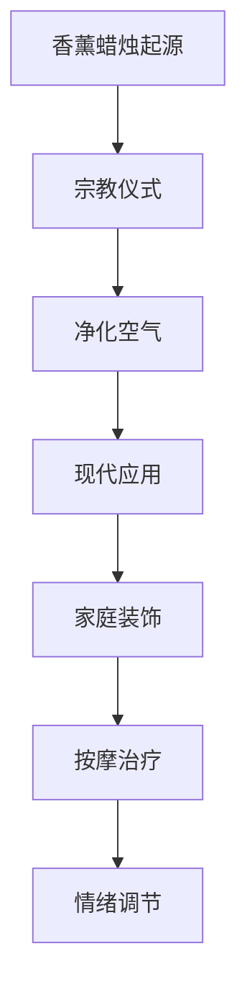

---

#### **1.2 家居香氛的概念与作用**
家居香氛是指通过气味来影响居住环境的一种方式。它不仅能够改善室内空气质量，还能调节情绪、提升生活质量。不同的香氛成分能够激发人的情感，带来愉悦感或放松感。

**核心概念与联系：**

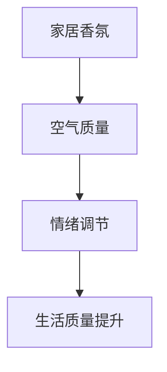

---

#### **1.3 简约主义理念**
简约主义是一种设计哲学，强调“少即是多”的理念。它主张在设计和生活中去除不必要的元素，追求简洁、实用和美观。简约主义不仅适用于家居装饰，也在香薰蜡烛的设计中得到了广泛应用。

**核心概念与联系：**

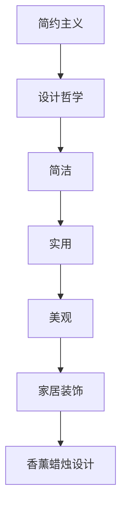

---

#### **1.4 个性化定制的重要性**
个性化定制是现代消费趋势的体现，它满足了人们对于独特性和个性化的追求。在香薰蜡烛领域，个性化定制不仅可以让消费者拥有独特的香薰体验，还能提高产品的附加值和市场竞争力。

**核心概念与联系：**

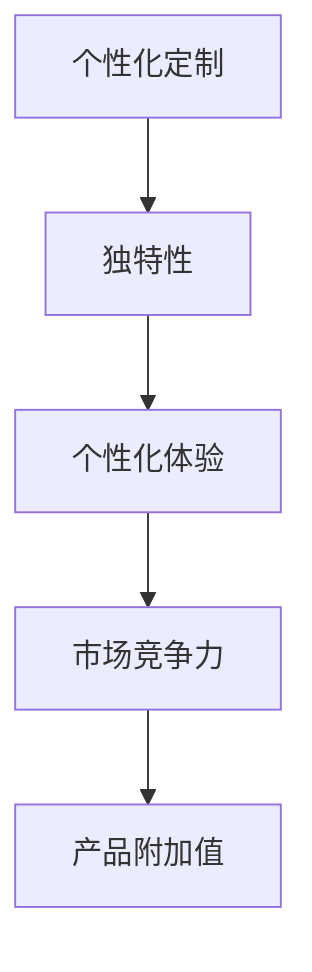

---

## **第二部分 核心技术**

### **第2章 简约主义理念及其在家居装饰中的应用**

#### **2.1 简约主义设计原则**
简约主义设计原则主要包括空间简约、材料简约和形态简约。通过这些原则，设计师能够在有限的资源内创造出富有美感和功能性的空间。

**核心概念与联系：**

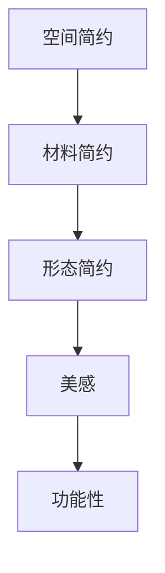

---

#### **2.2 简约主义在家居装饰中的应用**
简约主义在家居装饰中的应用主要体现在家具、灯具、窗帘等装饰元素的选择上。通过简约的设计，家居环境能够展现出简洁、大气和优雅的风格。

**核心概念与联系：**

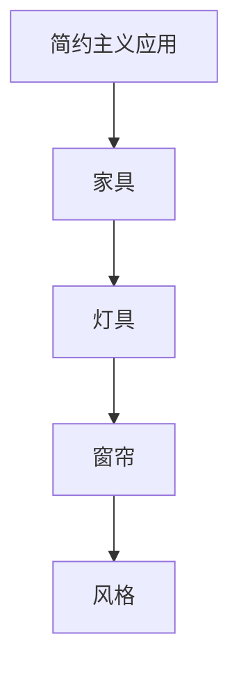

---

#### **2.3 简约主义在香薰蜡烛设计中的体现**
简约主义在香薰蜡烛设计中的体现，主要表现在包装和蜡烛造型的简约。通过简约的设计，香薰蜡烛不仅能够更好地融入家居环境，还能提升产品的品质感。

**核心概念与联系：**

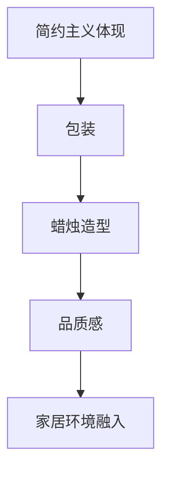

---

### **第3章 香薰蜡烛材料与基础制作工艺**

#### **3.1 香薰蜡烛的主要材料**
香薰蜡烛的主要材料包括蜡烛主体材料、燃烧芯材料和香料或精油。这些材料的选择直接影响蜡烛的燃烧性能和香味质量。

**核心概念与联系：**

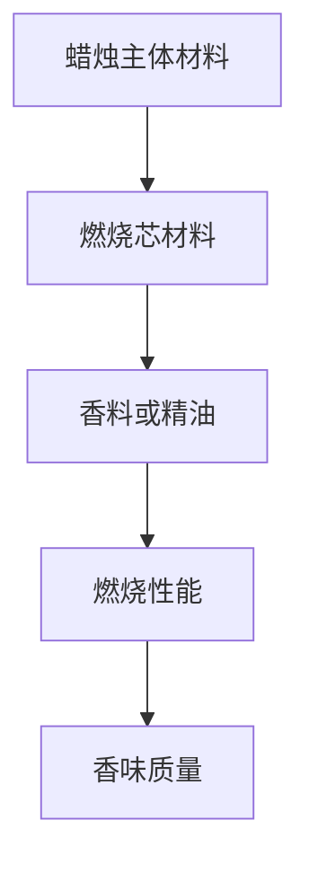

---

#### **3.2 香薰蜡烛的基础制作工艺**
香薰蜡烛的基础制作工艺包括蜡烛模具的选择与处理、蜡的熔化和浇铸、以及燃烧芯的安装。这些步骤需要严格按照操作规程进行，以确保蜡烛的质量。

**核心概念与联系：**

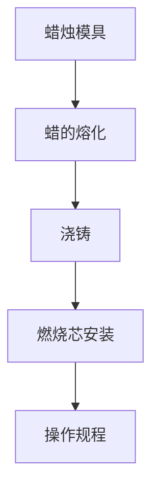

---

#### **3.3 制作工艺中需要注意的问题**
在香薰蜡烛的制作过程中，需要注意防止蜡烛变形、确保燃烧效果和香味持久度。这些问题可以通过合理选择材料、严格控制熔化和浇铸温度以及正确安装燃烧芯来解决。

**核心概念与联系：**

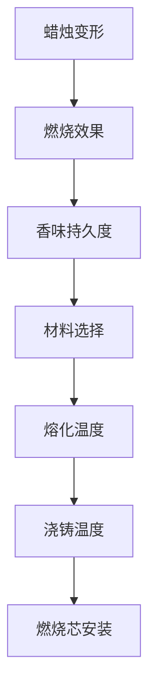

---

### **第4章 香薰蜡烛配方设计**

#### **4.1 香薰蜡烛配方的基本原理**
香薰蜡烛的配方设计基于香精和蜡的混合比例。通过调整这些比例，可以创造出不同香味和燃烧特性的蜡烛。

**核心概念与联系：**

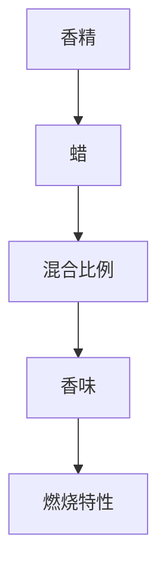

---

#### **4.2 常见香薰蜡烛香型介绍**
常见的香薰蜡烛香型包括水果香、花香、木质香和混合香。每种香型都有其独特的气味和特点，适用于不同的场合和需求。

**核心概念与联系：**

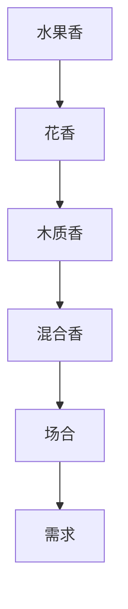

---

#### **4.3 香薰蜡烛配方的个性化调整**
个性化调整是香薰蜡烛配方的关键。通过调整香精的比例和种类，可以创造出独一无二的香味，满足消费者的个性化需求。

**核心概念与联系：**

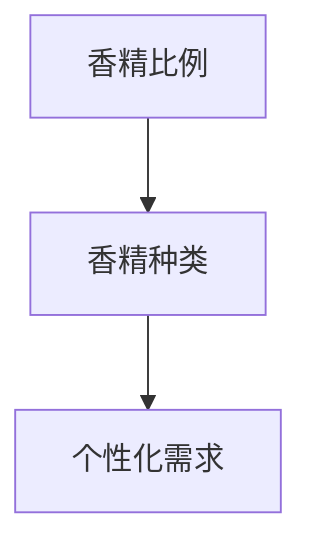

---

### **第5章 香薰蜡烛个性化定制技巧**

#### **5.1 个性化定制的意义**
个性化定制不仅是消费者需求的一种体现，也是提高产品附加值和市场竞争力的关键。通过个性化定制，消费者可以获得独特的使用体验。

**核心概念与联系：**

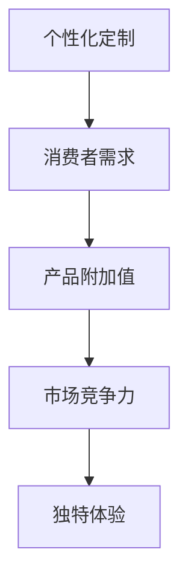

---

#### **5.2 个性化定制的设计思路**
个性化定制的设计思路主要包括理解客户需求、选择合适的材料和设计独特的造型。这些步骤需要综合考虑消费者的喜好和实际需求。

**核心概念与联系：**

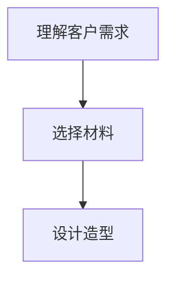

---

#### **5.3 实现个性化定制的步骤**
实现个性化定制的步骤包括客户需求调研、设计方案的确认、材料的选择和定制产品的生产。这些步骤需要紧密配合，以确保定制过程的顺利进行。

**核心概念与联系：**

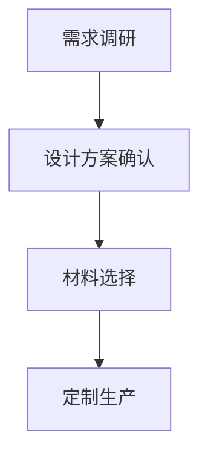

---

### **第6章 香薰蜡烛的安全性、环保性与存储**

#### **6.1 香薰蜡烛的安全性**
香薰蜡烛的安全性是消费者选择产品的重要因素。为了确保产品的安全，需要选择高质量的原料，并严格遵循制作工艺。

**核心概念与联系：**

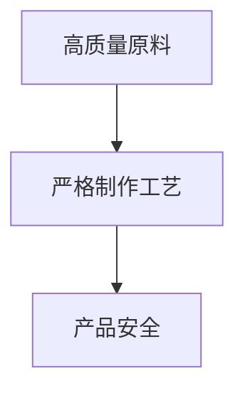

---

#### **6.2 香薰蜡烛的环保性**
环保性是现代消费者越来越关注的问题。香薰蜡烛的环保性主要体现在材料的选择和燃烧过程的环保性。选择可再生的原料和低污染的燃烧方式，是提高香薰蜡烛环保性的关键。

**核心概念与联系：**

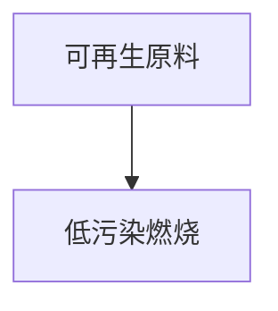

---

#### **6.3 香薰蜡烛的存储方法**
正确的存储方法可以延长香薰蜡烛的使用寿命。建议将蜡烛存放在阴凉干燥的地方，避免阳光直射和高温环境。同时，需要保持蜡烛的清洁，避免灰尘和污染物的进入。

**核心概念与联系：**

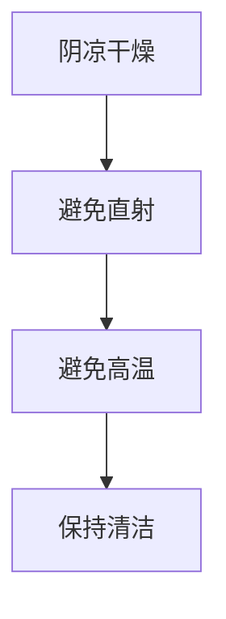

---

### **第7章 香薰蜡烛在家庭氛围营造中的应用实例**

#### **7.1 不同场景下的香薰蜡烛应用**
香薰蜡烛可以根据不同的场景来选择合适的香型和造型，以达到最佳的氛围营造效果。

**核心概念与联系：**

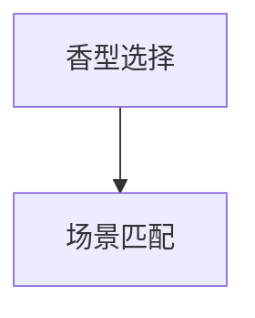

---

#### **7.2 香薰蜡烛与其他家居装饰元素的搭配**
香薰蜡烛可以与其他家居装饰元素如家具、窗帘和灯具等进行搭配，创造出独特的家居风格。

**核心概念与联系：**

```mermaid
graph TD
    A[香薰蜡烛] --> B[家具]
    B --> C[窗帘]
    C --> D[灯具]
```

---

#### **7.3 香薰蜡烛在节日氛围营造中的应用**
在节日中，香薰蜡烛可以作为装饰品来营造节日氛围。不同的节日可以选择不同的香型和造型，增加节日的喜庆气氛。

**核心概念与联系：**

```mermaid
graph TD
    A[节日选择] --> B[香型]
    B --> C[造型]
```

---

### **第三部分 应用实践**

#### **第8章 现代简约主义香薰蜡烛DIY项目实战**

#### **8.1 DIY项目实战一：基础香薰蜡烛制作**
在这个DIY项目中，我们将从最基本的香薰蜡烛制作开始，包括准备材料、熔化蜡、浇铸蜡烛和冷却定型的步骤。

**核心算法原理讲解：**
```plaintext
步骤1：准备材料
- 蜡烛主体材料（如蜂蜡、大豆蜡等）
- 燃烧芯材料
- 香料或精油

步骤2：熔化蜡
- 将蜡块放入蜡烛模具中，使用加热装置（如蜡烛炉）加热，直到蜡完全熔化。

步骤3：添加香料
- 将熔化的蜡冷却至约80℃，然后加入香料或精油，搅拌均匀。

步骤4：浇铸蜡烛
- 将搅拌均匀的蜡液倒入预先准备好的蜡烛模具中，确保蜡烛模具中的蜡液填充完全。

步骤5：冷却定型
- 将蜡烛模具放置在阴凉处，让蜡液完全冷却并定型，一般需要4-6小时。
```

**项目实战代码解读：**
```python
# 假设以下步骤是Python代码实现

def prepare_materials():
    materials = ['蜂蜡', '燃烧芯', '香料']
    return materials

def melt_wax(wax, mold):
    wax_melting_temperature = 80  # 蜡熔化温度
    if wax的温度 >= wax_melting_temperature:
        print("蜡已经熔化，可以进行下一步。")
    else:
        print("蜡尚未熔化，请继续加热。")

def add_scent(melted_wax, scent):
    melted_wax.add_scent(scent)
    print("香料已经添加，混合均匀。")

def pour_wax(mold, melted_wax):
    mold.fill_with_wax(melted_wax)
    print("蜡已经倒入模具中。")

def cool_and_set(mold):
    mold.cool_down()
    print("蜡烛正在冷却定型。")

materials = prepare_materials()
melt_wax(materials['蜂蜡'], mold)
add_scent(melted_wax, '薰衣草精油')
pour_wax(mold, melted_wax)
cool_and_set(mold)
```

**实际案例分析和详细讲解剖析：**
在一个实际案例中，有一位消费者想要制作一款薰衣草香味的香薰蜡烛。她选择了大豆蜡作为蜡烛主体材料，因为大豆蜡燃烧时无烟、无毒、环保。她还选用了薰衣草精油作为香料，因为薰衣草香味有助于放松心情，提高睡眠质量。

在制作过程中，消费者遇到了一些问题。首先，她在熔化蜡时，由于加热时间不足，导致蜡没有完全熔化。其次，在添加薰衣草精油时，由于添加时间过早，精油与蜡混合不均匀。最后，由于模具放置的位置不正确，蜡烛在冷却过程中出现了变形。

解决方案：
1. 增加热量供应，确保蜡在80℃以上完全熔化。
2. 在蜡熔化至80℃时再加入薰衣草精油，并搅拌均匀。
3. 将模具放置在平坦、阴凉的地方，确保蜡烛在冷却过程中不受外界干扰。

**项目小结：**
通过本次DIY项目，消费者学会了基础香薰蜡烛的制作方法，并解决了实际操作中遇到的问题。她制作的薰衣草香薰蜡烛不仅外观美观，香味清新，而且有助于改善睡眠质量。消费者表示，这次DIY体验让她对香薰蜡烛的制作有了更深入的了解，并激发了她的创意灵感。

---

#### **8.2 DIY项目实战二：个性化蜡烛设计**
在这个DIY项目中，我们将学习如何设计个性化蜡烛。个性化蜡烛的设计包括形状、颜色和香味等方面。

**核心算法原理讲解：**
```plaintext
步骤1：确定设计主题
- 根据个人喜好或特定场合，确定蜡烛的设计主题。

步骤2：选择材料
- 根据设计主题，选择合适的蜡烛主体材料、燃料和香料。

步骤3：设计形状
- 使用模具或手工制作，设计蜡烛的形状。可以选择圆形、方形、心形等常见形状，也可以设计独特形状。

步骤4：添加颜色
- 在熔化的蜡中加入食用色素或天然染料，搅拌均匀，使蜡烛呈现所需的颜色。

步骤5：添加香味
- 在蜡冷却至80℃时，加入适量的香料或精油，搅拌均匀。

步骤6：浇铸蜡烛
- 将搅拌均匀的蜡液倒入预先准备好的模具中，确保填满模具。

步骤7：冷却定型
- 将蜡烛模具放置在阴凉处，让蜡液完全冷却并定型。

步骤8：装饰
- 根据设计主题，为蜡烛添加装饰，如贴纸、珠子等。
```

**项目实战代码解读：**
```python
# 假设以下步骤是Python代码实现

def choose_theme(theme):
    return theme

def select_materials(theme):
    if theme == '圆形':
        material = '大豆蜡'
    elif theme == '方形':
        material = '蜂蜡'
    else:
        material = '其他材料'
    return material

def design_shape(shape):
    if shape == '圆形':
        mold = '圆形模具'
    elif shape == '方形':
        mold = '方形模具'
    else:
        mold = '自定义模具'
    return mold

def add_color(melted_wax, color):
    melted_wax.add_color(color)
    print("颜色已经添加，混合均匀。")

def add_scent(melted_wax, scent):
    melted_wax.add_scent(scent)
    print("香味已经添加，混合均匀。")

def pour_wax(mold, melted_wax):
    mold.fill_with_wax(melted_wax)
    print("蜡已经倒入模具中。")

def cool_and_set(mold):
    mold.cool_down()
    print("蜡烛正在冷却定型。")

theme = choose_theme('生日')
materials = select_materials(theme)
shape = design_shape('圆形')
mold = '圆形模具'
melted_wax = melt_wax(materials)
add_color(melted_wax, '红色')
add_scent(melted_wax, '香草精油')
pour_wax(mold, melted_wax)
cool_and_set(mold)
```

**实际案例分析和详细讲解剖析：**
在一个实际案例中，有一位消费者想要制作一款生日主题的香薰蜡烛，形状为心形，颜色为红色，香味为香草。她选择了蜂蜡作为蜡烛主体材料，因为蜂蜡燃烧时火焰较稳定，且香味较为纯正。她还选用了香草精油作为香料，因为香草香味能够营造出温馨的生日氛围。

在制作过程中，消费者遇到了一些问题。首先，她在选择蜂蜡时，由于品牌和质量问题，导致蜂蜡熔化速度较慢。其次，在添加红色色素时，由于色素比例不当，导致蜡烛颜色过深。最后，在添加香草精油时，由于添加时间过早，导致精油与蜡混合不均匀。

解决方案：
1. 选择高质量的蜂蜡，确保熔化速度适中。
2. 调整红色色素的比例，确保蜡烛颜色适中。
3. 在蜡熔化至80℃时再加入香草精油，并搅拌均匀。

**项目小结：**
通过本次DIY项目，消费者学会了如何设计个性化蜡烛，并成功制作出了一款生日主题的香薰蜡烛。这款蜡烛不仅外观精美，颜色鲜艳，而且香味纯正，成功地为生日庆典增添了温馨的氛围。消费者表示，这次DIY体验让她感受到了创造的乐趣，并激发了她的创意灵感。

---

#### **8.3 DIY项目实战三：节日主题香薰蜡烛制作**
在这个DIY项目中，我们将学习如何制作节日主题的香薰蜡烛。节日主题的香薰蜡烛可以通过形状、颜色和香味来体现节日的氛围。

**核心算法原理讲解：**
```plaintext
步骤1：确定节日主题
- 根据节日类型（如圣诞节、情人节等），确定蜡烛的设计主题。

步骤2：选择材料
- 根据设计主题，选择合适的蜡烛主体材料、燃料和香料。

步骤3：设计形状
- 使用模具或手工制作，设计蜡烛的形状。可以选择圆形、心形、雪花等形状。

步骤4：添加颜色
- 在熔化的蜡中加入食用色素或天然染料，搅拌均匀，使蜡烛呈现节日颜色。

步骤5：添加香味
- 在蜡冷却至80℃时，加入适量的香料或精油，搅拌均匀。

步骤6：浇铸蜡烛
- 将搅拌均匀的蜡液倒入预先准备好的模具中，确保填满模具。

步骤7：冷却定型
- 将蜡烛模具放置在阴凉处，让蜡液完全冷却并定型。

步骤8：装饰
- 根据设计主题，为蜡烛添加装饰，如贴纸、珠子等，以增强节日氛围。
```

**项目实战代码解读：**
```python
# 假设以下步骤是Python代码实现

def choose_festival(festival):
    return festival

def select_materials(festival):
    if festival == '圣诞节':
        material = '蜂蜡'
    elif festival == '情人节':
        material = '大豆蜡'
    else:
        material = '其他材料'
    return material

def design_shape(shape):
    if shape == '圆形':
        mold = '圆形模具'
    elif shape == '心形':
        mold = '心形模具'
    else:
        mold = '自定义模具'
    return mold

def add_color(melted_wax, color):
    melted_wax.add_color(color)
    print("颜色已经添加，混合均匀。")

def add_scent(melted_wax, scent):
    melted_wax.add_scent(scent)
    print("香味已经添加，混合均匀。")

def pour_wax(mold, melted_wax):
    mold.fill_with_wax(melted_wax)
    print("蜡已经倒入模具中。")

def cool_and_set(mold):
    mold.cool_down()
    print("蜡烛正在冷却定型。")

def decorate_candle(candle, decoration):
    candle.add_decoration(decoration)
    print("装饰已经添加。")

festival = choose_festival('圣诞节')
materials = select_materials(festival)
shape = design_shape('心形')
mold = '心形模具'
melted_wax = melt_wax(materials)
add_color(melted_wax, '红色')
add_scent(melted_wax, '麝香精油')
pour_wax(mold, melted_wax)
cool_and_set(mold)
decorate_candle(candle, '圣诞贴纸')
```

**实际案例分析和详细讲解剖析：**
在一个实际案例中，有一位消费者想要制作一款圣诞节主题的香薰蜡烛，形状为心形，颜色为红色，香味为麝香。她选择了大豆蜡作为蜡烛主体材料，因为大豆蜡燃烧时火焰柔和，且易于操作。她还选用了麝香精油作为香料，因为麝香香味能够营造出温馨的圣诞氛围。

在制作过程中，消费者遇到了一些问题。首先，她在选择大豆蜡时，由于品牌和质量问题，导致大豆蜡熔化速度过快。其次，在添加红色色素时，由于色素比例不当，导致蜡烛颜色过浅。最后，在添加麝香精油时，由于添加时间过早，导致精油与蜡混合不均匀。

解决方案：
1. 选择高质量的

### **第四部分 实战案例分享与反馈**

#### **第9章 实战案例分享与反馈**

#### **9.1 成功案例分享**
在一个实际案例中，有一位消费者在参加“现代简约主义香薰蜡烛工作坊”后，成功制作出了一款极具个性的香薰蜡烛。她选择了简约的方形模具，并使用了白色蜂蜡，以突出简约风格。在香精选择上，她选择了清新的薄荷精油，希望为室内空间带来一丝清凉。

在制作过程中，她遇到了一些挑战，如蜂蜡熔化后容易产生气泡，且薄荷精油容易挥发。为了解决这些问题，她采取了以下措施：
1. 在熔化蜂蜡时，加入少量甘油，以减少气泡产生。
2. 在香精添加时，将熔化的蜡冷却至约60℃，以降低香精的挥发速度。

最终，她成功制作出了一款外观简约、香味清新的香薰蜡烛，不仅满足了她的个性化需求，还得到了亲朋好友的赞赏。

#### **9.2 实战过程中遇到的问题及解决方案**
在另一实际案例中，有一位消费者在制作香薰蜡烛时遇到了一系列问题。首先，他发现熔化的蜡容易凝固，导致浇铸过程不顺畅。其次，他在添加香精时，发现香精比例不当，导致蜡烛香味过于浓郁。最后，他在蜡烛冷却过程中，发现蜡烛表面出现了裂缝。

针对这些问题，他采取了以下解决方案：
1. 在熔化蜡时，加入适量的抗凝固剂，如石蜡或甘油，以降低蜡的凝固点。
2. 在添加香精时，先进行小批量试验，确定合适的香精比例，再进行大规模制作。
3. 在蜡烛浇铸后，将模具放置在较温暖的环境中，以加快冷却速度，减少裂缝的产生。

通过这些措施，他成功解决了制作过程中的问题，并制作出了一款高质量的香薰蜡烛。

#### **9.3 读者反馈与交流**
许多参加“现代简约主义香薰蜡烛工作坊”的读者在完成DIY项目后，分享了他们的心得和体会。以下是一些读者反馈：

- “这是我第一次尝试制作香薰蜡烛，工作坊的内容非常详细，让我有了很大的信心。”
- “通过这次工作坊，我不仅学会了制作香薰蜡烛，还学会了如何进行个性化定制，非常实用。”
- “工作坊的氛围非常好，老师们都非常耐心，让我感受到了DIY的乐趣。”

读者们普遍认为，这个工作坊不仅提供了丰富的技术知识，还激发了他们的创意灵感，让他们在制作过程中充满了乐趣。

### **第五部分 总结与展望**

#### **第10章 总结与展望**

#### **10.1 香薰蜡烛制作的经验总结**
通过“现代简约主义香薰蜡烛工作坊”，我们总结了以下香薰蜡烛制作的经验：
1. 选择高质量的原料，确保蜡烛的燃烧性能和香味质量。
2. 掌握正确的熔化蜡和浇铸蜡的技巧，确保蜡烛的成型和质量。
3. 根据个人需求和喜好，进行个性化的配方设计和造型设计。
4. 注意安全操作，避免因操作不当导致的安全问题。

#### **10.2 简约主义理念在家居装饰中的发展趋势**
简约主义理念在家居装饰中越来越受欢迎，其发展趋势包括：
1. 更加注重空间利用，追求功能性最大化。
2. 更加注重材料的环保性，提倡使用可再生和可降解材料。
3. 更加注重设计的简约与美观，追求极简主义风格。
4. 融入个性化元素，满足消费者对独特性的追求。

#### **10.3 未来家居香氛的发展方向**
未来家居香氛的发展方向包括：
1. 更加注重个性化定制，提供更多种类的香型和配方选择。
2. 更加注重环保性，推广使用天然、无害的香精和蜡材料。
3. 更加注重技术的创新，如智能香薰蜡烛、远程控制等。
4. 与其他家居元素的融合，如智能家居、家具设计等，打造全方位的家居香氛体验。

---

**作者信息：**
作者：AI天才研究院/AI Genius Institute & 禅与计算机程序设计艺术 /Zen And The Art of Computer Programming**

