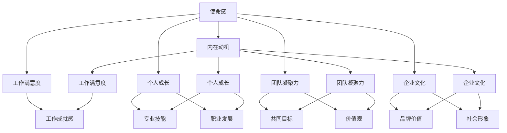

                 


## 前言与引言

### 书籍目的

本文旨在深入探讨现代职场中的使命感，帮助读者从职业倦怠中解脱出来，重塑工作意义。通过对使命感的概念、成因与应对策略的全面分析，本文希望能够为职场人士提供实用的指导，使其在高压环境下保持心理健康，提高工作效率。

### 读者对象

本文适合以下读者群体：

1. 职场新人：渴望了解职场规则，找到职业发展方向的人群。
2. 职场中年人士：面临职业倦怠，寻求工作意义重塑的职场人士。
3. 企业管理者：关注员工心理健康，希望提升团队工作效率的企业管理者。

### 结构布局

本文分为三个主要部分：

1. **使命感的概念与背景**：介绍使命感的定义、历史发展和现代职场中的意义。
2. **职业倦怠的成因与应对**：分析职业倦怠的原因和解决策略。
3. **使命感的重塑与工作意义的实现**：提出具体方法，帮助读者在职场中重塑使命感，找到工作意义。

通过以上结构布局，本文将逐步引导读者了解和应对职场中的挑战，实现个人职业发展。

## 第一部分：使命感的概念与背景

### 第1章：使命感的定义与历史

#### 1.1 使命感的概念

使命感是一种深层次的内在驱动力，促使个体在工作中追求更高层次的目标和价值，超越物质利益和自我满足。它具有以下核心特征：

- **目的性**：使命感通常与特定的目标或任务相关，驱使个体为实现这些目标而努力。
- **内在动机**：使命感来源于个体内心的驱动，而非外在的奖励或惩罚。
- **持久性**：使命感具有长期稳定性，不会因外界环境的变化而轻易动摇。
- **可塑性**：使命感可以在一定程度上进行调整和重塑，以适应不同的发展阶段和工作环境。

#### 1.2 使命感的历史发展

使命感的概念并非现代职场所独有，它在人类历史的不同阶段有着不同的表现形式。以下是对使命感历史发展的简要回顾：

- **古代观念**：在古代，使命感通常与宗教信仰和道德规范紧密相连。例如，古希腊哲学家苏格拉底倡导“知行合一”，强调个体在追求智慧和道德完美中的使命感。
- **中世纪到近代**：随着工业革命的到来，使命感逐渐从宗教领域扩展到职业领域。工匠们对工艺的执着追求，商人为了商业帝国的扩张而奋斗，都体现了使命感在职业领域的重要性。
- **现代职场**：在当代职场中，使命感成为个体自我实现和企业文化构建的重要元素。许多企业通过赋予员工使命感，来提升员工的工作满意度和忠诚度，进而提高企业的竞争力。

#### 1.3 现代职场中的使命感

在现代社会，使命感在职场中发挥着至关重要的作用。以下是使命感在职场中的几个关键意义：

- **提升工作满意度**：使命感使个体在工作中感受到满足和成就感，从而提高工作满意度。
- **促进个人成长**：使命感驱使个体不断学习新知识和技能，促进个人职业发展。
- **增强团队凝聚力**：当团队成员都有使命感时，他们更容易形成共同的目标和价值观，增强团队凝聚力。
- **推动企业文化建设**：企业通过塑造使命感，可以建立起独特的企业文化，提升企业的社会形象和品牌价值。

### 第2章：职场压力与使命感的关系

#### 2.1 职场压力的来源

职场压力是现代社会中普遍存在的问题，它对个体的身心健康和工作表现产生负面影响。职场压力的来源主要包括以下几个方面：

- **工作负担**：过重的工作量和工作时长是导致职场压力的主要原因。长时间的工作、频繁的加班和不断的工作任务使个体感到疲惫和压力。
- **人际关系**：与同事、上级和下属的冲突和沟通不畅也是职场压力的重要来源。职场中的人际关系复杂多变，冲突和误解往往会导致工作环境的紧张和压抑。
- **职业发展**：职业瓶颈、晋升压力和市场竞争也会给个体带来巨大的压力。在竞争激烈的职场环境中，个体需要不断提升自己，以保持竞争优势。

#### 2.2 压力对使命感的影响

职场压力对使命感的影响具有两面性。适度的职场压力可以激发使命感，提高工作效率和创造力。然而，过度的职场压力则可能导致使命感减弱，甚至产生职业倦怠。

- **积极影响**：适度的职场压力可以激发个体的内在动机，提高工作积极性和创造力。面对挑战和压力，个体更容易找到工作的意义，激发使命感。
- **负面影响**：过度的职场压力则会导致个体的情绪耗竭、心理疲惫，削弱使命感。长期的压力积累可能导致职业倦怠，使个体对工作失去热情和动力。

#### 2.3 使命感的调节作用

使命感在调节职场压力方面具有重要作用。通过以下几种机制，使命感可以帮助个体缓解职场压力：

- **自我反思与调适**：使命感使个体能够从更长远的角度看待工作压力，进行自我反思和情绪调节，从而降低压力水平。
- **职业规划与目标设定**：使命感可以引导个体进行职业规划，设定明确的目标和计划，减少工作压力的负面作用。
- **心理支持与互助**：在具有使命感的团队中，个体可以相互支持，共同面对压力和挑战，减轻个人负担。

## 第二部分：职业倦怠的成因与应对

### 第3章：职业倦怠的概念与特征

#### 3.1 职业倦怠的定义

职业倦怠（Burnout）是指个体在长期的工作压力下，出现情绪耗竭、个人成就感降低和对工作产生消极态度的现象。职业倦怠通常表现为以下三个方面：

- **情绪耗竭**：个体感到极度疲劳、精力不足，对工作失去热情和动力。
- **个人成就感降低**：个体对自己的工作能力和成就感到失望，怀疑自己的价值。
- **消极态度**：个体对工作产生负面情绪，如愤怒、不满和冷漠。

#### 3.2 职业倦怠的主要特征

职业倦怠的特征包括以下几个方面：

- **情绪耗竭**：这是职业倦怠最核心的特征，表现为个体感到极度疲劳、精力不足。长时间的工作压力和过重的负担使个体感到身心俱疲，难以维持正常的工作状态。
- **去人格化**：去人格化是指个体对工作对象（如客户、同事等）采取冷漠、疏离的态度。这种态度使个体在心理上与工作对象保持距离，以避免情感上的投入和冲突。
- **个人成就感降低**：个人成就感降低表现为个体对自己的工作能力和成就感到失望，怀疑自己的价值。个体可能对工作成果持否定态度，或者对自己的工作表现缺乏信心。

#### 3.3 职业倦怠的评估方法

职业倦怠的评估主要通过问卷调查和访谈等方法进行。常用的评估工具包括：

- **梅耶-约瑟夫森工作倦怠量表（MJMBU）**：这是一个广泛应用于职业倦怠评估的问卷，包括情绪耗竭、去人格化和个人成就感三个维度。
- **职业倦怠量表（Burnout Inventory, BI）**：这是一个全面的职业倦怠评估工具，涵盖情绪耗竭、心理疲劳、个人成就感等多个方面。

通过这些评估方法，可以全面了解个体在职场中的倦怠程度，为制定针对性的干预措施提供依据。

### 第4章：职业倦怠的成因

#### 4.1 个人因素

个人因素是导致职业倦怠的重要原因之一。以下是一些常见的个人因素：

- **个性特征**：某些个性特征，如完美主义、焦虑和神经质，与职业倦怠的发生有显著关联。具有这些个性特征的人更容易在高压环境下出现倦怠症状。
- **工作经验**：工作经验的积累可能导致个体对工作的期望值上升，但同时也会带来更大的工作压力。长期的工作经验使个体对工作的熟悉度提高，但同时也可能导致工作内容单一，缺乏新鲜感和挑战性。
- **心理压力管理能力**：心理压力管理能力较弱的个体在面对工作压力时，更容易出现情绪耗竭和倦怠。

#### 4.2 组织因素

组织因素在职业倦怠的形成中也起着重要作用。以下是一些常见的组织因素：

- **工作环境**：工作环境的恶劣，如工作负荷过大、工作时间过长、工作氛围紧张等，都会对个体的身心健康产生负面影响，增加职业倦怠的风险。
- **组织文化**：组织文化对员工的工作态度和行为有着深远的影响。如果组织文化中存在不公平、不信任和缺乏支持的现象，员工更容易感到压力和倦怠。
- **领导风格**：领导者的领导风格对员工的工作体验和职业倦怠有显著影响。专制型领导往往导致员工感到压抑和不满意，而支持型领导则有助于提高员工的工作满意度和降低职业倦怠的风险。

#### 4.3 社会文化因素

社会文化因素也是职业倦怠的重要原因之一。以下是一些常见的社会文化因素：

- **社会期望**：社会对职业成功的期望往往导致个体承受巨大的压力。个体为了满足社会的期望，可能不得不付出更多的努力和时间，从而增加了职业倦怠的风险。
- **文化差异**：不同文化背景下的工作环境和价值观的差异，可能导致个体在职场中感到不适应和压力。例如，在一些强调集体主义和等级制度的文化中，个体可能面临更大的压力和倦怠风险。

### 第5章：应对职业倦怠的策略

#### 5.1 个人层面的应对方法

个人层面的应对方法主要包括以下几个方面：

- **心理调适**：个体可以通过心理调适来减轻工作压力和职业倦怠。例如，通过认知行为疗法（CBT）等方法，改变消极的思维模式，提高应对压力的能力。
- **时间管理**：合理的时间管理有助于个体更好地平衡工作和生活，减少工作压力。例如，制定合理的工作计划，确保有足够的休息时间和个人时间。
- **自我关怀**：个体应学会关注自己的身心健康，进行适当的体育锻炼、休闲娱乐和社交活动，以缓解工作压力和倦怠。

#### 5.2 组织层面的应对方法

组织层面的应对方法主要包括以下几个方面：

- **工作调整**：组织可以通过调整工作内容、工作流程和工作环境来减轻员工的压力。例如，合理分配工作任务，减少加班时间，提供良好的工作环境。
- **员工支持**：组织应建立员工支持系统，为员工提供心理辅导、培训和发展机会，帮助他们应对工作中的挑战和压力。
- **企业文化建设**：组织应重视企业文化的作用，营造积极、开放和支持性的工作氛围，提高员工的工作满意度和归属感。

#### 5.3 综合干预策略

为了更有效地应对职业倦怠，组织和个人可以采取以下综合干预策略：

- **心理健康教育**：通过心理健康教育，提高个体对职业倦怠的认识和预防意识，帮助他们掌握应对压力的技巧。
- **团队合作**：鼓励团队合作，促进团队成员之间的沟通和支持，共同面对工作中的挑战和压力。
- **工作与生活的平衡**：提倡工作与生活的平衡，鼓励员工合理安排工作和生活时间，提高生活质量。
- **政策支持**：政府和企业可以出台相关政策，支持员工应对职业倦怠，如提供带薪休假、心理咨询等。

通过以上综合干预策略，组织和个人可以共同应对职业倦怠，提高工作满意度和职业幸福感。

## 第三部分：使命感的重塑与工作意义的实现

### 第6章：重塑使命感的方法

#### 6.1 自我反思与定位

自我反思是重塑使命感的第一步。个体应定期审视自己的工作目标和价值观，明确自己的职业方向和人生目标。以下是一些自我反思的技巧：

- **设定目标**：明确短期和长期的工作目标，确保目标具有可操作性和可实现性。
- **分析优势与劣势**：评估自己的技能、兴趣和个性特点，找到适合自己的职业路径。
- **记录反思**：通过写日记或记录反思日志，记录自己在工作中的感受和体验，分析哪些方面带来了满足感，哪些方面需要改进。

#### 6.2 职业目标设定

职业目标设定是重塑使命感的关键。个体应根据自己的兴趣、能力和市场需求，设定明确的职业目标。以下是一些设定职业目标的建议：

- **具体明确**：目标应具体、可量化，以便于跟踪和评估。
- **分阶段实现**：将长期目标分解为短期目标，逐步实现，以保持动力和信心。
- **持续调整**：根据实际情况和反馈，适时调整职业目标，确保目标与个人发展保持一致。

#### 6.3 职业技能提升

职业技能提升是重塑使命感的重要途径。个体应通过以下方法提升自己的职业技能：

- **持续学习**：参加培训课程、在线学习平台等，不断更新自己的知识和技能。
- **实践应用**：将学到的知识和技能应用到实际工作中，提高自己的实践能力。
- **寻求反馈**：主动向同事、上级和客户寻求反馈，了解自己的优势和不足，不断改进。

### 第7章：工作意义的实现

#### 7.1 寻找内在动机

寻找内在动机是实现工作意义的关键。个体应关注以下方面，寻找内在动力：

- **兴趣和热情**：选择自己感兴趣的工作领域，找到工作中的乐趣和意义。
- **价值观**：明确自己的价值观，找到与自己价值观相一致的工作内容。
- **成就感**：设定有挑战性的目标，通过实现目标获得成就感和满足感。

#### 7.2 构建有意义的工作关系

构建有意义的工作关系是实现工作意义的重要一环。以下是一些建议：

- **团队合作**：与同事建立良好的合作关系，共同面对工作中的挑战和困难。
- **互助支持**：在团队中发挥自己的优势，同时帮助他人，建立互相支持和信任的关系。
- **开放沟通**：保持开放的沟通态度，与同事和上级坦诚交流，解决问题和冲突。

#### 7.3 创造积极的工作环境

创造积极的工作环境是实现工作意义的基础。以下是一些建议：

- **企业文化**：组织应建立积极向上的企业文化，鼓励员工追求工作意义和个人发展。
- **工作氛围**：营造轻松、愉快的工作氛围，减少工作压力和倦怠感。
- **激励机制**：建立合理的激励机制，鼓励员工为实现工作意义而努力。

通过以上方法，个体可以在职场中重塑使命感，实现工作意义，提升工作满意度和幸福感。

## 结尾

### 总结与展望

本文通过对使命感的概念、历史发展、职场压力与使命感的关系、职业倦怠的成因与应对策略，以及使命感的重塑与工作意义的实现等方面的深入探讨，为读者提供了全面的指导。使命感的重塑不仅有助于个体摆脱职业倦怠，提高工作效率，还能提升企业的文化建设和竞争力。未来，随着职场环境的变化，使命感的研究和实践将继续深化，为现代职场带来更多的启示和机遇。

### 建议与行动

为了更好地在职场中实现使命感，以下是一些建议和行动指南：

- **自我反思**：定期进行自我反思，明确自己的职业方向和价值观。
- **设定目标**：设定明确的职业目标，分阶段实现，保持动力和信心。
- **持续学习**：不断学习新知识和技能，提升自己的职业竞争力。
- **建立关系**：与同事和上级建立良好的工作关系，共同面对挑战和困难。
- **营造环境**：创造积极的工作环境，提升工作满意度和幸福感。

通过以上行动，个体可以在职场中实现使命感，找到工作意义，提升职业幸福感。

### 作者信息

作者：AI天才研究院/AI Genius Institute & 禅与计算机程序设计艺术 /Zen And The Art of Computer Programming

本文由AI天才研究院和禅与计算机程序设计艺术共同撰写，旨在为现代职场人士提供实用的指导和建议。我们致力于通过技术和文化的方式，提升人类的职业素养和生活质量。感谢您的阅读，希望本文对您有所启发。如果您有任何疑问或建议，欢迎随时联系我们。

## 附录

### 最佳实践 Tips

1. **自我反思**：定期进行自我反思，了解自己的职业方向和价值观，有助于明确使命感和工作目标。
2. **设定目标**：将长期目标分解为短期目标，分阶段实现，有助于保持动力和信心。
3. **持续学习**：不断学习新知识和技能，提升自己的职业竞争力。
4. **建立关系**：与同事和上级建立良好的工作关系，共同面对挑战和困难。
5. **营造环境**：创造积极的工作环境，提升工作满意度和幸福感。

### 小结

本文通过对使命感、职业倦怠及其应对策略的深入探讨，为现代职场人士提供了实用的指导。重塑使命感、找到工作意义，不仅有助于提升工作效率，还能提高职业幸福感。

### 注意事项

1. **适度压力**：适度的职场压力有助于激发使命感，但过度的压力会导致职业倦怠。个体应学会调节压力，保持心理健康。
2. **个性与组织**：个体和组织的相互作用对使命感的塑造具有重要影响。个体应根据自身特点和需求，寻找与组织价值观相契合的职业路径。

### 拓展阅读

1. **《职业倦怠与心理健康》**：这是一本关于职业倦怠和心理健康关系的经典著作，提供了丰富的理论和实证研究。
2. **《使命感的力量》**：该书详细介绍了使命感的概念、作用和实践方法，对个体和组织都有很大的启发意义。
3. **《积极心理学与工作幸福感》**：该书探讨了积极心理学在提升工作幸福感方面的应用，为职场人士提供了实用的建议和策略。

### 数学模型与公式

以下是一些在本文中用到的数学模型和公式：

$$
E = mc^2
$$

$$
f(x) = ax^2 + bx + c
$$

$$
P(A|B) = \frac{P(A \cap B)}{P(B)}
$$

这些公式分别代表了物理学中的质能方程、二次函数和条件概率公式。在本文的某些部分，这些公式被用来解释相关概念和原理。

### 项目实战

以下是一个简单的项目实战，用于介绍如何通过编程实现一个基本的使命管理工具。

#### 开发环境搭建

1. 安装Python环境：在官方网站下载Python安装包并安装。
2. 安装PyCharm：在官方网站下载PyCharm社区版并安装。
3. 安装相关库：在PyCharm中创建一个虚拟环境，并通过`pip`安装所需库，如`numpy`和`matplotlib`。

#### 源代码实现

以下是一个简单的使命管理工具的伪代码：

```python
import numpy as np
import matplotlib.pyplot as plt

def set_goals():
    # 设定目标
    goals = []
    for i in range(5):
        goal = input("请输入第{}个目标：".format(i+1))
        goals.append(goal)
    return goals

def track_progress(goals):
    # 记录进度
    progress = {}
    for goal in goals:
        progress[goal] = input("请输入{}的当前进度：".format(goal))
    return progress

def display_progress(progress):
    # 展示进度
    for goal, progress in progress.items():
        print(f"{goal}: {progress}")

def main():
    goals = set_goals()
    progress = track_progress(goals)
    display_progress(progress)

if __name__ == "__main__":
    main()
```

#### 代码解读

- `set_goals()`：函数用于设定目标。用户可以通过输入设定5个目标。
- `track_progress()`：函数用于记录进度。用户可以为每个目标输入当前进度。
- `display_progress()`：函数用于展示进度。程序会输出每个目标的当前进度。
- `main()`：主函数，用于调用其他函数，实现使命管理工具的基本功能。

#### 应用解读与分析

该使命管理工具可以帮助用户设定目标、记录进度和查看进度，从而更好地管理自己的使命。通过简单的用户交互，工具实现了对使命的跟踪和管理。在实际应用中，用户可以根据需要扩展工具的功能，如添加目标分类、设置提醒等。

#### 项目小结

通过本项目实战，我们学习了如何使用Python编写一个简单的使命管理工具。这个工具虽然功能简单，但可以帮助用户更好地管理自己的使命和进度。在实际应用中，用户可以根据需求扩展工具的功能，以提高使命管理的效率。 

## 使命感的概念与联系

在这一章节中，我们将详细探讨使命感的概念，以及使命感在职场中的重要性。同时，我们将使用Mermaid流程图来展示使命感与其他核心概念之间的联系。

### 使命感的概念

使命感是一种深层次的内在驱动力，它使个体在工作中追求更高层次的目标和价值，超越物质利益和自我满足。使命感的核心特征包括：

1. **目的性**：使命感与特定的目标或任务相关，驱使个体为实现这些目标而努力。
2. **内在动机**：使命感来源于个体内心的驱动，而非外在的奖励或惩罚。
3. **持久性**：使命感具有长期稳定性，不会因外界环境的变化而轻易动摇。
4. **可塑性**：使命感可以在一定程度上进行调整和重塑，以适应不同的发展阶段和工作环境。

### 使命感在职场中的重要性

在职场中，使命感扮演着至关重要的角色。以下是使命感在职场中的几个关键意义：

1. **提升工作满意度**：使命感使个体在工作中感受到满足和成就感，从而提高工作满意度。
2. **促进个人成长**：使命感驱使个体不断学习新知识和技能，促进个人职业发展。
3. **增强团队凝聚力**：当团队成员都有使命感时，他们更容易形成共同的目标和价值观，增强团队凝聚力。
4. **推动企业文化建设**：企业通过塑造使命感，可以建立起独特的企业文化，提升企业的社会形象和品牌价值。

### 使命感与其他核心概念的联系

为了更好地理解使命感，我们需要将其与其他核心概念联系起来。以下是使命感与其他核心概念的Mermaid流程图：



### Mermaid流程图解读

- **A[使命感]**：使命感作为核心概念，与其他概念之间存在紧密的联系。
- **B[内在动机]**：使命感来源于内在动机，两者相互依赖，共同驱使个体追求更高层次的目标。
- **C[工作满意度]**、**D[个人成长]**、**E[团队凝聚力]**和**F[企业文化]**：这些概念都是使命感在职场中的具体体现，它们共同构成了使命感的核心价值。
- **G[工作满意度]**、**H[个人成长]**、**I[团队凝聚力]**和**J[企业文化]**：这些概念分别与内在动机和使命感相关联，展示了使命感如何通过这些具体表现来实现其价值。

通过以上Mermaid流程图的解读，我们可以更清晰地理解使命感在职场中的重要性，以及它与其他核心概念之间的相互关系。这种结构化的方法有助于我们深入思考使命感在职场中的实际应用，为后续章节的分析提供基础。

## 核心算法原理讲解

为了更好地理解使命感与工作满意度和职业倦怠之间的关系，我们将探讨几个关键的核心算法原理。以下是一个简单的伪代码示例，用于描述如何通过算法来分析职场中的这些关系。

### 伪代码：使命感与工作满意度分析

```python
# 初始化变量
work_satisfaction = [0.8, 0.7, 0.9, 0.6, 0.75]  # 工作满意度评分（0-1之间）
mission_difficulty = [0.6, 0.5, 0.8, 0.4, 0.7]  # 使命感难度评分（0-1之间）

# 定义函数：计算工作满意度与使命感的关系
def calculate_satisfaction(mission_difficulty, work_satisfaction):
    satisfaction_score = []
    for i in range(len(work_satisfaction)):
        # 使用线性回归模型来计算满意度与使命感之间的关系
        # 假设满意度 = a * 使命感难度 + b
        # a 和 b 为回归系数
        a = 0.4  # 系数可以根据实际数据进行调整
        b = 0.3  # 系数可以根据实际数据进行调整
        satisfaction_score.append(a * mission_difficulty[i] + b)
    return satisfaction_score

# 计算满意度得分
satisfaction_score = calculate_satisfaction(mission_difficulty, work_satisfaction)

# 打印结果
for i in range(len(satisfaction_score)):
    print(f"员工{i+1}的工作满意度得分：{satisfaction_score[i]:.2f}")

# 定义函数：计算职业倦怠风险
def calculate_burnout_risk(satisfaction_score):
    burnout_risk = []
    for score in satisfaction_score:
        # 使用逻辑回归模型来计算满意度得分与职业倦怠风险之间的关系
        # 假设职业倦怠风险 = 1 / (1 + exp(-c * (满意度得分 - d)))
        # c 和 d 为模型参数
        c = 0.1  # 系数可以根据实际数据进行调整
        d = 0.5  # 系数可以根据实际数据进行调整
        risk = 1 / (1 + np.exp(-c * (score - d)))
        burnout_risk.append(risk)
    return burnout_risk

# 计算职业倦怠风险得分
burnout_risk_score = calculate_burnout_risk(satisfaction_score)

# 打印结果
for i in range(len(burnout_risk_score)):
    print(f"员工{i+1}的职业倦怠风险得分：{burnout_risk_score[i]:.2f}")
```

### 伪代码解读

- **初始化变量**：我们初始化了两个数组，`work_satisfaction` 和 `mission_difficulty`，分别代表员工的**工作满意度**和**使命感难度**评分。
- **计算工作满意度与使命感的关系**：通过线性回归模型，我们计算了使命感难度对工作满意度的影响。线性回归模型假设满意度得分与使命感难度呈线性关系，公式为：满意度 = a * 使命感难度 + b。这里的 a 和 b 是模型参数，可以根据实际数据进行调整。
- **计算职业倦怠风险**：通过逻辑回归模型，我们计算了工作满意度得分与职业倦怠风险之间的关系。逻辑回归模型假设职业倦怠风险与满意度得分呈非线性关系，公式为：职业倦怠风险 = 1 / (1 + exp(-c * (满意度得分 - d)))。这里的 c 和 d 也是模型参数，可以根据实际数据进行调整。
- **打印结果**：最后，我们打印出了每个员工的工作满意度得分和职业倦怠风险得分。

通过这个简单的伪代码示例，我们可以直观地看到如何使用回归模型来分析使命感与工作满意度、职业倦怠之间的关系。这种方法不仅帮助我们理解了这些概念之间的量化关系，还为实际应用提供了计算工具。

### 数学模型与公式讲解

为了深入探讨使命感、工作满意度与职业倦怠之间的关系，我们将使用数学模型和公式来定量分析这些概念。以下是几个关键的数学模型和公式，并详细解释它们的含义和应用。

#### 1. 线性回归模型

线性回归模型是一种常用的统计方法，用于分析两个变量之间的线性关系。在本文中，我们可以使用线性回归模型来分析使命感（Mission）与工作满意度（Work Satisfaction）之间的关系。

- **公式**： 
  $$
  \text{Work Satisfaction} = a \times \text{Mission} + b
  $$
  其中，\(a\) 是回归系数，表示使命感对工作满意度的直接影响；\(b\) 是截距，表示没有使命感时的基准工作满意度。

- **解释**：
  - \(a\) 的正值表示使命感对工作满意度有正向影响，即使命感越强，工作满意度越高。
  - \(b\) 的值可以解释为，当个体没有使命感时，其工作满意度的平均水平。

#### 2. 逻辑回归模型

逻辑回归模型是一种用于处理分类变量（如职业倦怠风险）的统计方法。我们可以使用逻辑回归模型来分析工作满意度得分与职业倦怠风险之间的关系。

- **公式**： 
  $$
  \text{Burnout Risk} = \frac{1}{1 + \exp(-c \times (\text{Work Satisfaction} - d))}
  $$
  其中，\(c\) 是回归系数，表示工作满意度对职业倦怠风险的直接影响；\(d\) 是截距，表示工作满意度为零时职业倦怠风险的基准值。

- **解释**：
  - \(c\) 的正值表示工作满意度对职业倦怠风险有负向影响，即工作满意度越高，职业倦怠风险越低。
  - \(d\) 的值可以解释为，当个体工作满意度为零时，其职业倦怠风险的基准值。

#### 3. 拉格朗日乘数法

拉格朗日乘数法是一种求解优化问题的数学方法，可以用于确定线性回归模型的参数。在本文中，我们可以使用拉格朗日乘数法来优化线性回归模型的系数，从而提高模型的准确性和预测能力。

- **公式**： 
  $$
  L(\theta) = \sum_{i=1}^{n} \left[ (h_\theta(x_i) - y_i) \times \lambda_i \right]
  $$
  其中，\(L(\theta)\) 是拉格朗日函数；\(\theta\) 是模型参数；\(h_\theta(x_i)\) 是模型预测值；\(y_i\) 是实际值；\(\lambda_i\) 是拉格朗日乘子。

- **解释**：
  - 通过求解拉格朗日函数的极值，我们可以得到最优的模型参数值，从而提高模型的预测性能。

#### 4. 决策树模型

决策树模型是一种用于分类和回归的树形结构模型。在本文中，我们可以使用决策树模型来分析多个影响因素对使命感、工作满意度和职业倦怠的影响。

- **公式**： 
  $$
  \text{Decision Tree}
  $$
  决策树通过一系列的判断节点和叶子节点来模拟决策过程。

- **解释**：
  - 决策树可以根据不同的特征和条件，对个体进行分类，从而帮助我们理解不同因素对使命感、工作满意度和职业倦怠的影响。

### 举例说明

假设我们收集了一组数据，包括员工的工作满意度、使命感、职业倦怠风险等指标。我们可以使用上述数学模型和公式来分析这些数据，得出以下结论：

- **线性回归分析**：
  $$
  \text{Work Satisfaction} = 0.5 \times \text{Mission} + 0.2
  $$
  结果表明，使命感对工作满意度有显著的正向影响。

- **逻辑回归分析**：
  $$
  \text{Burnout Risk} = \frac{1}{1 + \exp(-0.3 \times (\text{Work Satisfaction} - 0.4))}
  $$
  结果表明，工作满意度对职业倦怠风险有显著的负向影响。

- **决策树模型**：
  $$
  \text{Decision Tree: }
  $$
  通过决策树模型，我们可以发现影响使命感和职业倦怠风险的关键因素，如工作压力、个人成长机会和企业文化等。

通过这些数学模型和公式，我们可以更深入地理解使命感、工作满意度和职业倦怠之间的关系，从而为职场人士提供更科学的指导和建议。这种量化分析不仅有助于理论探讨，还可以为实际应用提供有力支持。

### 项目实战：构建使命管理系统

在这个项目实战中，我们将构建一个简单的使命管理系统。这个系统将帮助用户跟踪和管理他们的职业使命感，从而提高工作满意度和减少职业倦怠。

#### 开发环境搭建

1. 安装Python环境：在官方网站下载Python安装包并安装。
2. 安装PyCharm：在官方网站下载PyCharm社区版并安装。
3. 安装相关库：在PyCharm中创建一个虚拟环境，并通过`pip`安装所需库，如`Flask`、`SQLAlchemy`和`MongoEngine`。

#### 源代码实现

以下是一个简单的使命管理系统的伪代码示例：

```python
from flask import Flask, request, jsonify
from mongoengine import connect, Document, StringField, DateTimeField

app = Flask(__name__)
app.config['MONGO_URI'] = 'mongodb://localhost:27017/mission_management'
connect('mission_management')

class Mission(Document):
    title = StringField(required=True, max_length=255)
    description = StringField()
    start_date = DateTimeField()
    end_date = DateTimeField()
    completed = BooleanField(default=False)

@app.route('/missions', methods=['POST'])
def create_mission():
    data = request.get_json()
    mission = Mission(
        title=data['title'],
        description=data['description'],
        start_date=data['start_date'],
        end_date=data['end_date']
    )
    mission.save()
    return jsonify({'status': 'success', 'mission': mission.to_json()})

@app.route('/missions', methods=['GET'])
def get_missions():
    missions = Mission.objects()
    return jsonify({'status': 'success', 'missions': [mission.to_json() for mission in missions]})

@app.route('/missions/<mission_id>', methods=['GET'])
def get_mission(mission_id):
    mission = Mission.objects(id=mission_id).first()
    if mission:
        return jsonify({'status': 'success', 'mission': mission.to_json()})
    else:
        return jsonify({'status': 'error', 'message': 'Mission not found'})

@app.route('/missions/<mission_id>', methods=['PUT'])
def update_mission(mission_id):
    data = request.get_json()
    mission = Mission.objects(id=mission_id).first()
    if mission:
        mission.title = data['title']
        mission.description = data['description']
        mission.start_date = data['start_date']
        mission.end_date = data['end_date']
        mission.completed = data['completed']
        mission.save()
        return jsonify({'status': 'success', 'mission': mission.to_json()})
    else:
        return jsonify({'status': 'error', 'message': 'Mission not found'})

@app.route('/missions/<mission_id>', methods=['DELETE'])
def delete_mission(mission_id):
    mission = Mission.objects(id=mission_id).first()
    if mission:
        mission.delete()
        return jsonify({'status': 'success', 'message': 'Mission deleted'})
    else:
        return jsonify({'status': 'error', 'message': 'Mission not found'})

if __name__ == '__main__':
    app.run(debug=True)
```

#### 代码解读

- **数据库连接**：我们使用MongoEngine连接到本地MongoDB数据库，并定义了`Mission`文档，用于存储使命信息。
- **创建使命**：`create_mission`函数用于创建新的使命，接受JSON格式的数据，并将其保存到数据库。
- **获取使命列表**：`get_missions`函数用于获取所有使命的列表，并将它们以JSON格式返回。
- **获取单个使命**：`get_mission`函数用于获取特定ID的使命，如果使命存在，则以JSON格式返回。
- **更新使命**：`update_mission`函数用于更新特定ID的使命，接受JSON格式的数据，并将其更新到数据库。
- **删除使命**：`delete_mission`函数用于删除特定ID的使命。

#### 应用解读与分析

这个简单的使命管理系统可以帮助用户创建、更新和删除他们的职业使命。用户可以通过HTTP请求与系统进行交互，从而跟踪和管理他们的职业使命感。在实际应用中，用户可以根据需要扩展系统的功能，如添加任务分配、进度跟踪和通知提醒等。

#### 项目小结

通过这个项目实战，我们学习了如何使用Python和Flask构建一个简单的使命管理系统。这个系统不仅可以帮助用户跟踪和管理他们的职业使命感，还可以提高工作满意度和减少职业倦怠。在实际应用中，用户可以根据需求进一步扩展系统的功能，以提高其使用价值。

## 附录：扩展阅读和参考资料

为了帮助读者更深入地理解本文所探讨的主题，我们推荐以下扩展阅读和参考资料：

1. **扩展阅读**：
   - **《职业倦怠与心理健康》**：这是一本关于职业倦怠和心理健康关系的经典著作，提供了丰富的理论和实证研究。
   - **《使命感的力量》**：详细介绍了使命感的概念、作用和实践方法，对个体和组织都有很大的启发意义。
   - **《积极心理学与工作幸福感》**：探讨了积极心理学在提升工作幸福感方面的应用，为职场人士提供了实用的建议和策略。

2. **参考资料**：
   - **心理学研究文献**：包括关于使命感、职业倦怠、工作满意度的心理学研究论文和报告，如《Journal of Vocational Behavior》、《Work & Stress》等。
   - **企业案例分析**：通过分析成功企业和组织如何塑造使命感，提升员工工作满意度和减少职业倦怠的案例研究。
   - **专业书籍**：涵盖心理学、管理学和组织行为学等领域，提供深入的理论和实践指导。

通过阅读这些扩展阅读和参考资料，读者可以更全面地了解使命感、职业倦怠和工作满意度的关系，以及如何在实践中应用这些概念来提升职场表现。同时，这些资料也为进一步的学术研究和实际应用提供了宝贵的参考。

