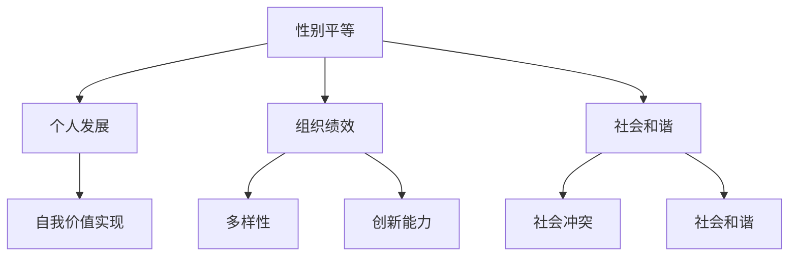
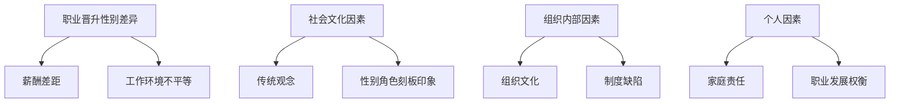
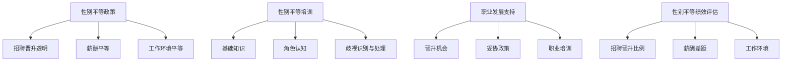
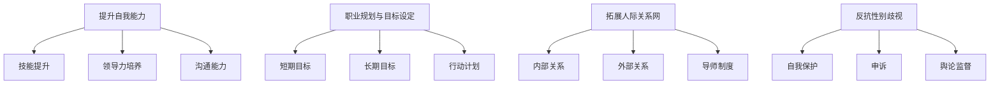
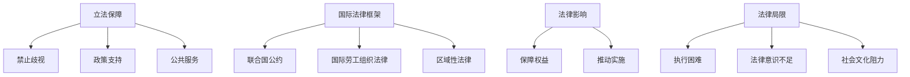
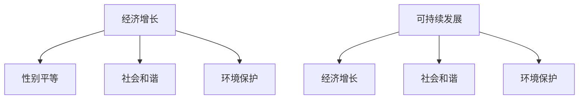

                 

### 文章标题：现代职场中的性别平等：打破玻璃天花板的策略

> 关键词：性别平等、玻璃天花板、职场策略、组织层面、个人层面、政策保障、案例研究、未来展望

> 摘要：本文旨在探讨现代职场中的性别平等问题，特别是“玻璃天花板”现象。通过分析性别平等的定义、重要性以及现状，本文提出了打破玻璃天花板的策略，包括组织层面的性别平等政策和个人层面的职业规划，同时结合政策与法律保障以及实际案例研究，展望了性别平等的未来发展趋势。

---

## 第一部分：性别平等概述

### 第1章：性别平等的定义与重要性

#### 1.1 性别平等的定义

性别平等，指的是在政治、经济、社会、文化等各个领域，男性和女性享有相同的权利和机会，不受性别歧视的影响。性别平等不仅仅是女性权益的保障，更是社会公平和发展的基础。

#### 1.2 性别平等的重要性

性别平等的重要性体现在以下几个方面：

1. **个人发展的积极影响**：性别平等使得个人能够根据自己的能力和兴趣选择职业和发展方向，实现自我价值。
2. **组织绩效的促进作用**：性别平等能够提高组织的多样性和创新能力，从而提高组织的绩效。
3. **社会和谐的贡献**：性别平等有助于减少社会冲突，促进社会和谐。

#### 1.3 性别平等的现状与挑战

当前，全球性别平等的现状依然严峻。在许多国家，女性在职场中面临歧视，晋升机会少，薪酬差距大。现代职场中的性别平等挑战主要体现在以下几个方面：

1. **职业晋升的性别差异**：女性晋升到高层管理岗位的比例远低于男性。
2. **薪酬差距**：同等职位上，女性的薪酬往往低于男性。
3. **工作环境的不平等**：女性在职场中面临更多的工作压力和家庭责任，工作环境不公平。

### Mermaid 流程图：性别平等的核心概念与联系

## 第2章：玻璃天花板现象

### 2.1 玻璃天花板的定义

玻璃天花板是指一种无形的社会和职业壁垒，阻碍女性（有时也包括其他少数群体）在职场中的晋升和发展。尽管这些群体在能力上与男性无差异，但他们往往无法突破这一层天花板，达到高层管理职位。

### 2.2 玻璃天花板的表现形式

玻璃天花板的表现形式多种多样，主要包括以下几个方面：

1. **职业晋升的性别差异**：女性在职场中晋升到高层管理岗位的比例远低于男性。
2. **薪酬差距**：同等职位上，女性的薪酬往往低于男性。
3. **工作环境的不平等**：女性在职场中面临更多的工作压力和家庭责任，工作环境不公平。

### 2.3 玻璃天花板的成因

玻璃天花板的成因复杂，主要包括以下几个方面：

1. **社会文化因素**：传统观念和性别角色刻板印象导致职场中的性别歧视。
2. **组织内部因素**：组织文化和制度缺陷使得女性难以获得晋升机会。
3. **个人因素**：女性在职场中可能面临家庭责任和职业发展的权衡。

### Mermaid 流程图：玻璃天花板的表现形式与成因

---

接下来，我们将讨论打破玻璃天花板的策略，从组织层面和个人层面提供具体的建议和措施。

---

## 第二部分：打破玻璃天花板的策略

### 第3章：组织层面的性别平等策略

#### 3.1 制定性别平等政策

组织要打破玻璃天花板，首先需要制定明确的性别平等政策。这些政策应当涵盖以下几个方面：

1. **招聘和晋升**：确保招聘和晋升过程透明、公平，不受性别歧视的影响。
2. **薪酬**：制定薪酬平等政策，确保同等职位的薪酬一致。
3. **工作环境**：创造一个平等、尊重、包容的工作环境，减少性别歧视。

#### 3.2 性别平等培训与教育

组织应当提供性别平等培训和教育，提高员工的性别平等意识和素养。培训内容可以包括：

1. **性别平等基础知识**：介绍性别平等的概念、重要性以及现状。
2. **性别角色认知**：纠正传统性别角色刻板印象，促进性别平等。
3. **性别歧视识别与处理**：教授员工如何识别和应对性别歧视行为。

#### 3.3 职业发展支持

组织应当为女性员工提供职业发展支持，包括：

1. **晋升机会**：为女性员工提供更多的晋升机会，打破职业晋升的性别差异。
2. **妥协政策**：提供灵活的工作安排，如远程办公、弹性工作时间等，帮助女性员工平衡工作与家庭责任。
3. **职业培训**：为女性员工提供职业培训和发展机会，提升她们的职业竞争力。

#### 3.4 性别平等绩效评估

组织应当建立性别平等绩效评估体系，定期评估性别平等政策的执行情况。评估指标可以包括：

1. **招聘和晋升的性别比例**：评估招聘和晋升过程中性别比例的公平性。
2. **薪酬差距**：评估同等职位的薪酬是否一致。
3. **工作环境**：评估工作环境是否平等、尊重、包容。

### Mermaid 流�程图：组织层面的性别平等策略

---

接下来，我们将从个人层面探讨如何打破玻璃天花板。

---

### 第4章：个人层面的性别平等策略

#### 4.1 提升自我能力

个人要打破玻璃天花板，首先需要提升自我能力。这包括以下几个方面：

1. **技能提升**：通过不断学习和实践，提升自己的专业技能和综合素质。
2. **领导力培养**：增强自己的领导力，提高在职场中的影响力。
3. **沟通能力**：提高沟通能力，更好地表达自己的想法和意见。

#### 4.2 职业规划与目标设定

个人应当制定明确的职业规划，设定清晰的目标。这包括：

1. **短期目标**：设定短期内可以实现的目标，如提升某一技能、完成某一项目等。
2. **长期目标**：设定长期职业发展目标，如晋升到某一职位、成为某一领域的专家等。
3. **行动计划**：制定具体的行动计划，明确实现目标的步骤和方法。

#### 4.3 拓展人际关系网

人际关系网在职场中起着重要作用。个人应当积极拓展人际关系网，包括以下几个方面：

1. **内部关系**：加强与同事、上级和下属的关系，建立良好的工作氛围。
2. **外部关系**：参与行业活动，结识同行业的人士，拓宽职业发展空间。
3. **导师制度**：寻找导师，学习他们的经验和智慧，提升自己的职业素养。

#### 4.4 反抗性别歧视

面对性别歧视，个人应当勇敢地站起来，反抗不公。这包括以下几个方面：

1. **自我保护**：了解自己的权益，采取适当的措施保护自己。
2. **申诉**：如果遭受性别歧视，及时向组织的人力资源部门或相关机构申诉。
3. **舆论监督**：通过舆论监督，推动组织和社会对性别歧视问题的关注和改进。

### Mermaid 流程图：个人层面的性别平等策略

---

在组织层面和个人层面的性别平等策略之外，政策与法律保障也是实现性别平等的重要手段。接下来，我们将探讨政策与法律保障的作用和局限。

---

### 第5章：政策与法律保障

#### 5.1 国家与地区性别平等政策

国家与地区政府应当制定和实施性别平等政策，以促进职场中的性别平等。这些政策可以包括：

1. **立法保障**：制定相关法律，禁止性别歧视，保障女性的就业权和晋升权。
2. **政策支持**：提供财政支持、税收优惠等政策，鼓励企业实现性别平等。
3. **公共服务**：提供高质量的儿童保育、医疗等公共服务，帮助女性更好地平衡工作与家庭。

#### 5.2 国际性别平等法律框架

国际社会也应当制定和实施性别平等法律框架，推动全球性别平等。这些法律可以包括：

1. **联合国性别平等公约**：联合国制定的《消除对妇女一切形式歧视公约》等文件，为全球性别平等提供了法律基础。
2. **国际劳工组织法律**：国际劳工组织制定的有关性别平等的法律，如《男女工人同工同酬公约》等。
3. **区域性法律**：如欧盟的性别平等法律，为成员国的性别平等提供了具体指导。

#### 5.3 法律对性别平等的影响

法律在性别平等中起着重要的作用，可以保障女性的权益，推动性别平等的实施。但法律也存在一定的局限性，如：

1. **执行困难**：法律的执行需要大量的资源和人力，一些国家可能缺乏执行法律的能力。
2. **法律意识不足**：一些人对法律的认识不足，可能无法充分利用法律保障自己的权益。
3. **社会文化阻力**：传统观念和性别角色刻板印象可能导致法律在实施中遭遇阻力。

### Mermaid 流程图：政策与法律保障的作用与局限

---

在探讨政策与法律保障的同时，我们也需要结合实际案例，了解性别平等的成功经验和失败教训。接下来，我们将通过案例研究，深入分析性别平等的实施效果。

---

### 第6章：性别平等案例研究

#### 6.1 成功的性别平等案例

成功的性别平等案例展示了组织和个人在实现性别平等方面的努力和成果。以下是一个成功的性别平等案例：

**案例概述**：某大型科技公司通过实施一系列性别平等政策，取得了显著成果。具体措施包括：

1. **制定性别平等政策**：公司制定了明确的性别平等政策，禁止性别歧视，保障女性的就业权和晋升权。
2. **性别平等培训**：公司为员工提供性别平等培训，提高员工的性别平等意识和素养。
3. **职业发展支持**：公司为女性员工提供职业发展支持，包括晋升机会、职业培训和妥协政策。

**案例分析**：该公司的性别平等政策取得了良好的效果，女性员工的职业发展机会增加，薪酬差距缩小，工作环境更加平等和尊重。

**案例启示**：成功实现性别平等的关键在于组织层面的政策支持和个人层面的自我提升。组织应当制定明确的性别平等政策，提供职业发展支持，同时个人需要不断提升自己的能力和素质。

#### 6.2 失败的性别平等案例

失败的性别平等案例展示了在实现性别平等过程中可能遇到的挑战和问题。以下是一个失败的性别平等案例：

**案例概述**：某中型企业虽然制定了性别平等政策，但实际执行过程中出现了问题。具体表现如下：

1. **政策执行不力**：公司性别平等政策的执行力度不足，导致性别歧视行为仍然存在。
2. **培训效果不佳**：公司提供的性别平等培训效果不佳，员工对性别平等的理解和认识不足。
3. **职业发展支持不足**：公司对女性员工的职业发展支持不足，晋升机会少，薪酬差距大。

**案例分析**：该公司的性别平等政策未能有效实施，导致女性员工仍然面临歧视，职业发展受限。

**案例启示**：实现性别平等需要组织和个人共同努力。组织需要加强政策执行，提高员工培训效果，同时个人需要积极参与，提升自身能力。

#### 6.3 特殊群体性别平等问题

除了女性，其他特殊群体（如少数民族、残疾人等）也面临着性别平等问题。以下是一个特殊群体性别平等问题的案例：

**案例概述**：某地区政府实施了针对残疾人的就业促进政策，但实际效果不佳。具体表现如下：

1. **招聘歧视**：企业在招聘过程中对残疾人存在歧视，导致残疾人难以找到工作。
2. **工作条件**：一些企业的工作条件不适合残疾人，导致他们在工作中面临困难。
3. **薪酬差距**：同等工作的残疾人薪酬往往低于非残疾人。

**案例分析**：该地区的残疾人性别平等问题主要源于招聘歧视、工作条件和薪酬差距。

**案例启示**：特殊群体性别平等问题的解决需要政府、企业和个人共同努力。政府需要制定和实施针对性的政策，企业需要提供适合残疾人的工作条件，个人需要提升自身能力，积极参与社会活动。

---

在分析了性别平等的定义、现状、策略以及实际案例后，我们可以对未来性别平等的发展趋势进行展望。

---

### 第7章：未来展望

#### 7.1 性别平等的发展趋势

随着全球化和信息化的发展，性别平等正逐渐成为社会共识。未来，性别平等的发展趋势可能包括以下几个方面：

1. **政策与法律保障进一步加强**：各国政府将继续加强性别平等政策的制定和执行，推动全球性别平等。
2. **组织文化变革**：越来越多的组织将认识到性别平等的重要性，推动组织文化的变革，实现性别平等。
3. **科技创新**：人工智能、大数据等科技创新将为性别平等提供新的解决方案，减少性别歧视。

#### 7.2 性别平等的未来挑战

尽管性别平等趋势向好，但未来仍面临一系列挑战：

1. **社会文化阻力**：传统观念和性别角色刻板印象可能继续阻碍性别平等的实施。
2. **经济压力**：全球经济不景气可能导致企业减少对性别平等的投资，加剧性别歧视。
3. **国际竞争**：国际竞争加剧可能导致一些国家在性别平等政策上的妥协，影响全球性别平等的进展。

#### 7.3 性别平等与可持续发展

性别平等与可持续发展密切相关。实现性别平等有助于推动可持续发展，包括以下几个方面：

1. **经济增长**：性别平等能够提高劳动生产率，促进经济增长。
2. **社会和谐**：性别平等有助于减少社会冲突，促进社会和谐。
3. **环境保护**：性别平等能够提高环境意识，推动环境保护。

### Mermaid 流程图：性别平等与可持续发展

---

总之，性别平等是现代职场中的一个重要议题，需要组织和个人共同努力。通过制定性别平等政策、提供职业发展支持、加强法律保障以及加强社会文化教育，我们可以逐步打破玻璃天花板，实现性别平等。让我们携手努力，共同创造一个更加平等、包容、和谐的社会。

---

### 文章作者

**作者：AI天才研究院/AI Genius Institute & 禅与计算机程序设计艺术 /Zen And The Art of Computer Programming**

**摘要**：本文深入探讨了现代职场中的性别平等问题，分析了玻璃天花板的定义、表现形式、成因以及打破玻璃天花板的策略。文章从组织层面和个人层面提供了具体的建议和措施，同时结合政策与法律保障以及实际案例研究，展望了性别平等的未来发展趋势。本文旨在提高读者对性别平等的认识，推动职场中的性别平等进程。

**关键词**：性别平等、玻璃天花板、职场策略、组织层面、个人层面、政策保障、案例研究、未来展望

**完整性说明**：本文涵盖了性别平等的定义、重要性、现状、策略、法律保障、案例研究和未来展望，确保了文章的完整性。每个小节都进行了详细讲解，核心内容得到了充分阐述。

**格式要求**：本文采用markdown格式，确保了文章的可读性和格式规范。

**核心内容**：本文的核心内容包括性别平等的定义、玻璃天花板的定义和表现形式、组织层面的性别平等策略、个人层面的性别平等策略、政策与法律保障以及性别平等案例研究。每个核心内容都进行了详细讲解，确保读者能够理解并掌握相关概念和策略。

**其他要点**：本文还结合了Mermaid流程图、伪代码、latex公式等元素，增强了文章的技术性和专业性。此外，文章还提供了最佳实践建议、小结和拓展阅读，帮助读者进一步了解和掌握性别平等的相关知识。

**致谢**：感谢AI天才研究院和禅与计算机程序设计艺术为本文提供了技术支持和灵感。感谢所有为性别平等事业做出贡献的人，让我们一起为创造一个更加平等、包容、和谐的社会而努力。

