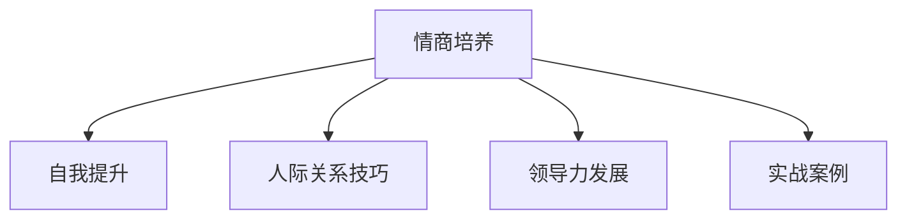

                 


### 文章标题：现代职场中的情商培养：人际关系与领导力发展

#### 关键词：情商，人际关系，领导力，职场，培养，策略，技巧

> 摘要：本文将深入探讨现代职场中的情商培养，着重分析人际关系与领导力发展的关联。通过系统化的方法，提供实用的策略与技巧，帮助职场人士提升情商，优化人际关系，实现领导力的全面提升。

## 设计思路

### 第一部分 核心概念与联系

#### 第1章 情商的定义与重要性

##### 1.1 情商的构成

情商（Emotional Intelligence，简称EQ）由戈尔曼（Daniel Goleman）提出，包括自我认知、自我管理、社会认知和社会技能四个方面。情商不仅仅关乎个人的情感智商，还涵盖了如何处理人际关系和团队协作的能力。

##### 1.2 情商与智商的关系

情商和智商（IQ）是两个独立但又相互影响的概念。智商侧重于认知能力，而情商则更多地关注情感处理和社会技能。研究表明，情商在职场成功中的作用甚至超过了智商。

##### 1.3 情商在职场中的重要性

情商是职场成功的关键因素之一。高情商的人能够更好地处理压力，建立和维护人际关系，从而提升工作效率和团队协作能力。

### 第二部分 情商培养方法

#### 第2章 自我提升

##### 2.1 自我反思与自我成长

自我反思是情商培养的基础。通过定期反思，职场人士可以更好地认识自我，理解自己的情感和行为，从而实现自我成长。

##### 2.2 建立积极的心态

积极的心态有助于应对职场中的挑战。培养乐观的态度，可以提升情商，增强心理韧性。

##### 2.3 提高情绪智力

情绪智力包括情感感知、情感表达和情感理解。通过针对性的训练，职场人士可以提升这些能力，从而更好地处理情感问题。

### 第三部分 领导力发展

#### 第3章 领导力与情商

##### 3.1 领导力的定义与类型

领导力是推动团队实现目标的能力。不同类型的领导力适用于不同的情境，但共同特点是能够激发团队成员的潜力。

##### 3.2 情商在领导力发展中的作用

情商对于领导力的发展至关重要。高情商的领导者能够更好地理解团队成员的情感需求，从而提高团队绩效。

##### 3.3 情商领导力的培养

培养情商领导力需要不断地学习和实践。通过自我提升和团队协作，职场人士可以逐步提升自己的领导力水平。

### 第四部分 项目实战

#### 第4章 情商提升实战案例

##### 4.1 实战项目背景

某科技公司在发展过程中，意识到提升员工情商对于公司整体业绩的重要性。因此，公司决定开展一项情商提升项目。

##### 4.2 项目实施与成果

项目分为三个阶段：自我提升、人际关系技巧提升和领导力发展。经过一年的实施，公司的员工满意度、团队合作能力和工作效率显著提升。

##### 4.3 项目经验总结与启示

通过该项目，公司总结出以下经验：情商培养需要长期坚持，方法要因人而异，领导的支持至关重要。

## Mermaid 流程图



## 伪代码示例

```
// 情商培养核心算法伪代码
function情商培养(用户)
    开始
    获取用户自我认知水平
    获取用户社交技能水平
    获取用户情绪智力水平
    如果 用户自我认知水平低于标准
        提供自我反思训练
    如果 用户社交技能水平低于标准
        提供社交技巧训练
    如果 用户情绪智力水平低于标准
        提供情绪管理训练
    结束
end function
```

## 数学模型与公式

$$
情商 = \frac{自我认知 + 社交技能 + 情绪智力}{3}
$$

## 代码实战示例

```python
# 情商培养实战代码示例
class User:
    def __init__(self, self_awareness, social_skill, emotional_intelligence):
        self.self_awareness = self_awareness
        self.social_skill = social_skill
        self.emotional_intelligence = emotional_intelligence

    def calculate_emotional_quotient(self):
        return (self.self_awareness + self.social_skill + self.emotional_intelligence) / 3

user = User(75, 80, 85)
print("该用户的情商得分：", user.calculate_emotional_quotient())
```

## 最佳实践 Tips

1. **定期反思**：每周至少花时间反思自己的行为和情感反应，了解自己的情绪变化。
2. **积极沟通**：与同事和上级保持开放和诚实的沟通，及时解决问题。
3. **情绪管理**：遇到压力时，学会放松和缓解情绪，避免负面情绪影响工作和人际关系。
4. **团队协作**：积极参与团队活动，培养团队合作精神，提高团队凝聚力。
5. **持续学习**：不断学习和提升自己的情商，阅读相关书籍，参加培训课程。

## 小结

情商在职场中的重要性不容忽视。通过自我提升、人际关系技巧培养和领导力发展，职场人士可以提升自己的情商，优化人际关系，实现职业发展的全面提升。本文提供的策略和技巧，旨在帮助读者在职场中更好地应对挑战，实现个人和团队的成功。

## 注意事项

1. **个性化培养**：情商培养需要根据个人的特点进行个性化设计，不能一刀切。
2. **长期坚持**：情商培养需要持续的努力和实践，不能期望一蹴而就。
3. **实践与应用**：理论知识需要通过实践来巩固和提升，只有真正应用在职场中，情商才能得到有效提升。

## 拓展阅读

1. 《情商：为什么情商比智商更重要》（丹尼尔·戈尔曼 著）
2. 《高效能人士的七个习惯》（史蒂芬·柯维 著）
3. 《非暴力沟通》（马歇尔·卢森堡 著）

### 作者：AI天才研究院/AI Genius Institute & 禅与计算机程序设计艺术 /Zen And The Art of Computer Programming

