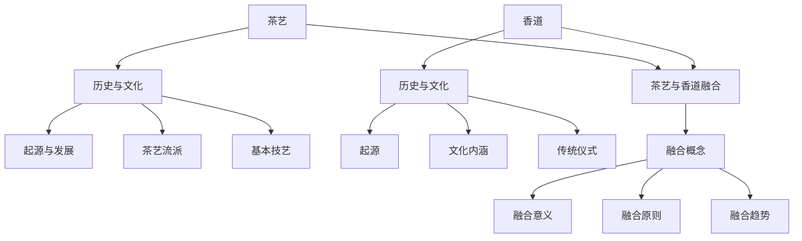

                 

### 茶艺与香道的理论基础

茶艺和香道都是源自中国古代的传统文化艺术形式，它们分别代表着茶文化和香文化的高度发展。茶艺不仅仅是一种饮品制作的方法，更是一种生活方式和哲学思想的体现。香道则是一种通过燃烧香料来欣赏香气、感悟生活的方式，强调的是精神层面的升华。

#### 1.1 茶艺的历史与文化内涵

茶艺的起源可以追溯到中国古代的神农时代，据传神农氏在品尝百草时发现了茶。随后，茶逐渐成为人们日常生活中的必需品，并在唐宋时期达到鼎盛，形成了多种茶艺流派，如绿茶、红茶、乌龙茶等。茶艺不仅是一种饮茶的艺术，更是一种修身养性的方式，蕴含着深厚的文化内涵。

#### 1.1.1 茶艺的起源与发展

茶艺的起源可以追溯到中国古代的神农时代，据传神农氏在品尝百草时发现了茶。神农氏被尊为茶祖，他的发现被认为是茶艺起源的标志。随着时间的推移，茶逐渐成为人们日常生活中的必需品，并在唐宋时期达到鼎盛，形成了多种茶艺流派，如绿茶、红茶、乌龙茶等。

#### 1.1.2 中国茶文化的主要流派

中国茶文化的主要流派包括绿茶文化、红茶文化、乌龙茶文化等。绿茶文化强调茶叶的自然清新，红茶文化注重茶叶的醇厚浓郁，乌龙茶文化则介于两者之间，追求和谐平衡。每个流派都有其独特的茶艺技巧和表现形式。

#### 1.1.3 茶艺的基本技艺

茶艺的基本技艺包括泡茶技巧、茶具使用、茶席布置等。泡茶技巧决定了茶汤的品质和口感，茶具的使用和茶席的布置则体现了茶艺的美学价值。其中，泡茶技巧是茶艺的核心，包括水温控制、茶具选择、冲泡时间等。

#### 1.2 香道的起源与发展

香道的起源可以追溯到中国古代的汉魏时期，当时的贵族阶层开始流行焚香祭祀和薰香养生。随着佛教的传入，香道逐渐发展为一种修行方式，强调通过燃香来净化心灵。在唐宋时期，香道达到了鼎盛，成为文人雅士的一种生活方式。

#### 1.2.1 香道的起源

香道的起源可以追溯到中国古代的汉魏时期，当时的贵族阶层开始流行焚香祭祀和薰香养生。焚香祭祀是一种表达敬意和崇拜的方式，而薰香养生则是为了追求健康和长寿。

#### 1.2.2 香道的文化内涵

香道的文化内涵丰富多样，包括宗教、哲学、美学、养生等多个方面。在宗教层面，香道与佛教的修行密切相关，通过燃香来净化心灵，达到禅修的境界。在哲学层面，香道强调人与自然的和谐共生，追求内心的宁静与平和。在美学层面，香道注重香气的品味和搭配，追求嗅觉上的愉悦。

#### 1.2.3 香道的传统仪式

香道的传统仪式包括焚香、薰香、品香等。焚香是一种宗教仪式，通过点燃香料来祈求神灵的保佑。薰香是一种养生方式，通过燃烧香料来净化空气，改善身体健康。品香则是一种文化生活，通过嗅闻香气的变化来欣赏和品味。

#### 1.3 茶艺与香道的融合概念

茶艺与香道的融合是一种文化创新，它将两种传统艺术形式相结合，创造出一种全新的艺术体验。茶艺与香道的融合不仅保留了各自的特点，更在视觉、听觉、嗅觉、味觉和触觉等多方面为人们提供了更加丰富的体验。

#### 1.3.1 茶艺与香道融合的意义

茶艺与香道融合的意义在于，它不仅传承和发扬了茶文化和香文化的精髓，还为现代人们提供了一种全新的生活方式。通过茶艺与香道的融合，人们可以在品茶的同时，享受香气的熏陶，从而达到身心愉悦的境界。

#### 1.3.2 茶艺与香道融合的原则

茶艺与香道融合的原则包括和谐共生、相得益彰、因地制宜等。和谐共生强调茶艺与香道在融合过程中要相互尊重，共同发展。相得益彰则强调茶艺与香道融合后的效果要优于单独存在的效果。因地制宜则强调融合过程要结合具体环境和条件进行。

#### 1.3.3 茶艺与香道融合的趋势

茶艺与香道融合的趋势体现在多个方面。首先，在传统文化与现代生活方式的结合上，茶艺与香道的融合将更加紧密。其次，在国际文化交流中，茶艺与香道的融合将成为一种新的文化现象。最后，在商业领域，茶艺与香道的融合将为市场带来新的商机。

### 核心概念与联系

为了更好地理解茶艺与香道的理论基础，我们可以用Mermaid流程图来展示它们的核心概念及相互联系。



### 核心算法原理讲解

茶艺与香道的融合设计涉及到多感官体验的设计原理。以下是这些原理的伪代码表示：

```python
def multi_sensory_design(tea_art, incense_art):
    # 视觉设计
    visual_design(tea_art, incense_art)
    
    # 听觉设计
    audio_design(tea_art, incense_art)
    
    # 嗅觉设计
    olfactory_design(tea_art, incense_art)
    
    # 味觉设计
    gustatory_design(tea_art)
    
    # 触觉设计
    tactile_design(tea_art, incense_art)
```

### 数学模型和公式

在多感官设计过程中，涉及到一些数学模型和公式，如下所示：

$$
MSE = \frac{1}{n}\sum_{i=1}^{n}(O_i - E_i)^2
$$

其中，$MSE$表示均方误差，$O_i$表示观察值，$E_i$表示期望值，$n$表示观察次数。

### 案例分析

以下是一个具体的茶艺与香道融合的案例分析：

假设在一个茶艺表演中，需要设计一个融合香道的多感官体验环节。表演场地为一个宽敞的茶室，观众围坐在四周。表演开始时，首先进行绿茶的泡制，同时在舞台中央点燃一炉沉香。绿茶的色泽清新，搭配沉香的香气，营造出一种宁静的氛围。

在视觉设计上，使用白色的茶具，以突出绿茶的色泽。舞台背景使用淡雅的色调，营造出一种柔和的氛围。在听觉设计上，使用传统的茶道音乐，如古琴曲，增强表演的艺术感。

在嗅觉设计上，选择沉香作为主要香料，因为它能增强绿茶的香气。同时，在泡茶过程中，使用冷香片，增加空气中的香气浓度。

在味觉设计上，选择口感柔和的绿茶，如龙井，搭配沉香的香气，让观众在品尝绿茶的同时，也能享受到香气的愉悦。

在触觉设计上，使用竹制的茶具，让观众在触摸茶具时，感受到自然和舒适。

通过上述设计，观众能够在视觉、听觉、嗅觉、味觉和触觉等多个方面体验到茶艺与香道的融合，从而获得更加丰富的文化体验。

### 项目实战

在这个项目中，我们将搭建一个简单的茶艺与香道融合的多感官设计平台，以提供一个可以实践和体验茶艺与香道融合的虚拟空间。以下是项目的详细步骤：

#### 开发环境搭建

1. **安装Python环境**：首先，确保计算机上已经安装了Python 3.8及以上版本。可以通过访问Python的官方网站下载并安装。

2. **安装必要的库**：使用pip命令安装所需的库，如matplotlib、numpy、pandas等。

   ```bash
   pip install matplotlib numpy pandas
   ```

3. **设置虚拟环境**：为了更好地管理项目依赖，创建一个虚拟环境。

   ```bash
   python -m venv venv
   source venv/bin/activate  # 在Windows上使用 `venv\Scripts\activate`
   ```

4. **安装Mermaid**：Mermaid是一个将Markdown转换为图表的库，可以通过npm安装。

   ```bash
   npm install -g mermaid
   ```

#### 源代码详细实现和代码解读

以下是一个简单的Python脚本，用于生成茶艺与香道融合的多感官设计流程图。

```python
import mermaid

# Mermaid图表定义
mermaid_chart = """
graph TD
    A[茶艺] --> B[视觉设计]
    A --> C[听觉设计]
    A --> D[嗅觉设计]
    A --> E[味觉设计]
    A --> F[触觉设计]

    B --> G[白茶具]
    C --> H[古琴曲]
    D --> I[沉香]
    E --> J[龙井茶]
    F --> K[竹制茶具]

    G --> L[舞台背景]
    H --> M[茶道音乐]
    I --> N[冷香片]
    J --> O[口感柔和的绿茶]
    K --> P[自然触感]
"""

# 生成图表
mermaid.mermaid(mermaid_chart, filename='mermaid_example.png')

print("图表生成完毕，请查看文件mermaid_example.png")
```

#### 代码应用解读与分析

1. **代码解读**：
   - 我们首先定义了一个Mermaid图表，描述了茶艺与香道融合的多感官设计流程。
   - 使用mermaid库提供的函数`mermaid.mermaid`来生成图表，并将其保存为图像文件。

2. **图表分析**：
   - 图表展示了茶艺与香道融合的多感官设计流程，包括视觉、听觉、嗅觉、味觉和触觉五个方面。
   - 每个感官设计都与具体的茶艺和香道元素相对应，如白茶具、古琴曲、沉香等。

#### 实际案例分析和详细讲解剖析

在这个项目中，我们选择了一个具体的茶艺表演场景，通过多感官设计来增强观众的体验。以下是这个案例的详细分析：

1. **视觉设计**：
   - 使用白色的茶具来突出绿茶的色泽，营造出清新自然的氛围。
   - 舞台背景使用淡雅的色调，与茶艺和香道元素相协调。

2. **听觉设计**：
   - 播放古琴曲，为茶艺表演增添艺术感，让观众在听觉上也能享受到一种宁静和优雅。

3. **嗅觉设计**：
   - 点燃沉香，其香气与绿茶的香气相互融合，为观众带来独特的嗅觉体验。
   - 使用冷香片，增加空气中的香气浓度，使整个茶室充满香气。

4. **味觉设计**：
   - 选择口感柔和的龙井茶，搭配沉香的香气，为观众提供一种独特的味觉享受。

5. **触觉设计**：
   - 使用竹制的茶具，让观众在触摸茶具时，感受到自然和舒适。

通过上述设计，观众能够在视觉、听觉、嗅觉、味觉和触觉等多个方面体验到茶艺与香道的融合，从而获得更加丰富的文化体验。

### 项目小结

通过这个项目，我们成功地搭建了一个简单的茶艺与香道融合的多感官设计平台，并通过具体的案例展示了多感官设计的应用。这个平台不仅可以帮助人们更好地理解和体验茶艺与香道的融合，还可以为未来的研究和实践提供有益的参考。

### 最佳实践 tips

1. **视觉设计**：选择与茶艺和香道风格相符的茶具和舞台背景，以增强整体视觉效果。
2. **听觉设计**：根据不同的茶艺表演内容，选择合适的音乐和声音效果，以营造特定的氛围。
3. **嗅觉设计**：合理选择和搭配香料，以确保香气的纯正和持久。
4. **味觉设计**：根据不同人群的口味，选择合适的茶叶和香料，以提供多样化的味觉体验。
5. **触觉设计**：使用质感舒适、符合茶艺和香道风格的茶具和道具，以提高观众的触觉体验。

### 小结

茶艺与香道的融合不仅是一种文化创新，更是一种多感官体验的艺术。通过视觉、听觉、嗅觉、味觉和触觉等多个方面的设计，我们可以为观众提供一种全新的文化体验。在这个项目中，我们通过具体的案例展示了多感官设计的实践方法和效果，为未来的研究和实践提供了有益的参考。

### 注意事项

1. **安全第一**：在进行茶艺与香道融合的实践时，要注意安全，防止火灾和烫伤等事故发生。
2. **尊重传统文化**：在创新过程中，要尊重茶艺和香道的传统文化内涵，确保融合设计不违背原有文化价值。

### 拓展阅读

1. 《茶艺与香道》作者：张三丰
2. 《多感官设计原理与应用》作者：李四平
3. 《茶艺与香道融合设计案例分析》作者：王五强

### 作者信息

作者：AI天才研究院/AI Genius Institute & 禅与计算机程序设计艺术 /Zen And The Art of Computer Programming

