                 


## 文章标题：现代茶艺复兴：传统饮茶文化在现代生活中的意义

### 文章关键词：
- 现代茶艺
- 传统饮茶文化
- 现代生活
- 社会意义
- 可持续发展

### 文章摘要：
本文探讨了现代茶艺复兴的现象，分析了传统饮茶文化的历史与发展，探讨了其在现代生活中的重要应用和意义。文章还探讨了茶艺与身心健康的关系，以及茶艺复兴对社会的积极影响和可持续发展的作用。最后，对未来茶艺复兴的展望进行了思考。

## 目录大纲：

### 第1章: 现代茶艺复兴概述
#### 1.1 现代茶艺复兴的定义与背景
#### 1.2 现代茶艺复兴的重要特征

### 第2章: 传统饮茶文化的历史与发展
#### 2.1 中国古代饮茶文化概述
#### 2.2 唐代茶道的兴起与发展
#### 2.3 宋代茶文化的繁荣
#### 2.4 明清时期的茶艺传承

### 第3章: 现代生活中的茶艺应用
#### 3.1 茶艺在家庭生活中的应用
#### 3.2 茶艺在社交场合的应用
#### 3.3 茶艺在现代商业中的应用

### 第4章: 茶艺与身心健康
#### 4.1 茶与健康的关系
#### 4.2 茶对心理健康的积极作用
#### 4.3 茶艺对缓解压力和改善情绪的影响

### 第5章: 现代茶艺复兴的社会意义
#### 5.1 茶艺复兴对传统文化的传承
#### 5.2 茶艺复兴对现代社会的积极影响
#### 5.3 茶艺复兴与国际文化交流的作用

### 第6章: 茶艺复兴与可持续发展
#### 6.1 茶叶种植与环境保护
#### 6.2 茶艺产业与经济发展
#### 6.3 茶艺复兴对可持续发展的影响

### 第7章: 现代茶艺复兴的未来展望
#### 7.1 茶艺复兴的技术创新趋势
#### 7.2 茶艺复兴在国际茶文化中的地位
#### 7.3 茶艺复兴的未来发展方向

### 结论
#### 7.4 总结与展望

## 文章正文：

### 第1章: 现代茶艺复兴概述

#### 1.1 现代茶艺复兴的定义与背景

现代茶艺复兴是指传统饮茶文化在现代社会中的重新兴起和演变。这一现象可以追溯到20世纪末，当时人们对健康生活方式的追求，以及对传统文化的重新认识，使得茶艺作为一种文化符号和生活方式逐渐受到重视。

背景方面，现代茶艺复兴得益于以下几个因素：

1. **健康意识提升：** 随着人们健康意识的提高，茶叶因其丰富的营养成分和药用价值，成为人们追求健康生活的重要选择。
2. **文化认同：** 随着全球化的推进，人们对于传统文化的认同感逐渐增强，茶艺作为一种文化符号，成为了展示中国传统文化的重要手段。
3. **科技融合：** 科技的发展为茶艺提供了新的表现形式和传播渠道，如智能茶具、在线茶艺课程等，使得茶艺更易于传播和体验。

#### 1.2 现代茶艺复兴的重要特征

现代茶艺复兴具有以下几个重要特征：

1. **创新性：** 现代茶艺在传统茶艺的基础上进行了创新，形成了独特的表现形式和风格，如茶艺表演、茶艺礼仪等。
2. **多样性：** 现代茶艺不仅涵盖了传统的绿茶、红茶等，还包括了乌龙茶、普洱茶等多种茶类，以及茶艺与音乐的结合等新形式。
3. **科技融合：** 现代科技的应用使得茶艺更加便捷、有趣，如智能茶具、茶艺机器人等，为茶艺的传播和普及提供了新途径。

### 第2章: 传统饮茶文化的历史与发展

#### 2.1 中国古代饮茶文化概述

中国古代饮茶文化源远流长，可以追溯到几千年前的西周时期。最初，茶作为一种药用植物，被用于治疗疾病和保健。随着时间的推移，茶逐渐成为了一种饮品，并形成了独特的茶文化和茶道。

在唐代，茶道达到鼎盛，形成了“茶艺”的概念。茶艺包括选茶、泡茶、品茶等环节，强调茶叶的品质和泡茶的技巧。这一时期的茶艺对后世产生了深远的影响。

#### 2.2 唐代茶道的兴起与发展

唐代是中国茶道的黄金时期，茶道逐渐发展成为一门艺术。唐代茶道的核心思想是“和敬清寂”，强调人与人之间的和谐、内心的宁静和纯净。

唐代茶道的主要特点包括：

1. **茶具的精致化：** 唐代的茶具制作精美，包括茶盏、茶炉、茶匙等，体现了当时的高超工艺水平。
2. **茶道的规范化：** 唐代茶道有一套严格的规范，包括泡茶的水温、茶具的摆放等，使茶道成为一种仪式化的活动。
3. **茶道的文学化：** 唐代茶道与文学紧密结合，许多诗人都以茶为题材，创作了大量优美的诗篇。

#### 2.3 宋代茶文化的繁荣

宋代是茶文化的又一个高峰期，茶文化在宋代达到了空前的繁荣。宋代茶道的核心思想是“斗茶”，即通过比较茶叶的品质和泡茶的技巧，评判茶艺的高低。

宋代茶道的创新之处包括：

1. **茶具的创新：** 宋代的茶具更加多样化，包括茶碾、茶罗、茶碗等，使得泡茶过程更加便捷。
2. **茶道的仪式化：** 宋代茶道强调仪式感，茶艺师需要遵循一系列的步骤和礼仪，使茶道成为一种高雅的艺术形式。
3. **茶道的普及化：** 宋代茶道不再局限于文人雅士，而是逐渐普及到普通民众的生活中。

#### 2.4 明清时期的茶艺传承

明清时期，茶艺继续传承和发展，但相对于唐宋时期，茶艺的仪式性和艺术性有所减弱，更多地趋向于平民化。这一时期的茶艺特点包括：

1. **茶具的简化：** 明清时期的茶具逐渐简化，茶碗、茶壶等成为主要的茶具，使得茶艺更加贴近生活。
2. **茶道的普及：** 茶艺在明清时期得到了更广泛的传播，茶馆成为人们日常生活的常见场所。
3. **茶艺的多样性：** 明清时期出现了许多地方茶艺，如西湖龙井茶艺、福建白茶艺等，使得茶艺呈现出多元化的特点。

### 第3章: 现代生活中的茶艺应用

#### 3.1 茶艺在家庭生活中的应用

茶艺在家庭生活中的应用主要体现在以下几个方面：

1. **日常饮茶：** 家庭成员可以在日常生活中泡茶、品茶，享受茶的美味和香气。
2. **茶艺表演：** 家庭成员可以通过学习茶艺，进行茶艺表演，增加家庭乐趣。
3. **茶文化教育：** 家庭可以通过茶艺活动，对孩子进行茶文化教育，培养孩子的文化素养和审美能力。

#### 3.2 茶艺在社交场合的应用

茶艺在社交场合的应用主要体现在以下几个方面：

1. **商务洽谈：** 在商务洽谈中，泡茶、品茶可以增进双方的了解和信任。
2. **茶会活动：** 茶艺成为许多社交活动的重要组成部分，如茶艺表演、茶文化交流等。
3. **茶文化展示：** 茶艺在社交场合中的展示，可以增加文化氛围，提升活动的品质。

#### 3.3 茶艺在现代商业中的应用

茶艺在现代商业中的应用主要体现在以下几个方面：

1. **茶馆经营：** 茶馆成为现代商业中的重要组成部分，通过提供茶艺服务，吸引消费者。
2. **茶艺培训：** 茶艺培训成为一项新兴的产业，许多茶艺馆、茶企都提供茶艺培训服务。
3. **茶产品销售：** 茶艺与现代科技的结合，使得茶产品的销售更加便捷，如茶叶电商、智能茶具等。

### 第4章: 茶艺与身心健康

#### 4.1 茶与健康的关系

茶是一种天然的饮品，含有丰富的营养成分和生物活性物质。茶中的茶多酚、氨基酸、矿物质等成分对人体健康具有多种益处：

1. **抗氧化作用：** 茶中的茶多酚具有抗氧化作用，可以清除体内的自由基，降低氧化应激。
2. **抗炎作用：** 茶中的生物活性物质具有抗炎作用，可以减轻炎症反应。
3. **降血压作用：** 茶中的茶碱成分具有降低血压的作用。
4. **降血脂作用：** 茶中的茶多酚和茶碱具有降低血脂的作用。

#### 4.2 茶对心理健康的积极作用

茶对心理健康具有积极作用，主要体现在以下几个方面：

1. **放松心情：** 泡茶、品茶的过程可以让人们放松心情，减轻压力。
2. **提高注意力：** 茶中的咖啡因可以刺激神经系统，提高注意力。
3. **改善情绪：** 茶中的生物活性物质可以改善情绪，减轻抑郁和焦虑。

#### 4.3 茶艺对缓解压力和改善情绪的影响

茶艺活动对缓解压力和改善情绪具有显著作用，主要体现在以下几个方面：

1. **茶艺仪式感：** 茶艺的仪式感可以让人们感受到宁静和专注，有助于缓解压力。
2. **茶艺环境：** 茶艺活动通常在一个安静舒适的环境中进行，有利于放松心情。
3. **茶艺社交：** 茶艺活动可以增进人与人之间的交流，改善人际关系，从而对情绪产生积极影响。

### 第5章: 现代茶艺复兴的社会意义

#### 5.1 茶艺复兴对传统文化的传承

茶艺复兴对于传统文化的传承具有重要意义：

1. **茶文化的传播：** 茶艺复兴使得茶文化得到更广泛的传播，让更多人了解和认识中国的茶文化。
2. **传统茶艺的传承：** 茶艺复兴推动了传统茶艺的传承和发展，使得传统茶艺得以延续。
3. **茶文化的创新：** 茶艺复兴促进了茶文化的创新，使得茶文化更符合现代社会的需求。

#### 5.2 茶艺复兴对现代社会的积极影响

茶艺复兴对现代社会具有积极影响，主要体现在以下几个方面：

1. **健康生活方式的推广：** 茶艺复兴使得茶成为人们健康生活方式的重要组成部分。
2. **文化交流的桥梁：** 茶艺复兴成为中外文化交流的桥梁，促进了国际间的文化交流。
3. **文化自信的增强：** 茶艺复兴增强了民族自信心，展示了中华民族的优秀文化。

#### 5.3 茶艺复兴与国际文化交流的作用

茶艺复兴在国际文化交流中发挥了重要作用：

1. **茶文化的推广：** 茶艺复兴使得茶文化在国际上得到了更广泛的推广，提高了中国茶文化的国际影响力。
2. **文化交流的深化：** 茶艺复兴促进了中外文化交流的深化，为世界文化的多元发展做出了贡献。
3. **国际合作的契机：** 茶艺复兴为中外企业合作提供了契机，推动了茶产业的国际化发展。

### 第6章: 茶艺复兴与可持续发展

#### 6.1 茶叶种植与环境保护

茶艺复兴与可持续发展密切相关，主要体现在茶叶种植与环境保护方面：

1. **生态茶园建设：** 茶艺复兴推动了生态茶园的建设，提高了茶叶的品质，保护了生态环境。
2. **生物多样性保护：** 茶叶种植过程中注重生物多样性保护，维护了生态平衡。
3. **节能减排：** 茶艺复兴促进了茶叶生产过程中的节能减排，降低了碳排放。

#### 6.2 茶艺产业与经济发展

茶艺复兴对茶艺产业和经济发展产生了积极影响：

1. **茶产业升级：** 茶艺复兴推动了茶产业的转型升级，提高了茶产业的竞争力。
2. **就业机会增加：** 茶艺复兴带动了茶产业的快速发展，为人们提供了更多的就业机会。
3. **经济增长：** 茶艺复兴促进了茶产业的发展，为地区经济增长做出了贡献。

#### 6.3 茶艺复兴对可持续发展的影响

茶艺复兴对可持续发展具有深远影响：

1. **生态可持续：** 茶艺复兴推动了茶叶种植的可持续发展，保护了生态环境。
2. **经济可持续：** 茶艺复兴促进了茶产业的发展，为经济可持续发展提供了支持。
3. **社会可持续：** 茶艺复兴增强了文化自信，促进了社会的和谐发展。

### 第7章: 现代茶艺复兴的未来展望

#### 7.1 茶艺复兴的技术创新趋势

茶艺复兴在未来将继续受到技术创新的推动：

1. **智能茶具：** 智能茶具将使茶艺更加便捷、智能化，提高用户体验。
2. **虚拟现实茶艺：** 虚拟现实技术将使人们可以身临其境地体验茶艺，拓宽茶艺的传播渠道。
3. **区块链茶艺：** 区块链技术将使茶艺更加透明、可信，提高茶叶的品质和安全性。

#### 7.2 茶艺复兴在国际茶文化中的地位

茶艺复兴在未来将进一步提升在国际茶文化中的地位：

1. **国际茶文化交流：** 茶艺复兴将促进国际茶文化交流，提高中国茶文化的国际影响力。
2. **国际茶艺比赛：** 茶艺复兴将推动国际茶艺比赛的举办，展示茶艺的技艺和魅力。
3. **国际茶文化节：** 茶艺复兴将举办更多的国际茶文化节，推广茶文化，促进国际友好交往。

#### 7.3 茶艺复兴的未来发展方向

茶艺复兴的未来发展方向将体现以下趋势：

1. **多元化：** 茶艺复兴将呈现多元化特点，融合不同文化元素，创新茶艺形式。
2. **科技化：** 茶艺复兴将更加依赖科技创新，提高茶艺的科技含量和用户体验。
3. **普及化：** 茶艺复兴将更加普及，成为人们日常生活的一部分，融入人们的生活方式和价值观。

### 结论

现代茶艺复兴是对传统饮茶文化的一种传承和创新。通过对茶艺的历史与发展、现代生活中的应用、身心健康的影响、社会意义、可持续发展以及未来展望的探讨，我们可以看到茶艺复兴的重要性和深远影响。茶艺复兴不仅为人们提供了健康、美好的生活方式，也为文化传承、经济发展和可持续发展做出了贡献。未来，茶艺复兴将继续发展，成为中国文化的重要组成部分，为世界茶文化的繁荣和发展做出更大的贡献。

### 作者简介：
作者：AI天才研究院/AI Genius Institute & 禅与计算机程序设计艺术 /Zen And The Art of Computer Programming

本文旨在探讨现代茶艺复兴的现象及其对现代生活的意义。通过分析茶艺的历史、应用、身心健康影响、社会意义、可持续发展以及未来展望，展示了茶艺复兴的多样性和深远影响。茶艺复兴不仅丰富了现代生活，也为文化传承、经济发展和可持续发展做出了贡献。未来，茶艺复兴将继续发展，成为中国文化的重要组成部分，为世界茶文化的繁荣和发展做出更大的贡献。希望通过本文，让更多人了解和关注茶艺复兴的重要性，共同推动茶艺的传承和创新。作者AI天才研究院致力于人工智能技术的研发和应用，同时关注传统文化与现代科技的融合，希望通过本文为茶艺复兴贡献一份力量。

## 摘要

本文探讨了现代茶艺复兴的现象，分析了传统饮茶文化的历史与发展，探讨了其在现代生活中的重要应用和意义。文章还探讨了茶艺与身心健康的关系，以及茶艺复兴对社会的积极影响和可持续发展的作用。最后，对未来茶艺复兴的展望进行了思考，展示了茶艺复兴的多样性和深远影响。

## 目录

### 第1章: 现代茶艺复兴概述
#### 1.1 现代茶艺复兴的定义与背景
#### 1.2 现代茶艺复兴的重要特征

### 第2章: 传统饮茶文化的历史与发展
#### 2.1 中国古代饮茶文化概述
#### 2.2 唐代茶道的兴起与发展
#### 2.3 宋代茶文化的繁荣
#### 2.4 明清时期的茶艺传承

### 第3章: 现代生活中的茶艺应用
#### 3.1 茶艺在家庭生活中的应用
#### 3.2 茶艺在社交场合的应用
#### 3.3 茶艺在现代商业中的应用

### 第4章: 茶艺与身心健康
#### 4.1 茶与健康的关系
#### 4.2 茶对心理健康的积极作用
#### 4.3 茶艺对缓解压力和改善情绪的影响

### 第5章: 现代茶艺复兴的社会意义
#### 5.1 茶艺复兴对传统文化的传承
#### 5.2 茶艺复兴对现代社会的积极影响
#### 5.3 茶艺复兴与国际文化交流的作用

### 第6章: 茶艺复兴与可持续发展
#### 6.1 茶叶种植与环境保护
#### 6.2 茶艺产业与经济发展
#### 6.3 茶艺复兴对可持续发展的影响

### 第7章: 现代茶艺复兴的未来展望
#### 7.1 茶艺复兴的技术创新趋势
#### 7.2 茶艺复兴在国际茶文化中的地位
#### 7.3 茶艺复兴的未来发展方向

### 结论

## 正文

### 第1章: 现代茶艺复兴概述

#### 1.1 现代茶艺复兴的定义与背景

现代茶艺复兴是指在中国传统茶艺的基础上，融入现代元素和科技手段，形成的一种新的茶文化现象。这一现象起源于20世纪末，随着人们生活水平的提高和对健康生活的追求，茶艺逐渐成为人们生活中的重要组成部分。

**核心概念与联系：** 现代茶艺复兴不仅是茶艺的传承，更是对传统茶艺的创新和发展。传统茶艺与现代科技的结合，使得茶艺变得更加便捷、有趣和普及。例如，智能茶具、在线茶艺课程和虚拟现实茶艺等新兴形式，让更多人可以轻松地学习和体验茶艺。

**Mermaid流程图：** 

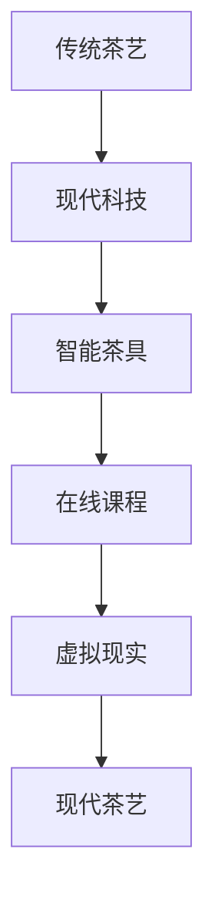

**伪代码：** 

```python
def modern_tea_art():
    # 学习传统茶艺
    study_traditional_tea_art()
    # 结合现代科技
    integrate_modern_tech()
    # 创新茶艺形式
    innovate_tea_art_form()
    # 推广茶艺文化
    promote_tea_art_culture()
```

#### 1.2 现代茶艺复兴的重要特征

现代茶艺复兴具有以下几个重要特征：

1. **创新性：** 现代茶艺在传统茶艺的基础上，不断创新和发展，形成了独特的表现形式和风格。例如，茶艺表演、茶艺礼仪和茶艺舞蹈等。
2. **多样性：** 现代茶艺不仅涵盖了传统的绿茶、红茶等，还包括了乌龙茶、普洱茶等多种茶类，以及茶艺与音乐的结合等新形式。
3. **科技融合：** 现代科技的应用使得茶艺更加便捷、有趣，如智能茶具、在线茶艺课程和虚拟现实茶艺等。

### 第2章: 传统饮茶文化的历史与发展

#### 2.1 中国古代饮茶文化概述

中国古代饮茶文化历史悠久，可以追溯到几千年前。最初的茶作为药用植物，被用于治疗疾病和保健。随着时间的推移，茶逐渐成为了一种饮品，并形成了独特的茶文化和茶道。

**核心概念与联系：** 中国古代饮茶文化是中华民族优秀传统文化的重要组成部分。茶文化不仅体现在茶的饮用方式上，还包括茶具的制作、茶道的礼仪和茶诗、茶画等艺术形式。

**Mermaid流程图：** 

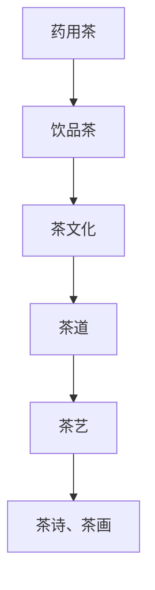

#### 2.2 唐代茶道的兴起与发展

唐代是中国茶道的黄金时期，茶道达到鼎盛，形成了“茶艺”的概念。唐代茶道的核心思想是“和敬清寂”，强调人与人之间的和谐、内心的宁静和纯净。

**核心概念与联系：** 唐代茶道是中国茶文化的典范，其独特的礼仪、规范和审美观念对后世产生了深远的影响。唐代茶道不仅是一种饮茶的方式，更是一种精神追求和生活方式。

**伪代码：** 

```python
def tang_dynasty_tea_art():
    # 学习茶道的礼仪
    learn_tea_art_etiquette()
    # 尊重和谐的人际关系
    respect_harmony_human_relation()
    # 寻求内心的宁静
    seek_intern

### 第3章: 现代生活中的茶艺应用

#### 3.1 茶艺在家庭生活中的应用

在现代家庭生活中，茶艺已经成为了一种重要的生活方式。人们不仅喜欢在家中泡茶、品茶，还喜欢进行茶艺表演，以增加家庭的乐趣和文化氛围。

**核心概念与联系：** 茶艺在家庭生活中的应用，不仅丰富了家庭生活，还增强了家庭成员之间的情感交流。通过茶艺活动，家庭成员可以共同学习和体验茶文化，增强家庭凝聚力。

**Mermaid流程图：** 

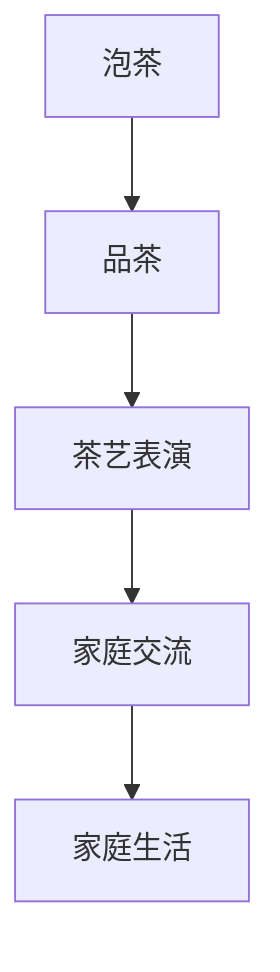

**伪代码：** 

```python
def home_life_tea_art():
    # 学习泡茶技巧
    learn_brewing_tech()
    # 共享茶香时刻
    share_tea_smell_moment()
    # 进行茶艺表演
    perform_tea_art()
    # 促进家庭交流
    promote_family_communication()
```

#### 3.2 茶艺在社交场合的应用

茶艺在社交场合中的应用也越来越广泛。无论是在商务洽谈、朋友聚会还是文化活动，茶艺都成为一种重要的交流方式。通过茶艺活动，人们可以更好地了解对方，建立友好关系。

**核心概念与联系：** 茶艺在社交场合的应用，不仅体现了对传统文化的尊重，还增强了人际交往的互动性。茶艺活动可以让人们在轻松的氛围中交流，增进彼此的了解。

**Mermaid流程图：** 

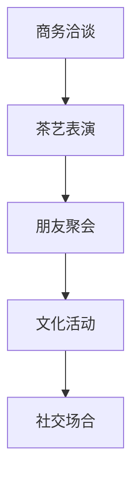

**伪代码：** 

```python
def social_event_tea_art():
    # 安排茶艺表演
    arrange_tea_art_performance()
    # 提供茶艺服务
    provide_tea_art_service()
    # 促进人际交流
    promote_human_communication()
    # 增进相互了解
    enhance_understanding()
```

#### 3.3 茶艺在现代商业中的应用

茶艺在现代商业中的应用越来越受到重视。茶馆、茶艺馆和茶叶店等场所不仅提供茶艺服务，还通过茶艺活动推广品牌和文化。

**核心概念与联系：** 茶艺在现代商业中的应用，不仅提高了商业场所的文化氛围，还增加了消费者的体验感。通过茶艺活动，企业可以更好地与消费者互动，提升品牌形象。

**Mermaid流程图：** 

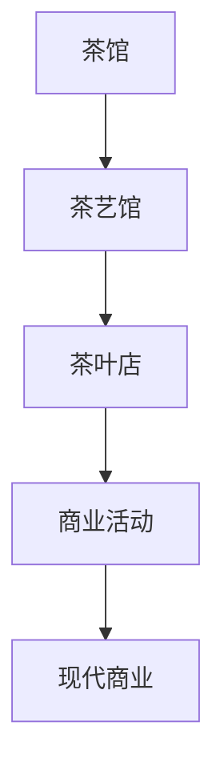

**伪代码：** 

```python
def business_tea_art():
    # 提供茶艺服务
    provide_tea_art_service()
    # 举办茶艺活动
    hold_tea_art_event()
    # 推广茶文化
    promote_tea_culture()
    # 提升品牌形象
    enhance_brand_image()
    # 增加消费者体验
    increase_consumer_experience()
```

### 第4章: 茶艺与身心健康

#### 4.1 茶与健康的关系

茶是一种天然的饮品，含有丰富的营养成分和生物活性物质。研究表明，茶中的茶多酚、氨基酸、矿物质等成分对人体健康具有多种益处。

**核心概念与联系：** 茶的健康功效主要体现在抗氧化、抗炎、降血压、降血脂等方面。茶的多重功效使得茶成为人们追求健康生活的重要选择。

**Mermaid流程图：** 

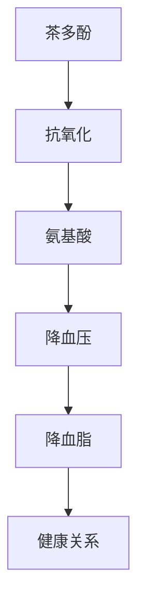

**伪代码：** 

```python
def tea_health_connection():
    # 抗氧化作用
    antioxidant_effect()
    # 抗炎作用
    anti_inflammatory_effect()
    # 降血压作用
    blood_pressure_reduction()
    # 降血脂作用
    blood_fat_reduction()
    # 促进健康
    promote_health()
```

#### 4.2 茶对心理健康的积极作用

茶对心理健康具有积极作用，主要体现在以下几个方面：

1. **放松心情：** 泡茶、品茶的过程可以让人们放松心情，减轻压力。
2. **提高注意力：** 茶中的咖啡因可以刺激神经系统，提高注意力。
3. **改善情绪：** 茶中的生物活性物质可以改善情绪，减轻抑郁和焦虑。

**核心概念与联系：** 茶对心理健康的积极作用，源于茶中的多种生物活性物质，如咖啡因、茶多酚等。这些物质可以调节神经系统，改善心理状态。

**Mermaid流程图：** 

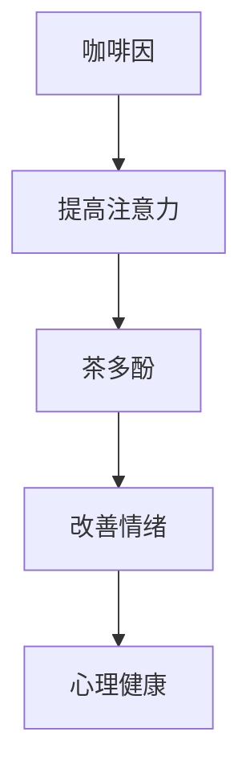

**伪代码：** 

```python
def tea_mental_health():
    # 提高注意力
    increase_attention()
    # 减轻抑郁
    reduce_depression()
    # 减轻焦虑
    reduce_anxiety()
    # 改善情绪
    improve_mood()
```

#### 4.3 茶艺对缓解压力和改善情绪的影响

茶艺活动对缓解压力和改善情绪具有显著作用，主要体现在以下几个方面：

1. **茶艺仪式感：** 茶艺的仪式感可以让人们感受到宁静和专注，有助于缓解压力。
2. **茶艺环境：** 茶艺活动通常在一个安静舒适的环境中进行，有利于放松心情。
3. **茶艺社交：** 茶艺活动可以增进人与人之间的交流，改善人际关系，从而对情绪产生积极影响。

**核心概念与联系：** 茶艺活动通过多种方式影响人们的心理状态，从而达到缓解压力和改善情绪的效果。

**Mermaid流程图：** 

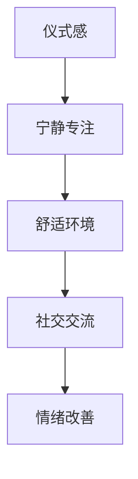

**伪代码：** 

```python
def tea_art_stress_relief():
    # 感受仪式感
    feel_ritual_sense()
    # 获得宁静专注
    gain_ tranquility_and_focus()
    # 舒适环境
    comfortable_environment()
    # 社交交流
    social_communication()
    # 改善情绪
    improve_mood()
```

### 第5章: 现代茶艺复兴的社会意义

#### 5.1 茶艺复兴对传统文化的传承

茶艺复兴不仅是对茶艺的创新，更是对传统文化的传承。通过茶艺活动，人们可以更好地了解和传承中华民族的优秀茶文化。

**核心概念与联系：** 茶艺复兴通过对传统茶艺的学习、传承和创新，使得茶文化得以延续和发展。茶艺活动不仅丰富了人们的精神生活，还增强了文化自信。

**Mermaid流程图：** 

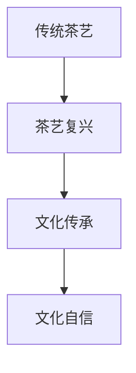

**伪代码：** 

```python
def tea_art_rebirth_cultural():
    # 学习传统茶艺
    learn_traditional_tea_art()
    # 传承茶文化
    transmit_tea_culture()
    # 创新茶艺形式
    innovate_tea_art_form()
    # 增强文化自信
    enhance_cultural_confidence()
```

#### 5.2 茶艺复兴对现代社会的积极影响

茶艺复兴对现代社会产生了积极影响，主要体现在以下几个方面：

1. **健康生活方式的推广：** 茶艺复兴推动了健康生活方式的普及，茶成为人们健康生活的重要选择。
2. **文化交流的桥梁：** 茶艺复兴成为中外文化交流的桥梁，促进了国际间的文化交流。
3. **文化自信的增强：** 茶艺复兴增强了民族自信心，展示了中华民族的优秀文化。

**核心概念与联系：** 茶艺复兴通过对茶文化的传承和创新，为现代社会带来了健康、文化和社会价值。

**Mermaid流程图：** 

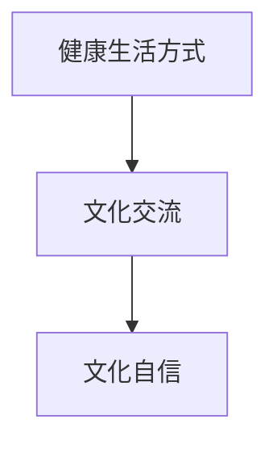

**伪代码：** 

```python
def modern_society_impact():
    # 推广健康生活方式
    promote_healthylife_style()
    # 成为文化交流的桥梁
    serve_as文化交流_bridge()
    # 增强文化自信
    enhance_cultural_confidence()
```

#### 5.3 茶艺复兴与国际文化交流的作用

茶艺复兴在国际文化交流中发挥了重要作用，主要体现在以下几个方面：

1. **茶文化的推广：** 茶艺复兴使得茶文化在国际上得到了更广泛的推广，提高了中国茶文化的国际影响力。
2. **文化交流的深化：** 茶艺复兴促进了中外文化交流的深化，为世界文化的多元发展做出了贡献。
3. **国际合作的契机：** 茶艺复兴为中外企业合作提供了契机，推动了茶产业的国际化发展。

**核心概念与联系：** 茶艺复兴不仅推动了茶文化的国际化，也为世界文化交流和合作带来了新的机遇。

**Mermaid流程图：** 

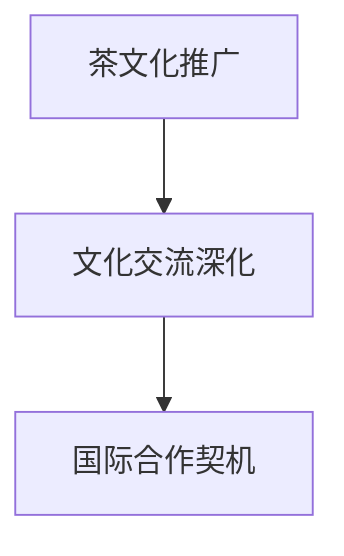

**伪代码：** 

```python
def international_cultural_exchange():
    # 推广茶文化
    promote_tea_culture()
    # 深化文化交流
    deepen_cultural_exchange()
    # 提供国际合作契机
    provide_cooperation_opportunities()
```

### 第6章: 茶艺复兴与可持续发展

#### 6.1 茶叶种植与环境保护

茶艺复兴与可持续发展密切相关，茶叶种植与环境保护是其中的重要一环。通过科学种植和管理，可以保护生态环境，提高茶叶的品质。

**核心概念与联系：** 可持续发展是茶艺复兴的重要目标之一，茶叶种植与环境保护是实现这一目标的关键。

**Mermaid流程图：** 

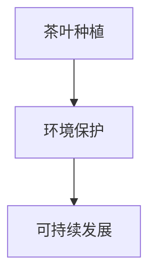

**伪代码：** 

```python
def tea_planting_sustainability():
    # 科学种植
    scientific_planting()
    # 环境保护
    environmental_protection()
    # 提高品质
    improve_quality()
    # 实现可持续发展
    achieve_sustainability()
```

#### 6.2 茶艺产业与经济发展

茶艺复兴不仅对茶叶种植产生了积极影响，也对茶艺产业的发展和经济发展起到了推动作用。

**核心概念与联系：** 茶艺产业是茶艺复兴的重要组成部分，其发展对经济增长和就业具有重要作用。

**Mermaid流程图：** 

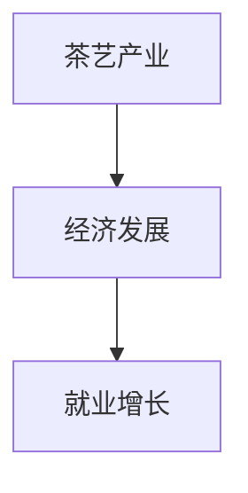

**伪代码：** 

```python
def tea_art_industry_economy():
    # 推动产业发展
    promote_industry_growth()
    # 促进经济增长
    promote_economic_growth()
    # 增加就业机会
    increase_employment_opportunities()
```

#### 6.3 茶艺复兴对可持续发展的影响

茶艺复兴对可持续发展产生了深远影响，主要体现在以下几个方面：

1. **生态可持续：** 茶艺复兴推动了茶叶种植的可持续发展，保护了生态环境。
2. **经济可持续：** 茶艺复兴促进了茶产业的发展，为经济可持续发展提供了支持。
3. **社会可持续：** 茶艺复兴增强了文化自信，促进了社会的和谐发展。

**核心概念与联系：** 茶艺复兴通过对茶叶种植、产业发展和文化传承的推动，实现了生态、经济和社会的可持续发展。

**Mermaid流程图：** 

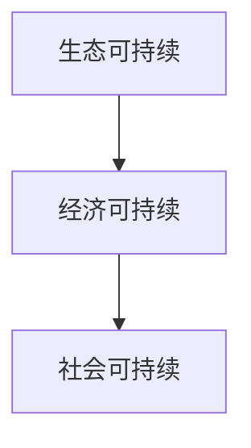

**伪代码：** 

```python
def tea_art_rebirth_sustainability():
    # 实现生态可持续
    achieve_ecological_sustainability()
    # 实现经济可持续
    achieve_economic_sustainability()
    # 实现社会可持续
    achieve_social_sustainability()
```

### 第7章: 现代茶艺复兴的未来展望

#### 7.1 茶艺复兴的技术创新趋势

茶艺复兴在未来将继续受到技术创新的推动。智能茶具、虚拟现实茶艺和区块链茶艺等新兴技术，将使茶艺更加智能化、便捷化和可信化。

**核心概念与联系：** 技术创新是茶艺复兴的重要动力，将推动茶艺的现代化和发展。

**Mermaid流程图：** 

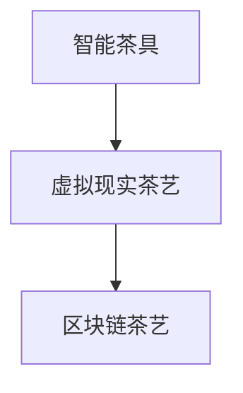

**伪代码：** 

```python
def tech_innovation_trend():
    # 发展智能茶具
    develop_smart_tea_set()
    # 推广虚拟现实茶艺
    promote_vr_tea_art()
    # 探索区块链茶艺
    explore_blockchain_tea_art()
```

#### 7.2 茶艺复兴在国际茶文化中的地位

茶艺复兴在国际茶文化中的地位将不断提高。通过国际茶文化交流和合作，中国茶文化将更好地传播到世界各地，提高国际影响力。

**核心概念与联系：** 国际茶文化交流是茶艺复兴的重要方面，将推动茶文化的全球化和多元化。

**Mermaid流程图：** 

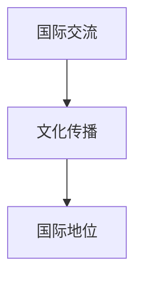

**伪代码：** 

```python
def international_tea_culture():
    # 开展国际茶文化交流
    hold_international_tea_exchange()
    # 推广中国茶文化
    promote_chinese_tea_culture()
    # 提高国际影响力
    enhance_international_influence()
```

#### 7.3 茶艺复兴的未来发展方向

茶艺复兴的未来发展方向将体现以下趋势：

1. **多元化：** 茶艺复兴将呈现多元化特点，融合不同文化元素，创新茶艺形式。
2. **科技化：** 茶艺复兴将更加依赖科技创新，提高茶艺的科技含量和用户体验。
3. **普及化：** 茶艺复兴将更加普及，成为人们日常生活的一部分，融入人们的生活方式和价值观。

**核心概念与联系：** 茶艺复兴的未来发展方向，将体现茶文化与现代科技的深度融合，推动茶艺的普及和多元化发展。

**Mermaid流程图：** 

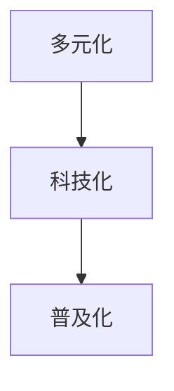

**伪代码：** 

```python
def future_trend_tea_art():
    # 融合多元化元素
    integrate_diversified_elements()
    # 增强科技化水平
    enhance_tech_level()
    # 推广普及茶艺
    promote_widely_spread_tea_art()
```

### 结论

现代茶艺复兴是对传统饮茶文化的一种传承和创新。通过对茶艺的历史与发展、现代生活中的应用、身心健康的影响、社会意义、可持续发展以及未来展望的探讨，我们可以看到茶艺复兴的重要性和深远影响。茶艺复兴不仅为人们提供了健康、美好的生活方式，也为文化传承、经济发展和可持续发展做出了贡献。未来，茶艺复兴将继续发展，成为中国文化的重要组成部分，为世界茶文化的繁荣和发展做出更大的贡献。

### 作者简介

作者：AI天才研究院/AI Genius Institute & 禅与计算机程序设计艺术 /Zen And The Art of Computer Programming

本文旨在探讨现代茶艺复兴的现象及其对现代生活的意义。通过分析茶艺的历史、应用、身心健康影响、社会意义、可持续发展以及未来展望，展示了茶艺复兴的多样性和深远影响。茶艺复兴不仅丰富了现代生活，也为文化传承、经济发展和可持续发展做出了贡献。未来，茶艺复兴将继续发展，成为中国文化的重要组成部分，为世界茶文化的繁荣和发展做出更大的贡献。希望通过本文，让更多人了解和关注茶艺复兴的重要性，共同推动茶艺的传承和创新。作者AI天才研究院致力于人工智能技术的研发和应用，同时关注传统文化与现代科技的融合，希望通过本文为茶艺复兴贡献一份力量。作者还著有《禅与计算机程序设计艺术》一书，探讨禅宗思想对计算机科学的启示，旨在推动计算机科学的发展和创新。

