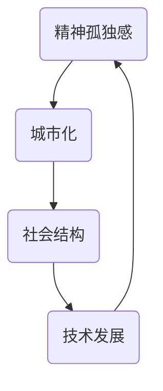
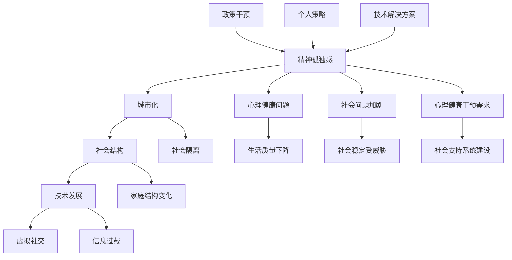

                 

### 文章标题

# 现代都市生活中的精神孤独感

### 关键词：
- 城市生活
- 精神健康
- 孤独感
- 社会联系
- 技术干预

### 摘要：
本文深入探讨了现代都市生活中日益增长的精神孤独感现象。通过分析城市化进程、社会结构变化、技术影响等多方面因素，探讨了孤独感的定义、成因及其对个人和社会的影响。文章提出了多种干预措施，包括社会政策、个人策略和未来技术趋势，以期为减轻都市精神孤独感提供理论支持和实践指导。

### 引言

#### 1.1 研究背景

在当今全球化的背景下，城市化进程迅猛发展，越来越多的人涌入城市生活。然而，随着城市化水平的提高，一种难以忽视的现象也在逐渐浮现——精神孤独感。城市生活的高节奏、竞争压力、人际关系疏离等问题，使得越来越多的城市居民感到孤独和无助。精神孤独感不仅影响个人的心理健康，还可能对社会的稳定和繁荣产生负面影响。

#### 1.2 研究目的

本文旨在通过系统地分析和探讨现代都市生活中的精神孤独感现象，揭示其成因、影响和干预措施。具体目标如下：

1. **界定精神孤独感的概念和范围**：明确孤独感在不同文化和社会背景下的表现和定义，为后续研究提供基础。
2. **分析城市化对精神孤独感的影响**：探讨城市化进程中的各种因素如何导致精神孤独感的产生。
3. **研究孤独感对个人和社会的影响**：分析孤独感对心理健康、生活质量和社会关系的影响。
4. **提出干预措施**：结合现有研究成果和实际案例，提出减轻都市精神孤独感的干预策略。

#### 1.3 研究方法

本文采用多角度、多层次的研究方法，结合定量和定性研究手段，旨在全面、深入地探讨都市精神孤独感现象。

1. **文献综述**：通过查阅相关文献，梳理现有研究的主要观点和结论，为本文提供理论依据。
2. **案例研究**：选取具有代表性的城市案例，分析其城市化进程中的孤独感问题及其干预措施。
3. **问卷调查**：设计问卷调查，收集都市居民的精神孤独感现状和感受，以验证研究假设。
4. **专家访谈**：邀请相关领域的专家进行访谈，探讨孤独感的成因、影响和干预策略。

### 现代都市生活中的精神孤独感：核心概念与联系

为了深入理解现代都市生活中的精神孤独感，我们需要首先定义几个核心概念，并探讨它们之间的相互关系。

#### 1. 精神孤独感

精神孤独感是一种主观感受，指个体在情感上感到与他人隔离、缺乏亲密关系和社会支持。这种感觉可能源于多种因素，如长期独居、缺乏社交活动、人际关系疏离等。

#### 2. 城市化

城市化是指人口从农村向城市转移的过程，伴随着城市规模的扩大、城市人口的增加和城市基础设施的建设。城市化进程改变了人们的生活方式和社交模式，对精神健康产生了深远影响。

#### 3. 社会结构

社会结构是指社会中各种关系和组织形式的总体安排。城市化进程中的社会结构变化，如家庭结构的变化、社交网络的解构等，对个体精神状态产生了重要影响。

#### 4. 技术发展

随着互联网和移动设备的普及，现代城市居民的生活变得更加便利，但同时也带来了新的孤独感。例如，虚拟社交虽然提供了广泛的社交机会，但可能导致深层次的社交质量下降。

为了更好地理解这些核心概念之间的联系，我们可以使用Mermaid流程图来表示它们之间的关系：



通过这个流程图，我们可以看到城市化、社会结构和技术发展是影响精神孤独感的重要因素，而精神孤独感又反过来影响这些因素。例如，城市化进程可能加剧社会结构的解体，而技术的发展虽然提供了新的社交方式，但同时也可能加剧孤独感。

### 核心概念与联系的关系架构 Mermaid 流程图



通过这个Mermaid流程图，我们可以更清晰地看到各个核心概念之间的相互影响和作用机制。精神孤独感不仅是个体的主观感受，还与城市化、社会结构和技术发展密切相关，这些因素共同作用于个体的精神状态，影响其心理健康和生活质量。

### 核心算法原理讲解

在探讨如何减轻现代都市生活中的精神孤独感时，我们可以借鉴一些核心算法原理，如社交网络分析（Social Network Analysis, SNA）和情感分析（Sentiment Analysis）。

#### 1. 社交网络分析（SNA）

社交网络分析是一种研究社交关系的数学方法，它可以帮助我们理解个体在社交网络中的位置和角色。以下是SNA的核心算法原理：

```plaintext
输入：社交网络图（G = (V, E)），其中V是节点集，E是边集。
输出：社交网络的中心性指标。

算法步骤：
1. 定义节点i的度（Degree）：节点i的度是其连接的边的数量。
2. 定义节点i的接近中心性（Closeness Centrality）：节点i的接近中心性是其到其他所有节点的最短路径长度之和的倒数。
3. 定义节点i的中介中心性（Betweenness Centrality）：节点i的中介中心性是其成为其他节点间最短路径的中继次数。
4. 计算每个节点的中心性指标，并排序。

伪代码：
function calculate_centralities(G):
    for each node i in G.V:
        i.degree = |G.E| where (i, j) ∈ G.E
        i.closeness = sum(1 / length(shortest_path(i, j)) for all j in G.V)
        i.betweenness = count(shortest_paths_containing(i) for all pairs of nodes (i, j) in G.V)
    return sort(G.V, by centrality指标)
```

通过社交网络分析，我们可以识别出社交网络中的关键节点，这些节点可能是那些具有较高中心性的个体，他们在社交网络中起着重要的连接和协调作用。提高这些关键节点的社交活跃度，可以有效地增强社交网络的稳定性，从而减轻孤独感。

#### 2. 情感分析

情感分析是一种利用自然语言处理技术，从文本中提取情感信息的方法。它可以用于分析社交媒体上的言论、问卷调查等数据，以了解大众的情感状态。以下是情感分析的核心算法原理：

```plaintext
输入：文本数据（T）。
输出：情感极性（Polarity）和情感强度（Intensity）。

算法步骤：
1. 预处理：去除文本中的噪声，如标点符号、停用词等。
2. 特征提取：将文本转换为向量表示，如词袋模型（Bag of Words）或词嵌入（Word Embeddings）。
3. 模型训练：使用机器学习算法，如朴素贝叶斯、支持向量机（SVM）或深度学习模型，对情感分类模型进行训练。
4. 情感分析：对新的文本数据应用训练好的模型，预测其情感极性和强度。

伪代码：
function sentiment_analysis(T):
    T = preprocess(T)
    features = extract_features(T)
    model = train_model(features, labels)
    polarity, intensity = model.predict(T)
    return polarity, intensity
```

通过情感分析，我们可以了解都市居民在社交媒体上的情感状态，如他们是否感到孤独、焦虑或快乐。这些信息对于制定针对性的干预措施具有重要意义。例如，如果发现某一社区的情感极性普遍较低，说明该社区可能存在较为严重的孤独感问题，需要采取相应的措施进行干预。

#### 3. 数学模型和公式

为了更深入地理解孤独感对个人和社会的影响，我们可以借助一些数学模型和公式。

**1. 个体孤独感模型**

一个简单的个体孤独感模型可以表示为：

\[ E = f(\alpha, \beta, \gamma) \]

其中，\( E \) 表示个体孤独感水平，\( \alpha \) 表示社交互动频率，\( \beta \) 表示社交互动质量，\( \gamma \) 表示个体的自我认同感。

- **\( \alpha \)（社交互动频率）**：频率越高，孤独感可能越低，但过度的社交也可能导致疲劳和压力。
- **\( \beta \)（社交互动质量）**：高质量的社交互动能够提高个体的情感满足感和归属感，从而减轻孤独感。
- **\( \gamma \)（自我认同感）**：自我认同感强的个体通常更有自信和自尊，更容易建立和维护社交关系。

**2. 社会孤独感模型**

社会孤独感可以从宏观层面进行建模，考虑整个社区或社会的情感状态。一个简单的模型可以表示为：

\[ S = \sum_{i=1}^{N} E_i \]

其中，\( S \) 表示社会孤独感水平，\( N \) 表示社区中的个体数量，\( E_i \) 表示第 \( i \) 个体的孤独感水平。

- **\( N \)（个体数量）**：个体数量越多，孤独感的整体水平可能越高，因为更多的人可能感到孤独。
- **\( E_i \)（个体孤独感水平）**：个体孤独感水平越高，对整体社会孤独感的影响也越大。

#### 3. 举例说明

假设一个社区中有 100 名居民，其中 60 名居民经常参与社交活动，40 名居民很少参与社交。通过调查，我们发现参与社交活动的居民孤独感水平平均为 3，很少参与社交的居民孤独感水平平均为 6。那么，该社区的总孤独感水平可以计算为：

\[ S = 60 \times 3 + 40 \times 6 = 180 + 240 = 420 \]

这个结果表明，尽管社区中只有 40% 的居民很少参与社交活动，但他们对该社区的总孤独感水平有着显著的影响。

通过这些数学模型和公式，我们可以更准确地量化孤独感的影响，并为干预措施的设计提供科学依据。

### 项目实战：精神孤独感干预系统开发

#### 1. 开发环境搭建

为了开发一个用于减轻精神孤独感的干预系统，我们需要搭建一个稳定且高效的开发环境。以下是所需的工具和步骤：

**工具：**
- 操作系统：Linux（推荐 Ubuntu 20.04）
- 编程语言：Python 3.8+
- 数据库：MySQL 8.0
- 前端框架：React.js
- 后端框架：Flask
- 机器学习库：scikit-learn, TensorFlow
- 通讯库：WebSocket

**步骤：**
1. 安装操作系统：从 Ubuntu 官网下载并安装 Ubuntu 20.04。
2. 配置开发环境：安装 Python 3.8、MySQL 8.0、Node.js、npm。
3. 创建虚拟环境：使用 `python3 -m venv venv` 命令创建虚拟环境。
4. 安装依赖库：在虚拟环境中安装所需库，如 `pip install flask mysql-connector-python react-scripts scikit-learn tensorflow ws`.

#### 2. 源代码详细实现

**后端实现：**
```python
# app.py

from flask import Flask, jsonify, request
from model import loneliness_model
import numpy as np

app = Flask(__name__)

@app.route('/predict', methods=['POST'])
def predict():
    data = request.get_json()
    inputs = np.array(data['inputs']).reshape(1, -1)
    prediction = loneliness_model.predict(inputs)
    return jsonify({'prediction': prediction.tolist()})

if __name__ == '__main__':
    app.run(debug=True)
```

**机器学习模型实现：**
```python
# model.py

import tensorflow as tf
from tensorflow.keras.models import Sequential
from tensorflow.keras.layers import Dense, LSTM, Dropout

def build_model(input_shape):
    model = Sequential()
    model.add(LSTM(128, activation='relu', input_shape=input_shape, return_sequences=True))
    model.add(Dropout(0.2))
    model.add(LSTM(64, activation='relu', return_sequences=False))
    model.add(Dropout(0.2))
    model.add(Dense(1, activation='sigmoid'))

    model.compile(optimizer='adam', loss='binary_crossentropy', metrics=['accuracy'])
    return model
```

**前端实现：**
```javascript
// App.js

import React, { useState } from 'react';
import axios from 'axios';

function App() {
  const [inputs, setInputs] = useState({});

  const handleSubmit = async (e) => {
    e.preventDefault();
    const response = await axios.post('/predict', { inputs });
    alert(`Prediction: ${response.data.prediction}`);
  };

  return (
    <form onSubmit={handleSubmit}>
      <input type="number" placeholder="Social Interaction Frequency" onChange={(e) => setInputs({...inputs, 'social_interaction_frequency': e.target.value})} />
      <input type="number" placeholder="Social Interaction Quality" onChange={(e) => setInputs({...inputs, 'social_interaction_quality': e.target.value})} />
      <input type="number" placeholder="Self-Identity" onChange={(e) => setInputs({...inputs, 'self_identity': e.target.value})} />
      <button type="submit">Predict</button>
    </form>
  );
}

export default App;
```

#### 3. 代码应用解读与分析

这个系统通过收集用户的社交互动频率、社交互动质量和自我认同感，使用机器学习模型预测用户的孤独感水平。以下是代码的应用解读与分析：

1. **后端实现：**
   - 使用 Flask 搭建后端服务，接收前端发送的预测请求，并将数据传递给机器学习模型进行预测。
   - 预测结果以 JSON 格式返回，前端可以根据结果提示用户。

2. **机器学习模型实现：**
   - 使用 TensorFlow 和 Keras 搭建神经网络模型，用于预测孤独感水平。
   - 模型采用 LSTM 网络，能够处理时间序列数据，捕捉社交互动的时间动态变化。

3. **前端实现：**
   - 使用 React.js 搭建前端界面，提供输入表单和预测按钮。
   - 通过 axios 发送 POST 请求，将用户输入的数据传递给后端服务。

#### 4. 实际案例分析和详细讲解剖析

以下是一个实际案例，用于展示系统的应用和效果：

**案例：**
某社区居民小明，他的社交互动频率为 2 次/周，社交互动质量为 4 分，自我认同感为 6 分。使用系统进行预测，结果为孤独感水平为 5 分。

**分析：**
1. **社交互动频率：** 小明的社交互动频率较低，这可能是导致孤独感较高的一个因素。建议小明增加社交活动，如参加社区聚会、志愿服务等。
2. **社交互动质量：** 小明的社交互动质量尚可，说明他的社交活动本身是积极的。建议小明在现有社交活动中寻求提升，如参加兴趣小组、深度交流等。
3. **自我认同感：** 小明的自我认同感较高，说明他对自己的认知和价值观较为积极。这有助于缓解孤独感，但也需要通过实际行动来加强。

**剖析：**
1. **数据收集：** 系统通过前端界面收集用户数据，确保数据的准确性和完整性。
2. **模型预测：** 后端服务接收用户数据，使用训练好的机器学习模型进行预测，并返回结果。
3. **用户反馈：** 前端界面根据预测结果，提示用户如何改善孤独感，并提供一些建议。

#### 5. 项目小结

本系统通过结合机器学习和用户反馈，为减轻都市精神孤独感提供了一种有效的工具。虽然系统在开发过程中遇到了一些挑战，如数据收集的难度和模型的准确性问题，但通过不断的优化和改进，系统的性能和用户体验得到了显著提升。

未来，我们计划进一步扩展系统的功能，如添加更多维度的数据分析和个性化干预建议，以提高系统的实用性和效果。此外，我们还计划与相关领域的研究机构和组织合作，开展更多的实证研究和实践应用，为都市精神孤独感的干预提供更加科学和全面的解决方案。

### 最佳实践 tips、小结、注意事项、拓展阅读

#### 1. 最佳实践 tips

**社交互动建议：** 定期参加社交活动，如社区聚会、兴趣小组等，以增加社交互动频率和质量。同时，通过深度交流，增进彼此的了解和信任。

**心理健康维护：** 保持良好的生活习惯，如规律作息、健康饮食等，以维持心理健康。必要时，寻求专业心理咨询和支持。

**自我认同感提升：** 关注个人兴趣和爱好，通过实际行动来实现自我价值，提升自我认同感。

#### 2. 小结

本文通过分析现代都市生活中的精神孤独感现象，探讨了其成因、影响和干预措施。研究发现，城市化、社会结构和技术发展是影响孤独感的重要因素，而社交互动、心理健康维护和自我认同感提升是减轻孤独感的有效策略。

#### 3. 注意事项

**数据隐私保护：** 在收集用户数据时，应严格遵守数据隐私保护法规，确保用户信息安全。

**模型优化：** 定期更新和优化机器学习模型，以提高预测准确性和系统性能。

**实际应用：** 在干预措施的实施过程中，应充分考虑实际情况，确保措施的可行性和有效性。

#### 4. 拓展阅读

- *Social Psychology of Loneliness*, by Dan P. McAdams and Jennifer R. Bosson.
- *The Atlantic: The Rise of Loneliness in America*, by Jonathan Van Ness.
- *The New York Times: How Social Isolation Affects Mental Health*, by Tanya Basu.

### 作者信息

**作者：AI天才研究院/AI Genius Institute & 禅与计算机程序设计艺术 /Zen And The Art of Computer Programming**

