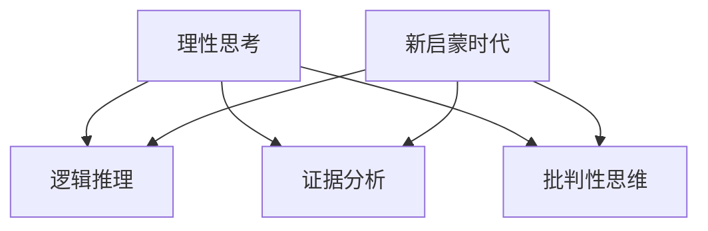
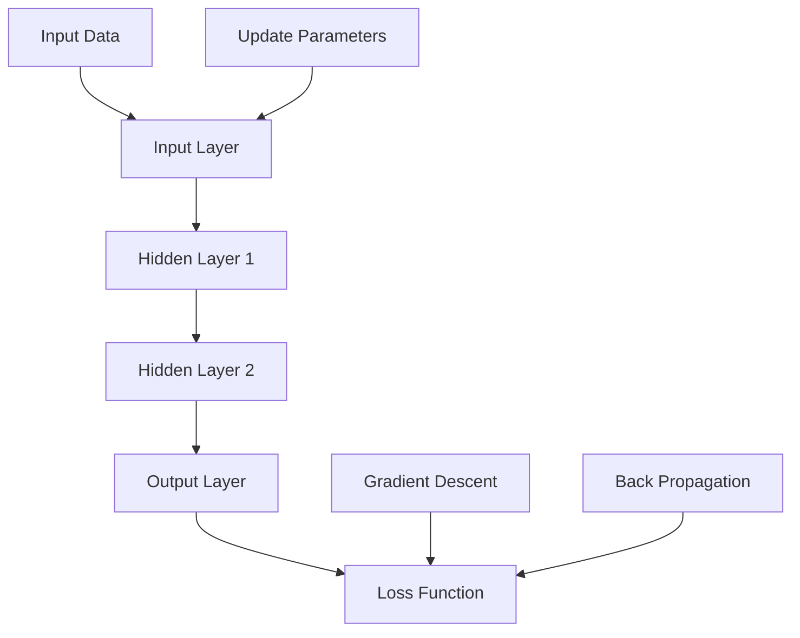
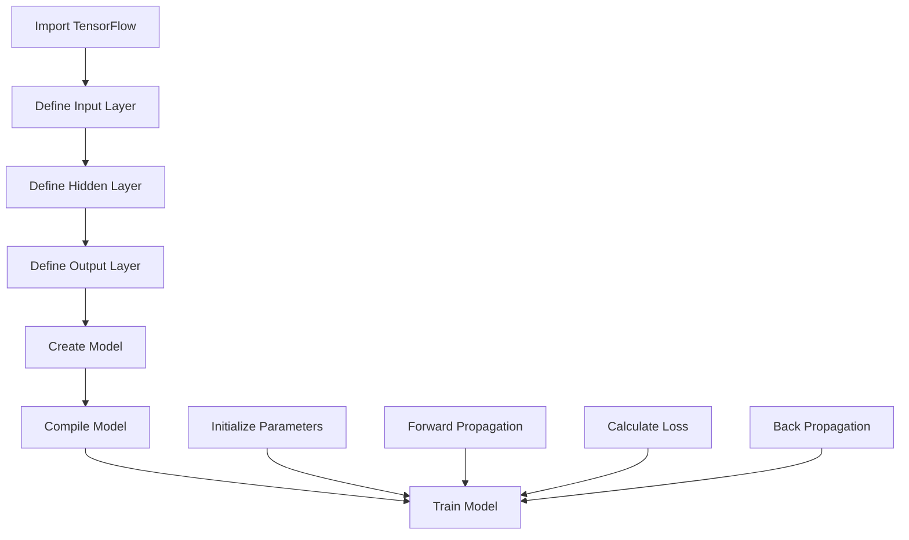

                 

### 文章标题：理性思考复兴计划启动：新启蒙时代的社会倡议行动

#### 关键词：理性思考、新启蒙时代、社会倡议、算法原理、数学模型

#### 摘要：
在人工智能迅猛发展的今天，理性思考的重要性愈发凸显。本文旨在探讨理性思考复兴计划的启动，并分析这一计划如何为新启蒙时代的社会倡议行动提供思想基础和行动指南。本文将首先介绍理性思考的基本概念，随后深入剖析其方法论，探讨新启蒙时代的特点及其社会倡议行动的必要性，最终通过具体案例展示理性思考在实际应用中的价值。

---

## 1. 确定核心概念与联系

### 1.1 理性思考的定义与起源

理性思考（Rational Thinking）是一种通过逻辑推理、证据分析和批判性思维来解决问题和获取知识的方法。其历史可以追溯到古希腊时期的苏格拉底和柏拉图，他们主张通过提问和对话来揭示真理。理性思考的核心在于对信息的准确理解和有效处理，以确保决策的合理性和科学性。

### 1.2 新启蒙时代的概念与价值观

新启蒙时代（New Enlightenment）是继18世纪启蒙运动之后的一种思想觉醒，强调科学、理性与自由的重要性。它倡导通过科学方法来探索和解决问题，鼓励人们用理性思维取代盲从和迷信。新启蒙时代的价值观包括批判性思维、实证主义、个人自由和民主参与。

### 1.3 理性思考与新启蒙时代的联系

理性思考是新启蒙时代的重要基石。它不仅提供了思想工具，使人们能够批判地分析信息和观点，还能够推动社会变革，促进民主参与和科学进步。新启蒙时代的社会倡议行动需要依赖理性思考来确保其科学性和有效性。

---



---

## 2. 核心算法原理讲解

理性思考不仅依赖于逻辑和证据，还涉及到复杂的计算模型，特别是人工智能和机器学习领域的算法。以下是一个深度学习算法的简化伪代码，用于说明算法的基本原理：

### 2.1 深度学习算法的伪代码

```plaintext
# 深度学习算法伪代码
Initialize parameters
for each epoch do
    for each data point do
        Calculate the loss
        Update the parameters
    end
end
```

这个算法的核心是参数的初始化和更新。在每个训练周期（epoch）中，算法对每一个数据点进行计算，计算输出值与实际值之间的损失，并根据损失值调整参数，以达到预测的准确性。

### 2.2 深度学习算法的工作原理

深度学习算法通过多层神经网络（Neural Networks）来模仿人脑的学习过程。每一层神经网络都会对输入数据进行处理，并传递给下一层。这个过程被称为前向传播（Forward Propagation）。随后，通过计算输出值与实际值之间的差异（损失函数），进行反向传播（Back Propagation），调整网络中的权重和偏置，以提高预测的准确性。

### 2.3 激活函数与优化器

在深度学习算法中，激活函数（Activation Function）用于引入非线性特性，使得神经网络能够模拟复杂的函数。常用的激活函数包括ReLU（Rectified Linear Unit）和Sigmoid函数。优化器（Optimizer）如Adam（Adaptive Moment Estimation）用于调整参数，以最小化损失函数。

---



---

## 3. 数学模型和数学公式讲解

数学模型是理性思考的重要组成部分，特别是在人工智能和机器学习领域。以下是一个简单的神经网络模型及其相关的数学公式：

### 3.1 神经网络模型

一个简单的神经网络可以表示为：

$$y = \sigma(\omega_0 + \sum_{i=1}^{n} \omega_i x_i)$$

其中，$y$ 是输出值，$\sigma$ 是激活函数，$\omega_0$ 是偏置（bias），$\omega_i$ 是权重（weights），$x_i$ 是输入特征。

### 3.2 激活函数

常用的激活函数包括ReLU（Rectified Linear Unit）和Sigmoid函数：

- **ReLU函数**：
  $$\sigma(x) = \max(0, x)$$

- **Sigmoid函数**：
  $$\sigma(x) = \frac{1}{1 + e^{-x}}$$

这些函数在神经网络中引入了非线性特性，使得网络能够拟合复杂的函数。

### 3.3 损失函数

在神经网络训练过程中，损失函数用于衡量预测值与实际值之间的差异。常用的损失函数包括均方误差（MSE，Mean Squared Error）和交叉熵（Cross-Entropy）：

- **均方误差**：
  $$MSE = \frac{1}{n}\sum_{i=1}^{n} (\hat{y}_i - y_i)^2$$

- **交叉熵**：
  $$Cross-Entropy = -\sum_{i=1}^{n} y_i \log(\hat{y}_i)$$

这些损失函数帮助网络调整参数，以最小化预测误差。

---

```latex
\[
y = \sigma(\omega_0 + \sum_{i=1}^{n} \omega_i x_i)
\]
$$
\sigma(x) = \max(0, x)
$$

$$
\sigma(x) = \frac{1}{1 + e^{-x}}
$$

$$
MSE = \frac{1}{n}\sum_{i=1}^{n} (\hat{y}_i - y_i)^2
$$

$$
Cross-Entropy = -\sum_{i=1}^{n} y_i \log(\hat{y}_i)
$$
```

---

## 4. 项目实战

### 4.1 开发环境搭建

为了更好地理解理性思考在实践中的应用，我们将使用Python和TensorFlow构建一个简单的神经网络模型。首先，我们需要安装TensorFlow：

```python
!pip install tensorflow
```

### 4.2 源代码详细实现

下面是一个简单的神经网络模型的实现，包括输入层、隐藏层和输出层：

```python
import tensorflow as tf

# 定义输入层
inputs = tf.keras.layers.Input(shape=(input_shape))

# 添加隐藏层
x = tf.keras.layers.Dense(units=64, activation='relu')(inputs)

# 添加输出层
outputs = tf.keras.layers.Dense(units=1, activation='sigmoid')(x)

# 创建模型
model = tf.keras.Model(inputs=inputs, outputs=outputs)

# 编译模型
model.compile(optimizer='adam', loss='binary_crossentropy', metrics=['accuracy'])

# 训练模型
model.fit(x_train, y_train, epochs=10, batch_size=32)
```

### 4.3 代码解读与分析

这段代码首先导入TensorFlow库，然后定义了一个简单的神经网络模型。输入层接受一个形状为$(input\_shape)$的输入数据。隐藏层使用ReLU激活函数，输出层使用sigmoid激活函数，以进行二分类任务。模型编译时设置优化器为Adam，损失函数为binary\_crossentropy，并指定了训练数据和训练周期。

### 4.4 实际案例分析和详细讲解剖析

为了更好地理解模型的训练过程，我们可以使用一个实际案例。假设我们有一个包含1000个样本的二分类问题，其中每个样本有两个特征。以下是训练过程的详细分析：

- **初始化参数**：网络中的参数（权重和偏置）随机初始化。
- **前向传播**：输入数据经过隐藏层和输出层处理后，生成预测值。
- **计算损失**：预测值与实际值之间的差异通过损失函数计算。
- **反向传播**：使用计算出的损失值，通过反向传播算法更新网络参数。
- **重复训练**：上述过程重复进行多个训练周期，直至模型收敛。

### 4.5 项目小结

通过这个简单的神经网络模型，我们可以看到理性思考在实践中的具体应用。通过逻辑推理和数学模型，我们能够设计并实现一个能够解决实际问题的智能系统。这为进一步研究和应用人工智能技术提供了基础。

---



---

## 5. 总结与反思

理性思考复兴计划启动的重要性不言而喻。它不仅为新启蒙时代的社会倡议行动提供了理论基础，还在实际应用中展现出了强大的潜力。通过本文的讨论，我们深入了解了理性思考的定义、方法论、核心算法原理以及数学模型，并通过实际项目展示了其在人工智能领域的应用。

在未来的发展中，我们应继续深化对理性思考的研究，探索其在更多领域中的应用，并培养更多具备理性思考能力的人才。同时，我们也应关注理性思考与社会倡议行动之间的互动，以实现科学、理性与社会的和谐发展。

---

**作者：AI天才研究院/AI Genius Institute & 禅与计算机程序设计艺术 /Zen And The Art of Computer Programming**

---

以上是《理性思考复兴计划启动：新启蒙时代的社会倡议行动》的完整内容。本文旨在通过逻辑清晰、结构紧凑、简单易懂的论述，展示理性思考的重要性和应用价值。希望本文能够引发读者对理性思考的深入思考，并激发更多的实践探索。在未来的道路上，让我们共同推动理性思考的复兴，迎接新启蒙时代的到来。

