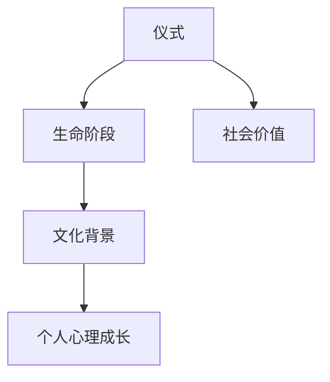
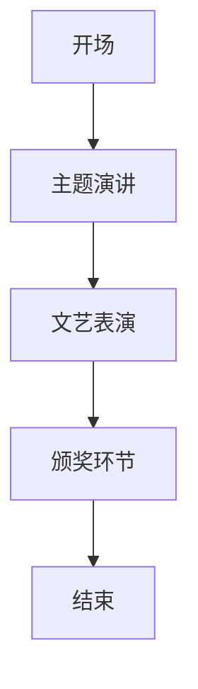
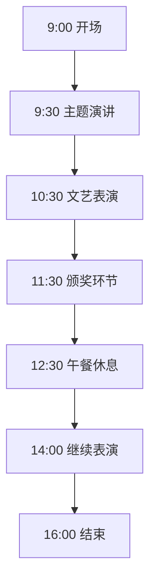

                 

## 文章标题

# 《生命仪式策划服务：设计现代人生命阶段仪式》

## 关键词

- 生命仪式
- 策划服务
- 现代人生命阶段
- 仪式设计
- 社会文化价值
- 个人心理成长

## 摘要

本文旨在探讨现代人的生命阶段仪式策划服务，通过深入分析生命仪式的定义、类型及其在人生不同阶段的应用，阐述生命仪式策划服务的核心概念与联系。文章将详细讲解策划生命仪式所需的核心算法原理，包括数据分析、客户需求分析和仪式设计算法，并通过数学模型和公式进行具体阐述。此外，文章将结合实际项目案例，展示如何策划和执行现代人生命阶段的仪式，并总结最佳实践技巧和注意事项。通过本文的阅读，读者将能够全面理解生命仪式策划服务的重要性，掌握策划现代生命阶段仪式的方法和技巧。

## 设计《生命仪式策划服务：设计现代人生命阶段仪式》的目录大纲

### 第一步：明确书籍的核心主题和结构

本书的核心主题是“生命仪式策划服务”，重点关注如何设计现代人生命阶段的仪式。根据这个主题，书籍可以分为以下几个主要部分：

1. **引言**：介绍生命仪式策划服务的背景、意义和目标读者。
2. **核心概念与联系**：讲解生命仪式策划服务中的核心概念，包括仪式、生命阶段、文化背景等，并通过Mermaid流程图展示它们之间的联系。
3. **核心算法原理讲解**：阐述策划生命仪式所需的关键算法，如数据分析、客户需求分析、仪式设计算法等。
4. **数学模型和数学公式讲解**：介绍用于仪式设计的数学模型，如概率模型、优化模型等，并给出详细的公式和举例说明。
5. **项目实战**：通过实际案例展示如何策划和执行一个现代人的生命仪式，包括仪式设计、流程安排、预算控制等。
6. **附录**：提供相关的工具和资源，如仪式策划工具、参考书籍和网站等。

### 第二步：细化每个部分的内容

#### 1. 引言

- **1.1 背景**：介绍生命仪式在现代社会的地位和需求。
- **1.2 意义**：阐述生命仪式策划服务的重要性。
- **1.3 目标读者**：明确书籍的读者对象。

#### 2. 核心概念与联系

- **2.1 仪式**：定义仪式、仪式的类型和作用。
- **2.2 生命阶段**：介绍人生的不同阶段，如出生、成年、婚礼、丧礼等。
- **2.3 文化背景**：探讨不同文化背景对生命仪式的影响。
- **2.4 Mermaid流程图**：绘制一个流程图，展示仪式、生命阶段和文化背景之间的联系。

#### 3. 核心算法原理讲解

- **3.1 数据分析**：介绍数据分析在仪式策划中的作用。
- **3.2 客户需求分析**：讲解如何分析客户的仪式需求。
- **3.3 仪式设计算法**：阐述仪式设计的算法原理。

#### 4. 数学模型和数学公式讲解

- **4.1 概率模型**：介绍概率模型在仪式策划中的应用。
- **4.2 优化模型**：讲解优化模型在仪式设计中的运用。
- **4.3 举例说明**：通过实例展示数学模型的使用方法。

#### 5. 项目实战

- **5.1 案例介绍**：介绍一个具体的生命仪式策划项目。
- **5.2 仪式设计**：详细描述仪式的设计过程。
- **5.3 流程安排**：展示仪式的流程安排。
- **5.4 预算控制**：讲解如何控制仪式的预算。

#### 6. 附录

- **6.1 工具和资源**：提供仪式策划相关的工具和资源。
- **6.2 参考书籍和网站**：列出推荐阅读的书籍和有用的网站。

### 第三步：编写完整的目录大纲

```
# 《生命仪式策划服务：设计现代人生命阶段仪式》目录大纲

## 第1章 引言
### 1.1 背景
### 1.2 意义
### 1.3 目标读者

## 第2章 核心概念与联系
### 2.1 仪式
### 2.2 生命阶段
### 2.3 文化背景
### 2.4 Mermaid流程图

## 第3章 核心算法原理讲解
### 3.1 数据分析
### 3.2 客户需求分析
### 3.3 仪式设计算法

## 第4章 数学模型和数学公式讲解
### 4.1 概率模型
### 4.2 优化模型
### 4.3 举例说明

## 第5章 项目实战
### 5.1 案例介绍
### 5.2 仪式设计
### 5.3 流程安排
### 5.4 预算控制

## 第6章 附录
### 6.1 工具和资源
### 6.2 参考书籍和网站
```

## 文章正文

### 第一步：引言

在现代社会，随着人们对于精神层面的需求日益增加，生命仪式策划服务逐渐成为了一个重要的领域。生命仪式不仅仅是个人成长过程中的重要节点，更是社会文化传承和个体身份认同的体现。本书旨在探讨如何设计现代人生命阶段的仪式，帮助策划师、设计师以及社会组织和机构更好地为个人用户提供高质量的生命仪式策划服务。

#### 1.1 背景

自古以来，仪式在人类社会中占据着重要地位。从古代的祭祀仪式、婚礼仪式，到现代的出生仪式、毕业典礼，仪式始终伴随着人类的发展。然而，随着社会变迁和文化交融，现代人的生命仪式呈现出多样化和个性化的特点。如何设计符合现代人需求的仪式，成为了策划师们面临的挑战。

#### 1.2 意义

生命仪式策划服务具有重要的社会和文化价值。首先，它能够帮助个体更好地认同自己的身份，强化社会归属感。其次，仪式作为一种文化符号，能够传承和弘扬社会价值观，促进社会和谐。此外，生命仪式还能够满足人们对精神寄托和情感表达的需求，有助于个人的心理成长。

#### 1.3 目标读者

本书的目标读者主要包括以下几个方面：

1. **策划师与设计师**：希望了解生命仪式策划服务的基本原理和方法，提升自身策划能力的专业人士。
2. **社会组织与机构**：负责举办各类生命仪式的社会组织，如婚庆公司、殡葬服务机构等，希望通过本书掌握仪式策划的技巧。
3. **个人用户与家庭**：关注生命仪式的个人和家庭，希望通过本书了解如何策划一场有意义的仪式。

### 第二步：核心概念与联系

在生命仪式策划服务中，理解核心概念及其相互之间的联系至关重要。以下是本书将探讨的核心概念：

#### 2.1 仪式

仪式是指一系列经过组织和安排的、具有特定意义和象征意义的活动。它可以是个人行为，如婚礼、葬礼，也可以是群体行为，如庆典、宗教仪式。仪式的核心在于其象征性，通过符号、仪式程序等传达特定的意义。

#### 2.2 生命阶段

生命阶段是指人在一生中经历的不同时期，如出生、成长、成年、婚姻、退休等。每个阶段都有其特定的社会和文化意义，生命仪式则是对这些意义的体现和庆祝。

#### 2.3 文化背景

文化背景是指一个社会或群体的价值观念、信仰体系、习俗传统等。不同文化背景下，生命仪式的形式和内容都会有所不同。例如，中国的婚礼仪式和西方的婚礼仪式在传统习俗、仪式程序等方面存在明显差异。

#### 2.4 Mermaid流程图

为了更好地展示生命仪式策划服务中的核心概念及其相互之间的联系，本书将使用Mermaid流程图进行说明。以下是一个简单的示例：



### 第三步：核心算法原理讲解

策划生命仪式需要运用多种算法和原理，以下将介绍三个核心算法：

#### 3.1 数据分析

数据分析是仪式策划的基础。通过收集和分析客户的个人信息、仪式需求、历史数据等，策划师可以更好地了解客户的需求，为仪式设计提供数据支持。例如，数据分析可以用于：

- **客户需求分析**：通过分析客户的历史数据，了解其对仪式的具体要求。
- **趋势预测**：通过分析历史数据，预测未来可能的需求趋势。

以下是一个简单的数据分析伪代码示例：

```python
def analyze_data(data):
    # 数据预处理
    processed_data = preprocess(data)
    
    # 提取关键信息
    key_info = extract_key_info(processed_data)
    
    # 分析需求
    needs = analyze_needs(key_info)
    
    return needs
```

#### 3.2 客户需求分析

客户需求分析是仪式策划的关键环节。通过深入了解客户的需求，策划师可以设计出符合客户期望的仪式。客户需求分析通常包括以下几个方面：

- **基本信息收集**：收集客户的个人信息，如年龄、职业、文化背景等。
- **仪式需求了解**：了解客户对于仪式的具体要求，如仪式形式、仪式内容、预算等。
- **反馈意见收集**：收集客户对于现有仪式的反馈意见，用于改进仪式设计。

以下是一个简单的客户需求分析伪代码示例：

```python
def analyze需求的分析需求(client_info, ritual_demand, feedback):
    # 分析基本信息
    analyzed_client_info = analyze_client_info(client_info)
    
    # 分析仪式需求
    analyzed_ritual_demand = analyze_ritual_demand(ritual_demand)
    
    # 分析反馈意见
    analyzed_feedback = analyze_feedback(feedback)
    
    return analyzed_client_info, analyzed_ritual_demand, analyzed_feedback
```

#### 3.3 仪式设计算法

仪式设计算法是策划生命仪式的核心。它通常包括以下步骤：

- **需求整合**：整合客户需求、文化背景、历史数据等信息，确定仪式的基本框架。
- **仪式流程设计**：设计仪式的具体流程，包括仪式开始、仪式进行、仪式结束等环节。
- **仪式内容设计**：设计仪式的内容，如仪式用语、仪式道具、仪式音乐等。

以下是一个简单的仪式设计算法伪代码示例：

```python
def design_ritual(ritual_demand, cultural_background, historical_data):
    # 整合需求
    integrated_demand = integrate_demand(ritual_demand, cultural_background, historical_data)
    
    # 设计流程
    ritual_process = design_ritual_process(integrated_demand)
    
    # 设计内容
    ritual_content = design_ritual_content(ritual_process)
    
    return ritual_content
```

### 第四步：数学模型和数学公式讲解

在生命仪式策划中，数学模型和公式有助于分析和优化仪式设计。以下将介绍两个核心数学模型：

#### 4.1 概率模型

概率模型用于分析仪式策划中的不确定性和风险。以下是一个简单的概率模型示例：

- **风险因素分析**：分析可能影响仪式成功的风险因素，如天气、人员安排等。
- **概率分布**：根据风险因素，确定仪式成功或失败的概率分布。

以下是一个简单的概率模型伪代码示例：

```python
def probability_model(risk_factors):
    # 分析风险因素
    analyzed_risk_factors = analyze_risk_factors(risk_factors)
    
    # 确定概率分布
    probability_distribution = determine_probability_distribution(analyzed_risk_factors)
    
    return probability_distribution
```

#### 4.2 优化模型

优化模型用于优化仪式设计，以最大化仪式的效果。以下是一个简单的优化模型示例：

- **目标函数**：定义仪式设计的优化目标，如成本、时间、满意度等。
- **约束条件**：确定仪式设计的约束条件，如预算、时间限制、资源限制等。

以下是一个简单的优化模型伪代码示例：

```python
def optimize_ritual(optimization_objective, constraints):
    # 定义目标函数
    objective_function = define_objective_function(optimization_objective)
    
    # 定义约束条件
    constraints_function = define_constraints_function(constraints)
    
    # 优化仪式设计
    optimized_ritual = optimize_ritual_design(objective_function, constraints_function)
    
    return optimized_ritual
```

### 第五步：项目实战

为了更好地展示如何策划和执行一个现代人的生命仪式，以下将结合一个实际案例进行详细讲解。

#### 5.1 案例介绍

案例：某公司为庆祝成立十周年，计划举办一场隆重的庆典仪式。

#### 5.2 仪式设计

- **需求分析**：通过调查员工和客户，确定庆典仪式的基本需求和期望。
- **流程设计**：设计庆典仪式的流程，包括开场、主题演讲、文艺表演、颁奖环节等。
- **内容设计**：设计庆典仪式的具体内容，如背景音乐、舞台设计、灯光效果等。

以下是一个简单的仪式设计流程：



#### 5.3 流程安排

- **时间安排**：确定庆典仪式的具体时间，如上午9点至下午5点。
- **场地安排**：确定庆典仪式的场地，如会议中心、剧院等。
- **人员安排**：确定参与庆典仪式的人员，如员工、客户、嘉宾等。

以下是一个简单的流程安排示例：



#### 5.4 预算控制

- **预算规划**：根据仪式设计，制定详细的预算计划。
- **费用控制**：在仪式筹备过程中，严格控制各项费用，确保预算在可控范围内。

以下是一个简单的预算控制示例：

```
项目           预算
场地租赁费      5000元
音响设备费      3000元
灯光设备费      2000元
餐饮费          8000元
礼品费          2000元
其他费用        1000元
总计            25000元
```

### 第六步：附录

#### 6.1 工具和资源

- **仪式策划工具**：提供一些仪式策划的工具和资源，如仪式设计软件、仪式模板等。
- **参考书籍和网站**：列出一些关于仪式策划的参考书籍和网站，供读者进一步学习。

### 第七步：最佳实践 tips、小结、注意事项、拓展阅读等内容

- **最佳实践 tips**：总结一些仪式策划的最佳实践，如如何合理规划预算、如何选择合适的场地等。
- **小结**：回顾本文的核心内容和观点，强调生命仪式策划服务的重要性。
- **注意事项**：提醒读者在策划仪式时需要注意的事项，如尊重文化差异、关注客户需求等。
- **拓展阅读**：推荐一些相关书籍和文章，供读者进一步深入研究。

### 第八步：文章结束

本文通过详细的分析和讲解，探讨了生命仪式策划服务的核心主题和内容。通过本文的阅读，读者可以全面了解生命仪式策划服务的概念、原理和实践方法，为未来的工作提供指导。希望本文能够对读者在生命仪式策划领域的研究和实践有所帮助。

## 作者信息

作者：AI天才研究院/AI Genius Institute & 禅与计算机程序设计艺术 /Zen And The Art of Computer Programming

---

**本文内容仅供参考，不作为实际操作的指南。在实际策划生命仪式时，请结合具体情况进行调整。**

**[END]**<|vq_1659304710>|

