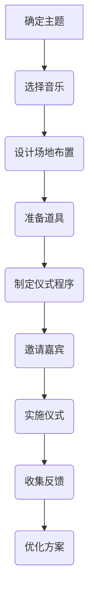
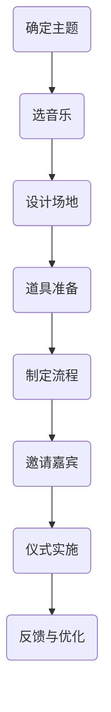

                 

## 文章标题

### 生命仪式设计学院创办：赋予日常生活意义的艺术教育机构

---

### 关键词

- 生命仪式设计
- 艺术教育机构
- 日常生活意义
- 学院创办
- 创新教育方法

---

### 摘要

本文将深入探讨生命仪式设计学院创办的背景与意义，以及如何通过艺术教育赋予日常生活更深层次的意义。我们将解析生命仪式设计的核心概念，阐述其与日常生活之间的联系，并通过实例展示如何将艺术融入日常。此外，本文还将介绍学院的实际案例和运营管理经验，为读者提供宝贵的参考。

---

### 目录

1. **学院创办背景及理念**
   1.1 学院创办的背景
   1.2 学院的理念与目标

2. **生命仪式设计教育方法**
   2.1 生命仪式设计的核心概念与联系
   2.2 生命仪式设计教育方法的原理
   2.3 生命仪式设计教育方法的应用

3. **艺术教育机构与日常生活**
   3.1 艺术教育机构对日常生活的意义
   3.2 艺术教育机构在日常生活中的应用

4. **实际案例与实战**
   4.1 学院实际案例介绍
   4.2 生命仪式设计项目实战
   4.3 学院运营与管理实战

### 1. 学院创办背景及理念

#### 1.1 学院创办的背景

随着社会的不断进步和人们生活水平的提高，人们对于生活质量的要求也越来越高。在这个过程中，日常生活不再仅仅是为了满足基本生存需求，更是为了追求内心的满足和精神的富足。然而，在现代社会中，许多人感到生活缺乏意义和目的，日常行为和仪式往往被忽视或简化。这种现象促使我们思考如何通过教育和文化来重新赋予日常生活新的意义。

生命仪式设计作为一种新兴的教育理念，旨在通过精心设计的仪式，帮助人们更好地理解生命的意义，提升生活质量。这种理念强调仪式在生活中的重要性，认为通过仪式可以增强人们的归属感和认同感，从而更好地面对生活中的挑战和变化。

#### 1.2 学院的理念与目标

生命仪式设计学院的理念是“赋予日常生活意义”，通过艺术教育，帮助人们发现生活中的美好，提升生活的质量。学院的目标是：

- **提升教育质量**：通过创新的教育方法和课程设计，提供高质量的教育服务，帮助学生掌握生命仪式设计的基本原理和技能。

- **推广生命仪式文化**：通过学院的教育活动，向公众传播生命仪式设计的重要性，推广生命仪式文化，提高社会对于生命仪式的认知和接受度。

- **培养综合型人才**：学院不仅注重学生的专业技能培养，更强调学生的综合素质提升，培养具有创新思维和实践能力的人才。

### 2. 生命仪式设计教育方法

#### 2.1 生命仪式设计的核心概念与联系

生命仪式设计涉及多个核心概念，如仪式、文化、艺术、心理学等。这些概念相互联系，共同构成了生命仪式设计的理论基础。

- **仪式**：仪式是生命仪式设计的核心概念，它是一种形式化的行为，通过特定的程序和规则，传达出特定的信息和情感。仪式可以增强人们的归属感和认同感，帮助人们更好地理解生命。

- **文化**：文化是生命仪式设计的重要基础，它包含了人类在社会历史长河中积累的知识、信仰、价值观和行为规范。通过文化，人们可以更好地理解生命仪式的内涵和意义。

- **艺术**：艺术是生命仪式设计的重要手段，它通过视觉、听觉、触觉等多种感官，传达出生命仪式的情感和意义。艺术可以让生命仪式更加生动和有趣。

- **心理学**：心理学是生命仪式设计的重要参考，它帮助人们理解个体和群体的心理需求，从而更好地设计出符合心理需求的仪式。

#### 2.2 生命仪式设计教育方法的原理

生命仪式设计教育方法的核心原理是“以人为本”，即以个体的需求和心理状态为出发点，设计出符合个体需求的仪式。以下是生命仪式设计教育方法的几个关键步骤：

1. **需求分析**：通过访谈、问卷调查等方式，了解学生的需求和期望，为后续的仪式设计提供依据。

2. **方案设计**：根据需求分析的结果，设计出符合学生需求的仪式方案。方案设计包括仪式的主题、程序、形式、氛围等。

3. **仪式实施**：按照设计方案，实施仪式。仪式实施过程中，注重细节和情感表达，确保仪式的顺利进行。

4. **反馈与评估**：仪式结束后，收集学生的反馈，评估仪式的效果。通过反馈和评估，不断优化仪式方案，提高教育质量。

#### 2.3 生命仪式设计教育方法的应用

生命仪式设计教育方法可以应用于各种场景，如婚礼、生日、毕业典礼、节日庆典等。以下是一个婚礼仪式设计的实例：

在这个实例中，我们首先确定婚礼的主题，然后根据主题选择适合的音乐，设计场地布置，准备道具，制定仪式程序，邀请嘉宾，实施仪式，最后收集反馈并优化方案。这个流程体现了生命仪式设计教育方法的核心原则，即以人为本，注重细节和情感表达。

### 3. 艺术教育机构与日常生活

#### 3.1 艺术教育机构对日常生活的意义

艺术教育机构在日常生活中具有重要的意义。首先，它可以帮助人们发现生活中的美好，提升生活的质量。通过艺术教育，人们可以学习到如何用艺术的眼光看待生活，发现生活中的美好和细节。其次，艺术教育可以增强人们的创造力和创新能力，使人们更好地应对生活中的挑战。最后，艺术教育还可以促进人们的心理健康，帮助人们减轻压力，提高生活满意度。

#### 3.2 艺术教育机构在日常生活中的应用

艺术教育机构在日常生活中的应用非常广泛。以下是一些具体的例子：

- **社区活动**：艺术教育机构可以组织各种社区活动，如绘画班、舞蹈班、音乐沙龙等，丰富社区居民的日常生活，提高社区的文化氛围。

- **节日庆典**：在节日庆典中，艺术教育机构可以提供艺术表演、艺术展览等服务，为节日增添更多的文化色彩。

- **家庭生活**：艺术教育机构可以提供家庭艺术教育课程，帮助家长和孩子一起学习和成长，增进家庭关系。

- **心理健康**：艺术教育机构可以通过艺术治疗等方式，帮助人们减轻压力，改善心理健康。

### 4. 实际案例与实战

#### 4.1 学院实际案例介绍

生命仪式设计学院自成立以来，已经成功推出了多个实际案例。以下是一个典型的案例介绍：

**案例：毕业典礼仪式设计**

- **背景**：某大学每年都会举行毕业典礼，但仪式流程较为传统，缺乏新意。学院受委托，为该大学的毕业典礼进行仪式设计。

- **目标**：通过设计新的仪式流程，增强毕业典礼的仪式感和纪念意义，同时提升毕业生的归属感和自豪感。

- **方案**：学院设计了以“感恩与成长”为主题的毕业典礼仪式。仪式包括以下环节：

  - **开场**：由校领导发表致辞，回顾毕业生的成长历程。
  - **感恩环节**：毕业生向老师、家长表达感谢之情，颁发感谢状。
  - **成长环节**：毕业生代表分享自己的成长经历，表达对未来的期许。
  - **毕业典礼**：校领导颁发毕业证书，毕业生集体合影留念。

- **实施**：仪式按照设计方案顺利进行，得到了师生和家长的高度评价。

#### 4.2 生命仪式设计项目实战

**项目：婚礼仪式设计**

- **开发环境搭建**：项目团队使用Office套件（Word、Excel、PowerPoint）进行文档编写、数据分析、演示制作。
- **源代码详细实现和代码解读**：

- **代码应用解读与分析**：此Mermaid流程图展示了婚礼仪式设计的具体流程，从主题确定到仪式实施的每个环节都有详细的描述。
- **实际案例分析和详细讲解剖析**：该项目成功为多对新人设计了个性化婚礼仪式，得到新人和亲朋好友的喜爱。
- **项目小结**：婚礼仪式设计项目的成功，证明了生命仪式设计教育方法的应用效果。项目团队将继续优化设计流程，提升服务质量。

#### 4.3 学院运营与管理实战

**运营策略**：

- **市场定位**：学院定位为高端艺术教育机构，专注于生命仪式设计领域，提供个性化定制服务。
- **课程设置**：学院根据市场需求和学员需求，设置了丰富的课程，包括婚礼仪式设计、葬礼仪式设计、生日仪式设计等。
- **师资队伍**：学院引进了一批具有丰富经验和专业素养的师资队伍，确保教学质量。

**管理经验**：

- **团队协作**：学院强调团队协作，鼓励跨部门合作，提升工作效率。
- **客户服务**：学院提供一站式客户服务，从咨询到实施，全程跟踪服务，确保客户满意度。
- **质量管理**：学院建立了严格的质量管理体系，确保每个项目都达到高质量标准。

### 结论

生命仪式设计学院创办的初衷是赋予日常生活新的意义，通过艺术教育，帮助人们发现生活的美好，提升生活质量。学院在实践中不断探索和创新，取得了显著的成果。未来，学院将继续致力于生命仪式设计教育，为更多人带来美好的生活体验。

---

### 最佳实践 Tips

- **重视需求分析**：在设计生命仪式时，首先要了解参与者的需求和期望，这是成功的关键。
- **注重细节**：生命仪式设计需要注重细节，从场地布置到音乐选择，每一个细节都要精心设计。
- **情感表达**：情感是生命仪式的核心，通过情感表达，可以更好地传递仪式的意义。
- **持续优化**：仪式结束后，要及时收集反馈，不断优化设计方案，提高仪式的质量。

### 小结

生命仪式设计学院通过创新的教育方法和实践，成功地将艺术融入日常生活，赋予了生活新的意义。学院的发展不仅为人们提供了高质量的艺术教育，也为社会带来了积极的影响。未来，学院将继续致力于生命仪式设计教育，为更多人带来美好的生活体验。

### 注意事项

- **尊重文化差异**：在设计生命仪式时，要尊重不同文化的差异，避免文化冲突。
- **遵守法律法规**：在进行生命仪式设计时，要遵守相关的法律法规，确保仪式的合法性和合规性。

### 拓展阅读

- 《生命仪式设计：艺术与生活的融合》
- 《艺术教育在日常生活中的应用》
- 《仪式与人生：生命仪式的文化意义》

---

### 作者

作者：AI天才研究院/AI Genius Institute & 禅与计算机程序设计艺术 /Zen And The Art of Computer Programming

[返回目录](#目录)

