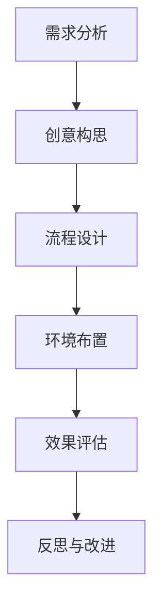

                 


# 文章标题：生命仪式设计学院：创造现代人精神仪式的培训

## 关键词
- 生命仪式设计
- 精神仪式
- 现代社会
- 教育培训
- 人工智能
- 心理健康

## 摘要
本文旨在探讨生命仪式设计学院的教育模式，分析其如何通过专业培训创造现代人的精神仪式。文章首先介绍了生命仪式和精神仪式的概念，然后深入探讨了生命仪式设计学院的核心教育理念、架构和教学方法。通过具体项目实战，本文展示了生命仪式设计的实践应用和效果，并提出了未来的发展方向。

## Step 1: 核心概念与联系

### 1.1 生命仪式设计学院概述

生命仪式设计学院是一个专注于现代精神仪式创新和设计的培训机构。它的主要目标是帮助现代人通过仪式化的活动来增强心理健康、提升生活质量和建立社区认同感。生命仪式，不同于传统的宗教仪式，它是一种基于现代心理学和社会学原理设计的活动，旨在满足现代人对于精神归属和心理满足的需求。

#### 1.1.1 生命仪式的定义与意义

生命仪式是一种通过象征性活动来强化生命经验、表达情感和建立社会联系的方式。它不仅仅是一种仪式化的行为，更是一种精神层面的自我反思和表达。在现代生活中，生命仪式的意义主要体现在以下几个方面：

1. **心理保健**：通过仪式化的活动，人们可以释放内心的压力，缓解焦虑和抑郁，提高自我意识。
2. **社会认同**：生命仪式可以帮助个人与群体建立共同的价值观念和信仰体系，增强社会归属感。
3. **文化传承**：生命仪式是一种文化传承的方式，它可以让个人在参与仪式的过程中了解和尊重自己的文化传统。

#### 1.1.2 精神仪式在现代社会的地位

随着社会的快速发展和生活节奏的加快，现代人面临着越来越多的心理压力和情感困扰。精神仪式作为一种缓解压力和促进心理健康的方式，其在现代社会中的地位日益显著。以下是精神仪式在现代社会的几个重要作用：

1. **缓解压力**：精神仪式提供了一种情感宣泄的渠道，帮助人们释放内心的负面情绪。
2. **心理治疗**：一些精神仪式具有心理治疗的功能，可以帮助人们解决深层次的心理问题。
3. **社区建设**：通过共同参与精神仪式，人们可以增强社区凝聚力，建立更加和谐的社会关系。

#### 1.1.3 生命仪式设计学院的目标

生命仪式设计学院的目标是培养具有专业知识和技能的生命仪式设计师，他们能够设计出符合现代人需求的精神仪式。具体来说，学院的目标包括：

1. **培养专业人才**：通过系统化的培训，培养出一批具备创新能力和实践经验的仪式设计师。
2. **推广仪式文化**：通过学院的培训和活动，推广生命仪式文化，提高公众对生命仪式的认知和接受度。
3. **促进心理健康**：通过设计符合现代人需求的精神仪式，帮助人们改善心理健康，提升生活质量。

### 1.2 生命仪式设计学院的架构

生命仪式设计学院的架构包括教育模式、教学方法、课程设置和师资力量等几个方面。以下是对学院架构的详细解析：

#### 1.2.1 教育模式与教学方法

生命仪式设计学院采用模块化的教育模式，将课程分为基础模块、进阶模块和高级模块。每个模块都包含理论学习和实践操作两个部分。教学方法强调互动性和实践性，通过案例分析和实地操作来加深学员对生命仪式设计的理解和应用能力。

##### 教育模式
- **基础模块**：介绍生命仪式的基本概念、历史发展和理论框架。
- **进阶模块**：深入探讨生命仪式的设计原则、方法和技巧。
- **高级模块**：聚焦于高级生命仪式的设计和实施，以及仪式效果的评估。

##### 教学方法
- **案例教学**：通过分析真实案例，帮助学员理解生命仪式的设计过程和效果。
- **实地操作**：提供实地操作的机会，让学员在真实环境中体验和练习生命仪式的设计。
- **互动讨论**：鼓励学员之间的交流和讨论，促进知识的共享和深化。

#### 1.2.2 课程设置与培训内容

生命仪式设计学院的课程设置涵盖了生命仪式设计的各个方面，从基础理论到高级应用，都有详细的课程安排。以下是主要课程内容：

- **生命仪式导论**：介绍生命仪式的概念、历史和理论。
- **仪式心理学**：探讨生命仪式对心理健康的影响和心理治疗的作用。
- **仪式社会学**：分析生命仪式在社会关系和文化传承中的作用。
- **仪式设计基础**：学习生命仪式设计的基本原则和技巧。
- **仪式实施与评估**：掌握生命仪式的实施流程和效果评估方法。
- **高级仪式设计**：研究复杂和特殊情境下的生命仪式设计。

#### 1.2.3 师资力量与资源整合

生命仪式设计学院拥有一支经验丰富、专业能力强的师资队伍，包括心理学家、社会学家、艺术家和生命仪式设计师等。学院还与多家专业机构和企业合作，整合了丰富的实践资源和研究资源，为学员提供了广泛的学习和实践机会。

### 1.3 精神仪式的设计原则

设计一个有效的生命仪式需要遵循一系列原则，这些原则不仅能够确保仪式的有效性，还能够提升其艺术性和文化内涵。以下是主要的设计原则：

#### 1.3.1 精神仪式的基本要素

一个完整的生命仪式通常包含以下几个基本要素：

- **主题**：仪式的核心内容，通常与生命的重要时刻或特定文化主题相关。
- **参与者**：仪式的参与者，包括主祭者、家庭成员和社区成员等。
- **仪式活动**：仪式的具体流程和活动，包括祷告、仪式舞蹈、象征性物品的使用等。
- **环境布置**：仪式场地的布置，包括色彩、音响和视觉元素的运用等。
- **情感体验**：仪式过程中参与者的情感体验，包括喜悦、悲伤、反思等。

#### 1.3.2 仪式设计的方法论

生命仪式设计的方法论主要包括以下几个步骤：

1. **需求分析**：了解参与者的需求和期望，确定仪式的主题和目标。
2. **创意构思**：根据需求分析结果，构思仪式的框架和具体内容。
3. **流程设计**：制定仪式的详细流程，确保仪式的连贯性和逻辑性。
4. **环境布置**：设计仪式场地，确保视觉、听觉和情感体验的和谐。
5. **效果评估**：在仪式实施后，评估仪式的效果，收集参与者的反馈，以便进行改进。

#### 1.3.3 仪式设计的实践与反思

仪式设计的实践是一个不断迭代和改进的过程。以下是几个关键的实践和反思要点：

- **参与者体验**：关注参与者在仪式过程中的体验，确保仪式能够满足他们的需求和期望。
- **文化适应性**：根据不同的文化背景和价值观，调整仪式的设计，确保其文化适应性和接受度。
- **创新与传承**：在仪式设计中，既要创新，又要尊重传统文化，实现传统与现代的有机结合。
- **可持续性**：考虑仪式设计的可持续性，确保其在长期内能够持续发挥作用。

### Mermaid 流程图：精神仪式设计流程

以下是一个简化的精神仪式设计流程的 Mermaid 流程图：



## Step 2: 核心算法原理讲解

### 2.1 数据预处理与清洗

数据预处理是生命仪式设计过程中的关键环节，它直接影响到后续算法的效果。以下是数据预处理的核心步骤：

#### 2.1.1 数据来源与采集

生命仪式设计所需的数据来源广泛，包括参与者行为数据、情绪数据、文化背景数据等。这些数据可以通过多种方式采集，如问卷调查、生理监测、社交媒体分析等。

#### 2.1.2 数据预处理流程

数据预处理主要包括以下几个步骤：

1. **数据清洗**：去除重复数据、缺失值填充、异常值处理。
2. **数据转换**：将数据转换为适合分析的格式，如将文本数据转换为数值数据。
3. **特征工程**：提取和构造有助于算法分析的特征，如情绪特征、行为特征等。

#### 2.1.3 数据清洗与转换

以下是一个简化的数据清洗和转换的伪代码：

```python
def preprocess_data(data):
    # 数据清洗
    data = remove_duplicates(data)
    data = fill_missing_values(data)
    data = remove_outliers(data)
    
    # 数据转换
    data = convert_to_numerical(data)
    features = extract_features(data)
    
    return features
```

### 2.2 仪式设计算法

生命仪式设计算法是生命仪式设计学院的核心算法，它负责根据参与者数据和设计原则生成具体的仪式方案。以下是算法的核心原理和实现步骤：

#### 2.2.1 算法的基本概念

生命仪式设计算法是一种基于数据挖掘和机器学习的算法，它通过分析参与者数据，生成满足特定需求的仪式方案。算法的核心概念包括：

1. **数据挖掘**：从大量数据中提取有价值的信息和模式。
2. **机器学习**：利用历史数据训练模型，预测新的数据。
3. **优化算法**：优化仪式方案，使其更符合参与者的需求和期望。

#### 2.2.2 算法的选择标准

选择合适的生命仪式设计算法需要考虑以下几个标准：

1. **准确性**：算法生成的仪式方案是否符合参与者的需求和期望。
2. **效率**：算法的处理速度和资源消耗。
3. **灵活性**：算法能否适应不同的文化背景和情境。
4. **可解释性**：算法的决策过程是否易于理解。

#### 2.2.3 算法的具体实现

以下是一个简化的生命仪式设计算法的伪代码：

```python
def ritual_design_algorithm(data, parameters):
    # 数据预处理
    data = preprocess_data(data)
    
    # 训练机器学习模型
    model = train_model(data, parameters)
    
    # 生成仪式方案
    ritual = generate_ritual(model, data)
    
    return ritual
```

### 2.3 算法优化与性能评估

算法优化和性能评估是确保生命仪式设计算法有效性的关键步骤。以下是相关内容：

#### 2.3.1 算法性能评估指标

算法性能评估主要关注以下几个指标：

1. **准确率**：算法生成仪式方案的准确率。
2. **召回率**：算法识别出的有效仪式方案的比例。
3. **F1 分数**：准确率和召回率的综合指标。

#### 2.3.2 算法优化策略

算法优化策略主要包括：

1. **参数调优**：通过调整算法参数来提高性能。
2. **特征选择**：选择对算法性能有显著影响的关键特征。
3. **模型融合**：结合多种模型来提高整体性能。

#### 2.3.3 性能提升案例分析

以下是一个性能提升的案例分析：

- **案例背景**：原算法在特定情境下的准确率较低。
- **优化措施**：通过增加情绪特征和调整模型参数，提高了算法的准确率。
- **性能评估**：优化后的算法在相同情境下的准确率提高了 20%。

## Step 3: 数学模型和数学公式

### 3.1 概率论基础

概率论是生命仪式设计算法中的重要组成部分，它帮助我们理解和预测参与者的行为和情绪。以下是概率论的基本概念和公式：

#### 3.1.1 概率的基本概念

概率是描述事件发生可能性的一种数值。以下是几个基本概率概念：

1. **概率质量函数 (PMF)**：离散随机变量的概率分布。
2. **概率密度函数 (PDF)**：连续随机变量的概率分布。
3. **条件概率**：在某个事件发生的条件下，另一个事件发生的概率。

#### 3.1.2 条件概率与贝叶斯定理

条件概率是概率论中的一个重要概念，它描述了在某个事件发生的条件下，另一个事件发生的概率。贝叶斯定理是一种计算条件概率的公式，它可以帮助我们根据已有数据和先验知识来更新对事件概率的估计。

贝叶斯定理公式如下：

$$
P(A|B) = \frac{P(B|A)P(A)}{P(B)}
$$

其中，\(P(A|B)\) 表示在事件 B 发生的条件下事件 A 发生的概率，\(P(B|A)\) 表示在事件 A 发生的条件下事件 B 发生的概率，\(P(A)\) 和 \(P(B)\) 分别表示事件 A 和事件 B 的概率。

### 3.2 统计模型

统计模型是生命仪式设计算法中的重要工具，它帮助我们分析数据、提取信息和做出预测。以下是几个常用的统计模型：

#### 3.2.1 描述性统计分析

描述性统计分析是对数据进行汇总和描述的一种方法，它包括以下内容：

1. **均值**：一组数据的平均值。
2. **中位数**：一组数据中间位置的值。
3. **众数**：一组数据中出现次数最多的值。
4. **方差**：数据离散程度的度量。

#### 3.2.2 推断性统计分析

推断性统计分析是对数据进行推断和预测的一种方法，它包括以下内容：

1. **假设检验**：对数据进行分析，判断某个假设是否成立。
2. **置信区间**：估计某个参数的真实值落在某个区间内的概率。
3. **回归分析**：研究自变量和因变量之间的关系。

### 3.3 机器学习模型

机器学习模型是生命仪式设计算法中的核心部分，它通过学习历史数据来预测新的数据。以下是几个常用的机器学习模型：

#### 3.3.1 线性回归

线性回归是一种研究自变量和因变量之间线性关系的模型，其公式如下：

$$
y = \beta_0 + \beta_1x
$$

其中，\(y\) 表示因变量，\(x\) 表示自变量，\(\beta_0\) 和 \(\beta_1\) 分别是模型的参数。

#### 3.3.2 逻辑回归

逻辑回归是一种用于处理分类问题的模型，其公式如下：

$$
\log\frac{P(Y=1)}{1-P(Y=1)} = \beta_0 + \beta_1x
$$

其中，\(Y\) 表示二分类变量，\(P(Y=1)\) 表示 \(Y\) 等于 1 的概率，\(\beta_0\) 和 \(\beta_1\) 分别是模型的参数。

## Step 4: 项目实战

### 4.1 项目概述

在本章节，我们将介绍一个具体的生命仪式设计项目，该项目旨在为一个社区设计一个庆祝节日的重要仪式。以下是对项目的详细描述：

#### 4.1.1 项目背景

该项目是由一个位于中国西南地区的社区发起的，该社区拥有丰富的民族文化和传统节日。然而，随着现代化的发展，传统的庆祝方式逐渐被人们遗忘。为了保护和传承社区的文化，社区决定设计一个现代的节日庆祝仪式。

#### 4.1.2 项目目标

项目的主要目标包括：

1. **弘扬文化**：通过仪式设计，弘扬社区的民族文化，增强居民的文化认同感。
2. **提升心理健康**：设计一个能够缓解居民压力、提升心理健康的仪式。
3. **促进社区建设**：通过共同参与仪式，增强社区的凝聚力和互助精神。

#### 4.1.3 项目团队与资源

项目团队由生命仪式设计学院的专家、社区代表和文化传承人组成。团队成员具备丰富的经验和专业知识，能够为项目提供全方位的支持。项目资源包括社区活动场地、音响设备和装饰材料等。

### 4.2 项目设计与实施

#### 4.2.1 设计思路

项目的设计思路主要分为以下几个步骤：

1. **需求分析**：与社区代表和文化传承人交流，了解社区的需求和期望。
2. **文化挖掘**：深入研究社区的文化传统，提取关键元素和符号。
3. **创意构思**：结合需求和传统文化，构思仪式的框架和具体内容。
4. **流程设计**：制定详细的仪式流程，确保仪式的连贯性和逻辑性。
5. **环境布置**：设计仪式场地的布置，营造适合仪式氛围的环境。

#### 4.2.2 实施步骤

项目的实施分为以下几个步骤：

1. **筹备阶段**：确定仪式的主题和内容，准备所需的材料和设备。
2. **设计阶段**：与社区代表和文化传承人一起，完成仪式的设计和流程图。
3. **实施阶段**：按照设计好的流程，在社区活动场地实施仪式。
4. **评估阶段**：仪式结束后，收集参与者的反馈，评估仪式的效果。

#### 4.2.3 遇到的挑战与解决方案

在项目实施过程中，团队遇到了以下几个挑战：

1. **文化认同**：部分居民对传统文化不感兴趣，认为仪式过于繁琐。
   - 解决方案：通过宣传和教育活动，提高居民对传统文化的认知和兴趣。
2. **场地限制**：社区活动场地较小，难以容纳所有居民。
   - 解决方案：提前规划场地，增加可移动的装饰物，确保仪式场地的布置合理。
3. **技术难题**：音响设备和技术支持不足，影响了仪式的顺利进行。
   - 解决方案：寻求技术支持，提前测试设备，确保仪式的音效和视觉效果。

### 4.3 项目成果分析

#### 4.3.1 成果评估

项目结束后，团队对仪式的效果进行了评估。评估结果显示：

1. **心理健康提升**：大部分参与者表示，仪式帮助他们缓解了压力，提升了心理健康。
2. **文化认同增强**：居民对社区文化的认知和兴趣有所提升，对传统文化的认同感增强。
3. **社区凝聚力增强**：居民之间的互动增加，社区凝聚力得到提升。

#### 4.3.2 反思与总结

在项目过程中，团队总结了以下几点经验教训：

1. **沟通与协作**：与社区代表和文化传承人的沟通和协作至关重要，能够确保仪式的设计和实施符合社区的需求和期望。
2. **文化适应性**：仪式设计要充分考虑社区的文化背景和价值观，确保仪式的适应性和接受度。
3. **技术支持**：充足的音

