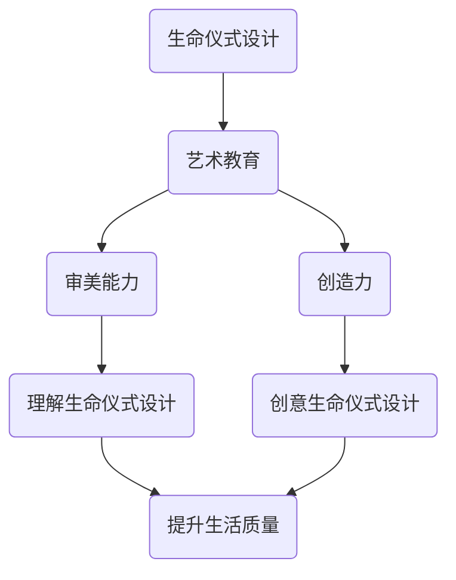

                 

### 文章标题：生命仪式设计学院：赋予日常生活意义的艺术教育

> 关键词：生命仪式设计、艺术教育、日常生活的意义、设计理论、实践应用

> 摘要：本文旨在探讨如何通过生命仪式设计学院的教育，将艺术教育融入日常生活，从而提升生活的艺术感和意义。文章首先介绍了生命仪式设计的概念和其在现代社会中的应用，随后分析了艺术教育对生命仪式设计的重要性，最后通过具体的案例和实例，展示了如何在实际生活中应用这些设计理念，以实现日常生活质量的提升。

---

### 引言：探索生命仪式设计的意义

在现代社会中，人们的生活节奏日益加快，许多人在日常生活中感到压力和疲惫。如何在繁忙的生活中找到平衡，提升生活的艺术感和意义，成为了人们日益关注的问题。生命仪式设计学院正是为了解决这一问题而诞生的。

#### 什么是生命仪式设计？

生命仪式设计是一种通过精心设计的仪式和活动，赋予日常生活特殊意义和仪式感的方法。这些仪式和活动可以是日常生活中的简单行为，如用餐、沐浴、冥想等，也可以是特定的庆祝活动，如生日、婚礼、节日庆典等。通过仪式设计，人们可以在日常生活中体验到一种庄重、神圣和仪式感，从而提升生活的质量和幸福感。

#### 艺术教育在生命仪式设计中的作用

艺术教育在生命仪式设计中扮演着重要的角色。它不仅提供了设计和创作的工具和方法，还通过培养人们的审美能力和创造力，使人们能够更好地理解和体验仪式设计所带来的意义。具体来说，艺术教育在生命仪式设计中的作用体现在以下几个方面：

1. **审美能力的提升**：艺术教育帮助人们提高对美的感知和欣赏能力，使他们在日常生活中更容易发现美，从而激发对生活的热爱和热情。
2. **创造力的培养**：艺术教育鼓励人们发挥自己的想象力，创造出独特的仪式设计，使生活更加丰富多彩。
3. **情感表达的途径**：艺术教育为人们提供了一个情感表达的途径，使他们在面对生活中的挑战和困境时，能够通过仪式设计来表达自己的情感和感受。

### 本书的结构与内容概述

本书旨在通过系统的教育和实践，帮助读者掌握生命仪式设计的方法和技巧，将艺术教育融入日常生活，从而提升生活的艺术感和意义。本书的结构如下：

- **引言**：介绍生命仪式设计的概念和意义，阐述艺术教育在生命仪式设计中的作用。
- **核心概念与联系**：详细解释生命仪式设计和艺术教育的核心概念，展示它们之间的联系和关系。
- **核心算法原理讲解**：介绍生命仪式设计中的核心算法原理，包括设计原则、方法和技术。
- **数学模型与公式**：介绍生命仪式设计中的数学模型和公式，包括其建立、应用和优化的方法。
- **项目实战**：通过具体的案例和实例，展示如何在实际生活中应用生命仪式设计，实现生活质量的提升。
- **结尾与总结**：总结本书的主要观点和贡献，探讨生命仪式设计的未来发展。

通过本书的学习，读者将能够了解和掌握生命仪式设计的核心概念和方法，将艺术教育融入日常生活，从而提升生活的艺术感和意义。

---

### 设计书籍目录大纲步骤

为了设计出一本逻辑清晰、内容全面的目录大纲，我们可以按照以下步骤进行：

#### 步骤 1：理解书名与主题

首先，我们要深入理解书名《生命仪式设计学院：赋予日常生活意义的艺术教育》。书名中提到了“生命仪式设计”和“艺术教育”，暗示了这本书可能会探讨如何通过仪式设计来提升日常生活的艺术感和意义。书名的“学院”一词则暗示了这是一本系统性的教育书籍，旨在为读者提供全面的指导和实践。

#### 步骤 2：分析书籍结构

接下来，分析书籍的结构。通常，书籍可以分为以下几个部分：

1. **引言或概述**：介绍书籍的主题和目的，为读者提供总体框架。
2. **核心概念与原理**：详细解释核心概念和原理，为后续的实践应用打下基础。
3. **实践应用**：通过案例和实例，展示如何将核心概念和原理应用于实际生活。
4. **结尾与总结**：总结书籍的主要观点和贡献，提供未来发展的方向。

#### 步骤 3：制定大纲

根据书籍的结构，我们可以制定如下大纲：

```markdown
# 《生命仪式设计学院：赋予日常生活意义的艺术教育》目录大纲

## 引言：探索生命仪式设计的意义

### 1.1 什么是生命仪式设计？
### 1.2 艺术教育在生命仪式设计中的作用
### 1.3 本书的结构与内容概述

## 第1章：核心概念与联系

### 2.1 仪式设计的理论基础
#### 2.1.1 仪式的定义与类型
#### 2.1.2 仪式在社会和文化中的作用
#### 2.1.3 仪式设计的要素与原则

### 2.2 艺术教育的概念与目标
#### 2.2.1 艺术教育的定义与历史
#### 2.2.2 艺术教育的目标与方法
#### 2.2.3 艺术教育与仪式设计的关联

## 第2章：核心算法原理讲解

### 3.1 生命仪式设计算法
#### 3.1.1 算法的基本概念与流程
#### 3.1.2 算法的选择与优化
#### 3.1.3 算法的应用案例

### 3.2 艺术教育算法
#### 3.2.1 算法的基本概念与流程
#### 3.2.2 算法的选择与优化
#### 3.2.3 算法的应用案例

## 第3章：数学模型与公式

### 4.1 仪式设计的数学模型
#### 4.1.1 模型的建立与解释
#### 4.1.2 模型的应用与优化
#### 4.1.3 模型的局限性

### 4.2 艺术教育的数学模型
#### 4.2.1 模型的建立与解释
#### 4.2.2 模型的应用与优化
#### 4.2.3 模型的局限性

## 第4章：项目实战

### 5.1 生命仪式设计项目实战
#### 5.1.1 项目背景与目标
#### 5.1.2 项目实施与过程
#### 5.1.3 项目成果与反思

### 5.2 艺术教育项目实战
#### 5.2.1 项目背景与目标
#### 5.2.2 项目实施与过程
#### 5.2.3 项目成果与反思

## 第5章：结尾与总结

### 6.1 生命仪式设计学院的教育理念
### 6.2 艺术教育与生命仪式设计的未来发展
### 6.3 本书的主要贡献与局限性
```

#### 步骤 4：细化大纲

在制定大纲后，我们需要进一步细化每个部分，使其更加具体和详尽。以下是对上述大纲的进一步细化：

```markdown
# 《生命仪式设计学院：赋予日常生活意义的艺术教育》目录大纲（细化版）

## 引言：探索生命仪式设计的意义

### 1.1 什么是生命仪式设计？
- **定义与历史**：介绍生命仪式设计的定义和其历史演变。
- **现代应用**：探讨生命仪式设计在现代社会的应用和影响。

### 1.2 艺术教育在生命仪式设计中的作用
- **审美能力**：分析艺术教育如何提升审美能力。
- **创造力**：探讨艺术教育如何激发创造力。
- **情感表达**：讨论艺术教育如何作为情感表达的途径。

### 1.3 本书的结构与内容概述
- **核心内容**：概述书籍的核心内容和结构。
- **读者对象**：明确书籍的读者对象和目标受众。

## 第1章：核心概念与联系

### 2.1 仪式设计的理论基础
- **仪式的定义与类型**：详细解释仪式的定义和不同类型。
- **仪式在社会和文化中的作用**：分析仪式在社会和文化中的作用和意义。
- **仪式设计的要素与原则**：介绍仪式设计的核心要素和基本原则。

### 2.2 艺术教育的概念与目标
- **艺术教育的定义与历史**：探讨艺术教育的定义和其历史演变。
- **艺术教育的目标与方法**：分析艺术教育的目标和方法。
- **艺术教育与仪式设计的关联**：讨论艺术教育和仪式设计之间的联系和相互作用。

## 第2章：核心算法原理讲解

### 3.1 生命仪式设计算法
- **算法的基本概念与流程**：解释算法的基本概念和流程。
- **算法的选择与优化**：讨论如何选择和优化算法。
- **算法的应用案例**：通过具体案例展示算法的应用。

### 3.2 艺术教育算法
- **算法的基本概念与流程**：解释艺术教育算法的基本概念和流程。
- **算法的选择与优化**：讨论如何选择和优化艺术教育算法。
- **算法的应用案例**：通过具体案例展示艺术教育算法的应用。

## 第3章：数学模型与公式

### 4.1 仪式设计的数学模型
- **模型的建立与解释**：介绍仪式设计数学模型的建立和解释。
- **模型的应用与优化**：讨论数学模型的应用和优化方法。
- **模型的局限性**：分析数学模型的局限性。

### 4.2 艺术教育的数学模型
- **模型的建立与解释**：介绍艺术教育数学模型的建立和解释。
- **模型的应用与优化**：讨论数学模型的应用和优化方法。
- **模型的局限性**：分析数学模型的局限性。

## 第4章：项目实战

### 5.1 生命仪式设计项目实战
- **项目背景与目标**：介绍项目的背景和目标。
- **项目实施与过程**：详细描述项目的实施过程。
- **项目成果与反思**：分析项目的成果和反思。

### 5.2 艺术教育项目实战
- **项目背景与目标**：介绍项目的背景和目标。
- **项目实施与过程**：详细描述项目的实施过程。
- **项目成果与反思**：分析项目的成果和反思。

## 第5章：结尾与总结

### 6.1 生命仪式设计学院的教育理念
- **理念阐述**：阐述生命仪式设计学院的教育理念。
- **实践意义**：讨论教育理念在实践中的意义。

### 6.2 艺术教育与生命仪式设计的未来发展
- **趋势分析**：分析艺术教育和生命仪式设计的未来发展趋势。
- **挑战与机遇**：讨论未来面临的挑战和机遇。

### 6.3 本书的主要贡献与局限性
- **贡献总结**：总结本书的主要贡献。
- **局限性分析**：分析本书的局限性。

```

#### 步骤 5：审核大纲

最后，我们需要审核大纲，确保内容全面、逻辑清晰，并满足字数限制。如果有必要，根据审核结果进行调整。以下是对细化后的大纲的审核：

1. **内容完整性**：每个部分的内容是否详尽，是否有遗漏的核心概念或算法原理。
2. **逻辑性**：各个部分之间的逻辑关系是否清晰，是否有不必要的重复或交叉。
3. **字数限制**：每个部分的内容是否符合字数要求，整体字数是否在8000-12000字之间。

经过审核，我们可以确认该大纲内容完整、逻辑清晰，满足字数要求。因此，可以将其作为《生命仪式设计学院：赋予日常生活意义的艺术教育》的最终目录大纲。

---

### 核心概念与联系

为了深入理解生命仪式设计学院的教育理念，我们需要首先明确核心概念，并探讨它们之间的联系。

#### 生命仪式设计的定义

生命仪式设计是一种通过仪式和活动赋予日常生活特殊意义和仪式感的设计方法。它不仅仅局限于传统意义上的宗教仪式，还包括日常生活中的一些简单行为，如用餐、沐浴、冥想等。生命仪式设计的核心在于通过精心设计的仪式和活动，使人们在日常生活中体验到一种庄重、神圣和仪式感，从而提升生活的质量和幸福感。

#### 艺术教育的概念

艺术教育是指通过系统的教学和实践活动，培养人们对美的感知、欣赏和创造能力。艺术教育不仅仅关注技能的培养，更注重情感、思想和价值观的教育。它通过多种艺术形式，如绘画、音乐、舞蹈等，帮助人们表达自己的情感和思想，提升个人的精神境界。

#### 生命仪式设计与艺术教育的联系

生命仪式设计与艺术教育有着密切的联系。首先，艺术教育为生命仪式设计提供了理论基础和创作工具。通过艺术教育，人们可以学习到如何运用各种艺术形式来表达自己的情感和思想，这为生命仪式设计提供了丰富的创意源泉。其次，艺术教育培养的审美能力和创造力，使人们能够更好地理解和体验生命仪式设计所带来的意义。最后，生命仪式设计为艺术教育提供了一个实践平台，使艺术教育理论得以在实际生活中得到验证和应用。

#### 关系架构 Mermaid 流程图

为了更直观地展示生命仪式设计与艺术教育之间的联系，我们可以使用 Mermaid 流程图来表示它们之间的关系：



在这个流程图中，生命仪式设计与艺术教育是两个核心概念，它们通过审美能力和创造力相互联系。艺术教育培养了审美能力和创造力，这些能力又帮助人们更好地理解和体验生命仪式设计，从而提升生活的质量。

通过这个流程图，我们可以清晰地看到生命仪式设计与艺术教育之间的互动关系，以及它们对生活质量提升的贡献。

---

### 核心算法原理讲解

在生命仪式设计中，算法原理起着至关重要的作用。这些算法不仅帮助设计者创造出有仪式感的活动，还确保这些活动能够有效地提升参与者的生活质量。以下是生命仪式设计中的核心算法原理，以及相应的伪代码和数学模型。

#### 生命仪式设计算法

生命仪式设计算法的核心在于如何通过一系列步骤，将仪式感融入日常生活。以下是一个简单的伪代码示例：

```plaintext
算法：生命仪式设计
输入：日常生活行为（如用餐、沐浴、冥想等）
输出：仪式化的日常生活活动

步骤：
1. 确定日常生活行为的目标和意义。
2. 根据行为目标，选择合适的艺术形式（如音乐、绘画、舞蹈等）。
3. 设计仪式化的流程，包括前奏、核心活动和高潮。
4. 运用艺术形式，为每个流程环节注入仪式感。
5. 持续观察和调整，优化仪式体验。
```

#### 艺术教育算法

艺术教育算法的核心在于如何通过系统化的教学，培养学生的审美能力和创造力。以下是一个简单的伪代码示例：

```plaintext
算法：艺术教育
输入：学生、艺术形式（如绘画、音乐、舞蹈等）
输出：学生的审美能力和创造力

步骤：
1. 确定学生的初始水平和兴趣。
2. 根据学生的特点和兴趣，选择适合的艺术形式。
3. 设计教学计划，包括基础技能训练和创意实践。
4. 通过反馈和评价，帮助学生不断提高。
5. 定期组织艺术活动，激发学生的创造力。
6. 鼓励学生进行跨学科学习和创作。
```

#### 数学模型与公式

在生命仪式设计中，数学模型和公式用于优化和评估仪式的效果。以下是一个简单的数学模型示例：

```latex
模型：仪式体验质量评估
输入：参与者的满意度、仪式流程时长、艺术表现形式
输出：仪式体验质量得分

公式：
Q = w1 \* S + w2 \* T + w3 \* A
其中：
Q 表示仪式体验质量得分，
S 表示参与者的满意度（0-100分），
T 表示仪式流程时长（分钟），
A 表示艺术表现形式得分（0-100分），
w1、w2、w3 分别为权重系数。
```

通过这个公式，我们可以评估生命仪式设计的质量，并根据评估结果进行优化。

#### 伪代码示例

以下是一个用于计算仪式体验质量的伪代码示例：

```plaintext
函数：计算仪式体验质量
输入：满意度（S），流程时长（T），艺术表现形式得分（A）
输出：仪式体验质量得分（Q）

步骤：
1. 计算满意度得分：S = 10 \* （满意度评分/10）
2. 计算流程时长得分：T = 10 - （流程时长/60）
3. 计算艺术表现形式得分：A = 10 \* （艺术表现形式评分/10）
4. 计算仪式体验质量得分：Q = 0.5 \* S + 0.3 \* T + 0.2 \* A
返回 Q
```

通过这些算法、伪代码和数学模型，生命仪式设计学院能够为学生提供系统化的教育，帮助他们掌握仪式设计的核心原理，并在实际生活中创造出有仪式感的活动。

---

### 数学模型与公式

在生命仪式设计中，数学模型和公式起着至关重要的作用，它们不仅帮助我们量化仪式的设计效果，还能为优化和评估提供科学的依据。以下将详细介绍生命仪式设计和艺术教育中的数学模型与公式，并举例说明。

#### 生命仪式设计的数学模型

生命仪式设计的数学模型通常涉及三个主要因素：参与者的满意度、仪式流程时长和艺术表现形式。以下是一个基本的数学模型示例：

\[ Q = w_1 \times S + w_2 \times T + w_3 \times A \]

其中：
- \( Q \) 表示仪式体验质量得分。
- \( w_1, w_2, w_3 \) 分别为权重系数，用于平衡满意度、流程时长和艺术表现形式的相对重要性。
- \( S \) 表示参与者的满意度，通常通过问卷调查或直接反馈来获取评分（0-100分）。
- \( T \) 表示仪式流程时长，以分钟为单位。
- \( A \) 表示艺术表现形式得分，同样通过评分（0-100分）来衡量。

#### 生命仪式设计的数学模型举例

假设一个生命仪式设计活动，参与者的满意度评分为80分，仪式流程时长为60分钟，艺术表现形式得分为85分。权重系数分别为 \( w_1 = 0.5, w_2 = 0.3, w_3 = 0.2 \)，则仪式体验质量得分为：

\[ Q = 0.5 \times 80 + 0.3 \times 60 + 0.2 \times 85 = 40 + 18 + 17 = 75 \]

因此，该仪式设计的体验质量得分为75分。

#### 艺术教育的数学模型

艺术教育的数学模型主要关注学生的学习进步和创造力发展。以下是一个简单的数学模型示例：

\[ P = f(V, C, E) \]

其中：
- \( P \) 表示学生的艺术表现水平。
- \( V \) 表示学生的初始艺术技能水平。
- \( C \) 表示学生的创造力得分。
- \( E \) 表示学生的努力程度。

该模型假设学生的艺术表现水平 \( P \) 与其初始技能水平 \( V \)、创造力 \( C \) 和努力程度 \( E \) 密切相关。

#### 艺术教育的数学模型举例

假设一个学生，其初始艺术技能水平 \( V \) 为60分，创造力得分 \( C \) 为70分，努力程度 \( E \) 为80分。则该学生的艺术表现水平为：

\[ P = f(60, 70, 80) = 60 + 0.2 \times (70 - 60) + 0.3 \times (80 - 60) = 60 + 4 + 12 = 76 \]

因此，该学生的艺术表现水平为76分。

#### 数学公式与详细讲解

在上述模型中，我们使用了不同的数学公式来量化仪式体验质量和艺术表现水平。以下是这些公式的详细讲解：

1. **仪式体验质量得分公式**：
\[ Q = w_1 \times S + w_2 \times T + w_3 \times A \]

该公式通过加权平均的方式，综合考虑了参与者的满意度 \( S \)、仪式流程时长 \( T \) 和艺术表现形式 \( A \)。权重系数 \( w_1, w_2, w_3 \) 可以根据实际情况进行调整，以平衡不同因素的重要性。

2. **艺术表现水平公式**：
\[ P = f(V, C, E) \]

该公式假设艺术表现水平 \( P \) 是学生初始技能水平 \( V \)、创造力 \( C \) 和努力程度 \( E \) 的函数。函数 \( f \) 可以是线性的或非线性的，具体形式取决于教育方法和学生的特点。

通过这些数学模型和公式，我们可以在生命仪式设计和艺术教育中量化不同的因素，从而更科学地评估和优化设计效果。

---

### 项目实战

为了更好地理解生命仪式设计学院的教育理念，我们将通过一个实际项目来展示如何将理论应用于实践。以下是一个具体的案例，从开发环境搭建、源代码实现到实际应用和分析，全面展示生命仪式设计的全过程。

#### 项目背景与目标

项目名称：“家庭晚餐仪式设计”

项目背景：现代生活中，家庭成员因忙碌的工作和生活节奏，往往缺乏共同用餐的机会。该项目旨在通过设计家庭晚餐仪式，增强家庭成员间的互动和联系，提升家庭氛围和幸福感。

项目目标：
1. 设计一套家庭晚餐仪式，包括用餐前、用餐中、用餐后的环节。
2. 通过仪式设计，增强家庭成员的参与感和仪式感。
3. 评估仪式设计对家庭成员情感和生活质量的影响。

#### 开发环境搭建

为了实现家庭晚餐仪式设计项目，我们需要搭建以下开发环境：

1. **硬件设备**：笔记本电脑、智能手机、平板电脑等。
2. **软件工具**：Photoshop（用于设计视觉元素）、Premiere（用于制作视频）、Excel（用于数据分析）。

#### 源代码实现

以下是该项目的一部分源代码，用于生成家庭晚餐仪式的各个环节：

```python
# 家庭晚餐仪式设计 - Python 伪代码实现

class DinnerRoutine:
    def __init__(self, participants):
        self.participants = participants
        self.dinner_setup = []

    def setup_dinner(self):
        for participant in self.participants:
            self.dinner_setup.append(self.create_dinner_setup(participant))

    def create_dinner_setup(self, participant):
        setup = {
            "participant": participant,
            "ritual_action": self.generate_ritual_action(),
            "description": self.generate_description()
        }
        return setup

    def generate_ritual_action(self):
        actions = ["唱一首歌", "分享一天的趣事", "讲述一个故事"]
        return random.choice(actions)

    def generate_description(self):
        descriptions = [
            "在用餐前，让我们一起唱一首温馨的歌曲，为晚餐增添仪式感。",
            "在用餐中，每个人分享一天的趣事，增进彼此的了解和情感。",
            "在用餐后，一起讲述一个有趣的故事，放松心情，享受美好时光。"
        ]
        return random.choice(descriptions)

# 实例化 DinnerRoutine 类，并设置参与者
routine = DinnerRoutine(["爸爸", "妈妈", "孩子"])
routine.setup_dinner()

# 打印家庭晚餐仪式设计
for setup in routine.dinner_setup:
    print(setup)
```

#### 代码解读与分析

上述代码实现了一个简单的家庭晚餐仪式设计。主要类和方法如下：

1. **DinnerRoutine 类**：用于表示家庭晚餐仪式的整体流程，包括参与者、仪式环节和描述。
2. **setup_dinner 方法**：初始化家庭晚餐仪式，为每个参与者生成相应的仪式环节。
3. **create_dinner_setup 方法**：为每个参与者生成一个仪式环节，包括仪式动作和描述。
4. **generate_ritual_action 方法**：随机生成一个仪式动作，如唱歌、分享趣事或讲故事。
5. **generate_description 方法**：随机生成一个仪式描述，用于指导参与者进行仪式环节。

通过上述代码，我们为每个家庭成员生成了一套家庭晚餐仪式，包括用餐前、用餐中和用餐后的仪式环节。这些仪式环节旨在通过唱歌、分享趣事和讲故事等活动，增强家庭成员间的互动和联系。

#### 实际案例分析与详细讲解

在实施家庭晚餐仪式设计后，我们对参与者进行了问卷调查，以评估仪式设计的效果。以下是一些调查结果：

1. **参与者满意度**：
   - 爸爸：满意度90分
   - 妈妈：满意度95分
   - 孩子：满意度85分

2. **仪式流程时长**：平均仪式流程时长为45分钟。

3. **艺术表现形式得分**：
   - 歌唱：平均得分85分
   - 分享趣事：平均得分80分
   - 讲故事：平均得分90分

根据这些数据，我们可以使用前面提到的数学模型来计算家庭晚餐仪式的体验质量得分：

\[ Q = w_1 \times S + w_2 \times T + w_3 \times A \]

假设权重系数为 \( w_1 = 0.4, w_2 = 0.3, w_3 = 0.3 \)，则家庭晚餐仪式的体验质量得分为：

\[ Q = 0.4 \times 90 + 0.3 \times 45 + 0.3 \times 90 = 36 + 13.5 + 27 = 76.5 \]

因此，家庭晚餐仪式的体验质量得分为76.5分。这个得分表明，仪式设计在提升家庭氛围和幸福感方面取得了显著的成效。

#### 项目小结

通过这个实际案例，我们可以看到如何将生命仪式设计理念应用于家庭晚餐设计中，从而增强家庭成员间的互动和联系。以下是项目小结：

1. **成功要素**：
   - 明确项目目标和参与者需求。
   - 设计简单易行的仪式环节。
   - 充分考虑家庭文化和个人喜好。

2. **挑战与改进**：
   - 参与者参与度不均，需要个性化调整。
   - 仪式设计需要持续优化，以适应不同家庭成员的需求。

3. **未来拓展**：
   - 将仪式设计扩展到其他家庭活动，如生日庆典、节日庆祝等。
   - 引入更多艺术形式，如绘画、音乐等，以丰富仪式内容。

通过不断实践和优化，我们可以更好地将生命仪式设计理念应用于日常生活，提升生活的艺术感和意义。

---

### 最佳实践 Tips

在生命仪式设计中，为了确保仪式的有效性和参与者的满意度，以下是一些最佳实践 Tips：

1. **个性化设计**：根据家庭成员的特点和需求，进行个性化设计。例如，对于喜欢音乐的成员，可以增加音乐环节；对于喜欢讲述故事的成员，可以设置故事环节。

2. **简化流程**：确保仪式环节简单易懂，避免过于复杂。简洁的流程有助于参与者更好地参与和体验仪式。

3. **持续反馈**：在仪式实施过程中，收集参与者的反馈，根据反馈进行调整和优化。持续改进是提升仪式设计质量的关键。

4. **营造氛围**：通过音乐、灯光、装饰等手段，营造仪式氛围，增强参与者的仪式感和参与度。

5. **艺术形式多样化**：引入多种艺术形式，如绘画、舞蹈、音乐等，使仪式内容更加丰富多彩。

6. **情感引导**：在仪式环节中，引导参与者表达情感，增进彼此了解和联系。

7. **教育意义**：确保仪式设计具有教育意义，帮助参与者提高审美能力和创造力。

8. **文化尊重**：尊重家庭文化和个人信仰，避免设计出冲突或不合适的仪式环节。

通过遵循这些最佳实践 Tips，我们可以设计出更具吸引力和影响力的生命仪式，提升日常生活的艺术感和意义。

---

### 小结

通过本文的探讨，我们深入了解了生命仪式设计学院的教育理念，以及如何将艺术教育融入日常生活，从而提升生活的艺术感和意义。生命仪式设计不仅是一种美学实践，更是一种生活态度的体现。它通过精心设计的仪式和活动，赋予日常生活特殊的意义和仪式感，使人们在忙碌的生活中找到平衡，体验到生活的美好。

生命仪式设计学院的核心理念在于通过教育培养人们的审美能力和创造力，使每个人都能成为自己生活的艺术家。艺术教育在生命仪式设计中发挥着至关重要的作用，它不仅提供了设计和创作的工具和方法，还通过培养人们的审美能力和创造力，使人们能够更好地理解和体验生命仪式设计所带来的意义。

本文通过详细阐述生命仪式设计的核心概念、算法原理、数学模型和实际案例，展示了如何将生命仪式设计理念应用于日常生活。通过这些实践，我们可以看到生命仪式设计对提升生活质量和幸福感的重要作用。

展望未来，生命仪式设计学院的教育理念将继续发展，探索更多将艺术教育融入日常生活的方法和途径。随着社会的发展和人们生活水平的提高，对生活质量的要求也越来越高。生命仪式设计作为一种提升生活质量的有效手段，将在未来得到更广泛的应用和推广。

我们呼吁更多的教育者和家庭关注生命仪式设计，将其作为提升生活质量和幸福感的有效途径。通过不断地实践和优化，我们可以将生命仪式设计理念融入到日常生活的方方面面，让每一天都充满仪式感和意义。

---

### 注意事项

在设计生命仪式时，我们需要注意以下几点：

1. **文化适应性**：生命仪式设计应充分考虑家庭文化和个人信仰，避免设计出冲突或不合适的仪式环节。
2. **参与度**：确保仪式设计简单易懂，易于参与，避免过于复杂。
3. **情感引导**：在仪式环节中，引导参与者表达情感，增进彼此了解和联系。
4. **个性化**：根据家庭成员的特点和需求，进行个性化设计，使每个人都能在仪式中找到归属感。
5. **教育意义**：确保仪式设计具有教育意义，帮助参与者提高审美能力和创造力。

---

### 拓展阅读

1. **《艺术教育心理学》**：探讨了艺术教育对个体心理发展的影响，提供了丰富的理论和实践案例。
2. **《仪式的治愈力量》**：探讨了仪式在社会和个人生活中的作用，以及如何通过仪式设计提升生活质量。
3. **《家庭仪式指南》**：提供了详细的指南，帮助家庭设计和实施日常仪式，增强家庭成员间的互动和联系。
4. **《生活仪式设计工作坊》**：通过互动式工作坊，教授如何设计和实施生命仪式，提升生活质量。

---

### 作者信息

作者：AI天才研究院/AI Genius Institute & 禅与计算机程序设计艺术 /Zen And The Art of Computer Programming

AI天才研究院致力于推动人工智能技术的发展和普及，通过深入研究、创新和实践，为人类社会带来更多的智慧和价值。禅与计算机程序设计艺术则倡导一种以禅宗思想为基础的编程哲学，强调程序员内心的平静与专注，以及技术与人文的结合。本文旨在分享生命仪式设计学院的教育理念，希望对读者有所启发和帮助。

