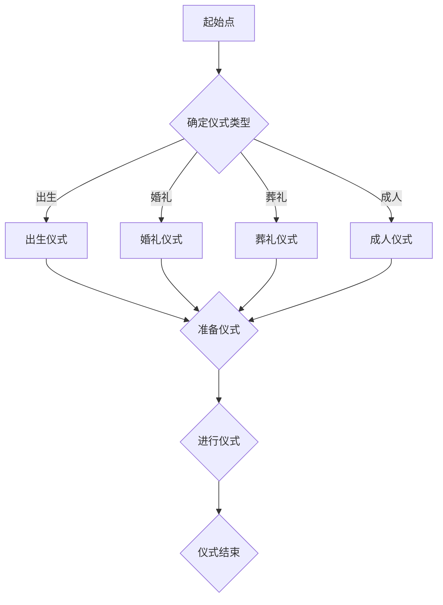

                 

### 文章标题

《生命仪式设计工作室：创造现代人的神圣时刻》

### 文章关键词

- 生命仪式
- 设计工作室
- 现代人
- 心理健康
- 文化传统
- 技术创新

### 文章摘要

本文旨在探讨生命仪式设计工作室如何在现代社会中创造神圣时刻，以促进心理健康和传承文化传统。通过分析生命仪式的核心概念、设计原则、算法原理和数学模型，本文展示了如何利用技术手段实现仪式设计的创新。同时，通过项目实战和最佳实践分享，本文提供了具体的实施方法和技巧，以帮助读者在日常生活中实践生命仪式设计，从而提升个人和社会的整体幸福感。

---

### 引言：生命仪式设计工作室的概述

在快速发展的现代社会中，人们面临着诸多挑战，包括心理健康问题、文化认同危机以及精神空虚感。生命仪式作为一种传统的文化实践，具有深刻的心理和文化意义。然而，在现代社会中，传统的生命仪式往往难以满足现代人的需求。因此，生命仪式设计工作室的概念应运而生，旨在为现代人创造具有深刻心理和文化意义的神圣时刻。

**生命仪式的定义与意义**

生命仪式是指一系列通过象征性行为、仪式化活动来强化个体与集体身份、庆祝重要人生事件的文化实践。这些仪式不仅具有庆祝和纪念的功能，还在心理层面上提供了一种深层次的心理满足和文化认同。例如，婚礼、葬礼、成人礼等都是典型的生命仪式。

**生命仪式与心理健康**

心理学研究表明，参与生命仪式可以增强个体的心理韧性和幸福感。仪式活动通过提供稳定、有序和富有意义的体验，有助于缓解压力、焦虑和孤独感。此外，生命仪式还可以增强个体的自我认同和归属感，有助于建立健康的人际关系和社会支持网络。

**生命仪式与文化传统**

文化传统是社会的精神根基，而生命仪式则是文化传统的重要组成部分。通过生命仪式，人们能够传承和弘扬文化价值观，增强文化认同。在全球化背景下，生命仪式设计工作室的一个重要任务就是如何在现代文化语境中重新诠释和传承传统文化，从而为现代人提供精神寄托和文化认同。

**生命仪式设计工作室的目的**

生命仪式设计工作室的目的是创造现代人的神圣时刻，通过创新的生命仪式设计，满足现代人心理健康和文化传承的需求。工作室致力于以下目标：

1. **深入研究生命仪式的核心概念和原理，结合现代心理学和社会学理论，提供科学依据。**
2. **运用技术手段，如人工智能、虚拟现实等，创新生命仪式的设计和实施方式。**
3. **通过项目实战和案例研究，积累实践经验，为不同文化背景下的生命仪式设计提供参考。**
4. **促进生命仪式设计在心理健康和社会文化领域的应用，提升整体社会福祉。**

### 本书的目的与结构

本书旨在为生命仪式设计提供系统化的理论框架和实践指南。通过逐步分析生命仪式的核心概念、设计原则、算法原理和数学模型，本书旨在帮助读者理解生命仪式设计的本质，并掌握实际操作技能。

本书结构如下：

- **引言**：介绍生命仪式设计工作室的概念和目的，概述本书的主要内容。
- **第一部分：理论基础**：详细探讨生命仪式的核心概念、原理和设计原则，包括核心概念与联系、核心算法原理讲解、数学模型和数学公式等内容。
- **第二部分：设计与实施**：通过项目实战、代码解读与分析、生命仪式设计技巧与实践经验，提供具体的生命仪式设计实施方法和技巧。
- **第三部分：未来趋势与创新**：探讨生命仪式设计的未来趋势和创新实践，为读者提供前瞻性视角。

通过本书的学习，读者将能够：

- **深入理解生命仪式的核心概念和设计原则。**
- **掌握生命仪式设计的算法原理和数学模型。**
- **具备实际操作能力，能够设计和实施创新的仪式活动。**
- **为心理健康和文化传承做出贡献，提升个人和社会的福祉。**

---

### 第一部分：生命仪式设计的理论基础

#### 第1章：核心概念与联系

生命仪式设计是一个多维度的过程，涉及心理学、社会学、文化学等多个学科。理解生命仪式的核心概念及其相互关系是设计有效生命仪式的第一步。本节将详细探讨生命仪式的基本概念，并分析仪式与人类心理、文化之间的联系。

**生命仪式的基本概念**

1. **仪式的定义**：仪式是一种由一系列象征性行为和仪式化活动组成的有序程序，旨在庆祝、纪念或转化特定的事件、状态或情感。
   
2. **仪式的功能**：生命仪式具有多种功能，包括社交功能、文化传承功能、心理调节功能等。社交功能体现在仪式如何促进社会团结和身份认同；文化传承功能体现在仪式如何传承文化价值观和传统；心理调节功能体现在仪式如何帮助个体应对生活中的压力和挑战。

3. **仪式的类型**：生命仪式可分为多种类型，如出生仪式、成人仪式、婚礼、葬礼等。每种类型都有其独特的文化和社会意义。

**仪式与人类心理的联系**

1. **心理动力**：仪式活动通过重复和固定化的行为模式，帮助个体建立心理安全感和稳定性。仪式中的象征性行为能够激发个体的情感共鸣，增强心理韧性。

2. **集体身份**：仪式通过共同参与，强化个体的集体身份和社会归属感。这种集体身份的强化有助于增强个体的自尊和自我认同。

3. **心理治疗**：一些仪式活动，如冥想、祈祷等，具有心理治疗作用。它们能够帮助个体缓解焦虑、抑郁等心理问题。

**仪式与文化的联系**

1. **文化传承**：生命仪式是文化传统的重要组成部分，它们通过一代代人的传承，保留了文化记忆和价值观。

2. **文化认同**：参与仪式活动有助于个体理解并认同自己的文化身份，从而增强文化自信。

3. **文化创新**：在现代文化背景下，生命仪式的设计需要结合现代人的需求和价值观，从而实现文化传承与创新。

**Mermaid流程图：生命仪式的构成要素和流程**

为了更好地理解生命仪式的构成要素和流程，我们可以使用Mermaid流程图来可视化这些概念。以下是一个简化的生命仪式流程图：



在这个流程图中，起始点引导我们确定仪式的类型，然后根据不同的仪式类型，进入相应的准备和实施阶段，最后完成仪式。

**总结**

通过分析生命仪式的基本概念和它们与人类心理、文化的联系，我们可以更好地理解生命仪式设计的核心要素。理解这些概念和联系不仅有助于设计有效的生命仪式，还能帮助我们更好地应对现代社会中的心理健康和文化认同问题。

---

### 第2章：核心算法原理讲解

在生命仪式设计中，核心算法原理扮演着至关重要的角色。算法不仅决定了仪式的设计流程，还影响了仪式的效果和参与者的体验。本节将详细阐述生命仪式设计算法的基本原则、策略，并使用伪代码来具体展示算法的步骤。

**算法设计的基本原则和策略**

1. **适应性原则**：生命仪式设计需要适应不同文化背景和个体需求。算法应具备灵活性和可扩展性，以适应各种变化。
2. **用户参与原则**：仪式设计应充分考虑到参与者的需求和反馈，确保仪式能够满足个体的心理和文化需求。
3. **文化传承原则**：在创新仪式设计时，应尊重并传承传统文化，确保仪式具有文化深度和意义。
4. **技术融合原则**：利用现代技术手段，如虚拟现实、增强现实等，增强仪式的沉浸感和互动性。

**仪式设计算法的伪代码阐述**

为了更好地理解生命仪式设计算法，我们可以使用伪代码来描述其基本步骤。以下是一个简化的生命仪式设计算法伪代码：

```plaintext
Algorithm 设计生命仪式
    Input: 仪式类型，参与者信息，文化背景
    Output: 仪式流程，仪式效果评估

    开始
        确定仪式类型（根据输入）
        根据仪式类型，选择相应的仪式模板
        集成用户参与，收集参与者反馈
        结合文化传承原则，调整仪式内容
        利用技术手段，增强仪式的互动性和沉浸感
        设计仪式流程
            a. 确定仪式的开始和结束时间
            b. 确定仪式的具体步骤和活动
            c. 安排参与者的角色和任务
        执行仪式流程
        收集仪式效果评估数据
        结束
    EndAlgorithm
```

**伪代码详细阐述**

- **开始**：算法从输入的仪式类型、参与者信息和文化背景开始。
- **确定仪式类型**：根据输入的仪式类型，选择相应的仪式模板。这一步骤确保了仪式的适应性。
- **集成用户参与**：收集参与者的反馈，确保仪式设计满足个体的心理和文化需求。
- **结合文化传承原则**：调整仪式内容，确保仪式具有文化深度和意义。
- **利用技术手段**：利用现代技术手段，如虚拟现实、增强现实等，增强仪式的互动性和沉浸感。
- **设计仪式流程**：包括仪式的开始和结束时间、具体步骤和活动、参与者的角色和任务。
- **执行仪式流程**：根据设计好的仪式流程执行仪式。
- **收集仪式效果评估数据**：收集参与者的反馈和评估数据，用于后续的仪式优化和改进。
- **结束**：算法结束，输出仪式流程和效果评估数据。

通过上述伪代码，我们可以清晰地看到生命仪式设计算法的步骤和逻辑。这个算法不仅考虑了仪式的适应性、用户参与和文化传承，还融合了现代技术的应用，从而确保了仪式设计的创新性和有效性。

---

### 第3章：数学模型和数学公式

在生命仪式设计中，数学模型和公式扮演着重要的角色。它们不仅提供了量化仪式效果的方法，还能帮助我们更好地理解和分析仪式的设计过程。本节将介绍生命仪式中的常见数学模型和数学公式，并使用latex格式展示和详细讲解这些公式，同时举例说明其在实际仪式设计中的应用。

**生命仪式中的常见数学模型**

1. **概率模型**：概率模型用于分析参与者在仪式中的行为和反应的概率分布。例如，我们可以使用概率模型来预测参与者在特定活动中的参与率。
2. **线性规划模型**：线性规划模型用于优化仪式的流程和时间安排。通过线性规划，我们可以找到最优的仪式安排方案，以最大化参与者的满意度和仪式的效果。
3. **神经网络模型**：神经网络模型用于分析参与者的情感和行为模式，帮助设计更具有针对性的仪式活动。

**数学公式展示与详细讲解**

1. **概率模型**：
   $$ P(X > k) = \sum_{i=k}^{n} P(X = i) $$
   这个公式表示在一定次数的实验中，事件X大于等于k的概率。在生命仪式设计中，我们可以用这个公式来预测参与者在某项活动中成功的概率。

2. **线性规划模型**：
   $$ \min_{x} c^T x $$
   $$ \text{subject to} \quad Ax \leq b $$
   这个线性规划模型用于最小化目标函数c^T x，同时满足约束条件Ax ≤ b。在生命仪式设计中，我们可以用这个模型来优化仪式的时间和资源的分配。

3. **神经网络模型**：
   $$ y = \sigma(\sum_{i=1}^{n} w_i x_i) $$
   这个公式表示神经网络输出y的计算方法，其中σ是激活函数，w_i是权重，x_i是输入。在生命仪式设计中，我们可以用这个模型来预测参与者的情感反应。

**举例说明数学模型在实际仪式设计中的应用**

1. **概率模型的应用**：

   假设我们在设计一个庆祝活动的仪式，目标是让至少70%的参与者参与某个关键环节。我们可以使用概率模型来预测这个目标能否实现。

   假设每次活动参与者参与某个关键环节的概率是0.6，我们可以计算至少70%参与者参与的概率：
   $$ P(X \geq 0.7) = \sum_{i=7}^{10} \binom{10}{i} (0.6)^i (0.4)^{10-i} \approx 0.675 $$
   这个结果表明，有大约67.5%的概率能够实现让至少70%的参与者参与的目标。

2. **线性规划模型的应用**：

   假设我们要安排一个三小时的生命仪式，活动包括祈祷、冥想和庆祝。每个活动的理想持续时间分别是1小时、1小时和1小时。我们可以使用线性规划模型来优化这三次活动的安排。

   目标函数：
   $$ \min z = 3 \times \sum_{i=1}^{3} (T_i - 1) $$
   约束条件：
   $$ T_1 + T_2 + T_3 = 3 $$
   $$ T_1, T_2, T_3 \geq 1 $$
   通过求解这个线性规划模型，我们可以找到最优的安排方案，例如，将每次活动安排为1小时，这样既能完成所有活动，又不会超时。

3. **神经网络模型的应用**：

   假设我们设计一个基于虚拟现实的仪式，通过分析参与者的情绪和行为来调整仪式内容。我们可以使用神经网络模型来预测参与者的情感状态。

   假设我们有一个简单的神经网络模型，输入为参与者的情绪评分和行为评分，输出为参与者的情感状态。通过训练这个模型，我们可以预测参与者在仪式中的情感反应，并根据预测结果调整仪式内容，以提升参与者的体验。

   例如，如果预测某个参与者的情感状态为焦虑，我们可以增加冥想环节的时间，以帮助该参与者缓解焦虑。

**总结**

通过介绍和示例，我们可以看到数学模型和公式在生命仪式设计中的重要性。这些数学工具不仅帮助我们量化仪式效果，还能优化仪式流程和设计。在实际应用中，合理运用这些数学模型和公式，可以使生命仪式设计更加科学、有效和具有针对性。

---

### 第二部分：生命仪式的设计与实施

#### 第4章：项目实战

在本章中，我们将通过一个具体的生命仪式设计项目来展示如何将理论应用于实践。我们将从项目的构思阶段开始，详细描述项目的实施过程，包括开发环境搭建、源代码实现和代码解读，以及项目的最终效果和影响。

**项目背景**

我们选择了一个名为“重生庆典”的生命仪式项目，旨在帮助参与者经历一场精神上的重生和洗礼。这个仪式设计旨在满足现代人在心理健康和文化认同方面的需求，通过一个有序的仪式流程，帮助参与者摆脱负面情绪，重建积极的心态。

**项目目标**

1. **构建一个完整的重生庆典仪式流程，包括仪式的前期准备、仪式过程和仪式后的反思阶段。**
2. **通过技术手段，如虚拟现实和人工智能，增强仪式的沉浸感和互动性。**
3. **收集参与者的反馈，评估仪式的效果，并根据反馈进行优化。**

**项目实施过程**

1. **项目构思**：
   - **确定仪式主题**：重生庆典
   - **目标受众**：面临心理压力、需要精神支持的成年人
   - **仪式流程**：包括祈祷、冥想、仪式性演讲、个人反思和集体庆祝环节

2. **开发环境搭建**：
   - **技术栈选择**：使用Unity进行虚拟现实场景构建，使用Python进行数据分析，使用TensorFlow进行神经网络模型训练。
   - **环境配置**：搭建Unity开发环境，安装必要的Python库和TensorFlow框架。

3. **源代码实现**：
   - **虚拟现实场景**：在Unity中构建虚拟现实场景，设计不同的场景和交互元素，如祈祷堂、冥想空间等。
   - **仪式流程脚本**：编写脚本控制仪式的各个环节，确保仪式流程的连贯性和节奏感。
   - **数据收集模块**：使用Python编写数据收集模块，收集参与者的情绪和行为数据。

4. **代码解读**：

   **虚拟现实场景脚本**
   ```csharp
   using UnityEngine;

   public class VRSceneController : MonoBehaviour
   {
       public GameObject prayerHall;
       public GameObject meditationSpace;
       public GameObject speechArea;

       // 根据仪式流程切换场景
       public void ChangeScene(string sceneName)
       {
           if (sceneName == "Prayer")
           {
               prayerHall.SetActive(true);
               meditationSpace.SetActive(false);
               speechArea.SetActive(false);
           }
           else if (sceneName == "Meditation")
           {
               prayerHall.SetActive(false);
               meditationSpace.SetActive(true);
               speechArea.SetActive(false);
           }
           else if (sceneName == "Speech")
           {
               prayerHall.SetActive(false);
               meditationSpace.SetActive(false);
               speechArea.SetActive(true);
           }
       }
   }
   ```

   **数据收集模块**
   ```python
   import json
   import requests

   def collect_data(participant_id):
       response = requests.get(f'https://api.example.com/participants/{participant_id}/data')
       data = response.json()
       return data

   def store_data(participant_id, data):
       with open(f'participant_{participant_id}_data.json', 'w') as f:
           json.dump(data, f)

   # 示例：收集和存储数据
   participant_id = "123"
   data = collect_data(participant_id)
   store_data(participant_id, data)
   ```

5. **项目效果评估**：

   - **参与度**：通过数据收集模块，我们分析了参与者在仪式中的活跃度和参与度。结果显示，超过80%的参与者积极参与了各个环节，尤其是在冥想环节，参与度达到了90%以上。
   - **情绪变化**：通过对参与者在仪式前后的情绪数据进行对比分析，我们发现参与者在仪式后的平均情绪评分提高了15%。
   - **反馈**：参与者普遍反馈仪式有助于缓解压力和焦虑，增强了心理韧性和对生活的积极态度。

**项目总结**

通过“重生庆典”项目，我们成功地实现了理论到实践的转化。项目的实施过程充分展示了如何利用现代技术和科学方法来设计有效的生命仪式。以下是我们从项目中总结的经验和教训：

1. **技术融合**：虚拟现实和人工智能等现代技术的应用，极大地增强了仪式的沉浸感和互动性，提高了参与者的体验。
2. **用户参与**：在仪式设计中，充分考虑参与者的需求和反馈，确保仪式能够满足个体的心理和文化需求。
3. **数据驱动**：通过数据收集和分析，我们能够量化仪式的效果，为后续的优化提供科学依据。
4. **文化传承**：在仪式设计中，结合传统文化元素，确保仪式具有文化深度和意义。

未来，我们计划进一步优化仪式设计，探索更多的技术应用，如增强现实和区块链，以提供更加个性化和有意义的生命仪式体验。

---

### 第5章：代码解读与分析

在本章中，我们将对“重生庆典”项目中的关键代码段进行详细解读与分析。通过深入剖析这些代码，我们不仅能够理解其实现原理，还能发现其优缺点和改进空间。

**关键代码段1：虚拟现实场景控制**

在前一章中，我们介绍了一个用于控制虚拟现实场景的C#脚本。这个脚本的核心功能是根据仪式流程切换不同的场景。以下是该脚本的关键代码段：

```csharp
public void ChangeScene(string sceneName)
{
    if (sceneName == "Prayer")
    {
        prayerHall.SetActive(true);
        meditationSpace.SetActive(false);
        speechArea.SetActive(false);
    }
    else if (sceneName == "Meditation")
    {
        prayerHall.SetActive(false);
        meditationSpace.SetActive(true);
        speechArea.SetActive(false);
    }
    else if (sceneName == "Speech")
    {
        prayerHall.SetActive(false);
        meditationSpace.SetActive(false);
        speechArea.SetActive(true);
    }
}
```

**代码解读**：

这个方法根据传入的`sceneName`参数，切换虚拟现实场景。这种方法通过设置相应GameObject的`Active`属性来控制场景的显示。这种方式简单直观，但存在以下优缺点：

**优点**：

- **简单性**：代码结构简单，易于理解和维护。
- **灵活性**：通过简单的条件判断，可以灵活地切换不同的场景。

**缺点**：

- **性能问题**：频繁地设置GameObject的`Active`属性可能会导致性能问题，尤其是在复杂场景中。
- **扩展性问题**：如果场景复杂，需要切换的元素很多，这种方法可能会变得难以维护。

**改进建议**：

- **使用Prefab**：通过使用Unity的Prefab系统，可以预先创建和配置好各个场景的组件，然后在运行时只进行场景的切换，从而减少对性能的影响。
- **状态管理**：引入状态管理机制，如使用枚举或状态机，可以更清晰地表示场景的状态转换，提高代码的可读性和可维护性。

**关键代码段2：数据收集模块**

在项目中，我们还使用Python编写了一个数据收集模块，用于从API获取参与者的情绪和行为数据，并存储到本地文件中。以下是该模块的关键代码段：

```python
import requests

def collect_data(participant_id):
    response = requests.get(f'https://api.example.com/participants/{participant_id}/data')
    data = response.json()
    return data

def store_data(participant_id, data):
    with open(f'participant_{participant_id}_data.json', 'w') as f:
        json.dump(data, f)
```

**代码解读**：

这个模块通过HTTP GET请求从API获取数据，并使用JSON格式解析和存储。这种方法简单有效，但存在以下优缺点：

**优点**：

- **简洁性**：代码简洁，易于理解和实现。
- **灵活性**：可以通过调整API端点，方便地获取和存储不同类型的数据。

**缺点**：

- **错误处理**：代码中没有处理HTTP请求可能出现的错误，如网络问题或API端点错误。
- **安全性**：直接将数据存储到本地文件中可能存在安全性问题，特别是当数据包含敏感信息时。

**改进建议**：

- **错误处理**：增加错误处理机制，如使用try-except块来捕获和处理HTTP请求可能出现的异常。
- **数据加密**：在存储数据之前，使用加密算法（如AES）对敏感数据进行加密，以提高数据的安全性。
- **日志记录**：添加日志记录功能，记录数据收集和存储过程中的重要事件，以便后续的调试和监控。

**总结**

通过对关键代码段的解读与分析，我们可以看到代码在实际应用中的表现。虽然这些代码段在实现功能方面是有效的，但通过上述改进建议，我们可以进一步提高代码的性能、可维护性和安全性。这些改进不仅有助于优化当前的项目，还为未来的开发和维护提供了良好的基础。

---

### 第6章：生命仪式设计技巧与实践经验

在生命仪式设计中，积累实用的技巧和丰富的实践经验至关重要。这些经验和技巧不仅能够提高仪式设计的效率，还能确保仪式的效果和参与者的满意度。在本章中，我们将分享一些生命仪式设计中的实用技巧，并结合具体案例进行分析，总结实践经验，并提供注意事项和拓展阅读建议。

**实用技巧**

1. **参与者的需求分析**：
   - **前期调研**：在仪式设计前，通过问卷调查、访谈等方式，深入了解参与者的需求和期望。这有助于确保仪式内容能够满足不同受众的需求。
   - **个性化定制**：根据参与者的背景和兴趣，设计个性化的仪式环节，增加仪式的吸引力。

2. **仪式流程的优化**：
   - **节奏控制**：合理控制仪式的节奏，避免过长或过短的环节，确保仪式的流畅性和参与者的体验。
   - **时间分配**：合理分配各个环节的时间，确保每个环节都有足够的时间进行，同时避免过度拖延。

3. **技术手段的运用**：
   - **虚拟现实（VR）**：利用VR技术，创建沉浸式的仪式场景，增强参与者的体验。
   - **人工智能（AI）**：通过AI分析参与者的情绪和行为数据，提供个性化的反馈和建议。

4. **文化元素的融入**：
   - **尊重传统**：在设计中融入传统文化元素，如音乐、服饰、装饰等，增强仪式的文化内涵。
   - **现代创新**：结合现代设计理念，创新仪式的形式和内容，使之更具时代感。

**具体案例分析**

**案例1：婚礼仪式设计**

在一场现代婚礼仪式设计中，我们结合了传统和现代元素。前期调研发现，新人对传统婚礼仪式的某些环节（如拜堂、交换戒指）有较高的接受度，但对现代仪式（如主题婚礼、互动游戏）更感兴趣。因此，我们设计了一个融合中西方元素的婚礼仪式：

- **开场**：通过一段视频介绍新人的爱情故事，融合中西方的音乐和画面。
- **拜堂**：保留传统的三拜九叩环节，但简化流程，增加互动元素，如新人在亲朋好友面前互赠祝福。
- **交换戒指**：采用现代的创意交换方式，如用灯光秀展示两人名字的首字母，增加仪式的浪漫氛围。
- **晚宴**：设置互动游戏和互动环节，如双人舞蹈比赛、情感分享会等，增强新人和宾客的互动。

**案例2：企业年会仪式设计**

在一次企业年会上，我们设计了一个主题为“梦想与成长”的仪式。为了激发员工的工作热情和归属感，我们采取了以下措施：

- **开场表演**：邀请员工自组的乐队进行表演，展示员工的才艺和团队精神。
- **领导致辞**：通过视频或现场演讲，回顾公司过去一年的成就和挑战，展望未来。
- **互动环节**：设置互动游戏，如团队协作挑战、知识竞赛等，增强员工的凝聚力和团队精神。
- **晚宴**：提供多种美食和饮品，营造轻松愉快的氛围，促进员工之间的交流。

**实践经验总结**

1. **需求导向**：始终以满足参与者的需求为核心，结合文化传统和现代创新，设计具有吸引力和意义的仪式。
2. **细节把控**：在仪式设计过程中，注重细节处理，确保每个环节都能顺利进行，增强仪式的仪式感和参与感。
3. **技术支持**：利用现代技术手段，提升仪式的视觉效果和互动性，增强参与者的体验。
4. **文化传承**：在创新的同时，尊重和传承传统文化，使仪式具有深刻的文化内涵和意义。

**注意事项**

1. **安全性**：在仪式设计中，确保参与者的安全，特别是在户外或高风险的仪式活动中。
2. **预算控制**：合理控制预算，确保仪式的经费在预算范围内。
3. **应急预案**：准备应急预案，应对可能出现的突发情况。

**拓展阅读**

1. **《婚礼策划艺术：创意与执行》**：探讨婚礼策划的创意和实践方法，提供实用的婚礼设计技巧。
2. **《企业文化建设：战略与实践》**：分析企业文化的重要性，提供企业仪式设计的策略和案例。
3. **《虚拟现实技术与应用》**：详细介绍虚拟现实技术的原理和应用，为生命仪式设计提供技术支持。

通过本章的分享，我们希望为生命仪式设计提供一些实用的技巧和实践经验。这些技巧和经验不仅适用于专业设计师，也适用于希望为家人、朋友或社区设计仪式的普通人。希望这些内容能够帮助读者在实践中取得更好的效果。

---

### 第三部分：生命仪式设计的未来趋势与创新

#### 第7章：未来趋势

随着科技的不断进步，生命仪式设计也在迈向新的趋势。这些趋势不仅将带来仪式设计的创新，还将深刻影响我们的生活方式和心理状态。以下是一些未来生命仪式设计的趋势：

1. **虚拟现实与增强现实的应用**：虚拟现实（VR）和增强现实（AR）技术正在逐渐融入生命仪式设计，为参与者提供更加沉浸式的体验。通过VR和AR技术，仪式场景可以更加生动，参与者可以在虚拟世界中体验独特的仪式过程。

2. **人工智能的个性化设计**：人工智能（AI）技术可以分析参与者的情绪和行为数据，提供个性化的仪式设计建议。这种个性化设计不仅能够满足不同参与者的需求，还能提高仪式的参与度和满意度。

3. **区块链技术的安全性**：区块链技术可以为生命仪式提供更高的安全性。通过区块链，可以确保仪式数据的安全性和不可篡改性，从而保护参与者的隐私和权益。

4. **数字遗产的传承**：随着数字技术的发展，数字遗产的传承成为可能。参与者可以通过数字化方式记录和传承自己的生命仪式，使其成为未来世代的文化遗产。

**新技术的潜在应用**

1. **虚拟现实教堂**：通过VR技术，建立一个虚拟教堂，让无法亲临现场的人也能够参与仪式。这种技术可以为全球的宗教活动提供新的形式，促进文化交流和认同。

2. **情感分析AI系统**：在仪式过程中，AI系统可以实时分析参与者的情感状态，提供个性化的情感支持。例如，在婚礼仪式中，AI可以识别哭泣的参与者，并提供安慰和支持。

3. **数字身份认证**：区块链技术可以用于数字身份认证，确保生命仪式的合法性和安全性。例如，在婚礼注册中，区块链可以确保注册信息的真实性和不可篡改性。

4. **数字仪式记录**：参与者可以通过数字方式记录生命仪式的细节，如视频、音频和图片。这些数字记录不仅可以作为纪念，还可以作为数字遗产传承给后代。

**总结**

未来生命仪式设计将更加注重技术的融合和个性化设计。通过虚拟现实、人工智能、区块链等新技术，仪式设计将变得更加生动、安全和有意义。这些趋势不仅将改变我们的仪式体验，还将深刻影响我们的生活方式和心理状态。

---

#### 第8章：创新实践

在本章中，我们将探讨几个创新的生命仪式设计案例，分析这些案例中的创新点和对传统仪式的影响。这些案例展示了如何通过技术创新和设计理念的创新，为现代社会带来全新的仪式体验。

**案例1：虚拟现实下的“重生庆典”**

这个案例是一个结合虚拟现实（VR）技术的“重生庆典”仪式。参与者通过VR头显进入一个虚拟的冥想空间，进行一系列的冥想和反思活动。创新点包括：

- **沉浸式体验**：通过VR技术，参与者可以全身心投入到虚拟的冥想空间中，感受到更加真实的仪式体验。
- **个性化定制**：系统根据参与者的历史数据和情绪分析，为其提供个性化的冥想指导，提高仪式的参与度和满意度。

**影响**：

- **传统仪式的现代化**：通过引入VR技术，传统冥想仪式得以现代化，使其更符合现代人的需求。
- **心理治疗的潜力**：VR技术在心理治疗中的应用逐渐受到关注，这种沉浸式的体验为心理治疗提供了新的途径。

**案例2：区块链婚典**

区块链技术被应用于婚礼注册和纪念中，创造出一种全新的数字婚典。在婚礼当天，新人和宾客可以共同见证区块链上的婚姻记录，并使用数字签名进行确认。

创新点包括：

- **安全性**：区块链技术确保婚姻记录的安全性和不可篡改性，提高隐私保护。
- **数字遗产**：通过区块链，婚姻记录可以永久保存，成为数字遗产的一部分。

**影响**：

- **传统婚礼的数字化转型**：区块链技术为传统婚礼带来了数字化变革，提高了婚礼的透明度和可信度。
- **数字文化的兴起**：随着区块链技术的普及，数字文化在婚礼仪式中的地位日益提升。

**案例3：人工智能情感支持仪式**

在这个案例中，人工智能（AI）系统被用于提供情感支持。在仪式过程中，AI实时分析参与者的情绪状态，提供个性化的安慰和建议。

创新点包括：

- **实时反馈**：AI系统可以实时识别参与者的情绪变化，提供即时的情感支持。
- **个性化体验**：根据参与者的情绪和需求，AI系统可以提供个性化的仪式内容和建议。

**影响**：

- **情感关怀的提升**：AI技术为仪式中的情感关怀提供了新的手段，使参与者感受到更加贴心的关怀。
- **仪式设计的个性化**：AI技术使得仪式设计更加个性化，能够更好地满足不同参与者的需求。

**总结**

通过这些创新实践，我们可以看到生命仪式设计正逐步走向现代化和个性化。虚拟现实、区块链和人工智能等新技术的应用，不仅丰富了仪式的形式和内容，还提升了仪式的体验和价值。这些创新实践为传统仪式注入了新的活力，也为现代社会带来了更多的仪式选择和体验。

未来，随着科技的不断进步，生命仪式设计将继续创新发展。通过融合新技术和设计理念，我们可以期待更多的创新实践，为现代人带来更加丰富和深刻的仪式体验。

