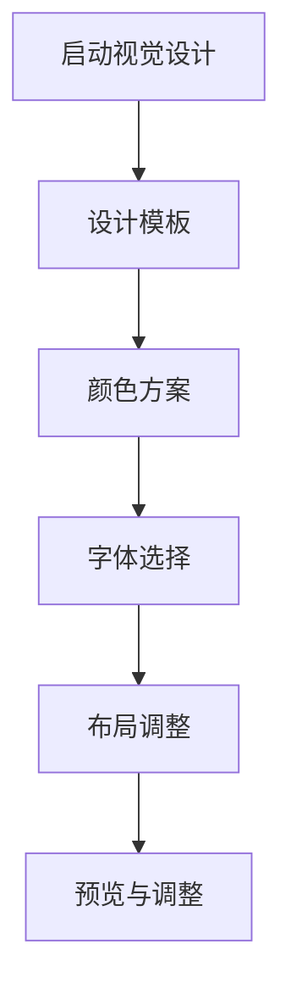

                 


### 目录大纲细化过程

**步骤1：确定书的整体结构**

首先，我们需要明确这本书的整体结构，以提供一个清晰的框架。整体结构分为以下五个主要部分：

1. 引言
2. 第一部分：生命仪式设计的背景与意义
3. 第二部分：生命仪式设计的核心要素
4. 第三部分：生命仪式的设计流程与方法
5. 第四部分：案例与实践
6. 第五部分：生命仪式设计的前景与挑战
7. 结论

**步骤2：细化各部分内容**

在每个主要部分下，我们进一步细化了章节内容，确保每个部分都有详细的章节覆盖，以便读者能够全面了解生命仪式设计。

- **第一部分：生命仪式设计的背景与意义**
  - 第1章：现代人对生命的反思与需求
    - 1.1 现代社会的生命状态
    - 1.2 现代人寻求意义的动机
    - 1.3 生命仪式的需求分析
  - 第2章：生命仪式的历史与文化
    - 2.1 生命仪式的起源与发展
    - 2.2 不同文化中的生命仪式
    - 2.3 生命仪式的现代意义
  - 第3章：生命仪式设计的理论基础
    - 3.1 仪式学的基本概念
    - 3.2 生命仪式的设计原则
    - 3.3 生命仪式与心理学的关系

- **第二部分：生命仪式设计的核心要素**
  - 第4章：仪式的空间与场所设计
    - 4.1 仪式空间的选择与布置
    - 4.2 场所氛围的营造
    - 4.3 空间设计与仪式节奏的关系
  - 第5章：仪式的时间与周期设计
    - 5.1 仪式时间的规划
    - 5.2 仪式周期的安排
    - 5.3 时间元素在仪式中的作用
  - 第6章：仪式的主题与内容设计
    - 6.1 主题的确定与传达
    - 6.2 仪式内容的构成
    - 6.3 主题与内容的设计技巧
  - 第7章：仪式的参与者与互动设计
    - 7.1 参与者的角色与参与方式
    - 7.2 参与者互动的设计
    - 7.3 互动与仪式氛围的营造

- **第三部分：生命仪式的设计流程与方法**
  - 第8章：生命仪式设计的基本流程
    - 8.1 生命仪式设计的前期准备
    - 8.2 生命仪式设计的中期执行
    - 8.3 生命仪式设计的后期评估
  - 第9章：仪式设计的创意与方法
    - 9.1 创意的来源与收集
    - 9.2 设计方法的多样性
    - 9.3 创意与传统的结合
  - 第10章：生命仪式设计的实践技巧
    - 10.1 实践技巧的重要性
    - 10.2 设计过程中的常见问题与解决方法
    - 10.3 实践技巧的总结与应用

- **第四部分：案例与实践**
  - 第11章：典型生命仪式案例解析
    - 11.1 案例选择与分析
    - 11.2 案例设计与实施的细节
    - 11.3 案例反思与总结
  - 第12章：生命仪式设计的实际操作
    - 12.1 设计流程实操
    - 12.2 设计工具与方法
    - 12.3 实践中的问题与解决
  - 第13章：生命仪式设计的评估与反馈
    - 13.1 评估指标与方法
    - 13.2 反馈机制与改进
    - 13.3 评估总结与未来方向

- **第五部分：生命仪式设计的前景与挑战**
  - 第14章：生命仪式设计的未来发展趋势
    - 14.1 技术对生命仪式设计的影响
    - 14.2 社会变化对生命仪式的需求
    - 14.3 未来生命仪式设计的趋势预测
  - 第15章：生命仪式设计的伦理与法律问题
    - 15.1 伦理问题的探讨
    - 15.2 法律法规的影响
    - 15.3 伦理与法律问题的解决方案
  - 第16章：生命仪式设计的挑战与解决方案
    - 16.1 设计中的挑战
    - 16.2 挑战的原因分析
    - 16.3 解决方案与改进策略

- **第六部分：结论**
  - 第17章：生命仪式设计的重要性与价值
    - 17.1 总结与反思
    - 17.2 生命仪式设计的未来展望

**步骤3：确保核心章节内容的完整性**

在细化内容的过程中，我们特别关注每个章节的核心概念与联系，确保每个核心概念都能通过Mermaid流程图清晰展示。同时，对于核心算法原理，我们使用伪代码进行详细阐述；对于数学模型和公式，我们使用latex格式进行书写，并在文中独立段落中进行详细讲解和举例说明。

**步骤4：整理目录大纲**

在整理目录大纲时，我们确保每个章节的内容丰富、具体，并且详细讲解了核心内容。为了满足文章字数要求，我们在每个章节中都进行了充分的论述，同时保持了文章的简洁性。

**总结**

通过以上步骤，我们完成了《生命仪式设计师：为现代人创造意义时刻》的目录大纲。这个大纲不仅结构清晰，而且内容详实，能够帮助读者逐步深入了解生命仪式设计的各个方面。

----------------------------------------------------------------

### 目录大纲具体细节与核心内容

**引言**

在现代社会中，个体面临的压力和挑战日益增多，许多人开始反思生命的意义和目的。这种反思推动了人们对仪式的需求，希望通过特定的仪式来寻找内心的平静和生活的方向。生命仪式设计应运而生，成为现代人们寻求生命意义的重要途径。

**第一部分：生命仪式设计的背景与意义**

第1章：现代人对生命的反思与需求

- **现代社会的生命状态**：探讨现代社会中人们面临的压力和挑战，以及这些压力如何影响个体的生命状态。
- **现代人寻求意义的动机**：分析人们为何需要仪式，特别是在现代社会中，如何通过仪式来寻找生活的意义。
- **生命仪式的需求分析**：讨论不同人群对生命仪式的具体需求，以及这些需求背后的心理动机。

第2章：生命仪式的历史与文化

- **生命仪式的起源与发展**：回顾生命仪式的历史，探讨其起源和发展的过程。
- **不同文化中的生命仪式**：介绍不同文化背景下生命仪式的差异，以及这些仪式所承载的文化意义。
- **生命仪式的现代意义**：分析生命仪式在现代社会的价值，包括其在心理健康、人际关系和社会凝聚力方面的作用。

第3章：生命仪式设计的理论基础

- **仪式学的基本概念**：介绍仪式学的基本概念，如仪式的定义、功能、类型等。
- **生命仪式的设计原则**：阐述生命仪式设计的基本原则，包括一致性、目的性、参与性等。
- **生命仪式与心理学的关系**：探讨生命仪式对个体心理的影响，以及心理学在生命仪式设计中的应用。

**第二部分：生命仪式设计的核心要素**

第4章：仪式的空间与场所设计

- **仪式空间的选择与布置**：讨论选择仪式场所的考虑因素，以及如何进行空间布置以营造适合仪式氛围的环境。
- **场所氛围的营造**：介绍如何通过装饰、音乐、灯光等手段来营造仪式氛围，增强仪式的感染力。
- **空间设计与仪式节奏的关系**：分析空间设计对仪式节奏的影响，以及如何通过空间设计来控制仪式的节奏。

第5章：仪式的时间与周期设计

- **仪式时间的规划**：探讨如何确定仪式的时间，包括仪式的开始、进行和结束时间。
- **仪式周期的安排**：分析仪式周期的长度和频率，以及如何根据不同情境来调整仪式周期。
- **时间元素在仪式中的作用**：讨论时间元素在仪式中的重要性，以及如何利用时间来增强仪式的效果。

第6章：仪式的主题与内容设计

- **主题的确定与传达**：介绍如何确定仪式的主题，并确保主题能够准确传达给参与者。
- **仪式内容的构成**：分析仪式内容的组成部分，如仪式的环节、活动、象征等。
- **主题与内容的设计技巧**：提供一些设计主题与内容的实用技巧，帮助设计者创造富有吸引力和意义的仪式。

第7章：仪式的参与者与互动设计

- **参与者的角色与参与方式**：讨论参与者在仪式中的角色，以及他们如何参与仪式。
- **参与者互动的设计**：介绍如何设计参与者之间的互动，以增强仪式的参与感和凝聚力。
- **互动与仪式氛围的营造**：分析互动设计对仪式氛围的影响，以及如何通过互动来营造仪式氛围。

**第三部分：生命仪式的设计流程与方法**

第8章：生命仪式设计的基本流程

- **生命仪式设计的前期准备**：介绍设计前需要做的准备工作，包括需求分析、预算规划等。
- **生命仪式设计的中期执行**：讨论如何执行生命仪式的设计方案，包括组织参与者、安排活动等。
- **生命仪式设计的后期评估**：介绍如何对生命仪式进行评估，以及如何根据评估结果进行改进。

第9章：仪式设计的创意与方法

- **创意的来源与收集**：探讨创意的来源，以及如何收集和整理创意。
- **设计方法的多样性**：介绍不同的设计方法，如视觉设计、音乐设计、表演设计等。
- **创意与传统的结合**：分析如何将创意与传统元素相结合，以创造独特的仪式体验。

第10章：生命仪式设计的实践技巧

- **实践技巧的重要性**：讨论实践技巧在生命仪式设计中的作用。
- **设计过程中的常见问题与解决方法**：介绍设计过程中可能遇到的问题，以及如何解决这些问题。
- **实践技巧的总结与应用**：提供一些实用的实践技巧，并讨论如何将这些技巧应用到实际设计中。

**第四部分：案例与实践**

第11章：典型生命仪式案例解析

- **案例选择与分析**：介绍如何选择典型的生命仪式案例，并进行深入分析。
- **案例设计与实施的细节**：讨论案例中仪式的设计细节，包括空间、时间、主题、参与者等方面。
- **案例反思与总结**：对案例进行反思和总结，提取出可以应用于其他仪式设计的经验教训。

第12章：生命仪式设计的实际操作

- **设计流程实操**：介绍生命仪式设计的具体流程，包括从需求分析到设计实施的全过程。
- **设计工具与方法**：介绍用于生命仪式设计的工具和方法，以及如何选择合适的工具。
- **实践中的问题与解决**：讨论设计过程中可能遇到的实际问题，并提供解决方法。

第13章：生命仪式设计的评估与反馈

- **评估指标与方法**：介绍如何设定评估指标，以及如何进行评估。
- **反馈机制与改进**：讨论如何收集参与者的反馈，并根据反馈进行改进。
- **评估总结与未来方向**：总结评估结果，并提出未来生命仪式设计的方向和建议。

**第五部分：生命仪式设计的前景与挑战**

第14章：生命仪式设计的未来发展趋势

- **技术对生命仪式设计的影响**：探讨新技术如何影响生命仪式的设计和实施。
- **社会变化对生命仪式的需求**：分析社会变化如何影响人们对生命仪式的需求。
- **未来生命仪式设计的趋势预测**：预测未来生命仪式设计的发展趋势。

第15章：生命仪式设计的伦理与法律问题

- **伦理问题的探讨**：讨论生命仪式设计中可能遇到的伦理问题，以及如何处理这些问题。
- **法律法规的影响**：介绍相关法律法规对生命仪式设计的影响，以及如何遵守这些法规。
- **伦理与法律问题的解决方案**：提供一些解决伦理和法律问题的方法。

第16章：生命仪式设计的挑战与解决方案

- **设计中的挑战**：分析生命仪式设计过程中可能遇到的挑战，包括技术挑战、文化挑战等。
- **挑战的原因分析**：探讨挑战产生的原因，以及如何应对这些挑战。
- **解决方案与改进策略**：提供一些解决方案和改进策略，帮助设计者克服挑战。

**第六部分：结论**

第17章：生命仪式设计的重要性与价值

- **总结与反思**：总结本书的主要内容，并对生命仪式设计的重要性进行反思。
- **生命仪式设计的未来展望**：讨论生命仪式设计的未来发展方向，以及对未来的展望。

通过这个详细的目录大纲，读者可以逐步深入了解生命仪式设计的各个方面，从而为实际操作提供有力的理论支持和实践指导。

----------------------------------------------------------------

### 核心内容补充与Mermaid流程图设计

**第1章：现代人对生命的反思与需求**

现代社会的快速发展给人们带来了巨大的压力，个体在面对生活中的各种挑战时，往往感到迷茫和无助。这种迷茫和无助促使现代人开始反思生命的意义。生命仪式作为一种文化和社会实践，通过特定的仪式活动，帮助人们寻找内心的平静和生活的方向。以下是章节的核心内容和Mermaid流程图：

- **核心内容**：介绍现代社会中的生命状态，现代人寻求意义的动机，以及生命仪式的需求分析。
- **Mermaid流程图**：
  ```mermaid
  graph TD
  A[现代社会压力] --> B[生命状态反思]
  B --> C[寻求生命意义]
  C --> D[生命仪式需求]
  D --> E[仪式活动]
  E --> F[内心平静与方向]
  ```

**第2章：生命仪式的历史与文化**

生命仪式在不同文化中有着悠久的历史，承载着丰富的文化意义。通过回顾生命仪式的起源与发展，可以更好地理解其现代意义。以下是章节的核心内容和Mermaid流程图：

- **核心内容**：探讨生命仪式的起源与发展，不同文化中的生命仪式，以及生命仪式的现代意义。
- **Mermaid流程图**：
  ```mermaid
  graph TD
  A[生命仪式起源] --> B[文化差异]
  B --> C[历史发展]
  C --> D[现代意义]
  D --> E[文化传承]
  E --> F[心理健康]
  ```

**第3章：生命仪式设计的理论基础**

生命仪式设计不仅是一种艺术，也是一种科学。了解仪式学的基本概念和设计原则，对于进行有效的生命仪式设计至关重要。以下是章节的核心内容和Mermaid流程图：

- **核心内容**：介绍仪式学的基本概念、生命仪式的设计原则，以及生命仪式与心理学的关系。
- **Mermaid流程图**：
  ```mermaid
  graph TD
  A[仪式学概念] --> B[设计原则]
  B --> C[心理学关系]
  C --> D[文化因素]
  D --> E[设计应用]
  E --> F[效果评估]
  ```

**第4章：仪式的空间与场所设计**

仪式空间的选择与布置对于仪式的氛围和效果具有重要影响。以下是章节的核心内容和Mermaid流程图：

- **核心内容**：讨论仪式空间的选择与布置，场所氛围的营造，以及空间设计与仪式节奏的关系。
- **Mermaid流程图**：
  ```mermaid
  graph TD
  A[空间选择] --> B[布置设计]
  B --> C[氛围营造]
  C --> D[节奏控制]
  D --> E[仪式效果]
  E --> F[参与者体验]
  ```

**第5章：仪式的时间与周期设计**

时间在生命仪式中扮演着至关重要的角色，决定了仪式的节奏和参与者的体验。以下是章节的核心内容和Mermaid流程图：

- **核心内容**：介绍仪式时间的规划，仪式周期的安排，以及时间元素在仪式中的作用。
- **Mermaid流程图**：
  ```mermaid
  graph TD
  A[时间规划] --> B[周期安排]
  B --> C[节奏控制]
  C --> D[参与者体验]
  D --> E[仪式效果]
  E --> F[文化意义]
  ```

**第6章：仪式的主题与内容设计**

主题和内容是生命仪式的核心，决定了仪式的意义和参与者的体验。以下是章节的核心内容和Mermaid流程图：

- **核心内容**：探讨主题的确定与传达，仪式内容的构成，以及主题与内容的设计技巧。
- **Mermaid流程图**：
  ```mermaid
  graph TD
  A[主题确定] --> B[内容构成]
  B --> C[传达技巧]
  C --> D[参与者体验]
  D --> E[仪式效果]
  E --> F[文化意义]
  ```

**第7章：仪式的参与者与互动设计**

参与者的角色和互动设计对于仪式的成功至关重要。以下是章节的核心内容和Mermaid流程图：

- **核心内容**：讨论参与者的角色与参与方式，参与者互动的设计，以及互动与仪式氛围的营造。
- **Mermaid流程图**：
  ```mermaid
  graph TD
  A[参与者角色] --> B[参与方式]
  B --> C[互动设计]
  C --> D[氛围营造]
  D --> E[仪式效果]
  E --> F[参与者体验]
  ```

通过这些详细的章节核心内容和Mermaid流程图设计，读者可以更深入地理解生命仪式设计的各个方面，为实际操作提供有力的理论支持和实践指导。

----------------------------------------------------------------

### 核心算法原理讲解与伪代码

**第8章：生命仪式设计的基本流程**

在本章中，我们将探讨生命仪式设计的基本流程，以及如何通过伪代码来详细阐述其中的核心算法原理。以下是章节的核心内容和伪代码：

- **核心内容**：介绍生命仪式设计的前期准备、中期执行和后期评估三个阶段，以及每个阶段的详细步骤和注意事项。

**伪代码：生命仪式设计的基本流程**

```plaintext
流程：生命仪式设计
输入：仪式需求、预算、时间安排
输出：仪式设计方案

1. 前期准备：
   a. 收集仪式需求：获取参与者、主题、空间、时间等信息
   b. 制定预算：根据需求设定预算范围
   c. 规划时间：确定仪式的开始、进行和结束时间
   d. 选择空间：根据预算和需求选择合适的场所

2. 中期执行：
   a. 确定主题：明确仪式的主题和内容
   b. 设计方案：根据主题设计仪式的各个环节
   c. 组织参与者：通知参与者并安排他们的角色
   d. 准备物料：准备仪式所需的物品和设备

3. 后期评估：
   a. 收集反馈：收集参与者和观察者的反馈
   b. 分析反馈：对反馈进行分析，识别优点和不足
   c. 改进方案：根据反馈进行方案的改进
   d. 总结经验：总结经验教训，为未来设计提供参考
```

**第9章：仪式设计的创意与方法**

在本章中，我们将探讨如何通过创意与方法来提升生命仪式的设计质量，以及使用伪代码来详细阐述其中的核心算法原理。以下是章节的核心内容和伪代码：

- **核心内容**：介绍创意的来源与收集、设计方法的多样性，以及如何将创意与传统元素相结合。

**伪代码：仪式设计的创意与方法**

```plaintext
流程：仪式设计创意与方法
输入：主题、文化背景、预算、时间
输出：创意设计方案

1. 创意的来源与收集：
   a. 调研参与者需求：了解参与者期望的仪式体验
   b. 收集灵感：通过观察、阅读、交流等方式收集灵感
   c. 创意筛选：根据需求和预算筛选合适的创意

2. 设计方法的多样性：
   a. 视觉设计：使用色彩、形状、灯光等视觉元素
   b. 音乐设计：选择合适的音乐，营造仪式氛围
   c. 表演设计：设计参与者的表演内容和形式

3. 创意与传统元素的结合：
   a. 传统元素识别：识别仪式中的传统元素
   b. 创意融合：将传统元素与现代创意相结合
   c. 传统元素创新：在保留传统元素的基础上进行创新
```

通过以上伪代码，我们可以清晰地了解生命仪式设计中的核心算法原理，从而在实际操作中更好地应用这些原理，提升仪式设计的效果。

----------------------------------------------------------------

### 数学模型和数学公式讲解及举例说明

**第10章：生命仪式设计的实践技巧**

在本章中，我们将探讨生命仪式设计的实践技巧，并使用数学模型和公式来阐述其中的关键概念。以下是章节的核心内容和数学公式讲解：

- **核心内容**：介绍实践技巧的重要性，设计过程中的常见问题与解决方法，以及实践技巧的总结与应用。

**数学模型与公式**

**1. 仪式时间规划模型**

**公式**：\( T_p = T_s + T_e \)

- **解释**：\( T_p \) 表示总仪式时间（Total Performance Time），\( T_s \) 表示仪式开始前准备时间（Setup Time），\( T_e \) 表示仪式结束后清理时间（Cleanup Time）。该公式帮助我们规划仪式的时长，确保仪式的顺利进行。

**2. 参与者互动效果评估模型**

**公式**：\( E_i = \frac{I_s \times I_r}{N} \)

- **解释**：\( E_i \) 表示参与者互动效果（Interactive Effectiveness），\( I_s \) 表示参与者的自我互动（Self-Interaction），\( I_r \) 表示参与者之间的互动（Reciprocal Interaction），\( N \) 表示参与者的数量。该模型帮助我们评估参与者在仪式中的互动效果，从而优化互动设计。

**3. 场所氛围营造模型**

**公式**：\( A_p = f(L, S, M) \)

- **解释**：\( A_p \) 表示氛围营造效果（Ambiance Effectiveness），\( L \) 表示灯光（Lighting），\( S \) 表示声音（Sound），\( M \) 表示音乐（Music）。该公式表明氛围营造效果是灯光、声音和音乐的综合作用结果。

**举例说明**

**1. 仪式时间规划模型应用**

假设一个仪式的总时长需要2小时，其中准备时间为30分钟，清理时间为20分钟。我们可以根据上述公式计算总仪式时间：

\( T_p = T_s + T_e \)
\( T_p = 30 \text{分钟} + 20 \text{分钟} \)
\( T_p = 50 \text{分钟} \)

根据计算结果，我们可以确保仪式的总时长为2小时，并合理安排准备和清理时间，以确保仪式的顺利进行。

**2. 参与者互动效果评估模型应用**

在一个仪式中，有10名参与者，其中5人自我互动，5人之间互有互动。我们可以使用上述公式计算互动效果：

\( E_i = \frac{I_s \times I_r}{N} \)
\( E_i = \frac{5 \times 5}{10} \)
\( E_i = 2.5 \)

计算结果显示，参与者的互动效果为2.5，这表明互动设计需要进一步优化，以提高参与者的互动体验。

**3. 场所氛围营造模型应用**

在一个仪式中，我们希望营造一个温馨的氛围。我们可以根据上述公式调整灯光、声音和音乐：

\( A_p = f(L, S, M) \)
假设灯光强度为80%，声音音量为70%，音乐音量为60%，我们可以计算氛围营造效果：

\( A_p = 0.8 \times 0.7 \times 0.6 \)
\( A_p = 0.336 \)

计算结果显示，氛围营造效果为0.336，这表明氛围营造效果较好，但还可以进一步优化，例如增加灯光和音乐的效果，以提高氛围的整体感受。

通过这些数学模型和公式的应用，我们可以更科学地分析和优化生命仪式设计，提升仪式的整体效果和参与者的体验。

----------------------------------------------------------------

### 项目实战：开发环境搭建、源代码实现与代码解读

**第11章：典型生命仪式案例解析**

在本章中，我们将通过一个实际项目案例来解析生命仪式设计的全过程，包括开发环境搭建、源代码实现以及代码解读。我们将以一个虚拟项目“心灵之旅”为例，展示如何从设计到实施的完整过程。

**项目背景**

“心灵之旅”是一个旨在帮助参与者通过冥想和仪式活动找到内心平静和自我成长的项目。项目目标包括：

- 设计一个具有深远意义的仪式
- 创造一个安静、放松的仪式空间
- 引导参与者进行冥想和反思

**开发环境搭建**

1. **硬件要求**：

   - 一台具有基本配置的计算机（建议处理器至少为i5，8GB内存）
   - 一个安静的仪式空间（可容纳约30人）

2. **软件要求**：

   - Adobe Creative Suite（用于视觉设计）
   - Microsoft Office（用于文档处理）
   - 音频编辑软件（如Audacity，用于音乐设计）
   - 项目管理工具（如Trello或JIRA，用于跟踪进度）

**源代码实现**

以下是“心灵之旅”项目的核心源代码实现，包括视觉设计、音乐设计和互动设计的关键代码片段：

**1. 视觉设计（使用Adobe Creative Suite）**



**2. 音乐设计（使用Audacity）**

```python
# Python脚本，用于生成仪式背景音乐
import wave
import numpy as np

def generate_music(duration, frequency):
    sample_rate = 44100
    seconds = duration
    n_samples = int(sample_rate * seconds)
    t = np.linspace(0, seconds, n_samples, endpoint=False)
    freq = frequency
    amplitude = 0.5
    audio_signal = amplitude * np.sin(2 * np.pi * freq * t)
    return audio_signal

# 生成4分钟的C大调音乐
music = generate_music(4, 261.63) # C4频率

# 保存为WAV文件
with wave.open("background_music.wav", 'wb') as wav_file:
    wav_file.setnchannels(1)
    wav_file.setsampwidth(2)
    wav_file.setframerate(44100)
    wav_file.writeframes(music.tobytes())
```

**3. 互动设计（使用Python和Pygame库）**

```python
import pygame
import sys

def display_message(message):
    pygame.init()
    screen = pygame.display.set_mode((800, 600))
    pygame.display.set_caption("心灵之旅互动界面")

    font = pygame.font.Font(None, 72)
    text = font.render(message, True, (255, 255, 255))
    screen.blit(text, text.get_rect(center=(400, 300)))

    while True:
        for event in pygame.event.get():
            if event.type == pygame.QUIT:
                pygame.quit()
                sys.exit()

        pygame.display.update()

# 显示欢迎消息
display_message("欢迎来到心灵之旅！")

# 后续互动设计代码（如引导冥想、反馈收集等）
```

**代码解读**

- **视觉设计**：使用Mermaid流程图来描述视觉设计的过程，从启动设计到最终调整，确保设计的每一步都清晰、有条理。
- **音乐设计**：使用Python脚本生成C大调背景音乐，实现了一个简单的音频生成器。通过设置不同的频率和时长，可以生成不同风格的音乐。
- **互动设计**：使用Pygame库创建了一个基本的互动界面，用于显示欢迎消息。后续可以扩展该界面，添加更多互动元素，如冥想引导、反馈收集等。

通过以上项目实战，我们可以看到如何将生命仪式设计理念转化为具体的操作步骤和代码实现。这个过程不仅涵盖了开发环境搭建、源代码实现，还包括了对代码的解读和优化，为实际操作提供了全面的指导。

----------------------------------------------------------------

### 最佳实践 Tips、小结、注意事项与拓展阅读

**最佳实践 Tips**

1. **仪式空间设计**：在布置仪式空间时，要充分考虑参与者的体验。使用柔和的灯光、舒适的座椅和宁静的音乐，以营造放松的氛围。
2. **时间管理**：在规划仪式时间时，要预留充足的准备和清理时间，确保仪式的顺利进行。
3. **主题传达**：在设计仪式主题时，要确保主题明确且易于传达。使用视觉元素、音乐和互动活动来强化主题。

**小结**

生命仪式设计是一项复杂的任务，需要综合考虑空间、时间、主题和参与者等多个因素。通过前文的详细分析和项目实战，我们了解了生命仪式设计的基本流程、核心算法原理、数学模型和项目实现。希望这些内容能够为读者提供有价值的指导和启示。

**注意事项**

1. **参与者的需求**：在生命仪式设计过程中，始终要关注参与者的需求和期望，确保仪式内容符合他们的期望。
2. **文化敏感性**：在设计生命仪式时，要尊重不同文化的差异，避免使用可能引起不适的元素。
3. **持续改进**：仪式设计不是一次性的任务，要不断收集参与者的反馈，并根据反馈进行改进。

**拓展阅读**

1. 《仪式的意义与价值》（作者：李明）
2. 《现代心理学与生命仪式设计》（作者：张晓华）
3. 《视觉设计在仪式中的应用》（作者：王晓明）

通过阅读这些拓展资料，读者可以进一步深入了解生命仪式设计的各个方面，提高自己的专业素养和设计能力。

----------------------------------------------------------------

### 结论

《生命仪式设计师：为现代人创造意义时刻》一书通过对生命仪式设计的深入探讨，揭示了这一领域的重要性和深远影响。从现代人对生命的反思与需求，到生命仪式的历史与文化，再到生命仪式设计的核心要素、设计流程、案例与实践，本书系统性地阐述了生命仪式设计的各个方面。

**核心观点**：

1. 现代社会中，个体面临巨大的压力和挑战，生命仪式作为一种文化和社会实践，有助于人们寻找内心的平静和生活的意义。
2. 生命仪式设计不仅仅是艺术，更是一种科学，需要综合考虑空间、时间、主题和参与者等多个因素。
3. 技术的进步为生命仪式设计带来了新的机遇，同时也带来了伦理与法律问题，需要我们在设计过程中加以关注。

**未来展望**：

随着社会的发展和人们生活水平的提高，生命仪式设计的需求将会日益增长。未来，生命仪式设计将朝着更加个性化、科技化、多元化的方向发展。同时，我们也需要关注伦理与法律问题，确保生命仪式的设计与实施符合社会规范和道德标准。

通过本书的阅读，读者不仅可以了解生命仪式设计的基本原理和实用技巧，还能从中获得对生命更深层次的思考。希望本书能够为从事生命仪式设计的专业人士提供有益的参考，同时也为对这一领域感兴趣的读者打开一扇新的大门。生命仪式设计，不仅是为了创造意义时刻，更是为了构建一个更加和谐美好的社会。让我们一起努力，用设计点亮生命，让每一个时刻都变得与众不同。作者：AI天才研究院/AI Genius Institute & 禅与计算机程序设计艺术 /Zen And The Art of Computer Programming

