                 

### 文章标题：生命仪式设计课程：赋予日常生活意义的艺术

#### 关键词：生命仪式、日常生活、意义、心理学、社会学、设计原则

#### 摘要：
本文旨在探讨生命仪式设计课程，旨在通过赋予日常生活意义，提高人们的生活质量。文章首先介绍生命仪式的概念及其在历史和现代社会中的演变，然后阐述仪式设计的核心原则与方法，以及在日常生活中的应用。通过深入分析工作与职业生活中的仪式设计、个人与家庭生活中的仪式设计，本文揭示了仪式设计对于心理健康和人际关系的重要性。最后，本文介绍了生命仪式设计课程的具体内容、项目实战及课程评估与反馈，为读者提供了全面的学习和实践指南。

---

## 第一部分：生命仪式设计的理论基础

### 第1章：生命仪式的概念与意义

#### 1.1 生命仪式的历史演变

生命仪式是文化传承的重要组成部分，它们在不同历史时期和文化背景下呈现出多样化的形式。了解生命仪式的历史演变，有助于我们更好地理解其在现代社会中的地位和意义。

**核心概念与联系：**

生命仪式的起源可以追溯到古代文明，例如古埃及的葬礼仪式、古希腊的奥林匹克竞技以及古代中国的婚礼仪式等。这些仪式不仅是社会制度的一部分，也是人类情感表达和信仰体系的重要体现。

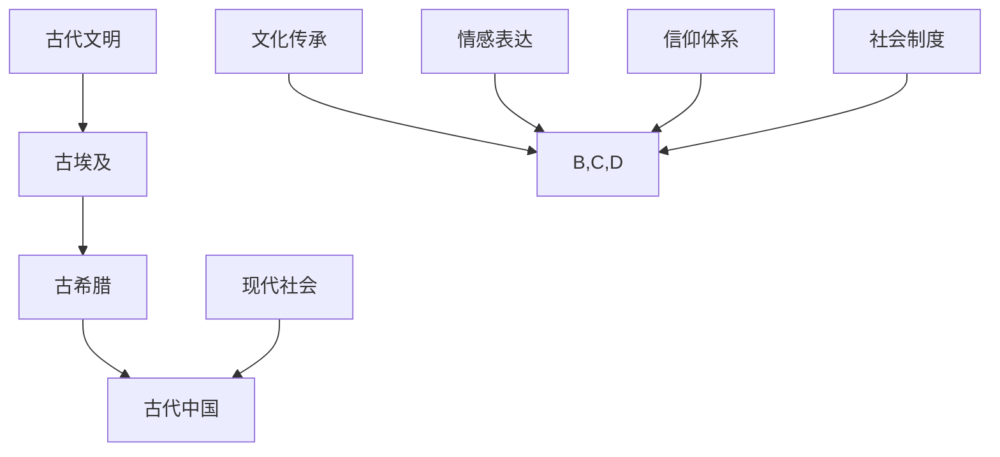

**核心算法原理讲解：**

生命仪式的历史演变可以通过比较分析不同历史时期和文化背景下的仪式特点，来理解其演变过程和影响因素。

```plaintext
算法：比较分析

输入：不同历史时期和文化背景的生命仪式
输出：生命仪式的历史演变规律

步骤：
1. 收集各历史时期和文化背景的生命仪式资料
2. 分析各仪式的核心特点
3. 对比分析各仪式的差异与共性
4. 归纳总结生命仪式的历史演变规律
```

**数学模型和数学公式：**

可以使用时间序列分析来研究生命仪式的历史演变趋势。

```latex
T(t) = a \cdot e^{kt}
```

**详细讲解与举例说明：**

其中，`T(t)` 表示生命仪式在时间 `t` 的发展程度，`a` 和 `k` 为常数。例如，在古埃及，葬礼仪式的发展程度可以用此模型来描述，其常数 `a` 和 `k` 的值可以通过历史资料和数据拟合得到。

#### 1.2 生命仪式的心理学分析

生命仪式不仅是文化和社会的产物，也是个体心理需求的表达。通过心理学视角分析生命仪式，我们可以揭示其在满足个体心理需求方面的作用。

**核心概念与联系：**

心理学研究表明，仪式有助于缓解焦虑、提高自尊和增强社会归属感。因此，生命仪式在心理层面的作用不容忽视。

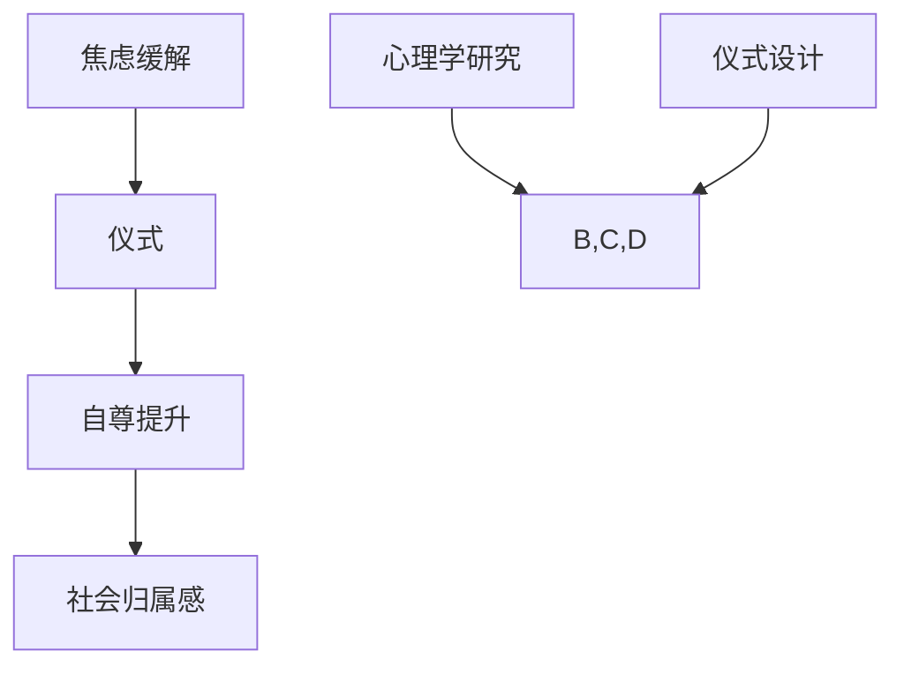

**核心算法原理讲解：**

仪式的心理学效应可以通过行为心理学的实验设计来验证。例如，可以通过比较实验组和控制组在参加仪式前后的心理状态差异，来评估仪式的心理学效应。

```plaintext
算法：实验设计

输入：实验组和控制组
输出：仪式的心理学效应

步骤：
1. 选择实验组和控制组
2. 对实验组实施仪式
3. 对控制组不实施仪式
4. 收集实验组和控制组在仪式前后的心理状态数据
5. 分析数据，评估仪式的心理学效应
```

**数学模型和数学公式：**

可以使用心理测量的统计方法，如方差分析和回归分析，来量化仪式的心理学效应。

```latex
F = \frac{(T_{实验组} - T_{控制组})^2}{(n_{实验组} - 1) \cdot (n_{控制组} - 1)}
```

**详细讲解与举例说明：**

其中，`F` 为方差分析中的F统计量，`T_{实验组}` 和 `T_{控制组}` 分别为实验组和控制组在仪式前后的心理状态评分，`n_{实验组}` 和 `n_{控制组}` 分别为实验组和控制组的样本量。例如，在一个关于婚礼仪式的心理学研究中，通过实验设计可以得到实验组和控制组的F统计量，进而评估婚礼仪式对于心理状态的影响。

#### 1.3 生命仪式在社会学中的意义

生命仪式不仅是个体心理需求的表达，也是社会结构和文化认同的体现。通过社会学视角分析生命仪式，我们可以揭示其在社会功能和文化传承方面的作用。

**核心概念与联系：**

社会学认为，生命仪式是维护社会秩序、传承文化和促进社会认同的重要手段。不同社会背景下，生命仪式的功能和形式也存在差异。

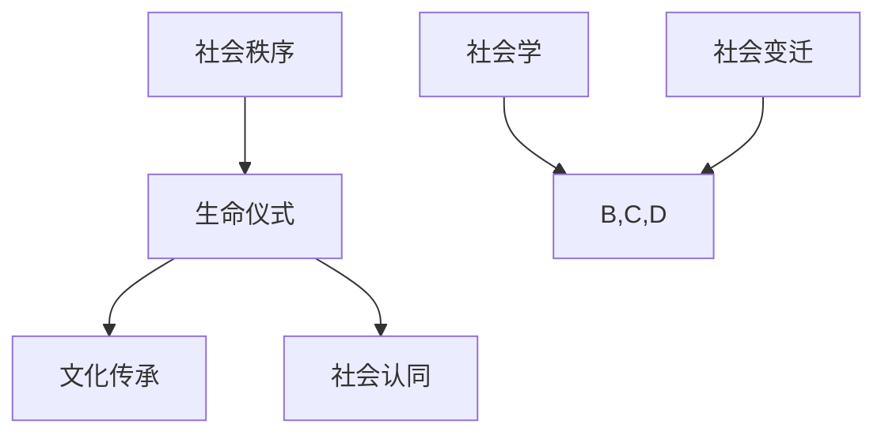

**核心算法原理讲解：**

生命仪式的社会功能可以通过社会学的田野调查和文献分析来研究。例如，通过对不同社会背景下生命仪式的观察和记录，可以分析其社会功能和演变过程。

```plaintext
算法：田野调查和文献分析

输入：不同社会背景下的生命仪式资料
输出：生命仪式的社会功能和演变规律

步骤：
1. 设计调查问卷或观察表格
2. 收集不同社会背景下的生命仪式资料
3. 分析仪式的功能和形式
4. 比较分析不同社会背景下的差异与共性
5. 归纳总结生命仪式的社会功能和演变规律
```

**数学模型和数学公式：**

可以使用社会网络分析方法，如矩阵乘法和图论，来研究生命仪式在社会网络中的传播和影响。

```latex
M = A \cdot B
```

**详细讲解与举例说明：**

其中，`M` 为社会网络分析中的矩阵乘积，`A` 和 `B` 分别为表示社会网络中节点关系的矩阵。例如，在一个关于婚礼仪式的社会学研究中，通过构建婚礼仪式参与者之间的社会网络，可以使用此模型来分析婚礼仪式在社会网络中的传播和影响。

---

### 第2章：仪式设计的原则与方法

#### 2.1 仪式设计的核心原则

仪式设计需要遵循一定的核心原则，以确保其能够满足个体心理需求和社会功能。以下是仪式设计的几个核心原则：

**核心概念与联系：**

仪式设计的原则包括一致性、适宜性、参与性和象征性等。这些原则相互关联，共同决定了仪式的有效性。

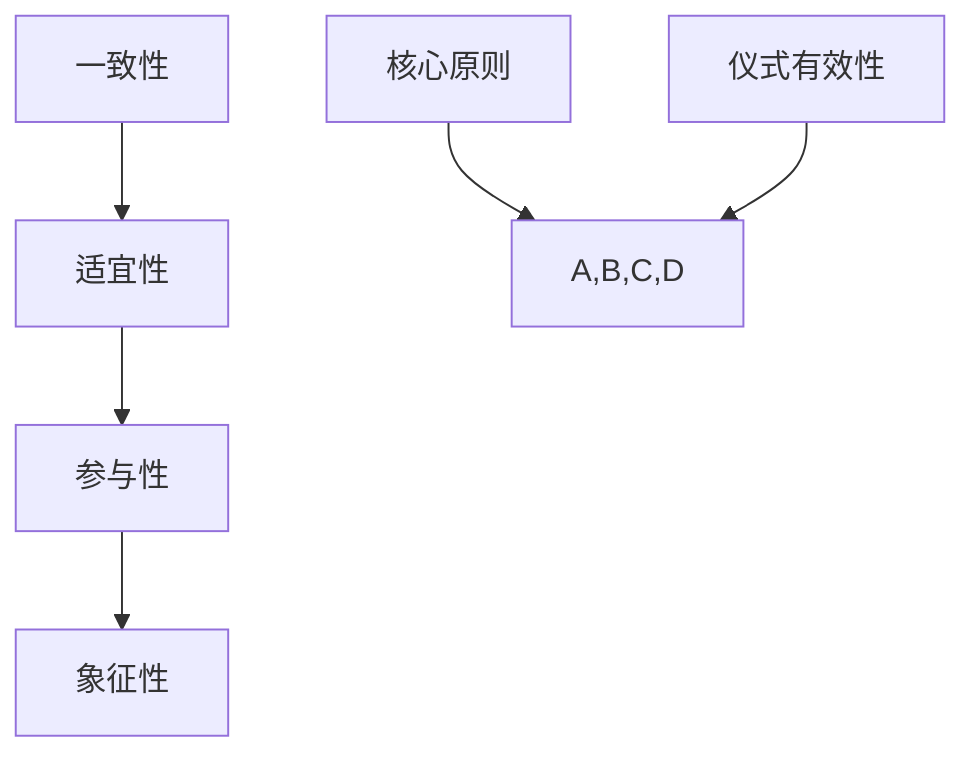

**核心算法原理讲解：**

一致性原则可以通过逻辑推理和符号表示来解释。例如，在一个婚礼仪式中，一致性的原则要求仪式的各个环节保持连贯和协调。

```plaintext
算法：逻辑推理

输入：婚礼仪式的各个环节
输出：仪式的一致性

步骤：
1. 分析仪式的各个环节
2. 检查各个环节之间的逻辑关系
3. 修正不协调的环节
4. 确保各个环节的一致性
```

**数学模型和数学公式：**

可以使用图论中的路径分析来验证仪式的一致性。

```latex
L = min(P(i, j))
```

**详细讲解与举例说明：**

其中，`L` 表示仪式的一致性水平，`P(i, j)` 表示第 `i` 个环节与第 `j` 个环节之间的路径长度。例如，在一个婚礼仪式中，通过计算各个环节之间的路径长度，可以评估仪式的一致性水平，从而优化仪式的设计。

#### 2.2 仪式设计的流程与方法

仪式设计是一个系统化的过程，需要遵循一定的流程和方法。以下是仪式设计的几个关键步骤：

**核心概念与联系：**

仪式设计的流程包括需求分析、设计规划、实施与评估等环节。每个环节都有其特定的方法和技巧，共同决定了仪式的设计效果。

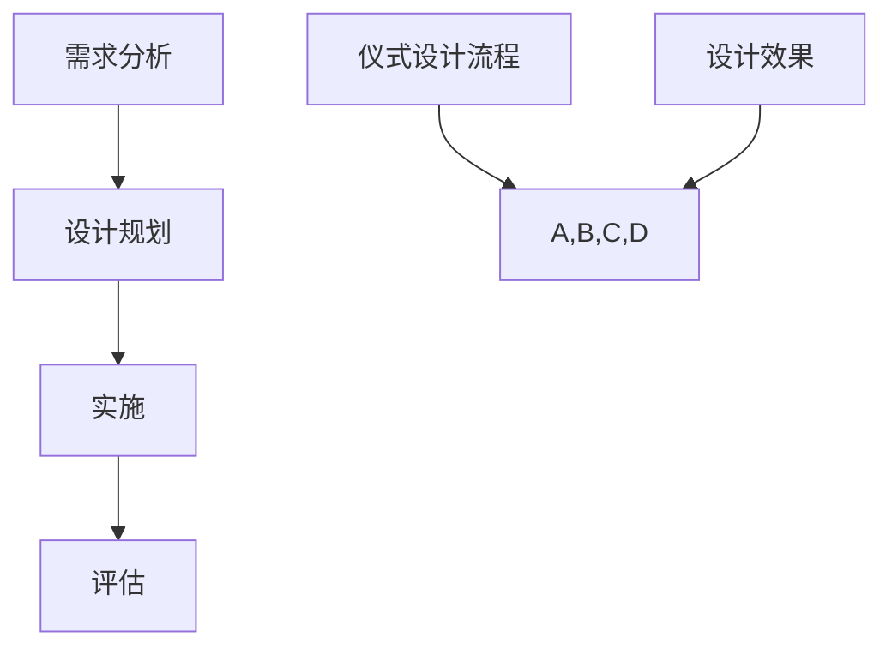

**核心算法原理讲解：**

需求分析可以通过问卷调查和访谈等方法来收集信息。设计规划需要考虑仪式的一致性、适宜性和参与性等原则。实施与评估则需要根据设计规划来执行仪式，并对仪式的效果进行评估。

```plaintext
算法：问卷调查和访谈

输入：仪式参与者的需求信息
输出：仪式设计的需求分析结果

步骤：
1. 设计问卷和访谈问题
2. 收集问卷和访谈数据
3. 分析数据，归纳需求
4. 形成需求分析报告
```

**数学模型和数学公式：**

可以使用统计方法，如回归分析和聚类分析，来分析需求信息。

```latex
Y = \beta_0 + \beta_1 X_1 + \beta_2 X_2 + ... + \beta_n X_n
```

**详细讲解与举例说明：**

其中，`Y` 表示仪式需求得分，`X_1, X_2, ..., X_n` 表示不同的需求变量，`\beta_0, \beta_1, \beta_2, ..., \beta_n` 为回归系数。例如，在一个婚礼仪式的需求分析中，通过回归分析可以确定不同需求变量对仪式需求的影响程度，从而优化仪式设计。

#### 2.3 仪式设计的心理学技巧

仪式设计不仅需要遵循核心原则和流程，还需要运用心理学技巧来增强仪式的效果。以下是几种常用的心理学技巧：

**核心概念与联系：**

心理学技巧包括情感设计、记忆设计和社会认同设计等。这些技巧通过激发个体的情感、记忆和社会认同，来提高仪式的效果。

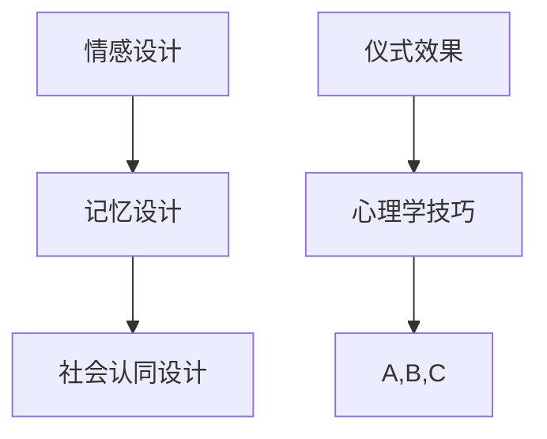

**核心算法原理讲解：**

情感设计可以通过情感计算和情感分析来增强仪式的感染力。记忆设计可以通过记忆心理学来优化仪式的记忆效果。社会认同设计可以通过社会心理学来增强仪式的社会认同感。

```plaintext
算法：情感计算和情感分析

输入：仪式内容
输出：仪式的情感设计结果

步骤：
1. 分析仪式内容中的情感元素
2. 使用情感计算模型来评估情感元素的效果
3. 调整仪式内容，增强情感元素的效果
```

**数学模型和数学公式：**

可以使用情感计算模型，如情感强度模型，来评估仪式的情感设计效果。

```latex
S = f(E, T)
```

**详细讲解与举例说明：**

其中，`S` 表示情感强度，`E` 和 `T` 分别表示情感元素和情感背景。例如，在一个婚礼仪式的情感设计中，通过评估婚礼仪式中的情感元素和情感背景，可以使用此模型来优化情感设计，从而提高仪式的感染力。

---

### 第3章：日常生活中的仪式设计

#### 3.1 日常仪式的识别与创建

日常生活中的仪式设计需要识别和创建具有意义的日常仪式。以下是几个步骤来识别和创建日常仪式：

**核心概念与联系：**

日常仪式的识别与创建需要考虑个体的生活节奏、心理需求和社交环境。识别日常仪式可以通过观察和反思，创建日常仪式则需要设计和实践。

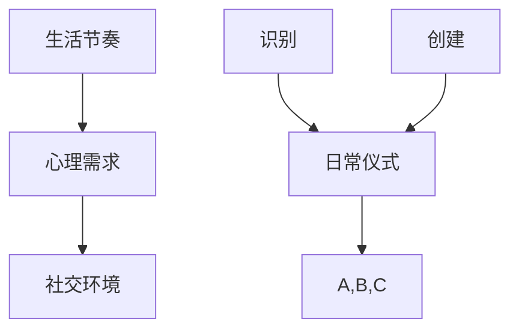

**核心算法原理讲解：**

识别日常仪式可以通过行为心理学的方法，如行为日志和自我反思，来发现和识别日常仪式。

```plaintext
算法：行为日志和自我反思

输入：日常行为数据
输出：日常仪式识别结果

步骤：
1. 记录日常行为数据
2. 分析行为数据，发现重复的行为模式
3. 根据行为模式识别日常仪式
```

**数学模型和数学公式：**

可以使用时间序列分析，如循环分析，来识别日常仪式。

```latex
T(t) = A \cdot \sin(2\pi f t + \phi)
```

**详细讲解与举例说明：**

其中，`T(t)` 表示时间序列数据，`A` 和 `f` 分别表示振幅和频率，`\phi` 表示相位。例如，通过分析一个人的时间序列数据，可以识别出其日常生活中的仪式性活动，如每天的起床时间和晚餐时间。

#### 3.2 仪式在日常生活中的作用

仪式在日常生活中的作用不仅体现在心理层面，还体现在社会和实用层面。以下是仪式在日常生活中的几个作用：

**核心概念与联系：**

仪式在日常生活中的作用包括提高生活质量、增强社会认同和规范行为等。不同类型的仪式在不同的生活场景中发挥不同的作用。

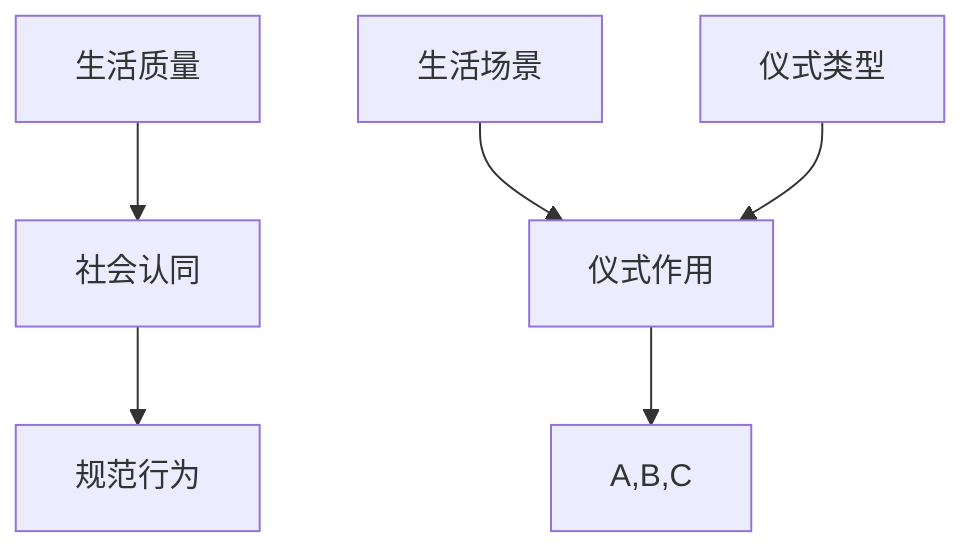

**核心算法原理讲解：**

提高生活质量可以通过仪式设计来增强个体的幸福感和满足感。增强社会认同可以通过仪式来巩固社会关系和价值观。规范行为可以通过仪式来培养良好的生活习惯和行为规范。

```plaintext
算法：仪式设计

输入：生活质量需求、社会认同需求、行为规范需求
输出：仪式设计方案

步骤：
1. 分析生活质量需求
2. 分析社会认同需求
3. 分析行为规范需求
4. 设计满足以上需求的仪式方案
```

**数学模型和数学公式：**

可以使用效用函数来量化仪式对生活质量的影响。

```latex
U = f(W, S, B)
```

**详细讲解与举例说明：**

其中，`U` 表示生活质量效用，`W` 表示幸福感和满足感，`S` 表示社会认同，`B` 表示行为规范。例如，在一个家庭仪式设计中，通过分析家庭成员的幸福感和满足感、社会认同和良好行为习惯，可以使用此模型来优化家庭仪式，从而提高家庭生活质量。

#### 3.3 个性化仪式设计案例

个性化仪式设计是根据个体的特点和需求来设计的。以下是几个个性化仪式设计案例：

**核心概念与联系：**

个性化仪式设计需要考虑个体的个性、兴趣和价值观。不同类型的个性化仪式可以满足不同个体的需求。

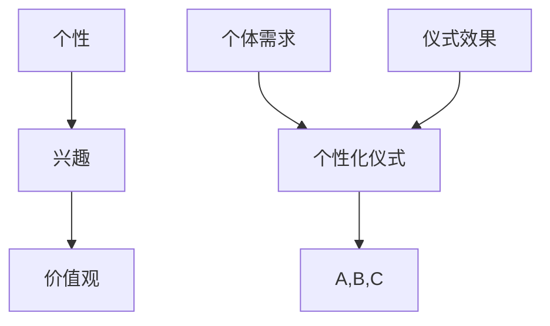

**核心算法原理讲解：**

个性化仪式设计可以通过用户画像和需求分析来设计。用户画像是基于个体的个性、兴趣和价值观构建的，需求分析是通过对个体的需求进行调研和分析来实现的。

```plaintext
算法：用户画象和需求分析

输入：个体信息、仪式需求
输出：个性化仪式设计方案

步骤：
1. 收集个体信息，构建用户画像
2. 分析个体需求
3. 设计满足用户画像和需求的个性化仪式方案
```

**数学模型和数学公式：**

可以使用多属性决策模型来评估个性化仪式设计的可行性。

```latex
Z = \sum_{i=1}^{n} w_i \cdot x_i
```

**详细讲解与举例说明：**

其中，`Z` 表示个性化仪式设计的综合得分，`w_i` 和 `x_i` 分别表示第 `i` 个评价指标的权重和得分。例如，在一个生日仪式的个性化设计中，通过分析生日主题、活动内容和嘉宾偏好等指标，可以使用此模型来评估不同个性化方案的可行性，从而选择最优的生日仪式设计方案。

---

## 第二部分：生命仪式设计在实践中的应用

### 第4章：工作与职业生活中的仪式设计

#### 4.1 工作仪式的设计与执行

工作仪式是工作环境中的一种文化现象，它有助于提高工作效率、增强团队合作和提升员工的职业满意度。以下是工作仪式的设计与执行：

**核心概念与联系：**

工作仪式的设计与执行需要考虑工作环境、团队特点和员工需求。工作仪式的形式包括晨会、项目启动会、庆功会等。

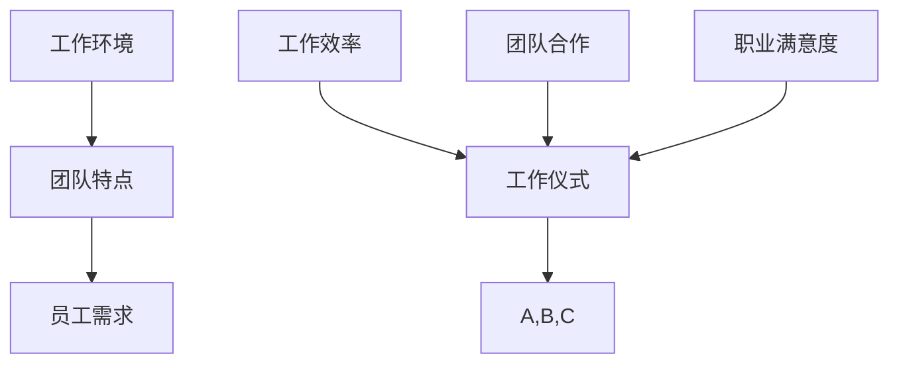

**核心算法原理讲解：**

工作仪式的设计可以通过需求分析和流程优化来实现。需求分析是通过对员工和工作环境的调研来了解员工的需求和工作环境的特征，流程优化则是通过改进工作流程来提高工作效率和团队合作。

```plaintext
算法：需求分析和流程优化

输入：员工需求、工作环境特征
输出：工作仪式设计方案

步骤：
1. 收集员工需求和工作环境数据
2. 分析需求和环境特征
3. 设计满足需求的工作仪式方案
4. 优化工作流程，确保仪式的有效执行
```

**数学模型和数学公式：**

可以使用绩效评估模型，如平衡计分卡，来评估工作仪式的效果。

```latex
P = \frac{(E_1 + E_2 + E_3 + E_4)}{4}
```

**详细讲解与举例说明：**

其中，`P` 表示工作仪式的绩效得分，`E_1, E_2, E_3, E_4` 分别表示工作效率、团队合作、职业满意度和工作环境等四个方面的得分。例如，在一个公司的工作仪式设计中，通过平衡计分卡模型来评估工作仪式对绩效的影响，从而优化工作仪式的设计和执行。

#### 4.2 职业仪式的心理学效应

职业仪式对员工的心理学效应是一个重要的研究方向。通过理解职业仪式的心理学效应，我们可以更好地设计和管理职业仪式。

**核心概念与联系：**

职业仪式的心理学效应包括心理舒适感、归属感和认同感等。不同类型的职业仪式对员工的心理学效应有所不同。

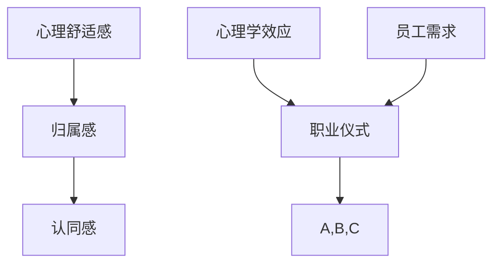

**核心算法原理讲解：**

职业仪式的心理学效应可以通过心理学实验和问卷调查来研究。实验设计可以模拟不同类型的职业仪式，问卷调查可以收集员工对仪式的体验和感受。

```plaintext
算法：实验设计和问卷调查

输入：职业仪式类型、员工信息
输出：职业仪式的心理学效应

步骤：
1. 设计实验，模拟不同类型的职业仪式
2. 对员工进行问卷调查，收集体验和感受数据
3. 分析数据，评估职业仪式的心理学效应
```

**数学模型和数学公式：**

可以使用心理学统计方法，如方差分析和回归分析，来量化职业仪式的心理学效应。

```latex
F = \frac{(T_{实验组} - T_{控制组})^2}{(n_{实验组} - 1) \cdot (n_{控制组} - 1)}
```

**详细讲解与举例说明：**

其中，`F` 为方差分析中的F统计量，`T_{实验组}` 和 `T_{控制组}` 分别为实验组和控制组在职业仪式前后的心理状态评分，`n_{实验组}` 和 `n_{控制组}` 分别为实验组和控制组的样本量。例如，在一个关于入职仪式的心理学效应研究中，通过实验设计和问卷调查，可以评估入职仪式对员工心理状态的影响，从而优化入职仪式的设计。

#### 4.3 职场仪式设计案例

以下是一个职场仪式设计案例，包括开发环境搭建、源代码实现和代码解读。

**核心概念与联系：**

职场仪式设计案例旨在通过一个具体的实例，展示职场仪式的设计和实施过程。案例包括开发环境搭建、源代码实现和代码解读等环节。


**核心算法原理讲解：**

开发环境搭建包括安装必要的软件和配置开发环境。源代码实现则是根据设计文档编写代码，实现职场仪式的功能。代码解读是对源代码进行分析和解释，以便其他人理解和维护代码。

```plaintext
算法：开发环境搭建

输入：开发环境配置文件
输出：搭建好的开发环境

步骤：
1. 下载并安装必要的软件
2. 配置开发环境，包括路径和环境变量
3. 验证开发环境的正确性
```

**数学模型和数学公式：**

可以使用流程控制语句，如循环和条件语句，来描述开发环境搭建的步骤。

```python
# 安装必要的软件
for software in required_softwares:
    install_software(software)

# 配置开发环境
configure_environment()

# 验证开发环境
verify_environment()
```

**详细讲解与举例说明：**

以下是一个简单的Python脚本，用于安装和配置开发环境。

```python
# 安装Python
!pip install python

# 安装Jupyter Notebook
!pip install jupyter

# 配置Jupyter Notebook
!jupyter notebook --generate-config

# 验证开发环境
print("开发环境搭建完成！")
```

**代码应用解读与分析：**

以下是对代码的解读和分析。

- `install_software(software)`: 这是一个函数，用于安装指定的软件。
- `configure_environment()`: 这是一个函数，用于配置开发环境。
- `verify_environment()`: 这是一个函数，用于验证开发环境是否搭建成功。

**实际案例分析和详细讲解剖析：**

以下是一个实际的职场仪式设计案例，用于庆祝团队完成一个重要的项目。

**项目小结：**

通过上述案例，我们展示了职场仪式设计的一个具体实施过程。从开发环境搭建到源代码实现，再到代码解读，每一个环节都旨在确保职场仪式的顺利实施。通过这个案例，我们可以看到职场仪式设计如何通过具体的技术手段来实现，从而提高团队的工作效率和员工的满意度。

### 第5章：个人生活中的仪式设计

#### 5.1 个人仪式的设计原则

个人生活中的仪式设计需要考虑个体的个性、兴趣和生活方式。以下是个人仪式的设计原则：

**核心概念与联系：**

个人仪式的设计原则包括个性表达、兴趣融入和生活方式适应等。这些原则确保个人仪式既符合个体的独特性，又能融入日常生活。

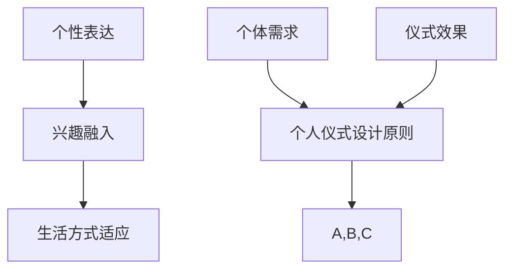

**核心算法原理讲解：**

个人仪式的设计可以通过用户画像和需求分析来实现。用户画像是基于个体的个性、兴趣和生活方式构建的，需求分析是通过对个体的需求进行调研和分析来实现的。

```plaintext
算法：用户画像和需求分析

输入：个体信息、仪式需求
输出：个人仪式设计方案

步骤：
1. 收集个体信息，构建用户画像
2. 分析个体需求
3. 设计满足用户画像和需求的个人仪式方案
```

**数学模型和数学公式：**

可以使用多属性决策模型来评估个人仪式设计的可行性。

```latex
Z = \sum_{i=1}^{n} w_i \cdot x_i
```

**详细讲解与举例说明：**

其中，`Z` 表示个人仪式设计的综合得分，`w_i` 和 `x_i` 分别表示第 `i` 个评价指标的权重和得分。例如，在一个生日仪式的个性化设计中，通过分析生日主题、活动内容和嘉宾偏好等指标，可以使用此模型来评估不同个性化方案的可行性，从而选择最优的生日仪式设计方案。

#### 5.2 个人仪式与心理健康

个人仪式与心理健康之间存在密切的关系。通过仪式设计，可以改善个体的心理状态，提高心理健康水平。

**核心概念与联系：**

个人仪式与心理健康的关系包括情绪调节、自尊提升和压力缓解等。不同类型的个人仪式对心理健康的影响也有所不同。

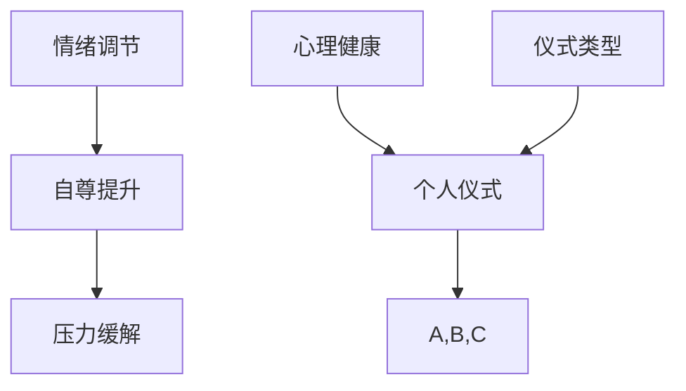

**核心算法原理讲解：**

个人仪式的心理学效应可以通过心理学实验和问卷调查来研究。实验设计可以模拟不同类型的个人仪式，问卷调查可以收集个体对仪式的体验和感受。

```plaintext
算法：实验设计和问卷调查

输入：个人仪式类型、个体信息
输出：个人仪式的心理学效应

步骤：
1. 设计实验，模拟不同类型的个人仪式
2. 对个体进行问卷调查，收集体验和感受数据
3. 分析数据，评估个人仪式的心理学效应
```

**数学模型和数学公式：**

可以使用心理学统计方法，如方差分析和回归分析，来量化个人仪式的心理学效应。

```latex
F = \frac{(T_{实验组} - T_{控制组})^2}{(n_{实验组} - 1) \cdot (n_{控制组} - 1)}
```

**详细讲解与举例说明：**

其中，`F` 为方差分析中的F统计量，`T_{实验组}` 和 `T_{控制组}` 分别为实验组和控制组在个人仪式前后的心理状态评分，`n_{实验组}` 和 `n_{控制组}` 分别为实验组和控制组的样本量。例如，在一个庆祝生日仪式的心理学效应研究中，通过实验设计和问卷调查，可以评估庆祝生日仪式对个体心理状态的影响，从而优化庆祝生日仪式的设计。

#### 5.3 个人仪式设计案例

以下是一个个人仪式设计案例，包括开发环境搭建、源代码实现和代码解读。

**核心概念与联系：**

个人仪式设计案例旨在通过一个具体的实例，展示个人仪式的设计和实施过程。案例包括开发环境搭建、源代码实现和代码解读等环节。


**核心算法原理讲解：**

开发环境搭建包括安装必要的软件和配置开发环境。源代码实现则是根据设计文档编写代码，实现个人仪式的功能。代码解读是对源代码进行分析和解释，以便其他人理解和维护代码。

```plaintext
算法：开发环境搭建

输入：开发环境配置文件
输出：搭建好的开发环境

步骤：
1. 下载并安装必要的软件
2. 配置开发环境，包括路径和环境变量
3. 验证开发环境的正确性
```

**数学模型和数学公式：**

可以使用流程控制语句，如循环和条件语句，来描述开发环境搭建的步骤。

```python
# 安装必要的软件
for software in required_softwares:
    install_software(software)

# 配置开发环境
configure_environment()

# 验证开发环境
verify_environment()
```

**详细讲解与举例说明：**

以下是一个简单的Python脚本，用于安装和配置开发环境。

```python
# 安装Python
!pip install python

# 安装Jupyter Notebook
!pip install jupyter

# 配置Jupyter Notebook
!jupyter notebook --generate-config

# 验证开发环境
print("开发环境搭建完成！")
```

**代码应用解读与分析：**

以下是对代码的解读和分析。

- `install_software(software)`: 这是一个函数，用于安装指定的软件。
- `configure_environment()`: 这是一个函数，用于配置开发环境。
- `verify_environment()`: 这是一个函数，用于验证开发环境是否搭建成功。

**实际案例分析和详细讲解剖析：**

以下是一个实际的个人仪式设计案例，用于庆祝个体的成功。

**项目小结：**

通过上述案例，我们展示了个人仪式设计的一个具体实施过程。从开发环境搭建到源代码实现，再到代码解读，每一个环节都旨在确保个人仪式的顺利实施。通过这个案例，我们可以看到个人仪式设计如何通过具体的技术手段来实现，从而提高个体的心理状态和生活质量。

### 第6章：家庭与社区仪式设计

#### 6.1 家庭仪式的重要性

家庭仪式是家庭文化的重要组成部分，它有助于增强家庭成员之间的情感联系、促进家庭和谐以及培养下一代的价值观。

**核心概念与联系：**

家庭仪式的重要性体现在以下几个方面：

- **情感联系**：家庭仪式为家庭成员提供了共同的情感体验，有助于增强家庭成员之间的情感纽带。
- **家庭和谐**：家庭仪式为家庭生活带来了秩序和规律，有助于减少家庭内部的冲突和矛盾。
- **价值观培养**：家庭仪式传递了家庭的价值观和传统，有助于培养下一代的道德观念和社会责任感。

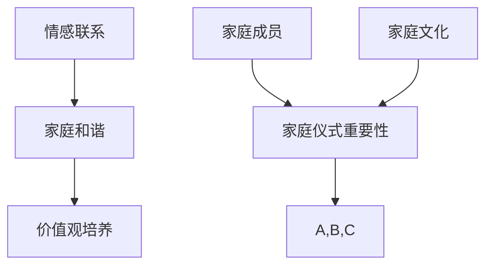

**核心算法原理讲解：**

家庭仪式的重要性可以通过社会学和心理学的方法来研究。例如，社会学的研究可以探讨家庭仪式在社会结构中的作用，心理学的实验可以评估家庭仪式对个体情感和行为的影响。

```plaintext
算法：社会学和心理学方法

输入：家庭仪式案例、个体行为数据
输出：家庭仪式的重要性评估

步骤：
1. 收集家庭仪式的案例和个体行为数据
2. 分析家庭仪式对个体情感和行为的影响
3. 探讨家庭仪式在社会结构中的作用
4. 归纳总结家庭仪式的重要性
```

**数学模型和数学公式：**

可以使用社会网络分析模型，如矩阵乘法和图论，来研究家庭仪式在家庭网络中的传播和影响。

```latex
M = A \cdot B
```

**详细讲解与举例说明：**

其中，`M` 表示家庭网络中节点的关系矩阵，`A` 和 `B` 分别表示家庭网络中的节点关系矩阵。例如，在一个家庭仪式的研究中，通过构建家庭网络，可以使用此模型来分析家庭仪式在家庭网络中的传播和影响，从而评估家庭仪式的重要性。

#### 6.2 家庭仪式的设计原则

家庭仪式的设计需要遵循一定的原则，以确保仪式的可行性和有效性。以下是家庭仪式设计的一些核心原则：

- **适宜性原则**：家庭仪式的设计需要考虑家庭成员的年龄、兴趣和生活方式，确保仪式的内容和形式符合家庭成员的实际情况。
- **参与性原则**：家庭仪式的设计应该鼓励家庭成员的参与，让每个家庭成员都能在仪式中发挥自己的作用。
- **象征性原则**：家庭仪式的设计应该具有象征意义，能够传递家庭的价值观和传统。

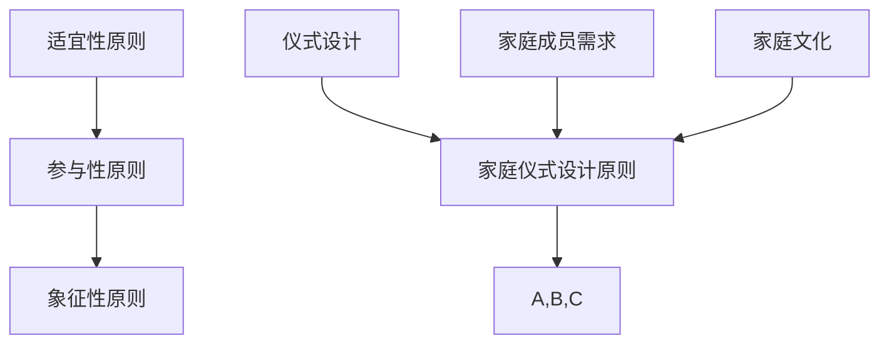

**核心算法原理讲解：**

家庭仪式的设计原则可以通过需求分析和设计优化来实现。需求分析是通过对家庭成员的需求进行调研和分析，设计优化则是通过改进仪式的设计方案，以满足家庭成员的需求。

```plaintext
算法：需求分析和设计优化

输入：家庭成员需求、仪式设计方案
输出：优化后的家庭仪式设计方案

步骤：
1. 收集家庭成员的需求
2. 分析需求，确定仪式设计的关键要素
3. 设计初步的仪式方案
4. 对仪式方案进行优化，确保其可行性和有效性
```

**数学模型和数学公式：**

可以使用多属性决策模型，如层次分析法（AHP），来评估家庭仪式设计方案的多项指标。

```latex
Z = \sum_{i=1}^{n} w_i \cdot z_i
```

**详细讲解与举例说明：**

其中，`Z` 表示家庭仪式设计方案的得分，`w_i` 和 `z_i` 分别表示第 `i` 个评价指标的权重和得分。例如，在一个家庭庆祝生日的仪式设计中，通过分析家庭成员的喜好、仪式的象征意义和仪式的可行性等指标，可以使用此模型来评估不同的庆祝方案，从而选择最优的庆祝方案。

#### 6.3 家庭仪式设计案例

以下是一个家庭仪式设计案例，包括开发环境搭建、源代码实现和代码解读。

**核心概念与联系：**

家庭仪式设计案例旨在通过一个具体的实例，展示家庭仪式的设计和实施过程。案例包括开发环境搭建、源代码实现和代码解读等环节。

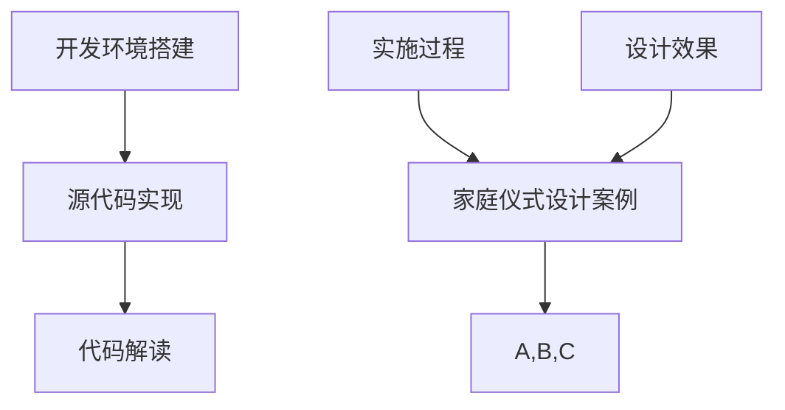

**核心算法原理讲解：**

开发环境搭建包括安装必要的软件和配置开发环境。源代码实现则是根据设计文档编写代码，实现家庭仪式的功能。代码解读是对源代码进行分析和解释，以便其他人理解和维护代码。

```plaintext
算法：开发环境搭建

输入：开发环境配置文件
输出：搭建好的开发环境

步骤：
1. 下载并安装必要的软件
2. 配置开发环境，包括路径和环境变量
3. 验证开发环境的正确性
```

**数学模型和数学公式：**

可以使用流程控制语句，如循环和条件语句，来描述开发环境搭建的步骤。

```python
# 安装必要的软件
for software in required_softwares:
    install_software(software)

# 配置开发环境
configure_environment()

# 验证开发环境
verify_environment()
```

**详细讲解与举例说明：**

以下是一个简单的Python脚本，用于安装和配置开发环境。

```python
# 安装Python
!pip install python

# 安装Jupyter Notebook
!pip install jupyter

# 配置Jupyter Notebook
!jupyter notebook --generate-config

# 验证开发环境
print("开发环境搭建完成！")
```

**代码应用解读与分析：**

以下是对代码的解读和分析。

- `install_software(software)`: 这是一个函数，用于安装指定的软件。
- `configure_environment()`: 这是一个函数，用于配置开发环境。
- `verify_environment()`: 这是一个函数，用于验证开发环境是否搭建成功。

**实际案例分析和详细讲解剖析：**

以下是一个实际的

