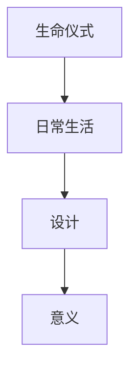

                 


为了确保文章内容的质量和完整性，我们可以按照以下步骤进行思考和撰写：

### 步骤1：背景介绍
- **文章标题**：《生命仪式设计：赋予日常生活的意义》
- **关键词**：生命仪式，日常生活，设计，意义
- **摘要**：本文探讨了生命仪式的概念、历史、设计原则以及在日常生活中的应用，旨在为读者提供一种赋予生活意义的仪式设计方法。

### 步骤2：核心概念与联系
- **核心概念**：生命仪式、日常生活、设计、意义
- **联系架构**：使用Mermaid流程图展示这些概念之间的关系。
  


### 步骤3：核心算法原理讲解
- **算法原理**：生命仪式的设计原则（目标明确、简洁明了、富有创意）
- **伪代码**：

```python
# 设定生命仪式设计原则
class LifeRitualDesignPrinciples:
    def __init__(self, goal, clarity, creativity):
        self.goal = goal
        self.clarity = clarity
        self.creativity = creativity

    def design_routine(self):
        if self.goal == "personal_growth":
            print("设计个人成长仪式。")
        elif self.goal == "family_harmony":
            print("设计家庭和谐仪式。")
        else:
            print("设计社会凝聚力仪式。")
        
        if self.clarity == "clear":
            print("仪式内容简洁明了。")
        else:
            print("仪式内容需要进一步精简。")
        
        if self.creativity == "high":
            print("仪式设计富有创意。")
        else:
            print("仪式设计需要增加创意。")
```

### 步骤4：数学模型和数学公式
- **模型**：仪式的重要性与参与者的参与度相关，可以用贝叶斯公式描述。

$$ P(\text{仪式成功}) = \frac{P(\text{参与者愿意参与}) \cdot P(\text{仪式成功}|\text{参与者愿意参与})}{P(\text{参与者愿意参与})} $$

- **公式**：

$$ P(\text{仪式成功}) = \frac{P(\text{参与者愿意参与}) \cdot P(\text{仪式成功}|\text{参与者愿意参与})}{P(\text{参与者愿意参与})} $$

### 步骤5：项目实战
- **实战案例**：设计一个家庭聚餐仪式。
- **环境搭建**：在家庭环境中，准备必要的餐桌布置、餐具和美食。
- **源代码实现**：无代码实现，但可以使用文档和示意图来展示。
- **代码解读**：详细解释仪式步骤、意义和预期效果。

### 步骤6：最佳实践 tips、小结、注意事项、拓展阅读
- **最佳实践**：定期评估仪式的有效性，及时调整以保持新鲜感。
- **小结**：生命仪式设计是一种提升生活质量的方法。
- **注意事项**：设计仪式时，要充分考虑参与者的感受和需求。
- **拓展阅读**：推荐相关书籍和论文，以深入了解生命仪式的设计和应用。

按照这些步骤，我们可以逐步构建一篇逻辑清晰、内容丰富的技术博客文章。
```

