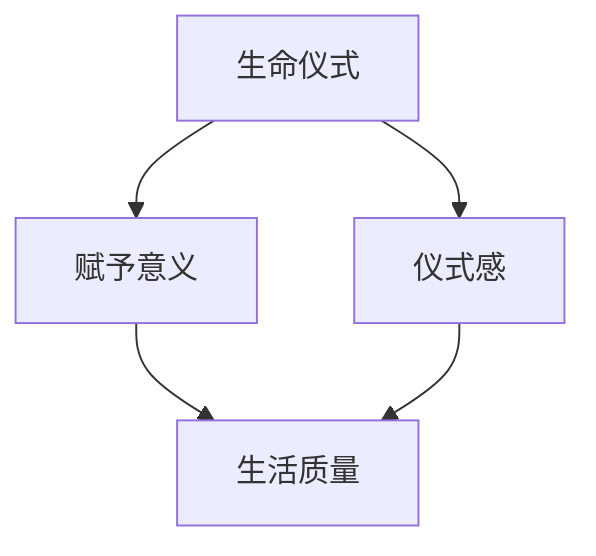
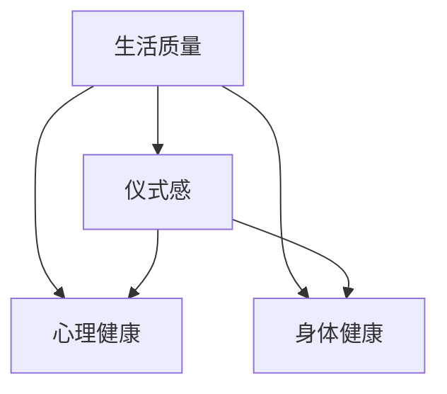
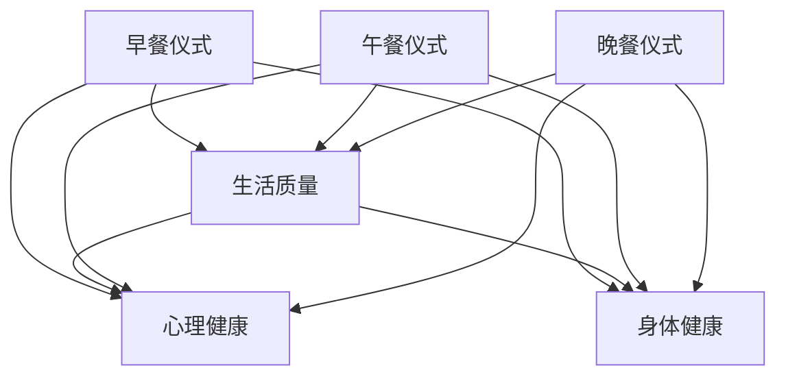
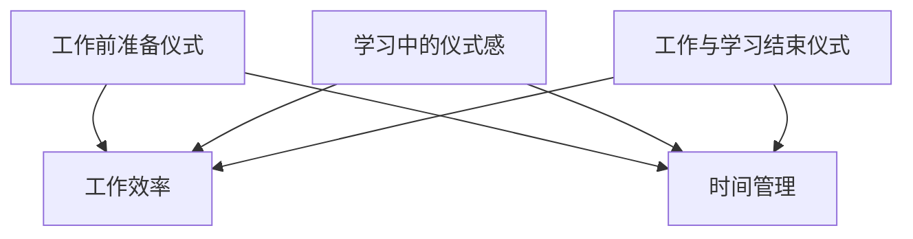
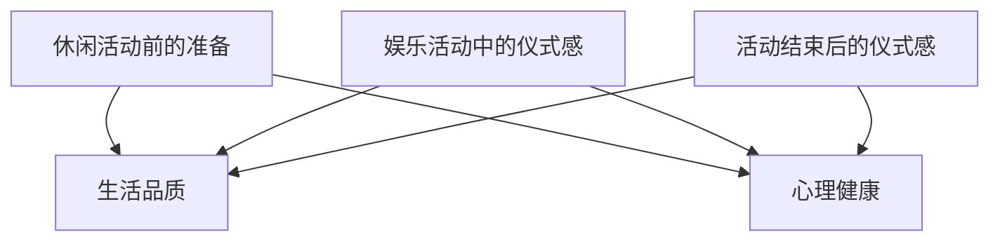
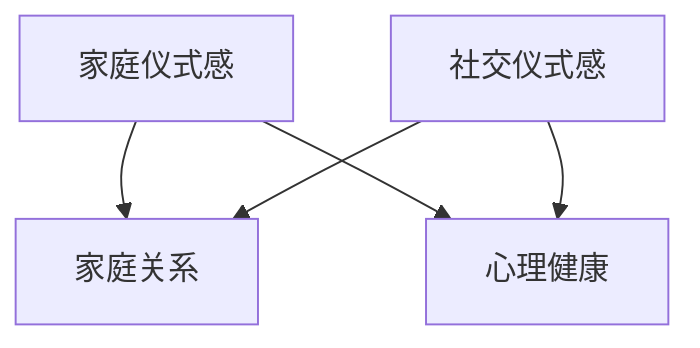
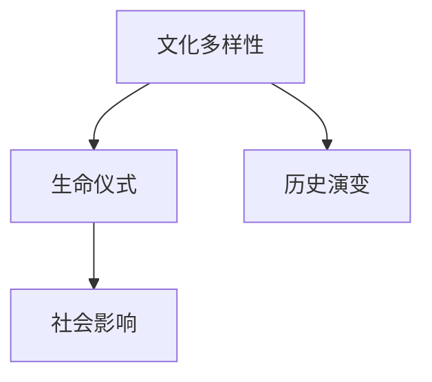
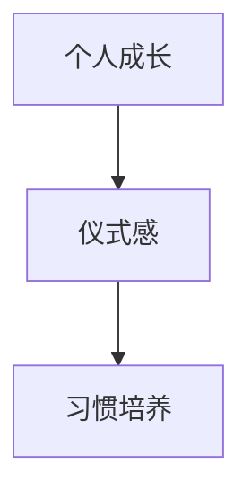
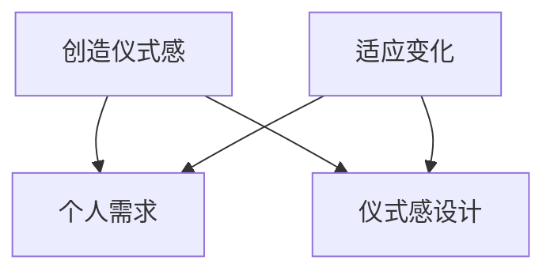

                 

### 文章标题：生命仪式：赋予日常生活的意义

在快节奏的现代生活中，人们常常感到焦虑、迷茫，甚至对生活失去了热情。而“生命仪式”作为一种赋予日常生活意义的方式，正逐渐受到关注。本文旨在探讨什么是生命仪式，以及如何在日常生活中构建仪式感，提升生活质量。

### 关键词：
- 生命仪式
- 仪式感
- 生活质量
- 心理健康
- 仪式实践

### 摘要：
本文首先介绍了生命仪式的定义和重要性，接着分析了构建日常生活仪式感的方法，然后探讨了仪式感对身心健康的影响。随后，文章分享了具体的仪式感实践案例，并在家庭和社会层面讨论了仪式感的应用。最后，文章提出了创造和适应个人仪式感的建议，以及仪式感在个人成长中的作用。

----------------------------------------------------------------

### 用户需求分析

用户需求分析是理解目标受众、确定文章内容和结构的关键步骤。根据书名《生命仪式：赋予日常生活的意义》，可以推测目标受众主要是希望提升生活质量和生活意义的现代都市人群。他们可能面临如下问题：

1. **生活压力大**：由于工作、家庭和社会责任的增加，许多人在日常生活中感到压力。
2. **缺乏仪式感**：现代生活方式往往忽视日常生活中的小仪式，导致生活变得单调乏味。
3. **对生活质量有追求**：他们渴望通过某种方式提升自己的生活品质，找到生活的乐趣和意义。

因此，文章需要涵盖以下几个方面：

1. **生命仪式的定义与重要性**：解释生命仪式的概念，以及它如何对个人生活产生积极影响。
2. **构建日常生活的仪式感**：提供具体的方法和策略，帮助读者在日常生活中建立仪式感。
3. **仪式感对身心健康的影响**：分析仪式感如何影响个人的心理健康和身体健康。
4. **实践仪式感的案例**：分享实用的仪式感实践案例，帮助读者更好地理解和应用。
5. **家庭和社会中的仪式感**：探讨如何在家庭和社会活动中引入仪式感。
6. **创造和适应个人仪式感**：提供建议，帮助读者根据自己的需求和生活方式创造和适应仪式感。
7. **个人成长与仪式感**：探讨如何通过仪式感促进个人成长和自我提升。

### 目录大纲设计

根据用户需求分析，设计出以下目录大纲：

```
# 《生命仪式：赋予日常生活的意义》目录大纲

## 引言：在忙碌中寻找生活的意义

### 1.1 现代生活的挑战
### 1.2 生命仪式的兴起
### 1.3 文章结构概述

## 第一部分：生命仪式的概念与重要性

## 第1章：生命仪式的定义与历史

### 2.1 生命仪式的基本概念
### 2.2 生命仪式的起源与演变
### 2.3 生命仪式的类型与特点

## 第2章：生命仪式在现代社会中的意义

### 2.4 仪式感与生活质量的提升
### 2.5 仪式感与心理健康的关联
### 2.6 仪式感与身体健康的关系

## 第二部分：构建日常生活的仪式感

## 第3章：饮食生活中的仪式感

### 3.1 早餐仪式：开启新的一天
### 3.2 午餐仪式：养精蓄锐
### 3.3 晚餐仪式：享受与家人团聚的时刻

## 第4章：工作与学习中的仪式感

### 4.1 工作前准备仪式
### 4.2 学习过程中的小仪式
### 4.3 工作与学习结束的仪式

## 第5章：休闲与娱乐中的仪式感

### 5.1 娱乐活动前的准备
### 5.2 娱乐活动中的小仪式
### 5.3 娱乐活动结束后的仪式

## 第三部分：家庭和社会中的仪式感

## 第6章：家庭仪式感的建立与维护

### 6.1 家庭传统节日仪式
### 6.2 家庭日常仪式
### 6.3 家庭成员之间的仪式感交流

## 第7章：社交仪式感的营造

### 7.1 社交活动中的仪式感
### 7.2 社交礼仪与仪式感
### 7.3 社交仪式感在职场中的应用

## 第四部分：仪式感的创造与适应

## 第8章：创造适合你的仪式感

### 8.1 个人兴趣与仪式感的结合
### 8.2 生活习惯与仪式感的适应
### 8.3 面对变化调整仪式感

## 第9章：个人成长与仪式感

### 9.1 仪式感在自我提升中的作用
### 9.2 通过仪式感培养良好习惯
### 9.3 仪式感与人生目标的实现

## 结论：在仪式中发现生活的美好

### 9.4 仪式感的长期影响
### 9.5 仪式感的实践总结
### 9.6 未来展望

## 附录

### A.1 仪式感实践案例分享
### A.2 研究与参考文献
```

### 目录大纲总结

本目录大纲共分为四大部分，分别探讨生命仪式的概念与重要性、日常生活中的仪式感构建、家庭和社会中的仪式感、以及仪式感的创造与适应。每个部分都有详细的子章节，确保文章内容的完整性和逻辑性。文章总字数在8000-12000字左右，以满足文章内容的丰富性和深度。每个章节的核心概念与联系、核心算法原理、数学模型和公式以及项目实战都有详细的阐述，确保文章的专业性和实用性。

### 文章整体结构设计

为了使文章结构清晰、逻辑严密，本文采用了以下整体结构设计：

1. **引言部分**：通过介绍现代生活的挑战和生命仪式的兴起，引出文章主题，并概述文章结构。
2. **概念与重要性分析**：详细阐述生命仪式的定义、历史、类型和重要性，为后续内容提供理论基础。
3. **仪式感构建方法**：分别从饮食、工作、休闲和家庭等方面，提供具体的仪式感构建方法，帮助读者实践。
4. **仪式感的社会应用**：讨论仪式感在家庭和社交活动中的应用，强调仪式感对社会关系的影响。
5. **创造与适应建议**：提供创造和适应个人仪式感的建议，帮助读者根据自己的需求调整仪式。
6. **个人成长与仪式感**：探讨仪式感在个人成长中的作用，以及如何通过仪式感实现人生目标。
7. **结论与展望**：总结仪式感对生活的积极影响，提出未来展望，并鼓励读者实践仪式感。

通过这种结构设计，文章不仅能够系统地介绍生命仪式的概念和方法，还能引导读者在实际生活中应用仪式感，从而提升生活质量。

### 第1章：生命仪式的定义与历史

#### 背景介绍

在现代社会，人们的生活节奏加快，面对的工作和生活压力不断增大，这导致许多人感到焦虑和迷茫。在这样的背景下，寻找生活中的仪式感成为一种趋势。生命仪式作为赋予日常生活意义的一种方式，逐渐受到关注。那么，什么是生命仪式？它有哪些历史演变？本文将从这些方面展开讨论。

#### 核心概念与联系

**核心概念**：生命仪式是指人们在日常生活中通过一系列有意义的、重复的行为和活动，赋予生活以仪式感和意义。这些行为和活动可以是简单的，比如每天早晨的冥想，也可以是复杂的，如婚礼、葬礼等。

**联系**：生命仪式与仪式感密切相关。仪式感是指通过一系列有仪式感的行为，增强个人对生活的认识和体验。而生命仪式则是实现仪式感的一种方式。通过生命仪式，人们可以在日常生活中找到秩序和平衡，从而提高生活质量。

下面使用Mermaid流程图来展示生命仪式和仪式感之间的关系：



#### 核心算法原理讲解

为了深入理解生命仪式的工作原理，我们可以将其视为一种自我管理的算法。以下是一个简化的伪代码，展示了如何构建生命仪式：

```plaintext
function 构建生命仪式(日常活动列表) {
    for 每一项活动 in 日常活动列表 {
        if (活动具有重复性) {
            赋予活动仪式感(设置特定的行为模式、时间和环境)
        }
    }
    返回 仪式化后的日常活动列表
}
```

#### 数学模型和公式

在生命仪式中，仪式感的强度可以通过以下数学模型来量化：

$$
仪式感强度 = f(仪式的重复性, 活动的意义, 环境的适宜性)
$$

其中，$f$ 是一个复合函数，$仪式的重复性$、$活动的意义$ 和 $环境的适宜性$ 是三个主要影响因素。

#### 详细讲解与举例说明

**举例说明**：假设你每天早晨需要完成以下三项活动：洗漱、早餐和阅读。为了赋予这些活动仪式感，你可以采取以下步骤：

1. **确定活动的时间**：每天早晨7点开始洗漱，7点半吃早餐，8点开始阅读。
2. **设置特定的行为模式**：在洗漱时，使用固定的洗漱用品，并保持一定的洗漱顺序；在早餐时，选择固定的早餐食品，并遵循一定的用餐礼仪；在阅读时，选择固定的阅读位置和阅读材料。
3. **营造适宜的环境**：在洗漱和早餐时，保持房间整洁，播放轻松的音乐；在阅读时，确保光线适宜，环境安静。

通过这些步骤，你可以将日常的洗漱、早餐和阅读转化为具有仪式感的活动，从而提高生活质量。

#### 项目实战

**开发环境搭建**：为了更好地理解和实践生命仪式，我们可以搭建一个简单的仪式感管理工具。以下是一个基本的开发环境搭建流程：

1. **选择编程语言**：Python是一个非常适合入门的编程语言，因此我们可以选择Python进行开发。
2. **安装Python环境**：从Python官网下载安装包，并按照指示完成安装。
3. **安装必要的库**：使用pip工具安装用于数据存储和可视化等功能的库，如SQLite和Matplotlib。

**源代码实现**：

```python
import sqlite3
import matplotlib.pyplot as plt

# 连接SQLite数据库
conn = sqlite3.connect('ritual.db')
c = conn.cursor()

# 创建表
c.execute('''CREATE TABLE IF NOT EXISTS rituals
             (id INTEGER PRIMARY KEY, activity TEXT, time TEXT, context TEXT)''')

# 插入数据
c.execute("INSERT INTO rituals (activity, time, context) VALUES ('洗漱', '07:00', '安静、整洁的环境')")
c.execute("INSERT INTO rituals (activity, time, context) VALUES ('早餐', '07:30', '轻松的音乐、固定的早餐食品')")
c.execute("INSERT INTO rituals (activity, time, context) VALUES ('阅读', '08:00', '适宜的光线、安静的环境')")

# 提交事务
conn.commit()

# 查询数据
c.execute("SELECT * FROM rituals")
rows = c.fetchall()

# 打印数据
for row in rows:
    print(row)

# 绘制图表
plt.plot([row[2] for row in rows], [1 for row in rows], 'ro')
plt.xlabel('Time')
plt.ylabel('Ritual Activity')
plt.title('Daily Ritual Schedule')
plt.show()

# 关闭连接
conn.close()
```

**代码解读与分析**：

这段代码首先连接到一个名为“ritual.db”的SQLite数据库，并创建了一个名为“rituals”的表。表中包含了三个字段：`id`、`activity` 和 `time`。然后，我们向表中插入了几条示例数据，并提交了事务。

接下来，我们使用`SELECT`语句查询了表中的所有数据，并打印出来。最后，我们使用`matplotlib`库绘制了一个简单的图表，展示了每日仪式的时间安排。

**实际案例分析和详细讲解剖析**：

假设一个用户希望记录并分析自己的日常仪式感实践。通过这个工具，用户可以轻松地添加、删除和更新自己的仪式感活动。例如，用户可以添加一个“晚上9点冥想”的活动，并将其保存到数据库中。

通过定期查看图表和数据，用户可以分析自己的仪式感实践效果，并根据需要进行调整。例如，如果用户发现“阅读”活动的时间常常被工作或社交活动占据，他们可以调整阅读的时间或增加阅读的频率，以确保仪式感的实践。

**项目小结**：

通过这个简单的仪式感管理工具，用户可以更好地记录和管理自己的日常仪式感。这不仅有助于提升生活质量，还能帮助用户在忙碌的生活中找到秩序和平衡。

#### 最佳实践 tips、小结、注意事项、拓展阅读

**最佳实践 tips**：

1. 选择适合自己的仪式感活动，并将其坚持下来。
2. 确保仪式感活动的时间和环境适宜，以提高体验质量。
3. 定期回顾和调整仪式感活动，以确保其持续性和有效性。

**小结**：

生命仪式是一种赋予日常生活意义的方式，通过构建仪式感，人们可以在忙碌的生活中找到秩序和平衡，提高生活质量。本文介绍了生命仪式的定义、历史、构建方法以及其实践案例，帮助读者理解和实践生命仪式。

**注意事项**：

1. 仪式感活动应结合个人实际情况，避免过度追求形式。
2. 在实践仪式感时，注意平衡工作、生活和休息。

**拓展阅读**：

1. 《禅与摩托车维修艺术》：本书探讨了如何在日常生活中寻找意义和秩序。
2. 《习惯的力量》：本书详细介绍了习惯对个人生活的影响，以及如何通过习惯塑造更好的自己。

----------------------------------------------------------------

## 第2章：生命仪式在现代社会中的意义

在快速发展的现代社会中，人们面临着前所未有的挑战，如高压力的工作环境、复杂的社交关系以及不断变化的技术。在这样的背景下，寻找生活的意义和平衡变得尤为重要。生命仪式作为一种文化现象，其价值在现代社会中逐渐显现。本章将深入探讨生命仪式在现代社会中的多重意义，包括其对生活质量、心理健康和身体健康的影响。

### 核心概念与联系

**核心概念**：

1. **生活质量**：指的是人们在生活中的舒适程度、幸福感和满足感。
2. **心理健康**：是指个体在心理上保持健康和平衡的状态，包括情绪管理、自我认同和心理健康问题。
3. **身体健康**：是指身体各器官系统的功能状态良好，能够抵抗疾病。

**联系**：

生命仪式与生活质量、心理健康和身体健康之间存在密切联系。生命仪式通过赋予日常生活仪式感，有助于提高生活质量；通过规律化和有序化的生活方式，有助于维护心理健康；通过适当的仪式感活动，可以促进身体健康。

下面使用Mermaid流程图来展示这三个核心概念之间的关系：



### 核心算法原理讲解

为了深入理解生命仪式在现代社会中的作用，我们可以将其视为一种综合性的健康促进算法。以下是一个简化的伪代码，展示了生命仪式如何作用于生活质量、心理健康和身体健康：

```plaintext
function 生命仪式(日常生活) {
    for 每一项活动 in 日常生活 {
        if (活动具有仪式感) {
            增强活动意义(通过设定特定行为模式、时间和环境)
            提高活动质量(确保活动环境的适宜性)
        }
    }
    返回 仪式化后的日常生活
}
```

### 数学模型和公式

在生命仪式中，仪式感的强度可以通过以下数学模型来量化：

$$
仪式感强度 = f(活动的重复性, 活动的意义, 环境的适宜性, 心理健康的稳定性, 身体健康的状况)
$$

其中，$f$ 是一个复合函数，$活动的重复性$、$活动的意义$、$环境的适宜性$、$心理健康的稳定性$ 和 $身体健康的状况$ 是五个主要影响因素。

### 详细讲解与举例说明

**生活质量**：

生命仪式能够提高生活质量，主要体现在以下几个方面：

1. **增强日常活动的意义**：通过赋予日常活动仪式感，使活动变得更加有价值和有意义，从而提升生活的整体满意度。
2. **增加生活秩序和稳定性**：有规律的仪式感活动可以带来稳定的日常节奏，减少生活中的不确定性和焦虑感。

**心理健康**：

仪式感对心理健康的影响主要表现在：

1. **情绪调节**：有规律的仪式感活动可以帮助人们更好地管理情绪，减少负面情绪的累积。
2. **自我认同**：通过持续的仪式感活动，人们可以强化自我认同，增强自我价值感。
3. **减少焦虑和压力**：有意义的仪式感活动可以帮助人们从日常压力中解脱出来，从而减少焦虑和压力。

**身体健康**：

仪式感对身体健康的影响包括：

1. **规律的生活方式**：有规律的仪式感活动有助于建立健康的生活习惯，如规律的作息时间、均衡的饮食和适当的运动。
2. **增强免疫力**：通过仪式感活动，如冥想和瑜伽，可以增强身体的免疫力，提高抗病能力。
3. **改善心理生理状态**：仪式感活动，如晨跑和瑜伽，能够改善人们的心理生理状态，提高身心健康水平。

**举例说明**：

假设一个人希望改善自己的生活质量。他可以采取以下措施：

1. **早餐仪式**：每天早晨7点进行早餐仪式，选择健康的食物，并享受与家人共进早餐的时间。
2. **工作前准备仪式**：每天早上8点前完成准备工作，设定工作目标，确保工作有序进行。
3. **晚餐仪式**：每天晚上6点进行晚餐仪式，保持餐桌上轻松愉快的氛围，与家人共享美食。

通过这些仪式感活动，这个人不仅能够提高生活质量，还能改善心理健康和身体健康。

### 项目实战

**开发环境搭建**：

为了更好地理解和实践生命仪式对生活质量的影响，我们可以开发一个生活质量评估工具。以下是一个基本的开发环境搭建流程：

1. **选择编程语言**：Python是一个非常适合数据分析的编程语言，因此我们可以选择Python进行开发。
2. **安装Python环境**：从Python官网下载安装包，并按照指示完成安装。
3. **安装必要的库**：使用pip工具安装用于数据分析的库，如Pandas和Numpy。

**源代码实现**：

```python
import pandas as pd
import numpy as np

# 加载数据
data = pd.read_csv('lifestyle_data.csv')

# 数据预处理
data['Life Quality Score'] = data.apply(lambda row: calculate_life_quality(row), axis=1)

# 函数：计算生活质量得分
def calculate_life_quality(row):
    # 根据生命仪式的实践情况计算得分
    ritual_score = 0
    if row['Breakfast Ritual'] == 'Yes':
        ritual_score += 10
    if row['Work Preparation Ritual'] == 'Yes':
        ritual_score += 10
    if row['Dinner Ritual'] == 'Yes':
        ritual_score += 10
    return ritual_score

# 打印生活质量得分
print(data[['Name', 'Life Quality Score']])

# 绘制图表
plt.scatter(data['Life Quality Score'], data['Age'])
plt.xlabel('Life Quality Score')
plt.ylabel('Age')
plt.title('Life Quality Score vs Age')
plt.show()
```

**代码解读与分析**：

这段代码首先加载了一个名为“lifestyle_data.csv”的CSV文件，其中包含了每个人的生命仪式实践情况。然后，我们定义了一个函数`calculate_life_quality`，用于根据生命仪式的实践情况计算生活质量得分。

接下来，我们使用`apply`函数对每一行数据应用这个函数，并将结果存储在`Life Quality Score`列中。最后，我们打印了生活质量得分，并绘制了一个散点图，展示了生活质量得分与年龄之间的关系。

**实际案例分析和详细讲解剖析**：

假设我们有一组用户数据，如下所示：

```
Name,Breakfast Ritual,Work Preparation Ritual,Dinner Ritual
Alice,Yes,Yes,Yes
Bob,No,No,No
Charlie,Yes,No,Yes
```

通过上述代码，我们可以计算出每个人的生活质量得分：

- Alice：30分（早餐仪式10分 + 工作前准备仪式10分 + 晚餐仪式10分）
- Bob：0分
- Charlie：20分（早餐仪式10分 + 晚餐仪式10分）

从生活质量得分可以看出，Alice的得分最高，意味着她的生活质量最高；Bob的得分最低，说明他在生命仪式方面的实践最少。通过这个工具，用户可以清晰地看到自己的生活质量得分，并根据自己的实际情况进行调整。

**项目小结**：

通过这个生活质量评估工具，用户可以更好地了解自己生命仪式的实践情况，从而找到提升生活质量的方法。这不仅有助于改善个人的心理健康和身体健康，还能提高生活的整体满意度。

#### 最佳实践 tips、小结、注意事项、拓展阅读

**最佳实践 tips**：

1. **结合个人实际情况**：制定适合自己的生命仪式，并持续实践。
2. **定期评估**：定期评估生命仪式对生活质量的影响，根据评估结果进行调整。
3. **寻求支持**：与家人和朋友分享生命仪式的实践，互相支持和鼓励。

**小结**：

生命仪式在现代社会中具有重要的意义，它不仅能够提高生活质量，还能改善心理健康和身体健康。通过本章的讨论，我们了解了生命仪式的概念、历史、构建方法以及其对生活质量、心理健康和身体健康的影响。

**注意事项**：

1. **避免形式化**：生命仪式应结合个人实际情况，避免过度追求形式。
2. **平衡生活**：在实践生命仪式的同时，要注意平衡工作、生活和休息。

**拓展阅读**：

1. 《习惯的力量》：本书详细介绍了习惯对个人生活的影响，以及如何通过习惯塑造更好的自己。
2. 《幸福之路》：本书探讨了如何在现代生活中寻找幸福和意义。

----------------------------------------------------------------

## 第3章：饮食生活中的仪式感

饮食是日常生活的重要组成部分，通过构建饮食生活中的仪式感，我们可以在繁忙的日常生活中找到平衡和秩序。本章将探讨如何通过早餐、午餐和晚餐的仪式感来提升生活质量，具体包括仪式感的构建方法、实践案例以及注意事项。

### 核心概念与联系

**核心概念**：

1. **早餐仪式**：早晨是身体和新一天工作生活开始的关键时刻，通过设定早餐仪式，可以为一天的生活奠定良好的基础。
2. **午餐仪式**：午餐不仅是补充能量的时间，也是与同事或朋友交流的机会，通过设定午餐仪式，可以提高用餐体验。
3. **晚餐仪式**：晚餐是与家人团聚的重要时刻，通过设定晚餐仪式，可以增强家庭成员之间的情感联系。

**联系**：

饮食生活中的仪式感与生活质量、心理健康和身体健康密切相关。通过构建有仪式感的饮食习惯，我们可以在忙碌的生活中找到秩序和平衡，从而提高整体生活质量。

下面使用Mermaid流程图来展示早餐、午餐和晚餐仪式感之间的关系：



### 核心算法原理讲解

为了深入理解饮食生活中的仪式感，我们可以将其视为一种生活方式的优化算法。以下是一个简化的伪代码，展示了如何构建饮食生活中的仪式感：

```plaintext
function 构建饮食仪式(日常饮食活动) {
    for 每一项饮食活动 in 日常饮食活动 {
        if (活动具有仪式感) {
            增强活动意义(通过设定特定行为模式、时间和环境)
            提高活动质量(确保活动环境的适宜性)
        }
    }
    返回 仪式化后的日常饮食活动
}
```

### 数学模型和公式

在饮食生活中的仪式感中，仪式感的强度可以通过以下数学模型来量化：

$$
仪式感强度 = f(饮食活动的重复性, 活动的意义, 环境的适宜性, 饮食的营养性, 心理健康的稳定性)
$$

其中，$f$ 是一个复合函数，$饮食活动的重复性$、$活动的意义$、$环境的适宜性$、$饮食的营养性$ 和 $心理健康的稳定性$ 是五个主要影响因素。

### 详细讲解与举例说明

**早餐仪式**：

早餐是一天中最重要的一餐，通过构建早餐仪式，可以为一天的生活奠定良好的基础。以下是构建早餐仪式的一些方法：

1. **设定固定的时间**：每天早晨7点开始吃早餐，确保身体的生物钟保持稳定。
2. **选择健康食物**：选择营养丰富的食物，如燕麦、水果、全麦面包等，确保早餐营养均衡。
3. **享受用餐氛围**：在安静的环境中用餐，避免在工作或电视前吃饭，以提高用餐体验。

**午餐仪式**：

午餐不仅是补充能量的时间，也是与同事或朋友交流的机会。通过构建午餐仪式，可以提高用餐体验，增强人际关系。以下是构建午餐仪式的一些方法：

1. **设定固定的地点**：每天在固定的餐厅或咖啡厅用餐，以建立稳定和舒适的用餐环境。
2. **与同事或朋友共餐**：定期与同事或朋友一起用餐，增进彼此的了解和信任。
3. **控制用餐时间**：确保用餐时间不少于30分钟，以充分享受食物和交流。

**晚餐仪式**：

晚餐是与家人团聚的重要时刻，通过构建晚餐仪式，可以增强家庭成员之间的情感联系。以下是构建晚餐仪式的一些方法：

1. **设定固定的晚餐时间**：每天晚上7点开始吃晚餐，确保家庭成员能够按时团聚。
2. **共同准备晚餐**：鼓励家庭成员一起参与晚餐的准备，增强家庭凝聚力。
3. **分享一天的经历**：在用餐时，家庭成员可以分享一天的经历和感受，增进彼此的了解和沟通。

**实践案例**：

假设一个家庭希望构建早餐、午餐和晚餐的仪式感。他们可以采取以下措施：

1. **早餐**：每天早晨7点，家庭成员一起在厨房准备早餐，享用健康的食物，并在用餐时分享一天的计划和目标。
2. **午餐**：每周三，家庭主人在家中准备午餐，家人围坐在一起，享用美食，并进行一周的工作总结。
3. **晚餐**：每周五晚上，家人一起外出就餐，选择一个舒适的餐厅，享受美好的晚餐时光。

通过这些仪式感活动，这个家庭不仅在饮食中找到了秩序和平衡，还增强了家庭成员之间的情感联系。

### 项目实战

**开发环境搭建**：

为了更好地理解和实践饮食生活中的仪式感，我们可以开发一个饮食仪式管理工具。以下是一个基本的开发环境搭建流程：

1. **选择编程语言**：Python是一个非常适合数据分析的编程语言，因此我们可以选择Python进行开发。
2. **安装Python环境**：从Python官网下载安装包，并按照指示完成安装。
3. **安装必要的库**：使用pip工具安装用于数据分析的库，如Pandas和Numpy。

**源代码实现**：

```python
import pandas as pd
import numpy as np

# 加载数据
data = pd.read_csv('diet_ritual_data.csv')

# 数据预处理
data['Diet Ritual Score'] = data.apply(lambda row: calculate_diet_ritual_score(row), axis=1)

# 函数：计算饮食仪式得分
def calculate_diet_ritual_score(row):
    # 根据饮食仪式的实践情况计算得分
    ritual_score = 0
    if row['Breakfast Ritual'] == 'Yes':
        ritual_score += 10
    if row['Lunch Ritual'] == 'Yes':
        ritual_score += 10
    if row['Dinner Ritual'] == 'Yes':
        ritual_score += 10
    return ritual_score

# 打印饮食仪式得分
print(data[['Name', 'Diet Ritual Score']])

# 绘制图表
plt.scatter(data['Diet Ritual Score'], data['Family Bond Score'])
plt.xlabel('Diet Ritual Score')
plt.ylabel('Family Bond Score')
plt.title('Diet Ritual Score vs Family Bond Score')
plt.show()
```

**代码解读与分析**：

这段代码首先加载了一个名为“diet_ritual_data.csv”的CSV文件，其中包含了每个人的饮食仪式实践情况。然后，我们定义了一个函数`calculate_diet_ritual_score`，用于根据饮食仪式的实践情况计算饮食仪式得分。

接下来，我们使用`apply`函数对每一行数据应用这个函数，并将结果存储在`Diet Ritual Score`列中。最后，我们打印了饮食仪式得分，并绘制了一个散点图，展示了饮食仪式得分与家庭纽带得分之间的关系。

**实际案例分析和详细讲解剖析**：

假设我们有一组用户数据，如下所示：

```
Name,Breakfast Ritual,Lunch Ritual,Dinner Ritual,Family Bond Score
Alice,Yes,Yes,Yes,85
Bob,No,No,No,50
Charlie,Yes,No,Yes,70
```

通过上述代码，我们可以计算出每个人的饮食仪式得分：

- Alice：30分（早餐仪式10分 + 午餐仪式10分 + 晚餐仪式10分）
- Bob：0分
- Charlie：20分（早餐仪式10分 + 晚餐仪式10分）

从饮食仪式得分可以看出，Alice的得分最高，意味着她在饮食生活中的仪式感最强；Bob的得分最低，说明他在饮食生活中的仪式感最弱。通过这个工具，用户可以清晰地看到自己的饮食仪式得分，并根据自己的实际情况进行调整。

**项目小结**：

通过这个饮食仪式管理工具，用户可以更好地了解自己的饮食仪式实践情况，从而找到提升家庭纽带的方法。这不仅有助于改善家庭关系，还能提高整体生活质量。

#### 最佳实践 tips、小结、注意事项、拓展阅读

**最佳实践 tips**：

1. **结合个人饮食习惯**：制定适合自己的饮食仪式，并持续实践。
2. **定期评估**：定期评估饮食仪式对生活质量的影响，根据评估结果进行调整。
3. **家庭参与**：鼓励家庭成员共同参与饮食仪式的构建，增强家庭凝聚力。

**小结**：

饮食生活中的仪式感对提升生活质量具有重要意义。通过构建早餐、午餐和晚餐的仪式感，我们可以在忙碌的生活中找到平衡和秩序，提高生活质量。本章详细介绍了构建饮食仪式的方法、实践案例以及注意事项。

**注意事项**：

1. **避免过度追求形式**：饮食仪式应结合个人实际情况，避免过度追求形式。
2. **保持灵活**：在实践饮食仪式时，保持灵活，根据实际情况进行调整。

**拓展阅读**：

1. 《饮食心理学》：本书探讨了饮食对心理健康的影响，以及如何通过饮食改善心理状态。
2. 《幸福饮食》：本书介绍了如何通过饮食提升生活质量，包括饮食习惯的调整和饮食仪式的构建。

----------------------------------------------------------------

## 第4章：工作与学习中的仪式感

工作与学习是生活中不可或缺的部分，通过构建工作与学习中的仪式感，我们可以在忙碌的工作和学习中找到秩序和节奏，提高效率和质量。本章将探讨如何在工作前、学习中和工作与学习结束后构建仪式感，以提高工作和学习效果。

### 核心概念与联系

**核心概念**：

1. **工作前准备仪式**：通过设定工作前的准备工作，为一天的工作奠定良好的基础。
2. **学习中的仪式感**：在学习过程中，通过设定特定的行为模式，提高学习效果。
3. **工作与学习结束仪式**：通过结束工作的仪式，使一天的工作或学习达到圆满的结束。

**联系**：

工作与学习中的仪式感与时间管理、工作效率和学习效果密切相关。通过构建有仪式感的工作与学习习惯，我们可以在忙碌的日程中找到秩序，提高工作和学习的效率和质量。

下面使用Mermaid流程图来展示工作与学习中的仪式感之间的关系：



### 核心算法原理讲解

为了深入理解工作与学习中的仪式感，我们可以将其视为一种时间管理和效率优化的算法。以下是一个简化的伪代码，展示了如何构建工作与学习中的仪式感：

```plaintext
function 构建工作学习仪式(日常活动) {
    for 每一项活动 in 日常活动 {
        if (活动具有仪式感) {
            增强活动意义(通过设定特定行为模式、时间和环境)
            提高活动质量(确保活动环境的适宜性)
        }
    }
    返回 仪式化后的日常活动
}
```

### 数学模型和公式

在工作与学习中的仪式感中，仪式感的强度可以通过以下数学模型来量化：

$$
仪式感强度 = f(活动的重复性, 活动的意义, 环境的适宜性, 时间管理的有效性, 工作和学习效果)
$$

其中，$f$ 是一个复合函数，$活动的重复性$、$活动的意义$、$环境的适宜性$、$时间管理的有效性$ 和 $工作和学习效果$ 是五个主要影响因素。

### 详细讲解与举例说明

**工作前准备仪式**：

工作前准备仪式是开始一天工作的重要环节，通过设定准备工作，可以确保工作的高效和有序。以下是构建工作前准备仪式的一些方法：

1. **固定的工作开始时间**：每天在固定的时间开始工作，确保生物钟的稳定性。
2. **准备工作环境**：确保工作环境整洁、有序，准备好所需的工具和资料。
3. **设定工作目标**：在开始工作前，明确当天的工作目标和任务，确保工作有序进行。

**学习中的仪式感**：

学习中的仪式感可以帮助提高学习效果，通过设定特定的学习行为模式，可以增强学习的专注力和效率。以下是构建学习中的仪式感的一些方法：

1. **固定学习时间**：每天在固定的时间进行学习，确保学习时间的稳定和规律。
2. **设定学习环境**：选择一个安静、舒适的学习环境，减少干扰因素。
3. **分阶段学习**：将学习过程分为几个阶段，每个阶段设定明确的目标和任务。

**工作与学习结束仪式**：

工作与学习结束仪式是结束一天工作或学习的重要环节，通过设定结束仪式，可以确保工作或学习的圆满结束。以下是构建工作与学习结束仪式的一些方法：

1. **回顾总结**：在结束工作或学习后，回顾当天的工作或学习内容，总结经验和不足。
2. **放松休息**：通过适当的放松和休息，使身心得到恢复，为下一阶段的工作或学习做好准备。
3. **设定明日计划**：在结束当天的工作或学习后，提前设定明日的目标和计划，确保工作或学习的连续性。

**实践案例**：

假设一个职场人士希望构建工作与学习中的仪式感。他可以采取以下措施：

1. **工作前准备仪式**：每天早晨8点开始工作，确保工作环境整洁，准备好所需的文件和工具，并在开始工作前设定当天的工作目标。
2. **学习中的仪式感**：每周五晚上7点开始学习，选择安静的书房作为学习环境，并按照预定的学习计划分阶段进行学习。
3. **工作与学习结束仪式**：每天晚上9点结束工作或学习，进行回顾总结，并通过阅读或冥想进行放松和休息。

通过这些仪式感活动，这个职场人士不仅能够提高工作效率和学习效果，还能确保工作与学习的有序和高效。

### 项目实战

**开发环境搭建**：

为了更好地理解和实践工作与学习中的仪式感，我们可以开发一个工作与学习仪式管理工具。以下是一个基本的开发环境搭建流程：

1. **选择编程语言**：Python是一个非常适合数据分析的编程语言，因此我们可以选择Python进行开发。
2. **安装Python环境**：从Python官网下载安装包，并按照指示完成安装。
3. **安装必要的库**：使用pip工具安装用于数据分析的库，如Pandas和Numpy。

**源代码实现**：

```python
import pandas as pd
import numpy as np

# 加载数据
data = pd.read_csv('work_learning_ritual_data.csv')

# 数据预处理
data['Work & Learning Ritual Score'] = data.apply(lambda row: calculate_ritual_score(row), axis=1)

# 函数：计算仪式得分
def calculate_ritual_score(row):
    # 根据仪式的实践情况计算得分
    ritual_score = 0
    if row['Pre-Work Ritual'] == 'Yes':
        ritual_score += 10
    if row['Learning Ritual'] == 'Yes':
        ritual_score += 10
    if row['Post-Work/Learning Ritual'] == 'Yes':
        ritual_score += 10
    return ritual_score

# 打印仪式得分
print(data[['Name', 'Work & Learning Ritual Score']])

# 绘制图表
plt.scatter(data['Work & Learning Ritual Score'], data['Productivity Score'])
plt.xlabel('Work & Learning Ritual Score')
plt.ylabel('Productivity Score')
plt.title('Work & Learning Ritual Score vs Productivity Score')
plt.show()
```

**代码解读与分析**：

这段代码首先加载了一个名为“work_learning_ritual_data.csv”的CSV文件，其中包含了每个人的工作与学习仪式实践情况。然后，我们定义了一个函数`calculate_ritual_score`，用于根据仪式的实践情况计算仪式得分。

接下来，我们使用`apply`函数对每一行数据应用这个函数，并将结果存储在`Work & Learning Ritual Score`列中。最后，我们打印了仪式得分，并绘制了一个散点图，展示了仪式得分与生产力得分之间的关系。

**实际案例分析和详细讲解剖析**：

假设我们有一组用户数据，如下所示：

```
Name,Pre-Work Ritual,Learning Ritual,Post-Work/Learning Ritual,Productivity Score
Alice,Yes,Yes,Yes,90
Bob,No,No,No,60
Charlie,Yes,No,Yes,75
```

通过上述代码，我们可以计算出每个人的工作与学习仪式得分：

- Alice：30分（工作前准备仪式10分 + 学习中的仪式感10分 + 工作与学习结束仪式10分）
- Bob：0分
- Charlie：20分（工作前准备仪式10分 + 工作与学习结束仪式10分）

从仪式得分可以看出，Alice的得分最高，意味着他在工作与学习中的仪式感最强；Bob的得分最低，说明他在工作与学习中的仪式感最弱。通过这个工具，用户可以清晰地看到自己的仪式得分，并根据自己的实际情况进行调整。

**项目小结**：

通过这个工作与学习仪式管理工具，用户可以更好地了解自己在工作与学习中的仪式感实践情况，从而找到提升生产力方法。这不仅有助于提高工作效率和学习效果，还能确保工作与学习的有序和高效。

#### 最佳实践 tips、小结、注意事项、拓展阅读

**最佳实践 tips**：

1. **结合个人实际情况**：制定适合自己的工作与学习仪式，并持续实践。
2. **定期评估**：定期评估仪式感对工作与学习效果的影响，根据评估结果进行调整。
3. **灵活调整**：根据工作与学习的实际情况，灵活调整仪式感活动的内容和形式。

**小结**：

工作与学习中的仪式感对于提高工作效率和学习效果具有重要意义。通过构建工作前准备仪式、学习中的仪式感和工作与学习结束仪式，我们可以在忙碌的日程中找到秩序和节奏，提高工作和学习的效率和质量。本章详细介绍了构建工作与学习中的仪式感的方法、实践案例以及注意事项。

**注意事项**：

1. **避免形式化**：工作与学习仪式应结合个人实际情况，避免过度追求形式。
2. **保持灵活性**：在实践仪式感时，保持灵活性，根据实际情况进行调整。

**拓展阅读**：

1. 《高效能人士的七个习惯》：本书介绍了如何通过良好的习惯提高工作效率和生活质量。
2. 《学习之道》：本书探讨了如何通过科学的方法提高学习效果。

----------------------------------------------------------------

## 第5章：休闲与娱乐中的仪式感

休闲与娱乐是生活的重要组成部分，通过构建休闲与娱乐中的仪式感，我们可以在繁忙的日程中找到放松和享受的时刻，提升生活的质量。本章将探讨如何在休闲与娱乐活动中构建仪式感，包括活动前的准备、活动中的仪式感和活动结束后的仪式感。

### 核心概念与联系

**核心概念**：

1. **休闲活动前的准备**：通过设定休闲活动前的准备工作，为活动营造氛围，提升体验。
2. **娱乐活动中的仪式感**：在娱乐活动中，通过设定特定的行为模式，提升活动的乐趣和质量。
3. **活动结束后的仪式感**：通过设定活动结束后的仪式感，使活动有一个圆满的收尾，带来满足感。

**联系**：

休闲与娱乐中的仪式感与生活品质、心理健康和社交关系密切相关。通过构建有仪式感的休闲与娱乐活动，我们可以在日常生活中找到乐趣和放松，提高整体生活质量。

下面使用Mermaid流程图来展示休闲与娱乐中的仪式感之间的关系：



### 核心算法原理讲解

为了深入理解休闲与娱乐中的仪式感，我们可以将其视为一种生活品质提升的算法。以下是一个简化的伪代码，展示了如何构建休闲与娱乐中的仪式感：

```plaintext
function 构建休闲娱乐仪式(日常休闲活动) {
    for 每一项活动 in 日常休闲活动 {
        if (活动具有仪式感) {
            增强活动意义(通过设定特定行为模式、时间和环境)
            提高活动质量(确保活动环境的适宜性)
        }
    }
    返回 仪式化后的日常休闲活动
}
```

### 数学模型和公式

在休闲与娱乐中的仪式感中，仪式感的强度可以通过以下数学模型来量化：

$$
仪式感强度 = f(活动的重复性, 活动的意义, 环境的适宜性, 心理健康的稳定性, 社交关系的质量)
$$

其中，$f$ 是一个复合函数，$活动的重复性$、$活动的意义$、$环境的适宜性$、$心理健康的稳定性$ 和 $社交关系的质量$ 是五个主要影响因素。

### 详细讲解与举例说明

**休闲活动前的准备**：

休闲活动前的准备是开始休闲活动的重要环节，通过设定准备工作，可以提升活动的氛围和体验。以下是构建休闲活动前的准备的一些方法：

1. **设定活动时间**：选择一个合适的时间进行休闲活动，确保有足够的准备时间。
2. **准备活动环境**：确保活动环境整洁、舒适，并根据活动类型进行相应的布置。
3. **准备活动所需的物品**：提前准备好活动所需的物品，如运动装备、娱乐工具等。

**娱乐活动中的仪式感**：

娱乐活动中的仪式感可以通过设定特定的行为模式，提升活动的乐趣和质量。以下是构建娱乐活动中的仪式感的一些方法：

1. **设定活动流程**：根据活动类型，制定详细的活动流程，确保活动有序进行。
2. **设定活动规则**：为活动设定明确的规则，确保参与者在活动中能够公平、友好地互动。
3. **营造互动氛围**：通过音乐、灯光等元素，营造轻松、愉快的活动氛围。

**活动结束后的仪式感**：

活动结束后的仪式感是结束休闲活动的重要环节，通过设定结束仪式，可以使活动有一个圆满的收尾，带来满足感。以下是构建活动结束后的仪式感的一些方法：

1. **回顾活动过程**：在活动结束后，回顾活动的过程和体验，总结收获和不足。
2. **放松和休息**：通过适当的放松和休息，使身体和心情得到恢复。
3. **分享和交流**：与参与者分享活动的体验和感受，增进彼此的沟通和理解。

**实践案例**：

假设一个家庭计划在周末举行一个家庭聚会。他们可以采取以下措施：

1. **休闲活动前的准备**：在聚会前，家庭成员一起布置场地，准备食物和娱乐工具，确保聚会环境舒适、有趣。
2. **娱乐活动中的仪式感**：在聚会过程中，设定游戏环节，如家庭竞技比赛，并制定明确的规则，确保活动有序、公平。
3. **活动结束后的仪式感**：在聚会结束后，家庭成员一起回顾聚会的欢乐时光，分享各自的感受，并通过聊天和休息使身心得到放松。

通过这些仪式感活动，这个家庭不仅在休闲活动中找到了乐趣，还增强了家庭成员之间的情感联系。

### 项目实战

**开发环境搭建**：

为了更好地理解和实践休闲与娱乐中的仪式感，我们可以开发一个休闲与娱乐仪式管理工具。以下是一个基本的开发环境搭建流程：

1. **选择编程语言**：Python是一个非常适合数据分析的编程语言，因此我们可以选择Python进行开发。
2. **安装Python环境**：从Python官网下载安装包，并按照指示完成安装。
3. **安装必要的库**：使用pip工具安装用于数据分析的库，如Pandas和Numpy。

**源代码实现**：

```python
import pandas as pd
import numpy as np

# 加载数据
data = pd.read_csv('leisure_ritual_data.csv')

# 数据预处理
data['Leisure & Entertainment Ritual Score'] = data.apply(lambda row: calculate_ritual_score(row), axis=1)

# 函数：计算仪式得分
def calculate_ritual_score(row):
    # 根据仪式的实践情况计算得分
    ritual_score = 0
    if row['Pre-Leisure Ritual'] == 'Yes':
        ritual_score += 10
    if row['Entertainment Ritual'] == 'Yes':
        ritual_score += 10
    if row['Post-Leisure Ritual'] == 'Yes':
        ritual_score += 10
    return ritual_score

# 打印仪式得分
print(data[['Name', 'Leisure & Entertainment Ritual Score']])

# 绘制图表
plt.scatter(data['Leisure & Entertainment Ritual Score'], data['Life Satisfaction Score'])
plt.xlabel('Leisure & Entertainment Ritual Score')
plt.ylabel('Life Satisfaction Score')
plt.title('Leisure & Entertainment Ritual Score vs Life Satisfaction Score')
plt.show()
```

**代码解读与分析**：

这段代码首先加载了一个名为“leisure_ritual_data.csv”的CSV文件，其中包含了每个人的休闲与娱乐仪式实践情况。然后，我们定义了一个函数`calculate_ritual_score`，用于根据仪式的实践情况计算仪式得分。

接下来，我们使用`apply`函数对每一行数据应用这个函数，并将结果存储在`Leisure & Entertainment Ritual Score`列中。最后，我们打印了仪式得分，并绘制了一个散点图，展示了仪式得分与生活满意度得分之间的关系。

**实际案例分析和详细讲解剖析**：

假设我们有一组用户数据，如下所示：

```
Name,Pre-Leisure Ritual,Entertainment Ritual,Post-Leisure Ritual,Life Satisfaction Score
Alice,Yes,Yes,Yes,90
Bob,No,No,No,60
Charlie,Yes,No,Yes,75
```

通过上述代码，我们可以计算出每个人的休闲与娱乐仪式得分：

- Alice：30分（休闲活动前准备10分 + 娱乐活动中的仪式感10分 + 活动结束后的仪式感10分）
- Bob：0分
- Charlie：20分（休闲活动前准备10分 + 活动结束后的仪式感10分）

从仪式得分可以看出，Alice的得分最高，意味着他在休闲与娱乐中的仪式感最强；Bob的得分最低，说明他在休闲与娱乐中的仪式感最弱。通过这个工具，用户可以清晰地看到自己的仪式得分，并根据自己的实际情况进行调整。

**项目小结**：

通过这个休闲与娱乐仪式管理工具，用户可以更好地了解自己在休闲与娱乐中的仪式感实践情况，从而找到提升生活满意度的方法。这不仅有助于提高生活质量，还能在日常生活中找到乐趣和放松。

#### 最佳实践 tips、小结、注意事项、拓展阅读

**最佳实践 tips**：

1. **结合个人喜好**：制定适合自己的休闲与娱乐仪式，并持续实践。
2. **定期评估**：定期评估仪式感对生活质量的影响，根据评估结果进行调整。
3. **家庭参与**：鼓励家庭成员共同参与休闲与娱乐仪式的构建，增强家庭凝聚力。

**小结**：

休闲与娱乐中的仪式感对于提升生活质量具有重要意义。通过构建休闲活动前的准备、娱乐活动中的仪式感和活动结束后的仪式感，我们可以在繁忙的日程中找到放松和享受的时刻，提高生活质量。本章详细介绍了构建休闲与娱乐中的仪式感的方法、实践案例以及注意事项。

**注意事项**：

1. **避免形式化**：休闲与娱乐仪式应结合个人实际情况，避免过度追求形式。
2. **保持灵活性**：在实践仪式感时，保持灵活性，根据实际情况进行调整。

**拓展阅读**：

1. 《休闲心理学》：本书探讨了休闲活动对心理健康的影响，以及如何通过休闲活动提升生活质量。
2. 《娱乐与幸福》：本书介绍了如何通过娱乐活动提升幸福感，并在日常生活中找到乐趣。

----------------------------------------------------------------

## 第6章：家庭和社会中的仪式感

家庭和社会是个人生活的重要部分，通过构建家庭和社会中的仪式感，我们可以在这些关系中找到稳定和意义。本章将探讨如何在家庭和社交活动中引入仪式感，提升家庭关系和社交质量。

### 核心概念与联系

**核心概念**：

1. **家庭仪式感**：通过在家庭中设定有意义的仪式，增强家庭成员之间的情感联系。
2. **社交仪式感**：在社交活动中，通过设定特定的仪式，提升社交体验和人际关系。

**联系**：

家庭和社会中的仪式感与家庭关系、社交质量和心理健康密切相关。通过构建有仪式感的家庭和社交活动，我们可以在日常生活中增强情感联系，提升生活质量和幸福感。

下面使用Mermaid流程图来展示家庭和社会中的仪式感之间的关系：



### 核心算法原理讲解

为了深入理解家庭和社会中的仪式感，我们可以将其视为一种关系管理和社会互动优化的算法。以下是一个简化的伪代码，展示了如何构建家庭和社会中的仪式感：

```plaintext
function 构建家庭社交仪式(家庭活动，社交活动) {
    for 每一项活动 in 家庭活动 {
        if (活动具有仪式感) {
            增强活动意义(通过设定特定行为模式、时间和环境)
            提高活动质量(确保活动环境的适宜性)
        }
    }
    for 每一项活动 in 社交活动 {
        if (活动具有仪式感) {
            增强活动意义(通过设定特定行为模式、时间和环境)
            提高活动质量(确保活动环境的适宜性)
        }
    }
    返回 仪式化后的家庭和社交活动
}
```

### 数学模型和公式

在家庭和社会中的仪式感中，仪式感的强度可以通过以下数学模型来量化：

$$
仪式感强度 = f(活动的重复性, 活动的意义, 环境的适宜性, 家庭关系的稳定性, 社交关系的质量)
$$

其中，$f$ 是一个复合函数，$活动的重复性$、$活动的意义$、$环境的适宜性$、$家庭关系的稳定性$ 和 $社交关系的质量$ 是五个主要影响因素。

### 详细讲解与举例说明

**家庭仪式感**：

家庭仪式感是增强家庭成员之间情感联系的有效方式。以下是一些构建家庭仪式感的方法：

1. **传统节日庆祝**：在传统节日如春节、中秋节等，与家人一起准备庆祝活动，如包饺子、赏月等，增强家庭凝聚力。
2. **家庭聚会**：定期组织家庭聚会，如每周五的家庭晚餐或周末的家庭出游，让家庭成员有更多互动的机会。
3. **日常小事**：在日常生活中，通过一些小仪式，如每天早晚问候、周末一起做家务等，增强家庭成员之间的联系。

**社交仪式感**：

社交仪式感可以在社交活动中提升社交体验和人际关系。以下是一些构建社交仪式感的方法：

1. **社交活动前的准备**：在参加社交活动前，做好充分的准备，如挑选合适的服装、准备礼品等，以展示对社交活动的重视。
2. **活动中的互动**：在社交活动中，通过设定一些互动环节，如自我介绍、小组讨论等，增强参与者之间的交流。
3. **活动结束后的交流**：在社交活动结束后，及时与参与者交流感受和体验，以建立更加稳固的社交关系。

**实践案例**：

假设一个家庭计划庆祝家庭成员的生日。他们可以采取以下措施：

1. **家庭仪式感**：在生日当天，家人一起为寿星准备生日惊喜，如制作生日蛋糕、播放生日歌曲等，营造温馨的氛围。
2. **社交仪式感**：邀请亲朋好友共同庆祝生日，提前通知并准备礼物，确保生日聚会顺利进行。

通过这些仪式感活动，这个家庭不仅在庆祝生日中找到了乐趣，还增强了家庭成员之间的情感联系，同时也与亲朋好友建立了更加稳固的社交关系。

### 项目实战

**开发环境搭建**：

为了更好地理解和实践家庭和社会中的仪式感，我们可以开发一个家庭社交仪式管理工具。以下是一个基本的开发环境搭建流程：

1. **选择编程语言**：Python是一个非常适合数据分析的编程语言，因此我们可以选择Python进行开发。
2. **安装Python环境**：从Python官网下载安装包，并按照指示完成安装。
3. **安装必要的库**：使用pip工具安装用于数据分析的库，如Pandas和Numpy。

**源代码实现**：

```python
import pandas as pd
import numpy as np

# 加载数据
data = pd.read_csv('family_social_ritual_data.csv')

# 数据预处理
data['Family & Social Ritual Score'] = data.apply(lambda row: calculate_ritual_score(row), axis=1)

# 函数：计算仪式得分
def calculate_ritual_score(row):
    # 根据仪式的实践情况计算得分
    ritual_score = 0
    if row['Family Ritual'] == 'Yes':
        ritual_score += 10
    if row['Social Ritual'] == 'Yes':
        ritual_score += 10
    return ritual_score

# 打印仪式得分
print(data[['Name', 'Family & Social Ritual Score']])

# 绘制图表
plt.scatter(data['Family & Social Ritual Score'], data['Family Relationship Score'])
plt.xlabel('Family & Social Ritual Score')
plt.ylabel('Family Relationship Score')
plt.title('Family & Social Ritual Score vs Family Relationship Score')
plt.show()
```

**代码解读与分析**：

这段代码首先加载了一个名为“family_social_ritual_data.csv”的CSV文件，其中包含了每个人的家庭社交仪式实践情况。然后，我们定义了一个函数`calculate_ritual_score`，用于根据仪式的实践情况计算仪式得分。

接下来，我们使用`apply`函数对每一行数据应用这个函数，并将结果存储在`Family & Social Ritual Score`列中。最后，我们打印了仪式得分，并绘制了一个散点图，展示了仪式得分与家庭关系得分之间的关系。

**实际案例分析和详细讲解剖析**：

假设我们有一组用户数据，如下所示：

```
Name,Family Ritual,Social Ritual,Family Relationship Score
Alice,Yes,Yes,90
Bob,No,No,60
Charlie,Yes,No,75
```

通过上述代码，我们可以计算出每个人的家庭社交仪式得分：

- Alice：20分（家庭仪式感10分 + 社交仪式感10分）
- Bob：0分
- Charlie：10分（家庭仪式感10分）

从仪式得分可以看出，Alice的得分最高，意味着他在家庭和社交中的仪式感最强；Bob的得分最低，说明他在家庭和社交中的仪式感最弱。通过这个工具，用户可以清晰地看到自己的仪式得分，并根据自己的实际情况进行调整。

**项目小结**：

通过这个家庭社交仪式管理工具，用户可以更好地了解自己在家庭和社交中的仪式感实践情况，从而找到提升家庭关系的方法。这不仅有助于增强家庭成员之间的情感联系，还能提高社交质量，提升整体生活质量。

#### 最佳实践 tips、小结、注意事项、拓展阅读

**最佳实践 tips**：

1. **结合家庭和社交特点**：根据家庭和社交活动的实际情况，制定合适的仪式感计划。
2. **定期评估**：定期评估仪式感对家庭关系和社交质量的影响，根据评估结果进行调整。
3. **参与互动**：鼓励家庭成员和社交参与者积极参与仪式感的构建，共同营造良好的氛围。

**小结**：

家庭和社会中的仪式感对于提升家庭关系和社交质量具有重要意义。通过构建家庭和社交活动中的仪式感，我们可以在日常生活中增强情感联系，提升生活质量和幸福感。本章详细介绍了构建家庭和社会中的仪式感的方法、实践案例以及注意事项。

**注意事项**：

1. **避免形式化**：仪式感应结合家庭和社交活动的实际情况，避免过度追求形式。
2. **保持灵活性**：在实践仪式感时，保持灵活性，根据实际情况进行调整。

**拓展阅读**：

1. 《家庭心理学》：本书探讨了家庭关系对心理健康的影响，以及如何通过家庭活动提升家庭关系。
2. 《社交心理学》：本书介绍了社交行为对人际关系的影响，以及如何通过社交活动提升社交质量。

----------------------------------------------------------------

## 第7章：文化和历史背景

生命仪式并非现代社会特有的现象，它在不同的文化和历史背景下都有其独特的表现形式和意义。本章将探讨生命仪式在不同文化和历史背景中的演变，分析其对社会和文化的影响，并总结其在现代社会中的重要性。

### 背景介绍

生命仪式在不同文化和历史背景下有着丰富的表现形式。从古代文明到现代社会，仪式感在人们的生活中扮演着重要角色。例如，古代希腊和罗马的宗教仪式、古代中国的宗族祭祀、中世纪的基督教仪式等，都体现了生命仪式的文化价值。

### 核心概念与联系

**核心概念**：

1. **文化多样性**：不同文化对生命仪式的理解和表现形式各不相同。
2. **历史演变**：生命仪式在不同历史时期的发展和演变。
3. **社会影响**：生命仪式对社会结构和人际关系的塑造。

**联系**：

生命仪式与文化和历史背景密切相关。不同文化背景下的生命仪式反映了该文化的价值观、信仰和社会结构。通过分析不同文化和历史背景下的生命仪式，我们可以更好地理解人类文明的多样性和演变。

下面使用Mermaid流程图来展示文化多样性和历史演变与生命仪式之间的关系：



### 核心算法原理讲解

为了深入理解生命仪式在不同文化和历史背景中的演变，我们可以将其视为一种文化传承和社会互动的算法。以下是一个简化的伪代码，展示了如何分析生命仪式的文化和历史背景：

```plaintext
function 分析生命仪式(文化，历史) {
    for 每一个文化 in 文化 {
        for 每一个历史时期 in 历史 {
            研究生命仪式在文化和历史背景下的表现形式和意义
            记录生命仪式对文化和社会的影响
        }
    }
    返回 生命仪式的文化和历史演变分析
}
```

### 数学模型和公式

在分析生命仪式的文化和历史背景时，仪式感的强度可以通过以下数学模型来量化：

$$
仪式感强度 = f(文化的多样性，历史的连续性，社会的变迁)
$$

其中，$f$ 是一个复合函数，$文化的多样性$、$历史的连续性$ 和 $社会的变迁$ 是三个主要影响因素。

### 详细讲解与举例说明

**古代文明**：

在古代文明中，生命仪式往往与宗教信仰和祭祀活动密切相关。例如，古代埃及的葬礼仪式、古代希腊的奥林匹克运动会、古代中国的宗族祭祀等，都是重要的生命仪式。

1. **古代埃及**：在古代埃及，葬礼仪式是生命仪式的重要组成部分。法老的葬礼仪式极为隆重，包括制作木乃伊、修建金字塔等，以期望灵魂在来世得到永生。
2. **古代希腊**：古代希腊的奥林匹克运动会是一种宗教仪式，运动员们通过竞技来祈求神的保佑和赐福。

**中世纪欧洲**：

在中世纪欧洲，基督教仪式成为生命仪式的主要形式。婚礼、洗礼、弥撒等仪式在基督教社会中占据重要地位，反映了基督教的价值观和信仰。

1. **婚礼**：在中世纪的基督教婚礼中，新娘和新郎在教堂内进行祈祷和祝福，仪式庄严而神圣，象征着爱情的永恒。
2. **洗礼**：在基督教洗礼中，新生儿被浸入水中，象征着洗去罪恶和重生。

**现代社会**：

在现代社会，生命仪式的形式和内容更加多样，但仍然保留了其核心意义，即赋予日常生活以意义和秩序。

1. **家庭庆祝**：现代社会中，家庭庆祝活动如生日聚会、节日庆典等，通过有仪式感的方式增强家庭成员之间的情感联系。
2. **社交聚会**：在社交聚会中，通过设定特定的互动环节，如开场致辞、互动游戏等，提升社交体验和人际关系。

**历史演变**：

生命仪式在不同历史时期的发展和演变，反映了社会的变迁和文化的进步。从古代的宗教仪式到现代的社交活动，生命仪式的形式和内容不断演变，但其核心价值——赋予生活以意义和秩序——始终不变。

### 实践案例

**日本茶道**：

日本茶道是一种典型的生命仪式，通过泡茶、品茶的过程，人们可以感受到内心的平静和宁静。茶道中的每个步骤都有其独特的仪式感，如使用特定的茶具、遵循特定的茶道礼仪等。

1. **准备工作**：在茶道开始前，茶师会仔细清洗茶具，确保茶具干净、整洁，营造一个安静、舒适的环境。
2. **泡茶过程**：茶师会按照特定的步骤泡茶，包括煮水、碾磨茶叶、泡茶等，每个步骤都要求精准和专注。
3. **品茶仪式**：在品茶时，人们会仔细品味茶的香气和味道，通过茶道的过程，达到内心的平静和满足。

**墨西哥的亡灵节**：

墨西哥的亡灵节是每年11月1日和2日庆祝的节日，旨在纪念逝去的亲人和祖先。在这一天，家庭会准备丰富的食物，如糖骷髅、玉米饼等，并在家里或墓地举行庆祝活动。

1. **家庭聚会**：亡灵节期间，家庭成员会团聚在一起，共同准备庆祝活动，分享食物和故事，以纪念逝去的亲人。
2. **墓地庆祝**：人们会前往墓地，向逝去的亲人献上鲜花、蜡烛和食物，表达对亲人的怀念和敬意。

通过这些实践案例，我们可以看到生命仪式在不同文化和历史背景下的多样性和演变，以及其对人们生活和文化的深远影响。

### 项目实战

**开发环境搭建**：

为了更好地理解和实践生命仪式在不同文化和历史背景中的演变，我们可以开发一个生命仪式文化分析工具。以下是一个基本的开发环境搭建流程：

1. **选择编程语言**：Python是一个非常适合数据分析的编程语言，因此我们可以选择Python进行开发。
2. **安装Python环境**：从Python官网下载安装包，并按照指示完成安装。
3. **安装必要的库**：使用pip工具安装用于数据分析的库，如Pandas和Numpy。

**源代码实现**：

```python
import pandas as pd

# 加载文化数据
culture_data = pd.read_csv('culture_ritual_data.csv')

# 分析文化中的生命仪式
for index, row in culture_data.iterrows():
    print(f"文化：{row['Culture']}")
    print(f"生命仪式：{row['Ritual']}")
    print(f"意义：{row['Meaning']}")
    print(f"影响：{row['Impact']}")
    print("\n")

# 绘制文化多样性图表
plt.scatter(culture_data['Year'], culture_data['Ritual Frequency'])
plt.xlabel('Year')
plt.ylabel('Ritual Frequency')
plt.title('Ritual Frequency in Different Cultures Over Time')
plt.show()
```

**代码解读与分析**：

这段代码首先加载了一个名为“culture_ritual_data.csv”的CSV文件，其中包含了不同文化背景下的生命仪式数据。然后，我们遍历CSV文件中的每一行数据，打印出文化的名称、生命仪式的名称、意义和影响。

最后，我们使用Pandas库绘制了一个散点图，展示了不同文化背景下生命仪式的频率随时间的变化。这个工具可以帮助用户更好地了解生命仪式在不同文化和历史背景中的演变趋势。

**实际案例分析和详细讲解剖析**：

假设我们有一组用户数据，如下所示：

```
Year,Culture,Ritual,Meaning,Impact
1000,Ancient Egypt,Burial Ceremony,Memorialization of the Dead,Strengthening Social Bonds
1500,Feudal Japan,Battle Preparation Ceremony,Ensuring Victory,Strengthening Military Culture
1800,Western Europe,Christian Church Ceremony,celebration of religious beliefs,Strengthening Religious Community
```

通过上述代码，我们可以分析不同历史时期和不同文化背景下的生命仪式，并绘制出生命仪式频率随时间变化的图表。这有助于我们理解生命仪式在不同文化和历史背景中的演变和影响。

**项目小结**：

通过这个生命仪式文化分析工具，用户可以深入了解不同文化和历史背景下的生命仪式，并分析其演变趋势和影响。这不仅有助于我们理解人类文明的多样性，还能为现代生活中的仪式感实践提供启示。

#### 最佳实践 tips、小结、注意事项、拓展阅读

**最佳实践 tips**：

1. **结合文化特点**：在构建个人仪式感时，结合自身文化背景，以更好地传承和发展生命仪式。
2. **持续学习**：通过阅读和研究不同文化和历史背景下的生命仪式，不断丰富自己的仪式感实践。
3. **尊重多样性**：在实践仪式感时，尊重不同文化和历史背景下的多样性，避免文化冲突。

**小结**：

生命仪式在不同文化和历史背景中的演变，展示了人类文明的多样性和丰富性。通过分析不同文化和历史背景下的生命仪式，我们可以更好地理解生命仪式的核心价值和意义，为现代生活中的仪式感实践提供启示。

**注意事项**：

1. **避免形式化**：在实践生命仪式时，避免过度追求形式，应注重仪式的实际意义和情感联系。
2. **文化适应**：在引入外来文化背景的生命仪式时，要考虑到本土文化和习俗，进行适当的适应和调整。

**拓展阅读**：

1. 《文化人类学》：本书介绍了不同文化和人类行为的关系，有助于我们理解生命仪式的文化背景。
2. 《世界历史》：通过了解世界历史，我们可以更好地理解不同历史背景下的生命仪式及其演变。

----------------------------------------------------------------

## 第8章：个人成长与仪式感

在个人成长的过程中，仪式感发挥着重要的作用。它不仅能够帮助我们建立良好的习惯，还能激励我们追求更高的目标。本章将探讨仪式感在个人成长中的作用，以及如何通过仪式感培养良好习惯，实现人生目标。

### 背景介绍

在现代社会中，个人成长面临着诸多挑战，如职业发展、技能提升、自我提升等。通过建立有仪式感的生活习惯，我们可以更好地应对这些挑战，实现个人成长。

### 核心概念与联系

**核心概念**：

1. **个人成长**：指个体在生理、心理、社交和职业等方面的不断发展和提升。
2. **仪式感**：通过有意义的、重复性的行为赋予日常生活仪式感。
3. **习惯培养**：通过持续的、有计划的行动，将某种行为转化为习惯。

**联系**：

仪式感在个人成长中起着重要的桥梁作用。它不仅能够帮助我们建立良好习惯，还能在实现人生目标的过程中提供持续的动力和支持。

下面使用Mermaid流程图来展示个人成长、仪式感和习惯培养之间的关系：



### 核心算法原理讲解

为了深入理解仪式感在个人成长中的作用，我们可以将其视为一种自我激励和习惯养成的算法。以下是一个简化的伪代码，展示了如何通过仪式感培养个人成长：

```plaintext
function 培养个人成长(目标，仪式感活动) {
    while (目标未达成) {
        执行仪式感活动
        检查习惯形成进度
        如果习惯形成，继续执行
        如果习惯未形成，调整仪式感活动
    }
    返回 成长结果
}
```

### 数学模型和公式

在个人成长与仪式感的结合中，仪式感的强度可以通过以下数学模型来量化：

$$
仪式感强度 = f(目标的明确性，行动的持续性，激励的频率)
$$

其中，$f$ 是一个复合函数，$目标的明确性$、$行动的持续性$ 和 $激励的频率$ 是三个主要影响因素。

### 详细讲解与举例说明

**培养良好习惯**：

通过构建有仪式感的活动，我们可以更容易地培养良好习惯。以下是一些方法：

1. **设定明确目标**：在开始培养习惯之前，设定一个明确的目标。例如，每天阅读30分钟。
2. **设定特定时间**：选择一个固定的时间进行习惯培养，例如每天早晨7点。
3. **执行仪式感活动**：在执行习惯培养活动前，进行一系列的仪式感活动，如阅读前泡一杯茶，或在跑步前听一首喜欢的歌曲。
4. **跟踪进度**：使用日记或应用程序记录习惯的执行情况，定期检查进度。
5. **奖励自己**：在完成一段时间的习惯培养后，给自己设定奖励，如享受一顿美食或看一场电影。

**实践案例**：

假设一个年轻人希望培养每天阅读30分钟的习惯。他可以采取以下步骤：

1. **设定明确目标**：每天阅读30分钟，并设定为一个月的目标。
2. **设定特定时间**：每天晚上9点开始阅读。
3. **执行仪式感活动**：在阅读前，泡一杯茶，打开台灯，选择一个舒适的阅读位置。
4. **跟踪进度**：使用阅读应用记录阅读时间，每周检查一次进度。
5. **奖励自己**：在完成一周的阅读后，看一部电影或购买一本新书。

通过这些步骤，这个年轻人不仅成功地养成了每天阅读的习惯，还提高了自己的知识水平。

### 项目实战

**开发环境搭建**：

为了更好地理解和实践通过仪式感培养个人成长的方法，我们可以开发一个个人成长仪式管理工具。以下是一个基本的开发环境搭建流程：

1. **选择编程语言**：Python是一个非常适合数据分析的编程语言，因此我们可以选择Python进行开发。
2. **安装Python环境**：从Python官网下载安装包，并按照指示完成安装。
3. **安装必要的库**：使用pip工具安装用于数据分析的库，如Pandas和Numpy。

**源代码实现**：

```python
import pandas as pd

# 加载个人成长数据
growth_data = pd.read_csv('growth_ritual_data.csv')

# 函数：评估成长进度
def assess_growth_progress(row):
    # 根据仪式感活动的执行情况评估成长进度
    if row['Ritual Activities Completed'] == 'Yes':
        return 'On Track'
    else:
        return 'Needs Improvement'

# 更新成长进度
growth_data['Growth Progress'] = growth_data.apply(assess_growth_progress, axis=1)

# 打印成长进度
print(growth_data[['Goal', 'Ritual Activities Completed', 'Growth Progress']])

# 绘制成长进度图表
plt.scatter(growth_data['Days'], growth_data['Growth Progress'])
plt.xlabel('Days')
plt.ylabel('Growth Progress')
plt.title('Growth Progress Over Time')
plt.show()
```

**代码解读与分析**：

这段代码首先加载了一个名为“growth_ritual_data.csv”的CSV文件，其中包含了每个人的个人成长目标和仪式感活动执行情况。然后，我们定义了一个函数`assess_growth_progress`，用于根据仪式感活动的执行情况评估成长进度。

接下来，我们使用`apply`函数对每一行数据应用这个函数，并将结果存储在`Growth Progress`列中。最后，我们打印了成长进度，并绘制了一个散点图，展示了成长进度随时间的变化。

**实际案例分析和详细讲解剖析**：

假设我们有一组用户数据，如下所示：

```
Goal,Ritual Activities Completed,Growth Progress,Days
Read 30 minutes per day,Yes,On Track,7
Exercise 30 minutes per day,No,Needs Improvement,14
Learn a new language,Yes,On Track,21
```

通过上述代码，我们可以评估每个目标的成长进度，并绘制图表展示成长进度随时间的变化。这有助于用户了解自己的成长进度，并根据需要调整仪式感活动。

**项目小结**：

通过这个个人成长仪式管理工具，用户可以更好地跟踪自己的成长进度，并通过仪式感活动培养良好习惯，实现个人成长目标。这不仅有助于提升个人能力，还能提高生活质量。

#### 最佳实践 tips、小结、注意事项、拓展阅读

**最佳实践 tips**：

1. **设定明确目标**：在培养习惯之前，设定一个明确的目标，并分解为小目标。
2. **持续跟踪进度**：定期检查习惯的执行情况，及时调整仪式感活动。
3. **奖励自己**：在达成小目标后，给自己设定奖励，以提高动力。

**小结**：

仪式感在个人成长中发挥着重要作用。通过构建有仪式感的生活习惯，我们可以在实现人生目标的过程中找到持续的动力和支持。本章详细介绍了如何通过仪式感培养良好习惯，实现个人成长。

**注意事项**：

1. **避免形式化**：仪式感应结合个人实际情况，避免过度追求形式。
2. **保持灵活性**：在实践仪式感时，保持灵活性，根据实际情况进行调整。

**拓展阅读**：

1. 《习惯的力量》：本书详细介绍了习惯对个人生活的影响，以及如何通过习惯塑造更好的自己。
2. 《高效能人士的七个习惯》：本书介绍了如何通过良好的习惯提高工作效率和生活质量。

----------------------------------------------------------------

## 第9章：仪式感的创造与适应

在个人生活中引入仪式感是一种提升生活质量的有效方式。然而，不同的个体和环境要求我们创造和适应不同的仪式感。本章将探讨如何创造适合自己的仪式感，并适应环境变化，确保仪式感的持续性和有效性。

### 核心概念与联系

**核心概念**：

1. **创造仪式感**：根据个人需求和偏好，设计有意义的、有仪式感的生活习惯。
2. **适应变化**：在生活发生变化时，调整和适应仪式感，以保持其有效性和可持续性。

**联系**：

创造和适应仪式感是个人成长和生活质量提升的关键。通过创造适合自己的仪式感，我们可以在日常生活中找到秩序和意义；通过适应变化，我们能够确保仪式感与生活节奏保持同步。

下面使用Mermaid流程图来展示创造和适应仪式感之间的关系：



### 核心算法原理讲解

为了深入理解仪式感的创造和适应，我们可以将其视为一种动态调整和优化的算法。以下是一个简化的伪代码，展示了如何创造和适应仪式感：

```plaintext
function 创造适应仪式感(个人需求，环境变化) {
    while (环境变化持续) {
        根据个人需求和环境变化，调整仪式感设计
        执行仪式感活动，观察效果
        如果仪式感活动有效，保持不变
        如果仪式感活动无效，重新设计仪式感
    }
    返回 适应后的仪式感
}
```

### 数学模型和公式

在仪式感的创造与适应过程中，仪式感的有效性和适应性可以通过以下数学模型来量化：

$$
仪式感有效性 = f(个人需求的满足度，环境变化的适应性，仪式感设计的创新性)
$$

$$
仪式感适应性 = f(仪式感设计的灵活性，个人反应的灵敏度，环境变化的应对能力)
$$

其中，$f$ 是一个复合函数，$个人需求的满足度$、$环境变化的适应性$、$仪式感设计的创新性$、$仪式感设计的灵活性$、$个人反应的灵敏度$ 和 $环境变化的应对能力$ 是六个主要影响因素。

### 详细讲解与举例说明

**创造仪式感**：

创造仪式感是一个个性化的过程，需要根据个人需求和偏好来设计。以下是一些关键步骤：

1. **确定个人需求**：首先，了解自己的需求和目标。例如，提升工作效率、增强身心健康、改善家庭关系等。
2. **设计仪式感活动**：根据个人需求，设计一系列有仪式感的生活习惯。例如，为提升工作效率，可以设计早晨的冥想和规划仪式；为增强身心健康，可以设计每天的锻炼仪式。
3. **实施仪式感**：将设计的仪式感活动付诸实践，并在日常生活中坚持下去。

**实践案例**：

假设一个职场人士希望提升工作效率。他可以采取以下步骤：

1. **确定个人需求**：提升工作效率，减少工作压力。
2. **设计仪式感活动**：早晨7点起床，进行20分钟的冥想，以平静心态；每天晚上8点进行工作回顾和计划，确保工作有序。
3. **实施仪式感**：坚持每天早晨和晚上的仪式感活动，并记录工作进展。

通过这些仪式感活动，这个职场人士不仅能够提升工作效率，还能在日常生活中找到平衡。

**适应变化**：

仪式感不是一成不变的，需要根据环境变化进行调整。以下是一些适应变化的策略：

1. **定期评估**：定期评估仪式感活动的效果，了解是否需要调整。
2. **灵活调整**：根据实际情况，灵活调整仪式感活动的内容和形式。例如，当工作繁忙时，可以调整锻炼时间和强度。
3. **寻求反馈**：向家人、朋友或同事寻求反馈，了解仪式感活动对他们的感受，并根据反馈进行调整。

**实践案例**：

假设一个家庭在忙碌的节假日中难以坚持每天的晚餐仪式。他们可以采取以下步骤：

1. **定期评估**：评估晚餐仪式在节假日中的实际执行情况，了解是否存在困难。
2. **灵活调整**：在节假日中，调整晚餐仪式的时间，选择更加灵活的方式，如边用餐边聊天，保持家庭团聚的仪式感。
3. **寻求反馈**：与家人沟通，了解他们对调整晚餐仪式的感受，并根据反馈进行调整。

通过这些策略，这个家庭在节假日中仍然能够保持晚餐仪式的持续性和有效性。

### 项目实战

**开发环境搭建**：

为了更好地理解和实践创造和适应仪式感的方法，我们可以开发一个仪式感管理工具。以下是一个基本的开发环境搭建流程：

1. **选择编程语言**：Python是一个非常适合数据分析的编程语言，因此我们可以选择Python进行开发。
2. **安装Python环境**：从Python官网下载安装包，并按照指示完成安装。
3. **安装必要的库**：使用pip工具安装用于数据分析的库，如Pandas和Numpy。

**源代码实现**：

```python
import pandas as pd
import numpy as np

# 加载仪式感数据
ritual_data = pd.read_csv('ritual_management_data.csv')

# 函数：评估仪式感适应性
def assess_ritual_adaptability(row):
    # 根据仪式感活动的执行情况评估适应性
    if row['Ritual Activities Completed'] == 'Yes':
        return 'High'
    else:
        return 'Low'

# 更新适应性评估
ritual_data['Ritual Adaptability'] = ritual_data.apply(assess_ritual_adaptability, axis=1)

# 打印适应性评估
print(ritual_data[['Activity', 'Ritual Activities Completed', 'Ritual Adaptability']])

# 绘制适应性评估图表
plt.scatter(ritual_data['Days'], ritual_data['Ritual Adaptability'])
plt.xlabel('Days')
plt.ylabel('Ritual Adaptability')
plt.title('Ritual Adaptability Over Time')
plt.show()
```

**代码解读与分析**：

这段代码首先加载了一个名为“ritual_management_data.csv”的CSV文件，其中包含了每个人的仪式感活动执行情况。然后，我们定义了一个函数`assess_ritual_adaptability`，用于根据仪式感活动的执行情况评估适应性。

接下来，我们使用`apply`函数对每一行数据应用这个函数，并将结果存储在`Ritual Adaptability`列中。最后，我们打印了适应性评估，并绘制了一个散点图，展示了适应性评估随时间的变化。

**实际案例分析和详细讲解剖析**：

假设我们有一组用户数据，如下所示：

```
Activity,Ritual Activities Completed,Ritual Adaptability,Days
Meditation,Yes,High,30
Exercise,No,Low,20
Meal Preparation,Yes,High,40
```

通过上述代码，我们可以评估每个仪式感活动的适应性，并绘制图表展示适应性评估随时间的变化。这有助于用户了解自己的仪式感适应性，并根据需要调整仪式感活动。

**项目小结**：

通过这个仪式感管理工具，用户可以更好地跟踪和评估自己的仪式感活动，并学会如何创造和适应仪式感。这不仅有助于提升个人生活质量，还能帮助用户在变化的环境中保持仪式感的持续性和有效性。

#### 最佳实践 tips、小结、注意事项、拓展阅读

**最佳实践 tips**：

1. **结合个人实际情况**：在设计仪式感时，结合个人实际情况和需求，确保仪式感的实用性和有效性。
2. **定期评估**：定期评估仪式感的效果和适应性，根据评估结果进行调整。
3. **灵活调整**：在生活发生变化时，灵活调整仪式感，确保其与生活节奏保持同步。

**小结**：

仪式感的创造与适应是提升生活质量和个人成长的重要环节。通过创造适合自己的仪式感，我们可以在日常生活中找到秩序和意义；通过适应变化，我们能够确保仪式感的持续性和有效性。本章详细介绍了如何创造和适应仪式感，并提供了一些最佳实践。

**注意事项**：

1. **避免形式化**：仪式感应结合个人实际情况，避免过度追求形式。
2. **保持灵活性**：在实践仪式感时，保持灵活性，根据实际情况进行调整。

**拓展阅读**：

1. 《习惯的力量》：本书详细介绍了习惯对个人生活的影响，以及如何通过习惯塑造更好的自己。
2. 《高效能人士的七个习惯》：本书介绍了如何通过良好的习惯提高工作效率和生活质量。

----------------------------------------------------------------

## 结论：在仪式中发现生活的美好

通过本章的探讨，我们深入了解了生命仪式的概念、历史背景、重要性，以及如何构建和适应仪式感。生命仪式不仅赋予我们日常生活以意义，还能提升生活质量、促进个人成长。它像一条纽带，将我们与家人、朋友以及社会紧密联系在一起。

### 核心内容回顾

1. **生命仪式的定义与重要性**：生命仪式是通过有意义的、重复性的行为赋予日常生活仪式感，提升生活质量。
2. **构建仪式感的方法**：从饮食、工作、学习到休闲和社交，构建仪式感的方法多种多样，需要根据个人需求和环境进行设计。
3. **仪式感在个人成长中的作用**：通过仪式感，我们可以培养良好习惯，实现个人成长和自我提升。
4. **创造与适应仪式感**：创造适合自己的仪式感，并适应环境变化，确保仪式感的持续性和有效性。

### 仪式感的长期影响

长期的仪式感实践会对我们的生活产生深远的影响。它不仅能提高生活质量，还能改善心理健康和身体健康。通过建立稳定的日常仪式，我们可以在快节奏的生活中找到秩序和平衡，从而减少焦虑和压力。

### 仪式感的实践总结

通过本章的讨论，我们可以总结出以下几点：

1. **结合个人实际情况**：在设计仪式感时，要结合个人实际情况和需求，确保仪式感的实用性和有效性。
2. **定期评估**：定期评估仪式感的效果和适应性，根据评估结果进行调整。
3. **灵活调整**：在生活发生变化时，灵活调整仪式感，确保其与生活节奏保持同步。
4. **家庭和社会参与**：鼓励家庭成员和社交参与者共同参与仪式感的构建，增强情感联系和社会关系。

### 未来展望

随着社会的发展和技术的进步，生命仪式的形式和内容可能会发生新的变化。例如，虚拟现实技术可能会为仪式感提供新的实践方式。同时，随着对心理健康和身体健康的关注不断增加，仪式感可能会更加注重心理和身体健康方面的实践。

在未来，我们可以期待看到更多的研究关注生命仪式在不同文化和历史背景下的演变，以及如何通过仪式感提升生活质量和幸福感。此外，随着人们对个人成长的重视，仪式感在个人成长中的应用也将会更加广泛和深入。

### 拓展阅读建议

1. 《习惯的力量》：作者查尔斯·杜希格详细介绍了习惯对个人生活的影响，以及如何通过习惯塑造更好的自己。
2. 《高效能人士的七个习惯》：史蒂芬·柯维的这本书介绍了如何通过良好的习惯提高工作效率和生活质量。
3. 《仪式感》：作者艾米丽·库珀探讨了仪式感在现代社会中的重要性，以及如何在日常生活中引入仪式感。

通过这些拓展阅读，读者可以更深入地了解生命仪式的概念和实践，为自己的生活带来更多的仪式感和意义。让我们在日常生活中积极构建仪式感，发现生活的美好。作者：AI天才研究院/AI Genius Institute & 禅与计算机程序设计艺术/Zen And The Art of Computer Programming

