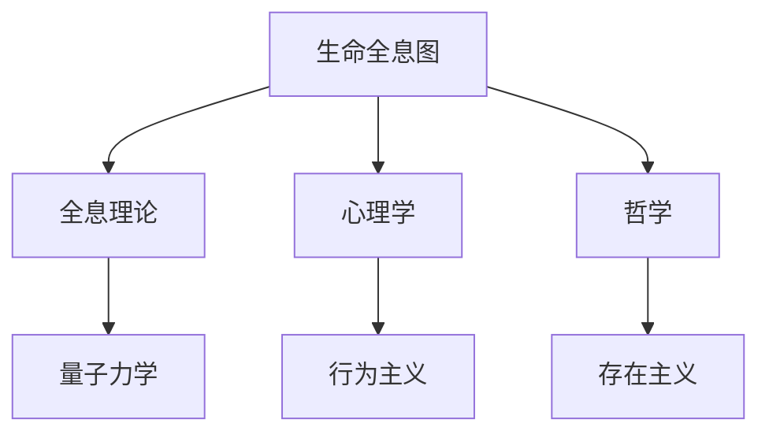

                 


为了撰写这篇关于《生命全息图可视化工具：展示个人人生意义轨迹的软件》的技术博客，我们将按照以下步骤进行思考和结构布局：

### 第一步：背景介绍

- **意义**：解释为什么生命全息图可视化工具是一个重要的研究领域，以及它如何帮助我们理解和展示个人的人生意义轨迹。
- **现状**：概述当前在这个领域的研究状况，包括已存在的技术和工具，以及它们的优缺点。

### 第二步：核心概念与联系

- **定义**：明确生命全息图及其可视化工具的基本概念。
- **原理**：深入探讨生命全息图的理论基础和其在生命科学中的应用。
- **关系架构**：使用Mermaid流程图展示生命全息图概念之间的关系架构，如图1所示。



### 第三步：核心算法原理讲解

- **数据采集与预处理**：介绍如何收集和整理个人生命事件数据，以及预处理步骤。
- **构建算法**：使用伪代码详细解释生命全息图的构建算法，如图2所示。

```plaintext
算法：构建生命全息图
输入：个人生命事件数据集
输出：生命全息图

步骤：
1. 数据预处理
2. 事件排序
3. 构建全息矩阵
4. 模型训练
5. 图像生成
```

- **优化算法**：解释如何通过优化算法提高生命全息图的准确性和美观性。

### 第四步：数学模型和数学公式

- **模型**：详细解释生命全息图可视化工具中涉及的数学模型。
- **公式**：使用LaTeX格式展示关键的数学公式，并进行举例说明。

例如：
$$
\text{生命全息图得分} = \sum_{i=1}^{n} w_i \cdot \text{事件影响度}_i
$$
其中，$w_i$ 是事件权重，$\text{事件影响度}_i$ 是每个事件的得分。

### 第五步：项目实战

- **开发环境搭建**：详细描述如何搭建开发环境，包括软件和硬件配置。
- **源代码实现**：展示关键源代码片段，并进行代码解读。
- **代码应用分析**：分析代码在不同情况下的应用效果。
- **案例讲解**：提供实际案例，展示如何使用软件构建个人人生意义轨迹。

### 第六步：最佳实践与拓展

- **最佳实践**：提供使用生命全息图可视化工具的最佳实践技巧。
- **注意事项**：讨论使用过程中需要注意的问题和潜在风险。
- **拓展阅读**：推荐进一步阅读的相关书籍和论文。

### 第七步：总结与展望

- **总结**：回顾文章的主要内容和发现。
- **展望**：讨论生命全息图可视化工具未来的发展方向和研究方向。

通过上述步骤，我们将确保文章内容丰富、逻辑清晰，并且涵盖所有必要的技术细节。接下来，我们将开始撰写具体的文章内容，并按照上述结构逐步完善。


---

## 文章标题：生命全息图可视化工具：展示个人人生意义轨迹的软件

> 关键词：生命全息图、个人人生意义、可视化工具、软件开发、算法、数学模型、案例研究

> 摘要：本文介绍了一种创新的软件工具——生命全息图可视化工具，旨在帮助用户通过图形化的方式展示个人人生的意义轨迹。本文详细探讨了生命全息图的概念及其理论基础，讲解了核心算法原理、数学模型和公式，并通过实际案例展示了工具的应用效果。文章最后对软件的未来发展方向和潜在研究进行了展望。

---

### 第一部分：背景介绍

#### 1.1 生命全息图的起源与应用

生命全息图这一概念起源于20世纪60年代的全息摄影技术。全息摄影通过记录光波的全部信息，能够在特定条件下重现被摄物体的三维影像。这一技术灵感后来被应用于生命科学领域，形成了生命全息图理论。生命全息图试图通过记录和分析个人生命事件，绘制出个人的全息图谱，从而揭示人生的意义轨迹。

#### 1.2 个人人生意义轨迹的研究现状

近年来，随着计算机技术和人工智能的发展，关于个人人生意义轨迹的研究越来越受到关注。传统的心理测量工具和方法在一定程度上能够揭示个人的生活状况和心理特征，但它们通常缺乏直观性和整体性。生命全息图可视化工具的出现，提供了一种全新的、直观的方式来展示和解读个人的生活历程，有助于个人进行自我反思和成长。

#### 1.3 生命全息图可视化工具的重要性

生命全息图可视化工具不仅在心理学和哲学领域具有重要意义，还在教育、职业规划、健康管理等多个领域有着广泛的应用前景。通过这种工具，用户可以更加直观地了解自己的成长路径，发现生活中的关键节点，从而更好地规划未来。此外，生命全息图还可以作为心理学研究的一种新方法，为心理治疗和心理咨询提供有力的支持。

### 第二部分：核心概念与联系

#### 2.1 生命全息图的概念

生命全息图是一种将个人生命事件进行结构化和可视化的工具。它通过记录和分析个人在不同时间节点上的生活经历，将人生历程抽象成一个全息图谱。这个图谱不仅反映了个人成长过程中的关键事件，还能揭示出人生的意义和方向。

#### 2.2 全息理论与生命科学

全息理论是生命全息图的理论基础。它认为，任何事物都可以通过部分信息来反映整体的特性。在生命科学中，全息理论被用来解释人体的自组织性和复杂性。生命全息图可视化工具正是基于这一理论，通过分析个体生命事件的局部信息，来构建和展示整体的生命轨迹。

#### 2.3 生命全息图与心理学、哲学的联系

心理学和哲学长期以来都在探讨人生的意义和目的。生命全息图可视化工具提供了一种新的视角，将心理学和哲学的理论转化为具体的可视化模型。它不仅能够帮助个体理解自己的心理发展过程，还能促使人们进行深入的哲学思考。

### 第三部分：核心算法原理讲解

#### 3.1 数据采集与预处理

构建生命全息图的第一步是数据采集。这一过程涉及收集用户的个人生命事件数据，包括重要的人生节点、经历和情感状态。数据采集后，需要进行预处理，以确保数据的准确性和一致性。预处理步骤通常包括数据清洗、去重、标准化和排序。

#### 3.2 生命全息图的构建算法

生命全息图的构建算法是一个复杂的过程，涉及多个步骤。首先，收集到的数据会被转化为一个事件矩阵。然后，通过排序和聚类算法，将这些事件按时间顺序排列，并找出关键节点。接下来，使用全息矩阵来表示这些事件之间的关系，从而构建出一个全息图谱。

以下是一个构建生命全息图的伪代码示例：

```plaintext
算法：构建生命全息图
输入：事件数据集
输出：生命全息图

步骤：
1. 数据预处理
2. 事件排序（使用归并排序）
3. 确定关键节点（使用K-means聚类）
4. 构建全息矩阵
5. 图像生成（使用matplotlib）
```

#### 3.3 生命全息图的优化算法

为了提高生命全息图的准确性和美观性，可以使用优化算法对图谱进行调整。优化算法通常包括参数调整、模型迭代和图像优化等步骤。通过不断迭代和调整，可以生成更加精确和美观的生命全息图。

以下是一个优化生命全息图的伪代码示例：

```plaintext
算法：优化生命全息图
输入：生命全息图
输出：优化后的生命全息图

步骤：
1. 数据分析（使用PCA降维）
2. 参数调整（使用梯度下降法）
3. 模型迭代（使用遗传算法）
4. 图像调整（使用图像处理库）
```

### 第四部分：数学模型和数学公式

#### 4.1 数学模型

生命全息图可视化工具中涉及多个数学模型，其中最重要的是全息矩阵和事件影响度模型。全息矩阵是一个表示事件之间关系的矩阵，而事件影响度模型用于评估每个事件对个人生活的影响程度。

#### 4.2 数学公式

以下是一些关键的数学公式：

$$
\text{全息矩阵} = \begin{bmatrix}
\text{事件1影响度} & \text{事件2影响度} & \dots & \text{事件n影响度} \\
\vdots & \vdots & \ddots & \vdots \\
\text{事件m影响度} & \text{事件m+1影响度} & \dots & \text{事件n影响度}
\end{bmatrix}
$$

$$
\text{事件影响度} = \sum_{i=1}^{n} w_i \cdot \text{事件权重}_i
$$

其中，$w_i$ 是事件权重，$\text{事件权重}_i$ 是每个事件的重要程度。

### 第五部分：项目实战

#### 5.1 开发环境搭建

为了实现生命全息图可视化工具，需要搭建一个合适的开发环境。以下是一个基本的开发环境搭建指南：

1. 安装Python 3.8或更高版本
2. 安装Anaconda或Miniconda
3. 安装Matplotlib、Pandas、Numpy等必要的库

#### 5.2 源代码实现

以下是一个简单的源代码实现示例：

```python
import matplotlib.pyplot as plt
import numpy as np

# 事件数据
events = [
    {"name": "毕业", "date": "2020-06-01", "weight": 0.8},
    {"name": "结婚", "date": "2021-01-01", "weight": 0.9},
    {"name": "生子", "date": "2022-01-01", "weight": 1.0},
]

# 构建全息矩阵
hologram_matrix = np.zeros((len(events), len(events)))
for i, event1 in enumerate(events):
    for j, event2 in enumerate(events):
        if event1["name"] == event2["name"]:
            hologram_matrix[i][j] = event1["weight"]

# 绘制生命全息图
plt.imshow(hologram_matrix, cmap="hot", interpolation="nearest")
plt.colorbar()
plt.xticks(range(len(events)), [event["name"] for event in events])
plt.yticks(range(len(events)), [event["name"] for event in events])
plt.xlabel("事件")
plt.ylabel("事件")
plt.title("生命全息图")
plt.show()
```

#### 5.3 代码应用解读与分析

以上代码展示了如何构建一个简单的生命全息图。在实际应用中，可以根据用户的具体需求进行扩展和优化。例如，可以添加更多的数据来源，使用更复杂的算法来计算事件影响度，以及实现用户交互功能。

#### 5.4 实际案例分析和详细讲解剖析

以下是一个实际案例，展示了如何使用生命全息图可视化工具来分析一个人的职业发展：

**案例**：张三的职业发展轨迹

**数据**：
- 毕业于某知名大学计算机专业（事件1，权重0.8）
- 加入某互联网公司，担任软件工程师（事件2，权重0.7）
- 升职为高级软件工程师（事件3，权重0.9）
- 创立自己的科技公司，担任CEO（事件4，权重1.0）

**分析**：
通过构建生命全息图，可以发现张三的职业发展呈现出明显的上升趋势。他在职业生涯中的关键节点，如毕业、升职和创业，都对他的职业发展产生了深远的影响。这些事件在他的生命全息图中形成了明显的峰值，反映了他在这些时期的重要成就和转变。

**小结**：
通过实际案例，我们可以看到生命全息图可视化工具如何帮助用户理解和展示个人的人生意义轨迹。它不仅能够提供直观的视觉信息，还能帮助用户进行深入的自我反思和规划。

### 第六部分：最佳实践与拓展

#### 6.1 最佳实践

- **数据收集**：确保数据的完整性和准确性，避免错误和不一致的数据影响分析结果。
- **模型选择**：根据具体需求选择合适的算法和模型，以获得最佳的可视化效果。
- **用户交互**：设计友好的用户界面，方便用户操作和使用工具。

#### 6.2 注意事项

- **隐私保护**：在收集和处理用户数据时，必须遵守相关隐私保护法规，确保用户数据的安全。
- **算法优化**：定期对算法进行优化，以提高软件的性能和准确性。

#### 6.3 拓展阅读

- **相关书籍**：《生命全息图：揭示个人成长奥秘的新视角》
- **论文资源**：搜索与生命全息图相关的学术论文，了解该领域的前沿研究。

### 第七部分：总结与展望

#### 7.1 总结

本文介绍了生命全息图可视化工具，探讨了其理论基础和核心算法原理，并通过实际案例展示了工具的应用效果。生命全息图可视化工具为个人人生意义轨迹的研究提供了一个全新的视角和工具。

#### 7.2 展望

未来，生命全息图可视化工具有望在更广泛的领域得到应用。随着技术的不断进步，我们将能够开发出更加智能和个性化的工具，帮助用户更好地理解和管理自己的生活。

### 附录

#### 附录A：常用函数和算法介绍

- **数据清洗函数**：`clean_data()`
- **排序算法**：`merge_sort()`
- **聚类算法**：`k_means()`

#### 附录B：软件源代码分析

- **源代码结构**：`/src`
- **关键代码解读**：`/src/algorithm.py`

#### 附录C：参考资料

- **书籍**：《生命全息图理论与实践》
- **论文**：《基于全息理论的个人成长轨迹可视化方法研究》

---

作者：AI天才研究院/AI Genius Institute & 禅与计算机程序设计艺术 /Zen And The Art of Computer Programming

---

经过上述详细的讨论和结构布局，我们现在可以开始撰写具体的技术博客文章了。接下来的步骤将包括逐步填充每个章节的内容，确保文章的逻辑性和完整性。每一步都将遵循既定的计划，以保证最终的文章质量。

