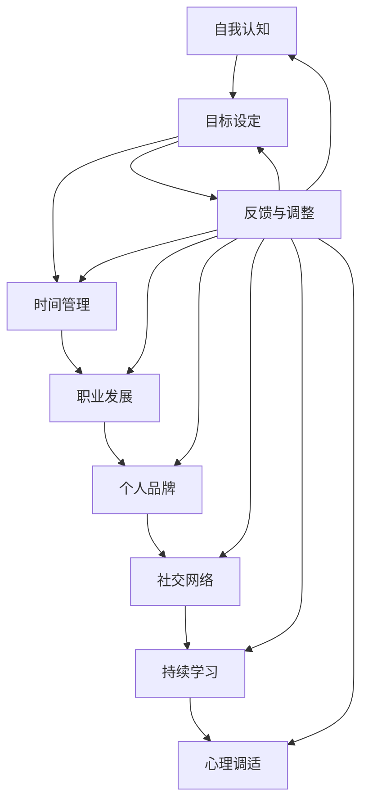

                 

### 引言

**生命历程设计工作室**，这是一个旨在帮助个人实现全面发展与成功的平台。随着社会和经济环境的不断变化，个人发展面临的挑战日益增多，如何有效规划生命历程，实现个人成长和成功成为了一个关键问题。在这个背景下，**生命历程设计工作室**应运而生，致力于为读者提供一套系统的、可操作的个人发展战略规划。

**生命历程设计**是一种系统性、长期性的个人发展方法，它关注个人从出生到死亡的全过程，通过分析、规划和执行，帮助个体在人生的不同阶段实现既定目标，提升生活质量。这一概念不仅涵盖了职业发展，还包括身心健康、家庭生活、社交关系等多个方面。

本书的目标是帮助读者全面理解生命历程设计的基本原理和实践方法，通过系统的学习和实践，提升个人的发展能力，实现人生目标。本书主要面向希望规划个人发展路径、实现个人成长和成功的读者，无论你是职场新人、职场老手，还是正在追求更高成就的精英，本书都将为你提供有价值的指导。

在接下来的章节中，我们将逐一探讨生命历程设计的关键要素，从自我认知与评估、目标设定与时间管理，到职业发展策略、个人品牌建设，再到社交网络与人际关系、持续学习与自我提升，以及跨越挑战与克服障碍，每个章节都将为你的个人发展之路提供实用的策略和方法。让我们一步一步地思考，深入剖析每一个关键点，为你的生命历程设计奠定坚实的基础。

### 关键词

- 生命历程设计
- 个人发展
- 自我认知
- 目标设定
- 职业发展
- 个人品牌
- 社交网络
- 持续学习
- 挑战与克服

### 摘要

本书《生命历程设计工作室：个人发展的战略规划》旨在为个人提供一套系统、可操作的发展策略，帮助他们在复杂多变的社会环境中实现成长与成功。通过深入探讨生命历程设计的概念与原理，本书将引导读者进行自我认知与评估，设定明确的目标并合理管理时间，制定职业发展策略，构建个人品牌，维护社交网络与人际关系，持续学习与自我提升，以及应对挑战和克服障碍。本书不仅提供了理论指导，还结合了实际案例和最佳实践，为读者提供了全方位的支持，帮助他们实现个人发展目标。

### 第2章 生命历程设计的概念与原理

**生命历程设计（Life Course Design）**是一种全面的、战略性的规划方法，旨在帮助个人在一生中实现自我成长、职业发展和生活质量的提升。这一概念起源于社会学领域，后来逐渐被广泛应用于个人发展和管理领域。生命历程设计不仅仅关注职业成功，还涵盖身心健康、家庭生活、社交关系等多个方面，其核心目标是帮助个体实现全面、平衡和持续的发展。

#### 2.1 生命历程设计的定义

生命历程设计可以被定义为一种通过系统规划、自我反思和持续调整，旨在实现个人目标、提升生活质量和实现自我价值的全过程。它是一个动态的、长期的过程，涉及多个阶段的生涯发展和生活变化，包括但不限于职业发展、家庭建设、身心健康、社交网络等各个方面。

#### 2.2 生命历程设计的基本原则

生命历程设计遵循以下基本原则：

1. **整体性原则**：将个人的生活各个方面视为一个整体，通过系统的规划和协调，实现全面发展。
2. **目标导向原则**：以明确的目标为导向，设定短期和长期目标，并通过具体行动计划实现这些目标。
3. **动态调整原则**：个人发展是一个不断变化的过程，需要根据实际情况和环境变化进行动态调整和优化。
4. **可持续性原则**：关注长期发展，不仅追求短期成功，还要确保长期的可持续性和平衡性。

#### 2.3 生命历程设计的关键要素

生命历程设计包含以下几个关键要素：

1. **自我认知**：了解自己的兴趣、能力、价值观和优势，是进行有效生命历程设计的基础。
2. **目标设定**：设定明确、具体、可衡量的目标，是生命历程设计的核心。
3. **时间管理**：合理安排时间，确保目标的实现，是生命历程设计的重要保障。
4. **职业发展**：规划职业路径，提升职业技能和竞争力，是实现个人价值的重要途径。
5. **个人品牌**：建立和维护个人品牌，提升个人在社交网络中的影响力。
6. **社交网络**：建立和维护广泛的社会关系，获取更多的资源和机会。
7. **持续学习**：不断学习新知识、新技能，以适应快速变化的环境。
8. **心理调适**：保持良好的心理状态，应对生活和工作中的各种挑战。

#### 2.4 Mermaid流程图：生命历程设计的核心概念与联系

为了更直观地理解生命历程设计的核心概念与联系，我们可以使用Mermaid流程图来展示这些要素之间的关系。



在上面的流程图中，每个节点代表生命历程设计的一个关键要素，箭头表示这些要素之间的相互关系和动态调整。例如，自我认知和目标设定是生命历程设计的基础，它们共同影响着时间管理、职业发展、个人品牌、社交网络、持续学习和心理调适。而通过持续的反馈和调整，这些要素相互影响，形成一个动态的、闭环的循环系统。

通过上述内容，我们可以看到，生命历程设计不仅仅是一种理论，而是一种实实在在的可操作方法。它帮助个人在复杂多变的环境中找到自己的定位，实现自我价值，提升生活质量。在接下来的章节中，我们将进一步探讨生命历程设计的具体应用和实践方法，帮助读者将这一理念应用到个人生活中。

### 第3章 自我认知与评估

自我认知是生命历程设计的基础，它关乎个体对自身兴趣、能力、价值观和优劣势的深入理解。只有通过全面的自我认知，个体才能明确自己的发展方向，设定合理的目标，并制定相应的行动计划。在这一章中，我们将探讨自我认知的重要性、自我评估的方法与工具，以及自我认知中常见的误区和挑战。

#### 3.1 自我认知的重要性

自我认知在个人发展过程中具有至关重要的地位。首先，它帮助我们识别自己的优势和劣势，从而在职业选择和生活中做出更明智的决策。其次，自我认知有助于我们设定符合自己实际能力和兴趣的目标，避免盲目跟风或设定不切实际的目标。此外，自我认知还可以帮助我们建立自信心，更好地应对生活中的各种挑战和压力。

#### 3.2 自我评估的方法与工具

进行有效的自我评估是提升自我认知的重要步骤。以下是一些常用的自我评估方法和工具：

1. **SWOT分析**：SWOT分析是一种常用的战略规划工具，它包括四个方面：优势（Strengths）、劣势（Weaknesses）、机会（Opportunities）和威胁（Threats）。通过这种分析方法，个体可以全面了解自己的内外部环境，从而制定更有效的个人发展计划。

2. **行为观察法**：行为观察法是一种通过观察自己在不同情境下的行为和表现来了解自己的方法。这种方法可以帮助个体识别自己的行为模式，找出需要改进的地方。

3. **问卷调查**：通过设计合理的问卷，个体可以从不同角度了解自己的兴趣、价值观和偏好。这种方法可以收集大量的数据，帮助个体进行更深入的自我认知。

4. **心理测试**：心理测试是一种科学的方法，通过测试个体的性格、能力和价值观，帮助个体了解自己的内在特质和优势。常见的心理测试包括MBTI、DISC等。

5. **导师和同行反馈**：通过向导师和同行寻求反馈，个体可以了解自己在他人眼中的形象和表现，从而获得更客观的自我认知。

#### 3.3 自我认知的误区与挑战

在自我认知的过程中，个体可能会陷入一些误区，面临各种挑战。以下是一些常见的误区和挑战：

1. **过度自信或自卑**：有些人可能对自己过于自信，忽视了自己的不足；而有些人则可能过于自卑，低估了自己的能力。这两种情况都会导致个人发展受阻。

2. **片面认知**：个体可能会只看到自己的优势和兴趣，而忽视了自己的劣势和需要改进的领域。这种片面认知会限制个人的发展空间。

3. **缺乏系统性**：自我认知是一个需要持续进行的过程，但有些人可能只是偶尔进行自我反思，缺乏系统性和持续性。这种情况下，个体很难全面了解自己，制定出有效的个人发展计划。

4. **环境依赖**：有些人可能过于依赖外部评价和反馈，忽视了自己的内心感受和真实想法。这种环境依赖会使个体失去自我认知的主观性和独立性。

5. **情绪干扰**：情绪可能会对自我认知产生干扰，使个体难以理性地看待自己。例如，在遭遇挫折时，个体可能会过度否定自己，影响自我认知的准确性。

#### 3.4 伪代码：自我评估算法的详细阐述

为了更具体地展示自我评估的过程，我们可以设计一个伪代码算法。这个算法将结合不同的评估方法和工具，对个体的自我认知进行量化分析。

```python
# 自我评估伪代码

# 输入：个人基本信息（年龄、性别、教育背景等）
# 输入：SWOT分析结果（优势、劣势、机会、威胁）
# 输入：行为观察记录
# 输入：问卷调查结果
# 输入：心理测试结果
# 输入：导师和同行反馈

# 输出：综合自我评估报告

def self_evaluation(input_data):
    # 初始化变量
    strengths = []
    weaknesses = []
    opportunities = []
    threats = []
    
    # 进行SWOT分析
    strengths = input_data['SWOT']['strengths']
    weaknesses = input_data['SWOT']['weaknesses']
    opportunities = input_data['SWOT']['opportunities']
    threats = input_data['SWOT']['threats']
    
    # 行为观察分析
    behavior_patterns = analyze_behavior(input_data['behavior_observations'])
    
    # 问卷调查分析
    survey_results = analyze_survey(input_data['survey_results'])
    
    # 心理测试分析
    psychological_tests = analyze_psychological_tests(input_data['psychological_tests'])
    
    # 导师和同行反馈分析
    feedback = analyze_feedback(input_data['feedback'])
    
    # 综合评估
    self_assessment_report = {
        'strengths': strengths,
        'weaknesses': weaknesses,
        'opportunities': opportunities,
        'threats': threats,
        'behavior_patterns': behavior_patterns,
        'survey_results': survey_results,
        'psychological_tests': psychological_tests,
        'feedback': feedback
    }
    
    return self_assessment_report

# 辅助函数定义
def analyze_behavior(behavior_patterns):
    # 分析行为模式，识别优势与劣势
    # 返回分析结果
    pass

def analyze_survey(survey_results):
    # 分析问卷调查结果，识别兴趣、价值观等
    # 返回分析结果
    pass

def analyze_psychological_tests(psychological_tests):
    # 分析心理测试结果，识别性格、能力等
    # 返回分析结果
    pass

def analyze_feedback(feedback):
    # 分析导师和同行反馈，识别外部评价
    # 返回分析结果
    pass
```

通过上述伪代码，我们可以看到自我评估的过程涉及多个方面，包括SWOT分析、行为观察、问卷调查、心理测试和反馈分析。这些方法相互结合，形成一个全面的评估体系，帮助个体更准确地了解自己。

通过本章的讨论，我们可以看到自我认知在生命历程设计中的重要性。只有通过全面的自我认知和评估，个体才能找到自己的发展方向，设定合理的目标，并制定出切实可行的行动计划。在接下来的章节中，我们将继续探讨目标设定与时间管理、职业发展策略等关键主题，帮助读者实现个人发展的目标。

### 第4章 目标设定与时间管理

目标设定与时间管理是生命历程设计中的核心环节，它们直接关系到个人能否有效地实现既定目标，提升生活质量。在这一章中，我们将探讨目标设定的原则与方法，详细阐述时间管理的重要性，以及具体的时间管理策略与实践。

#### 4.1 目标设定的原则与方法

目标设定是生命历程设计中的关键步骤，一个明确、具体、可衡量的目标是实现个人发展的基础。以下是目标设定的基本原则与方法：

1. **SMART原则**：SMART原则是一种常用的目标设定方法，它要求目标具有以下五个特点：具体（Specific）、明确（Measurable）、可实现（Achievable）、相关（Relevant）和有时限（Time-bound）。例如，一个具体的目标可以是“在未来6个月内，提升我的编程技能，通过某个专业认证考试”。

2. **优先级排序**：在设定目标时，需要根据目标的紧急性和重要性进行优先级排序。可以采用**埃森豪威尔矩阵**（Eisenhower Matrix）进行分类，将任务分为四个象限：紧急且重要、紧急但不重要、不紧急但重要、不紧急且不重要。优先处理紧急且重要的任务，以实现最大的效果。

3. **目标分解**：大目标往往需要通过多个小目标的实现来实现。因此，目标分解是目标设定中的重要步骤。例如，如果你设定了一个目标“在未来三年内，晋升为部门经理”，那么可以将它分解为多个小目标，如“第一年提升我的项目管理能力”、“第二年提升我的团队领导力”等。

4. **定期评估与调整**：目标设定不是一次性的过程，而是一个持续循环的过程。需要定期对目标进行评估，检查是否达到预期效果，并根据实际情况进行调整。这有助于保持目标的灵活性和适应性。

#### 4.2 时间管理的重要性

时间管理是目标设定的延伸，是实现目标的重要保障。有效的时间管理不仅能够提高工作效率，还能提升生活质量，使个人有更多时间和精力去追求自己的目标。以下是时间管理的重要性：

1. **提高工作效率**：通过合理规划时间，可以避免工作中的拖延和混乱，提高工作效率，更快地实现目标。

2. **平衡工作与生活**：有效的时间管理可以帮助个人在工作与生活之间找到平衡，避免过度工作，保持身心健康。

3. **减少焦虑和压力**：合理的时间规划能够减少因时间不足而产生的焦虑和压力，提高生活质量。

4. **实现个人目标**：通过有效的时间管理，个人可以有更多的时间和精力去实现自己的目标，提升个人成就感。

#### 4.3 时间管理的策略与实践

以下是一些具体的时间管理策略与实践方法：

1. **优先级排序**：如前所述，采用埃森豪威尔矩阵对任务进行分类和排序，优先处理紧急且重要的任务。

2. **任务分解**：将大任务分解为小任务，每个小任务都有明确的时间节点和目标，有助于提高工作效率。

3. **每日计划**：每天开始时，列出当天的任务清单，并为其设定优先级。按照计划执行，避免随意更改计划。

4. **时间块管理**：将一天的时间分成几个固定的时间块，每个时间块专注于一项任务。这种方法有助于提高专注力和效率。

5. **避免拖延**：识别自己的拖延习惯，制定应对策略，如设置定时提醒、分阶段完成任务等。

6. **使用工具**：使用时间管理工具，如日历、时间追踪器、待办事项列表等，有助于更有效地规划和管理时间。

7. **休息与放松**：合理安排休息和放松时间，避免过度工作，保持身心健康。

#### 4.4 数学模型：目标实现的时间规划与资源分配

为了更科学地实现目标，我们可以使用数学模型来规划时间和资源分配。以下是一个简单的时间规划与资源分配模型：

假设：
- T为总时间
- N为目标数量
- R为资源总量
- t_i为完成第i个目标的所需时间
- r_i为完成第i个目标所需的资源量

目标：在总时间T和资源总量R的约束下，最大化目标完成率。

数学模型：

1. 确定目标优先级：采用埃森豪威尔矩阵对目标进行优先级排序。

2. 时间分配：计算每个目标的所需时间，并根据优先级进行时间分配。

   $$ t_{total} = \sum_{i=1}^{N} t_i \times priority_i $$

3. 资源分配：计算每个目标的资源需求，并根据优先级进行资源分配。

   $$ r_{total} = \sum_{i=1}^{N} r_i \times priority_i $$

4. 检查约束条件：确保总时间和总资源不超过约束。

   $$ T \ge t_{total} $$
   $$ R \ge r_{total} $$

5. 动态调整：根据实际情况，实时调整目标和时间、资源的分配。

通过上述数学模型，我们可以更科学地规划时间和资源，确保目标的有效实现。

通过本章的讨论，我们可以看到目标设定与时间管理在生命历程设计中的重要性。通过合理的目标设定和有效的时间管理，个人可以更好地实现自己的目标，提升生活质量。在接下来的章节中，我们将继续探讨职业发展策略、个人品牌建设等关键主题，帮助读者实现全面的发展。

### 第5章 职业发展策略

职业发展是生命历程设计中的重要一环，它不仅关系到个人的经济收入和生活质量，还直接影响个人的自我实现和成就感。在这一章中，我们将深入探讨职业发展的核心要素、职业发展的路径与选择，以及职业发展过程中可能面临的挑战与应对策略。

#### 5.1 职业发展的核心要素

职业发展的核心要素主要包括以下几个方面：

1. **职业技能**：职业技能是指个人在特定领域内所具备的专业知识和技能。职业技能的提升是职业发展的基础，可以通过学习、培训和实践来实现。

2. **职业素养**：职业素养是指个人在职业生涯中所展现的职业态度、职业行为和职业习惯。良好的职业素养包括责任心、团队合作、沟通能力和领导力等，这些素养对于职业发展至关重要。

3. **人脉网络**：人脉网络是职业发展的重要资源。通过建立和维护广泛的人脉关系，个人可以获取更多的职业机会、信息支持和资源支持。

4. **职业规划**：职业规划是指个人根据自己的兴趣、能力和职业目标，制定长期和短期的职业发展计划。科学的职业规划有助于个人明确发展方向，实现职业目标。

5. **自我认知**：自我认知是职业发展的基础，通过深入了解自己的兴趣、能力和价值观，个人可以更好地选择适合自己的职业路径。

#### 5.2 职业发展的路径与选择

职业发展的路径和选择因人而异，取决于个人的兴趣、能力和职业目标。以下是一些常见的职业发展路径和选择：

1. **专业化路径**：专业化路径是指个人在某个特定领域内不断深入学习和实践，成为该领域的专家。这种路径适合对某个领域有深厚兴趣和热情的人。

2. **多元化路径**：多元化路径是指个人在不同领域进行探索和尝试，不断拓宽职业视野和技能。这种路径适合喜欢新鲜事物、追求多样化发展的人。

3. **管理路径**：管理路径是指个人通过提升管理能力和领导力，逐步晋升到管理层，担任更高级别的职务。这种路径适合有较强沟通能力、协调能力和决策能力的人。

4. **创业路径**：创业路径是指个人自己创立公司或加入创业团队，通过创新和创造来实现职业目标。这种路径适合有创业精神、敢于冒险的人。

5. **转型路径**：转型路径是指个人在职业生涯中，根据市场需求和个人兴趣，进行职业方向的调整。这种路径适合对当前职业不满意或希望寻求新的发展机会的人。

#### 5.3 职业发展的挑战与应对策略

职业发展过程中，个人可能会面临各种挑战。以下是一些常见的挑战及应对策略：

1. **竞争压力**：随着职场竞争的加剧，个人可能会感受到巨大的竞争压力。应对策略是提升自己的职业技能和职业素养，增强自己的竞争力。

2. **职业瓶颈**：在职业发展的过程中，个人可能会遇到职业瓶颈，感觉自己无法再进一步提升。应对策略是进行职业转型，寻找新的发展机会。

3. **工作与生活的平衡**：随着工作压力的增加，个人可能会感到工作与生活难以平衡。应对策略是合理安排时间，确保工作与生活的平衡。

4. **职业倦怠**：长期的工作压力和重复性的工作内容可能会导致职业倦怠。应对策略是寻找新的工作动力，如参加培训、调换工作岗位等。

5. **技术创新**：随着技术的快速更新换代，个人可能会感到自己的技能和知识不够用。应对策略是持续学习和更新自己的知识和技能。

#### 5.4 伪代码：职业发展策略的制定与调整

为了更系统地制定和调整职业发展策略，我们可以设计一个伪代码算法。以下是一个简化的职业发展策略制定与调整算法：

```python
# 职业发展策略制定与调整伪代码

# 输入：个人兴趣、能力、职业目标
# 输入：市场环境、行业趋势
# 输出：职业发展策略

def career_development_strategy(personal_interests, personal_abilities, career_objectives, market_environment, industry_trends):
    # 分析个人兴趣和能力
    interest_and_ability_analysis = analyze_interest_and_ability(personal_interests, personal_abilities)
    
    # 分析市场环境和行业趋势
    market_and_trend_analysis = analyze_market_and_trend(market_environment, industry_trends)
    
    # 根据分析结果制定职业发展策略
    strategy = {
        'interest_based_path': determine_interest_based_path(interest_and_ability_analysis),
        'market_based_path': determine_market_based_path(market_and_trend_analysis),
        'skills_development': determine_skills_development_plan(),
        'network_building': determine_network_building_strategy(),
        'career_objectives': set_career_objectives(career_objectives),
        'adjustment_plan': create_adjustment_plan()
    }
    
    return strategy

# 辅助函数定义
def analyze_interest_and_ability(personal_interests, personal_abilities):
    # 分析个人兴趣和能力，返回分析结果
    pass

def analyze_market_and_trend(market_environment, industry_trends):
    # 分析市场环境和行业趋势，返回分析结果
    pass

def determine_interest_based_path(interest_and_ability_analysis):
    # 根据个人兴趣和能力确定职业发展路径
    pass

def determine_market_based_path(market_and_trend_analysis):
    # 根据市场环境和行业趋势确定职业发展路径
    pass

def determine_skills_development_plan():
    # 制定技能发展计划
    pass

def determine_network_building_strategy():
    # 制定人脉建设策略
    pass

def set_career_objectives(career_objectives):
    # 设定职业目标
    pass

def create_adjustment_plan():
    # 制定调整计划
    pass
```

通过上述伪代码，我们可以看到职业发展策略的制定和调整是一个系统性、动态化的过程。它需要综合考虑个人的兴趣和能力、市场环境和行业趋势，制定具体的职业发展路径和计划，并根据实际情况进行动态调整。

通过本章的讨论，我们可以看到职业发展策略在个人生命历程设计中的重要性。通过科学的职业发展策略，个人可以更好地应对职业挑战，实现职业目标，提升生活质量。在接下来的章节中，我们将继续探讨个人品牌建设、社交网络与人际关系等关键主题，帮助读者实现全面的发展。

### 第6章 个人品牌建设

个人品牌建设是生命历程设计中的一个重要方面，它不仅关系到个人的职业发展和社会认可，还直接影响个人的社会影响力和个人价值。在这一章中，我们将探讨个人品牌的概念与价值，个人品牌的构建方法，以及个人品牌的影响力评估。

#### 6.1 个人品牌的概念与价值

**个人品牌**是指个人在公众心目中的形象、声誉和价值。它不仅仅是名字和形象，更是一个人专业能力、价值观、态度和个性的综合体现。个人品牌的价值体现在以下几个方面：

1. **职业优势**：一个强大的个人品牌能够提高个人的职业竞争力，使个人在求职或职场中脱颖而出。

2. **社会认可**：良好的个人品牌能够增强个人在社会中的认可度，提高社交价值和影响力。

3. **机会拓展**：强大的个人品牌能够为个人带来更多的职业机会和资源，包括项目合作、业务拓展等。

4. **个人价值提升**：个人品牌的建立可以提升个人的自我认同感和成就感，增强个人自信心。

#### 6.2 个人品牌的构建方法

构建个人品牌需要系统的策略和持续的努力。以下是一些关键步骤和方法：

1. **明确个人定位**：确定自己的专业领域、特长和优势，明确个人品牌的核心价值。这可以通过自我评估、市场调研和行业分析来实现。

2. **塑造专业形象**：通过个人形象、沟通方式、行为举止等方面来塑造专业形象。这包括穿着打扮、言谈举止、社交媒体形象等。

3. **内容创作与传播**：创建有价值的内容，如专业文章、博客、视频等，并通过各种渠道进行传播，如社交媒体、专业论坛、行业会议等。高质量的内容是个人品牌的基石。

4. **建立人脉网络**：通过积极参与行业活动、建立和维护人脉关系，扩大个人品牌的影响力。人脉网络是个人品牌的重要支撑。

5. **持续学习与成长**：不断学习新知识、新技能，提升个人专业能力，以保持个人品牌的活力和竞争力。

#### 6.3 个人品牌的影响力评估

评估个人品牌的影响力是了解个人品牌效果的重要步骤。以下是一些常用的评估方法和指标：

1. **社交媒体指标**：通过社交媒体平台的数据指标来评估个人品牌的影响力，如关注者数量、点赞数、分享次数、评论数等。

2. **行业认可度**：通过行业内的认可度来评估个人品牌的影响力，如是否受邀参加行业会议、是否被专业媒体报道、是否获得行业奖项等。

3. **职业成就**：通过个人的职业成就来评估个人品牌的影响力，如晋升速度、项目成功率、业务拓展等。

4. **反馈与口碑**：通过他人对个人品牌的反馈和口碑来评估其影响力，如同事、客户、行业专家的评价等。

5. **经济收益**：通过个人品牌带来的直接经济收益，如收入增长、项目合作机会等来评估个人品牌的影响力。

#### 6.4 社交网络与个人品牌的关系

社交网络是个人品牌建设的重要平台，通过社交网络，个人可以扩大影响力，提升品牌价值。以下是一些关键点：

1. **内容共享**：通过社交网络分享有价值的内容，如专业文章、项目经验、行业动态等，可以吸引更多的关注者和粉丝。

2. **互动与交流**：积极参与社交网络的互动和交流，如回复评论、参与讨论、提供专业建议等，可以增强与粉丝和同行的联系。

3. **品牌传播**：通过社交网络，个人品牌可以迅速传播，扩大影响力。合理利用社交广告和推广工具，可以更高效地传播个人品牌。

4. **人脉拓展**：社交网络为个人提供了广阔的人脉资源，通过建立和维护人脉关系，可以获取更多的职业机会和资源支持。

通过本章的讨论，我们可以看到个人品牌建设在生命历程设计中的重要性。通过科学的构建方法和有效的策略，个人可以提升自己的品牌影响力，实现职业和社会价值的提升。在接下来的章节中，我们将继续探讨社交网络与人际关系、持续学习与自我提升等关键主题，帮助读者实现全面的发展。

### 第7章 社交网络与人际关系

社交网络与人际关系在生命历程设计中扮演着至关重要的角色。有效的社交网络不仅能帮助个人获取职业机会、资源和支持，还能提升个人的社会影响力和生活质量。在这一章中，我们将探讨社交网络的重要性、社交网络的构建与维护策略，以及人际关系的管理技巧。

#### 7.1 社交网络的重要性

社交网络是指个人之间的社会联系和关系网络。它在个人发展和职业成功中发挥着重要作用：

1. **职业机会**：通过社交网络，个人可以更容易地发现和获取职业机会。朋友、同事、行业专家等社交网络中的成员可能会推荐工作机会或项目合作。

2. **资源支持**：社交网络提供了丰富的资源支持，包括信息、技术、资金等。通过社交网络，个人可以获取到更多的行业动态、技术更新和商业机会。

3. **社会影响力**：有效的社交网络可以增强个人的社会影响力，提升个人在行业内的声誉和认可度。

4. **情感支持**：在人生的不同阶段，社交网络为个人提供了情感支持，帮助个人应对生活中的压力和挑战。

#### 7.2 社交网络的构建与维护策略

构建和维护一个有效的社交网络需要系统的策略和持续的努力。以下是一些关键策略：

1. **确定目标与定位**：明确自己的社交目标，如职业发展、人脉拓展、行业影响力等。根据目标确定自己的社交定位，选择合适的社交平台和活动。

2. **积极参与**：积极参与各种社交活动和行业会议，扩大自己的社交圈子。通过参与讨论、分享经验、提供帮助等方式，增加与他人的互动。

3. **建立深度关系**：在广泛社交的基础上，重点维护和深化与重要人际关系的关系。定期与关键联系人保持联系，分享行业动态和个人经验。

4. **利用社交媒体**：合理利用社交媒体平台，如LinkedIn、Twitter、Facebook等，建立和维护社交网络。通过发布专业内容、参与讨论、关注行业领袖等方式，提升个人在社交网络中的影响力。

5. **交换资源与信息**：在社交网络中，资源与信息的交换是非常重要的。通过分享自己的知识和资源，获取他人的支持和帮助。

#### 7.3 人际关系的策略与实践

有效的人际关系管理对于个人发展和职业成功至关重要。以下是一些关键策略：

1. **建立信任**：信任是人际关系的基础。通过诚实、可靠和负责任的行为，建立和维护信任关系。

2. **倾听与沟通**：倾听他人的需求和意见，通过有效的沟通表达自己的观点。倾听和沟通有助于理解他人，建立良好的人际关系。

3. **主动帮助**：在他人需要帮助时，主动伸出援手。通过提供帮助，可以加深与他人的联系，建立更强的社交网络。

4. **保持联系**：定期与重要联系人保持联系，如发送节日问候、分享行业动态、提供有价值的信息等。保持联系有助于维持和深化人际关系。

5. **适应不同场合**：在不同的社交场合，如正式会议、非正式聚会等，采取不同的沟通方式和行为策略，以适应不同的社交环境。

#### 7.4 数学公式：社交网络的数学模型与影响力分析

为了更科学地分析社交网络的影响力和结构，我们可以使用一些数学模型和公式。以下是一些常用的社交网络数学模型：

1. **度数中心性**：度数中心性（Degree Centrality）是衡量节点在社交网络中重要性的指标。一个节点的度数中心性越高，表示它在网络中的连接数越多，影响力越大。

   $$ C_d(i) = \frac{d(i)}{N-1} $$

   其中，\( C_d(i) \) 是节点 \( i \) 的度数中心性，\( d(i) \) 是节点 \( i \) 的连接数，\( N \) 是网络中的节点总数。

2. **中间中心性**：中间中心性（Betweenness Centrality）是衡量节点在社交网络中信息传递重要性的指标。一个节点的中间中心性越高，表示它在网络中作为信息传递路径的概率越大。

   $$ C_b(i) = \frac{\sum_{s \neq i, t \neq i} \frac{ shortest\_path(s, t) \land shortest\_path(s, t) \包含i }{shortest\_path(s, t)}}{N \times (N-2)} $$

   其中，\( C_b(i) \) 是节点 \( i \) 的中间中心性。

3. **接近中心性**：接近中心性（Closeness Centrality）是衡量节点在社交网络中接近其他节点的能力的指标。一个节点的接近中心性越高，表示它与其他节点的平均距离越短。

   $$ C_c(i) = \frac{N-1}{\sum_{j \neq i} \text{ shortest\_path}(i, j)} $$

   其中，\( C_c(i) \) 是节点 \( i \) 的接近中心性，\( N \) 是网络中的节点总数，\( \text{shortest\_path}(i, j) \) 是节点 \( i \) 和节点 \( j \) 之间的最短路径长度。

通过这些数学模型和公式，我们可以定量分析社交网络的结构和节点的相对重要性，为个人品牌建设和职业发展提供科学依据。

通过本章的讨论，我们可以看到社交网络与人际关系在生命历程设计中的重要性。通过有效的社交网络构建和人际关系管理，个人可以提升自己的职业竞争力和社会影响力，实现全面发展。在接下来的章节中，我们将继续探讨持续学习与自我提升、跨越挑战与克服障碍等关键主题，帮助读者实现个人发展目标。

### 第8章 持续学习与自我提升

在快速变化的时代，持续学习和自我提升是个人发展的必要条件。通过不断学习新知识和技能，个人可以保持竞争力，适应不断变化的环境，实现自我价值的提升。在这一章中，我们将探讨持续学习的重要性、自我提升的方法与途径，以及学习中常见的误区和挑战。

#### 8.1 持续学习的重要性

持续学习在个人发展中的重要性体现在以下几个方面：

1. **保持竞争力**：随着科技的快速发展，新技术、新知识层出不穷。只有不断学习，个人才能跟上时代的步伐，保持自己的竞争力。

2. **适应变化**：社会和经济环境在不断变化，个人需要具备快速适应和灵活应对变化的能力。持续学习可以帮助个人不断提升自己的适应能力。

3. **提升自我价值**：通过学习，个人可以不断丰富自己的知识体系，提升自己的专业能力和综合素质，从而提高个人在职场和社会中的价值。

4. **实现职业发展**：持续学习是职业发展的基石。只有通过不断学习和积累，个人才能在职业道路上不断前进，实现职业目标。

#### 8.2 自我提升的方法与途径

自我提升是一个长期且系统的过程，以下是一些有效的方法和途径：

1. **正规教育**：通过大学、研究生院等正规教育途径，获取系统的知识和技能。正规教育可以帮助个人建立扎实的理论基础，提升专业素养。

2. **在线学习**：利用在线教育资源，如MOOC（大规模开放在线课程）、网络研讨会等，进行灵活的学习。在线学习可以节省时间和成本，满足个性化学习需求。

3. **实践锻炼**：通过实际项目、实习、工作等实践机会，将理论知识应用到实际中，提升实践能力和解决问题的能力。

4. **阅读与研究**：广泛阅读相关书籍、研究论文和行业报告，获取前沿知识和见解。研究可以帮助个人深入理解某个领域，提升专业水平。

5. **交流与分享**：通过参加行业会议、研讨会、讲座等，与同行交流经验和见解。交流与分享可以拓展视野，获取新的思维和灵感。

6. **导师指导**：寻找导师进行指导，通过导师的经验和知识，快速提升自己的能力。导师可以帮助个人明确发展方向，提供职业规划建议。

7. **自我反思**：定期进行自我反思，总结学习经验，找出自己的不足和改进之处。自我反思有助于个人不断进步，实现自我提升。

#### 8.3 学习的误区与挑战

在学习的过程中，个人可能会遇到一些误区和挑战，以下是一些常见的误区和挑战：

1. **浅尝辄止**：有些人在学习过程中容易满足于表面的知识，没有深入理解和掌握。这种浅尝辄止的学习方式无法真正提升个人能力。

2. **拖延症**：拖延症是学习过程中常见的问题。有些人在面对学习任务时容易拖延，导致学习效率低下。

3. **缺乏计划**：有些人在学习过程中缺乏明确的计划和目标，导致学习没有方向和重点。

4. **过度依赖网络资源**：虽然网络资源丰富，但有些人在学习过程中过于依赖网络，缺乏深度思考和独立研究的能力。

5. **缺乏实践**：理论知识和实践能力是相辅相成的。有些人在学习过程中过于注重理论，缺乏实践锻炼，导致知识和技能无法有效应用。

6. **心理压力**：学习过程中可能会遇到困难和挑战，导致心理压力增大。适度的压力可以激发学习动力，但过度的压力会影响学习效果和身心健康。

#### 8.4 LaTeX格式：学习策略的数学模型与公式

为了更系统地描述学习策略，我们可以使用LaTeX格式来展示一些数学模型和公式。以下是一个简单的学习策略的数学模型：

```latex
\documentclass{article}
\usepackage{amsmath}
\begin{document}

\section{学习策略的数学模型}

\subsection{学习效率模型}

假设学习效率与学习时间、学习内容和学习者能力相关，可以用以下数学模型表示：

\[ E = f(t, C, A) \]

其中，\( E \) 表示学习效率，\( t \) 表示学习时间，\( C \) 表示学习内容，\( A \) 表示学习者能力。

\subsection{学习效果模型}

学习效果可以看作是学习效率和学习投入的乘积：

\[ E_f = E \times I \]

其中，\( E_f \) 表示学习效果，\( I \) 表示学习投入。

\subsection{学习计划模型}

为了提高学习效率，可以制定以下学习计划模型：

\[ P = \left\{
\begin{array}{ll}
\text{学习内容分配} & \\
\text{学习时间规划} & \\
\text{学习目标设定} & \\
\end{array}
\right.
\]

\end{document}
```

在这个模型中，学习内容分配、学习时间规划和学习目标设定是提高学习效率的关键因素。通过合理分配学习内容、规划学习时间和设定明确的学习目标，个人可以更有效地提升自己的学习效果。

通过本章的讨论，我们可以看到持续学习和自我提升在个人发展中的重要性。通过科学的学习策略和持续的努力，个人可以不断提升自己的能力，实现自我价值的提升。在接下来的章节中，我们将继续探讨跨越挑战与克服障碍等关键主题，帮助读者实现全面的发展。

### 第9章 跨越挑战与克服障碍

在个人发展的道路上，每个人都会面临各种挑战和障碍。这些挑战可能来自职业发展、人际关系、心理健康等方面。如何有效识别并克服这些障碍，是个人成功和成长的关键。在这一章中，我们将探讨挑战的类型与应对策略，以及实际案例分析和详细讲解。

#### 9.1 挑战的类型

个人发展过程中可能遇到的挑战多种多样，以下是一些常见的挑战类型：

1. **职业发展挑战**：包括晋升机会有限、职业瓶颈、技能需求变化等。
2. **人际关系挑战**：包括沟通障碍、冲突管理、社交网络建设等。
3. **心理健康挑战**：包括焦虑、抑郁、工作与生活的平衡等。
4. **环境变化挑战**：包括市场需求变化、行业转型、经济环境波动等。

#### 9.2 应对策略

针对不同的挑战类型，以下是一些常见的应对策略：

1. **职业发展挑战**：
   - **技能提升**：通过学习和培训，提升自己的专业技能和竞争力。
   - **职业规划**：制定明确的职业目标和发展路径，规划自己的职业发展。
   - **人际网络**：建立和维护广泛的人际网络，获取更多的职业机会和资源。

2. **人际关系挑战**：
   - **沟通技巧**：提高沟通技巧，学会倾听和表达，以减少误解和冲突。
   - **冲突管理**：学会处理冲突，通过对话和妥协来解决问题。
   - **社交网络**：积极参与社交活动，扩大社交圈，增强人际关系。

3. **心理健康挑战**：
   - **心理调适**：通过心理咨询、运动、冥想等方式，保持良好的心理状态。
   - **工作与生活平衡**：合理安排时间，确保工作与生活的平衡，避免过度工作。

4. **环境变化挑战**：
   - **适应性**：提高适应性，快速适应新的环境和变化。
   - **学习与创新**：不断学习新知识和技能，保持创新意识，以应对环境变化。

#### 9.3 实际案例分析与详细讲解

以下是一个具体的案例，以及详细的挑战识别、应对策略和实际效果分析：

**案例背景**：
张华是一名软件工程师，工作多年后，他发现自己的职业发展遇到了瓶颈，晋升机会有限，同时他对当前的工作内容也感到厌倦，希望找到新的职业发展方向。

**挑战识别**：
1. **职业发展瓶颈**：张华在工作中缺乏进一步的晋升机会，导致职业发展停滞。
2. **工作内容厌倦**：长期从事相同的工作内容，使得张华对工作失去了热情。

**应对策略**：
1. **职业规划**：张华制定了详细的职业规划，包括短期和长期目标。短期内，他决定通过学习新技能，提升自己的专业能力；长期内，他计划转向数据科学领域，探索新的职业机会。
2. **技能提升**：张华报名参加了一些数据科学相关的在线课程，并通过实践项目，不断提升自己的数据分析和机器学习技能。
3. **人际网络**：张华积极参与行业会议和研讨会，与数据科学领域的专家和同行建立联系，扩大自己的社交网络。

**实际效果分析**：
- **短期效果**：通过学习新技能，张华在短时间内提升了自己的专业能力，获得了更多的职业机会。
- **长期效果**：在长期规划下，张华成功转型到了数据科学领域，获得了更广阔的职业发展空间，工作满意度也得到了显著提升。

**案例小结**：
通过这个案例，我们可以看到，面对职业发展的挑战，关键在于制定明确的职业规划，提升专业技能，以及建立和维护广泛的人际网络。通过科学的应对策略，个人可以有效地克服挑战，实现职业发展的目标。

通过本章的讨论，我们可以看到，在个人发展的道路上，面对各种挑战和障碍，关键是识别挑战、制定应对策略，并付诸行动。在接下来的章节中，我们将总结全书的核心内容，并给出行动指南，帮助读者将所学应用到实践中。

### 总结与行动

在《生命历程设计工作室：个人发展的战略规划》中，我们系统地探讨了个人发展的多个关键领域。从自我认知与评估、目标设定与时间管理，到职业发展策略、个人品牌建设，再到社交网络与人际关系、持续学习与自我提升，以及跨越挑战与克服障碍，每一章节都为个人成长提供了实用的策略和方法。

**核心内容回顾**：

1. **自我认知与评估**：通过SWOT分析、行为观察、问卷调查、心理测试等方法，全面了解自己的优势和劣势，是个人发展的第一步。
2. **目标设定与时间管理**：采用SMART原则和优先级排序，设定明确、具体的目标，并合理安排时间，确保目标的实现。
3. **职业发展策略**：制定个性化的职业规划，提升职业技能和职业素养，通过有效的策略，实现职业目标。
4. **个人品牌建设**：通过明确个人定位、塑造专业形象、内容创作与传播，建立和维护个人品牌。
5. **社交网络与人际关系**：积极参与社交活动，建立和维护广泛的人际网络，提升个人社会影响力。
6. **持续学习与自我提升**：通过正规教育、在线学习、实践锻炼、阅读研究等方法，不断提升自己的知识和技能。
7. **跨越挑战与克服障碍**：识别挑战，制定应对策略，通过持续的努力，实现个人目标。

**行动指南**：

1. **自我提升**：从现在开始，每天花时间进行自我反思，记录自己的进步和挑战，制定并执行个人发展计划。
2. **学习与实践**：定期参加培训课程或在线学习，结合实际工作，将所学知识应用到实践中。
3. **人际网络**：积极参与行业活动和社交聚会，主动与同行交流，建立和维护有意义的人际关系。
4. **时间管理**：制定时间管理计划，合理安排工作和休息，确保工作和生活的平衡。

**小结**：

通过生命历程设计，个人可以更加清晰地规划自己的发展路径，实现全面发展与成功。这本书提供了一套系统的、可操作的方法，帮助读者在复杂多变的社会环境中找到自己的定位，实现个人价值。希望每一位读者都能将所学应用于实际，不断追求卓越，实现自己的梦想。

**注意事项**：

1. **持续学习**：不要止步于当前的成就，持续学习和自我提升是个人发展的关键。
2. **适应性**：面对变化和挑战，保持灵活性和适应性，快速调整策略，以适应新环境。

**拓展阅读**：

- 《高效能人士的七个习惯》史蒂芬·柯维
- 《如何赢得朋友与影响他人》戴尔·卡耐基
- 《深度工作：如何有效利用每一点脑力》卡尔·纽波特

作者：AI天才研究院/AI Genius Institute & 禅与计算机程序设计艺术 /Zen And The Art of Computer Programming

通过以上总结与行动指南，希望每位读者都能在个人发展的道路上取得更加辉煌的成就。让我们一起行动，实现自己的梦想。

