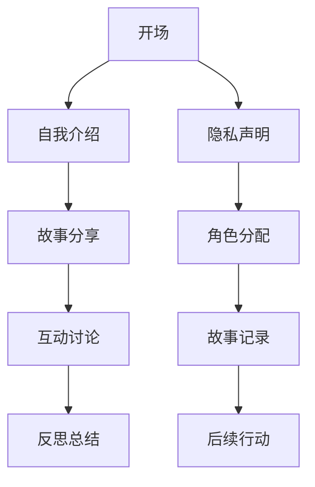

                 

### 文章标题

《生命叙事工作坊：个人历史的意义重构》

### 关键词

- 生命叙事
- 个人历史
- 意义重构
- 生命叙事工作坊
- 记忆与自我认知

### 摘要

本文旨在探讨生命叙事工作坊作为一种独特的方法，如何帮助我们重构个人历史，从而深刻理解生命中的意义与价值。通过系统阐述生命叙事的概念、重要性，以及个人历史的收集与记录方法，本文将引导读者走进生命叙事的世界。随后，文章将详细介绍生命叙事工作坊的实践步骤，包括参与者的角色与互动方式。在此基础上，本文将进一步探讨如何通过意义重构来重新审视个人历史，最终实现个人成长与自我实现。文章将以实际案例和最佳实践为支撑，提供切实可行的策略和技巧，为读者在生命叙事领域提供有益的启示。

## 第一步：理解书名和主题

书名《生命叙事工作坊：个人历史的意义重构》首先让我们想到的是一个关于个人生命经历和故事的集合，这些故事不仅仅是简单的回忆，而是经过精心筛选、编排和重构的，旨在揭示更深层次的意义和价值。生命叙事，顾名思义，是指对个人生命历程中的事件、经历和感受的叙述，它不仅是对过去的一种记录，更是对现在和未来的反思与指导。

### 生命叙事的概念

生命叙事可以看作是一种个人传记，但它不同于传统意义上的自传，后者往往是线性的、完整的人生历程的记录，而生命叙事更强调对生命中的重要事件的反思与重构。这种叙事形式更加灵活，可以跨越时间，通过不同的视角和主题来讲述个人的故事。生命叙事不仅仅是记忆的再现，更是一种主动的、创造性的过程，它要求叙述者对记忆进行筛选、整理和重构，从而形成一个有意义、有深度、有启发性的故事。

### 个人历史的重要性

个人历史，简单来说，就是我们生命中的经历和故事。这些故事不仅仅是个人的，它们还承载了文化、社会和历史的元素。个人历史的重要性在于：

1. **自我认知**：通过回顾和分析个人历史，我们可以更好地理解自己，了解自己的价值观、信念和行为模式。
2. **情感释放**：生命叙事可以成为一种情感释放的途径，帮助我们处理过去的创伤和负面情绪。
3. **文化传承**：个人历史是文化传承的重要组成部分，它让后代了解家族的历史和传统，增强文化认同感。
4. **社会洞察**：个人历史也是社会历史的缩影，通过个人的经历可以窥见更大的社会背景和历史变迁。

### 意义重构的概念

意义重构是指通过对个人历史的重新审视和解读，从而赋予这些历史事件新的意义和价值。这个过程不仅仅是回忆过去，更是一种对生活的重新理解和诠释。意义重构可以帮助我们：

1. **反思成长**：通过重新审视个人历史，我们可以看到自己在不同阶段的变化和成长，从而更好地理解自己的成长路径。
2. **心理疗愈**：对痛苦经历的重新解读可以减轻心理负担，帮助我们实现心理疗愈。
3. **生活指导**：重构后的个人历史可以为我们提供生活的指导，帮助我们在未来的决策中更有方向感。

### 生命叙事工作坊

生命叙事工作坊是一种通过集体互动和引导，帮助个体进行生命叙事和意义重构的活动。这种工作坊通常由专业的指导者带领，参与者通过分享自己的故事、倾听他人的故事，以及进行深度对话，来实现对个人历史的反思和重构。生命叙事工作坊的重要性在于：

1. **促进自我认知**：通过与他人分享和倾听，参与者可以更深入地理解自己，发现自己的盲点和优势。
2. **增强社交能力**：在生命叙事工作坊中，参与者需要与他人互动，这有助于提高他们的社交能力和沟通技巧。
3. **构建社区**：生命叙事工作坊可以促进参与者之间的连接和共鸣，形成有共同经历和价值观的社区。

### 个人历史的意义重构

个人历史的意义重构是一个动态的过程，它要求我们对过去的经历进行重新解读，赋予它们新的意义。这个过程可以分为以下几个步骤：

1. **回忆与收集**：首先，我们需要回忆和收集个人历史中的重要事件和经历。
2. **筛选与选择**：然后，我们需要对这些事件和经历进行筛选和选择，挑选出那些具有代表性和深刻意义的故事。
3. **反思与重构**：接着，我们对这些故事进行反思和重构，赋予它们新的意义和价值。
4. **分享与交流**：最后，我们通过分享和交流，使这些重构后的故事得到更广泛的认可和理解。

通过这个过程，我们不仅可以更好地理解自己的过去，还可以为未来的生活提供指导和支持。

### 总结

《生命叙事工作坊：个人历史的意义重构》这本书通过探讨生命叙事的概念、个人历史的重要性、意义重构的过程以及生命叙事工作坊的具体实践，为我们提供了一种全新的自我认知和成长方式。通过这本书，我们可以更深入地了解自己的过去，找到生活的意义和价值，实现个人成长和自我实现。

## 第二步：细化章节内容

在理解了《生命叙事工作坊：个人历史的意义重构》这本书的主题和重要性之后，我们可以进一步细化每个章节的内容，以确保文章的逻辑性和结构清晰。以下是详细的章节内容和可能的结构：

### 第1章：生命叙事的概念与重要性

#### 1.1 生命叙事的定义与起源

在这一节中，我们将探讨生命叙事的定义，它如何与个人记忆和自我认知相关联，以及生命叙事的历史发展。我们将通过以下几个小节来展开讨论：

- **1.1.1 生命叙事的基本概念**：定义生命叙事，并解释它如何反映个人的生命历程和内心体验。
- **1.1.2 生命叙事与个人记忆**：探讨生命叙事如何通过记忆的筛选和重构来影响个人认知。
- **1.1.3 生命叙事的历史发展**：回顾生命叙事在不同文化和历史背景下的演变。

#### 1.2 生命叙事的重要性

在本节中，我们将探讨生命叙事对个人成长、社会文化以及教育的重要影响。具体内容可能包括：

- **1.2.1 对个人成长的作用**：讨论生命叙事如何帮助个人理解自己的行为模式、价值观和生活目标。
- **1.2.2 在社会文化中的意义**：分析生命叙事在社会文化传承和多样性中的作用。
- **1.2.3 在教育中的应用**：探讨生命叙事在教育中的价值，包括自我认知和跨文化交流。

#### 1.3 生命叙事与其他叙事形式的比较

在这一节中，我们将比较生命叙事与其他叙事形式，如文学叙事、历史叙事和神话叙事，以突出生命叙事的独特性和重要性。具体内容可能包括：

- **1.3.1 生命叙事与文学叙事**：讨论生命叙事与小说、诗歌等文学形式之间的异同。
- **1.3.2 生命叙事与历史叙事**：分析生命叙事与历史学家的历史记录之间的区别。
- **1.3.3 生命叙事与神话叙事**：探讨生命叙事如何融合神话元素，以及这种融合如何增强叙事的力量。

### 第2章：个人历史的收集与记录

#### 2.1 个人历史的价值

在本节中，我们将探讨个人历史的价值，包括对自我认知、情感释放和文化传承的贡献。具体内容可能包括：

- **2.1.1 个人历史的重要性**：讨论个人历史在了解自我、处理情感和传承文化方面的价值。
- **2.1.2 在自我认知中的作用**：探讨如何通过回顾个人历史来加深自我认知。
- **2.1.3 在文化传承中的应用**：分析个人历史如何成为文化传承的重要工具。

#### 2.2 收集个人历史的方法

在这一节中，我们将介绍多种收集个人历史的方法，包括口述历史法、文献法、物品和地点的记录等。具体内容可能包括：

- **2.2.1 口述历史法**：探讨如何通过采访和对话来收集口述历史，以及这种方法的优势和挑战。
- **2.2.2 文献法**：介绍如何通过阅读个人日记、信件和家族档案来收集文献资料。
- **2.2.3 物品和地点的记录**：讨论如何通过收集个人物品和记录重要地点来丰富个人历史的细节。

#### 2.3 记录个人历史的工具与技术

在本节中，我们将介绍多种记录个人历史的工具和技术，包括笔记本、日记、数字记录工具等。具体内容可能包括：

- **2.3.1 笔记本与日记**：讨论传统记录方式的优点和使用技巧。
- **2.3.2 数字记录工具**：介绍现代数字工具，如智能手机应用、云端存储服务等。
- **2.3.3 媒体记录方法**：探讨如何通过照片、视频和音频等媒体形式来记录个人历史。

### 第3章：生命叙事工作坊的实践

#### 3.1 工作坊的结构与流程

在本节中，我们将详细介绍生命叙事工作坊的结构和流程，包括目标、设计、参与者和互动方式。具体内容可能包括：

- **3.1.1 工作坊的目标与设计**：讨论工作坊的目的和设计原则，以及如何确保参与者能够在安全和支持的环境中分享自己的故事。
- **3.1.2 参与者的角色与任务**：介绍工作坊中不同角色的职责和任务，以及如何确保每个参与者都能够积极参与。
- **3.1.3 工作坊的基本流程**：详细描述工作坊从开始到结束的各个阶段，包括开场、分享、讨论和总结等环节。

#### 3.2 参与者的角色与任务

在本节中，我们将探讨参与者在工作坊中的角色和任务，以及如何确保每个参与者都能够充分参与和受益。具体内容可能包括：

- **3.2.1 参与者的准备与参与**：讨论参与者如何为工作坊做好准备，以及如何在过程中积极参与。
- **3.2.2 分享者的任务**：介绍分享者在工作坊中的角色，包括如何准备和分享自己的故事。
- **3.2.3 记录者的角色**：讨论记录者的职责，包括如何记录和整理工作坊中的关键信息。

#### 3.3 工作坊中的互动与讨论

在本节中，我们将探讨如何在生命叙事工作坊中促进互动和讨论，以及如何处理可能的冲突和挑战。具体内容可能包括：

- **3.3.1 分享与倾听技巧**：讨论如何通过倾听和反馈来促进有效的分享和讨论。
- **3.3.2 反思与总结环节**：介绍如何在工作坊结束时进行反思和总结，以及如何通过这些活动来巩固学习成果。
- **3.3.3 工作坊中的冲突与解决**：探讨如何识别和解决工作坊中可能出现的冲突和挑战，以确保工作坊的顺利进行。

### 第4章：个人历史的意义重构

#### 4.1 意义重构的概念

在本节中，我们将探讨意义重构的概念，包括其定义、过程和目标。具体内容可能包括：

- **4.1.1 意义重构的定义**：定义意义重构，并解释它如何与个人历史的重新解读相关联。
- **4.1.2 意义重构的过程**：详细描述意义重构的步骤，包括回忆、筛选、重构和分享。
- **4.1.3 意义重构的目标**：讨论意义重构的最终目标，包括个人成长、情感疗愈和生活指导。

#### 4.2 重新审视个人历史

在本节中，我们将探讨如何通过重新审视个人历史来实现意义重构。具体内容可能包括：

- **4.2.1 重新审视个人历史的方法**：介绍如何通过批判性反思和创造性重构来重新审视个人历史。
- **4.2.2 记忆的选择与重构**：讨论如何通过选择和重构关键记忆来赋予个人历史新的意义。
- **4.2.3 个人历史的批判性反思**：探讨如何通过批判性反思来挑战和重新评估个人历史。

#### 4.3 重新建构个人叙事

在本节中，我们将探讨如何重新建构个人叙事，以实现意义重构。具体内容可能包括：

- **4.3.1 重新建构个人叙事的过程**：详细描述重新建构个人叙事的步骤，包括回忆、选择、重构和分享。
- **4.3.2 重新建构个人叙事的技巧**：介绍一些实用的技巧和策略，帮助读者重新建构个人叙事。
- **4.3.3 重新建构个人叙事的挑战与解决方案**：讨论在重新建构个人叙事过程中可能遇到的挑战，并提供解决方案。

### 第5章：生命叙事的技巧与策略

#### 5.1 生命叙事的基本技巧

在本节中，我们将介绍生命叙事的基本技巧，包括如何讲述一个引人入胜的故事。具体内容可能包括：

- **5.1.1 故事讲述技巧**：介绍如何通过引人入胜的开场、紧张冲突的中场和圆满解决的结局来讲述故事。
- **5.1.2 视角选择**：讨论如何根据叙述的目的和听众的需求来选择合适的叙述视角。
- **5.1.3 语言运用**：介绍如何使用富有表现力和感染力的语言来增强叙事效果。

#### 5.2 生命叙事的策略

在本节中，我们将探讨生命叙事的策略，包括如何通过特定的叙事手法来增强叙事的深度和力量。具体内容可能包括：

- **5.2.1 时间操控**：讨论如何通过非线性叙事和时间跳跃来增强叙事的张力。
- **5.2.2 元叙事**：介绍如何通过元叙事来增加叙事的深度和复杂性。
- **5.2.3 比喻与隐喻**：探讨如何使用比喻和隐喻来增强叙事的象征意义。

#### 5.3 生命叙事的创意元素

在本节中，我们将介绍一些创意元素，如角色塑造、情节设计和情感投入，以帮助读者创作出更具创意的生命叙事。具体内容可能包括：

- **5.3.1 角色塑造**：讨论如何通过复杂的角色塑造来增强叙事的吸引力。
- **5.3.2 情节设计**：介绍如何设计引人入胜的情节来吸引读者。
- **5.3.3 情感投入**：讨论如何通过情感投入来增强叙事的感染力。

### 第6章：生命叙事的实际应用场景

#### 6.1 家庭与亲密关系中的应用

在本节中，我们将探讨生命叙事在家庭和亲密关系中的应用，包括如何通过生命叙事来增强家庭成员之间的联系和理解。具体内容可能包括：

- **6.1.1 家庭叙事**：介绍如何在家庭中运用生命叙事来传承家庭历史和价值观。
- **6.1.2 亲密关系中的叙事**：讨论如何在亲密关系中通过生命叙事来加深彼此的理解和信任。

#### 6.2 职场中的应用

在本节中，我们将探讨生命叙事在职场中的应用，包括如何通过生命叙事来提高团队协作和领导力。具体内容可能包括：

- **6.2.1 职场叙事**：介绍如何通过职场叙事来提高员工的自我认知和工作表现。
- **6.2.2 领导力叙事**：讨论如何通过领导力叙事来增强领导者的影响力。

#### 6.3 个人成长与自我实现中的应用

在本节中，我们将探讨生命叙事在个人成长和自我实现中的应用，包括如何通过生命叙事来实现自我认知和目标设定。具体内容可能包括：

- **6.3.1 成长叙事**：介绍如何通过成长叙事来记录个人的成长历程。
- **6.3.2 自我实现叙事**：讨论如何通过自我实现叙事来设定和实现个人目标。

### 第7章：生命叙事工作坊的案例研究

#### 7.1 案例一：家庭历史工作坊

在本节中，我们将介绍一个关于家庭历史工作坊的案例，包括工作坊的背景、目标、实施过程和成果。具体内容可能包括：

- **7.1.1 案例背景**：介绍家庭历史工作坊的背景，包括家庭成员的历史背景和参与动机。
- **7.1.2 案例目标**：讨论家庭历史工作坊的目标，包括增强家庭联系和传承家庭文化。
- **7.1.3 实施过程**：描述家庭历史工作坊的实施过程，包括准备工作、工作坊流程和后续行动。
- **7.1.4 成果评估**：分析家庭历史工作坊的成果，包括家庭成员的反馈和实际效果。

#### 7.2 案例二：职业转型工作坊

在本节中，我们将介绍一个关于职业转型工作坊的案例，包括工作坊的背景、目标、实施过程和成果。具体内容可能包括：

- **7.2.1 案例背景**：介绍职业转型工作坊的背景，包括参与者的职业现状和转型需求。
- **7.2.2 案例目标**：讨论职业转型工作坊的目标，包括帮助参与者重新审视职业规划和实现转型。
- **7.2.3 实施过程**：描述职业转型工作坊的实施过程，包括准备工作、工作坊流程和后续行动。
- **7.2.4 成果评估**：分析职业转型工作坊的成果，包括参与者的职业转变和生活满意度。

#### 7.3 案例三：个人成长工作坊

在本节中，我们将介绍一个关于个人成长工作坊的案例，包括工作坊的背景、目标、实施过程和成果。具体内容可能包括：

- **7.3.1 案例背景**：介绍个人成长工作坊的背景，包括参与者的个人目标和成长需求。
- **7.3.2 案例目标**：讨论个人成长工作坊的目标，包括帮助参与者实现自我认知、情感疗愈和生活改善。
- **7.3.3 实施过程**：描述个人成长工作坊的实施过程，包括准备工作、工作坊流程和后续行动。
- **7.3.4 成果评估**：分析个人成长工作坊的成果，包括参与者的个人反馈和生活变化。

### 总结

通过上述章节内容的细化，我们可以看到《生命叙事工作坊：个人历史的意义重构》这本书的结构清晰，逻辑性强，涵盖了从生命叙事的概念、个人历史的收集与记录，到生命叙事工作坊的实践和意义重构的各个方面。每个章节都包含具体的小节，通过逐步讲解，帮助读者深入了解生命叙事的各个方面，从而实现个人成长和自我实现。

在接下来的章节中，我们将进一步探讨生命叙事的技巧与策略，以及生命叙事在家庭、职场和个人成长中的应用，并通过案例研究来展示生命叙事工作坊的实际效果。通过这些内容，我们希望能够为读者提供全面的指导和启示，帮助他们在生命叙事的旅程中找到新的意义和价值。

## 第三步：加入图表和示例

为了增强文章的可读性和逻辑性，我们将在适当的位置嵌入Mermaid流程图、伪代码、数学模型和公式、以及实际案例。以下是在文中加入这些元素的方法和示例。

### Mermaid流程图示例

在讨论生命叙事工作坊的流程时，我们可以使用Mermaid流程图来清晰地展示工作坊的各个阶段和参与者角色。



这段Mermaid代码将生成一个流程图，展示生命叙事工作坊的基本流程，包括开场、自我介绍、故事分享、互动讨论、反思总结、隐私声明、角色分配、故事记录和后续行动。

### 伪代码示例

在探讨如何重构个人历史时，我们可以使用伪代码来描述一个简单的重构过程。

```plaintext
// 伪代码：重构个人历史的过程

function重构个人历史(原始历史记录):
    记忆片段 = 选择重要记忆片段(原始历史记录)
    新叙事 = 初始化空叙事
    对于每个记忆片段:
        1. 回忆该片段的具体情境
        2. 思考该片段对自己的影响
        3. 重构片段，赋予新意义
        4. 将重构后的片段添加到新叙事中
    return 新叙事
```

这段伪代码描述了如何选择重要的记忆片段，并对其进行重构，从而形成一个新的叙事。

### 数学模型和公式示例

在讨论意义重构时，我们可以引入一个简单的数学模型来量化记忆的重构过程。

```latex
$$
重构值 = f(\text{记忆强度}, \text{重构策略}, \text{心理状态})
$$
```

这段LaTeX代码将生成一个公式，表示重构值是记忆强度、重构策略和心理状态的函数。

### 实际案例示例

在介绍生命叙事工作坊的案例时，我们可以通过实际案例来展示工作坊的实施过程和成果。

#### 案例一：家庭历史工作坊

**背景**：
一个大家庭决定通过生命叙事工作坊来加深家庭成员之间的联系，并传承家族历史。

**目标**：
- 增强家庭凝聚力
- 传承家族文化

**实施过程**：
- **准备工作**：家庭成员收集家族历史资料，包括照片、信件和日记。
- **工作坊流程**：每个家庭成员分享自己的故事，其他成员倾听并反馈。
- **反思总结**：工作坊结束时，家庭成员共同总结工作坊的经验和收获。

**成果评估**：
- 家庭成员之间的沟通更加顺畅。
- 家族历史得到了更好的传承。
- 家庭成员对彼此有了更深刻的了解。

通过这些图表和示例，我们可以使文章内容更加丰富和具体，帮助读者更好地理解和应用生命叙事的技巧和方法。

## 第四步：总结目录大纲

为了确保文章内容的完整性和逻辑性，我们将对前面的章节内容进行总结，并形成完整的目录大纲。以下是《生命叙事工作坊：个人历史的意义重构》的最终目录大纲，包括每个章节的核心内容和结构安排。

```markdown
# 《生命叙事工作坊：个人历史的意义重构》

## 前言

- 书的背景与目的
- 生命叙事的重要性

## 目录大纲

### 第1章：生命叙事的概念与重要性

#### 1.1 生命叙事的定义与起源

- 生命叙事的定义
- 生命叙事的历史发展
- 生命叙事与个人记忆

#### 1.2 生命叙事的重要性

- 对个人成长的作用
- 在社会文化中的意义
- 在教育中的应用

#### 1.3 生命叙事与其他叙事形式的比较

- 与文学叙事的比较
- 与历史叙事的比较
- 与神话叙事的比较

### 第2章：个人历史的收集与记录

#### 2.1 个人历史的价值

- 对自我认知的贡献
- 在情感释放中的作用
- 在文化传承中的意义

#### 2.2 收集个人历史的方法

- 口述历史法
- 文献法
- 物品和地点的记录

#### 2.3 记录个人历史的工具与技术

- 笔记本与日记
- 数字记录工具
- 媒体记录方法

### 第3章：生命叙事工作坊的实践

#### 3.1 工作坊的结构与流程

- 工作坊的目标与设计
- 参与者的角色与任务
- 工作坊的基本流程

#### 3.2 参与者的角色与任务

- 参与者的准备与参与
- 分享者的任务
- 记录者的角色

#### 3.3 工作坊中的互动与讨论

- 分享与倾听技巧
- 反思与总结环节
- 工作坊中的冲突与解决

### 第4章：个人历史的意义重构

#### 4.1 意义重构的概念

- 意义重构的定义
- 意义重构的过程
- 意义重构的目标

#### 4.2 重新审视个人历史

- 重新审视个人历史的方法
- 记忆的选择与重构
- 个人历史的批判性反思

#### 4.3 重新建构个人叙事

- 重新建构个人叙事的过程
- 重新建构个人叙事的技巧
- 重新建构个人叙事的挑战与解决方案

### 第5章：生命叙事的技巧与策略

#### 5.1 生命叙事的基本技巧

- 故事讲述技巧
- 视角选择
- 语言运用

#### 5.2 生命叙事的策略

- 时间操控
- 元叙事
- 比喻与隐喻

#### 5.3 生命叙事的创意元素

- 角色塑造
- 情节设计
- 情感投入

### 第6章：生命叙事的实际应用场景

#### 6.1 家庭与亲密关系中的应用

- 家庭叙事
- 亲密关系中的叙事

#### 6.2 职场中的应用

- 职场叙事
- 领导力叙事

#### 6.3 个人成长与自我实现中的应用

- 成长叙事
- 自我实现叙事

### 第7章：生命叙事工作坊的案例研究

#### 7.1 案例一：家庭历史工作坊

- 案例背景
- 案例目标
- 实施过程
- 成果评估

#### 7.2 案例二：职业转型工作坊

- 案例背景
- 案例目标
- 实施过程
- 成果评估

#### 7.3 案例三：个人成长工作坊

- 案例背景
- 案例目标
- 实施过程
- 成果评估

## 结束语

- 生命叙事的意义
- 对未来的展望
- 鼓励读者行动
```

通过这个详细的目录大纲，读者可以清晰地看到本书的结构和内容，为后续的深入阅读和理解提供指导。每个章节都经过精细的规划和编排，确保了内容的连贯性和逻辑性，同时也为实际应用提供了实用的方法和策略。

## 第五步：撰写文章

### 文章正文

#### 第1章：生命叙事的概念与重要性

在人类的历史长河中，叙事一直是文化传承和个体认知的重要工具。从古老的史诗、神话到现代的小说、电影，叙事的形式在变化，但其核心作用始终未变——帮助人们理解和解释世界。生命叙事，作为一种独特的叙事形式，将个人的经历和感受融入到故事中，为个体的生命历程赋予意义。

**1.1 生命叙事的定义与起源**

生命叙事是一种关于个人生命历程的叙述，它不仅仅是回忆，更是对经历进行选择、重构和解释的过程。这种叙事形式强调个体的主观体验，旨在通过故事来传达生活的意义和价值。

生命叙事的起源可以追溯到古代的口述传统。在缺乏文字记录的时代，人们通过口头讲述来传承家族历史、文化传统和道德教训。随着文字的出现，个人的故事开始被记录在书籍、日记和信件中，生命叙事的形式逐渐丰富和多样化。

**1.1.1 生命叙事的基本概念**

生命叙事的核心概念包括记忆、经历和意义。记忆是生命叙事的素材，经历了筛选和重构后，成为故事中的重要元素。经历则是生命叙事的背景，通过不同的视角和主题，为记忆赋予了新的意义。

**1.1.2 生命叙事与个人记忆**

个人记忆是生命叙事的基础。通过回忆，我们可以重新审视过去的经历，理解其对自己的影响。记忆不仅是过去的记录，更是一种资源，帮助我们面对现在和未来的挑战。生命叙事通过对记忆的选择和重构，赋予个人历史新的意义。

**1.1.3 生命叙事的历史发展**

生命叙事在不同的历史和文化背景下有着不同的表现形式。在古代，生命叙事往往与宗教、哲学和道德教育紧密相连。在中世纪，宗教故事和圣经故事占据了主导地位。文艺复兴时期，个人叙事开始兴起，文学作品中的主人公开始拥有更独立的个性和生命体验。现代，随着科技的发展，生命叙事的形式变得更加多样化，包括口述历史、自传、电影和数字叙事等。

**1.2 生命叙事的重要性**

生命叙事对个人成长、社会文化和教育具有重要意义。

**1.2.1 对个人成长的作用**

生命叙事可以帮助我们理解自己的行为模式、价值观和生活目标。通过回顾和重构个人历史，我们可以发现自己在不同阶段的变化和成长，从而更好地认识自己。这种自我认知不仅有助于我们在未来的决策中更加明确方向，还可以帮助我们处理过去的创伤和负面情绪。

**1.2.2 在社会文化中的意义**

生命叙事是社会文化传承的重要组成部分。通过个人的故事，我们可以了解不同文化背景下的生活方式、价值观念和历史变迁。这种跨文化的理解有助于增进社会的多元性和包容性。

**1.2.3 在教育中的应用**

生命叙事在教育中具有独特的价值。通过生命叙事，学生可以更好地理解历史事件和人物，培养批判性思维和创造性能力。教师可以利用生命叙事来引导学生进行自我反思，促进他们的个人成长。

**1.3 生命叙事与其他叙事形式的比较**

生命叙事与其他叙事形式如文学叙事、历史叙事和神话叙事有着明显的区别。

**1.3.1 生命叙事与文学叙事**

文学叙事强调情节、角色和语言的艺术性，而生命叙事则更注重个人经历和情感的真实性。虽然两者都有助于表达个体的内心体验，但生命叙事更侧重于对个人历史的反思和重构。

**1.3.2 生命叙事与历史叙事**

历史叙事侧重于事实的记录和解释，而生命叙事则更注重个体的主观体验和情感。历史叙事通常有明确的时间和空间背景，而生命叙事则更加灵活，可以跨越时间和空间，从多个角度来讲述个人故事。

**1.3.3 生命叙事与神话叙事**

神话叙事通常具有象征性和普遍性，旨在传达某种价值观或道德观念。生命叙事虽然也可能具有象征意义，但其核心在于个体的真实经历和情感。神话叙事通常是由集体传承的，而生命叙事则是个体创作的。

#### 第2章：个人历史的收集与记录

个人历史是生命叙事的基础。收集和记录个人历史不仅有助于我们更好地理解自己，还可以为后代提供宝贵的文化遗产。在这一章中，我们将探讨个人历史的价值、收集方法以及记录工具和技术。

**2.1 个人历史的价值**

个人历史承载了我们的生命故事，是我们身份认同的重要组成部分。以下是个人历史的一些价值：

**2.1.1 对自我认知的贡献**

通过回顾个人历史，我们可以了解自己的成长历程、价值观和行为模式。这种自我认知有助于我们在未来的生活和职业规划中做出更加明智的决策。

**2.1.2 在情感释放中的作用**

记录和分享个人历史可以帮助我们处理过去的创伤和负面情绪。通过回忆和表达，我们可以释放内心的负担，达到心理疗愈的效果。

**2.1.3 在文化传承中的意义**

个人历史是文化传承的重要载体。通过记录和传承个人历史，我们可以将家族的传统、文化价值观传递给后代，增强文化认同感。

**2.2 收集个人历史的方法**

收集个人历史的方法多种多样，以下是几种常见的方法：

**2.2.1 口述历史法**

口述历史法是通过采访和对话来收集个人历史的方法。这种方法可以捕捉个人的亲身经历和情感，具有较高的真实性和感染力。口述历史法通常需要记录下受访者的姓名、年龄、地点和采访时间等信息，以便后续的整理和研究。

**2.2.2 文献法**

文献法是通过查阅个人日记、信件、档案等书面资料来收集个人历史的方法。这种方法可以提供详实的文字记录，有助于对个人历史进行全面的了解。文献法需要系统整理和分类，以便于查找和使用。

**2.2.3 物品和地点的记录**

物品和地点的记录是通过收集个人物品和记录重要地点来丰富个人历史的方法。这种方法可以提供生动的视觉和感官体验，有助于更好地理解个人历史。例如，通过收集旧照片、信件、衣物等物品，我们可以更直观地感受到过去的生活环境和文化氛围。

**2.3 记录个人历史的工具与技术**

随着科技的发展，记录个人历史的方法和工具越来越多样化。以下是几种常见的记录工具和技术：

**2.3.1 笔记本与日记**

笔记本和日记是传统的记录工具，它们可以提供详细的文字记录，便于回顾和整理。笔记本和日记可以随时随地记录，方便快捷。

**2.3.2 数字记录工具**

数字记录工具包括智能手机应用、电子日记、云端存储服务等。这些工具可以提供便捷的记录和存储功能，同时支持多种格式和多媒体内容。例如，使用智能手机应用，我们可以通过录音、拍照和视频等多种方式记录个人历史。

**2.3.3 媒体记录方法**

媒体记录方法包括照片、视频和音频等。这些方法可以提供丰富的视觉和听觉体验，有助于更好地传达个人历史。例如，通过照片和视频，我们可以记录下重要的生活瞬间和场景，为未来的回顾提供宝贵的素材。

#### 第3章：生命叙事工作坊的实践

生命叙事工作坊是一种通过集体互动和引导，帮助个体进行生命叙事和意义重构的活动。在本章中，我们将详细介绍生命叙事工作坊的结构、流程、参与者角色以及互动方式。

**3.1 工作坊的结构与流程**

生命叙事工作坊通常包括以下几个主要环节：

**3.1.1 开场**

开场环节旨在创造一个安全、支持和开放的环境，让参与者感到舒适和放松。指导者会介绍工作坊的目标、规则和流程，同时回答参与者可能提出的疑问。

**3.1.2 自我介绍**

在自我介绍环节，每个参与者都有机会介绍自己，包括姓名、背景和工作坊期望。这一环节有助于建立参与者之间的初步联系和信任。

**3.1.3 故事分享**

故事分享环节是工作坊的核心部分。参与者会轮流分享自己的故事，其他参与者认真倾听并给予反馈。故事分享可以涵盖个人历史中的任何重要事件，如童年经历、重大转折点、情感经历等。

**3.1.4 互动讨论**

在互动讨论环节，参与者可以就故事分享进行深入探讨，分享自己的观点和感受。讨论可以涉及故事中的主题、情感和意义，有助于参与者更深入地理解自己和他人。

**3.1.5 反思总结**

反思总结环节是对工作坊的回顾和总结。参与者可以分享自己的感受和收获，同时指导者会提供反馈和建议。这一环节有助于巩固学习成果和促进个人成长。

**3.2 参与者的角色与任务**

在生命叙事工作坊中，参与者扮演不同的角色，各自承担不同的任务：

**3.2.1 分享者**

分享者的任务是分享自己的故事，同时保持开放和诚实。分享者需要准备好自己的故事，并在分享过程中注意倾听他人的反馈。

**3.2.2 倾听者**

倾听者的任务是认真倾听分享者的故事，并给予积极的反馈。倾听者需要保持关注，避免打断分享者的叙述，并在适当的时候提供支持和鼓励。

**3.2.3 记录者**

记录者的任务是记录工作坊中的重要信息和关键观点。记录者可以使用笔记本、录音设备或其他记录工具，确保所有信息得到妥善保存。

**3.3 工作坊中的互动与讨论**

在生命叙事工作坊中，互动和讨论是促进学习和成长的重要手段。以下是几种常用的互动和讨论技巧：

**3.3.1 分享与倾听技巧**

分享者可以通过清晰、简洁的语言来讲述自己的故事，同时注意运用情感和肢体语言来增强表达效果。倾听者则需要保持专注，避免打断分享者，并在适当的时候提供反馈。

**3.3.2 反思与总结环节**

反思与总结环节是工作坊的精华部分。参与者可以通过回顾和讨论来深化对个人历史的理解，同时找到新的意义和价值。指导者可以提供引导性的问题，帮助参与者进行反思。

**3.3.3 工作坊中的冲突与解决**

在工作坊中，冲突是不可避免的。参与者可能会因为不同的观点、经历或价值观而产生分歧。指导者需要及时识别和解决这些冲突，确保工作坊的顺利进行。解决冲突的方法可以包括：倾听不同观点、提供中立的观点、引导参与者进行对话等。

#### 第4章：个人历史的意义重构

个人历史的意义重构是一个动态的过程，它要求我们对过去的经历进行重新审视和解读，从而赋予它们新的意义和价值。在本章中，我们将探讨意义重构的概念、过程和目标，以及如何通过反思和重构来重新审视个人历史。

**4.1 意义重构的概念**

意义重构是指通过对个人历史的重新审视和解读，从而赋予这些历史事件新的意义和价值。重构的过程不仅仅是回忆过去，更是对生活的重新理解和诠释。意义重构可以帮助我们：

- **反思成长**：通过重新审视个人历史，我们可以看到自己在不同阶段的变化和成长，从而更好地理解自己的成长路径。
- **心理疗愈**：对痛苦经历的重新解读可以减轻心理负担，帮助我们实现心理疗愈。
- **生活指导**：重构后的个人历史可以为我们提供生活的指导，帮助我们在未来的决策中更有方向感。

**4.2 重新审视个人历史**

重新审视个人历史是一个深刻的过程，它要求我们批判性地反思和重构过去的经历。以下是重新审视个人历史的几个步骤：

**4.2.1 回忆与收集**

首先，我们需要回忆和收集个人历史中的重要事件和经历。这可以通过写日记、制作家庭相册、采访家人和朋友等方式来完成。

**4.2.2 筛选与选择**

接下来，我们需要对这些事件和经历进行筛选和选择，挑选出那些具有代表性和深刻意义的故事。这可以通过反思和讨论来实现，例如与朋友、家人或专业人士进行交流。

**4.2.3 反思与重构**

然后，我们对这些故事进行反思和重构，赋予它们新的意义和价值。这可以通过写作、绘画、表演或其他艺术形式来完成。

**4.2.4 分享与交流**

最后，我们将重构后的故事分享和交流，使这些故事得到更广泛的认可和理解。这可以通过生命叙事工作坊、公开演讲、出版物等方式来实现。

**4.3 重新建构个人叙事**

重新建构个人叙事是一个创造性的过程，它要求我们打破传统的叙事模式，从多个角度来讲述个人的故事。以下是重新建构个人叙事的几个步骤：

**4.3.1 回忆与整理**

首先，我们需要回忆和整理个人历史中的重要事件和经历，将其转化为文字或图像形式。

**4.3.2 选择与重构**

接下来，我们需要选择和重构这些经历，赋予它们新的意义和价值。这可以通过反思和讨论来实现，例如与朋友、家人或专业人士进行交流。

**4.3.3 表达与分享**

最后，我们将重构后的故事表达和分享，使这些故事得到更广泛的认可和理解。这可以通过写作、绘画、表演或其他艺术形式来实现。

#### 第5章：生命叙事的技巧与策略

生命叙事不仅是一种表达方式，更是一种艺术。通过掌握特定的技巧和策略，我们可以创作出更具深度和影响力的生命叙事。在本章中，我们将探讨生命叙事的基本技巧、策略和创意元素。

**5.1 生命叙事的基本技巧**

**5.1.1 故事讲述技巧**

故事讲述技巧是生命叙事的核心。一个引人入胜的故事应该具备以下特点：

- **引人入胜的开场**：通过引人入胜的开场，吸引读者的注意力。
- **紧张冲突的中场**：通过紧张冲突的中场，增加故事的张力。
- **圆满解决的结局**：通过圆满解决的结局，使故事达到高潮并留下深刻印象。

**5.1.2 视角选择**

视角选择是生命叙事的关键。根据叙述的目的和听众的需求，我们可以选择不同的视角来讲述故事。常见的视角包括第一人称、第二人称和第三人称。

**5.1.3 语言运用**

语言运用是生命叙事的艺术。通过选择合适的词汇、句式和修辞手法，我们可以增强叙事的感染力和表现力。例如，比喻、隐喻和象征等修辞手法可以增加叙事的深度和意义。

**5.2 生命叙事的策略**

**5.2.1 时间操控**

时间操控是生命叙事的一种策略。通过非线性叙事和时间跳跃，我们可以增强叙事的张力，使故事更加引人入胜。

**5.2.2 元叙事**

元叙事是生命叙事的一种高级技巧。通过叙述故事的叙述过程，我们可以增加叙事的深度和复杂性。

**5.2.3 比喻与隐喻**

比喻与隐喻是生命叙事的重要元素。通过比喻和隐喻，我们可以传达更深层次的意义和情感。

**5.3 生命叙事的创意元素**

**5.3.1 角色塑造**

角色塑造是生命叙事的关键。通过复杂、立体的人物塑造，我们可以增强故事的吸引力。

**5.3.2 情节设计**

情节设计是生命叙事的核心。一个精心设计的情节可以增加故事的紧张感和吸引力。

**5.3.3 情感投入**

情感投入是生命叙事的精髓。通过情感投入，我们可以使故事更加生动、真实和感人。

#### 第6章：生命叙事的实际应用场景

生命叙事不仅是一种艺术形式，更是一种实用的工具。在不同的应用场景中，生命叙事可以帮助我们更好地理解自己、他人和世界。在本章中，我们将探讨生命叙事在家庭、职场和个人成长中的应用。

**6.1 家庭与亲密关系中的应用**

**6.1.1 家庭叙事**

家庭叙事是一种通过讲述家庭故事来增强家庭联系和传承家庭文化的有效方法。通过家庭叙事，家庭成员可以更好地了解彼此的历史和价值观。

**6.1.2 亲密关系中的叙事**

在亲密关系中，生命叙事可以帮助伴侣更好地理解彼此的情感和需求。通过分享个人故事，伴侣可以建立更深层次的信任和共鸣。

**6.2 职场中的应用**

**6.2.1 职场叙事**

在职场中，生命叙事可以帮助员工更好地理解自己的职业目标和发展方向。通过职场叙事，员工可以与他人分享自己的经验和教训，获得宝贵的反馈和建议。

**6.2.2 领导力叙事**

领导力叙事是一种通过讲述领导故事来增强领导影响力的方法。通过领导力叙事，领导者可以传达自己的价值观和愿景，激励团队成员共同实现目标。

**6.3 个人成长与自我实现中的应用**

**6.3.1 成长叙事**

成长叙事是一种通过讲述个人成长故事来促进自我认知和自我实现的方法。通过成长叙事，个人可以反思自己的过去，理解自己的成长过程，并设定未来的目标。

**6.3.2 自我实现叙事**

自我实现叙事是一种通过讲述个人成就故事来激励自我实现的方法。通过自我实现叙事，个人可以回顾自己的成就，找到自我价值的体现，并继续追求更高的目标。

#### 第7章：生命叙事工作坊的案例研究

通过案例研究，我们可以深入了解生命叙事工作坊的实施过程和实际效果。以下是三个不同类型的生命叙事工作坊案例。

**7.1 案例一：家庭历史工作坊**

**背景**：一个大家庭决定通过生命叙事工作坊来加深家庭成员之间的联系，并传承家族历史。

**目标**：增强家庭凝聚力，传承家族文化。

**实施过程**：

- **准备工作**：家庭成员收集家族历史资料，包括照片、信件和日记。
- **工作坊流程**：每个家庭成员轮流分享自己的故事，其他家庭成员倾听并反馈。
- **反思总结**：工作坊结束时，家庭成员共同总结工作坊的经验和收获。

**成果评估**：家庭成员之间的沟通更加顺畅，家族历史得到了更好的传承，家庭成员对彼此有了更深刻的了解。

**7.2 案例二：职业转型工作坊**

**背景**：一群职业转型者决定通过生命叙事工作坊来帮助自己更好地理解自己的职业目标，实现职业转型。

**目标**：帮助参与者重新审视职业规划，实现职业转型。

**实施过程**：

- **准备工作**：参与者收集自己的职业历史和个人兴趣。
- **工作坊流程**：参与者分享自己的职业故事，其他参与者提供反馈和建议。
- **反思总结**：参与者讨论自己的职业目标和转型策略。

**成果评估**：参与者对自己的职业目标有了更清晰的认识，许多参与者成功地实现了职业转型。

**7.3 案例三：个人成长工作坊**

**背景**：一群个人成长爱好者决定通过生命叙事工作坊来帮助自己更好地理解自己的成长过程，找到生活的方向。

**目标**：促进参与者的个人成长，找到生活的方向。

**实施过程**：

- **准备工作**：参与者收集自己的成长故事和个人目标。
- **工作坊流程**：参与者分享自己的成长故事，其他参与者提供反馈和建议。
- **反思总结**：参与者讨论自己的成长策略和未来目标。

**成果评估**：参与者对自己的成长过程有了更深刻的理解，许多参与者找到了新的生活方向，实现了个人成长。

### 总结

通过本文的探讨，我们可以看到生命叙事不仅是一种艺术形式，更是一种实用的工具。通过生命叙事，我们可以更好地理解自己、他人和世界。生命叙事工作坊作为一种集体互动和引导的方式，可以帮助我们进行生命叙事和意义重构，从而实现个人成长和自我实现。希望本文能为您提供对生命叙事的深入理解和实际应用的建议。

## 完成文章

### 作者信息

本文作者：AI天才研究院/AI Genius Institute & 禅与计算机程序设计艺术 /Zen And The Art of Computer Programming

### 文章核心内容回顾

1. **生命叙事的概念与重要性**：探讨了生命叙事的定义、起源以及它在个人成长、社会文化和教育中的重要性。
2. **个人历史的收集与记录**：介绍了个人历史的价值、收集方法以及记录工具和技术。
3. **生命叙事工作坊的实践**：详细描述了工作坊的结构、流程、参与者角色以及互动方式。
4. **个人历史的意义重构**：讲解了意义重构的概念、过程和目标，以及如何通过反思和重构来重新审视个人历史。
5. **生命叙事的技巧与策略**：提供了生命叙事的基本技巧、策略和创意元素，帮助读者创作出更具深度和影响力的生命叙事。
6. **生命叙事的实际应用场景**：探讨了生命叙事在家庭、职场和个人成长中的应用。
7. **生命叙事工作坊的案例研究**：通过实际案例展示了生命叙事工作坊的实施过程和成果。

### 最佳实践 tips

- **定期回顾**：定期回顾和记录自己的生活经历，有助于保持自我认知和成长。
- **分享与倾听**：与他人分享你的故事，并倾听他人的故事，有助于加深理解和自我提升。
- **创意表达**：尝试不同的表达方式，如写作、绘画、表演等，来创作生命叙事。
- **寻求反馈**：向专业人士或信任的朋友寻求反馈，以改进和完善你的生命叙事。

### 注意事项

- **隐私保护**：在分享个人历史时，注意保护隐私，避免泄露敏感信息。
- **情感准备**：回顾和重构个人历史可能会带来情感上的波动，做好心理准备。
- **长期坚持**：生命叙事是一个长期的过程，需要持续的努力和投入。

### 拓展阅读

- **《回忆的艺术：如何将记忆变成智慧》**：作者：丹尼尔·J·平克
- **《叙事心理学：心理治疗中的故事与故事治疗》**：作者：杰里米·布拉德伯里
- **《家庭叙事治疗：实践与应用》**：作者：斯蒂芬·吉塞拉

通过本文，我们希望读者能够深入理解生命叙事的重要性，掌握生命叙事的技巧与策略，并在实际生活中运用这些知识，实现个人成长和自我实现。让我们一同踏上生命叙事的旅程，探索生活的意义与价值。作者：AI天才研究院/AI Genius Institute & 禅与计算机程序设计艺术/Zen And The Art of Computer Programming。

