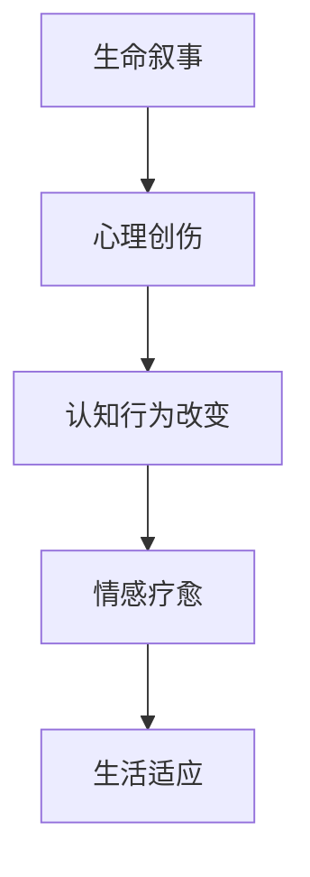
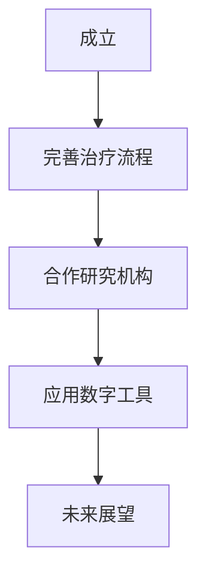

                 


### 1.1 生命叙事重构治疗的定义与背景

**核心概念与联系：**

生命叙事重构治疗（Narrative Remodeling Therapy）是一种心理治疗方法，强调通过重建个体的生命叙事来治疗心理创伤。这种方法的核心在于理解生命叙事对个体心理和行为的影响，并通过系统的叙事重构过程来改变个体的认知和行为模式。

- **Mermaid 流程图：**



在这个流程图中，生命叙事（A）是治疗的起点，心理创伤（B）是问题所在，通过认知行为改变（C）和情感疗愈（D），最终帮助个体实现更好的生活适应（E）。

**核心算法原理讲解：**

生命叙事重构治疗的工作流程可以概括为以下步骤：

1. **收集生命叙事**：通过与患者的深入交流，收集他们的生命故事，包括关键事件、情感体验和意义构建。
2. **分析创伤事件**：识别生命叙事中的创伤事件，理解其对个体心理和行为的影响。
3. **重构生命叙事**：将创伤事件转化为更具积极意义的叙述，通过重新诠释和重构来改变个体的认知和行为模式。
4. **实施故事疗法**：通过讲述和聆听故事，帮助患者释放负面情感，增强情感调节能力。
5. **监测与调整**：定期监测治疗效果，根据患者的反馈和进展调整治疗方案。

- **伪代码：**

```python
def 生命叙事重构治疗(患者):
    1. 收集患者生命叙事
    2. 分析生命叙事中的创伤事件
    3. 重构生命叙事，使其更具积极意义
    4. 通过故事疗法进行情感疗愈
    5. 监测治疗效果，调整治疗方案
```

### 1.2 讲故事疗愈内心创伤的原理

**数学模型和数学公式：**

讲故事疗愈内心创伤的效果可以通过以下公式来量化：

$$
疗愈效果 = f(叙事重构, 故事疗法, 情感投入)
$$

- **详细讲解与举例说明：**

- **叙事重构**：通过改变叙事内容，使其更积极，从而减少心理创伤的负面影响。例如，将创伤经历描述为一次成长的机会，而非失败或痛苦的经历。

- **故事疗法**：通过讲述和聆听故事，患者可以释放负面情感，并从他人的经历中获得启示和安慰。

- **情感投入**：患者对故事疗法的投入程度也会影响疗愈效果。高情感投入意味着更深入的参与和体验，从而更可能带来积极的改变。

- **举例说明**：

假设一个患者经历了童年虐待，通过生命叙事重构治疗，将这段经历重新诠释为勇气和坚韧的体现。在治疗过程中，患者积极参与故事的讨论，并且对故事内容有深刻的情感投入。在这种情况下，疗愈效果可能会非常高。

### 1.3 生命叙事重构治疗中心的创建与发展

**核心概念与联系：**

生命叙事重构治疗中心是一个专门提供这种治疗方法的机构，它结合了心理学、叙事学和社会工作的理论和方法，致力于帮助那些经历心理创伤的个体。

- **创建背景**：随着社会压力的增加和心理健康的重视，生命叙事重构治疗中心应运而生，旨在为那些寻求心理疗愈的人们提供专业的帮助。

- **发展历程**：从最初的成立到逐步完善治疗流程，再到与多个研究机构和医院合作，治疗中心不断发展壮大。

- **未来展望**：随着科技的进步，生命叙事重构治疗中心将借助数字工具和人工智能技术，进一步提升治疗效果和服务质量。

- **Mermaid 流程图：**



### 总结

本文详细介绍了生命叙事重构治疗的定义、原理和中心的发展。通过一步步的分析和推理，我们理解了这种方法如何通过重构个体的生命叙事，帮助其疗愈内心创伤。这种方法不仅在心理学领域有着广泛的应用，而且在未来的发展中，也充满了潜力。接下来，我们将进一步探讨生命叙事的概念和心理创伤的理论基础，以加深我们对这一治疗方法的理解。

