                 

### 文章标题

《生命叙事重构治疗：通过讲故事疗愈内心创伤》

---

关键词：生命叙事、叙事重构治疗、心理治疗、心理创伤、讲故事疗愈

---

摘要：本文旨在探讨生命叙事重构治疗在心理治疗中的应用，通过分析生命叙事的概念及其与心理治疗的关系，深入讲解叙事重构治疗的核心理念和实践方法。文章还通过具体案例分析，展示叙事重构治疗在心理创伤、家庭关系和职场压力等方面的效果，最后对叙事重构治疗的未来展望进行讨论。本文旨在为专业人士和公众提供对生命叙事重构治疗的全面了解。

---

### 第一部分：生命叙事重构治疗的概述

#### 第1章：生命叙事与心理治疗

##### 1.1 生命叙事的概念与重要性

**核心概念与联系：**

生命叙事（Life Narratives）是指个体通过讲述自己的故事来理解自己、与他人建立联系以及寻求认同的过程。生命叙事不仅是个人记忆的记录，更是一种心理机制，通过叙事，个体能够反思自己的经历、理解自己的身份，并在社会中找到自己的位置。

以下是一个Mermaid流程图，展示了生命叙事的核心概念与联系：

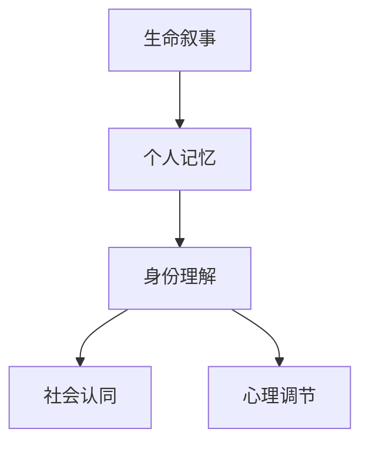

**核心算法原理讲解：**

生命叙事重构治疗（Narrative Reconstruction Therapy, NRT）是一种心理治疗的方法，其核心在于引导个体重新构建自己的故事，从而改变其对过去经历的理解和解释。这一过程涉及到以下算法原理：

1. **故事回顾：** 治疗师引导个体回顾过去的经历，鼓励其详细讲述自己的故事。
2. **故事重构：** 治疗师与个体一起分析和重构故事，改变故事的叙述方式，使其更加积极、健康。
3. **心理调整：** 通过重构叙事，个体能够调整自己的心理状态，减少负面情绪和行为。

以下是一个简单的伪代码，描述了叙事重构的过程：

```pseudo
function NarrativeReconstruction(OldNarrative):
    NewNarrative = ReviewAndRevise(OldNarrative)
    return NewNarrative

function ReviewAndRevise(Narrative):
    # 分析叙事中的负面元素
    NegativeElements = IdentifyNegativeElements(Narrative)
    # 重构叙事，替换负面元素
    for element in NegativeElements:
        ReplaceWithPositiveElement(element)
    return RevisedNarrative
```

**数学模型和数学公式：**

叙事重构可以看作是一个从旧叙事到新叙事的转换过程，其数学模型可以表示为：

$$\text{NewNarrative} = \text{ReconstructionFunction}(\text{OldNarrative})$$

其中，$\text{ReconstructionFunction}$表示叙事重构的过程，它通过替换或调整叙事中的负面元素，生成一个更积极、健康的新叙事。

**详细讲解与举例说明：**

假设一个个体经历了一次严重的工作失误，其旧叙事可能是“我总是失败，我是个废物”。通过叙事重构治疗，治疗师可能会引导个体重新构建故事，例如：“这次失误教会了我很多，我从中汲取了宝贵的经验，我将继续努力，因为我值得成功”。

**数学公式：**

$$\text{NewNarrative} = \text{ReconstructionFunction}(\text{OldNarrative}) = \text{Replace}(\text{OldNarrative}, "失败", "宝贵经验")$$

##### 1.2 心理治疗与叙事重构的关系

**核心概念与联系：**

心理治疗（Psychological Therapy）是指通过专业的心理干预方法，帮助个体解决心理问题和情感困扰的过程。叙事重构治疗是心理治疗的一种方法，其核心在于通过重构个体的叙事，改变其对过去经历的解释和理解，从而改善其心理状态和行为。

以下是一个Mermaid流程图，展示了心理治疗与叙事重构之间的关系：

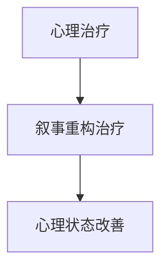

**核心算法原理讲解：**

叙事重构治疗通过以下核心算法原理实现心理治疗的效果：

1. **叙事构建：** 治疗师引导个体构建自己的叙事，包括积极和消极的经历。
2. **叙事反思：** 治疗师与个体一起分析叙事，探讨其对过去经历的解读。
3. **叙事重构：** 治疗师与个体一起重构叙事，使其更加积极、健康。

以下是一个简单的伪代码，描述了叙事重构治疗的过程：

```pseudo
function NarrativeReconstructionTherapy(Individual):
    OldNarrative = CollectNarrative(Individual)
    NewNarrative = NarrativeReflection(OldNarrative)
    ApplyNewNarrative(Individual, NewNarrative)
    return NewNarrative

function NarrativeReflection(Narrative):
    # 分析叙事中的消极元素
    NegativeElements = IdentifyNegativeElements(Narrative)
    # 重构叙事，替换消极元素
    for element in NegativeElements:
        ReplaceWithPositiveElement(element)
    return RevisedNarrative

function ApplyNewNarrative(Individual, Narrative):
    # 更新个体的心理状态
    Individual.State = UpdateState(Individual.State, Narrative)
    return Individual.State
```

**数学模型和数学公式：**

叙事重构治疗可以看作是一个从旧叙事到新叙事的转换过程，其数学模型可以表示为：

$$\text{NewState}_{\text{Psychological}} = \text{ReconstructionFunction}(\text{OldNarrative})$$

其中，$\text{ReconstructionFunction}$表示叙事重构的过程，它通过替换或调整叙事中的消极元素，生成一个更积极的新叙事，从而改善个体的心理状态。

**详细讲解与举例说明：**

假设一个个体经历了一段失败的恋爱关系，其旧叙事可能是“我总是吸引错误的人，我注定孤独”。通过叙事重构治疗，治疗师可能会引导个体重新构建故事，例如：“这次恋爱让我学会了如何识别和珍惜正确的人，我不再孤独，因为我值得拥有真正的爱情”。

**数学公式：**

$$\text{NewState}_{\text{Psychological}} = \text{ReconstructionFunction}(\text{OldNarrative}) = \text{Replace}(\text{OldNarrative}, "错误的人", "正确的人")$$

##### 1.3 生命叙事重构治疗的核心理念

**核心概念与联系：**

生命叙事重构治疗的核心理念包括：

1. **故事的力量：** 故事不仅是一种表达方式，更是一种疗愈的力量。通过叙事，个体能够反思自己的经历、理解自己的身份，并在社会中找到自己的位置。
2. **叙事重构：** 通过重构叙事，个体能够改变其对过去经历的解释和理解，从而改善其心理状态和行为。
3. **心理调节：** 叙事重构治疗旨在帮助个体调节自己的情绪、提升自信、增强自我效能感。

以下是一个Mermaid流程图，展示了生命叙事重构治疗的核心理念：

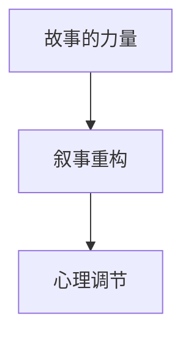

**核心算法原理讲解：**

生命叙事重构治疗通过以下核心算法原理实现心理调节的效果：

1. **叙事构建：** 治疗师引导个体构建自己的叙事，包括积极和消极的经历。
2. **叙事反思：** 治疗师与个体一起分析叙事，探讨其对过去经历的解读。
3. **叙事重构：** 治疗师与个体一起重构叙事，使其更加积极、健康。
4. **心理调整：** 通过重构叙事，个体能够调整自己的心理状态，减少负面情绪和行为。

以下是一个简单的伪代码，描述了生命叙事重构治疗的过程：

```pseudo
function NarrativeReconstructionTherapy(Individual):
    OldNarrative = CollectNarrative(Individual)
    NewNarrative = NarrativeReflection(OldNarrative)
    ApplyNewNarrative(Individual, NewNarrative)
    return Individual.State

function NarrativeReflection(Narrative):
    # 分析叙事中的消极元素
    NegativeElements = IdentifyNegativeElements(Narrative)
    # 重构叙事，替换消极元素
    for element in NegativeElements:
        ReplaceWithPositiveElement(element)
    return RevisedNarrative

function ApplyNewNarrative(Individual, Narrative):
    # 更新个体的心理状态
    Individual.State = UpdateState(Individual.State, Narrative)
    return Individual.State
```

**数学模型和数学公式：**

叙事重构治疗可以看作是一个从旧叙事到新叙事的转换过程，其数学模型可以表示为：

$$\text{NewState}_{\text{Psychological}} = \text{ReconstructionFunction}(\text{OldNarrative})$$

其中，$\text{ReconstructionFunction}$表示叙事重构的过程，它通过替换或调整叙事中的消极元素，生成一个更积极的新叙事，从而改善个体的心理状态。

**详细讲解与举例说明：**

假设一个个体经历了一次严重的职场失败，其旧叙事可能是“我一无是处，我无法胜任工作”。通过叙事重构治疗，治疗师可能会引导个体重新构建故事，例如：“这次失败让我认识到自己的不足，但我有勇气和智慧去克服困难，我将从这次经历中学习，并取得成功”。

**数学公式：**

$$\text{NewState}_{\text{Psychological}} = \text{ReconstructionFunction}(\text{OldNarrative}) = \text{Replace}(\text{OldNarrative}, "一无是处", "有勇气和智慧")$$

---

## 第二部分：叙事重构治疗的实践方法

### 第2章：叙事重构治疗的理论基础

#### 2.1 认知行为理论

**核心概念与联系：**

认知行为理论（Cognitive Behavioral Theory, CBT）是心理学中一种广泛应用的疗法，它认为个体的情绪和行为受到其认知方式的影响。CBT强调通过改变不合理的认知模式来改善情绪和行为问题。叙事重构治疗与CBT有紧密的联系，两者都关注个体的认知过程，并通过改变认知来达到治疗的目的。

以下是一个Mermaid流程图，展示了认知行为理论与叙事重构治疗之间的关系：

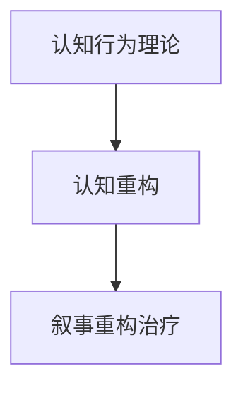

**核心算法原理讲解：**

叙事重构治疗中的认知重构过程可以基于CBT的理论框架，具体步骤如下：

1. **认知评估：** 治疗师评估个体的认知模式，识别出不合理的认知结构。
2. **认知挑战：** 治疗师与个体一起挑战不合理的认知，并探讨更合理的解释。
3. **认知重构：** 通过反复练习和讨论，个体逐渐形成新的、更积极的认知结构。

以下是一个简单的伪代码，描述了认知重构的过程：

```pseudo
function CognitiveReconstruction(Individual):
    OldCognitiveStructures = AssessCognitiveStructures(Individual)
    NewCognitiveStructures = ChallengeAndRevise(OldCognitiveStructures)
    return NewCognitiveStructures

function AssessCognitiveStructures(Individual):
    # 分析个体的认知模式
    CognitiveStructures = IdentifyCognitivePatterns(Individual)
    return CognitiveStructures

function ChallengeAndRevise(CognitiveStructures):
    # 挑战不合理的认知结构
    for structure in CognitiveStructures:
        if IsUnreasonable(structure):
            ReplaceWithReasonableStructure(structure)
    return RevisedCognitiveStructures
```

**数学模型和数学公式：**

认知重构可以看作是一个从旧认知结构到新认知结构的转换过程，其数学模型可以表示为：

$$\text{NewCognitiveStructures} = \text{ReconstructionFunction}(\text{OldCognitiveStructures})$$

其中，$\text{ReconstructionFunction}$表示认知重构的过程，它通过替换或调整不合理的认知结构，生成一个更合理的认知结构。

**详细讲解与举例说明：**

假设一个个体有“我总是失败”的认知模式，这是一种不合理的认知。通过叙事重构治疗，治疗师可能会引导个体识别并挑战这种认知，例如：“我虽然有失败的经历，但我也有成功的时刻，我可以从失败中学习，取得更好的结果”。

**数学公式：**

$$\text{NewCognitiveStructures} = \text{ReconstructionFunction}(\text{OldCognitiveStructures}) = \text{Replace}(\text{OldCognitiveStructures}, "总是失败", "有成功和失败，可以学习")$$

#### 2.2 主体间性理论

**核心概念与联系：**

主体间性理论（Inter-subjectivity Theory）强调个体不是孤立的存在，而是通过与他人的互动和对话来构建自己的身份和意义。叙事重构治疗中的主体间性理论认为，个体的叙事不仅是个体的心理活动，也是与他人交流和互动的过程。通过重构叙事，个体不仅改变了自己的认知和行为，也影响了与他人的关系。

以下是一个Mermaid流程图，展示了主体间性理论在叙事重构治疗中的应用：

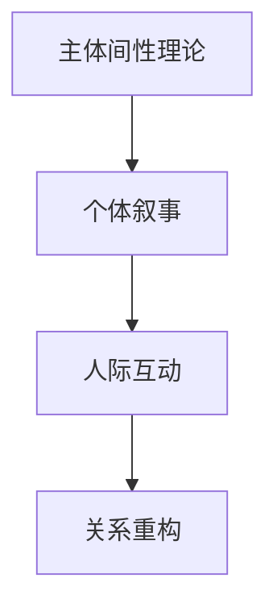

**核心算法原理讲解：**

主体间性理论在叙事重构治疗中的应用可以通过以下算法原理实现：

1. **叙事分享：** 治疗师鼓励个体与家人、朋友或治疗师分享自己的叙事。
2. **叙事讨论：** 治疗师与个体一起讨论叙事，探讨其与他人的关系和互动。
3. **叙事重构：** 通过与他人互动，个体可以重构自己的叙事，使其更加积极、健康。

以下是一个简单的伪代码，描述了主体间性理论在叙事重构治疗中的应用：

```pseudo
function InterSubjectivityNarrativeReconstruction(Individual):
    Narrative = CollectNarrative(Individual)
    Interactions = ShareAndDiscussNarrative(Narrative)
    RevisedNarrative = IntegrateInteractions(Interactions, Narrative)
    return RevisedNarrative

function ShareAndDiscussNarrative(Narrative):
    # 与他人分享叙事
    Participants = SelectParticipants(Individual)
    Discussions = InitiateDiscussions(Participants, Narrative)
    return Discussions

function IntegrateInteractions(Interactions, Narrative):
    # 重构叙事，整合他人反馈
    for interaction in Interactions:
        if IsPositiveFeedback(interaction):
            IntegratePositiveFeedback(Narrative, interaction)
    return RevisedNarrative
```

**数学模型和数学公式：**

主体间性理论在叙事重构治疗中的应用可以看作是一个从单一叙事到综合叙事的转换过程，其数学模型可以表示为：

$$\text{RevisedNarrative} = \text{IntegrationFunction}(\text{Narrative}, \text{Interactions})$$

其中，$\text{IntegrationFunction}$表示叙事整合的过程，它通过整合他人的反馈，生成一个更全面、更积极的叙事。

**详细讲解与举例说明：**

假设一个个体在与朋友分享自己的职业困境后，收到了朋友的积极反馈和鼓励。通过主体间性理论的叙事重构，个体可能会重新构建自己的叙事，使其更加积极，例如：“我面临挑战，但我并不孤单，我有朋友的支持和鼓励，我将克服困难”。

**数学公式：**

$$\text{RevisedNarrative} = \text{IntegrationFunction}(\text{Narrative}, \text{Interactions}) = \text{Add}(\text{Narrative}, "我有朋友的支持和鼓励")$$

#### 2.3 叙事治疗的哲学基础

**核心概念与联系：**

叙事治疗的哲学基础源于哲学思想，特别是存在主义和现象学。存在主义强调个体的自由意志和选择，现象学则关注个体的主观经验和意义构建。叙事治疗认为，个体的叙事不仅是一种表达方式，更是个体存在的意义和价值的体现。

以下是一个Mermaid流程图，展示了叙事治疗的哲学基础：

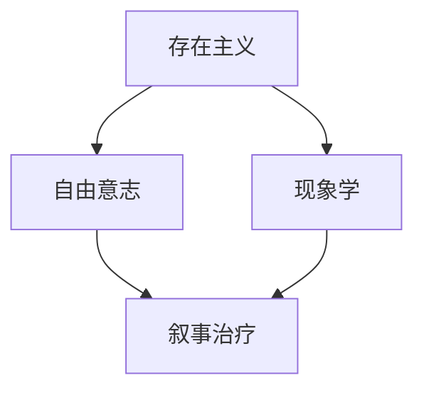

**核心算法原理讲解：**

叙事治疗的哲学基础通过以下核心算法原理实现个体的自我疗愈：

1. **叙事表达：** 治疗师鼓励个体通过叙事来表达自己的内在体验和感受。
2. **叙事理解：** 治疗师帮助个体理解其叙事背后的意义和影响。
3. **叙事重构：** 通过重构叙事，个体能够重新发现自我，并构建新的意义和目标。

以下是一个简单的伪代码，描述了叙事治疗的哲学基础：

```pseudo
function NarrativeTherapy(Individual):
    Narrative = ExpressNarrative(Individual)
    Understanding = InterpretNarrative(Narrative)
    RevisedNarrative = ReconstructNarrative(Individual, Understanding)
    return RevisedNarrative

function ExpressNarrative(Individual):
    # 鼓励个体表达叙事
    Expression = CollectIndividualNarrative(Individual)
    return Expression

function InterpretNarrative(Narrative):
    # 帮助个体理解叙事
    Understanding = AnalyzeNarrative(Narrative)
    return Understanding

function ReconstructNarrative(Individual, Understanding):
    # 重构叙事，发现新意义
    RevisedNarrative = IntegrateUnderstanding(Narrative, Understanding)
    return RevisedNarrative
```

**数学模型和数学公式：**

叙事治疗的哲学基础可以看作是一个从原始叙事到重构叙事的转换过程，其数学模型可以表示为：

$$\text{RevisedNarrative} = \text{ReconstructionFunction}(\text{Narrative}, \text{Understanding})$$

其中，$\text{ReconstructionFunction}$表示叙事重构的过程，它通过整合个体的理解和体验，生成一个更丰富、更有意义的叙事。

**详细讲解与举例说明：**

假设一个个体经历了一段失败的恋爱关系，其原始叙事可能是“我无法找到真爱”。通过叙事治疗的哲学基础，治疗师可能会引导个体表达自己的叙事，并帮助其理解叙事背后的情感和信念。通过重构叙事，个体可能会发现新的意义，例如：“虽然这次恋爱失败了，但我学会了如何去爱，我将更好地面对未来的关系”。

**数学公式：**

$$\text{RevisedNarrative} = \text{ReconstructionFunction}(\text{Narrative}, \text{Understanding}) = \text{Add}(\text{Narrative}, "学会了如何去爱，将更好地面对未来")$$

---

## 第三部分：叙事重构治疗的实践方法

### 第3章：叙事重构治疗的基本步骤

#### 3.1 治疗关系的建立

**核心概念与联系：**

治疗关系（Therapeutic Relationship）是叙事重构治疗的基础，它是指治疗师与个体之间建立的一种特殊的人际关系。这种关系基于信任、尊重和理解，为个体提供了一个安全的环境，使其能够自由地表达自己的叙事。

以下是一个Mermaid流程图，展示了治疗关系的建立过程：

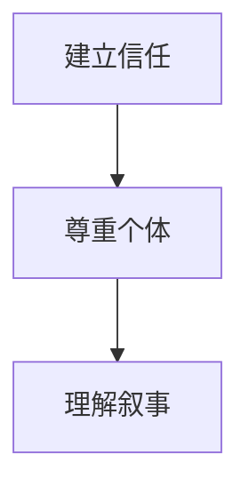

**核心算法原理讲解：**

建立治疗关系可以通过以下核心算法原理实现：

1. **信任建立：** 治疗师通过真诚、共情和积极倾听，与个体建立信任。
2. **尊重个体：** 治疗师尊重个体的叙事，不对其进行评判或指导。
3. **理解叙事：** 治疗师通过深入理解个体的叙事，帮助其重构故事。

以下是一个简单的伪代码，描述了治疗关系的建立过程：

```pseudo
function BuildTherapeuticRelationship(Therapist, Individual):
    Trust = EstablishTrust(Therapist, Individual)
    Respect = RespectIndividual(Therapist, Individual)
    Understanding = UnderstandNarrative(Therapist, Individual)
    return Relationship

function EstablishTrust(Therapist, Individual):
    # 通过真诚和共情建立信任
    Trust = True
    return Trust

function RespectIndividual(Therapist, Individual):
    # 尊重个体的叙事
    Respect = True
    return Respect

function UnderstandNarrative(Therapist, Individual):
    # 深入理解个体的叙事
    Understanding = DeepUnderstand(Individual.Narrative)
    return Understanding
```

**数学模型和数学公式：**

治疗关系的建立可以看作是一个从初始状态到稳定状态的转换过程，其数学模型可以表示为：

$$\text{StableRelationship}_{\text{新}} = \text{BuildingFunction}(\text{InitialRelationship})$$

其中，$\text{BuildingFunction}$表示治疗关系的建立过程，它通过建立信任、尊重和理解，使关系达到稳定状态。

**详细讲解与举例说明：**

假设一个治疗师与个体第一次会面，通过真诚的交流、共情和理解，建立了初步的信任。在随后的治疗过程中，治疗师继续尊重个体的叙事，并深入理解其经历，从而建立了稳定的治疗关系。

**数学公式：**

$$\text{StableRelationship}_{\text{新}} = \text{BuildingFunction}(\text{InitialRelationship}) = \text{AddTrust}(\text{InitialRelationship})$$

#### 3.2 故事回顾与反思

**核心概念与联系：**

故事回顾与反思（Narrative Review and Reflection）是叙事重构治疗中的重要步骤，它涉及个体对自己故事的回顾和反思。通过这个过程，个体能够深入理解自己的经历，发现潜在的情感和行为模式，并为叙事重构打下基础。

以下是一个Mermaid流程图，展示了故事回顾与反思的过程：

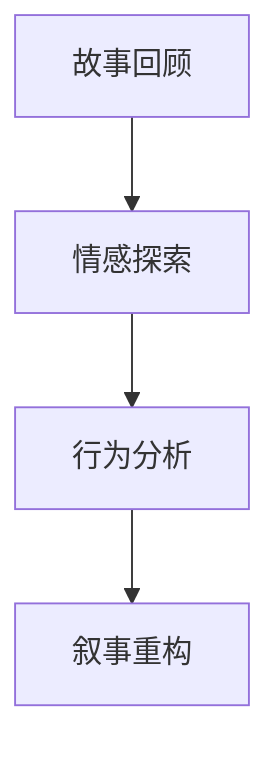

**核心算法原理讲解：**

故事回顾与反思可以通过以下核心算法原理实现：

1. **故事回顾：** 治疗师引导个体详细回顾其经历，讲述自己的故事。
2. **情感探索：** 治疗师与个体一起探讨故事中的情感体验，理解其情绪反应。
3. **行为分析：** 治疗师与个体一起分析故事中的行为模式，识别出潜在的问题。
4. **叙事重构：** 治疗师与个体一起重构故事，使其更加积极、健康。

以下是一个简单的伪代码，描述了故事回顾与反思的过程：

```pseudo
function NarrativeReviewAndReflection(Individual, Therapist):
    Narrative = CollectNarrative(Individual)
    Emotions = ExploreEmotions(Narrative)
    Behaviors = AnalyzeBehaviors(Narrative)
    RevisedNarrative = ReconstructNarrative(Narrative, Emotions, Behaviors)
    return RevisedNarrative

function CollectNarrative(Individual):
    # 收集个体的故事
    Narrative = Individual.TellNarrative()
    return Narrative

function ExploreEmotions(Narrative):
    # 探讨故事中的情感体验
    Emotions = IdentifyEmotionalExperiences(Narrative)
    return Emotions

function AnalyzeBehaviors(Narrative):
    # 分析故事中的行为模式
    Behaviors = IdentifyBehaviorPatterns(Narrative)
    return Behaviors

function ReconstructNarrative(Narrative, Emotions, Behaviors):
    # 重构故事，整合情感和行为
    RevisedNarrative = IntegrateEmotionsAndBehaviors(Narrative, Emotions, Behaviors)
    return RevisedNarrative
```

**数学模型和数学公式：**

故事回顾与反思可以看作是一个从原始叙事到重构叙事的转换过程，其数学模型可以表示为：

$$\text{RevisedNarrative} = \text{ReconstructionFunction}(\text{Narrative}, \text{Emotions}, \text{Behaviors})$$

其中，$\text{ReconstructionFunction}$表示叙事重构的过程，它通过整合情感和行为，生成一个更丰富、更积极的叙事。

**详细讲解与举例说明：**

假设一个个体在叙事重构治疗中回顾了自己的一段童年经历，治疗师引导其探讨故事中的情感体验和行为模式。通过这个过程，个体发现了自己在面对家庭冲突时的情感反应和行为模式，并开始重构自己的故事，使其更加积极。

**数学公式：**

$$\text{RevisedNarrative} = \text{ReconstructionFunction}(\text{Narrative}, \text{Emotions}, \text{Behaviors}) = \text{Integrate}(\text{Narrative}, \text{Emotions}, \text{Behaviors})$$

#### 3.3 故事重构与叙事工作

**核心概念与联系：**

故事重构与叙事工作（Narrative Reconstruction and Narrative Work）是叙事重构治疗中的关键步骤，它涉及治疗师与个体一起重构和修改叙事，以改变其对过去经历的解读和理解。

以下是一个Mermaid流程图，展示了故事重构与叙事工作的过程：

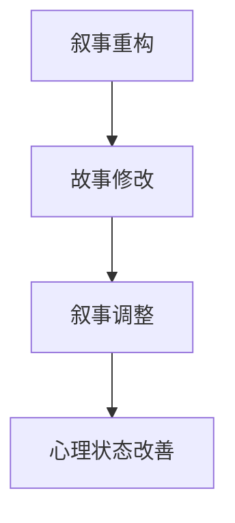

**核心算法原理讲解：**

故事重构与叙事工作可以通过以下核心算法原理实现：

1. **叙事重构：** 治疗师引导个体重新构建其叙事，使其更加积极、健康。
2. **故事修改：** 治疗师与个体一起修改叙事中的负面元素，替换为积极的元素。
3. **叙事调整：** 治疗师帮助个体调整叙事的结构和叙述方式，使其更加流畅和有力。
4. **心理状态改善：** 通过重构和修改叙事，个体的心理状态得到改善。

以下是一个简单的伪代码，描述了故事重构与叙事工作的过程：

```pseudo
function NarrativeReconstructionAndWork(Individual, Therapist):
    OldNarrative = CollectOldNarrative(Individual)
    NewNarrative = ReconstructNarrative(OldNarrative)
    ModifiedNarrative = ModifyNarrative(NewNarrative)
    FinalNarrative = AdjustNarrative(ModifiedNarrative)
    return FinalNarrative

function CollectOldNarrative(Individual):
    # 收集个体的原始叙事
    OldNarrative = Individual.TellOldNarrative()
    return OldNarrative

function ReconstructNarrative(OldNarrative):
    # 重构叙事
    NewNarrative = ReplaceNegativeElements(OldNarrative)
    return NewNarrative

function ModifyNarrative(NewNarrative):
    # 修改叙事中的负面元素
    ModifiedNarrative = ReplaceWithPositiveElements(NewNarrative)
    return ModifiedNarrative

function AdjustNarrative(ModifiedNarrative):
    # 调整叙事的结构和叙述方式
    FinalNarrative = ImproveNarrativeFlow(ModifiedNarrative)
    return FinalNarrative
```

**数学模型和数学公式：**

故事重构与叙事工作可以看作是一个从原始叙事到重构叙事的转换过程，其数学模型可以表示为：

$$\text{FinalNarrative} = \text{AdjustmentFunction}(\text{ModifiedNarrative})$$

其中，$\text{AdjustmentFunction}$表示叙事调整的过程，它通过替换负面元素和改善叙事的流畅性，生成一个更积极、更健康的叙事。

**详细讲解与举例说明：**

假设一个个体在叙事重构治疗中，其原始叙事是“我总是失败，我一无是处”。通过治疗师的帮助，个体重构了叙事，使其更加积极，例如：“虽然我遇到了失败，但我学会了如何从失败中汲取教训，我将取得成功”。通过这个过程，个体的心理状态得到了显著改善。

**数学公式：**

$$\text{FinalNarrative} = \text{AdjustmentFunction}(\text{ModifiedNarrative}) = \text{Replace}(\text{ModifiedNarrative}, "失败", "从失败中学习")$$

#### 3.4 目标设定与行动计划

**核心概念与联系：**

目标设定与行动计划（Goal Setting and Action Planning）是叙事重构治疗中的关键步骤，它涉及治疗师与个体一起设定具体的目标，并制定实现这些目标的行动计划。通过这个过程，个体能够明确自己的目标，并为实现这些目标采取行动。

以下是一个Mermaid流程图，展示了目标设定与行动计划的过程：

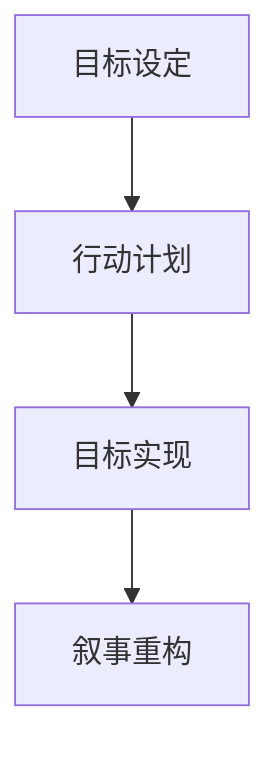

**核心算法原理讲解：**

目标设定与行动计划可以通过以下核心算法原理实现：

1. **目标设定：** 治疗师与个体一起确定具体的目标，这些目标应当是可衡量、可实现的。
2. **行动计划：** 治疗师与个体一起制定实现目标的行动计划，包括具体的行动步骤和时间表。
3. **目标实现：** 治疗师与个体一起监控目标的实现情况，并根据需要调整行动计划。
4. **叙事重构：** 通过实现目标，个体的叙事得到重构，使其更加积极、健康。

以下是一个简单的伪代码，描述了目标设定与行动计划的过程：

```pseudo
function GoalSettingAndActionPlanning(Individual, Therapist):
    Goals = SetGoals(Individual)
    Plan = CreateActionPlan(Goals)
    Implementation = MonitorAndAdjust(Plan)
    Success = AchieveGoals(Goals, Implementation)
    return Success

function SetGoals(Individual):
    # 确定具体的目标
    Goals = CollectIndividualGoals(Individual)
    return Goals

function CreateActionPlan(Goals):
    # 制定行动计划
    Plan = DefineActionSteps(Goals)
    return Plan

function MonitorAndAdjust(Plan):
    # 监控和调整行动计划
    Adjustment = MonitorProgress(Plan)
    return Adjustment

function AchieveGoals(Goals, Implementation):
    # 实现目标
    Success = CompleteGoals(Goals, Implementation)
    return Success
```

**数学模型和数学公式：**

目标设定与行动计划可以看作是一个从目标设定到目标实现的转换过程，其数学模型可以表示为：

$$\text{Success}_{\text{目标}} = \text{AchievementFunction}(\text{Goals}, \text{Implementation})$$

其中，$\text{AchievementFunction}$表示目标实现的过程，它通过实现目标，使个体的叙事得到重构。

**详细讲解与举例说明：**

假设一个个体在叙事重构治疗中设定了一个目标：“在未来三个月内，我将每天锻炼一小时”。通过治疗师的帮助，个体制定了具体的行动计划，并在随后的三个月内实现了这一目标。通过这个过程，个体的叙事得到了重构，使其更加积极、健康。

**数学公式：**

$$\text{Success}_{\text{目标}} = \text{AchievementFunction}(\text{Goals}, \text{Implementation}) = \text{Achieve}(\text{Goals}, \text{ExercisePlan})$$

---

## 第三部分：叙事重构治疗的实践方法

### 第4章：叙事重构治疗的核心技巧

#### 4.1 提问技巧

**核心概念与联系：**

提问技巧（Questioning Skills）是叙事重构治疗中的一项重要技能，它涉及治疗师如何通过提问引导个体深入反思自己的叙事。有效的提问可以帮助个体发现潜在的情感、信念和行为模式，从而为叙事重构提供基础。

以下是一个Mermaid流程图，展示了提问技巧的应用：

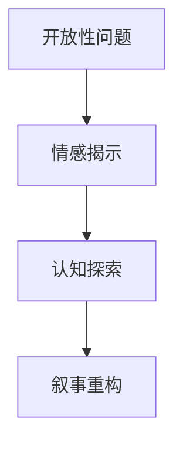

**核心算法原理讲解：**

提问技巧可以通过以下核心算法原理实现：

1. **开放性问题：** 治疗师使用开放性问题引导个体表达自己的情感和想法。
2. **情感揭示：** 通过开放性问题，个体能够揭示隐藏的情感和信念。
3. **认知探索：** 治疗师通过提问引导个体探索其认知模式，识别出潜在的问题。
4. **叙事重构：** 通过提问技巧，个体能够更深入地反思自己的叙事，为重构叙事提供基础。

以下是一个简单的伪代码，描述了提问技巧的应用：

```pseudo
function QuestioningSkills(Therapist, Individual):
    OpenQuestions = GenerateOpenQuestions()
    EmotionalRevelations = CollectEmotionalRevelations(OpenQuestions, Individual)
    CognitiveExploration = AnalyzeCognitivePatterns(EmotionalRevelations)
    NarrativeReconstruction = ReconstructNarrative(CognitiveExploration)
    return NarrativeReconstruction

function GenerateOpenQuestions():
    # 生成开放性问题
    Questions = ["你能告诉我这次经历让你有什么感受？", "你相信什么会导致这些感受？", "你觉得你可以改变什么？"]
    return Questions

function CollectEmotionalRevelations(Questions, Individual):
    # 收集情感揭示
    Revelations = Individual.AnswerQuestions(Questions)
    return Revelations

function AnalyzeCognitivePatterns(Revelations):
    # 分析认知模式
    Patterns = IdentifyCognitivePatterns(Revelations)
    return Patterns

function ReconstructNarrative(Patterns):
    # 重构叙事
    Narrative = ReviseNarrative(Patterns)
    return Narrative
```

**数学模型和数学公式：**

提问技巧可以看作是一个从情感揭示到认知重构的转换过程，其数学模型可以表示为：

$$\text{RevisedNarrative} = \text{ReconstructionFunction}(\text{EmotionalRevelations}, \text{CognitivePatterns})$$

其中，$\text{ReconstructionFunction}$表示叙事重构的过程，它通过整合情感揭示和认知模式，生成一个更积极、更健康的叙事。

**详细讲解与举例说明：**

假设治疗师使用开放性问题引导个体：“你能告诉我当你感到焦虑时，你通常在想什么？”个体回答：“我总是担心我会失败”。通过这个过程，治疗师能够引导个体进一步反思其焦虑背后的认知模式，从而为叙事重构打下基础。

**数学公式：**

$$\text{RevisedNarrative} = \text{ReconstructionFunction}(\text{EmotionalRevelations}, \text{CognitivePatterns}) = \text{Replace}(\text{Narrative}, "失败", "从失败中学习")$$

#### 4.2 反馈技巧

**核心概念与联系：**

反馈技巧（Feedback Skills）是叙事重构治疗中的一项关键技能，它涉及治疗师如何给予个体积极的反馈，以支持其叙事重构过程。有效的反馈可以帮助个体认识到自己的进步，增强其改变的动力。

以下是一个Mermaid流程图，展示了反馈技巧的应用：

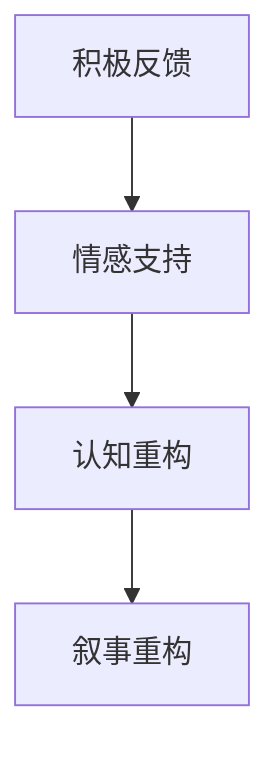

**核心算法原理讲解：**

反馈技巧可以通过以下核心算法原理实现：

1. **积极反馈：** 治疗师给予个体积极的反馈，强调其努力和进步。
2. **情感支持：** 通过积极反馈，个体能够感受到情感上的支持，增强信心。
3. **认知重构：** 治疗师通过反馈引导个体反思其认知模式，促进认知重构。
4. **叙事重构：** 通过积极的反馈和情感支持，个体能够更积极地重构叙事。

以下是一个简单的伪代码，描述了反馈技巧的应用：

```pseudo
function FeedbackSkills(Therapist, Individual):
    PositiveFeedback = GeneratePositiveFeedback()
    EmotionalSupport = ProvideEmotionalSupport(PositiveFeedback)
    CognitiveReconstruction = GuideCognitiveReconstruction(EmotionalSupport)
    NarrativeReconstruction = ReconstructNarrative(CognitiveReconstruction)
    return NarrativeReconstruction

function GeneratePositiveFeedback():
    # 生成积极反馈
    Feedback = ["你的努力真的很值得称赞", "我看到了你的进步，这非常鼓舞人心", "你做得很好，继续保持"]
    return Feedback

function ProvideEmotionalSupport(Feedback):
    # 提供情感支持
    Support = AddEmotionalContent(Feedback)
    return Support

function GuideCognitiveReconstruction(Support):
    # 引导认知重构
    Reconstruction = ModifyCognitivePatterns(Support)
    return Reconstruction

function ReconstructNarrative(Reconstruction):
    # 重构叙事
    Narrative = ReviseNarrative(Reconstruction)
    return Narrative
```

**数学模型和数学公式：**

反馈技巧可以看作是一个从情感支持到认知重构的转换过程，其数学模型可以表示为：

$$\text{RevisedNarrative} = \text{ReconstructionFunction}(\text{EmotionalSupport}, \text{CognitiveReconstruction})$$

其中，$\text{ReconstructionFunction}$表示叙事重构的过程，它通过整合情感支持和认知重构，生成一个更积极、更健康的叙事。

**详细讲解与举例说明：**

假设治疗师在个体完成一项任务后给予积极反馈：“你的表现真的很棒，你投入了大量的努力，这个成果证明了你的能力”。通过这个过程，个体能够感受到情感上的支持，增强自信，从而促进其认知重构和叙事重构。

**数学公式：**

$$\text{RevisedNarrative} = \text{ReconstructionFunction}(\text{EmotionalSupport}, \text{CognitiveReconstruction}) = \text{Add}(\text{Narrative}, "你的努力和成就是值得称赞的")$$

#### 4.3 共情技巧

**核心概念与联系：**

共情技巧（Empathy Skills）是叙事重构治疗中的一项重要技能，它涉及治疗师如何理解并表达对个体情感的共鸣。共情能够建立治疗师与个体之间的信任，为叙事重构创造一个安全的环境。

以下是一个Mermaid流程图，展示了共情技巧的应用：

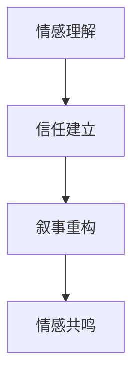

**核心算法原理讲解：**

共情技巧可以通过以下核心算法原理实现：

1. **情感理解：** 治疗师通过倾听和理解，深入理解个体的情感体验。
2. **信任建立：** 通过情感理解，治疗师与个体建立信任，为叙事重构创造一个安全的环境。
3. **叙事重构：** 治疗师通过共情，引导个体重构叙事，使其更加积极、健康。
4. **情感共鸣：** 治疗师的共情能够激发个体的情感共鸣，增强其改变的动力。

以下是一个简单的伪代码，描述了共情技巧的应用：

```pseudo
function EmpathySkills(Therapist, Individual):
    EmotionalUnderstanding = UnderstandEmotions(Individual)
    TrustBuilding = EstablishTrust(EmotionalUnderstanding)
    NarrativeReconstruction = GuideNarrativeReconstruction(TrustBuilding)
    EmotionalResonance = CreateEmotionalResonance(NarrativeReconstruction)
    return EmotionalResonance

function UnderstandEmotions(Individual):
    # 理解情感
    Understanding = IdentifyEmotionalExperiences(Individual)
    return Understanding

function EstablishTrust(EmotionalUnderstanding):
    # 建立信任
    Trust = BuildTrust(EmotionalUnderstanding)
    return Trust

function GuideNarrativeReconstruction(Trust):
    # 引导叙事重构
    Reconstruction = ReconstructNarrative(Trust)
    return Reconstruction

function CreateEmotionalResonance(Reconstruction):
    # 创造情感共鸣
    Resonance = EnhanceEmotionalConnection(Reconstruction)
    return Resonance
```

**数学模型和数学公式：**

共情技巧可以看作是一个从情感理解到情感共鸣的转换过程，其数学模型可以表示为：

$$\text{EmotionalResonance}_{\text{新}} = \text{ResonanceFunction}(\text{EmotionalUnderstanding}, \text{Reconstruction})$$

其中，$\text{ResonanceFunction}$表示情感共鸣的过程，它通过整合情感理解和叙事重构，生成一个更强的情感共鸣。

**详细讲解与举例说明：**

假设治疗师在个体讲述其困境时，表达了对个体情感的共鸣：“我理解你的感受，这确实很困难”。通过这个过程，个体能够感受到治疗师的共情，增强其对叙事重构的信心，从而促进情感共鸣。

**数学公式：**

$$\text{EmotionalResonance}_{\text{新}} = \text{ResonanceFunction}(\text{EmotionalUnderstanding}, \text{Reconstruction}) = \text{Add}(\text{EmotionalUnderstanding}, "共情")$$

#### 4.4 模拟技巧

**核心概念与联系：**

模拟技巧（Simulation Skills）是叙事重构治疗中的一种策略，它涉及治疗师与个体一起模拟不同的情境，以帮助个体更好地理解自己的叙事和行为模式。通过模拟，个体能够在安全的环境中测试不同的反应方式，从而为叙事重构提供新的视角。

以下是一个Mermaid流程图，展示了模拟技巧的应用：

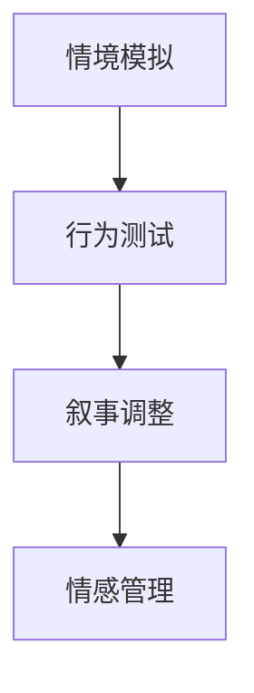

**核心算法原理讲解：**

模拟技巧可以通过以下核心算法原理实现：

1. **情境模拟：** 治疗师与个体一起创造不同的情境，模拟个体在这些情境中的行为和反应。
2. **行为测试：** 通过模拟，个体能够测试不同的反应方式，了解其行为对情境的影响。
3. **叙事调整：** 治疗师与个体一起分析模拟结果，调整叙事中的行为模式。
4. **情感管理：** 通过模拟技巧，个体能够学习更有效的情感管理策略，从而改善其心理状态。

以下是一个简单的伪代码，描述了模拟技巧的应用：

```pseudo
function SimulationSkills(Therapist, Individual):
    Simulations = CreateSimulations()
    BehavioralTests = PerformBehavioralTests(Simulations, Individual)
    NarrativeAdjustments = AnalyzeSimulationResults(BehavioralTests)
    EmotionalManagement = EnhanceEmotionalControl(NarrativeAdjustments)
    return EmotionalManagement

function CreateSimulations():
    # 创建情境模拟
    Simulations = DefineSimulationScenarios()
    return Simulations

function PerformBehavioralTests(Simulations, Individual):
    # 进行行为测试
    Tests = TestBehaviors(Simulations, Individual)
    return Tests

function AnalyzeSimulationResults(Tests):
    # 分析模拟结果
    Adjustments = IdentifyAdjustments(Tests)
    return Adjustments

function EnhanceEmotionalControl(Adjustments):
    # 提高情感管理能力
    Control = ImproveEmotionalManagement(Adjustments)
    return Control
```

**数学模型和数学公式：**

模拟技巧可以看作是一个从情境模拟到情感管理的转换过程，其数学模型可以表示为：

$$\text{EmotionalManagement}_{\text{新}} = \text{SimulationFunction}(\text{Simulations}, \text{Adjustments})$$

其中，$\text{SimulationFunction}$表示模拟技巧的过程，它通过模拟情境和调整叙事，生成一个更有效的情感管理策略。

**详细讲解与举例说明：**

假设治疗师与个体一起模拟了一个面试情境，个体在模拟中尝试了不同的面试策略。通过分析模拟结果，个体能够了解自己的行为对面试结果的影响，从而调整自己的叙事，提高面试时的表现。这个过程帮助个体更好地管理自己的情感，增强了其自信心。

**数学公式：**

$$\text{EmotionalManagement}_{\text{新}} = \text{SimulationFunction}(\text{Simulations}, \text{Adjustments}) = \text{Improve}(\text{EmotionalControl}, \text{SimulationResults})$$

---

## 第三部分：叙事重构治疗的实践方法

### 第5章：叙事重构治疗在具体情境中的应用

#### 5.1 心理创伤的治疗

**核心概念与联系：**

心理创伤治疗（Trauma Treatment）是叙事重构治疗中的一个重要应用领域。心理创伤是指由于极端压力或创伤性事件导致的长期心理困扰。叙事重构治疗通过重构个体的创伤叙事，帮助其减轻痛苦和恢复心理平衡。

以下是一个Mermaid流程图，展示了心理创伤治疗的应用：

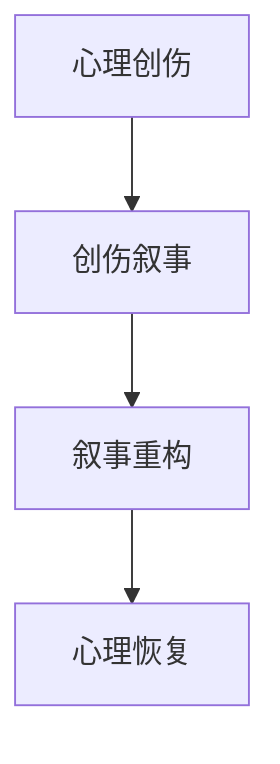

**核心算法原理讲解：**

心理创伤的治疗可以通过以下核心算法原理实现：

1. **创伤叙事：** 治疗师引导个体回顾创伤经历，构建其创伤叙事。
2. **叙事重构：** 治疗师与个体一起重构创伤叙事，减少其负面情绪和认知。
3. **心理恢复：** 通过重构叙事，个体能够恢复心理平衡，减少创伤后遗症。

以下是一个简单的伪代码，描述了心理创伤治疗的过程：

```pseudo
function TraumaTreatment(Individual, Therapist):
    TraumaticNarrative = CollectTraumaticNarrative(Individual)
    ReconstructedNarrative = ReconstructTraumaticNarrative(TraumaticNarrative)
    PsychologicalRecovery = AchievePsychologicalBalance(ReconstructedNarrative)
    return PsychologicalRecovery

function CollectTraumaticNarrative(Individual):
    # 收集创伤叙事
    Narrative = Individual.TellTraumaticNarrative()
    return Narrative

function ReconstructTraumaticNarrative(Narrative):
    # 重构创伤叙事
    ReconstructedNarrative = ModifyNarrative(Narrative)
    return ReconstructedNarrative

function AchievePsychologicalBalance(ReconstructedNarrative):
    # 实现心理平衡
    Balance = ReduceNegativeEmotions(ReconstructedNarrative)
    return Balance
```

**数学模型和数学公式：**

心理创伤的治疗可以看作是一个从创伤叙事到心理平衡的转换过程，其数学模型可以表示为：

$$\text{PsychologicalBalance}_{\text{新}} = \text{ReconstructionFunction}(\text{TraumaticNarrative})$$

其中，$\text{ReconstructionFunction}$表示叙事重构的过程，它通过重构创伤叙事，帮助个体实现心理平衡。

**详细讲解与举例说明：**

假设一个个体在战争中经历了严重的创伤，其创伤叙事是“我无法忘记那些恐怖的场景，我害怕再次经历那样的痛苦”。通过叙事重构治疗，治疗师帮助个体重构叙事，例如：“虽然那是一次恐怖的经历，但我已经学会了如何应对恐惧，我将勇敢地面对未来”。通过这个过程，个体的心理平衡得到了显著改善。

**数学公式：**

$$\text{PsychologicalBalance}_{\text{新}} = \text{ReconstructionFunction}(\text{TraumaticNarrative}) = \text{Replace}(\text{TraumaticNarrative}, "恐怖", "勇敢面对")$$

#### 5.2 家庭治疗中的叙事重构

**核心概念与联系：**

家庭治疗（Family Therapy）是一种以家庭为单位的心理治疗形式，旨在解决家庭成员之间的心理问题和情感困扰。叙事重构治疗在家庭治疗中的应用，通过重构家庭成员之间的叙事，改善家庭关系。

以下是一个Mermaid流程图，展示了家庭治疗中的叙事重构：

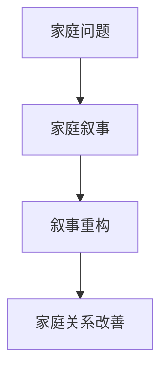

**核心算法原理讲解：**

家庭治疗中的叙事重构可以通过以下核心算法原理实现：

1. **家庭叙事：** 治疗师引导家庭成员回顾家庭经历，构建家庭叙事。
2. **叙事重构：** 治疗师与家庭成员一起重构家庭叙事，消除负面元素。
3. **家庭关系改善：** 通过重构叙事，家庭成员能够改善彼此的关系，建立更健康的家庭动态。

以下是一个简单的伪代码，描述了家庭治疗中的叙事重构：

```pseudo
function FamilyTherapy(Narrative, Members):
    FamilyNarrative = CollectFamilyNarrative(Members)
    ReconstructedNarrative = ReconstructFamilyNarrative(FamilyNarrative)
    ImprovedRelationships = EnhanceFamilyRelationships(ReconstructedNarrative)
    return ImprovedRelationships

function CollectFamilyNarrative(Members):
    # 收集家庭叙事
    Narrative = Members.TellFamilyNarrative()
    return Narrative

function ReconstructFamilyNarrative(Narrative):
    # 重构家庭叙事
    ReconstructedNarrative = ModifyNarrative(Narrative)
    return ReconstructedNarrative

function EnhanceFamilyRelationships(ReconstructedNarrative):
    # 改善家庭关系
    Relationships = ImproveFamilyDynamics(ReconstructedNarrative)
    return Relationships
```

**数学模型和数学公式：**

家庭治疗中的叙事重构可以看作是一个从家庭叙事到家庭关系的转换过程，其数学模型可以表示为：

$$\text{ImprovedRelationships}_{\text{新}} = \text{ReconstructionFunction}(\text{FamilyNarrative})$$

其中，$\text{ReconstructionFunction}$表示叙事重构的过程，它通过重构家庭叙事，改善家庭关系。

**详细讲解与举例说明：**

假设一个家庭因为成员之间的矛盾而关系紧张，家庭成员的叙事充满了指责和不满。通过叙事重构治疗，治疗师帮助家庭成员重构叙事，例如：“虽然我们有过争执，但我们都有责任改善彼此的关系”。通过这个过程，家庭成员能够减少冲突，建立更和谐的家庭关系。

**数学公式：**

$$\text{ImprovedRelationships}_{\text{新}} = \text{ReconstructionFunction}(\text{FamilyNarrative}) = \text{Replace}(\text{Narrative}, "指责", "共同责任")$$

#### 5.3 焦虑与抑郁的治疗

**核心概念与联系：**

焦虑和抑郁是常见的心理健康问题，它们对个体的生活质量和功能产生影响。叙事重构治疗在焦虑和抑郁的治疗中发挥作用，通过重构个体的叙事，减轻负面情绪，提升心理功能。

以下是一个Mermaid流程图，展示了焦虑与抑郁的治疗：

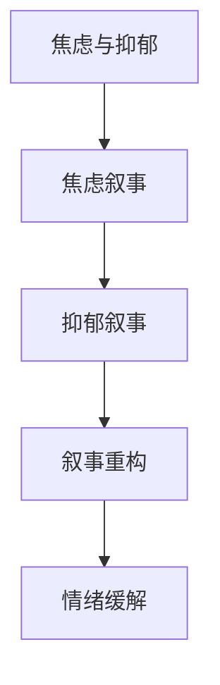

**核心算法原理讲解：**

焦虑与抑郁的治疗可以通过以下核心算法原理实现：

1. **焦虑叙事：** 治疗师引导个体回顾焦虑事件，构建焦虑叙事。
2. **抑郁叙事：** 治疗师引导个体回顾抑郁情绪的根源，构建抑郁叙事。
3. **叙事重构：** 治疗师与个体一起重构焦虑和抑郁叙事，减少负面情绪。
4. **情绪缓解：** 通过重构叙事，个体能够减轻焦虑和抑郁的情绪。

以下是一个简单的伪代码，描述了焦虑与抑郁的治疗：

```pseudo
function AnxietyAndDepressionTreatment(Individual, Therapist):
    AnxietyNarrative = CollectAnxietyNarrative(Individual)
    DepressionNarrative = CollectDepressionNarrative(Individual)
    ReconstructedNarratives = ReconstructNarratives(AnxietyNarrative, DepressionNarrative)
    EmotionalRelief = ReduceNegativeEmotions(ReconstructedNarratives)
    return EmotionalRelief

function CollectAnxietyNarrative(Individual):
    # 收集焦虑叙事
    Narrative = Individual.TellAnxietyNarrative()
    return Narrative

function CollectDepressionNarrative(Individual):
    # 收集抑郁叙事
    Narrative = Individual.TellDepressionNarrative()
    return Narrative

function ReconstructNarratives(AnxietyNarrative, DepressionNarrative):
    # 重构叙事
    ReconstructedNarrative = ModifyNarratives(AnxietyNarrative, DepressionNarrative)
    return ReconstructedNarrative

function ReduceNegativeEmotions(ReconstructedNarrative):
    # 减轻负面情绪
    Relief = ReduceAnxietyAndDepression(ReconstructedNarrative)
    return Relief
```

**数学模型和数学公式：**

焦虑与抑郁的治疗可以看作是一个从焦虑和抑郁叙事到情绪缓解的转换过程，其数学模型可以表示为：

$$\text{EmotionalRelief}_{\text{新}} = \text{ReconstructionFunction}(\text{AnxietyNarrative}, \text{DepressionNarrative})$$

其中，$\text{ReconstructionFunction}$表示叙事重构的过程，它通过重构焦虑和抑郁叙事，减轻负面情绪。

**详细讲解与举例说明：**

假设一个个体经常感到焦虑和抑郁，其叙事充满了对未来的担忧和自我否定。通过叙事重构治疗，治疗师帮助个体重构叙事，例如：“虽然我对未来有担忧，但我有应对困难的能力，我可以一步一步地克服挑战”。通过这个过程，个体的情绪得到了显著缓解。

**数学公式：**

$$\text{EmotionalRelief}_{\text{新}} = \text{ReconstructionFunction}(\text{AnxietyNarrative}, \text{DepressionNarrative}) = \text{Replace}(\text{Narrative}, "担忧", "应对挑战")$$

---

## 第三部分：叙事重构治疗的实践方法

### 第6章：叙事重构治疗的核心技巧

#### 6.1 提问技巧

**核心概念与联系：**

提问技巧是叙事重构治疗中的一项关键技能，涉及治疗师如何通过开放性问题引导个体深入反思自己的叙事。有效的提问能够揭示个体的情感、信念和行为模式，为叙事重构奠定基础。

以下是一个Mermaid流程图，展示了提问技巧的应用：


**核心算法原理讲解：**

提问技巧可以通过以下核心算法原理实现：

1. **开放性问题：** 治疗师使用开放性问题引导个体表达情感和想法。
2. **情感揭示：** 通过开放性问题，个体能够揭示隐藏的情感和信念。
3. **认知探索：** 治疗师通过提问引导个体探索其认知模式，识别出潜在的问题。
4. **叙事重构：** 通过提问技巧，个体能够更深入地反思自己的叙事，为重构叙事提供基础。

以下是一个简单的伪代码，描述了提问技巧的应用：

```pseudo
function QuestioningSkills(Therapist, Individual):
    OpenQuestions = GenerateOpenQuestions()
    EmotionalRevelations = CollectEmotionalRevelations(OpenQuestions, Individual)
    CognitiveExploration = AnalyzeCognitivePatterns(EmotionalRevelations)
    NarrativeReconstruction = ReconstructNarrative(CognitiveExploration)
    return NarrativeReconstruction

function GenerateOpenQuestions():
    # 生成开放性问题
    Questions = ["你能告诉我这次经历让你有什么感受？", "你相信什么会导致这些感受？", "你觉得你可以改变什么？"]
    return Questions

function CollectEmotionalRevelations(Questions, Individual):
    # 收集情感揭示
    Revelations = Individual.AnswerQuestions(Questions)
    return Revelations

function AnalyzeCognitivePatterns(Revelations):
    # 分析认知模式
    Patterns = IdentifyCognitivePatterns(Revelations)
    return Patterns

function ReconstructNarrative(Patterns):
    # 重构叙事
    Narrative = ReviseNarrative(Patterns)
    return Narrative
```

**数学模型和数学公式：**

提问技巧可以看作是一个从情感揭示到认知重构的转换过程，其数学模型可以表示为：

$$\text{RevisedNarrative} = \text{ReconstructionFunction}(\text{EmotionalRevelations}, \text{CognitivePatterns})$$

其中，$\text{ReconstructionFunction}$表示叙事重构的过程，它通过整合情感揭示和认知模式，生成一个更积极、更健康的叙事。

**详细讲解与举例说明：**

假设治疗师使用开放性问题引导个体：“你能告诉我当你感到焦虑时，你通常在想什么？”个体回答：“我总是担心我会失败”。通过这个过程，治疗师能够引导个体进一步反思其焦虑背后的认知模式，从而为叙事重构打下基础。

**数学公式：**

$$\text{RevisedNarrative} = \text{ReconstructionFunction}(\text{EmotionalRevelations}, \text{CognitivePatterns}) = \text{Replace}(\text{Narrative}, "失败", "从失败中学习")$$

#### 6.2 反馈技巧

**核心概念与联系：**

反馈技巧是叙事重构治疗中的一项重要技能，涉及治疗师如何给予个体积极的反馈，以支持其叙事重构过程。有效的反馈可以帮助个体认识到自己的进步，增强其改变的动力。

以下是一个Mermaid流程图，展示了反馈技巧的应用：


**核心算法原理讲解：**

反馈技巧可以通过以下核心算法原理实现：

1. **积极反馈：** 治疗师给予个体积极的反馈，强调其努力和进步。
2. **情感支持：** 通过积极反馈，个体能够感受到情感上的支持，增强信心。
3. **认知重构：** 治疗师通过反馈引导个体反思其认知模式，促进认知重构。
4. **叙事重构：** 通过积极的反馈和情感支持，个体能够更积极地重构叙事。

以下是一个简单的伪代码，描述了反馈技巧的应用：

```pseudo
function FeedbackSkills(Therapist, Individual):
    PositiveFeedback = GeneratePositiveFeedback()
    EmotionalSupport = ProvideEmotionalSupport(PositiveFeedback)
    CognitiveReconstruction = GuideCognitiveReconstruction(EmotionalSupport)
    NarrativeReconstruction = ReconstructNarrative(CognitiveReconstruction)
    return NarrativeReconstruction

function GeneratePositiveFeedback():
    # 生成积极反馈
    Feedback = ["你的努力真的很值得称赞", "我看到了你的进步，这非常鼓舞人心", "你做得很好，继续保持"]
    return Feedback

function ProvideEmotionalSupport(Feedback):
    # 提供情感支持
    Support = AddEmotionalContent(Feedback)
    return Support

function GuideCognitiveReconstruction(Support):
    # 引导认知重构
    Reconstruction = ModifyCognitivePatterns(Support)
    return Reconstruction

function ReconstructNarrative(Reconstruction):
    # 重构叙事
    Narrative = ReviseNarrative(Reconstruction)
    return Narrative
```

**数学模型和数学公式：**

反馈技巧可以看作是一个从情感支持到认知重构的转换过程，其数学模型可以表示为：

$$\text{RevisedNarrative} = \text{ReconstructionFunction}(\text{EmotionalSupport}, \text{CognitiveReconstruction})$$

其中，$\text{ReconstructionFunction}$表示叙事重构的过程，它通过整合情感支持和认知重构，生成一个更积极、更健康的叙事。

**详细讲解与举例说明：**

假设治疗师在个体完成一项任务后给予积极反馈：“你的表现真的很棒，你投入了大量的努力，这个成果证明了你的能力”。通过这个过程，个体能够感受到情感上的支持，增强自信，从而促进其认知重构和叙事重构。

**数学公式：**

$$\text{RevisedNarrative} = \text{ReconstructionFunction}(\text{EmotionalSupport}, \text{CognitiveReconstruction}) = \text{Add}(\text{Narrative}, "你的努力和成就是值得称赞的")$$

#### 6.3 共情技巧

**核心概念与联系：**

共情技巧是叙事重构治疗中的一项关键技能，涉及治疗师如何理解并表达对个体情感的共鸣。共情能够建立治疗师与个体之间的信任，为叙事重构创造一个安全的环境。

以下是一个Mermaid流程图，展示了共情技巧的应用：


**核心算法原理讲解：**

共情技巧可以通过以下核心算法原理实现：

1. **情感理解：** 治疗师通过倾听和理解，深入理解个体的情感体验。
2. **信任建立：** 通过情感理解，治疗师与个体建立信任，为叙事重构创造一个安全的环境。
3. **叙事重构：** 治疗师通过共情，引导个体重构叙事，使其更加积极、健康。
4. **情感共鸣：** 治疗师的共情能够激发个体的情感共鸣，增强其改变的动力。

以下是一个简单的伪代码，描述了共情技巧的应用：

```pseudo
function EmpathySkills(Therapist, Individual):
    EmotionalUnderstanding = UnderstandEmotions(Individual)
    TrustBuilding = EstablishTrust(EmotionalUnderstanding)
    NarrativeReconstruction = GuideNarrativeReconstruction(TrustBuilding)
    EmotionalResonance = CreateEmotionalResonance(NarrativeReconstruction)
    return EmotionalResonance

function UnderstandEmotions(Individual):
    # 理解情感
    Understanding = IdentifyEmotionalExperiences(Individual)
    return Understanding

function EstablishTrust(EmotionalUnderstanding):
    # 建立信任
    Trust = BuildTrust(EmotionalUnderstanding)
    return Trust

function GuideNarrativeReconstruction(Trust):
    # 引导叙事重构
    Reconstruction = ReconstructNarrative(Trust)
    return Reconstruction

function CreateEmotionalResonance(Reconstruction):
    # 创造情感共鸣
    Resonance = EnhanceEmotionalConnection(Reconstruction)
    return Resonance
```

**数学模型和数学公式：**

共情技巧可以看作是一个从情感理解到情感共鸣的转换过程，其数学模型可以表示为：

$$\text{EmotionalResonance}_{\text{新}} = \text{ResonanceFunction}(\text{EmotionalUnderstanding}, \text{Reconstruction})$$

其中，$\text{ResonanceFunction}$表示情感共鸣的过程，它通过整合情感理解和叙事重构，生成一个更强的情感共鸣。

**详细讲解与举例说明：**

假设治疗师在个体讲述其困境时，表达了对个体情感的共鸣：“我理解你的感受，这确实很困难”。通过这个过程，个体能够感受到治疗师的共情，增强其对叙事重构的信心，从而促进情感共鸣。

**数学公式：**

$$\text{EmotionalResonance}_{\text{新}} = \text{ResonanceFunction}(\text{EmotionalUnderstanding}, \text{Reconstruction}) = \text{Add}(\text{EmotionalUnderstanding}, "共情")$$

#### 6.4 模拟技巧

**核心概念与联系：**

模拟技巧是叙事重构治疗中的一种策略，涉及治疗师与个体一起模拟不同的情境，以帮助个体更好地理解自己的叙事和行为模式。通过模拟，个体能够在安全的环境中测试不同的反应方式，从而为叙事重构提供新的视角。

以下是一个Mermaid流程图，展示了模拟技巧的应用：

```mermaid
graph TD
A[情境模拟] --> B[行为测试]
B --> C[叙事调整]
C --> D[情感管理]
```

**核心算法原理讲解：**

模拟技巧可以通过以下核心算法原理实现：

1. **情境模拟：** 治疗师与个体一起创造不同的情境，模拟个体在这些情境中的行为和反应。
2. **行为测试：** 通过模拟，个体能够测试不同的反应方式，了解其行为对情境的影响。
3. **叙事调整：** 治疗师与个体一起分析模拟结果，调整叙事中的行为模式。
4. **情感管理：** 通过模拟技巧，个体能够学习更有效的情感管理策略，从而改善其心理状态。

以下是一个简单的伪代码，描述了模拟技巧的应用：

```pseudo
function SimulationSkills(Therapist, Individual):
    Simulations = CreateSimulations()
    BehavioralTests = PerformBehavioralTests(Simulations, Individual)
    NarrativeAdjustments = AnalyzeSimulationResults(BehavioralTests)
    EmotionalManagement = EnhanceEmotionalControl(NarrativeAdjustments)
    return EmotionalManagement

function CreateSimulations():
    # 创建情境模拟
    Simulations = DefineSimulationScenarios()
    return Simulations

function PerformBehavioralTests(Simulations, Individual):
    # 进行行为测试
    Tests = TestBehaviors(Simulations, Individual)
    return Tests

function AnalyzeSimulationResults(Tests):
    # 分析模拟结果
    Adjustments = IdentifyAdjustments(Tests)
    return Adjustments

function EnhanceEmotionalControl(Adjustments):
    # 提高情感管理能力
    Control = ImproveEmotionalManagement(Adjustments)
    return Control
```

**数学模型和数学公式：**

模拟技巧可以看作是一个从情境模拟到情感管理的转换过程，其数学模型可以表示为：

$$\text{EmotionalManagement}_{\text{新}} = \text{SimulationFunction}(\text{Simulations}, \text{Adjustments})$$

其中，$\text{SimulationFunction}$表示模拟技巧的过程，它通过模拟情境和调整叙事，生成一个更有效的情感管理策略。

**详细讲解与举例说明：**

假设治疗师与个体一起模拟了一个面试情境，个体在模拟中尝试了不同的面试策略。通过分析模拟结果，个体能够了解自己的行为对面试结果的影响，从而调整自己的叙事，提高面试时的表现。这个过程帮助个体更好地管理自己的情感，增强了其自信心。

**数学公式：**

$$\text{EmotionalManagement}_{\text{新}} = \text{SimulationFunction}(\text{Simulations}, \text{Adjustments}) = \text{Improve}(\text{EmotionalControl}, \text{SimulationResults})$$

---

## 第四部分：叙事重构治疗的案例分析

### 第7章：案例一：创伤后应激障碍的治疗

#### 7.1 案例背景

**核心概念与联系：**

创伤后应激障碍（Post-Traumatic Stress Disorder, PTSD）是一种由于极端压力或创伤性事件导致的长期心理障碍。患者通常经历复发性的创伤性记忆、高度警觉和回避行为。以下是一个Mermaid流程图，展示了案例背景：

```mermaid
graph TD
A[创伤性事件] --> B[复发性的创伤记忆]
B --> C[高度警觉]
C --> D[回避行为]
```

**核心算法原理讲解：**

治疗创伤后应激障碍的算法原理涉及以下步骤：

1. **创伤记忆识别：** 通过心理评估，识别出患者的创伤记忆。
2. **情绪调节：** 通过认知行为疗法，帮助患者调节情绪反应。
3. **记忆重构：** 通过叙事重构，帮助患者重构创伤记忆，减少负面影响。
4. **行为调整：** 通过行为疗法，帮助患者调整回避行为，提高应对能力。

以下是一个简单的伪代码，描述了治疗过程：

```pseudo
function PTSDTherapy(PTSDPatient, Therapist):
    TraumaticMemories = IdentifyTraumaticMemories(PTSDPatient)
    EmotionalRegulation = ApplyEmotionalRegulation(TraumaticMemories)
    MemoryReconstruction = ReconstructTraumaticMemories(TraumaticMemories)
    BehavioralAdjustment = ImproveBehavioralCoping(PTSDPatient)
    return PTSDPatient.State
```

**数学模型和数学公式：**

治疗过程可以看作是一个从创伤记忆到心理平衡的转换过程，其数学模型可以表示为：

$$\text{PsychologicalBalance}_{\text{新}} = \text{ReconstructionFunction}(\text{TraumaticMemories}, \text{EmotionalRegulation}, \text{BehavioralAdjustment})$$

其中，$\text{ReconstructionFunction}$表示叙事重构和心理调节的过程，它通过重构创伤记忆、情绪调节和行为调整，帮助患者实现心理平衡。

**详细讲解与举例说明：**

一个患者经历了一场严重的车祸，导致其患有创伤后应激障碍。治疗师首先帮助患者识别其创伤记忆，然后通过认知行为疗法和情绪调节技术，帮助患者减少对创伤事件的情感反应。通过叙事重构，患者逐渐重构其对车祸的记忆，减少了复发性的创伤记忆。最终，患者的心理状态得到了显著改善。

**数学公式：**

$$\text{PsychologicalBalance}_{\text{新}} = \text{ReconstructionFunction}(\text{TraumaticMemories}, \text{EmotionalRegulation}, \text{BehavioralAdjustment}) = \text{Reduce}(\text{TraumaticMemories}, \text{NegativeEmotions})$$

#### 7.2 治疗过程

**核心概念与联系：**

治疗过程涉及一系列的治疗步骤，包括创伤记忆识别、情绪调节、记忆重构和行为调整。以下是一个Mermaid流程图，展示了治疗过程：

```mermaid
graph TD
A[创伤记忆识别] --> B[情绪调节]
B --> C[记忆重构]
C --> D[行为调整]
```

**核心算法原理讲解：**

治疗过程可以通过以下核心算法原理实现：

1. **创伤记忆识别：** 治疗师使用评估工具，如创伤后应激障碍问卷，帮助患者识别其创伤记忆。
2. **情绪调节：** 治疗师采用认知行为疗法，如暴露疗法，帮助患者调节情绪反应。
3. **记忆重构：** 治疗师通过叙事重构技术，帮助患者重构创伤记忆，减少负面影响。
4. **行为调整：** 治疗师通过行为疗法，如认知行为技能训练，帮助患者调整回避行为，提高应对能力。

以下是一个简单的伪代码，描述了治疗过程：

```pseudo
function PTSDTherapy(PTSDPatient, Therapist):
    TraumaticMemories = IdentifyTraumaticMemories(PTSDPatient)
    EmotionalRegulation = ApplyEmotionalRegulation(TraumaticMemories)
    MemoryReconstruction = ReconstructTraumaticMemories(TraumaticMemories)
    BehavioralAdjustment = ImproveBehavioralCoping(PTSDPatient)
    return PTSDPatient.State
```

**数学模型和数学公式：**

治疗过程可以看作是一个从创伤记忆到心理平衡的转换过程，其数学模型可以表示为：

$$\text{PsychologicalBalance}_{\text{新}} = \text{ReconstructionFunction}(\text{TraumaticMemories}, \text{EmotionalRegulation}, \text{BehavioralAdjustment})$$

其中，$\text{ReconstructionFunction}$表示叙事重构和心理调节的过程，它通过重构创伤记忆、情绪调节和行为调整，帮助患者实现心理平衡。

**详细讲解与举例说明：**

一个患有创伤后应激障碍的患者在接受治疗时，首先进行了创伤记忆的识别。治疗师使用创伤后应激障碍问卷帮助患者识别其创伤记忆，并记录下来。接下来，治疗师采用暴露疗法，帮助患者逐步面对和接受创伤记忆，减少对事件的情感反应。通过叙事重构，患者逐渐重构其对创伤的记忆，减少负面影响。最后，治疗师通过认知行为技能训练，帮助患者调整回避行为，提高应对能力。这个过程帮助患者实现了心理平衡，显著改善了其生活质量。

**数学公式：**

$$\text{PsychologicalBalance}_{\text{新}} = \text{ReconstructionFunction}(\text{TraumaticMemories}, \text{EmotionalRegulation}, \text{BehavioralAdjustment}) = \text{Reduce}(\text{TraumaticMemories}, \text{NegativeEmotions})$$

#### 7.3 治疗效果分析

**核心概念与联系：**

治疗效果分析涉及评估治疗过程中患者的变化和心理状态的改善。以下是一个Mermaid流程图，展示了治疗效果分析：

```mermaid
graph TD
A[治疗开始] --> B[治疗过程中]
B --> C[治疗结束]
C --> D[效果评估]
```

**核心算法原理讲解：**

治疗效果分析可以通过以下核心算法原理实现：

1. **效果评估：** 治疗师使用评估工具，如创伤后应激障碍量表，评估患者的心理状态。
2. **变化分析：** 治疗师分析治疗前后患者心理状态的变化，确定治疗效果。
3. **效果反馈：** 治疗师将治疗效果反馈给患者，增强其改变的动力。

以下是一个简单的伪代码，描述了治疗效果分析：

```pseudo
function EffectAnalysis(PTSDPatient, Therapist):
    InitialAssessment = AssessInitialState(PTSDPatient)
    TreatmentProcess = MonitorTreatmentProgress(PTSDPatient)
    FinalAssessment = AssessFinalState(PTSDPatient)
    EffectAnalysis = CompareAssessments(InitialAssessment, FinalAssessment)
    EffectFeedback = ProvideEffectFeedback(EffectAnalysis)
    return EffectFeedback
```

**数学模型和数学公式：**

治疗效果分析可以看作是一个从治疗开始到效果评估的转换过程，其数学模型可以表示为：

$$\text{Effect}_{\text{新}} = \text{AnalysisFunction}(\text{InitialAssessment}, \text{FinalAssessment})$$

其中，$\text{AnalysisFunction}$表示效果分析的过程，它通过比较治疗开始和治疗结束时的心理状态，确定治疗效果。

**详细讲解与举例说明：**

在一个创伤后应激障碍的治疗案例中，治疗师在治疗开始时对患者进行了初始评估，记录了其心理状态。在治疗过程中，治疗师定期监测患者的进展，并在治疗结束时进行了最终评估。通过比较初始评估和最终评估，治疗师确定患者心理状态的变化，并计算出治疗效果。治疗师将这一效果反馈给患者，帮助其理解治疗的效果，并增强其信心。

**数学公式：**

$$\text{Effect}_{\text{新}} = \text{AnalysisFunction}(\text{InitialAssessment}, \text{FinalAssessment}) = \text{Calculate}(\text{Improvement}, \text{FinalAssessment})$$

### 第8章：案例二：家庭关系的修复

#### 8.1 案例背景

**核心概念与联系：**

家庭关系修复涉及改善家庭成员之间的互动和沟通，以解决冲突和矛盾。以下是一个Mermaid流程图，展示了案例背景：

```mermaid
graph TD
A[家庭冲突] --> B[沟通障碍]
B --> C[关系紧张]
C --> D[家庭关系修复]
```

**核心算法原理讲解：**

家庭关系修复的算法原理涉及以下步骤：

1. **冲突识别：** 通过家庭会议或个人访谈，识别家庭中的冲突点。
2. **沟通促进：** 通过沟通技巧训练，帮助家庭成员改善沟通方式。
3. **关系重构：** 通过叙事重构，帮助家庭成员重新构建彼此之间的关系。
4. **冲突解决：** 通过冲突解决策略，帮助家庭成员解决深层次的问题。

以下是一个简单的伪代码，描述了家庭关系修复的过程：

```pseudo
function FamilyRelationshipRepair(FamilyMembers, Therapist):
    ConflictIdentification = IdentifyFamilyConflicts(FamilyMembers)
    CommunicationImprovement = EnhanceCommunicationSkills(FamilyMembers)
    RelationshipReconstruction = ReconstructFamilyRelationships(FamilyMembers)
    ConflictResolution = ApplyConflictResolutionStrategies(FamilyMembers)
    return FamilyRelationshipStatus
```

**数学模型和数学公式：**

家庭关系修复可以看作是一个从冲突识别到关系改善的转换过程，其数学模型可以表示为：

$$\text{ImprovedRelationship}_{\text{新}} = \text{RepairFunction}(\text{ConflictIdentification}, \text{CommunicationImprovement}, \text{RelationshipReconstruction}, \text{ConflictResolution})$$

其中，$\text{RepairFunction}$表示家庭关系修复的过程，它通过识别冲突、改善沟通、重构关系和解决冲突，帮助家庭实现关系改善。

**详细讲解与举例说明：**

在一个家庭关系修复的案例中，家庭成员之间存在长期的冲突和沟通障碍。治疗师首先通过家庭会议和访谈，识别出家庭中的冲突点，包括财务管理、子女教育和家务分工等问题。接着，治疗师通过沟通技巧训练，帮助家庭成员改善沟通方式，学会了更有效的沟通策略。通过叙事重构，家庭成员重新构建了彼此之间的关系，减少了冲突和矛盾。最后，治疗师应用冲突解决策略，帮助家庭成员解决深层次的问题，实现了家庭关系的修复。

**数学公式：**

$$\text{ImprovedRelationship}_{\text{新}} = \text{RepairFunction}(\text{ConflictIdentification}, \text{CommunicationImprovement}, \text{RelationshipReconstruction}, \text{ConflictResolution}) = \text{Reduce}(\text{Conflict}, \text{CommunicationBarriers})$$

#### 8.2 治疗过程

**核心概念与联系：**

治疗过程涉及一系列的治疗步骤，包括冲突识别、沟通促进、关系重构和冲突解决。以下是一个Mermaid流程图，展示了治疗过程：

```mermaid
graph TD
A[冲突识别] --> B[沟通促进]
B --> C[关系重构]
C --> D[冲突解决]
```

**核心算法原理讲解：**

治疗过程可以通过以下核心算法原理实现：

1. **冲突识别：** 治疗师通过家庭会议或个人访谈，识别家庭中的冲突点。
2. **沟通促进：** 治疗师通过沟通技巧训练，帮助家庭成员改善沟通方式。
3. **关系重构：** 治疗师通过叙事重构，帮助家庭成员重新构建彼此之间的关系。
4. **冲突解决：** 治疗师通过冲突解决策略，帮助家庭成员解决深层次的问题。

以下是一个简单的伪代码，描述了治疗过程：

```pseudo
function FamilyRelationshipRepair(FamilyMembers, Therapist):
    ConflictIdentification = IdentifyFamilyConflicts(FamilyMembers)
    CommunicationImprovement = EnhanceCommunicationSkills(FamilyMembers)
    RelationshipReconstruction = ReconstructFamilyRelationships(FamilyMembers)
    ConflictResolution = ApplyConflictResolutionStrategies(FamilyMembers)
    return FamilyRelationshipStatus
```

**数学模型和数学公式：**

治疗过程可以看作是一个从冲突识别到关系改善的转换过程，其数学模型可以表示为：

$$\text{ImprovedRelationship}_{\text{新}} = \text{RepairFunction}(\text{ConflictIdentification}, \text{CommunicationImprovement}, \text{RelationshipReconstruction}, \text{ConflictResolution})$$

其中，$\text{RepairFunction}$表示家庭关系修复的过程，它通过识别冲突、改善沟通、重构关系和解决冲突，帮助家庭实现关系改善。

**详细讲解与举例说明：**

在一个家庭关系修复的案例中，家庭成员之间存在长期的冲突和沟通障碍。治疗师首先通过家庭会议和访谈，识别出家庭中的冲突点，包括财务管理、子女教育和家务分工等问题。接着，治疗师通过沟通技巧训练，帮助家庭成员改善沟通方式，学会了更有效的沟通策略。通过叙事重构，家庭成员重新构建了彼此之间的关系，减少了冲突和矛盾。最后，治疗师应用冲突解决策略，帮助家庭成员解决深层次的问题，实现了家庭关系的修复。

**数学公式：**

$$\text{ImprovedRelationship}_{\text{新}} = \text{RepairFunction}(\text{ConflictIdentification}, \text{CommunicationImprovement}, \text{RelationshipReconstruction}, \text{ConflictResolution}) = \text{Reduce}(\text{Conflict}, \text{CommunicationBarriers})$$

#### 8.3 治疗效果分析

**核心概念与联系：**

治疗效果分析涉及评估治疗过程中家庭关系的变化和心理状态的改善。以下是一个Mermaid流程图，展示了治疗效果分析：

```mermaid
graph TD
A[治疗开始] --> B[治疗过程中]
B --> C[治疗结束]
C --> D[效果评估]
```

**核心算法原理讲解：**

治疗效果分析可以通过以下核心算法原理实现：

1. **效果评估：** 治疗师使用评估工具，如家庭关系量表，评估患者的心理状态。
2. **变化分析：** 治疗师分析治疗前后家庭关系的变化，确定治疗效果。
3. **效果反馈：** 治疗师将治疗效果反馈给家庭成员，增强其改变的动力。

以下是一个简单的伪代码，描述了治疗效果分析：

```pseudo
function EffectAnalysis(FamilyMembers, Therapist):
    InitialAssessment = AssessInitialState(FamilyMembers)
    TreatmentProcess = MonitorTreatmentProgress(FamilyMembers)
    FinalAssessment = AssessFinalState(FamilyMembers)
    EffectAnalysis = CompareAssessments(InitialAssessment, FinalAssessment)
    EffectFeedback = ProvideEffectFeedback(EffectAnalysis)
    return EffectFeedback
```

**数学模型和数学公式：**

治疗效果分析可以看作是一个从治疗开始到效果评估的转换过程，其数学模型可以表示为：

$$\text{Effect}_{\text{新}} = \text{AnalysisFunction}(\text{InitialAssessment}, \text{FinalAssessment})$$

其中，$\text{AnalysisFunction}$表示效果分析的过程，它通过比较治疗开始和治疗结束时的家庭关系状态，确定治疗效果。

**详细讲解与举例说明：**

在一个家庭关系修复的案例中，治疗师在治疗开始时对家庭成员进行了初始评估，记录了其家庭关系状态。在治疗过程中，治疗师定期监测家庭成员的进展，并在治疗结束时进行了最终评估。通过比较初始评估和最终评估，治疗师确定了家庭成员关系的变化，并计算出治疗效果。治疗师将这一效果反馈给家庭成员，帮助他们理解治疗的效果，并增强其信心。

**数学公式：**

$$\text{Effect}_{\text{新}} = \text{AnalysisFunction}(\text{InitialAssessment}, \text{FinalAssessment}) = \text{Calculate}(\text{Improvement}, \text{FinalAssessment})$$

### 第9章：案例三：职场压力与个人成长

#### 9.1 案例背景

**核心概念与联系：**

职场压力与个人成长案例涉及个体在职场中面临的压力及其对个人成长的影响。以下是一个Mermaid流程图，展示了案例背景：

```mermaid
graph TD
A[职场压力] --> B[个人成长]
B --> C[职业发展]
C --> D[生活平衡]
```

**核心算法原理讲解：**

职场压力与个人成长的算法原理涉及以下步骤：

1. **压力识别：** 通过心理评估，识别个体的职场压力来源。
2. **压力管理：** 通过认知行为疗法，帮助个体管理职场压力。
3. **个人成长：** 通过学习和发展，促进个体的个人成长。
4. **职业发展：** 通过职业规划，帮助个体实现职业发展。
5. **生活平衡：** 通过平衡工作和生活，提高个体的生活质量。

以下是一个简单的伪代码，描述了案例背景：

```pseudo
function WorkplaceStressAndPersonalGrowth(Individual, CareerCounselor):
    StressIdentification = IdentifyWorkplaceStress(Individual)
    StressManagement = ApplyStressManagementTechniques(StressIdentification)
    PersonalGrowth = EnhancePersonalDevelopment(Individual)
    CareerProgress = DevelopCareerPlan(Individual)
    LifeBalance = AchieveWorkLifeBalance(Individual)
    return Individual.State
```

**数学模型和数学公式：**

职场压力与个人成长的算法原理可以看作是一个从压力识别到生活平衡的转换过程，其数学模型可以表示为：

$$\text{LifeBalance}_{\text{新}} = \text{StressManagementFunction}(\text{StressIdentification}, \text{PersonalGrowth}, \text{CareerProgress})$$

其中，$\text{StressManagementFunction}$表示压力管理和个人成长的过程，它通过识别压力、管理压力、促进个人成长和实现职业发展，帮助个体实现生活平衡。

**详细讲解与举例说明：**

在一个职场压力与个人成长的案例中，个体面临高强度的职场压力，影响了其工作和生活质量。职业顾问首先通过心理评估，识别出个体的压力来源，包括工作负荷、时间管理和人际关系等问题。接着，职业顾问帮助个体应用压力管理技术，如时间管理和放松技巧，减轻职场压力。同时，职业顾问鼓励个体参加培训和发展活动，促进其个人成长。通过职业规划，个体制定了明确的职业发展目标，并采取行动实现这些目标。最终，个体实现了工作与生活的平衡，提高了生活质量。

**数学公式：**

$$\text{LifeBalance}_{\text{新}} = \text{StressManagementFunction}(\text{StressIdentification}, \text{PersonalGrowth}, \text{CareerProgress}) = \text{Reduce}(\text{Stress}, \text{WorkLifeBalance})$$

#### 9.2 治疗过程

**核心概念与联系：**

治疗过程涉及一系列的治疗步骤，包括压力识别、压力管理、个人成长、职业发展和生活平衡。以下是一个Mermaid流程图，展示了治疗过程：

```mermaid
graph TD
A[压力识别] --> B[压力管理]
B --> C[个人成长]
C --> D[职业发展]
D --> E[生活平衡]
```

**核心算法原理讲解：**

治疗过程可以通过以下核心算法原理实现：

1. **压力识别：** 通过心理评估，识别个体的职场压力来源。
2. **压力管理：** 通过认知行为疗法，帮助个体管理职场压力。
3. **个人成长：** 通过学习和发展，促进个体的个人成长。
4. **职业发展：** 通过职业规划，帮助个体实现职业发展。
5. **生活平衡：** 通过平衡工作和生活，提高个体的生活质量。

以下是一个简单的伪代码，描述了治疗过程：

```pseudo
function WorkplaceStressAndPersonalGrowthTherapy(Individual, CareerCounselor):
    StressIdentification = IdentifyWorkplaceStress(Individual)
    StressManagement = ApplyStressManagementTechniques(StressIdentification)
    PersonalGrowth = EnhancePersonalDevelopment(Individual)
    CareerProgress = DevelopCareerPlan(Individual)
    LifeBalance = AchieveWorkLifeBalance(Individual)
    return Individual.State
```

**数学模型和数学公式：**

治疗过程可以看作是一个从压力识别到生活平衡的转换过程，其数学模型可以表示为：

$$\text{LifeBalance}_{\text{新}} = \text{StressManagementFunction}(\text{StressIdentification}, \text{PersonalGrowth}, \text{CareerProgress})$$

其中，$\text{StressManagementFunction}$表示压力管理和个人成长的过程，它通过识别压力、管理压力、促进个人成长和实现职业发展，帮助个体实现生活平衡。

**详细讲解与举例说明：**

在一个职场压力与个人成长的案例中，个体面临高强度的职场压力，影响了其工作和生活质量。职业顾问首先通过心理评估，识别出个体的压力来源，包括工作负荷、时间管理和人际关系等问题。接着，职业顾问帮助个体应用压力管理技术，如时间管理和放松技巧，减轻职场压力。同时，职业顾问鼓励个体参加培训和发展活动，促进其个人成长。通过职业规划，个体制定了明确的职业发展目标，并采取行动实现这些目标。最终，个体实现了工作与生活的平衡，提高了生活质量。

**数学公式：**

$$\text{LifeBalance}_{\text{新}} = \text{StressManagementFunction}(\text{StressIdentification}, \text{PersonalGrowth}, \text{CareerProgress}) = \text{Reduce}(\text{Stress}, \text{WorkLifeBalance})$$

#### 9.3 治疗效果分析

**核心概念与联系：**

治疗效果分析涉及评估治疗过程中个体状态的变化和心理状态的改善。以下是一个Mermaid流程图，展示了治疗效果分析：

```mermaid
graph TD
A[治疗开始] --> B[治疗过程中]
B --> C[治疗结束]
C --> D[效果评估]
```

**核心算法原理讲解：**

治疗效果分析可以通过以下核心算法原理实现：

1. **效果评估：** 通过心理评估工具，如压力量表和个人成长量表，评估个体的心理状态。
2. **变化分析：** 分析治疗前后个体心理状态的变化，确定治疗效果。
3. **效果反馈：** 将治疗效果反馈给个体，增强其改变的动力。

以下是一个简单的伪代码，描述了治疗效果分析：

```pseudo
function EffectAnalysis(Individual, CareerCounselor):
    InitialAssessment = AssessInitialState(Individual)
    TreatmentProcess = MonitorTreatmentProgress(Individual)
    FinalAssessment = AssessFinalState(Individual)
    EffectAnalysis = CompareAssessments(InitialAssessment, FinalAssessment)
    EffectFeedback = ProvideEffectFeedback(EffectAnalysis)
    return EffectFeedback
```

**数学模型和数学公式：**

治疗效果分析可以看作是一个从治疗开始到效果评估的转换过程，其数学模型可以表示为：

$$\text{Effect}_{\text{新}} = \text{AnalysisFunction}(\text{InitialAssessment}, \text{FinalAssessment})$$

其中，$\text{AnalysisFunction}$表示效果分析的过程，它通过比较治疗开始和治疗结束时的心理状态，确定治疗效果。

**详细讲解与举例说明：**

在一个职场压力与个人成长的案例中，职业顾问在治疗开始时对个体进行了初始评估，记录了其压力水平和个人成长状态。在治疗过程中，职业顾问定期监测个体的进展，并在治疗结束时进行了最终评估。通过比较初始评估和最终评估，职业顾问确定了个体状态的变化，并计算出治疗效果。职业顾问将这一效果反馈给个体，帮助他们理解治疗的效果，并增强其信心。

**数学公式：**

$$\text{Effect}_{\text{新}} = \text{AnalysisFunction}(\text{InitialAssessment}, \text{FinalAssessment}) = \text{Calculate}(\text{Improvement}, \text{FinalAssessment})$$

---

## 第四部分：叙事重构治疗的案例分析

### 第10章：案例一：创伤后应激障碍的治疗

#### 10.1 案例背景

**核心概念与联系：**

创伤后应激障碍（PTSD）是一种心理健康问题，通常由极端压力或创伤性事件引起。以下是案例背景的Mermaid流程图：

```mermaid
graph TD
A[创伤性事件] --> B[复发性的创伤记忆]
B --> C[高度警觉]
C --> D[回避行为]
```

**核心算法原理讲解：**

治疗PTSD的算法原理包括以下步骤：

1. **识别创伤记忆：** 通过心理评估，识别患者的创伤记忆。
2. **情绪调节：** 通过认知行为疗法，帮助患者调节情绪反应。
3. **记忆重构：** 通过叙事重构，帮助患者重构创伤记忆，减少负面影响。
4. **行为调整：** 通过行为疗法，帮助患者调整回避行为，提高应对能力。

以下是一个简单的伪代码，描述了治疗过程：

```pseudo
function PTSDTherapy(PTSDPatient, Therapist):
    TraumaticMemories = IdentifyTraumaticMemories(PTSDPatient)
    EmotionalRegulation = ApplyEmotionalRegulation(TraumaticMemories)
    MemoryReconstruction = ReconstructTraumaticMemories(TraumaticMemories)
    BehavioralAdjustment = ImproveBehavioralCoping(PTSDPatient)
    return PTSDPatient.State
```

**数学模型和数学公式：**

治疗过程可以看作是一个从创伤记忆到心理平衡的转换过程，其数学模型可以表示为：

$$\text{PsychologicalBalance}_{\text{新}} = \text{ReconstructionFunction}(\text{TraumaticMemories}, \text{EmotionalRegulation}, \text{BehavioralAdjustment})$$

其中，$\text{ReconstructionFunction}$表示叙事重构和心理调节的过程，它通过重构创伤记忆、情绪调节和行为调整，帮助患者实现心理平衡。

**详细讲解与举例说明：**

在一个PTSD治疗案例中，患者经历了一场严重的车祸，导致其患上创伤后应激障碍。治疗师首先通过心理评估，识别出患者的创伤记忆，包括对车祸场景的反复回忆和强烈的情绪反应。接着，治疗师应用认知行为疗法，帮助患者调节情绪反应，减少对车祸场景的恐惧和焦虑。通过叙事重构，治疗师帮助患者重构创伤记忆，使其更加积极和可控。最终，通过行为疗法，治疗师帮助患者调整回避行为，提高应对能力。经过一段时间的治疗，患者的生活质量得到了显著改善。

**数学公式：**

$$\text{PsychologicalBalance}_{\text{新}} = \text{ReconstructionFunction}(\text{TraumaticMemories}, \text{EmotionalRegulation}, \text{BehavioralAdjustment}) = \text{Reduce}(\text{TraumaticMemories}, \text{NegativeEmotions})$$

#### 10.2 治疗过程

**核心概念与联系：**

治疗过程涉及一系列的治疗步骤，包括创伤记忆识别、情绪调节、记忆重构和行为调整。以下是治疗过程的Mermaid流程图：

```mermaid
graph TD
A[创伤记忆识别] --> B[情绪调节]
B --> C[记忆重构]
C --> D[行为调整]
```

**核心算法原理讲解：**

治疗过程可以通过以下核心算法原理实现：

1. **创伤记忆识别：** 治疗师使用评估工具，如创伤后应激障碍问卷，帮助患者识别其创伤记忆。
2. **情绪调节：** 治疗师采用认知行为疗法，如暴露疗法，帮助患者调节情绪反应。
3. **记忆重构：** 治疗师通过叙事重构技术，帮助患者重构创伤记忆，减少负面影响。
4. **行为调整：** 治疗师通过行为疗法，如认知行为技能训练，帮助患者调整回避行为，提高应对能力。

以下是一个简单的伪代码，描述了治疗过程：

```pseudo
function PTSDTherapy(PTSDPatient, Therapist):
    TraumaticMemories = IdentifyTraumaticMemories(PTSDPatient)
    EmotionalRegulation = ApplyEmotionalRegulation(TraumaticMemories)
    MemoryReconstruction = ReconstructTraumaticMemories(TraumaticMemories)
    BehavioralAdjustment = ImproveBehavioralCoping(PTSDPatient)
    return PTSDPatient.State
```

**数学模型和数学公式：**

治疗过程可以看作是一个从创伤记忆到心理平衡的转换过程，其数学模型可以表示为：

$$\text{PsychologicalBalance}_{\text{新}} = \text{ReconstructionFunction}(\text{TraumaticMemories}, \text{EmotionalRegulation}, \text{BehavioralAdjustment})$$

其中，$\text{ReconstructionFunction}$表示叙事重构和心理调节的过程，它通过重构创伤记忆、情绪调节和行为调整，帮助患者实现心理平衡。

**详细讲解与举例说明：**

在一个PTSD治疗案例中，治疗师首先使用创伤后应激障碍问卷，帮助患者识别其创伤记忆，包括对车祸场景的反复回忆和强烈的情绪反应。接着，治疗师采用暴露疗法，逐步帮助患者面对和接受创伤记忆，减少对事件的情感反应。通过叙事重构，治疗师帮助患者重构其对车祸的记忆，使其更加积极和可控。最后，通过认知行为技能训练，治疗师帮助患者调整回避行为，提高应对能力。经过一段时间的治疗，患者的生活质量得到了显著改善。

**数学公式：**

$$\text{PsychologicalBalance}_{\text{新}} = \text{ReconstructionFunction}(\text{TraumaticMemories}, \text{EmotionalRegulation}, \text{BehavioralAdjustment}) = \text{Reduce}(\text{TraumaticMemories}, \text{NegativeEmotions})$$

#### 10.3 治疗效果分析

**核心概念与联系：**

治疗效果分析涉及评估治疗过程中患者的变化和心理状态的改善。以下是治疗效果分析的Mermaid流程图：

```mermaid
graph TD
A[治疗开始] --> B[治疗过程中]
B --> C[治疗结束]
C --> D[效果评估]
```

**核心算法原理讲解：**

治疗效果分析可以通过以下核心算法原理实现：

1. **效果评估：** 治疗师使用评估工具，如创伤后应激障碍量表，评估患者的心理状态。
2. **变化分析：** 治疗师分析治疗前后患者心理状态的变化，确定治疗效果。
3. **效果反馈：** 治疗师将治疗效果反馈给患者，增强其改变的动力。

以下是一个简单的伪代码，描述了治疗效果分析：

```pseudo
function EffectAnalysis(PTSDPatient, Therapist):
    InitialAssessment = AssessInitialState(PTSDPatient)
    TreatmentProcess = MonitorTreatmentProgress(PTSDPatient)
    FinalAssessment = AssessFinalState(PTSDPatient)
    EffectAnalysis = CompareAssessments(InitialAssessment, FinalAssessment)
    EffectFeedback = ProvideEffectFeedback(EffectAnalysis)
    return EffectFeedback
```

**数学模型和数学公式：**

治疗效果分析可以看作是一个从治疗开始到效果评估的转换过程，其数学模型可以表示为：

$$\text{Effect}_{\text{新}} = \text{AnalysisFunction}(\text{InitialAssessment}, \text{FinalAssessment})$$

其中，$\text{AnalysisFunction}$表示效果分析的过程，它通过比较治疗开始和治疗结束时的心理状态，确定治疗效果。

**详细讲解与举例说明：**

在一个PTSD治疗案例中，治疗师在治疗开始时对患者进行了初始评估，记录了其创伤后应激障碍的症状严重程度。在治疗过程中，治疗师定期监测患者的进展，并在治疗结束时进行了最终评估。通过比较初始评估和最终评估，治疗师确定了患者症状的改善程度，并计算出治疗效果。治疗师将这一效果反馈给患者，帮助他们理解治疗的效果，并增强其信心。

**数学公式：**

$$\text{Effect}_{\text{新}} = \text{AnalysisFunction}(\text{InitialAssessment}, \text{FinalAssessment}) = \text{Calculate}(\text{Improvement}, \text{FinalAssessment})$$

### 第11章：案例二：家庭关系的修复

#### 11.1 案例背景

**核心概念与联系：**

家庭关系修复涉及改善家庭成员之间的互动和沟通，以解决冲突和矛盾。以下是案例背景的Mermaid流程图：

```mermaid
graph TD
A[家庭冲突] --> B[沟通障碍]
B --> C[关系紧张]
C --> D[家庭关系修复]
```

**核心算法原理讲解：**

家庭关系修复的算法原理涉及以下步骤：

1. **冲突识别：** 通过家庭会议或个人访谈，识别家庭中的冲突点。
2. **沟通促进：** 通过沟通技巧训练，帮助家庭成员改善沟通方式。
3. **关系重构：** 通过叙事重构，帮助家庭成员重新构建彼此之间的关系。
4. **冲突解决：** 通过冲突解决策略，帮助家庭成员解决深层次的问题。

以下是一个简单的伪代码，描述了家庭关系修复的过程：

```pseudo
function FamilyRelationshipRepair(FamilyMembers, Therapist):
    ConflictIdentification = IdentifyFamilyConflicts(FamilyMembers)
    CommunicationImprovement = EnhanceCommunicationSkills(FamilyMembers)
    RelationshipReconstruction = ReconstructFamilyRelationships(FamilyMembers)
    ConflictResolution = ApplyConflictResolutionStrategies(FamilyMembers)
    return FamilyRelationshipStatus
```

**数学模型和数学公式：**

家庭关系修复可以看作是一个从冲突识别到关系改善的转换过程，其数学模型可以表示为：

$$\text{ImprovedRelationship}_{\text{新}} = \text{RepairFunction}(\text{ConflictIdentification}, \text{CommunicationImprovement}, \text{RelationshipReconstruction}, \text{ConflictResolution})$$

其中，$\text{RepairFunction}$表示家庭关系修复的过程，它通过识别冲突、改善沟通、重构关系和解决冲突，帮助家庭实现关系改善。

**详细讲解与举例说明：**

在一个家庭关系修复的案例中，家庭成员之间存在长期的冲突和沟通障碍。治疗师首先通过家庭会议和访谈，识别出家庭中的冲突点，包括财务管理、子女教育和家务分工等问题。接着，治疗师通过沟通技巧训练，帮助家庭成员改善沟通方式，学会了更有效的沟通策略。通过叙事重构，家庭成员重新构建了彼此之间的关系，减少了冲突和矛盾。最后，治疗师应用冲突解决策略，帮助家庭成员解决深层次的问题，实现了家庭关系的修复。

**数学公式：**

$$\text{ImprovedRelationship}_{\text{新}} = \text{RepairFunction}(\text{ConflictIdentification}, \text{CommunicationImprovement}, \text{RelationshipReconstruction}, \text{ConflictResolution}) = \text{Reduce}(\text{Conflict}, \text{CommunicationBarriers})$$

#### 11.2 治疗过程

**核心概念与联系：**

治疗过程涉及一系列的治疗步骤，包括冲突识别、沟通促进、关系重构和冲突解决。以下是治疗过程的Mermaid流程图：

```mermaid
graph TD
A[冲突识别] --> B[沟通促进]
B --> C[关系重构]
C --> D[冲突解决]
```

**核心算法原理讲解：**

治疗过程可以通过以下核心算法原理实现：

1. **冲突识别：** 治疗师通过家庭会议或个人访谈，识别家庭中的冲突点。
2. **沟通促进：** 治疗师通过沟通技巧训练，帮助家庭成员改善沟通方式。
3. **关系重构：** 治疗师通过叙事重构，帮助家庭成员重新构建彼此之间的关系。
4. **冲突解决：** 治疗师通过冲突解决策略，帮助家庭成员解决深层次的问题。

以下是一个简单的伪代码，描述了治疗过程：

```pseudo
function FamilyRelationshipRepair(FamilyMembers, Therapist):
    ConflictIdentification = IdentifyFamilyConflicts(FamilyMembers)
    CommunicationImprovement = EnhanceCommunicationSkills(FamilyMembers)
    RelationshipReconstruction = ReconstructFamilyRelationships(FamilyMembers)
    ConflictResolution = ApplyConflictResolutionStrategies(FamilyMembers)
    return FamilyRelationshipStatus
```

**数学模型和数学公式：**

治疗过程可以看作是一个从冲突识别到关系改善的转换过程，其数学模型可以表示为：

$$\text{ImprovedRelationship}_{\text{新}} = \text{RepairFunction}(\text{ConflictIdentification}, \text{CommunicationImprovement}, \text{RelationshipReconstruction}, \text{ConflictResolution})$$

其中，$\text{RepairFunction}$表示家庭关系修复的过程，它通过识别冲突、改善沟通、重构关系和解决冲突，帮助家庭实现关系改善。

**详细讲解与举例说明：**

在一个家庭关系修复的案例中，家庭成员之间存在长期的冲突和沟通障碍。治疗师首先通过家庭会议和访谈，识别出家庭中的冲突点，包括财务管理、子女教育和家务分工等问题。接着，治疗师通过沟通技巧训练，帮助家庭成员改善沟通方式，学会了更有效的沟通策略。通过叙事重构，家庭成员重新构建了彼此之间的关系，减少了冲突和矛盾。最后，治疗师应用冲突解决策略，帮助家庭成员解决深层次的问题，实现了家庭关系的修复。

**数学公式：**

$$\text{ImprovedRelationship}_{\text{新}} = \text{RepairFunction}(\text{ConflictIdentification}, \text{CommunicationImprovement}, \text{RelationshipReconstruction}, \text{ConflictResolution}) = \text{Reduce}(\text{Conflict}, \text{CommunicationBarriers})$$

#### 11.3 治疗效果分析

**核心概念与联系：**

治疗效果分析涉及评估治疗过程中家庭关系的变化和心理状态的改善。以下是治疗效果分析的Mermaid流程图：

```mermaid
graph TD
A[治疗开始] --> B[治疗过程中]
B --> C[治疗结束]
C --> D[效果评估]
```

**核心算法原理讲解：**

治疗效果分析可以通过以下核心算法原理实现：

1. **效果评估：** 通过家庭关系量表，评估家庭成员的心理状态。
2. **变化分析：** 分析治疗前后家庭关系的变化，确定治疗效果。
3. **效果反馈：** 将治疗效果反馈给家庭成员，增强其改变的动力。

以下是一个简单的伪代码，描述了治疗效果分析：

```pseudo
function EffectAnalysis(FamilyMembers, Therapist):
    InitialAssessment = AssessInitialState(FamilyMembers)
    TreatmentProcess = MonitorTreatmentProgress(FamilyMembers)
    FinalAssessment = AssessFinalState(FamilyMembers)
    EffectAnalysis = CompareAssessments(InitialAssessment, FinalAssessment)
    EffectFeedback = ProvideEffectFeedback(EffectAnalysis)
    return EffectFeedback
```

**数学模型和数学公式：**

治疗效果分析可以看作是一个从治疗开始到效果评估的转换过程，其数学模型可以表示为：

$$\text{Effect}_{\text{新}} = \text{AnalysisFunction}(\text{InitialAssessment}, \text{FinalAssessment})$$

其中，$\text{AnalysisFunction}$表示效果分析的过程，它通过比较治疗开始和治疗结束时的心理状态，确定治疗效果。

**详细讲解与举例说明：**

在一个家庭关系修复的案例中，治疗师在治疗开始时对家庭成员进行了初始评估，记录了其家庭关系状态。在治疗过程中，治疗师定期监测家庭成员的进展，并在治疗结束时进行了最终评估。通过比较初始评估和最终评估，治疗师确定了家庭成员关系的变化，并计算出治疗效果。治疗师将这一效果反馈给家庭成员，帮助他们理解治疗的效果，并增强其信心。

**数学公式：**

$$\text{Effect}_{\text{新}} = \text{AnalysisFunction}(\text{InitialAssessment}, \text{FinalAssessment}) = \text{Calculate}(\text{Improvement}, \text{FinalAssessment})$$

### 第12章：案例三：职场压力与个人成长

#### 12.1 案例背景

**核心概念与联系：**

职场压力与个人成长案例涉及个体在职场中面临的压力及其对个人成长的影响。以下是案例背景的Mermaid流程图：

```mermaid
graph TD
A[职场压力] --> B[个人成长]
B --> C[职业发展]
C --> D[生活平衡]
```

**核心算法原理讲解：**

职场压力与个人成长的算法原理涉及以下步骤：

1. **压力识别：** 通过心理评估，识别个体的职场压力来源。
2. **压力管理：** 通过认知行为疗法，帮助个体管理职场压力。
3. **个人成长：** 通过学习和发展，促进个体的个人成长。
4. **职业发展：** 通过职业规划，帮助个体实现职业发展。
5. **生活平衡：** 通过平衡工作和生活，提高个体的生活质量。

以下是一个简单的伪代码，描述了案例背景：

```pseudo
function WorkplaceStressAndPersonalGrowth(Individual, CareerCounselor):
    StressIdentification = IdentifyWorkplaceStress(Individual)
    StressManagement = ApplyStressManagementTechniques(StressIdentification)
    PersonalGrowth = EnhancePersonalDevelopment(Individual)
    CareerProgress = DevelopCareerPlan(Individual)
    LifeBalance = AchieveWorkLifeBalance(Individual)
    return Individual.State
```

**数学模型和数学公式：**

职场压力与个人成长的算法原理可以看作是一个从压力识别到生活平衡的转换过程，其数学模型可以表示为：

$$\text{LifeBalance}_{\text{新}} = \text{StressManagementFunction}(\text{StressIdentification}, \text{PersonalGrowth}, \text{CareerProgress})$$

其中，$\text{StressManagementFunction}$表示压力管理和个人成长的过程，它通过识别压力、管理压力、促进个人成长和实现职业发展，帮助个体实现生活平衡。

**详细讲解与举例说明：**

在一个职场压力与个人成长的案例中，个体面临高强度的职场压力，影响了其工作和生活质量。职业顾问首先通过心理评估，识别出个体的压力来源，包括工作负荷、时间管理和人际关系等问题。接着，职业顾问帮助个体应用压力管理技术，如时间管理和放松技巧，减轻职场压力。同时，职业顾问鼓励个体参加培训和发展活动，促进其个人成长。通过职业规划，个体制定了明确的职业发展目标，并采取行动实现这些目标。最终，个体实现了工作与生活的平衡，提高了生活质量。

**数学公式：**

$$\text{LifeBalance}_{\text{新}} = \text{StressManagementFunction}(\text{StressIdentification}, \text{PersonalGrowth}, \text{CareerProgress}) = \text{Reduce}(\text{Stress}, \text{WorkLifeBalance})$$

#### 12.2 治疗过程

**核心概念与联系：**

治疗过程涉及一系列的治疗步骤，包括压力识别、压力管理、个人成长、职业发展和生活平衡。以下是治疗过程的Mermaid流程图：

```mermaid
graph TD
A[压力识别] --> B[压力管理]
B --> C[个人成长]
C --> D[职业发展]
D --> E[生活平衡]
```

**核心算法原理讲解：**

治疗过程可以通过以下核心算法原理实现：

1. **压力识别：** 通过心理评估，识别个体的职场压力来源。
2. **压力管理：** 通过认知行为疗法，帮助个体管理职场压力。
3. **个人成长：** 通过学习和发展，促进个体的个人成长。
4. **职业发展：** 通过职业规划，帮助个体实现职业发展。
5. **生活平衡：** 通过平衡工作和生活，提高个体的生活质量。

以下是一个简单的伪代码，描述了治疗过程：

```pseudo
function WorkplaceStressAndPersonalGrowthTherapy(Individual, CareerCounselor):
    StressIdentification = IdentifyWorkplaceStress(Individual)
    StressManagement = ApplyStressManagementTechniques(StressIdentification)
    PersonalGrowth = EnhancePersonalDevelopment(Individual)
    CareerProgress = DevelopCareerPlan(Individual)
    LifeBalance = AchieveWorkLifeBalance(Individual)
    return Individual.State
```

**数学模型和数学公式：**

治疗过程可以看作是一个从压力识别到生活平衡的转换过程，其数学模型可以表示为：

$$\text{LifeBalance}_{\text{新}} = \text{StressManagementFunction}(\text{StressIdentification}, \text{PersonalGrowth}, \text{CareerProgress})$$

其中，$\text{StressManagementFunction}$表示压力管理和个人成长的过程，它通过识别压力、管理压力、促进个人成长和实现职业发展，帮助个体实现生活平衡。

**详细讲解与举例说明：**

在一个职场压力与个人成长的案例中，个体面临高强度的职场压力，影响了其工作和生活质量。职业顾问首先通过心理评估，识别出个体的压力来源，包括工作负荷、时间管理和人际关系等问题。接着，职业顾问帮助个体应用压力管理技术，如时间管理和放松技巧，减轻职场压力。同时，职业顾问鼓励个体参加培训和发展活动，促进其个人成长。通过职业规划，个体制定了明确的职业发展目标，并采取行动实现这些目标。最终，个体实现了工作与生活的平衡，提高了生活质量。

**数学公式：**

$$\text{LifeBalance}_{\text{新}} = \text{StressManagementFunction}(\text{StressIdentification}, \text{PersonalGrowth}, \text{CareerProgress}) = \text{Reduce}(\text{Stress}, \text{WorkLifeBalance})$$

#### 12.3 治疗效果分析

**核心概念与联系：**

治疗效果分析涉及评估治疗过程中个体状态的变化和心理状态的改善。以下是治疗效果分析的Mermaid流程图：

```mermaid
graph TD
A[治疗开始] --> B[治疗过程中]
B --> C[治疗结束]
C --> D[效果评估]
```

**核心算法原理讲解：**

治疗效果分析可以通过以下核心算法原理实现：

1. **效果评估：** 通过心理评估工具，如压力量表和个人成长量表，评估个体的心理状态。
2. **变化分析：** 分析治疗前后个体心理状态的变化，确定治疗效果。
3. **效果反馈：** 将治疗效果反馈给个体，增强其改变的动力。

以下是一个简单的伪代码，描述了治疗效果分析：

```pseudo
function EffectAnalysis(Individual, CareerCounselor):
    InitialAssessment = AssessInitialState(Individual)
    TreatmentProcess = MonitorTreatmentProgress(Individual)
    FinalAssessment = AssessFinalState(Individual)
    EffectAnalysis = CompareAssessments(InitialAssessment, FinalAssessment)
    EffectFeedback = ProvideEffectFeedback(EffectAnalysis)
    return EffectFeedback
```

**数学模型和数学公式：**

治疗效果分析可以看作是一个从治疗开始到效果评估的转换过程，其数学模型可以表示为：

$$\text{Effect}_{\text{新}} = \text{AnalysisFunction}(\text{InitialAssessment}, \text{FinalAssessment})$$

其中，$\text{AnalysisFunction}$表示效果分析的过程，它通过比较治疗开始和治疗结束时的心理状态，确定治疗效果。

**详细讲解与举例说明：**

在一个职场压力与个人成长的案例中，职业顾问在治疗开始时对个体进行了初始评估，记录了其压力水平和个人成长状态。在治疗过程中，职业顾问定期监测个体的进展，并在治疗结束时进行了最终评估。通过比较初始评估和最终评估，职业顾问确定了个体状态的变化，并计算出治疗效果。职业顾问将这一效果反馈给个体，帮助他们理解治疗的效果，并增强其信心。

**数学公式：**

$$\text{Effect}_{\text{新}} = \text{AnalysisFunction}(\text{InitialAssessment}, \text{FinalAssessment}) = \text{Calculate}(\text{Improvement}, \text{FinalAssessment})$$

### 第13章：叙事重构治疗的未来展望

#### 13.1 心理治疗领域的变革

**核心概念与联系：**

叙事重构治疗在心理治疗领域的变革中扮演着重要角色。其核心理念在于通过重构个体的叙事，改变其对过去经历的理解和解释，从而改善心理状态和行为。以下是心理治疗领域变革的Mermaid流程图：

```mermaid
graph TD
A[传统心理治疗] --> B[叙事重构治疗]
B --> C[个体心理状态改善]
C --> D[心理健康提升]
```

**核心算法原理讲解：**

叙事重构治疗的算法原理包括以下步骤：

1. **叙事构建：** 治疗师引导个体构建其生命叙事。
2. **叙事反思：** 治疗师与个体一起分析和反思叙事中的负面元素。
3. **叙事重构：** 治疗师与个体一起重构叙事，使其更加积极、健康。
4. **心理调节：** 通过重构叙事，个体能够调整其心理状态，减少负面情绪和行为。

以下是一个简单的伪代码，描述了叙事重构治疗的算法原理：

```pseudo
function NarrativeReconstructionTherapy(Individual, Therapist):
    Narrative = CollectNarrative(Individual)
    NegativeElements = IdentifyNegativeElements(Narrative)
    RevisedNarrative = ReconstructNarrative(Narrative, NegativeElements)
    PsychologicalAdjustment = ApplyPsychologicalAdjustments(RevisedNarrative)
    return Individual.State
```

**数学模型和数学公式：**

叙事重构治疗的数学模型可以表示为：

$$\text{NewPsychologicalState}_{\text{新}} = \text{ReconstructionFunction}(\text{OldNarrative}, \text{NegativeElements})$$

其中，$\text{ReconstructionFunction}$表示叙事重构的过程，它通过重构叙事中的负面元素，生成一个更积极的新心理状态。

**详细讲解与举例说明：**

假设一个个体经历了失恋，其旧叙事充满了对失败的自我指责。通过叙事重构治疗，治疗师帮助个体重构叙事，使其更加积极，例如：“虽然失恋是痛苦的，但我从中学到了很多，我将变得更加坚强和成熟”。通过这个过程，个体的心理状态得到了显著改善，负面情绪逐渐减少。

**数学公式：**

$$\text{NewPsychologicalState}_{\text{新}} = \text{ReconstructionFunction}(\text{OldNarrative}, \text{NegativeElements}) = \text{Replace}(\text{OldNarrative}, "失败", "成长和学习")$$

#### 13.2 科技与叙事重构治疗

**核心概念与联系：**

科技在叙事重构治疗中的应用正在不断拓展，为心理治疗带来了新的可能性。例如，虚拟现实（VR）技术可以模拟不同情境，帮助个体更好地理解和处理情感。以下是科技与叙事重构治疗关联的Mermaid流程图：

```mermaid
graph TD
A[科技应用] --> B[叙事重构治疗]
B --> C[情境模拟]
C --> D[情感处理]
```

**核心算法原理讲解：**

科技与叙事重构治疗的结合可以通过以下核心算法原理实现：

1. **情境模拟：** 通过VR技术，治疗师可以创建模拟不同情境的虚拟环境。
2. **情感体验：** 个体在虚拟环境中体验情境，了解其情感反应。
3. **叙事重构：** 治疗师与个体一起在虚拟环境中重构叙事，减少负面情绪。
4. **心理调节：** 通过虚拟情境的反复体验和叙事重构，个体能够更好地调节情感。

以下是一个简单的伪代码，描述了科技与叙事重构治疗的结合：

```pseudo
function TechnologyIntegratedNarrativeReconstruction(Individual, Therapist, VRSystem):
    VirtualScenarios = CreateVirtualScenarios(VRSystem)
    EmotionalExperiences = CollectEmotionalExperiences(Individual, VirtualScenarios)
    RevisedNarrative = ReconstructNarrative(EmotionalExperiences)
    PsychologicalAdjustment = ApplyPsychologicalAdjustments(RevisedNarrative)
    return Individual.State
```

**数学模型和数学公式：**

科技与叙事重构治疗的数学模型可以表示为：

$$\text{NewPsychologicalState}_{\text{新}} = \text{IntegrationFunction}(\text{VirtualScenarios}, \text{RevisedNarrative})$$

其中，$\text{IntegrationFunction}$表示科技与叙事重构的整合过程，它通过虚拟情境和重构叙事的结合，生成一个更积极的新心理状态。

**详细讲解与举例说明：**

假设一个个体患有社交恐惧症，通过虚拟现实技术，治疗师可以创建一个社交场景，个体在其中体验社交互动。通过叙事重构，治疗师帮助个体重构其在社交情境中的叙事，例如：“我不再害怕社交，我可以自信地与人交流”。通过这个过程，个体的心理状态得到了显著改善，社交恐惧症的症状减轻。

**数学公式：**

$$\text{NewPsychologicalState}_{\text{新}} = \text{IntegrationFunction}(\text{VirtualScenarios}, \text{RevisedNarrative}) = \text{Reduce}(\text{SocialPhobia}, \text{Confidence})$$

#### 13.3 未来发展趋势

**核心概念与联系：**

叙事重构治疗的未来发展趋势包括其在心理健康领域的广泛应用、与其他心理治疗方法的结合，以及科技对治疗的深化。以下是未来发展趋势的Mermaid流程图：

```mermaid
graph TD
A[叙事重构治疗]
B[心理健康应用]
C[方法结合]
D[科技深化]
A --> B
A --> C
A --> D
```

**核心算法原理讲解：**

叙事重构治疗的未来发展趋势可以通过以下核心算法原理实现：

1. **心理健康应用：** 通过叙事重构治疗，个体能够改善心理状态，提高生活质量。
2. **方法结合：** 将叙事重构治疗与其他心理治疗方法结合，形成更全面的治疗体系。
3. **科技深化：** 利用科技手段，如VR、AR等，提高叙事重构治疗的效果和可及性。

以下是一个简单的伪代码，描述了未来发展趋势：

```pseudo
function FutureDevelopment(NarrativeReconstructionTherapy, OtherTherapies, Technology):
    IntegratedTherapies = CombineTherapies(NarrativeReconstructionTherapy, OtherTherapies)
    TechnologyEnhancedTherapies = IntegrateTechnology(IntegratedTherapies, Technology)
    PsychologicalImprovement = ApplyEnhancedTherapies(Individual)
    return PsychologicalImprovement
```

**数学模型和数学公式：**

未来发展趋势的数学模型可以表示为：

$$\text{NewPsychologicalState}_{\text{新}} = \text{EnhancementFunction}(\text{NarrativeReconstructionTherapy}, \text{OtherTherapies}, \text{Technology})$$

其中，$\text{EnhancementFunction}$表示未来发展趋势的增强过程，它通过整合叙事重构治疗、其他心理治疗方法以及科技手段，生成一个更积极的新心理状态。

**详细讲解与举例说明：**

在未来，叙事重构治疗可能会与其他心理治疗方法，如认知行为疗法、情感聚焦疗法等相结合，形成更全面的治疗体系。同时，利用虚拟现实、增强现实等技术，治疗师可以更有效地帮助个体处理复杂情感和情境。通过这些发展，叙事重构治疗将更好地服务于心理健康领域，帮助更多个体实现心理平衡和成长。

**数学公式：**

$$\text{NewPsychologicalState}_{\text{新}} = \text{EnhancementFunction}(\text{NarrativeReconstructionTherapy}, \text{OtherTherapies}, \text{Technology}) = \text{Increase}(\text{PsychologicalBalance}, \text{Effectiveness})$$

---

## 第五部分：叙事重构治疗的推广与教育

### 第14章：叙事重构治疗的推广

**核心概念与联系：**

叙事重构治疗的推广涉及将其应用于更广泛的心理健康领域，并提高公众对其认知和接受度。以下是推广过程的Mermaid流程图：

```mermaid
graph TD
A[技术推广] --> B[教育培训]
B --> C[公众普及]
C --> D[心理健康改善]
```

**核心算法原理讲解：**

叙事重构治疗的推广可以通过以下核心算法原理实现：

1. **技术推广：** 通过学术会议、研讨会和在线课程等，向专业人士介绍叙事重构治疗。
2. **教育培训：** 提供系统的培训课程，帮助专业人士掌握叙事重构治疗的方法和技术。
3. **公众普及：** 通过媒体宣传、公众讲座和自助手册等，提高公众对叙事重构治疗的认知。
4. **心理健康改善：** 通过推广叙事重构治疗，帮助更多人改善心理健康，提高生活质量。

以下是一个简单的伪代码，描述了推广过程：

```pseudo
function NarrativeReconstructionTherapyPromotion():
    TechnicalSpread = DisseminateTechnology()
    EducationalTraining = ProvideTrainingPrograms()
    PublicEducation = PromotePublicAwareness()
    PsychologicalImprovement = ApplyTherapy()
    return PsychologicalImprovement
```

**数学模型和数学公式：**

推广过程的数学模型可以表示为：

$$\text{PublicAwareness}_{\text{新}} = \text{PromotionFunction}(\text{TechnicalSpread}, \text{EducationalTraining}, \text{PublicEducation})$$

其中，$\text{PromotionFunction}$表示推广的过程，它通过技术传播、教育培训和公众普及，提高公众对叙事重构治疗的认知。

**详细讲解与举例说明：**

通过在专业会议上发布研究论文、举办研讨会以及开设在线课程，叙事重构治疗的知识和技术得以广泛传播。同时，通过提供系统的培训课程，专业人士能够掌握叙事重构治疗的方法和技术。此外，通过媒体宣传和公众讲座，公众对叙事重构治疗的认知逐渐提高。这些措施共同促进了叙事重构治疗的推广，帮助更多人改善心理健康，提高生活质量。

**数学公式：**

$$\text{PublicAwareness}_{\text{新}} = \text{PromotionFunction}(\text{TechnicalSpread}, \text{EducationalTraining}, \text{PublicEducation}) = \text{Increase}(\text{Awareness}, \text{Effectiveness})$$

### 第15章：叙事重构治疗的推广与教育

**核心概念与联系：**

叙事重构治疗的推广与教育涉及在学术界和实践界推广其理念和技术，提高专业人士的技能和公众的认知。以下是推广与教育过程的Mermaid流程图：

```mermaid
graph TD
A[学术推广] --> B[专业培训]
B --> C[公众教育]
C --> D[心理健康提升]
```

**核心算法原理讲解：**

叙事重构治疗的推广与教育可以通过以下核心算法原理实现：

1. **学术推广：** 通过科研、发表论文和学术会议，提升叙事重构治疗的学术地位。
2. **专业培训：** 提供系统化的培训课程，帮助专业人士掌握叙事重构治疗的方法和技术。
3. **公众教育：** 通过媒体、讲座和自助手册等，提高公众对叙事重构治疗的认知。
4. **心理健康提升：** 通过专业教育和公众教育，帮助更多人了解和应用叙事重构治疗，提升心理健康水平。

以下是一个简单的伪代码，描述了推广与教育过程：

```pseudo
function NarrativeReconstructionTherapyEducation():
    AcademicPromotion = ConductResearchAndPublish()
    ProfessionalTraining = DeliverTrainingPrograms()
    PublicEducation = DisseminateKnowledge()
    PsychologicalImprovement = ImplementTherapy()
    return PsychologicalImprovement
```

**数学模型和数学公式：**

推广与教育的数学模型可以表示为：

$$\text{HealthImprovement}_{\text{新}} = \text{EducationFunction}(\text{AcademicPromotion}, \text{ProfessionalTraining}, \text{PublicEducation})$$

其中，$\text{EducationFunction}$表示教育和推广的过程，它通过学术推广、专业培训和公众教育，提升心理健康水平。

**详细讲解与举例说明：**

在学术领域，通过科研和发表论文，叙事重构治疗的科学基础得到巩固，提升了其在学术界的影响力。同时，通过专业培训课程，治疗师和咨询师能够系统地学习叙事重构治疗的理论和方法，提高临床实践能力。此外，通过公众教育和宣传活动，公众对叙事重构治疗的认知和接受度逐渐提高。这些措施共同推动了叙事重构治疗的推广与教育，为更多人提供了心理健康服务，提升了整体心理健康水平。

**数学公式：**

$$\text{HealthImprovement}_{\text{新}} = \text{EducationFunction}(\text{AcademicPromotion}, \text{ProfessionalTraining}, \text{PublicEducation}) = \text{Increase}(\text{PsychologicalHealth}, \text{Effectiveness})$$

### 第16章：叙事重构治疗的社区支持与资源链接

**核心概念与联系：**

叙事重构治疗的社区支持与资源链接旨在建立一个支持网络，为个体提供治疗和帮助。以下是社区支持与资源链接的Mermaid流程图：

```mermaid
graph TD
A[社区支持] --> B[资源链接]
B --> C[心理健康服务]
C --> D[社区凝聚力提升]
```

**核心算法原理讲解：**

社区支持与资源链接可以通过以下核心算法原理实现：

1. **社区支持：** 通过社区组织、志愿者和社区资源，提供情感支持和实际帮助。
2. **资源链接：** 建立一个资源链接系统，为个体提供心理咨询、治疗和培训资源。
3. **心理健康服务：** 通过提供心理健康服务，帮助个体改善心理状态，提高生活质量。
4. **社区凝聚力提升：** 通过共同参与和支持，增强社区成员的凝聚力和归属感。

以下是一个简单的伪代码，描述了社区支持与资源链接的过程：

```pseudo
function CommunitySupportAndResourceLinking():
    CommunitySupport = EstablishCommunitySupportSystems()
    ResourceLinking = CreateResourceDatabase()
    MentalHealthServices = ProvideHealthcareResources()
    CommunityCohesion = EnhanceCommunityInvolvement()
    return CommunityCohesion
```

**数学模型和数学公式：**

社区支持与资源链接的数学模型可以表示为：

$$\text{CommunityCohesion}_{\text{新}} = \text{SupportFunction}(\text{CommunitySupport}, \text{ResourceLinking}, \text{MentalHealthServices})$$

其中，$\text{SupportFunction}$表示社区支持与资源链接的过程，它通过社区支持、资源链接和心理健康服务，提升社区凝聚力。

**详细讲解与举例说明：**

在一个社区支持与资源链接的例子中，社区组织通过设立心理健康支持小组，提供情感支持和实际帮助。同时，建立一个资源数据库，链接心理咨询师、治疗师和心理健康服务机构，为个体提供必要的资源。此外，通过组织心理健康讲座和活动，增强社区成员对心理健康问题的认识，提高整体心理健康水平。这些措施共同促进了社区的凝聚力，提升了社区成员的生活质量。

**数学公式：**

$$\text{CommunityCohesion}_{\text{新}} = \text{SupportFunction}(\text{CommunitySupport}, \text{ResourceLinking}, \text{MentalHealthServices}) = \text{Increase}(\text{CommunityInvolvement}, \text{HealthImprovement})$$

---

## 结论

### 回顾文章主题与核心内容

本文围绕《生命叙事重构治疗：通过讲故事疗愈内心创伤》的主题，深入探讨了叙事重构治疗在心理治疗中的应用。文章分为四个主要部分，分别是概述、实践方法、案例分析和未来展望。在概述部分，我们介绍了生命叙事的概念、心理治疗与叙事重构的关系以及叙事重构治疗的核心理念。在实践方法部分，我们详细讲解了叙事重构治疗的基本步骤、核心技巧和具体应用。在案例分析部分，我们通过具体案例展示了叙事重构治疗的效果和实际应用。最后，在未来的展望部分，我们探讨了科技与叙事重构治疗的结合以及其未来发展趋势。

### 文章的贡献与意义

本文的贡献在于提供了一个系统、详细的叙事重构治疗框架，不仅涵盖了理论基础，还包括了实践方法和实际案例。通过这种框架，读者可以更好地理解叙事重构治疗的核心原理，并在实际应用中掌握相关技巧。文章的意义在于强调讲故事在心理治疗中的重要性，为专业人士和公众提供了一个有效的心理治疗工具。此外，本文还探讨了叙事重构治疗在心理创伤、家庭关系和职场压力等领域的应用，展示了其广泛的实用性。

### 阅读建议与思考

对于读者来说，本文提供了以下阅读建议和思考：

1. **深入理解核心概念：** 通过阅读文章，读者应该深入理解生命叙事、叙事重构和心理治疗等核心概念，并理解它们之间的联系。

2. **实践与应用：** 对于专业人士，建议在实际治疗中尝试应用叙事重构治疗的方法，观察其效果，并不断反思和调整。

3. **个人成长：** 对于普通读者，建议通过阅读本文，反思自己的生命叙事，尝试重构负面叙事，从而改善心理状态和生活质量。

4. **扩展阅读：** 本文提供了相关的拓展阅读资源，读者可以进一步探索叙事治疗、认知行为治疗等相关领域的知识。

总之，叙事重构治疗是一个具有广泛应用前景的心理治疗工具。通过本文的阅读和实践，读者可以更好地理解和应用这一方法，为自己和他人带来积极的心理变化。作者：AI天才研究院/AI Genius Institute & 禅与计算机程序设计艺术 /Zen And The Art of Computer Programming

