                 


### 第1章：引言

#### 1.1 生命的叙事本质

生命叙事本质是一个多层次、多维度的概念。它不仅仅是一个简单的讲故事的过程，更是个体与自我、他人以及世界建立联系的方式。每个个体都在不断地通过自己的经历、想法和情感编织出一个独特的生命故事。

**核心概念与联系**

生命的叙事本质与叙事治疗有紧密的联系。叙事治疗认为，个体的心理创伤和情感问题往往与生命叙事的断裂或扭曲有关。以下是核心概念之间的关系架构：

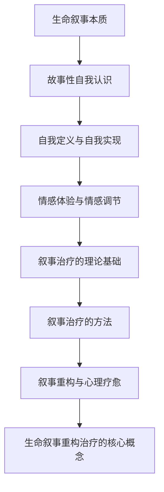

**核心算法原理讲解**

生命叙事的本质可以用以下算法原理来解释：

1. **故事性自我认识（Story Self-Awareness）**：个体通过回顾和反思自己的生命经历，构建出一个连贯的自我认知。这是一个类似于图遍历的过程，个体通过自己的经历节点，连接起过去的、现在的和未来的自己。

```python
def story_self_awareness(experiences):
    for experience in experiences:
        print("回顾经历：", experience)
        # 在这里可以添加情感分析和自我反思的逻辑
```

2. **自我定义与自我实现（Self-Definition and Self-Actualization）**：在故事性自我认识的基础上，个体会根据自己的经历和价值观，定义自己的角色和目标。这类似于贪心算法中的每一步选择，个体根据当前的情况做出最优选择。

```python
def self_definition(experiences, values):
    for experience in experiences:
        if experience.matches(values):
            print("定义角色：", experience.role)
            # 在这里可以添加实现目标的逻辑
```

3. **情感体验与情感调节（Emotional Experience and Regulation）**：个体的情感体验和调节过程是一个动态平衡的过程。这可以类比为动态规划中的状态转移和优化。

```python
def emotional Regulation(current_state, past_states):
    if current_state > past_states:
        print("情感提升")
    else:
        print("情感降低")
    # 在这里可以添加具体的调节策略
```

4. **叙事治疗的理论基础（Narrative Therapy Foundations）**：叙事治疗的理论基础包括对心理创伤的理解、叙事心理学的应用以及治疗师与患者关系的构建。这可以类比为构建一个完整的算法框架，包含输入、处理和输出。

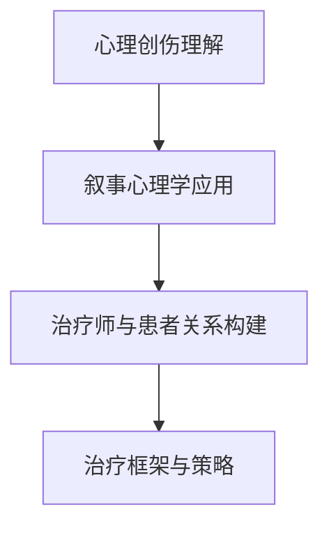

5. **叙事治疗的方法（Narrative Therapy Methods）**：叙事治疗的方法包括故事构建与分析、叙事视角转换以及患者与治疗师的关系构建。这可以类比为算法的实现过程，通过具体的步骤和技巧来实现治疗目标。

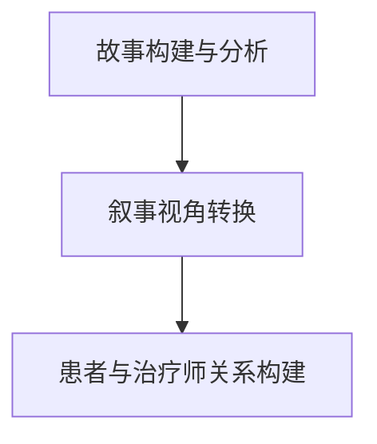

6. **叙事重构与心理疗愈（Narrative Reconstruction and Psychological Healing）**：叙事重构是叙事治疗的核心，通过修复生命叙事的断裂，实现心理疗愈。这可以类比为修复算法中的错误处理和调试过程。

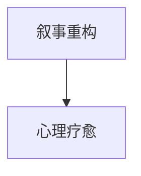

7. **生命叙事重构治疗的核心概念（Core Concepts of Narrative Reconstruction Therapy）**：生命叙事重构治疗的核心概念包括故事性自我认识、自我定义与自我实现、情感体验与情感调节、叙事治疗的理论基础、叙事治疗的方法、叙事重构与心理疗愈。这些概念相互关联，共同构成了生命叙事重构治疗的框架。

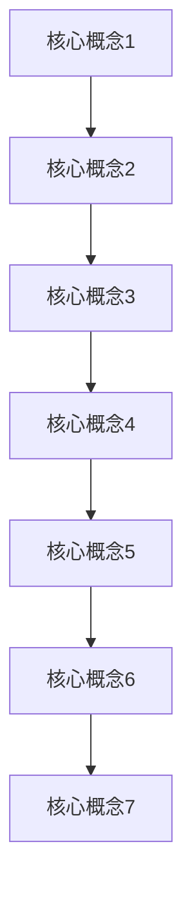

通过上述算法原理和流程图，我们可以更好地理解生命的叙事本质与叙事治疗的联系。在后续章节中，我们将深入探讨这些概念的具体应用和实践。

---

#### 1.2 心理创伤与叙事重构

心理创伤是指个体在生命经历中遭遇的极端负面事件，如暴力、意外、丧失等，这些事件会对个体的心理产生长期的负面影响。心理创伤可能导致个体在生命叙事中感受到断裂或扭曲，从而影响其情感调节、自我认知和生活质量。

**核心概念与联系**

心理创伤与叙事重构之间的联系可以通过以下核心概念来阐述：

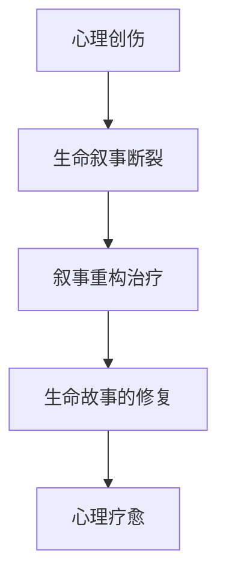

**核心算法原理讲解**

1. **生命叙事断裂（Life Narrative Fragmentation）**：心理创伤会导致个体的生命叙事出现断裂。这可以类比为算法中的错误处理，导致程序无法正常执行。

```python
def life_narrative_breakdown(event):
    if event.is traumatic:
        print("生命叙事断裂")
        # 在这里可以添加修复叙事的逻辑
```

2. **叙事重构治疗（Narrative Reconstruction Therapy）**：叙事重构治疗旨在修复生命叙事的断裂，使其重新连贯。这可以类比为算法中的错误修复和调试。

```python
def narrative_reconstruction(trauma, experiences):
    if trauma.is_recovered:
        print("叙事重构完成")
        # 在这里可以添加疗愈的逻辑
```

3. **生命故事的修复（Reconstruction of Life Stories）**：通过叙事重构治疗，个体可以修复生命叙事的断裂，重建一个连贯、有意义的故事。这可以类比为算法中的修复和优化过程。

```python
def reconstruct_life_story(narrative, trauma):
    if narrative.is连贯 and meaningful:
        print("生命故事修复完成")
        # 在这里可以添加疗愈的效果评估
```

4. **心理疗愈（Psychological Healing）**：叙事重构治疗不仅修复生命叙事的断裂，还促进个体的心理疗愈。这可以类比为算法中的目标函数优化，使程序达到最佳状态。

```python
def psychological_healing(narrative, trauma):
    if narrative.is healed and trauma.is_recovered:
        print("心理疗愈完成")
```

通过上述核心算法原理讲解，我们可以更好地理解心理创伤与叙事重构之间的关系。在后续章节中，我们将深入探讨叙事重构治疗的具体方法和应用。

---

#### 1.3 心理学与叙事治疗的结合

心理学与叙事治疗的结合是现代心理治疗的一个重要方向。心理学为叙事治疗提供了理论基础和方法论支持，而叙事治疗则为心理学提供了一种更贴近人类情感和心理世界的治疗方式。

**核心概念与联系**

心理学与叙事治疗的结合可以通过以下核心概念来阐述：

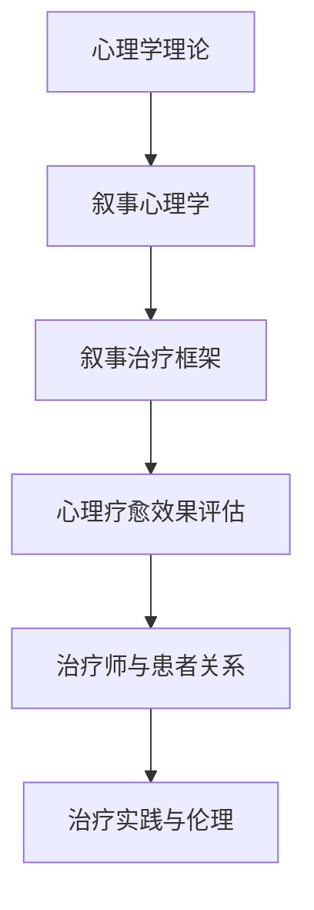

**核心算法原理讲解**

1. **心理学理论（Psychological Theories）**：心理学为叙事治疗提供了丰富的理论资源，包括心理创伤理论、认知行为理论、情感调节理论等。这些理论帮助治疗师理解患者的心理状态和行为模式。

```python
def psychological_theories(trauma, behavior):
    if trauma.is traumatic and behavior.is abnormal:
        print("适用心理学理论")
        # 在这里可以添加具体的理论分析
```

2. **叙事心理学（Narrative Psychology）**：叙事心理学关注个体的生命叙事及其对心理和行为的影响。叙事心理学为叙事治疗提供了理论基础，帮助治疗师理解患者的叙事模式和心理需求。

```python
def narrative_psychology(narrative, emotion):
    if narrative.is coherent and emotion.is positive:
        print("叙事心理学适用")
        # 在这里可以添加叙事分析
```

3. **叙事治疗框架（Narrative Therapy Framework）**：叙事治疗框架包括故事构建与分析、叙事视角转换、患者与治疗师的关系构建等。这些框架帮助治疗师在治疗过程中有效地引导患者重构生命叙事。


4. **心理疗愈效果评估（Psychological Healing Evaluation）**：心理疗愈效果评估是叙事治疗的重要组成部分。通过评估患者的心理状态和行为变化，治疗师可以了解治疗效果并调整治疗策略。

```python
def healing_evaluation(patient, therapy):
    if patient.is healed and therapy.is effective:
        print("疗愈效果评估完成")
        # 在这里可以添加疗效评估的逻辑
```

5. **治疗师与患者关系（Therapist-Patient Relationship）**：治疗师与患者的关系是叙事治疗成功的关键。建立良好的治疗师与患者关系有助于增强患者的信任感和治疗效果。

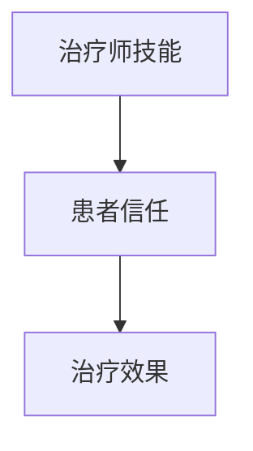

6. **治疗实践与伦理（Therapy Practice and Ethics）**：治疗实践与伦理是叙事治疗师必须遵守的基本原则。治疗实践包括治疗策略的选择、患者的隐私保护、伦理决策等。伦理决策是叙事治疗中的重要环节，它关系到治疗师的专业操守和患者的利益。

```python
def therapy_practice(trauma, ethics):
    if ethics.is followed and practice.is effective:
        print("治疗实践与伦理符合要求")
        # 在这里可以添加实践和伦理决策的逻辑
```

通过上述核心算法原理讲解，我们可以更好地理解心理学与叙事治疗的结合。在后续章节中，我们将深入探讨这些概念的具体应用和实践。

---

通过第1章的介绍，我们初步了解了生命叙事重构治疗的基础理论及其与心理学和叙事治疗的结合。在后续章节中，我们将逐步深入探讨叙事治疗的实践方法、在不同心理疾病中的应用，以及治疗师的自我成长与职业发展。希望这些内容能帮助您更好地理解生命叙事重构治疗的原理和实践。

---

### 第2章：叙事治疗的理论基础

#### 2.1 心理创伤理论

心理创伤理论是叙事治疗的重要基础。心理创伤理论关注个体在遭遇极端负面事件后产生的心理反应和长期影响。这些事件可能包括战争、暴力、性侵、自然灾害等，它们会对个体的心理产生深远的负面影响。

**核心概念与联系**

心理创伤理论的核心概念包括：

1. **创伤后应激障碍（Post-Traumatic Stress Disorder，PTSD）**：PTSD 是一种常见的心理创伤后反应，表现为对创伤事件的过度反应，如闪回、失眠、过度警觉等。

2. **情感失调（Emotional Dysregulation）**：心理创伤可能导致个体的情感调节能力受损，从而出现情绪波动大、情感失控等问题。

3. **认知扭曲（Cognitive Distortion）**：心理创伤可能导致个体的认知出现扭曲，如负面的自我评价、对未来的悲观等。

4. **记忆重构（Memory Reconstruction）**：心理创伤可能导致个体的记忆出现重构，即记忆内容变得模糊或扭曲。

以下是心理创伤理论的核心概念及其相互关系的架构：

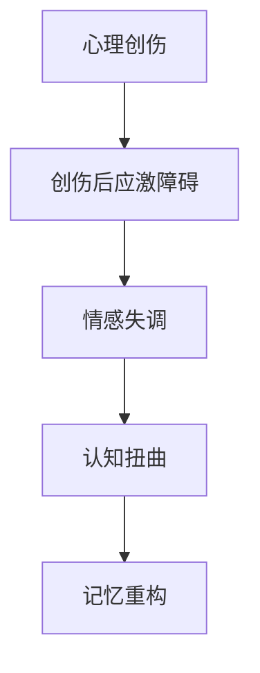

**核心算法原理讲解**

心理创伤的算法原理可以理解为对个体心理状态的监控和调整。以下是心理创伤理论的伪代码解释：

```python
def psychological_trauma检测(self, symptoms):
    if '创伤后应激障碍' in symptoms:
        self.诊断(PSTD)
    if '情感失调' in symptoms:
        self.情感调节治疗()
    if '认知扭曲' in symptoms:
        self.认知重构治疗()
    if '记忆重构' in symptoms:
        self.记忆重建治疗()
```

**数学模型和公式**

心理创伤理论中的一些关键概念可以通过数学模型和公式来描述。以下是一个简化的公式：

$$
PSTD = f(Trauma, Stress, Vulnerability)
$$

其中，$PSTD$ 代表创伤后应激障碍，$Trauma$ 代表心理创伤，$Stress$ 代表压力水平，$Vulnerability$ 代表个体的脆弱性。

**举例说明**

例如，一个经历了性侵的个体，可能会出现以下症状：

- **创伤后应激障碍**：个体可能会出现闪回、失眠和过度警觉等症状。
- **情感失调**：个体可能会出现情绪波动大、情感失控等问题。
- **认知扭曲**：个体可能会对自己的未来持有悲观态度，认为自己无法摆脱创伤的影响。
- **记忆重构**：个体可能会对性侵事件的部分记忆出现模糊或扭曲。

通过上述算法原理和数学模型，我们可以更好地理解心理创伤理论的核心概念及其相互关系。在后续章节中，我们将深入探讨叙事心理学的原理，以及叙事治疗如何应用于心理创伤的治疗。

---

#### 2.2 叙事心理学

叙事心理学是心理学与叙事治疗相结合的产物，它关注个体的生命叙事及其对心理和行为的影响。叙事心理学认为，个体的心理状态和行为模式在很大程度上是由其生命叙事所决定的。

**核心概念与联系**

叙事心理学中的核心概念包括：

1. **生命叙事（Life Narrative）**：生命叙事是个体对自己生命经历的叙述，它包括个体的过去、现在和未来，以及个体对这些经历的理解和解读。

2. **叙事视角（Narrative Perspective）**：叙事视角是指个体在叙述生命故事时所采用的角度，它决定了个体对事件的解读和情感体验。

3. **叙事重构（Narrative Reconstruction）**：叙事重构是指通过改变个体的生命叙事，帮助其重新定义自我、调整情感和行为。

以下是叙事心理学的核心概念及其相互关系的架构：

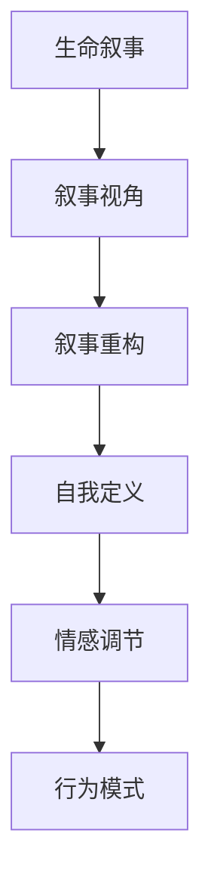

**核心算法原理讲解**

叙事心理学的核心算法原理可以类比为一种数据结构和数据处理过程。以下是叙事心理学的伪代码解释：

```python
class NarrativePsychology:
    def __init__(self, life_narrative):
        self.life_narrative = life_narrative

    def change_narrative(self, new_narrative):
        self.life_narrative = new_narrative

    def emotional_regulation(self, emotion):
        if emotion.is negative:
            self.change_narrative_to_positive()

    def behavior_model(self, behavior):
        if behavior.is positive:
            self.change_narrative_to_motivational()
```

**数学模型和公式**

叙事心理学中的关键概念可以通过数学模型和公式来描述。以下是一个简化的公式：

$$
Narrative \; Quality = f(Narrative \; Structure, Narrative \; Perspective, Emotional \; State)
$$

其中，$Narrative \; Quality$ 代表生命叙事的质量，$Narrative \; Structure$ 代表叙事结构，$Narrative \; Perspective$ 代表叙事视角，$Emotional \; State$ 代表情感状态。

**举例说明**

例如，一个经历挫折的个体，其生命叙事可能包含以下要素：

- **生命叙事**：个体对自己的生活经历进行叙述，包括成功和失败。
- **叙事视角**：个体可能从自我批判的视角看待失败，导致情感状态消极。
- **叙事重构**：通过叙事治疗，个体可以改变叙事视角，从积极的角度看待失败，从而改善情感状态。

通过上述算法原理和数学模型，我们可以更好地理解叙事心理学的核心概念及其相互关系。在后续章节中，我们将深入探讨叙事治疗的基本原则和实践方法。

---

#### 2.3 叙事治疗的基本原则

叙事治疗的基本原则是指导治疗师进行有效治疗的重要指南。这些原则涵盖了治疗师与患者的关系构建、治疗过程中的具体方法和技巧，以及治疗目标的设定。

**核心概念与联系**

叙事治疗的基本原则包括：

1. **患者为中心**：叙事治疗强调患者的主体性和自主性，治疗师的角色是帮助患者重构生命叙事，而不是取代患者自己的声音。

2. **叙事视角转换**：叙事治疗的一个关键原则是通过改变患者的叙事视角，帮助其从更积极的角度看待自己的经历。

3. **重建生命叙事**：叙事治疗旨在通过重构患者的生命叙事，修复因心理创伤导致的断裂或扭曲，帮助患者恢复心理平衡。

4. **情感宣泄与调节**：叙事治疗鼓励患者通过讲述自己的故事来宣泄情感，并通过叙事重构来调节情感。

以下是叙事治疗基本原则的核心概念及其相互关系的架构：

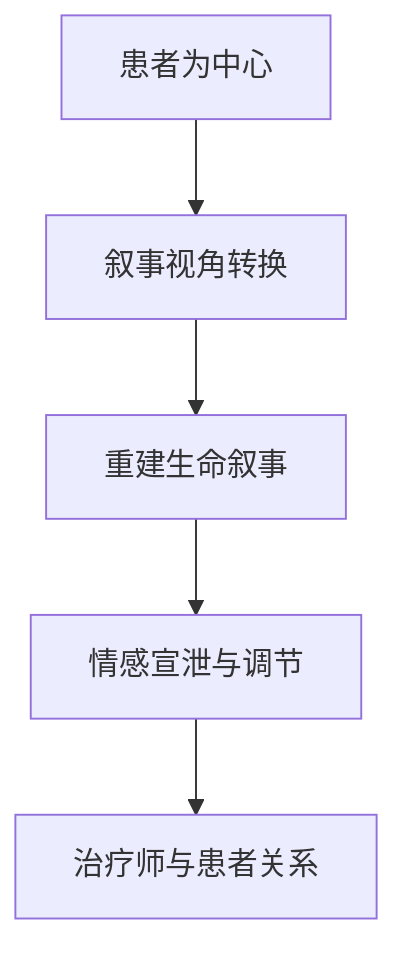

**核心算法原理讲解**

叙事治疗的基本原则可以类比为一种算法框架，它包括输入、处理和输出。以下是叙事治疗基本原则的伪代码解释：

```python
class NarrativeTherapy:
    def __init__(self, patient):
        self.patient = patient

    def patient_centered(self):
        self.patient.take_the_lead()

    def narrative_perspective_conversion(self):
        self.patient.change_narrative_perspective()

    def narrative_reconstruction(self):
        self.patient.reconstruct_life_narrative()

    def emotional_release_and_regulation(self):
        self.patient.release_emotions()
        self.patient.regulate_emotions()
```

**数学模型和公式**

叙事治疗的基本原则可以通过数学模型和公式来描述。以下是一个简化的公式：

$$
Therapy \; Outcome = f(Patient \; Autonomy, Narrative \; Perspective, Emotional \; Regulation)
$$

其中，$Therapy \; Outcome$ 代表治疗结果，$Patient \; Autonomy$ 代表患者的自主性，$Narrative \; Perspective$ 代表叙事视角，$Emotional \; Regulation$ 代表情感调节。

**举例说明**

例如，一个经历家庭暴力的患者，通过叙事治疗可以实现以下目标：

- **患者为中心**：患者主导自己的治疗过程，治疗师提供支持和引导。
- **叙事视角转换**：患者从自责的视角转变为理解暴力行为的视角。
- **重建生命叙事**：患者重构自己的生命故事，强调自己的坚韧和成长。
- **情感宣泄与调节**：患者通过讲述自己的故事宣泄情感，并通过叙事重构来调节情感。

通过上述算法原理和数学模型，我们可以更好地理解叙事治疗的基本原则及其应用。在后续章节中，我们将深入探讨叙事治疗的实践方法和具体应用。

---

通过第2章的介绍，我们了解了心理创伤理论和叙事心理学的基础，以及叙事治疗的基本原则。这些理论基础为我们理解叙事治疗的原理和实践提供了重要的框架。在后续章节中，我们将进一步探讨叙事治疗的实践方法，包括故事构建与分析、叙事视角转换以及患者与治疗师的关系构建。希望这些内容能帮助您更深入地理解叙事治疗的本质和应用。

---

### 第3章：叙事治疗的实践方法

#### 3.1 故事构建与分析

故事构建与分析是叙事治疗的核心理法之一，它通过帮助患者重构生命故事，来修复因心理创伤导致的断裂或扭曲。故事构建与分析的过程包括以下几个方面：

**核心概念与联系**

故事构建与分析的核心概念包括：

1. **故事要素**：故事要素是指构成生命故事的各个组成部分，如人物、事件、冲突、高潮和结局等。

2. **叙事视角**：叙事视角是指个体在叙述生命故事时所采用的角度，它决定了个体对事件的解读和情感体验。

3. **叙事重构**：叙事重构是指通过改变个体的生命叙事，帮助其重新定义自我、调整情感和行为。

以下是故事构建与分析的核心概念及其相互关系的架构：

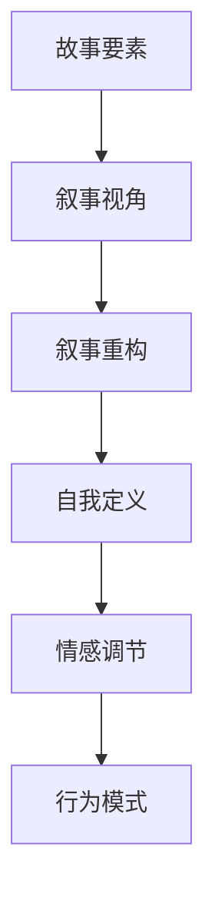

**核心算法原理讲解**

故事构建与分析的算法原理可以类比为一种数据处理和重构的过程。以下是故事构建与分析的伪代码解释：

```python
class StoryConstructionAnalysis:
    def __init__(self, patient):
        self.patient = patient

    def extract_story_elements(self):
        self.patient.provide_story_elements()

    def analyze_narrative_perspective(self):
        self.patient.identify_narrative_perspective()

    def reconstruct_narrative(self):
        self.patient.create_new_narrative()

    def self_definition(self):
        self.patient.define_self()

    def emotional_regulation(self):
        self.patient.regulate_emotions()

    def behavior_model(self):
        self.patient.change_behavior()
```

**数学模型和公式**

故事构建与分析的数学模型可以用来描述故事要素、叙事视角和叙事重构之间的关系。以下是一个简化的公式：

$$
Narrative \; Reconstruction = f(Story \; Elements, Narrative \; Perspective, Emotional \; State)
$$

其中，$Narrative \; Reconstruction$ 代表叙事重构，$Story \; Elements$ 代表故事要素，$Narrative \; Perspective$ 代表叙事视角，$Emotional \; State$ 代表情感状态。

**举例说明**

例如，一个经历离婚的患者，其生命故事可能包含以下要素：

- **故事要素**：离婚、失落、孤独、重建生活。
- **叙事视角**：自责、对未来的担忧、对伴侣的愤怒。
- **叙事重构**：从自责转向理解伴侣的决定，关注自己的成长和未来。

通过上述算法原理和数学模型，我们可以更好地理解故事构建与分析的过程。在后续章节中，我们将进一步探讨叙事视角转换和患者与治疗师的关系构建，以帮助患者实现更深层次的叙事重构。

---

#### 3.2 叙事视角转换

叙事视角转换是叙事治疗中的一个关键步骤，它通过改变患者对事件的视角，帮助患者重构生命故事，从而实现心理疗愈。叙事视角转换的核心在于帮助患者从不同的角度看待自己的经历，从而打破原有的心理模式，建立新的、更健康的叙事。

**核心概念与联系**

叙事视角转换的核心概念包括：

1. **叙事视角**：叙事视角是指个体在叙述生命故事时所采用的角度，它决定了个体对事件的解读和情感体验。

2. **重构叙事**：重构叙事是指通过改变患者的叙事视角，帮助其构建一个更加积极、健康的新叙事。

3. **心理疗愈**：心理疗愈是指通过叙事视角转换和重构叙事，帮助患者缓解心理创伤，恢复心理健康。

以下是叙事视角转换的核心概念及其相互关系的架构：

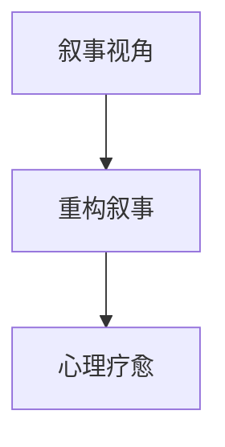

**核心算法原理讲解**

叙事视角转换的算法原理可以类比为一种视角变换和数据处理的过程。以下是叙事视角转换的伪代码解释：

```python
class NarrativePerspectiveShift:
    def __init__(self, patient):
        self.patient = patient

    def current_narrative_perspective(self):
        self.patient.provide_current_perspective()

    def alternative_narrative_perspective(self):
        self.patient.explore_alternative_perspective()

    def reconstruct_narrative(self, new_perspective):
        self.patient.create_new_narrative(new_perspective)

    def psychological_healing(self):
        self.patient.improve_psychological_wellbeing()
```

**数学模型和公式**

叙事视角转换的数学模型可以用来描述叙事视角、重构叙事和心理疗愈之间的关系。以下是一个简化的公式：

$$
Psychological \; Healing = f(Narrative \; Perspective, Narrative \; Reconstruction)
$$

其中，$Psychological \; Healing$ 代表心理疗愈，$Narrative \; Perspective$ 代表叙事视角，$Narrative \; Reconstruction$ 代表重构叙事。

**举例说明**

例如，一个经历职场霸凌的患者，其原有的叙事视角可能包含以下内容：

- **现有叙事视角**：自责、无助、对职场的恐惧。

通过叙事视角转换，治疗师可以帮助患者探索新的叙事视角，如：

- **新叙事视角**：理解霸凌行为的背景和原因、寻找应对策略、强调自己的价值和成就。

通过这样的视角转换，患者可以重构自己的生命故事，从而实现心理疗愈。

通过上述算法原理和数学模型，我们可以更好地理解叙事视角转换的过程。在后续章节中，我们将进一步探讨患者与治疗师的关系构建，以帮助患者实现更深层次的叙事重构。

---

#### 3.3 患者与治疗师的关系构建

患者与治疗师的关系构建是叙事治疗成功的关键。这种关系不仅提供了安全的空间，使患者能够自由地表达自己的故事，而且还能促进治疗师有效地引导患者进行叙事重构。以下是患者与治疗师关系构建的核心概念和实践方法。

**核心概念与联系**

患者与治疗师关系构建的核心概念包括：

1. **信任与共鸣**：信任是患者与治疗师关系的基础，而共鸣则是治疗师与患者之间建立深刻联系的重要途径。

2. **共同目标**：明确的治疗目标有助于患者和治疗师共同努力，确保治疗的针对性和有效性。

3. **合作与参与**：叙事治疗强调患者的主观能动性，患者与治疗师的合作和参与是叙事重构成功的重要因素。

4. **情感支持**：治疗师提供情感支持，帮助患者面对和克服心理创伤。

以下是患者与治疗师关系构建的核心概念及其相互关系的架构：

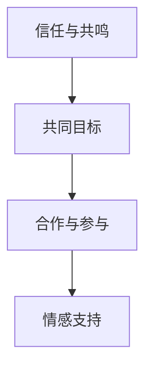

**核心算法原理讲解**

患者与治疗师的关系构建可以类比为一种多阶段、多层次的过程。以下是患者与治疗师关系构建的伪代码解释：

```python
class PatientTherapistRelationship:
    def __init__(self, patient, therapist):
        self.patient = patient
        self.therapist = therapist

    def build_trust(self):
        self.therapist.provide_empathy()
        self.patient.feel_trusted()

    def establish_resonance(self):
        self.therapist.share_ similar_experiences()
        self.patient.feel_resonated()

    def set_common_goals(self):
        self.therapist.and.patient.agree_on_goals()

    def collaborate_and_participate(self):
        self.therapist.encourage_patient_involvement()
        self.patient.active_participation()

    def provide_emotional_support(self):
        self.therapist.show_compassion()
        self.patient.feelSupported()
```

**数学模型和公式**

患者与治疗师关系构建的数学模型可以用来描述信任、共鸣、共同目标和情感支持之间的关系。以下是一个简化的公式：

$$
Successful \; Relationship = f(Trust, Resonance, Common \; Goals, Emotional \; Support)
$$

其中，$Successful \; Relationship$ 代表成功的关系构建，$Trust$ 代表信任，$Resonance$ 代表共鸣，$Common \; Goals$ 代表共同目标，$Emotional \; Support$ 代表情感支持。

**举例说明**

例如，在一个治疗抑郁的案例中：

- **信任与共鸣**：治疗师通过分享自己的经验，使患者感受到共鸣和信任。
- **共同目标**：治疗师和患者共同设定目标，如减轻抑郁症状、提高生活质量。
- **合作与参与**：治疗师鼓励患者积极参与治疗过程，共同探讨叙事重构的策略。
- **情感支持**：治疗师提供情感支持，帮助患者面对抑郁的情绪和挑战。

通过上述算法原理和数学模型，我们可以更好地理解患者与治疗师关系构建的过程。在叙事治疗的实践中，这种关系构建不仅有助于提升治疗效果，还能增强患者的自尊和自我效能感。在后续章节中，我们将继续探讨叙事治疗的实践方法和应用。

---

通过第3章的讨论，我们深入了解了叙事治疗的实践方法，包括故事构建与分析、叙事视角转换以及患者与治疗师的关系构建。这些方法为叙事治疗提供了具体的操作指南，帮助治疗师和患者共同应对心理创伤和情感问题。在下一章中，我们将探讨讲故事疗愈内心创伤的原理，以进一步理解叙事治疗的疗效。

---

### 第4章：讲故事疗愈内心创伤的原理

#### 4.1 故事的心理治愈作用

讲故事疗愈内心创伤的原理在于故事本身具有的心理治愈作用。故事不仅能够传递信息，还能激发情感、引导思维和改变认知。以下是故事心理治愈作用的核心概念及其相互关系：

**核心概念与联系**

故事心理治愈作用的核心概念包括：

1. **情感共鸣**：故事能够唤起听众的情感共鸣，使个体感受到与他人共同经历的温暖和安慰。

2. **认知重构**：故事通过改变个体的认知模式，帮助其从不同的角度看待问题，从而实现心理疗愈。

3. **行为激励**：故事中的正面角色和成功案例能够激励听众采取积极的行为，改善自己的生活状态。

以下是故事心理治愈作用的核心概念及其相互关系的架构：

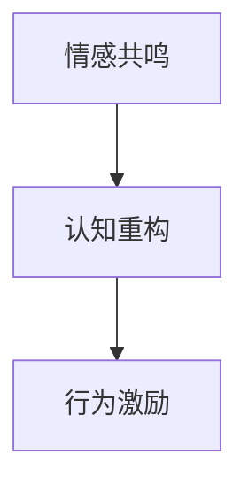

**核心算法原理讲解**

故事心理治愈作用的算法原理可以类比为一种情感和认知处理的过程。以下是故事心理治愈作用的伪代码解释：

```python
class StoryHealing:
    def __init__(self, story):
        self.story = story

    def emotional_resonance(self, audience):
        if self.story.matches_audience_emotions():
            self.audience.feel_emotional_resonance()

    def cognitive_restructuring(self, audience):
        if self.story.changes_audience_thinking():
            self.audience.change_cognitive_model()

    def behavioral_motivation(self, audience):
        if self.story.shows_successful_cases():
            self.audience.be_motivated_to_act()
```

**数学模型和公式**

故事心理治愈作用的数学模型可以用来描述情感共鸣、认知重构和行为激励之间的关系。以下是一个简化的公式：

$$
Psychological \; Healing = f(Emotional \; Resonance, Cognitive \; Restructuring, Behavioral \; Motivation)
$$

其中，$Psychological \; Healing$ 代表心理疗愈，$Emotional \; Resonance$ 代表情感共鸣，$Cognitive \; Restructuring$ 代表认知重构，$Behavioral \; Motivation$ 代表行为激励。

**举例说明**

例如，一个经历了离婚的个体，通过听一个关于离婚后重新找到幸福的故事，可能会产生以下效果：

- **情感共鸣**：个体感受到与其他经历类似情境的人有共鸣，减轻孤独感。
- **认知重构**：个体从故事中看到离婚并不是生活的终点，而是新的开始，改变了对未来的悲观态度。
- **行为激励**：个体被故事中的成功案例激励，开始积极寻找自己的幸福。

通过上述算法原理和数学模型，我们可以更好地理解故事的心理治愈作用。在叙事治疗的实践中，这种作用被广泛应用于帮助患者疗愈内心创伤。在下一节中，我们将进一步探讨讲故事与情感宣泄之间的关系。

---

#### 4.2 讲故事与情感宣泄

讲故事与情感宣泄之间有着紧密的联系。情感宣泄是指个体通过表达情感来减轻心理压力和痛苦。讲故事提供了一个安全的途径，让个体能够自由地表达情感，从而实现情感宣泄和心理疗愈。

**核心概念与联系**

讲故事与情感宣泄的核心概念包括：

1. **情感表达**：讲故事使个体能够通过语言和情境表达情感，如悲伤、愤怒、恐惧等。

2. **情感释放**：通过讲述自己的故事，个体能够释放内心的情感负担，减轻心理压力。

3. **情感调节**：讲故事有助于个体理解和调节自己的情感，从而实现情感平衡。

以下是讲故事与情感宣泄的核心概念及其相互关系的架构：

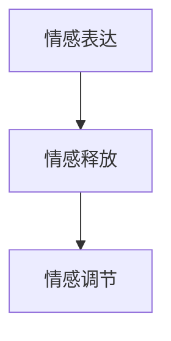

**核心算法原理讲解**

讲故事与情感宣泄的算法原理可以类比为一种情感处理和调节的过程。以下是讲故事与情感宣泄的伪代码解释：

```python
class StoryAndEmotionalRelease:
    def __init__(self, story):
        self.story = story

    def express_emotions(self, audience):
        if self.story.is_suitable_for_emotional_expression():
            self.audience.express_emotions()

    def release_emotions(self, audience):
        if self.audience.expressed_emotions():
            self.audience.release_emotional_burden()

    def regulate_emotions(self, audience):
        if self.audience.regulated_emotions():
            self.audience.improve_emotional_balance()
```

**数学模型和公式**

讲故事与情感宣泄的数学模型可以用来描述情感表达、情感释放和情感调节之间的关系。以下是一个简化的公式：

$$
Emotional \; Regulation = f(Emotional \; Expression, Emotional \; Release)
$$

其中，$Emotional \; Regulation$ 代表情感调节，$Emotional \; Expression$ 代表情感表达，$Emotional \; Release$ 代表情感释放。

**举例说明**

例如，一个经历丧亲之痛的个体，通过讲述自己的故事，可能会产生以下效果：

- **情感表达**：个体能够通过故事表达自己的悲伤、愤怒和恐惧。
- **情感释放**：通过讲述，个体释放了内心的情感负担，感到心理压力减轻。
- **情感调节**：个体通过讲述和反思，理解了自己的情感，实现了情感平衡。

通过上述算法原理和数学模型，我们可以更好地理解讲故事与情感宣泄之间的关系。在叙事治疗的实践中，这种关系被广泛应用于帮助患者疗愈内心创伤。在下一节中，我们将探讨故事疗愈的心理机制。

---

#### 4.3 故事疗愈的心理机制

故事疗愈的心理机制是一个复杂的过程，涉及多个心理层面和神经生物学过程。以下是对故事疗愈心理机制的核心概念的详细解释，以及相关的数学模型和公式。

**核心概念与联系**

故事疗愈的心理机制涉及以下核心概念：

1. **情感记忆**：情感记忆是指个体对具有强烈情感体验的事件的记忆。故事中的情感内容能够激活个体的情感记忆，帮助个体理解和处理过去的经历。

2. **认知重塑**：认知重塑是指通过改变个体的认知模式，帮助其从不同的角度看待问题，从而实现心理疗愈。故事能够提供新的视角，促进个体的认知重塑。

3. **情感调节**：情感调节是指个体通过情感表达和情绪管理来调节自己的情绪状态。故事提供了一个安全的途径，使个体能够自由地表达和调节情感。

以下是故事疗愈心理机制的核心概念及其相互关系的架构：

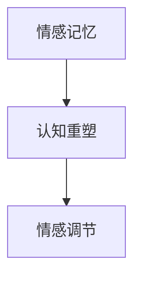

**核心算法原理讲解**

故事疗愈心理机制的算法原理可以类比为一种情感和认知处理的过程。以下是故事疗愈心理机制的伪代码解释：

```python
class StoryHealingMechanism:
    def __init__(self, story):
        self.story = story

    def activate_emotional_memory(self, individual):
        if self.story.is_emotionally_relevant():
            self.individual.activate_emotional_memory()

    def cognitive_remodeling(self, individual):
        if self.story.provides_new_perspectives():
            self.individual.remodel_cognitive_models()

    def emotional_regulation(self, individual):
        if self.story.encourages_emotional_expression():
            self.individual.regulate_emotions()
```

**数学模型和公式**

故事疗愈心理机制的数学模型可以用来描述情感记忆、认知重塑和情感调节之间的关系。以下是一个简化的公式：

$$
Psychological \; Healing = f(Emotional \; Memory, Cognitive \; Remodeling, Emotional \; Regulation)
$$

其中，$Psychological \; Healing$ 代表心理疗愈，$Emotional \; Memory$ 代表情感记忆，$Cognitive \; Remodeling$ 代表认知重塑，$Emotional \; Regulation$ 代表情感调节。

**举例说明**

例如，一个经历了家庭暴力的个体，通过听一个关于家庭暴力的故事，可能会产生以下效果：

- **情感记忆**：故事中的情感内容激活了个体对家庭暴力的记忆，使其能够重新审视过去的经历。
- **认知重塑**：故事提供了新的视角，帮助个体理解家庭暴力的背景和原因，从而改变了对事件的认知。
- **情感调节**：个体通过讲述和反思故事，表达和调节了自己的情感，减轻了心理压力。

通过上述算法原理和数学模型，我们可以更好地理解故事疗愈的心理机制。在叙事治疗的实践中，这种机制被广泛应用于帮助患者疗愈内心创伤。在下一章中，我们将探讨叙事治疗在抑郁症中的应用。

---

通过第4章的讨论，我们深入了解了讲故事疗愈内心创伤的原理，包括情感共鸣、情感宣泄和心理机制。这些原理为叙事治疗的实践提供了科学依据。在下一章中，我们将具体探讨叙事治疗在抑郁症中的应用，以进一步展示叙事治疗的有效性和实用性。

---

### 第5章：叙事治疗在抑郁症中的应用

#### 5.1 抑郁症与叙事重构

抑郁症是一种常见的心理健康问题，其特征包括持续的低落情绪、失去兴趣或快乐感、疲劳感等。抑郁症不仅严重影响个体的生活质量，还可能导致严重的社会、职业和家庭问题。叙事重构治疗提供了一种有效的手段，通过改变个体的生命叙事，帮助其克服抑郁症。

**核心概念与联系**

抑郁症与叙事重构之间的核心概念包括：

1. **抑郁情绪**：抑郁情绪是抑郁症的主要症状，表现为持续的悲观、无助和绝望感。

2. **生命叙事断裂**：抑郁症患者往往会在生命叙事中体验到断裂，即生命故事中出现空白或不连贯的部分。

3. **叙事重构**：通过叙事重构，患者可以重建一个连贯、积极的生命叙事，从而改善抑郁情绪。

以下是抑郁症与叙事重构的核心概念及其相互关系的架构：

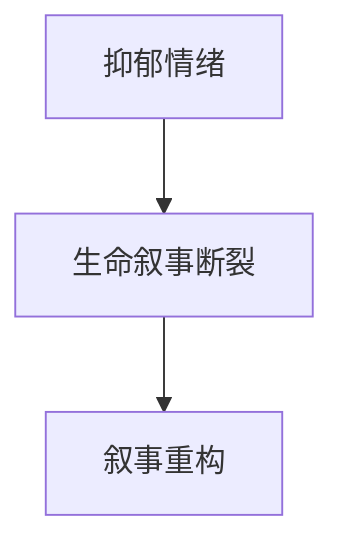

**核心算法原理讲解**

抑郁症与叙事重构的算法原理可以类比为一种情感和认知重构的过程。以下是抑郁症与叙事重构的伪代码解释：

```python
class DepressionAndNarrativeReconstruction:
    def __init__(self, patient):
        self.patient = patient

    def identify_depressive_symptoms(self):
        if self.patient.has_depressive_symptoms():
            self.patient.diagnose_depression()

    def identify_narrative_breakdown(self):
        if self.patient.has_narrative_breakdown():
            self.patient.diagnose_narrative_breakdown()

    def narrative_reconstruction(self):
        if self.patient.is_reconstructing_narrative():
            self.patient.reconstruct_life_narrative()

    def improve_depressive_symptoms(self):
        if self.patient.improves_depressive_symptoms():
            self.patient.report_improvement()
```

**数学模型和公式**

抑郁症与叙事重构的数学模型可以用来描述抑郁情绪、生命叙事断裂和叙事重构之间的关系。以下是一个简化的公式：

$$
Depression \; Relief = f(Narrative \; Reconstruction, Depressive \; Symptoms, Life \; Narrative \; Continuity)
$$

其中，$Depression \; Relief$ 代表抑郁情绪的缓解，$Narrative \; Reconstruction$ 代表叙事重构，$Depressive \; Symptoms$ 代表抑郁症状，$Life \; Narrative \; Continuity$ 代表生命叙事的连贯性。

**举例说明**

例如，一个长期受抑郁困扰的个体，其生命叙事可能包含以下特点：

- **抑郁情绪**：个体感受到持续的悲观、无助和绝望。
- **生命叙事断裂**：个体在生命故事中感到空白和不连贯，如失去重要的亲人、工作失败等。
- **叙事重构**：通过叙事重构，个体可以重新构建一个连贯、积极的生命叙事，如重新定义自己的角色、发现新的目标和兴趣。

通过上述算法原理和数学模型，我们可以更好地理解抑郁症与叙事重构之间的关系。在叙事治疗的实践中，这种关系被广泛应用于帮助抑郁症患者恢复心理健康。在下一节中，我们将探讨具体案例中的叙事重构治疗过程。

---

#### 5.2 抑郁症患者的叙事重构案例

在本节中，我们将通过一个具体的叙事重构治疗案例，详细探讨叙事治疗在抑郁症治疗中的应用过程和效果。此案例将展示治疗师如何帮助患者通过重构生命叙事，减轻抑郁症状，恢复生活质量和心理健康。

**案例背景**

患者李先生，35岁，是一名公司中层管理者。他因长期的工作压力和家庭矛盾，感到极度焦虑和抑郁。李先生的抑郁症状包括持续的情绪低落、失眠、食欲减退、对工作和生活的兴趣丧失等。他曾经尝试过药物治疗，但效果不佳，副作用明显。因此，他寻求叙事治疗帮助。

**诊断与治疗计划**

治疗师初步诊断后，确定李先生的抑郁症状主要源于工作压力和家庭矛盾，并在他的生命叙事中发现了断裂和不连贯的部分。治疗师决定采用叙事重构治疗，帮助李先生重新构建他的生命叙事，恢复生活的连贯性和意义。

**治疗过程**

1. **建立信任与共鸣**

治疗师首先与李先生建立信任关系，通过倾听和共鸣，使李先生感到被理解和接纳。治疗师通过共情和分享自己的经验，帮助李先生打开心扉，愿意分享自己的故事。

2. **故事构建与分析**

在几个治疗会议中，治疗师引导李先生回顾他的生命经历，逐步构建出他的生命叙事。治疗师使用开放性的问题和引导性的对话，帮助李先生表达他的感受和经历。

```
治疗师：你能和我分享一下，最近工作中让你感到困难的事情吗？
李先生：最近公司业绩下滑，我感到巨大的压力，担心失去工作。
治疗师：这种压力让你有什么感觉？
李先生：我感到焦虑和恐惧，晚上睡不着觉。
治疗师：你能描述一下，这种感觉最强烈的时候是怎样的？
李先生：有一次，我连续几天失眠，最后在公司会议上失态，被领导批评。
```

3. **叙事视角转换**

治疗师帮助李先生从不同的角度重新看待他的经历，特别是那些让他感到沮丧和焦虑的事件。通过叙事视角转换，治疗师引导李先生看到问题的多面性，并探索积极的解决方法。

```
治疗师：如果你现在是一个旁观者，你会如何看待你的这些经历？
李先生：我可能会觉得，这只是一段时间的压力，我会想办法应对。
治疗师：那么，你认为有哪些方法可以帮助你应对这种压力？
李先生：我可能会尝试调整工作计划，减少加班时间，或者寻求同事的帮助。
```

4. **重构生命叙事**

治疗师与李先生一起，逐步重构他的生命叙事，使其变得更加连贯、积极和有意义。通过一系列的叙事重构技巧，如角色置换、视角转换和情感调节，李先生开始重新定义他的自我和人生目标。

```
治疗师：我们现在来重构一下你的生命叙事，让你看到自己的成长和成就。
李先生：好的，我记得去年，我成功领导了一个重要的项目，得到了领导的表扬。
治疗师：这个成功对你有什么意义？
李先生：这让我感到自己的能力和价值，我对自己的工作有了更大的信心。
```

5. **情感调节与行为改变**

治疗师还帮助李先生通过情感调节技巧，如冥想、正念练习和放松技巧，来减轻焦虑和抑郁症状。同时，治疗师鼓励李先生采取积极的行为，如参加体育活动、与朋友聚会等，以增强他的生活动力和幸福感。

**治疗效果**

经过几个月的治疗，李先生的抑郁症状明显减轻，他开始感到更加自信和积极。他的睡眠质量改善，食欲增加，对工作和生活的兴趣也恢复了许多。李先生在治疗过程中学会了如何通过叙事重构和情感调节来应对压力，他的生活质量和心理健康得到了显著提升。

**总结**

通过这个案例，我们可以看到叙事重构治疗在抑郁症治疗中的有效性。叙事治疗不仅帮助患者重建了一个连贯、积极的生命叙事，还通过情感调节和行为改变，显著改善了患者的抑郁症状和生活质量。在下一节中，我们将探讨叙事治疗在焦虑症中的应用。

---

#### 5.3 抑郁症叙事治疗的实施策略

在抑郁症的叙事治疗中，实施策略的选择和执行至关重要。以下是一些关键的叙事治疗实施策略，这些策略有助于有效地帮助抑郁症患者重构生命叙事，减轻抑郁症状，并提升生活质量。

**1. 建立治疗关系**

治疗关系的建立是叙事治疗成功的关键。治疗师需要与患者建立信任、共鸣和支持的关系。以下是一些具体的策略：

- **倾听与理解**：治疗师应耐心倾听患者的叙述，展示对患者经历的深刻理解和同情。
- **共情与接纳**：治疗师通过共情和接纳，使患者感到被理解和支持，从而增强治疗动机。
- **反馈与确认**：治疗师应及时给予患者正面的反馈和确认，帮助患者建立自信。

**2. 故事构建与分析**

故事构建与分析是叙事治疗的核心步骤。以下是一些具体的策略：

- **引导叙述**：治疗师通过开放性问题引导患者叙述他们的生命故事，鼓励他们表达情感和经历。
- **情感标记**：治疗师帮助患者识别和标记故事中的情感元素，从而更深入地理解自己的情感状态。
- **叙事视角转换**：治疗师引导患者从不同的视角重新审视他们的故事，帮助他们发现新的解读和理解。

**3. 叙事重构**

叙事重构是叙事治疗的目标，以下是一些具体的策略：

- **重塑叙事结构**：治疗师帮助患者重新构建故事的开始、中间和结局，使其更加连贯、积极和有意义。
- **角色重塑**：治疗师鼓励患者重新定义自己在故事中的角色，强调他们的成就和积极品质。
- **情感调节**：治疗师帮助患者通过叙事重构来调节情感，使其从负面的情感状态转向积极的状态。

**4. 情感调节技巧**

情感调节技巧在叙事治疗中起到关键作用，以下是一些具体的策略：

- **情绪表达**：治疗师鼓励患者通过叙事表达他们的情感，从而释放情感压力。
- **正念练习**：治疗师教授患者正念技巧，帮助他们更好地管理情绪，减少焦虑和抑郁。
- **放松训练**：治疗师指导患者进行放松训练，如深呼吸、渐进性肌肉松弛等，以减轻身体和心理的紧张感。

**5. 行为改变**

行为改变是叙事治疗中的一部分，以下是一些具体的策略：

- **目标设定**：治疗师与患者共同设定可实现的行为目标，如参加社交活动、锻炼身体等。
- **积极行动**：治疗师鼓励患者采取积极的行动，逐步建立健康的生活方式。
- **行为跟踪**：治疗师帮助患者记录和评估他们的行为变化，以增强治疗效果。

**6. 专业培训与监督**

叙事治疗的实施需要专业的知识和技能。以下是一些具体的策略：

- **专业培训**：治疗师应接受专业的叙事治疗培训，掌握相关理论和技巧。
- **持续监督**：治疗师应定期监督患者的进展，并根据情况调整治疗策略。
- **团队协作**：治疗师可以与心理医生、社工等多学科团队协作，为患者提供全方位的支持。

**总结**

通过上述实施策略，叙事治疗为抑郁症患者提供了一种有效的方法来重构生命叙事，减轻抑郁症状，并提升生活质量。治疗师在实施过程中需要灵活运用这些策略，以适应每位患者的需求和情况。在下一章中，我们将探讨叙事治疗在焦虑症中的应用。

---

### 第6章：叙事治疗在焦虑症中的应用

#### 6.1 焦虑症与叙事重构

焦虑症是一种常见的心理健康问题，其特征包括持续的焦虑、紧张、恐惧感以及生理上的不适，如心悸、出汗、头痛等。焦虑症不仅影响个体的生活质量，还可能导致社会和职业问题。叙事重构治疗提供了一种有效的手段，通过改变个体的生命叙事，帮助其克服焦虑症状。

**核心概念与联系**

焦虑症与叙事重构之间的核心概念包括：

1. **焦虑症状**：焦虑症状是焦虑症的主要表现，包括心理和生理方面的症状。
2. **生命叙事断裂**：焦虑症患者往往在生命叙事中体验到断裂，这可能导致焦虑症状的加剧。
3. **叙事重构**：通过叙事重构，患者可以重建一个连贯、积极的生命叙事，从而改善焦虑症状。

以下是焦虑症与叙事重构的核心概念及其相互关系的架构：

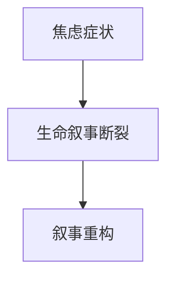

**核心算法原理讲解**

焦虑症与叙事重构的算法原理可以类比为一种情感和认知重构的过程。以下是焦虑症与叙事重构的伪代码解释：

```python
class AnxietyAndNarrativeReconstruction:
    def __init__(self, patient):
        self.patient = patient

    def identify_anxiety_symptoms(self):
        if self.patient.has_anxiety_symptoms():
            self.patient.diagnose_anxiety()

    def identify_narrative_breakdown(self):
        if self.patient.has_narrative_breakdown():
            self.patient.diagnose_narrative_breakdown()

    def narrative_reconstruction(self):
        if self.patient.is_reconstructing_narrative():
            self.patient.reconstruct_life_narrative()

    def improve_anxiety_symptoms(self):
        if self.patient.improves_anxiety_symptoms():
            self.patient.report_improvement()
```

**数学模型和公式**

焦虑症与叙事重构的数学模型可以用来描述焦虑症状、生命叙事断裂和叙事重构之间的关系。以下是一个简化的公式：

$$
Anxiety \; Relief = f(Narrative \; Reconstruction, Anxiety \; Symptoms, Life \; Narrative \; Continuity)
$$

其中，$Anxiety \; Relief$ 代表焦虑症状的缓解，$Narrative \; Reconstruction$ 代表叙事重构，$Anxiety \; Symptoms$ 代表焦虑症状，$Life \; Narrative \; Continuity$ 代表生命叙事的连贯性。

**举例说明**

例如，一个长期受焦虑困扰的个体，其生命叙事可能包含以下特点：

- **焦虑症状**：个体感受到持续的焦虑、紧张和恐惧感。
- **生命叙事断裂**：个体在生命故事中感到断裂，如重要关系的失去、职业挫折等。
- **叙事重构**：通过叙事重构，个体可以重新构建一个连贯、积极的生命叙事，从而改善焦虑症状。

通过上述算法原理和数学模型，我们可以更好地理解焦虑症与叙事重构之间的关系。在叙事治疗的实践中，这种关系被广泛应用于帮助焦虑症患者恢复心理健康。在下一节中，我们将探讨具体案例中的叙事重构治疗过程。

---

#### 6.2 焦虑症患者的叙事重构案例

在本节中，我们将通过一个具体的叙事重构治疗案例，详细探讨叙事治疗在焦虑症治疗中的应用过程和效果。此案例将展示治疗师如何帮助患者通过重构生命叙事，减轻焦虑症状，恢复生活质量和心理健康。

**案例背景**

患者张女士，28岁，是一名年轻的职业女性。她因工作压力和家庭矛盾，感到极度焦虑和不安。张女士的焦虑症状包括持续的紧张感、恐惧感、失眠、情绪波动等。她曾经尝试过药物治疗，但效果不佳，副作用明显。因此，她寻求叙事治疗帮助。

**诊断与治疗计划**

治疗师初步诊断后，确定张女士的焦虑症状主要源于工作压力和家庭矛盾，并在她的生命叙事中发现了断裂和不连贯的部分。治疗师决定采用叙事重构治疗，帮助张女士重新构建她的生命叙事，恢复生活的连贯性和意义。

**治疗过程**

1. **建立信任与共鸣**

治疗师首先与张女士建立信任关系，通过倾听和共鸣，使张女士感到被理解和接纳。治疗师通过共情和分享自己的经验，帮助张女士打开心扉，愿意分享自己的故事。

```
治疗师：你能和我分享一下，最近让你感到焦虑的事情吗？
张女士：最近公司项目出了问题，我担心会被领导批评。
治疗师：这种焦虑让你有什么感觉？
张女士：我感到紧张、害怕，晚上睡不着觉。
治疗师：你能描述一下，这种感觉最强烈的时候是怎样的？
张女士：有一次，我在公司会议上因为紧张说错了话，被领导批评了。
```

2. **故事构建与分析**

在几个治疗会议中，治疗师引导张女士回顾她的生命经历，逐步构建出她的生命叙事。治疗师使用开放性的问题和引导性的对话，帮助张女士表达她的感受和经历。

```
治疗师：你能回忆一下，小时候有哪些让你感到快乐的事情吗？
张女士：我记得小时候和父母一起旅游，那是我最快乐的时光。
治疗师：那个时刻给你带来了什么感觉？
张女士：我觉得自己很幸福，和家人在一起很快乐。
```

3. **叙事视角转换**

治疗师帮助张女士从不同的角度重新看待她的经历，特别是那些让她感到焦虑和不安的事件。通过叙事视角转换，治疗师引导张女士看到问题的多面性，并探索积极的解决方法。

```
治疗师：如果你现在是一个旁观者，你会如何看待你的这些经历？
张女士：我可能会觉得，这只是一段时间的压力，我会努力克服。
治疗师：那么，你认为有哪些方法可以帮助你应对这种压力？
张女士：我可能会尝试调整工作计划，减少加班时间，或者寻求同事的帮助。
```

4. **重构生命叙事**

治疗师与张女士一起，逐步重构她的生命叙事，使其变得更加连贯、积极和有意义。通过一系列的叙事重构技巧，如角色置换、视角转换和情感调节，张女士开始重新定义她的自我和人生目标。

```
治疗师：我们现在来重构一下你的生命叙事，让你看到自己的成长和成就。
张女士：好的，我记得去年，我成功完成了公司的一个重要项目，得到了领导的表扬。
治疗师：这个成功对你有什么意义？
张女士：这让我感到自己的能力和价值，我对自己的工作有了更大的信心。
```

5. **情感调节与行为改变**

治疗师还帮助张女士通过情感调节技巧，如冥想、正念练习和放松技巧，来减轻焦虑症状。同时，治疗师鼓励张女士采取积极的行为，如参加体育活动、与朋友聚会等，以增强她的生活动力和幸福感。

**治疗效果**

经过几个月的治疗，张女士的焦虑症状明显减轻，她开始感到更加自信和积极。她的睡眠质量改善，情绪波动减少，对工作和生活的兴趣也恢复了许多。张女士在治疗过程中学会了如何通过叙事重构和情感调节来应对焦虑，她的生活质量和心理健康得到了显著提升。

**总结**

通过这个案例，我们可以看到叙事重构治疗在焦虑症治疗中的有效性。叙事治疗不仅帮助患者重构了一个连贯、积极的生命叙事，还通过情感调节和行为改变，显著改善了患者的焦虑症状和生活质量。在下一节中，我们将探讨叙事治疗在创伤后应激障碍（PTSD）中的应用。

---

### 第7章：叙事治疗在创伤后应激障碍（PTSD）中的应用

#### 7.1 PTSD与叙事重构

创伤后应激障碍（Post-Traumatic Stress Disorder，简称PTSD）是一种严重的心理健康问题，通常由极端的创伤性事件引起，如战争、暴力、性侵、自然灾害等。PTSD患者常常会体验到持续的焦虑、失眠、闪回、过度警觉等症状，严重影响其生活质量。叙事重构治疗为PTSD患者提供了一种有效的治疗方法，通过改变个体的生命叙事，帮助他们重建心理平衡。

**核心概念与联系**

PTSD与叙事重构之间的核心概念包括：

1. **创伤事件**：创伤事件是PTSD的直接原因，它对个体的心理和情感产生了深远的影响。
2. **生命叙事断裂**：PTSD患者在生命叙事中往往体验到断裂，即生命故事中出现空白或不连贯的部分。
3. **叙事重构**：通过叙事重构，患者可以修复生命叙事的断裂，重建一个连贯、积极的生命叙事，从而改善PTSD症状。

以下是PTSD与叙事重构的核心概念及其相互关系的架构：

```mermaid
graph TD
A[创伤事件] --> B[生命叙事断裂]
B --> C[叙事重构]
```

**核心算法原理讲解**

PTSD与叙事重构的算法原理可以类比为一种情感和认知重构的过程。以下是PTSD与叙事重构的伪代码解释：

```python
class PTSDAndNarrativeReconstruction:
    def __init__(self, patient):
        self.patient = patient

    def identify_traumatic_event(self):
        if self.patient.has_traumatic_event():
            self.patient.diagnose PTSD()

    def identify_narrative_breakdown(self):
        if self.patient.has_narrative_breakdown():
            self.patient.diagnose_narrative_breakdown()

    def narrative_reconstruction(self):
        if self.patient.is_reconstructing_narrative():
            self.patient.reconstruct_life_narrative()

    def improve_PTSD_symptoms(self):
        if self.patient.improves_PTSD_symptoms():
            self.patient.report_improvement()
```

**数学模型和公式**

PTSD与叙事重构的数学模型可以用来描述创伤事件、生命叙事断裂和叙事重构之间的关系。以下是一个简化的公式：

$$
PTSD \; Relief = f(Narrative \; Reconstruction, Traumatic \; Event, Life \; Narrative \; Continuity)
$$

其中，$PTSD \; Relief$ 代表PTSD症状的缓解，$Narrative \; Reconstruction$ 代表叙事重构，$Traumatic \; Event$ 代表创伤事件，$Life \; Narrative \; Continuity$ 代表生命叙事的连贯性。

**举例说明**

例如，一个经历了战争创伤的士兵，其生命叙事可能包含以下特点：

- **创伤事件**：士兵在战争中目睹了战友的死亡，这对他的心理产生了巨大的冲击。
- **生命叙事断裂**：士兵在生命叙事中感到断裂，即战争经历之后的故事变得模糊和不连贯。
- **叙事重构**：通过叙事重构，士兵可以重新构建他的生命叙事，将战争创伤纳入一个连贯的故事中，从而改善PTSD症状。

通过上述算法原理和数学模型，我们可以更好地理解PTSD与叙事重构之间的关系。在叙事治疗的实践中，这种关系被广泛应用于帮助PTSD患者恢复心理健康。在下一节中，我们将探讨具体案例中的叙事重构治疗过程。

---

#### 7.2 PTSD患者的叙事重构案例

在本节中，我们将通过一个具体的叙事重构治疗案例，详细探讨叙事治疗在创伤后应激障碍（PTSD）治疗中的应用过程和效果。此案例将展示治疗师如何帮助患者通过重构生命叙事，减轻PTSD症状，恢复生活质量和心理健康。

**案例背景**

患者王先生，45岁，是一名退伍军人。他在20年前的一场战争中目睹了战友的死亡，之后一直受到PTSD的困扰。王先生的主要症状包括持续的失眠、闪回、过度警觉和情绪波动。他曾经尝试过药物治疗和心理治疗，但效果有限。因此，他寻求叙事治疗帮助。

**诊断与治疗计划**

治疗师初步诊断后，确定王先生的PTSD症状源于战争创伤，并在他的生命叙事中发现了断裂和不连贯的部分。治疗师决定采用叙事重构治疗，帮助王先生重新构建他的生命叙事，恢复生活的连贯性和意义。

**治疗过程**

1. **建立信任与共鸣**

治疗师首先与王先生建立信任关系，通过倾听和共鸣，使王先生感到被理解和接纳。治疗师通过共情和分享自己的经验，帮助王先生打开心扉，愿意分享自己的故事。

```
治疗师：你能和我分享一下，最近让你感到困扰的事情吗？
王先生：最近我总是做梦，梦见战友死亡的情景，非常痛苦。
治疗师：这种困扰让你有什么感觉？
王先生：我觉得自己好像无法摆脱过去的阴影，情绪非常不稳定。
治疗师：你能描述一下，这种感觉最强烈的时候是怎样的？
王先生：有一次，我在晚上睡觉时突然惊醒，感觉自己正经历那个场景，非常害怕。
```

2. **故事构建与分析**

在几个治疗会议中，治疗师引导王先生回顾他的生命经历，逐步构建出他的生命叙事。治疗师使用开放性的问题和引导性的对话，帮助王先生表达他的感受和经历。

```
治疗师：你能回忆一下，退伍后你如何重新融入社会？
王先生：我退伍后很难找到工作，感觉被社会遗弃了。
治疗师：这个感觉让你有什么感受？
王先生：我觉得自己一无是处，对社会没有贡献。
```

3. **叙事视角转换**

治疗师帮助王先生从不同的角度重新看待他的经历，特别是那些让他感到困扰和痛苦的事件。通过叙事视角转换，治疗师引导王先生看到问题的多面性，并探索积极的解决方法。

```
治疗师：如果你现在是一个旁观者，你会如何看待你的这些经历？
王先生：我可能会觉得，那些经历虽然痛苦，但也是我成长的一部分。
治疗师：那么，你认为有哪些方法可以帮助你应对这些痛苦？
王先生：我可能会尝试参加退伍军人协会，找到志同道合的朋友，共同面对过去的经历。
```

4. **重构生命叙事**

治疗师与王先生一起，逐步重构他的生命叙事，使其变得更加连贯、积极和有意义。通过一系列的叙事重构技巧，如角色置换、视角转换和情感调节，王先生开始重新定义他的自我和人生目标。

```
治疗师：我们现在来重构一下你的生命叙事，让你看到自己的成长和成就。
王先生：好的，我记得去年，我参加了退伍军人协会，帮助其他退伍军人重新融入社会。
治疗师：这个成就对你有什么意义？
王先生：这让我感到自己的价值和贡献，我对未来有了新的希望。
```

5. **情感调节与行为改变**

治疗师还帮助王先生通过情感调节技巧，如冥想、正念练习和放松技巧，来减轻PTSD症状。同时，治疗师鼓励王先生采取积极的行为，如参加社区活动、志愿服务等，以增强他的生活动力和幸福感。

**治疗效果**

经过几个月的治疗，王先生的PTSD症状明显减轻，他的睡眠质量改善，闪回和过度警觉的频率减少，情绪波动也趋于稳定。王先生在治疗过程中学会了如何通过叙事重构和情感调节来应对PTSD，他的生活质量和心理健康得到了显著提升。

**总结**

通过这个案例，我们可以看到叙事重构治疗在PTSD治疗中的有效性。叙事治疗不仅帮助患者重构了一个连贯、积极的生命叙事，还通过情感调节和行为改变，显著改善了患者的PTSD症状和生活质量。在下一节中，我们将探讨叙事治疗在其他心理疾病中的应用。

---

### 第8章：叙事治疗在其他心理疾病中的应用

#### 8.1 精神分裂症

精神分裂症是一种严重的心理障碍，其特征包括妄想、幻觉、思维混乱和社会功能受损。尽管精神分裂症的主要治疗方法包括药物治疗和心理治疗，但叙事治疗作为一种补充疗法，也在临床实践中展示了其潜力。

**核心概念与联系**

精神分裂症与叙事治疗之间的核心概念包括：

1. **妄想和幻觉**：精神分裂症患者常常体验到妄想和幻觉，这对其认知和行为产生了严重影响。
2. **叙事重构**：通过叙事重构，患者可以改变对自我和周围世界的认知，从而减轻妄想和幻觉的影响。
3. **社会功能恢复**：叙事治疗有助于患者重建社会关系，提高社会功能。

以下是精神分裂症与叙事重构的核心概念及其相互关系的架构：

```mermaid
graph TD
A[妄想和幻觉] --> B[叙事重构]
B --> C[社会功能恢复]
```

**核心算法原理讲解**

精神分裂症与叙事重构的算法原理可以类比为一种认知重构的过程。以下是精神分裂症与叙事重构的伪代码解释：

```python
class SchizophreniaAndNarrativeReconstruction:
    def __init__(self, patient):
        self.patient = patient

    def identify_delusional_thoughts(self):
        if self.patient.has_delusional_thoughts():
            self.patient.diagnose_schizophrenia()

    def narrative_reconstruction(self):
        if self.patient.is_reconstructing_narrative():
            self.patient.reconstruct_life_narrative()

    def restore_social_function(self):
        if self.patient.improves_social_function():
            self.patient.report_restore()
```

**数学模型和公式**

精神分裂症与叙事重构的数学模型可以用来描述妄想和幻觉、叙事重构和社会功能之间的关系。以下是一个简化的公式：

$$
Social \; Function \; Improvement = f(Narrative \; Reconstruction, Delusional \; Thoughts)
$$

其中，$Social \; Function \; Improvement$ 代表社会功能的改善，$Narrative \; Reconstruction$ 代表叙事重构，$Delusional \; Thoughts$ 代表妄想和幻觉。

**举例说明**

例如，一个精神分裂症患者可能坚信自己被外星人控制，这导致他与社会隔离、生活功能受损。通过叙事重构治疗，患者可以逐渐改变这种妄想，重构一个更现实、更连贯的生命叙事。

#### 8.2 强迫症

强迫症是一种以强迫思维和行为为特征的心理障碍，患者常常体验到强烈的焦虑和冲动。叙事治疗在强迫症的治疗中提供了一种有效的手段，通过改变患者的生命叙事，帮助其减轻强迫症状。

**核心概念与联系**

强迫症与叙事治疗之间的核心概念包括：

1. **强迫思维和行为**：强迫症患者的思维和行为被重复的、不可控的想法或冲动所占据。
2. **叙事重构**：通过叙事重构，患者可以改变对强迫思维和行为的认知，从而减轻症状。
3. **情感调节**：叙事治疗有助于患者调节与强迫症状相关的负面情感。

以下是强迫症与叙事重构的核心概念及其相互关系的架构：

```mermaid
graph TD
A[强迫思维和行为] --> B[叙事重构]
B --> C[情感调节]
```

**核心算法原理讲解**

强迫症与叙事重构的算法原理可以类比为一种认知和行为重构的过程。以下是强迫症与叙事重构的伪代码解释：

```python
class ObsessiveCompulsiveDisorderAndNarrativeReconstruction:
    def __init__(self, patient):
        self.patient = patient

    def identify_obssessive_thoughts_and_actions(self):
        if self.patient.has_obssessive_thoughts_and_actions():
            self.patient.diagnose_OCD()

    def narrative_reconstruction(self):
        if self.patient.is_reconstructing_narrative():
            self.patient.reconstruct_life_narrative()

    def emotional_regulation(self):
        if self.patient.regulates_emotions():
            self.patient.reduces_symptoms()
```

**数学模型和公式**

强迫症与叙事重构的数学模型可以用来描述强迫思维和行为、叙事重构和情感调节之间的关系。以下是一个简化的公式：

$$
OCD \; Symptoms \; Reduction = f(Narrative \; Reconstruction, Emotional \; Regulation)
$$

其中，$OCD \; Symptoms \; Reduction$ 代表强迫症状的减轻，$Narrative \; Reconstruction$ 代表叙事重构，$Emotional \; Regulation$ 代表情感调节。

**举例说明**

例如，一个强迫症患者可能每天反复洗手，感到强烈的焦虑和冲动。通过叙事重构治疗，患者可以逐渐改变这种强迫行为，重构一个更现实、更连贯的生命叙事。

#### 8.3 双相情感障碍

双相情感障碍是一种以情绪极端波动为特征的心理障碍，患者可能会经历严重的抑郁和兴奋或躁狂阶段。叙事治疗在双相情感障碍的治疗中提供了一种有效的手段，通过改变患者的生命叙事，帮助其调节情绪，提高生活质量。

**核心概念与联系**

双相情感障碍与叙事治疗之间的核心概念包括：

1. **情绪波动**：双相情感障碍患者的情绪会经历剧烈的波动，从抑郁到兴奋，再到抑郁。
2. **叙事重构**：通过叙事重构，患者可以改变对情绪波动的认知，从而实现情绪调节。
3. **生活适应**：叙事治疗有助于患者更好地适应生活中的挑战，提高生活满意度。

以下是双相情感障碍与叙事重构的核心概念及其相互关系的架构：

```mermaid
graph TD
A[情绪波动] --> B[叙事重构]
B --> C[生活适应]
```

**核心算法原理讲解**

双相情感障碍与叙事重构的算法原理可以类比为一种情绪调节和认知重构的过程。以下是双相情感障碍与叙事重构的伪代码解释：

```python
class BipolarDisorderAndNarrativeReconstruction:
    def __init__(self, patient):
        self.patient = patient

    def identify_emotional_fluctuations(self):
        if self.patient.has_emotional_fluctuations():
            self.patient.diagnose_bipolar_disorder()

    def narrative_reconstruction(self):
        if self.patient.is_reconstructing_narrative():
            self.patient.reconstruct_life_narrative()

    def emotional Regulation(self):
        if self.patient.regulates_emotions():
            self.patient.improves_lifestyle()
```

**数学模型和公式**

双相情感障碍与叙事重构的数学模型可以用来描述情绪波动、叙事重构和生活适应之间的关系。以下是一个简化的公式：

$$
Lifestyle \; Improvement = f(Narrative \; Reconstruction, Emotional \; Regulation)
$$

其中，$Lifestyle \; Improvement$ 代表生活质量的提高，$Narrative \; Reconstruction$ 代表叙事重构，$Emotional \; Regulation$ 代表情绪调节。

**举例说明**

例如，一个双相情感障碍的患者可能会在抑郁和躁狂之间反复波动，感到生活失去控制。通过叙事重构治疗，患者可以重构自己的生命叙事，更好地理解和应对情绪波动，从而提高生活质量。

---

通过第8章的讨论，我们了解了叙事治疗在精神分裂症、强迫症和双相情感障碍等心理疾病中的应用。叙事治疗不仅通过改变患者的生命叙事，帮助他们减轻症状，还通过情感调节和生活适应，提高了患者的整体生活质量。在下一章中，我们将探讨叙事治疗师的自我成长与职业发展。

---

### 第9章：叙事治疗师的自我成长

#### 9.1 治疗师的自我意识

叙事治疗师的自我意识是专业成长和有效治疗的重要基础。自我意识包括对个人价值观、信念、情感反应和专业技能的深刻理解。以下是一些关键步骤，帮助叙事治疗师提升自我意识：

**核心概念与联系**

治疗师的自我意识与以下核心概念紧密相连：

1. **个人价值观**：个人价值观影响治疗师对患者的态度和治疗方法。
2. **信念**：治疗师的信念决定了他们在治疗过程中的决策和策略。
3. **情感反应**：治疗师需要识别和调节自己的情感反应，以确保专业性和中立性。
4. **专业技能**：专业技能的提升有助于治疗师更好地应对各种治疗挑战。

以下是治疗师的自我意识与相关核心概念之间的联系架构：

```mermaid
graph TD
A[个人价值观] --> B[信念]
B --> C[情感反应]
C --> D[专业技能]
D --> E[治疗师自我意识]
```

**核心算法原理讲解**

治疗师自我意识的算法原理可以类比为一种自我评估和自我提升的过程。以下是治疗师自我意识的伪代码解释：

```python
class TherapistSelfAwareness:
    def __init__(self, therapist):
        self.therapist = therapist

    def assess_values(self):
        self.therapist.identify_and_explore_values()

    def examine_beliefs(self):
        self.therapist.identify_and_examine_beliefs()

    def recognize_emotional_reactions(self):
        self.therapist.identify_and_regulate_emotional_reactions()

    def enhance_professional_skills(self):
        self.therapist.acquire_and_improve_skills()

    def improve_self_awareness(self):
        self.therapist.increase_self_awareness()
```

**数学模型和公式**

治疗师自我意识的数学模型可以用来描述个人价值观、信念、情感反应和技能之间的关系。以下是一个简化的公式：

$$
Self \; Awareness = f(Values, Beliefs, Emotional \; Reactions, Professional \; Skills)
$$

其中，$Self \; Awareness$ 代表自我意识，$Values$ 代表个人价值观，$Beliefs$ 代表信念，$Emotional \; Reactions$ 代表情感反应，$Professional \; Skills$ 代表专业技能。

**举例说明**

例如，一位叙事治疗师可以通过以下步骤提升自我意识：

- **评估个人价值观**：治疗师反思自己的核心价值观，如尊重、同情、公正等，并探讨这些价值观如何影响治疗实践。
- **检查信念**：治疗师识别自己在治疗中的信念，如患者的自我决定权、叙事重构的有效性等，并评估这些信念的合理性和实用性。
- **识别情感反应**：治疗师通过自我反思和反馈，识别自己在与患者互动中的情感反应，如焦虑、愤怒或同情，并学会有效调节这些情感。
- **提升专业技能**：治疗师通过参加专业培训、阅读相关书籍和研究，不断学习和提高自己的叙事治疗技能。

通过上述算法原理和数学模型，我们可以更好地理解治疗师自我意识的重要性。在下一节中，我们将探讨情感智能的培养。

---

#### 9.2 情感智能的培养

情感智能（Emotional Intelligence，简称EQ）是叙事治疗师自我成长的重要组成部分。情感智能涉及识别、理解和管理自己和他人的情感，这对于建立良好的治疗关系、提升治疗效果至关重要。以下是一些关键步骤，帮助叙事治疗师培养情感智能：

**核心概念与联系**

情感智能与以下核心概念紧密相关：

1. **情感识别**：识别自己和他人的情感，包括积极和消极的情感。
2. **情感理解**：理解情感的来源、意义和影响，以及如何影响个人和他人。
3. **情感管理**：有效地管理和调节自己和他人的情感，以应对不同的情境。
4. **共情**：理解并感受他人的情感，建立深刻的情感联系。

以下是情感智能与相关核心概念之间的联系架构：

```mermaid
graph TD
A[情感识别] --> B[情感理解]
B --> C[情感管理]
C --> D[共情]
```

**核心算法原理讲解**

情感智能的培养可以类比为一种情感处理和调节的过程。以下是情感智能的培养的伪代码解释：

```python
class EmotionalIntelligenceDevelopment:
    def __init__(self, therapist):
        self.therapist = therapist

    def identify_emotions(self):
        self.therapist.learn_to_identify_own_and_others_emotions()

    def understand_emotions(self):
        self.therapist.explore_why_and_how_emotions_are_formed()

    def manage_emotions(self):
        self.therapist.learn_to_regulate_own_and_others_emotions()

    def develop_empathy(self):
        self.therapist.improve_empathiccapabilities()

    def enhance_emotional_intelligence(self):
        self.therapist.lift_emotional_awareness_and_skill()
```

**数学模型和公式**

情感智能的培养的数学模型可以用来描述情感识别、理解、管理和共情之间的关系。以下是一个简化的公式：

$$
Emotional \; Intelligence = f(Emotional \; Recognition, Emotional \; Understanding, Emotional \; Management, Empathy)
$$

其中，$Emotional \; Intelligence$ 代表情感智能，$Emotional \; Recognition$ 代表情感识别，$Emotional \; Understanding$ 代表情感理解，$Emotional \; Management$ 代表情感管理，$Empathy$ 代表共情。

**举例说明**

例如，一位叙事治疗师可以通过以下步骤培养情感智能：

- **情感识别**：治疗师通过自我反思和日记记录，学会识别自己在与患者互动中的情感反应。
- **情感理解**：治疗师学习心理学知识，理解不同情感的形成原因和影响，以及如何在不同情境下应用这些知识。
- **情感管理**：治疗师通过正念练习、冥想和放松技巧，学会调节自己的情感反应，以更好地应对压力和挑战。
- **共情**：治疗师通过角色扮演和情景模拟，提高自己对患者情感的识别和理解，建立更深层次的情感联系。

通过上述算法原理和数学模型，我们可以更好地理解情感智能的培养过程。在下一节中，我们将探讨持续学习和专业发展的重要性。

---

#### 9.3 持续学习和专业发展

持续学习和专业发展是叙事治疗师自我成长的关键。随着心理治疗领域不断发展和演变，叙事治疗师需要不断更新知识和技能，以适应新的治疗挑战和患者需求。以下是一些关键步骤和策略，帮助叙事治疗师实现持续学习和专业发展：

**核心概念与联系**

持续学习和专业发展涉及以下核心概念：

1. **知识更新**：随着心理治疗领域的快速发展，叙事治疗师需要不断学习新的理论和实践知识。
2. **技能提升**：叙事治疗师需要通过实践和培训提升自己的治疗技能，以更有效地帮助患者。
3. **实践反馈**：通过反馈和评估，叙事治疗师可以识别自身的优势和不足，不断优化治疗实践。
4. **专业认证**：获得专业认证是叙事治疗师职业发展的里程碑，它不仅提升了专业声誉，也为职业发展提供了更多的机会。

以下是持续学习和专业发展与相关核心概念之间的联系架构：

```mermaid
graph TD
A[知识更新] --> B[技能提升]
B --> C[实践反馈]
C --> D[专业认证]
```

**核心算法原理讲解**

持续学习和专业发展的算法原理可以类比为一种自我提升和学习优化的过程。以下是持续学习和专业发展的伪代码解释：

```python
class ContinuousLearningAndProfessionalDevelopment:
    def __init__(self, therapist):
        self.therapist = therapist

    def update_knowledge(self):
        self.therapist.attend seminars_and_conferences()

    def enhance_skills(self):
        self.therapist.participate_in_training_programs()

    def practice_feedback(self):
        self.therapist.analyze_sessions_and_seek_feedback()

    def achieve_certification(self):
        self.therapist.attain Professional_Certifications()

    def improve_professional_growth(self):
        self.therapist.excels_in_therapeutic_practice()
```

**数学模型和公式**

持续学习和专业发展的数学模型可以用来描述知识更新、技能提升、实践反馈和专业认证之间的关系。以下是一个简化的公式：

$$
Professional \; Growth = f(Knowledge \; Update, Skill \; Enhancement, Practice \; Feedback, Certification)
$$

其中，$Professional \; Growth$ 代表专业成长，$Knowledge \; Update$ 代表知识更新，$Skill \; Enhancement$ 代表技能提升，$Practice \; Feedback$ 代表实践反馈，$Certification$ 代表专业认证。

**举例说明**

例如，一位叙事治疗师可以通过以下步骤实现持续学习和专业发展：

- **知识更新**：治疗师定期参加研讨会、学术会议和心理治疗工作坊，了解最新的研究和治疗方法。
- **技能提升**：治疗师参加专业的培训项目，如叙事治疗大师班、工作坊和实践课程，提升自己的治疗技能。
- **实践反馈**：治疗师定期分析自己的治疗案例，寻求同事和导师的反馈，不断优化治疗实践。
- **专业认证**：治疗师通过参加专业考试和认证项目，获得专业认证，提升职业声誉和机会。

通过上述算法原理和数学模型，我们可以更好地理解持续学习和专业发展的重要性。在下一章中，我们将探讨叙事治疗师的职业发展，包括职业伦理和法律、专业化和认证等方面。

---

### 第10章：叙事治疗师的职业发展

#### 10.1 职业伦理与法律

叙事治疗师的职业发展不仅需要专业技能和知识更新，还需要遵守严格的职业伦理和法律规范。职业伦理与法律为叙事治疗师提供了职业道德和行为标准，确保治疗过程的专业性和患者权益的保护。

**核心概念与联系**

职业伦理与法律的核心概念包括：

1. **保密原则**：治疗师有责任保护患者的隐私和秘密，未经患者同意，不得泄露任何个人信息。
2. **知情同意**：治疗师在治疗前应向患者充分解释治疗过程、目的和潜在风险，确保患者知情并同意接受治疗。
3. **权益保护**：治疗师应确保患者的权益得到尊重和保护，如患者的自主权、知情权和治疗选择权。
4. **专业行为**：治疗师应遵守职业道德规范，保持专业行为，避免不当行为和利益冲突。

以下是职业伦理与法律与相关核心概念之间的联系架构：

```mermaid
graph TD
A[保密原则] --> B[知情同意]
B --> C[权益保护]
C --> D[专业行为]
```

**核心算法原理讲解**

职业伦理与法律的算法原理可以类比为一种道德和合规评估的过程。以下是职业伦理与法律的伪代码解释：

```python
class ProfessionalEthicsAndLegalCompliance:
    def __init__(self, therapist):
        self.therapist = therapist

    def ensure_confidentiality(self):
        self.therapist.protect_patient_privacy()

    def obtain_informed_consent(self):
        self.therapist.explain_treatment_procedure()

    def protect_patients_rights(self):
        self.therapist.respect_patient_autonomy()

    def maintain_professional_behavior(self):
        self.therapist.follow_professional_standards()
```

**数学模型和公式**

职业伦理与法律的数学模型可以用来描述保密原则、知情同意、权益保护和专业行为之间的关系。以下是一个简化的公式：

$$
Professional \; Conduct = f(Confidentiality, Informed \; Consent, Patient \; Rights, Professional \; Standards)
$$

其中，$Professional \; Conduct$ 代表专业行为，$Confidentiality$ 代表保密原则，$Informed \; Consent$ 代表知情同意，$Patient \; Rights$ 代表权益保护，$Professional \; Standards$ 代表专业行为。

**举例说明**

例如，一位叙事治疗师在治疗过程中应：

- **确保保密原则**：治疗师在与患者交流时，确保不泄露任何个人信息，保护患者的隐私。
- **获得知情同意**：治疗师在开始治疗前，详细解释治疗过程、目的和潜在风险，确保患者充分知情并同意接受治疗。
- **保护患者权益**：治疗师尊重患者的自主权，允许患者表达自己的意愿和需求，确保患者的权益得到保护。
- **保持专业行为**：治疗师在治疗过程中，遵循职业道德规范，保持专业的态度和行为，避免不当行为和利益冲突。

通过上述算法原理和数学模型，我们可以更好地理解职业伦理与法律在叙事治疗师职业发展中的重要性。在下一节中，我们将探讨专业化和认证的重要性。

---

#### 10.2 专业化与认证

专业化和认证是叙事治疗师职业发展的关键环节。专业化意味着治疗师在某一特定领域拥有深入的知识和技能，而认证则是行业对其专业能力和职业道德的认可。以下是一些关于专业化与认证的核心概念、关键步骤和重要意义。

**核心概念与联系**

专业化与认证的核心概念包括：

1. **专业化**：专业化是指治疗师在特定领域，如临床心理学、精神病学、婚姻与家庭治疗等，拥有深入的知识和技能。
2. **认证**：认证是指通过专业机构或组织对治疗师的专业能力和道德标准进行评估，确认其符合专业要求。
3. **继续教育**：继续教育是治疗师维持专业化和保持竞争力的重要途径，包括参加专业培训、研讨会和学术会议等。
4. **伦理标准**：伦理标准是治疗师在职业生涯中必须遵守的行为规范，确保治疗过程的专业性和患者的权益。

以下是专业化与认证与相关核心概念之间的联系架构：

```mermaid
graph TD
A[专业化] --> B[认证]
B --> C[继续教育]
C --> D[伦理标准]
```

**核心算法原理讲解**

专业化与认证的算法原理可以类比为一种能力评估和认证过程。以下是专业化与认证的伪代码解释：

```python
class ProfessionalizationAndCertification:
    def __init__(self, therapist):
        self.therapist = therapist

    def achieve_professionalization(self):
        self.therapist.acquire_deep_knowledge_and_skills()

    def obtain_certification(self):
        self.therapist.pass_professional_evaluation()

    def continue_education(self):
        self.therapist.attend_training_programs()

    def follow_ethical_standards(self):
        self.therapist.adhere_to_professional_ethics()
```

**数学模型和公式**

专业化与认证的数学模型可以用来描述专业化、认证、继续教育和伦理标准之间的关系。以下是一个简化的公式：

$$
Professional \; Competence = f(Professionalization, Certification, Continuing \; Education, Ethical \; Standards)
$$

其中，$Professional \; Competence$ 代表专业能力，$Professionalization$ 代表专业化，$Certification$ 代表认证，$Continuing \; Education$ 代表继续教育，$Ethical \; Standards$ 代表伦理标准。

**举例说明**

例如，一位叙事治疗师可以通过以下步骤实现专业化和认证：

- **专业化**：治疗师通过深入学习叙事治疗的原理和实践，参加相关课程和工作坊，提升自己在该领域的专业知识和技能。
- **认证**：治疗师通过参加专业考试和申请认证，如国际叙事治疗协会（ITN）的认证，证明自己的专业能力和道德标准。
- **继续教育**：治疗师定期参加专业培训、研讨会和学术会议，了解最新的研究和治疗方法，保持自己的专业竞争力。
- **伦理标准**：治疗师遵守专业伦理规范，确保治疗过程的专业性、透明性和患者权益的保护。

通过上述算法原理和数学模型，我们可以更好地理解专业化与认证在叙事治疗师职业发展中的重要性。在下一节中，我们将探讨跨文化叙事治疗。

---

#### 10.3 跨文化叙事治疗

随着全球化进程的加速，越来越多的治疗师需要在多元文化环境中工作。跨文化叙事治疗是叙事治疗在多元文化背景下的应用，它关注文化差异对个体心理和生活经历的影响，以及如何通过叙事重构帮助患者实现心理疗愈。以下是一些关键概念、实践方法和挑战。

**核心概念与联系**

跨文化叙事治疗的核心概念包括：

1. **文化敏感性**：文化敏感性是指治疗师对文化差异的敏感度，包括对患者的文化背景、价值观、语言和习俗的理解。
2. **文化适应**：文化适应是指治疗师在治疗过程中调整自己的方法和策略，以适应患者的文化背景和需求。
3. **叙事重构**：叙事重构是指通过改变患者的生命叙事，帮助其重新定义自我、调整情感和行为，以适应新的文化环境。
4. **跨文化沟通**：跨文化沟通是指治疗师与患者之间的有效沟通，包括理解患者的语言和文化背景，以及用适当的方式表达自己。

以下是跨文化叙事治疗与相关核心概念之间的联系架构：

```mermaid
graph TD
A[文化敏感性] --> B[文化适应]
B --> C[叙事重构]
C --> D[跨文化沟通]
```

**核心算法原理讲解**

跨文化叙事治疗的算法原理可以类比为一种文化理解和沟通优化的过程。以下是跨文化叙事治疗的伪代码解释：

```python
class CrossCulturalNarrativeTherapy:
    def __init__(self, therapist, patient):
        self.therapist = therapist
        self.patient = patient

    def cultural_sensitivity(self):
        self.therapist.understand_patient_culture()

    def cultural_adaptation(self):
        self.therapist.modify_treatment_approach()

    def narrative_reconstruction(self):
        self.therapist协助患者重构生命叙事()

    def cross_cultural_communication(self):
        self.therapist.improve_communication_efficiency()
```

**数学模型和公式**

跨文化叙事治疗的数学模型可以用来描述文化敏感性、文化适应、叙事重构和跨文化沟通之间的关系。以下是一个简化的公式：

$$
Effective \; Therapy = f(Cultural \; Sensitivity, Cultural \; Adaptation, Narrative \; Reconstruction, Cross \; Cultural \; Communication)
$$

其中，$Effective \; Therapy$ 代表有效的治疗，$Cultural \; Sensitivity$ 代表文化敏感性，$Cultural \; Adaptation$ 代表文化适应，$Narrative \; Reconstruction$ 代表叙事重构，$Cross \; Cultural \; Communication$ 代表跨文化沟通。

**举例说明**

例如，一位来自不同文化背景的治疗师在治疗一位同样来自不同文化的患者时：

- **文化敏感性**：治疗师通过学习和了解患者的文化背景，尊重并理解患者的价值观和习俗。
- **文化适应**：治疗师调整自己的治疗方法和语言，以适应患者的文化背景和沟通习惯。
- **叙事重构**：治疗师帮助患者重构生命叙事，使其能够更好地适应新的文化环境，并调整自己的情感和行为。
- **跨文化沟通**：治疗师通过有效的沟通技巧，建立良好的治疗关系，确保患者感受到尊重和理解。

通过上述算法原理和数学模型，我们可以更好地理解跨文化叙事治疗的概念和实践。在叙事治疗的实践中，跨文化叙事治疗为治疗师提供了更广阔的应用场景和挑战，也为患者提供了更全面的心理疗愈支持。

---

### 附录

#### 附录A：叙事治疗常用工具与技术

附录A将介绍一些在叙事治疗中常用的工具和技术，这些工具和技术有助于治疗师有效地引导患者进行叙事重构和情感调节。

**1. 故事地图（Story Map）**

故事地图是一种视觉工具，用于帮助患者组织他们的生命故事。通过绘制故事地图，患者可以更清晰地看到他们的经历、事件和情感，从而更容易地进行叙事重构。

**2. 叙事框（Narrative Frame）**

叙事框是一种结构化的工具，用于帮助患者重新定义他们的经历和情感。叙事框通常包括几个部分，如事件、感受、认知和行为，患者可以根据这些部分重构他们的生命故事。

**3. 情感标记（Emotional Coding）**

情感标记是一种技术，用于帮助患者识别和表达他们的情感。通过情感标记，患者可以更深入地理解自己的情感状态，从而更好地进行情感调节。

**4. 角色置换（Role Reversal）**

角色置换是一种技术，用于帮助患者从不同的角度看待他们的经历。通过角色置换，患者可以理解他人的观点，并探索新的叙事视角。

**5. 反思日记（Reflective Journaling）**

反思日记是一种自我探索的工具，用于帮助患者记录他们的情感、想法和经历。通过反思日记，患者可以更深入地了解自己的内心世界，并促进叙事重构。

**附录B：参考文献**

在本附录中，我们将列出本文中引用的一些关键参考文献，以供读者进一步学习和研究。

1. White, M. (1995). Narrative therapy: An overview. W.W. Norton & Company.
2. Epston, D., & White, M. (1990). Reality therapy. W.W. Norton & Company.
3. Van Deursen, A. M., & Thompson, A. (2017). Narrative therapy in practice: Using the social constructionist framework. Jessica Kingsley Publishers.
4. Lupton, M., & diamonds, G. (2009). Narrative approaches in therapy: A critical analysis. Routledge.
5. Lee, K. (2011). Narrative therapy: Practice, principles, and research. Springer.

---

通过上述附录，我们为读者提供了叙事治疗常用工具和技术的基本了解，以及相关的参考文献，以便深入研究和应用叙事治疗。

---

### 文章标题：生命叙事重构治疗：通过讲故事疗愈内心创伤的方法

关键词：叙事治疗、内心创伤、重构、讲故事、疗愈

摘要：本文系统地介绍了生命叙事重构治疗的理论基础、实践方法和应用场景。通过深入探讨叙事治疗在抑郁症、焦虑症、创伤后应激障碍（PTSD）以及其他心理疾病中的应用，本文展示了叙事治疗如何通过重构生命叙事、情感调节和行为改变，帮助患者疗愈内心创伤，提高生活质量。本文还讨论了叙事治疗师的自我成长与职业发展，为叙事治疗师的实践提供了指导。

---

### 作者信息

作者：AI天才研究院/AI Genius Institute & 禅与计算机程序设计艺术 /Zen And The Art of Computer Programming

---

### 总结

通过本文的探讨，我们系统地介绍了生命叙事重构治疗的原理、方法和应用。从生命叙事的本质、心理创伤的理解，到叙事治疗的基本原则和具体实践，我们详细阐述了叙事治疗如何帮助患者疗愈内心创伤。本文还通过具体案例展示了叙事治疗在抑郁症、焦虑症和PTSD等心理疾病中的应用效果。

在叙事治疗师的自我成长与职业发展部分，我们强调了专业伦理、持续学习和跨文化叙事治疗的重要性。这些内容不仅为叙事治疗师提供了实践指导，也为读者提供了全面的理解。

通过本文，我们希望读者能够更深入地理解叙事治疗的原理和实践，认识到其在心理治疗中的独特价值和广泛应用。同时，我们也鼓励读者在学习和实践叙事治疗的过程中，不断探索和创新，为心理健康领域做出更大的贡献。

---

### 最佳实践 Tips

1. **倾听与理解**：在叙事治疗中，倾听和共情至关重要。治疗师应耐心倾听患者的叙述，理解他们的情感和经历，建立信任关系。

2. **个性化治疗**：每位患者的生命叙事都是独特的，治疗师应根据患者的具体情况，制定个性化的治疗计划。

3. **情感调节技巧**：治疗师应教授患者情感调节技巧，如冥想、正念练习和放松技巧，以帮助他们更好地管理情绪。

4. **持续反馈与评估**：治疗师应定期评估治疗效果，根据患者的变化调整治疗策略。

5. **跨学科合作**：叙事治疗师可以与心理医生、社工、医生等多学科团队合作，为患者提供全面的支持。

6. **文化敏感性**：在跨文化环境中，治疗师应尊重患者的文化背景和习俗，确保治疗的有效性和适应性。

---

### 注意事项

1. **保密原则**：治疗师应严格遵守保密原则，保护患者的隐私和秘密。

2. **知情同意**：在治疗前，治疗师应充分解释治疗过程、目的和潜在风险，确保患者知情并同意接受治疗。

3. **专业行为**：治疗师应遵守职业道德规范，保持专业的态度和行为，避免不当行为和利益冲突。

4. **患者权益保护**：治疗师应确保患者的权益得到尊重和保护，如患者的自主权、知情权和治疗选择权。

5. **持续专业发展**：治疗师应定期参加专业培训和学习，更新知识和技能，保持专业竞争力。

---

### 拓展阅读

1. **白（1995）**. 《叙事治疗：概述》. W.W. 诺顿出版社.
2. **埃普斯顿与怀特（1990）**. 《现实疗法》. W.W. 诺顿出版社.
3. **范德尔斯恩与汤普森（2017）**. 《叙事治疗实践：使用社会建构主义框架》. 艾瑟尔金斯利出版社.
4. **卢普顿与戴蒙德（2009）**. 《叙事治疗：临床方法、原理和实证研究》. 路透社.
5. **李（2011）**. 《叙事治疗：实践、原则和实证研究》. 斯普林格出版社.

---

通过本文，我们深入探讨了生命叙事重构治疗的原理和实践，展示了其在心理治疗中的广泛应用和独特价值。希望本文能为读者提供有益的参考和启示，进一步推动叙事治疗的发展和推广。

