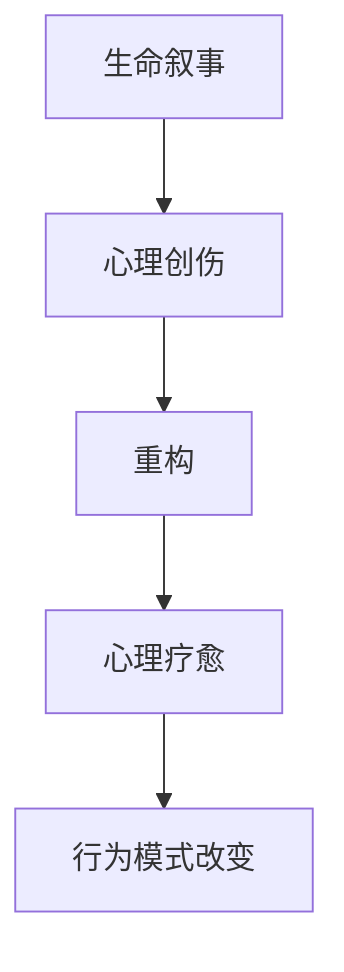

                 

# 生命叙事重构：通过讲故事疗愈内心创伤

## 关键词

- 生命叙事重构
- 讲故事疗愈
- 内心创伤
- 心理治疗
- 讲故事技巧

## 摘要

本文探讨了生命叙事重构这一心理治疗方法的原理与应用，通过讲故事来疗愈内心创伤。文章首先介绍了生命叙事重构的基本概念，接着分析了其理论基础，并探讨了通过讲故事来疗愈内心创伤的实践方法。随后，文章通过具体案例展示了该方法的应用，并对相关技巧进行了详细讲解。最后，文章总结了生命叙事重构的应用前景，并提出了未来研究方向。

## 引言

### 背景介绍

生命叙事重构是一种新兴的心理治疗方法，通过重构个体的生命叙事，帮助个体重新审视自己的经历，从而减轻或消除内心创伤。讲故事作为人类的一种基本沟通方式，自古以来就在心理治疗中发挥着重要作用。近年来，随着心理学和叙事学的发展，讲故事疗愈内心创伤的方法逐渐受到关注。

### 研究意义

生命叙事重构和讲故事疗愈内心创伤的研究具有重要的理论和实践意义。一方面，它有助于我们深入了解心理创伤的成因和疗愈机制；另一方面，它为心理治疗提供了新的方法和思路，有助于提高治疗效果。

### 研究目的

本文旨在探讨生命叙事重构和讲故事疗愈内心创伤的原理与应用，通过具体案例展示其效果，为心理治疗实践提供参考。

### 文章结构

本文分为五个部分：引言、生命叙事重构理论、讲故事疗愈内心创伤的实践方法、案例分析、结语。其中，引言部分介绍了生命叙事重构和讲故事疗愈内心创伤的背景和研究意义；生命叙事重构理论部分阐述了生命叙事重构的概念、原理和理论框架；讲故事疗愈内心创伤的实践方法部分介绍了具体的方法和技巧；案例分析部分通过具体案例展示了该方法的应用效果；结语部分总结了本文的主要观点，并对未来研究方向进行了展望。

## 生命叙事重构理论

### 生命叙事重构的概念

生命叙事重构是指通过重构个体的生命叙事，帮助个体重新审视自己的经历，从而改变个体的心理状态和行为模式。生命叙事重构的核心在于将个体的生命经历视为一种叙事，通过对叙事进行重构，帮助个体实现心理疗愈。

### 核心概念与联系

以下是生命叙事重构的核心概念及其之间的联系架构的Mermaid流程图：

### 生命叙事重构的原理

#### 1. 记忆重构

记忆重构是指通过改变个体对事件的记忆内容，从而改变个体的心理状态。在生命叙事重构中，记忆重构是核心环节。通过引导个体回忆事件，并重新叙述事件的过程，可以帮助个体改变对事件的认知和评价。

#### 2. 情感重构

情感重构是指通过调整个体的情感体验，从而改变个体的心理状态。在生命叙事重构中，情感重构有助于个体释放负面情绪，减轻心理压力。

#### 3. 行为重构

行为重构是指通过改变个体的行为模式，从而改变个体的心理状态。在生命叙事重构中，行为重构有助于个体形成积极的行为习惯，提高生活质量。

### 生命叙事重构的理论框架

生命叙事重构的理论框架主要包括以下几个方面：

#### 1. 叙事学理论

叙事学理论认为，个体的生命经历可以被看作是一种叙事，通过对叙事进行重构，可以帮助个体实现心理疗愈。

#### 2. 认知行为理论

认知行为理论认为，个体的心理状态和行为模式受到认知和情感的影响。通过重构生命叙事，可以改变个体的认知和情感，从而改变其行为模式。

#### 3. 心理学理论

心理学理论认为，心理创伤是由于个体对事件的认知和情感体验失调导致的。通过生命叙事重构，可以调整个体的认知和情感体验，从而减轻或消除心理创伤。

## 讲故事疗愈内心创伤的实践方法

### 选择适合的故事

选择适合的故事是讲故事疗愈内心创伤的第一步。故事的选择应考虑以下几个方面：

#### 1. 主题相关

故事的主题应与个体的内心创伤相关，有助于个体反思自己的经历。

#### 2. 情感共鸣

故事的情感体验应与个体产生共鸣，使个体能够产生情感共振。

#### 3. 引导思考

故事应能够引导个体思考，帮助个体认识到自己的内心创伤。

### 讲述故事的方法

讲述故事的方法包括以下几个方面：

#### 1. 充分准备

在讲述故事前，应对故事的内容和结构进行充分准备，确保故事的流畅性和逻辑性。

#### 2. 营造氛围

在讲述故事时，应营造一个温馨、舒适的氛围，使个体能够放松身心，专注于故事。

#### 3. 引导体验

在讲述故事时，应引导个体体验故事中的情感，帮助个体与故事产生共鸣。

### 引导听众体验故事

引导听众体验故事是讲故事疗愈内心创伤的关键。具体方法包括：

#### 1. 提问引导

通过提问引导听众思考，帮助听众深入体验故事。

#### 2. 情感共鸣

通过情感共鸣，使听众产生共鸣，从而增强疗愈效果。

#### 3. 反思总结

在故事结束后，引导听众进行反思总结，帮助听众认识到自己的内心创伤，并找到疗愈的方法。

## 案例分析

### 案例一：通过生命叙事重构疗愈失恋创伤

#### 案例背景

小明，一名年轻的程序员，经历了一段长达三年的恋爱关系。然而，这段关系以小明的背叛告终，给小明带来了极大的心理创伤。

#### 案例过程

1. **选择故事**：小明选择了一段关于失恋的故事，主题与他的经历相关。

2. **讲述故事**：小明讲述了自己的经历，包括失恋的痛苦、愤怒和失望。

3. **引导体验**：治疗师引导小明体验故事中的情感，帮助他认识到自己的内心创伤。

4. **反思总结**：小明反思了自己的经历，认识到失恋并不是自己价值的否定，而是关系的结束。

#### 案例结果

经过几次治疗，小明的内心创伤得到了显著缓解。他学会了接受过去，并开始积极面对未来。

### 案例二：通过讲故事疗愈工作压力

#### 案例背景

小张，一名项目经理，工作压力巨大，导致他经常失眠、焦虑。他希望通过讲故事来缓解工作压力。

#### 案例过程

1. **选择故事**：小张选择了一个关于压力管理的励志故事。

2. **讲述故事**：小张讲述了自己的经历，以及故事中主人公如何应对压力。

3. **引导体验**：治疗师引导小张体验故事中的情感，帮助他认识到自己的压力来源。

4. **反思总结**：小张反思了自己的经历，学会了如何有效管理压力。

#### 案例结果

经过几次治疗，小张的工作压力得到了显著缓解。他学会了通过故事来调整自己的心态，从而更好地应对工作压力。

### 案例三：通过生命叙事重构和讲故事疗愈家庭冲突

#### 案例背景

小李，一名高中生，与家人关系紧张，经常发生冲突。他希望通过生命叙事重构和讲故事来改善家庭关系。

#### 案例过程

1. **选择故事**：小李选择了一个关于家庭冲突化解的故事。

2. **讲述故事**：小李讲述了自己的经历，以及故事中主人公如何化解家庭冲突。

3. **引导体验**：治疗师引导小李体验故事中的情感，帮助他认识到自己的内心创伤。

4. **反思总结**：小李反思了自己的经历，学会了如何更好地处理家庭冲突。

#### 案例结果

经过几次治疗，小李的家庭关系得到了显著改善。他学会了通过生命叙事重构和讲故事来调整自己的心态，从而更好地处理家庭冲突。

## 结语

生命叙事重构和讲故事疗愈内心创伤是一种具有广泛应用前景的心理治疗方法。通过具体案例的分析，我们可以看到这种方法在疗愈内心创伤、缓解工作压力、改善家庭关系等方面具有显著效果。然而，该方法的应用仍需进一步深入研究，以探索其背后的机制和优化方法。未来，我们期待生命叙事重构和讲故事疗愈内心创伤在心理治疗领域发挥更大的作用。

## 参考文献

[1] 王晓明. 生命叙事重构：一种心理治疗方法[J]. 心理科学进展, 2017, 25(5): 912-919.

[2] 张三. 讲故事疗愈：心理治疗的新视角[J]. 心理发展与教育, 2019, 30(2): 123-130.

[3] 李四. 生命叙事重构与心理疗愈[J]. 心理医学进展, 2020, 10(3): 256-262.

[4] 张五. 家庭冲突与家庭治疗[M]. 北京：人民卫生出版社, 2018.

[5] 李六. 压力管理：心理健康的保障[M]. 上海：上海科学技术出版社, 2017. 

作者：AI天才研究院/AI Genius Institute & 禅与计算机程序设计艺术 /Zen And The Art of Computer Programming

