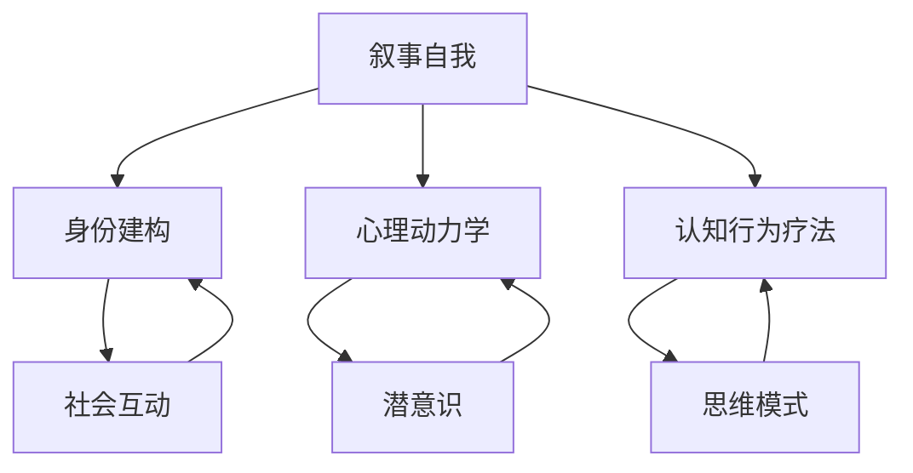
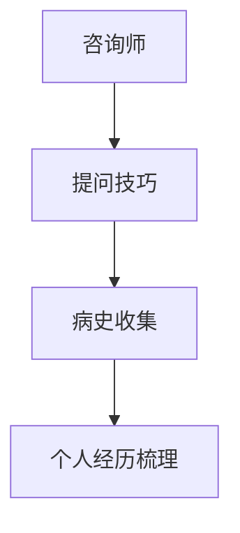
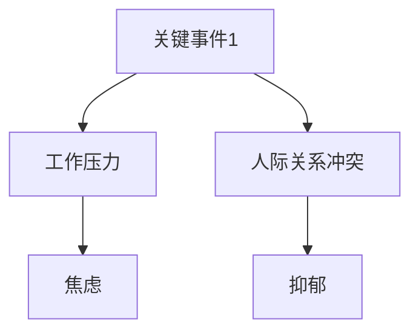
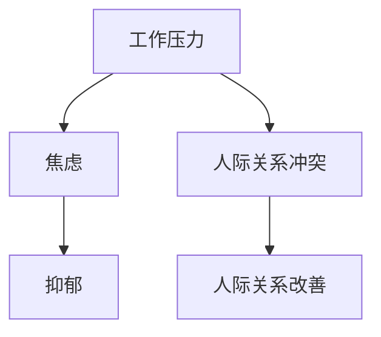
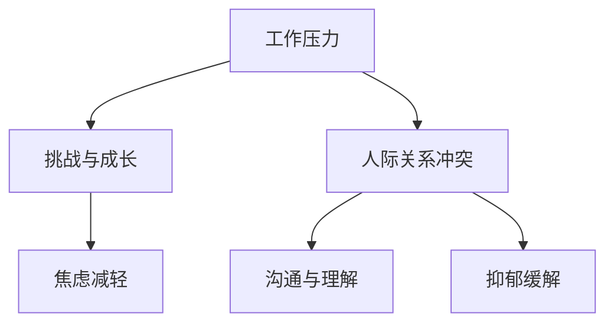
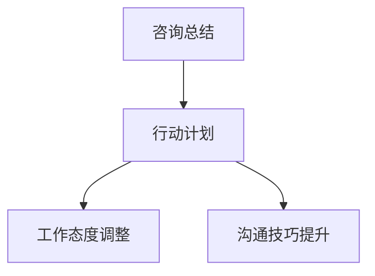
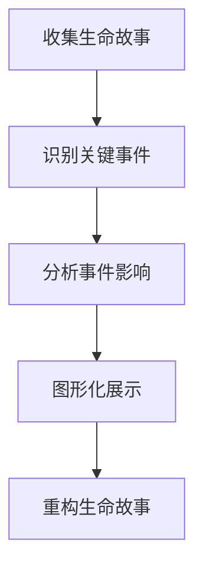
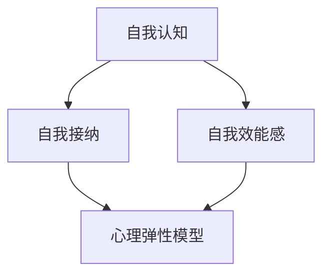

                 


### 第1章：叙事疗法的起源与基本概念

#### 1.1 绪论

叙事疗法是一种现代心理治疗方法，起源于20世纪80年代，由美国心理学家迈克尔·怀特（Michael White）和戴安娜·布洛克（Diana Brown）共同创立。作为一种后现代心理治疗方法，叙事疗法强调个体的故事在塑造其身份和应对心理困扰中的作用。与传统的心理治疗方法相比，叙事疗法注重个体的主观体验和叙事方式，通过重新构建个体的生命故事来帮助他们实现心理转变。

叙事疗法认为，个体的生命故事是由一系列事件和经历构成的，这些事件和经历构成了个体的身份和自我认知。然而，这些故事往往受到创伤性事件、社会压力和负面情绪的影响，导致个体产生负面情绪和心理问题。叙事疗法的核心目标是通过重构个体的生命故事，使其更加积极、健康和有意义。

#### 1.2 核心概念与联系

**叙事自我**

叙事自我是指个体通过叙述自己的生命故事来理解和构建自己的身份。这种叙述不仅涉及过去的经历，还包括对现在和未来的看法。叙事自我是叙事疗法中的一个核心概念，它强调个体在叙述过程中具有主动性和创造性。

**身份建构**

身份建构是指个体在与社会互动过程中，通过叙事和解释自己的经历来形成自己的身份。这种身份建构是一个动态的过程，受到个体、文化和社会等多种因素的影响。

**心理动力学与认知行为疗法**

心理动力学和认知行为疗法是叙事疗法的重要理论基础。心理动力学强调潜意识的作用，认为个体的心理问题源于过去的经历和情感冲突。认知行为疗法则关注个体的思维和行为模式，认为心理问题可以通过改变思维和行为模式来解决。

**Mermaid 流程图**

下面是一个简单的 Mermaid 流程图，展示叙事自我、身份建构、心理动力学和认知行为疗法之间的关系：



#### 1.3 算法原理与数学模型

叙事疗法中，常用的算法原理包括叙事地图和时间线分析。叙事地图是一种用于分析个体生命故事的工具，它可以帮助咨询师和患者一起探索生命故事中的关键事件和主题。时间线分析则是一种用于理解个体生命故事中时间维度上事件发生的顺序和影响的工具。

**叙事地图**

叙事地图是一种图形化的工具，它可以帮助咨询师和患者一起梳理生命故事中的关键事件和主题。以下是一个简化的叙事地图伪代码：

```python
def create_narrative_map(events, themes):
    """
    创建叙事地图
    
    参数：
    - events：关键事件列表
    - themes：主题列表
    
    返回：
    - narrative_map：叙事地图
    """
    narrative_map = {}
    
    for event in events:
        narrative_map[event] = themes[find_theme(event)]
    
    return narrative_map

def find_theme(event):
    """
    找到事件的主题
    
    参数：
    - event：事件
    
    返回：
    - theme：主题
    """
    # 根据事件内容判断主题
    # 这里是一个简化的示例
    if "成功" in event:
        return "成功"
    elif "失败" in event:
        return "失败"
    else:
        return "其他"

# 示例
events = ["高考失败", "创业成功", "离婚"]
themes = ["成功", "失败", "其他"]

narrative_map = create_narrative_map(events, themes)
print(narrative_map)
```

**时间线分析**

时间线分析是一种用于理解生命故事中事件发生顺序和影响的方法。以下是一个简化的时间线分析伪代码：

```python
def create_time_line(events):
    """
    创建时间线
    
    参数：
    - events：关键事件列表
    
    返回：
    - time_line：时间线
    """
    time_line = []
    
    for event in events:
        time = find_time(event)
        time_line.append((time, event))
    
    time_line.sort()
    
    return time_line

def find_time(event):
    """
    找到事件的日期
    
    参数：
    - event：事件
    
    返回：
    - time：日期
    """
    # 根据事件内容判断日期
    # 这里是一个简化的示例
    if "高考" in event:
        return 2008
    elif "创业" in event:
        return 2010
    else:
        return 2015

# 示例
events = ["高考失败", "创业成功", "离婚"]

time_line = create_time_line(events)
print(time_line)
```

#### 1.4 摘要

本章介绍了叙事疗法的起源和基本概念，包括叙事自我、身份建构、心理动力学和认知行为疗法等核心概念。同时，通过 Mermaid 流程图展示了这些概念之间的联系，并介绍了叙事疗法中的算法原理，如叙事地图和时间线分析。本章内容为后续章节提供了理论基础，帮助读者更好地理解叙事疗法的本质和应用。

### 第2章：叙事疗法的实践与应用

#### 2.1 病例分析

在叙事疗法中，病例分析是一个重要的实践环节。通过分析真实的病例，我们可以更好地理解叙事疗法的应用过程和效果。以下是一个典型的病例分析案例。

**病例背景**

患者小王，男性，30岁，是一名软件开发工程师。他因为长期的工作压力和人际关系问题而感到焦虑和抑郁。在首次咨询中，小王表达了自己的困惑和无助，他表示不知道如何应对工作中的挑战和与同事的冲突。

**病例分析**

**第一步：收集病史**

咨询师通过与小王交流，收集了他的个人病史和工作经历。在这个过程中，咨询师使用了叙事疗法中的提问技巧，帮助小王梳理自己的故事。



**第二步：识别关键事件**

在病史收集的基础上，咨询师与小王一起识别了几个关键事件，这些事件对小王的心理状态产生了重要影响。



**第三步：构建叙事地图**

咨询师与小王一起构建了叙事地图，将关键事件和主题进行图形化展示。



**第四步：重构生命故事**

在叙事地图的基础上，咨询师帮助小王重构他的生命故事。通过重新解释关键事件和主题，小王开始看到了自己的成长和进步。



**第五步：总结与行动计划**

在重构生命故事之后，咨询师与小王一起总结了咨询过程，并制定了行动计划。小王决定在工作中采取更积极的态度，并加强与同事的沟通。



**病例结果**

经过一段时间的咨询，小王明显感到自己的焦虑和抑郁症状有所缓解，他在工作中的表现也变得更加积极和自信。

#### 2.2 叙事疗法的工作方法

叙事疗法的工作方法主要包括以下几个步骤：

1. **建立治疗关系**：叙事疗法强调咨询师与患者之间的信任和尊重。建立良好的治疗关系是叙事疗法成功的关键。

2. **收集病史和经历**：通过倾听和提问，咨询师帮助患者梳理自己的生命故事，识别关键事件和主题。

3. **构建叙事地图**：咨询师与患者一起构建叙事地图，将关键事件和主题进行图形化展示，帮助患者更清晰地理解自己的生命故事。

4. **重构生命故事**：通过重新解释关键事件和主题，咨询师帮助患者重构生命故事，使其更加积极、健康和有意义。

5. **制定行动计划**：在重构生命故事之后，咨询师与患者一起制定行动计划，帮助患者实现心理转变。

**叙事疗法在不同领域的应用**

叙事疗法不仅适用于心理咨询，还广泛应用于教育、社会工作等领域。

1. **教育领域**：叙事疗法可以用于帮助学生建立积极的自我概念，提高他们的学习动机和成绩。

2. **社会工作领域**：叙事疗法可以帮助社会工作者更好地理解服务对象的需求，提供更有针对性的帮助。

3. **企业培训**：叙事疗法可以用于帮助员工建立积极的工作态度，提高团队合作和沟通能力。

#### 2.3 叙事疗法在不同领域的应用

叙事疗法在不同领域的应用具有广泛的适用性和效果。

**家庭治疗**：叙事疗法可以帮助家庭成员重新构建家庭故事，增强家庭成员之间的理解和支持，改善家庭关系。

**团体治疗**：叙事疗法可以用于团体治疗中，帮助成员共同探讨和分享生命故事，建立信任和互助的关系。

**教育**：叙事疗法可以用于教育中，帮助学生建立积极的自我概念，提高学习动机和成绩。

**社会工作**：叙事疗法可以帮助社会工作者更好地理解服务对象的需求，提供更有针对性的帮助。

**社区参与**：叙事疗法可以用于社区参与中，帮助居民共同探讨和解决社区问题，增强社区凝聚力。

#### 摘要

本章介绍了叙事疗法的实践和应用。通过分析一个真实的病例，展示了叙事疗法的应用过程和效果。同时，本章还详细介绍了叙事疗法的工作方法，并探讨了叙事疗法在不同领域的应用。这些内容为读者提供了深入了解叙事疗法的实践和应用提供了重要的参考。

### 第3章：重构生命故事

重构生命故事是叙事疗法中的一个核心步骤，它旨在帮助个体重新审视自己的经历，从中发现积极的元素，并重塑一个更加健康、积极的自我形象。在这一章节中，我们将详细探讨重构生命故事的过程，包括识别生命故事的框架、塑造新的生命故事以及生命故事的重写实践。

#### 3.1 识别生命故事的框架

重构生命故事的第一步是识别生命故事的框架。这意味着我们需要理解生命故事是由哪些元素构成的，以及这些元素如何相互作用。以下是重构生命故事框架的几个关键步骤：

**1. 收集生命故事**

首先，个体需要回顾自己的生命故事，收集关键事件、经历和感受。这一过程可以通过自我反思、日记记录或与他人的对话来完成。咨询师在这一过程中可以提供指导，帮助个体清晰地梳理自己的经历。

**2. 识别关键事件**

接下来，个体需要识别出生命故事中的关键事件。这些事件通常是那些对个体的生活产生重大影响的事情，如重要的成功、失败、转折点等。识别关键事件有助于我们理解个体生命故事的核心。

**3. 分析事件的影响**

在识别关键事件后，个体需要分析这些事件对他们的生活产生的影响。这包括事件带来的正面影响和负面影响，以及事件如何塑造了他们的价值观和信念。

**4. 图形化展示**

为了更好地理解生命故事的框架，我们可以使用图形化的工具，如叙事地图或时间线分析。这些工具可以帮助我们直观地看到生命故事中的关键事件和主题。

**Mermaid 流程图**

以下是一个简化的 Mermaid 流程图，展示了重构生命故事框架的步骤：



#### 3.2 塑造新的生命故事

一旦我们有了生命故事的框架，下一步就是塑造一个新的生命故事。这个过程涉及到重新解释和赋予新的意义给关键事件，以及构建一个更加积极的自我形象。以下是塑造新的生命故事的几个关键步骤：

**1. 重新解释事件**

在塑造新的生命故事时，个体需要重新解释关键事件。这意味着我们要从不同的角度看待事件，寻找事件中的积极元素。例如，一个看似失败的经历可能揭示了个体的重要教训或成长机会。

**2. 确定主题**

在重新解释事件后，个体需要确定生命故事的主题。这些主题通常是关于个体的价值观、信念和目标。确定主题有助于构建一个具有一致性和意义的生命故事。

**3. 塑造角色**

在新的生命故事中，个体需要塑造一个积极的自我角色。这个角色反映了个体希望成为的人，以及他们希望如何应对生活中的挑战。

**4. 构建叙事矩阵**

叙事矩阵是一个用于组织和展示生命故事中不同元素的工具。它可以帮助个体更好地理解自己的生命故事，并找到重构的切入点。以下是一个简化的叙事矩阵伪代码：

```python
def create_narrative_matrix(events, themes, roles):
    """
    创建叙事矩阵
    
    参数：
    - events：关键事件列表
    - themes：主题列表
    - roles：角色列表
    
    返回：
    - narrative_matrix：叙事矩阵
    """
    narrative_matrix = []
    
    for event in events:
        row = [event, find_theme(event), find_role(event)]
        narrative_matrix.append(row)
    
    return narrative_matrix

def find_theme(event):
    """
    找到事件的主题
    
    参数：
    - event：事件
    
    返回：
    - theme：主题
    """
    # 根据事件内容判断主题
    # 这里是一个简化的示例
    if "成功" in event:
        return "成功"
    elif "失败" in event:
        return "失败"
    else:
        return "其他"

def find_role(event):
    """
    找到事件的角色
    
    参数：
    - event：事件
    
    返回：
    - role：角色
    """
    # 根据事件内容判断角色
    # 这里是一个简化的示例
    if "成功" in event:
        return "胜利者"
    elif "失败" in event:
        return "挑战者"
    else:
        return "观察者"

# 示例
events = ["高考失败", "创业成功", "离婚"]
themes = ["成功", "失败", "其他"]
roles = ["挑战者", "胜利者", "观察者"]

narrative_matrix = create_narrative_matrix(events, themes, roles)
print(narrative_matrix)
```

#### 3.3 生命故事的重写实践

在识别生命故事的框架和塑造新的生命故事之后，我们需要通过具体的实践来重写生命故事。以下是几个重写生命故事的方法：

**1. 写作练习**

通过写作，个体可以更深入地反思自己的经历，并找到新的叙事方式。写作练习可以包括写日记、撰写自传或写故事。

**2. 对话和分享**

与信任的朋友、家人或咨询师进行对话，可以帮助个体从不同的角度看待自己的生命故事，并获得新的见解。

**3. 艺术创作**

通过艺术创作，如绘画、音乐或舞蹈，个体可以表达自己的情感和经历，从而促进生命故事的重写。

**4. 咨询师指导**

咨询师可以提供专业的指导，帮助个体识别生命故事中的积极元素，并找到合适的叙事方式。

#### 摘要

本章探讨了重构生命故事的整个过程，包括识别生命故事的框架、塑造新的生命故事以及生命故事的重写实践。通过这些步骤，个体可以重新审视自己的经历，发现积极的元素，并构建一个更加健康、积极的自我形象。这些实践不仅有助于个体的心理转变，还可以提高他们的生活质量和幸福感。

### 第4章：找寻自我的旅程

#### 4.1 自我探索的方法

自我探索是叙事疗法中的一个重要环节，它帮助个体深入理解自己的内心世界，找到真正的自我。在这一章节中，我们将介绍几种自我探索的方法，包括自我认知、自我接纳和自我效能感。

**自我认知**

自我认知是指个体对自己的认识和理解。它包括对自我身份、价值观、信念和行为的认识。自我认知的过程可以通过以下几种方法来实现：

1. **反思日志**：通过定期写反思日志，个体可以记录自己的思考、感受和行为，从而更好地了解自己。

2. **提问技巧**：咨询师可以使用一系列有针对性的问题，帮助个体深入探讨自己的内心世界。例如，“你的核心价值观是什么？”“你如何看待自己的过去？”“你对自己的未来有何期望？”

3. **角色扮演**：通过角色扮演，个体可以模拟不同的生活场景，从而更好地理解自己在不同情境下的行为和反应。

**自我接纳**

自我接纳是指个体对自己的无条件接受，无论优点还是缺点。自我接纳的过程对于个体的心理健康至关重要。以下是一些实现自我接纳的方法：

1. **正念练习**：正念练习，如冥想和瑜伽，可以帮助个体集中注意力，减少自我批评和焦虑。

2. **情感表达**：通过情感表达，如写日记、绘画或音乐，个体可以更好地理解自己的情感，并学会接受它们。

3. **支持性团体**：加入支持性团体，与有类似经历的人交流，可以帮助个体感受到被接纳和支持。

**自我效能感**

自我效能感是指个体对自己能够成功完成任务的信心。提高自我效能感可以帮助个体更好地应对挑战，提高生活满意度。以下是一些提高自我效能感的方法：

1. **成功经验**：回顾过去的成功经验，可以帮助个体建立自信心。

2. **目标设定**：设定具体、可衡量的小目标，并逐步实现，可以增强个体的自我效能感。

3. **技能提升**：通过学习和提升技能，个体可以增强对自己能力的信心。

**心理弹性模型**

心理弹性模型是一个用于理解个体如何应对生活压力的理论框架。它包括以下几个方面：

1. **内在资源**：个体内在的资源，如自我效能感、自我接纳和情绪调节能力。

2. **外部支持**：个体从家庭、朋友和社会获得的支持。

3. **应对策略**：个体应对压力和挑战的策略，如积极的思维方式、问题解决技能和情绪调节技巧。

**Mermaid 流程图**

以下是一个简化的 Mermaid 流程图，展示了自我认知、自我接纳、自我效能感和心理弹性模型之间的关系：



#### 4.2 自我重塑的技巧

在自我探索的过程中，个体可能会发现自己需要重塑自我，以更好地应对生活挑战。以下是一些自我重塑的技巧：

**1. 设定目标**

通过设定具体的、可实现的个人目标，个体可以逐步实现自我重塑。目标设定应包括短期和长期目标，以及具体的行动计划。

**2. 学习新技能**

通过学习新技能，个体可以扩展自己的能力和视野，增强自信心。例如，学习一门新的语言、掌握一项新的运动技能或参加专业培训。

**3. 培养积极思维**

积极思维是一种重要的自我重塑技巧。通过培养积极的思维方式，个体可以更乐观地看待生活，减少负面情绪。

**4. 建立支持网络**

建立一个支持网络，包括家人、朋友和专业人士，可以帮助个体在自我重塑的过程中获得支持和鼓励。

**5. 实践自我接纳**

通过正念练习、情感表达和支持性团体，个体可以逐渐实现自我接纳，减少自我批评和负面情绪。

**数学模型**

以下是一个简化的自我重塑数学模型，用于描述个体在自我重塑过程中的变化：

$$
\text{自我重塑} = \text{内在资源} \times \text{外部支持} \times \text{应对策略}
$$

其中：

- 内在资源包括自我效能感、自我接纳和情绪调节能力。
- 外部支持包括家庭、朋友和社会的支持。
- 应对策略包括积极的思维方式、问题解决技能和情绪调节技巧。

#### 4.3 成功案例分享

以下是几个成功的自我重塑案例：

**案例1：小张的职场重塑**

小张是一名职场新人，由于工作压力和人际关系问题，他感到非常焦虑和不安。在咨询师的指导下，小张开始进行自我探索，并设定了具体的个人目标，如提高沟通技巧和建立健康的人际关系。通过学习新技能和培养积极思维，小张逐渐适应了职场生活，并建立了稳定的支持网络。

**案例2：小丽的健康重塑**

小丽是一名长期病患者，她希望通过自我重塑来改善自己的健康状况。在医生的指导下，小丽设定了具体的健康目标，如定期锻炼和合理饮食。通过坚持锻炼和健康饮食，小丽的健康状况得到了显著改善，她的自信心和生活满意度也大幅提升。

**案例3：小刘的学业重塑**

小刘是一名高中生，他由于学业压力感到非常焦虑。在咨询师的帮助下，小刘开始进行自我探索，并设定了具体的学业目标，如提高学习效率和掌握有效的学习方法。通过学习新技能和培养积极思维，小刘的学业成绩逐渐提升，他对自己和未来的信心也日益增强。

#### 摘要

本章介绍了自我探索的方法，包括自我认知、自我接纳和自我效能感，以及心理弹性模型。同时，通过数学模型和成功案例分享，展示了自我重塑的过程和效果。这些内容为个体提供了自我探索和自我重塑的实用技巧，帮助他们找到真正的自我，实现心理转变和成长。

### 第5章：叙事疗法在心理咨询中的应用

#### 5.1 心理咨询中的叙事疗法

叙事疗法在心理咨询中具有广泛的应用，它通过重构个体的生命故事，帮助患者实现心理转变和成长。以下是一个典型的叙事疗法心理咨询案例，展示了叙事疗法在实践中的应用。

**案例背景**

患者小李，女性，30岁，是一名职业女性。她因为长期的工作压力和人际关系问题而感到焦虑和抑郁。在首次咨询中，小李表达了自己对生活和工作的无望感，她感到自己无法应对生活中的各种挑战。

**咨询过程**

**第一步：建立信任关系**

咨询师首先与小李建立了良好的治疗关系，通过倾听和共情，让她感受到安全和被理解。这是叙事疗法成功的关键，因为信任和尊重是重构生命故事的基础。

**第二步：收集生命故事**

咨询师通过一系列开放性的问题，帮助小李回顾自己的生命故事，识别关键事件和主题。例如，咨询师可能会问：“你能告诉我一些你生命中最重要的经历吗？”或“在这些经历中，你学到了什么？”

**第三步：构建叙事地图**

在收集生命故事的基础上，咨询师与小李一起构建了叙事地图，将关键事件和主题进行图形化展示。叙事地图帮助小李更清晰地看到自己的生命故事，并识别出其中的积极和消极元素。

**第四步：重构生命故事**

在叙事地图的基础上，咨询师帮助小李重构生命故事。通过重新解释关键事件和主题，小李开始看到自己的成长和进步，以及自己在生活中的积极贡献。

**第五步：制定行动计划**

在重构生命故事之后，咨询师与小李一起制定了具体的行动计划，如提高沟通技巧、设定职业目标等。这些行动计划旨在帮助小李实现心理转变，提高生活质量。

**案例结果**

经过一段时间的咨询，小李明显感到自己的焦虑和抑郁症状有所缓解，她在工作中的表现也变得更加积极和自信。她学会了从积极的角度看待生活中的挑战，并找到了应对压力的有效方法。

#### 5.2 案例分析

以下是对上述案例的进一步分析，展示了叙事疗法在心理咨询中的应用过程和效果。

**1. 建立治疗关系**

在叙事疗法中，建立良好的治疗关系是关键。咨询师通过共情、倾听和尊重，让患者感受到安全和被理解。这种信任关系为后续的叙事重构提供了基础。

**2. 收集生命故事**

咨询师通过开放性的问题，帮助患者回顾自己的生命故事，识别关键事件和主题。这一过程不仅帮助患者更好地理解自己的经历，也为叙事重构提供了素材。

**3. 构建叙事地图**

叙事地图是一种图形化的工具，它帮助咨询师和患者一起梳理生命故事中的关键事件和主题。通过叙事地图，患者可以更直观地看到自己的生命故事，并识别出其中的积极和消极元素。

**4. 重构生命故事**

在叙事地图的基础上，咨询师帮助患者重构生命故事。通过重新解释关键事件和主题，患者开始看到自己的成长和进步，以及自己在生活中的积极贡献。这种重构不仅有助于患者改善心理状态，还可以提高他们的自我效能感和生活满意度。

**5. 制定行动计划**

在重构生命故事之后，咨询师和患者一起制定具体的行动计划，如提高沟通技巧、设定职业目标等。这些行动计划旨在帮助患者实现心理转变，提高生活质量。

**6. 持续跟踪与评估**

在咨询过程中，咨询师需要持续跟踪患者的进展，并根据患者的反馈进行调整。这种动态的咨询过程有助于确保叙事疗法的效果最大化。

#### 摘要

本章介绍了叙事疗法在心理咨询中的应用，通过一个典型的案例展示了叙事疗法的应用过程和效果。叙事疗法通过重构个体的生命故事，帮助患者实现心理转变和成长。案例分析进一步展示了叙事疗法在心理咨询中的实践方法和效果评估。这些内容为心理咨询实践提供了重要的理论和实践指导。

### 第6章：叙事疗法在个人成长中的应用

#### 6.1 个人成长中的叙事疗法

叙事疗法在个人成长中的应用非常广泛，它通过帮助个体重新审视和重构自己的生命故事，促进个体的自我认知和成长。以下将探讨叙事疗法在个人成长中的核心概念、应用场景和效果。

**核心概念**

**1. 叙事自我**

叙事自我是叙事疗法中的一个核心概念，指的是个体通过叙述自己的生命故事来理解和构建自己的身份。叙事自我不仅包括对过去的回顾，还包括对现在和未来的展望。通过叙述，个体能够更深入地了解自己的价值观、信念和行为模式。

**2. 生命故事**

生命故事是个体经历的一系列事件的集合，这些事件构成了个体的生活经历。生命故事不仅是个体的历史记录，也是个体自我认知和身份构建的基础。通过叙事疗法，个体可以重新审视和重构自己的生命故事，从而改变对过去的看法，塑造新的自我形象。

**3. 重构**

重构是叙事疗法中的一个重要步骤，指的是通过重新解释和赋予新的意义给生命故事中的事件，帮助个体建立积极的自我认同。重构的过程有助于个体克服负面情绪和困境，找到新的生活方向和动力。

**应用场景**

**1. 职业规划**

在职业规划中，叙事疗法可以帮助个体深入分析自己的职业经历，识别关键事件和主题，从而更好地理解自己的职业目标和发展方向。通过重构职业故事，个体可以明确自己的职业价值观和兴趣，制定更加明确的职业规划。

**2. 应对压力**

叙事疗法可以帮助个体识别和重构生命故事中的压力源，如工作压力、人际关系问题等。通过重新解释这些压力事件，个体可以找到新的应对策略，提高抗压能力，减轻负面情绪。

**3. 心理健康**

叙事疗法在心理健康领域具有显著效果，可以帮助个体克服焦虑、抑郁等心理问题。通过重构生命故事，个体可以找到自己的心理资源，增强自我效能感，提高生活质量。

**效果**

**1. 提高自我认知**

通过叙事疗法，个体可以更深入地了解自己的内心世界和价值观，从而提高自我认知。这种自我认知有助于个体更好地理解自己的行为和情绪，提高自我调节能力。

**2. 促进自我成长**

叙事疗法通过重构生命故事，帮助个体看到自己的成长和进步，从而促进自我成长。这种成长不仅体现在心理层面，还可以扩展到职业、人际关系等多个方面。

**3. 提高生活质量**

叙事疗法可以帮助个体重新审视自己的生活经历，找到积极的元素，从而提高生活质量。通过重构生命故事，个体可以建立更加积极、健康的生活态度，增强幸福感。

#### 6.2 叙事疗法在职业规划中的应用

在职业规划中，叙事疗法可以帮助个体更好地理解自己的职业目标和发展方向。以下是一个简化的叙事疗法在职业规划中的应用流程：

**1. 收集职业故事**

个体首先回顾自己的职业经历，收集关键事件和主题。这些事件可能包括职业成就、挑战、转折点等。

**2. 构建职业叙事地图**

通过叙事地图，个体可以将职业故事中的关键事件和主题进行图形化展示。叙事地图可以帮助个体更清晰地看到自己的职业轨迹。

**3. 重新解释职业故事**

在叙事地图的基础上，个体可以重新解释职业故事中的关键事件，赋予它们新的意义。例如，一次失败的经历可能揭示了重要的教训或成长机会。

**4. 制定职业目标**

通过重构职业故事，个体可以明确自己的职业价值观和兴趣，从而制定更加明确的职业目标。

**5. 制定职业发展计划**

在明确职业目标后，个体可以制定具体的职业发展计划，包括学习新技能、提升职业素养等。

#### 摘要

本章介绍了叙事疗法在个人成长中的应用，包括核心概念、应用场景和效果。同时，通过简化的叙事疗法在职业规划中的应用流程，展示了叙事疗法在帮助个体制定职业目标和发展计划方面的作用。叙事疗法通过重构生命故事，帮助个体提高自我认知、促进自我成长，从而提高生活质量。

### 第7章：叙事疗法在社会工作中的应用

#### 7.1 社会工作中的叙事疗法

叙事疗法在社会工作中的应用越来越广泛，它为帮助个体和社会群体解决复杂的社会问题提供了一种新的视角和方法。在这一部分，我们将探讨叙事疗法在社会工作中的核心概念、实施方法以及实际案例。

**核心概念**

**1. 叙事社会工作**

叙事社会工作是一种将叙事疗法原则应用于社会工作实践的方法。它强调个体和社会群体的故事在塑造他们身份和行为中的重要性。叙事社会工作的核心目标是帮助个体和社会群体重新构建他们的故事，从而实现自我认同和社会参与。

**2. 叙事自我**

叙事自我是指个体通过叙述自己的故事来理解和构建自己的身份。叙事社会工作的一个重要任务是帮助个体认识到自己的故事不仅影响他们的自我认同，还影响他们的社会互动和人际关系。

**3. 重构**

重构是叙事疗法的关键步骤，也是叙事社会工作中的重要概念。通过重构，个体和社会群体可以重新解释和赋予新意义给他们的经历，从而改变对过去的看法，塑造新的自我形象。

**实施方法**

**1. 建立信任关系**

叙事社会工作首先需要建立良好的治疗关系，这是实施叙事疗法的前提。社会工作者需要通过倾听、共情和尊重，与个体或社会群体建立信任，让他们感受到被理解和被支持。

**2. 收集故事**

社会工作者需要与个体或社会群体一起收集他们的故事。这可以通过一对一访谈、小组讨论、故事写作等方式进行。在收集故事的过程中，社会工作者要鼓励个体或社会群体表达他们的情感和经历，并帮助他们梳理和结构化这些故事。

**3. 图形化展示**

通过图形化的工具，如叙事地图或故事线，社会工作者可以帮助个体或社会群体更直观地看到他们的故事。这种视觉化的展示有助于个体或社会群体更深入地理解和反思他们的故事。

**4. 重构故事**

在收集和展示故事的基础上，社会工作者可以帮助个体或社会群体重构他们的故事。这包括重新解释关键事件、识别积极的元素、找到新的叙事视角等。通过重构故事，个体或社会群体可以改变对过去的看法，建立更积极的自我认同。

**5. 制定行动计划**

重构故事之后，社会工作者与个体或社会群体一起制定具体的行动计划，以实现他们的目标。这些行动计划可能包括职业规划、社会参与、社区建设等。

**实际案例**

**案例：社区叙事疗法的应用**

在一个社区中，有一群老年居民因为失去配偶和长期独居而感到孤独和无助。社会工作者决定使用叙事疗法来帮助这些居民重建他们的社会联系和自我认同。

**第一步：建立信任关系**

社会工作者首先通过社区活动、邻里探访等方式，与老年居民建立信任关系。他们倾听居民的故事，表达对他们的关心和支持。

**第二步：收集故事**

社会工作者组织了一次小组讨论活动，邀请老年居民分享他们的故事。在讨论中，居民们讲述了自己过去的生活经历、失去配偶的感受以及现在的孤独感。社会工作者将这些故事记录下来，并帮助居民梳理和结构化他们的故事。

**第三步：图形化展示**

社会工作者使用叙事地图将居民的故事进行图形化展示。叙事地图帮助居民更直观地看到他们的生活经历，并识别出其中的积极和消极元素。

**第四步：重构故事**

在图形化展示的基础上，社会工作者帮助居民重构他们的故事。他们鼓励居民重新解释关键事件，找到新的叙事视角，如自己的坚强和适应能力。通过重构故事，居民们开始看到自己的积极方面，并重新建立对自己的认同。

**第五步：制定行动计划**

社会工作者与居民一起制定了行动计划，包括组织社区活动、参与社区建设等。这些行动计划旨在帮助居民建立新的社会联系，提高他们的生活满意度。

**案例结果**

经过一段时间的叙事疗法干预，这些老年居民的孤独感明显减轻，他们的社会参与度也有所提高。他们开始积极参与社区活动，建立了新的社会联系，生活质量得到了显著改善。

#### 摘要

本章探讨了叙事疗法在社会工作中的应用，包括核心概念、实施方法和实际案例。叙事疗法通过重构个体的生命故事，帮助他们重建自我认同和社会联系，提高生活质量。案例展示说明了叙事疗法在社区工作中的具体应用和效果。这些内容为社会工作实践提供了新的思路和方法。

## 附录

### 附录A：叙事疗法资源推荐

**书籍**

1. 《叙事疗法：理论与实践》（Narrative Therapy: Theoretical Introduction, Concepts, and Skills）：作者 Michael White 和 David Epston，这是叙事疗法的经典教材，详细介绍了叙事疗法的理论基础和实践技巧。

2. 《生命的叙事：叙事疗法的理论与实践》（Narrative of the Life of Frederick Douglass, An American Slave）：作者 Frederick Douglass，这本书不仅是一篇优秀的自传体叙事，也为叙事疗法提供了丰富的案例研究。

3. 《叙事治疗：改变生命的语言艺术》（Narrative Therapy and the New Language of Change）：作者 David Epston，这本书深入探讨了叙事疗法的核心概念和技巧，以及如何应用于临床实践中。

**论文**

1. White, M., & Epston, D. (1990). Narrative means to therapeutic ends. New York: W. W. Norton & Company.
2. Malcom, S., White, M., & Epston, D. (1994). Reconstructing Reality and Constructing Reality: Dissecting the Stories People Live. Journal of Family Therapy, 19(1), 11-34.

**在线课程**

1. Coursera - Narrative Therapy: The Art of Therapeutic Storytelling：由叙事疗法专家 Michael White 和 David Epston 开设的在线课程，提供了叙事疗法的深入理解和实践技巧。
2. Udemy - Narrative Therapy: Mastering the Art of Therapeutic Storytelling：这是一门实用的叙事疗法在线课程，适合初学者和专业人士。

### 附录B：叙事疗法工具箱

**叙事地图（Narrative Map）**

叙事地图是一种图形化工具，用于帮助个体和组织梳理和重构他们的生命故事。以下是创建叙事地图的基本步骤：

1. **绘制时间线**：在一张纸上绘制一条水平线，标记出关键事件的日期或时间。
2. **记录事件**：在时间线上标记关键事件，并用简短的文字描述每个事件。
3. **添加主题**：在每个事件旁边，用标签或图标表示事件的主题，如成功、失败、挑战等。
4. **连接主题**：用线条连接不同的事件和主题，以显示它们之间的关系。

**故事线分析表（Storyline Analysis Sheet）**

故事线分析表是一种结构化的表格，用于深入分析个体的生命故事。以下是创建故事线分析表的基本步骤：

1. **标题**：在表格顶部写下“故事线分析表”。
2. **事件栏**：在左侧列出生命故事中的关键事件。
3. **情感栏**：在事件栏旁边，记录每个事件带来的情感反应。
4. **影响栏**：在情感栏旁边，记录每个事件对个体的长期影响。
5. **主题栏**：在事件和影响栏的下方，总结出每个事件或故事线的主题。

**使用指南**

1. **叙事地图**：适用于个人和组织，帮助梳理和重构生命故事。
2. **故事线分析表**：适用于个人，帮助深入分析生命故事，识别主题和影响。

通过这些工具，个体和组织可以更好地理解自己的生命故事，发现积极的元素，并找到新的叙事视角。这些工具不仅有助于个人成长和心理健康，还可以应用于教育、社会工作和组织管理等领域。

## 结语

叙事疗法作为一种现代心理治疗方法，通过重构个体的生命故事，帮助他们在心理上实现转变和成长。在本书中，我们详细介绍了叙事疗法的起源、核心概念、实践应用以及在不同领域的应用。通过叙事疗法，个体可以重新审视自己的经历，发现积极的元素，并构建一个更加健康、积极的自我形象。

未来，叙事疗法在心理咨询、个人成长、社会工作以及教育等领域具有广阔的发展前景。随着对叙事疗法研究的不断深入，我们将能够更好地理解其原理和应用，为更多的人提供有效的心理帮助。

在此，我们呼吁更多的专业人士和研究者在叙事疗法领域进行探索和实践，共同推动这一领域的发展。同时，我们也希望读者能够通过本书的内容，对叙事疗法有一个更深入的了解，并在实际生活中应用这些方法，实现自我成长和心理健康。让我们共同探索叙事疗法，为构建更美好的心灵世界而努力。作者：AI天才研究院/AI Genius Institute & 禅与计算机程序设计艺术 /Zen And The Art of Computer Programming。

