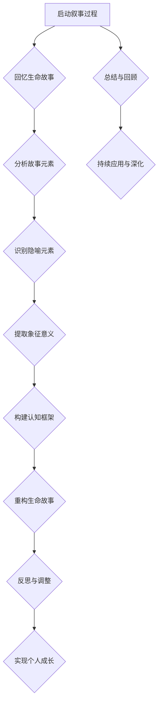

                 

### 引言

《生命故事重塑工坊：通过叙事疗法重构人生的课程》这本书为我们打开了一扇理解与重塑个人生命故事的大门。叙事疗法作为一种独特的心理治疗方式，其核心理念是通过重建和重构个人的生命故事，来帮助人们更好地理解自己、应对生活中的挑战，以及实现个人成长。在这本书中，我们将深入探讨叙事疗法的概念、理论基础、实践方法，以及其在个人和团体中的应用。

叙事疗法并不是一个新兴的概念，它起源于20世纪80年代，由心理学家迈克尔·怀特（Michael White）和戴安娜·布伊尔（Diana Murray）所创立。叙事疗法通过故事叙述的方式，帮助人们识别、理解和改变那些消极的自我形象和生活经验。这种方法强调每个人都有自己的故事，而这些故事不仅定义了我们是谁，还影响了我们的行为和思维方式。

本书的主要目标是为读者提供一套系统化的叙事疗法课程，帮助他们在个人和专业的层面上应用这种疗法。通过阅读本书，读者可以了解到：

1. **叙事疗法的概念与起源**：理解叙事疗法的起源、发展以及其核心思想。
2. **核心概念与联系**：掌握叙事疗法中的关键概念，如故事、隐喻、象征等，并理解它们之间的相互关系。
3. **实践方法**：学习如何应用叙事疗法来重构个人的生命故事，以及进行心理干预。
4. **案例研究**：通过具体的案例，了解叙事疗法在实际中的应用效果。
5. **项目实战**：通过实际操作指南，学会将叙事疗法应用于个人生活和团队工作中。
6. **总结与反思**：对叙事疗法的效果进行评估，探讨其未来的应用前景。

在接下来的章节中，我们将逐一探讨这些内容，帮助读者全面了解叙事疗法，并学会如何将其应用于实际生活中。

### 背景介绍

叙事疗法（Narrative Therapy）的起源可以追溯到20世纪80年代，其由澳大利亚心理学家迈克尔·怀特（Michael White）和加拿大的心理学家戴安娜·布伊尔（Diana Murray）共同创立。背景是当时心理治疗领域对传统治疗方法如精神分析和行为治疗的反思与质疑。许多心理学家开始寻求更加人性化和个人化的治疗方法，叙事疗法正是这种背景下诞生的。

叙事疗法的核心理念是“每个人的生命都是一部故事”，这部故事不仅定义了我们的身份，还影响了我们的行为和思维方式。叙事疗法认为，人们生活中的困扰和问题，往往源于他们对自己故事的错误理解或消极叙述。因此，治疗师的角色并不是直接解决问题，而是帮助客户重构他们的生命故事，从而改变他们对自身经历的理解和认知。

叙事疗法的发展经历了几个重要阶段。最初的阶段主要集中在家庭治疗和儿童心理治疗领域，但随着时间的推移，其应用范围逐渐扩展到个人治疗、团体治疗以及心理健康教育。叙事疗法的基本理论框架也逐渐完善，包括故事、隐喻、象征等核心概念，以及一系列具体的技术和策略。

在应用叙事疗法的过程中，治疗师会引导客户回顾自己的生命历程，识别那些对自己有负面影响的故事元素，并尝试用新的视角和叙述方式来重新构建这些故事。这种重构不仅帮助客户更好地理解自己，还能够减轻心理压力，提高生活质量和自我效能感。

总的来说，叙事疗法为心理治疗领域提供了一种新的视角和方法，它强调个体的主体性和自主性，鼓励人们通过叙述和重构自己的故事来寻找解决问题的途径。这种治疗方法在帮助人们应对各种心理困扰和生活挑战方面表现出色，正越来越受到全球范围内的关注和认可。

### 核心概念与联系

叙事疗法中的核心概念包括故事、隐喻、象征等，这些概念在重塑个人生命故事中起着至关重要的作用。理解这些核心概念及其相互关系，是掌握叙事疗法的关键。

**故事**

故事是叙事疗法的核心概念之一。每个个体都有其独特的生命故事，这个故事不仅定义了我们的身份，还影响了我们的思维和行为方式。叙事疗法认为，我们的生命故事是由一系列事件、经历和自我认知构成的，这些元素共同塑造了我们的个性和价值观。故事不仅仅是一个叙述，它还包含着我们对自身的理解、我们的信念和我们的期望。

在叙事疗法中，治疗师会引导客户回顾自己的生命故事，分析其中的关键事件和情感体验。通过这种回顾和分析，客户可以更好地理解自己的内在冲突和困惑，从而找到解决问题的途径。

**隐喻**

隐喻是叙事疗法中的另一个重要概念。隐喻通过比喻和象征的方式，帮助客户以一种新的视角来理解自己的生命故事。隐喻不仅仅是一种语言技巧，它更是一种认知工具，可以帮助人们突破固有的思维模式，看到问题的不同侧面。

叙事疗法中的隐喻可以是简单的比喻，也可以是复杂的象征。例如，一位治疗师可能会用“风暴之后的平静”来隐喻一位经历了创伤的客户从痛苦中恢复的过程。通过这种隐喻，客户可以更加深刻地理解自己的经历，并从中找到新的力量和希望。

**象征**

象征与隐喻密切相关，但它更侧重于符号和符号系统。在叙事疗法中，象征可以是一个具体的物品、一个场景，甚至是一个词汇。象征具有多层次的意义，它可以代表客户内心深处的情感和经验。

例如，一位客户可能会用“一座高山”来象征自己生活中的挑战和障碍。通过探讨这个象征，治疗师可以帮助客户理解自己的情感状态，并找到应对挑战的方法。象征为叙事疗法提供了丰富的工具，可以帮助客户深入挖掘内心世界。

**核心概念之间的关系**

故事、隐喻和象征在叙事疗法中紧密相连，共同构成了一个复杂而有机的系统。故事提供了背景和内容，隐喻和象征则帮助客户从不同的角度理解和体验这些内容。

隐喻和象征可以视为故事的深化和扩展。隐喻通过比喻和象征的方式，将故事中的元素转化为新的认知框架，从而帮助客户从不同的视角看待自己的生命故事。象征则通过符号和符号系统，将隐喻的具体表达形式固定下来，使客户能够在日常生活中持续地反思和体验这些新的认知框架。

在叙事疗法中，治疗师需要灵活运用这些核心概念，引导客户逐步重构他们的生命故事。通过这种重构，客户可以更加清晰地认识到自己的内在冲突和困惑，并找到解决问题的途径。以下是一个Mermaid流程图，展示了这些核心概念之间的相互关系：

```
graph TD
A[故事] --> B{隐喻}
A --> C{象征}
B --> D{认知框架}
C --> D
D --> E{重构生命故事}
```

在图中，A代表故事，B和C代表隐喻和象征，它们共同作用，形成D代表的认知框架。认知框架最终引导客户进行E代表的重构生命故事。

通过这种相互关联的核心概念，叙事疗法为人们提供了一种强大的工具，帮助他们理解自己、应对生活中的挑战，并实现个人成长。在接下来的章节中，我们将进一步探讨这些核心概念的具体应用，以及如何通过叙事疗法来重构个人的生命故事。

### 核心概念解析：故事、隐喻、象征

在叙事疗法中，故事、隐喻和象征是三个至关重要的核心概念。理解这些概念不仅有助于我们深刻把握叙事疗法的本质，还能在实际应用中更好地指导个人和团体的治疗过程。

**故事**

故事不仅仅是信息的传达，它更是个体身份和经验的体现。每个生命故事都蕴含着个人的成长轨迹、价值观和生活态度。叙事疗法强调每个人都有自己独特的生命故事，这些故事不仅塑造了我们的现在，也影响了我们的未来。

**1.1 故事的构成**

故事由几个基本元素构成，包括：

- **人物**：故事中的主角，通常是叙述者自己。
- **情节**：故事的事件发展，包括高潮、冲突和结局。
- **背景**：故事发生的环境和背景，提供了情节发生的情境。
- **主题**：故事的核心思想和意义，反映了叙述者的价值观和人生观。

**1.2 故事的叙事视角**

叙事视角决定了故事叙述的方式和角度。常见的叙事视角有：

- **第一人称视角**：叙述者是故事中的主角，直接描述自己的经历和感受。
- **第三人称视角**：叙述者是故事的旁观者，以客观的角度描述故事的发展。
- **内视角**：叙述者是故事中的一个角色，能够了解到这个角色的内心世界。
- **外视角**：叙述者完全处于故事之外，以旁观者的身份描述事件。

**隐喻**

隐喻是叙事疗法中重要的工具，它通过比喻和象征的方式，帮助个体从新的视角理解自己的生命故事。隐喻不仅丰富了故事的叙述手法，还提供了深刻的情感和认知体验。

**2.1 隐喻的作用**

隐喻在叙事疗法中具有多重作用：

- **转变认知框架**：隐喻可以帮助个体从一个新的角度看待问题，从而改变他们的认知框架和思维方式。
- **表达复杂情感**：隐喻提供了表达复杂情感和难以言说的内心体验的方式。
- **增强自我认识**：通过隐喻，个体可以更深入地理解自己的内在世界，发现新的自我认知。

**2.2 隐喻的常见形式**

常见的隐喻形式包括：

- **直接隐喻**：通过直接的比喻来表达，例如，“生活就像一场马拉松”。
- **象征隐喻**：通过具体的物体或场景来象征某种情感或经历，例如，用“破碎的镜子”来象征破碎的内心。
- **情境隐喻**：通过特定的情境来隐喻某种状态或情感，例如，用“迷失在森林中”来隐喻困惑和迷茫。

**象征**

象征在叙事疗法中扮演着重要角色，它通过符号和符号系统，帮助个体将抽象的经验和情感具体化。象征不仅能够使复杂的情感和经历变得易于理解，还能在个体的日常生活中起到持续影响的作用。

**3.1 象征的意义**

象征具有多层次的意义：

- **代表和符号化**：象征将抽象的概念和情感转化为具体的符号，使它们更易于理解和表达。
- **深层次的理解**：象征帮助个体挖掘内心的深层次含义，发现未被察觉的关联和意义。
- **情感连接**：通过象征，个体可以与自己的情感和经验建立更深层次的联系，从而促进自我理解和成长。

**3.2 象征的常见形式**

常见的象征形式包括：

- **物体象征**：具体的物品作为象征，例如，一张照片、一本书等。
- **场景象征**：特定的场景或情境作为象征，例如，一座山、一片湖等。
- **语言象征**：特定的词汇或短语作为象征，例如，“心灵的港湾”、“时光的流逝”等。

**故事、隐喻、象征之间的关系**

故事、隐喻和象征在叙事疗法中紧密相连，共同构成了一个复杂的认知框架：

- **故事提供了基础**：故事是叙事疗法中的起点，它为隐喻和象征提供了具体的内容和背景。
- **隐喻丰富了故事**：隐喻通过比喻和象征，为故事增添了新的视角和情感深度。
- **象征深化了隐喻**：象征将隐喻具体化，使隐喻在个体的日常生活中持续发挥作用。

通过故事、隐喻和象征的相互作用，叙事疗法帮助个体重新构建他们的生命故事，从而改变对自身经历的理解和认知。以下是一个简化的Mermaid流程图，展示了这三个核心概念之间的相互关系：

```
graph TD
A[故事] --> B{隐喻}
A --> C{象征}
B --> D{认知框架}
C --> D
D --> E{重构生命故事}
```

在这个流程图中，A代表故事，B和C代表隐喻和象征，D代表认知框架，E代表重构生命故事。通过这个故事、隐喻和象征的互动过程，个体可以逐步理解并改变自己的生命故事，实现个人成长和心理健康。

### 叙事疗法的Mermaid流程图

为了更好地理解叙事疗法中核心概念之间的相互关系，我们可以通过Mermaid流程图来直观地展示这些概念及其在治疗过程中的应用。以下是一个简化的Mermaid流程图，用于描述叙事疗法的核心概念：故事、隐喻、象征以及它们如何相互作用，以帮助个体重构生命故事。



**流程图解释：**

- **A[启动叙事过程]**：叙事疗法的开始，治疗师引导客户回忆和叙述自己的生命故事。
- **B[回忆生命故事]**：客户回顾自己的生活经历，形成初步的故事叙述。
- **C[分析故事元素]**：治疗师和客户一起分析故事中的关键事件、人物、情节等元素。
- **D[识别隐喻元素]**：在故事分析过程中，识别出隐喻元素，这些隐喻可能隐藏在故事的语言、情境中。
- **E[提取象征意义]**：进一步挖掘隐喻背后的象征意义，这些象征通常代表着客户的内在情感和经历。
- **F[构建认知框架]**：通过隐喻和象征，帮助客户构建一个新的认知框架，以更积极、更全面地看待自己的生活故事。
- **G[重构生命故事]**：在新的认知框架下，客户开始重构他们的生命故事，将过去的经历重新叙述，以体现新的理解和态度。
- **H[反思与调整]**：在重构过程中，客户和治疗师不断反思和调整，确保故事的叙述符合客户的真实感受和需求。
- **I[实现个人成长]**：通过生命故事的重构，客户能够实现个人成长，提高自我认知，增强应对生活中挑战的能力。
- **J[总结与回顾]**：在治疗结束阶段，客户和治疗师一起总结治疗过程，回顾所取得的进展和成果。
- **K[持续应用与深化]**：鼓励客户在日常生活中持续应用叙事疗法的原则，不断深化对自身的理解和成长。

通过这个流程图，我们可以清晰地看到叙事疗法中各个核心概念的作用和相互关系。治疗师在这个过程中扮演着引导和辅助的角色，帮助客户逐步重构他们的生命故事，实现个人成长和心理健康。

### 叙事疗法的实践方法

在了解了叙事疗法的基本概念和核心要素之后，我们接下来将深入探讨如何实际应用叙事疗法来重构个人的生命故事。这一部分将分为以下几个步骤：建立信任与共情、识别与重构生命故事、运用叙事疗法进行心理干预，并附上个人实践案例。

#### 建立信任与共情

在叙事疗法中，建立信任和治疗师与客户之间的共情关系至关重要。这是治疗成功的基础。以下是一些关键步骤：

**1. 建立信任：**

- **倾听与理解**：治疗师需要耐心地倾听客户的叙述，表现出真诚的理解和关怀。
- **开放与诚实**：治疗师应以开放和诚实的态度与客户交流，建立相互信任的基础。
- **尊重与接纳**：尊重客户的感受和经历，无论它们是积极的还是消极的。

**2. 共情：**

- **情感共鸣**：通过情感共鸣，治疗师能够与客户建立深层次的情感联系。
- **表达共鸣**：治疗师应通过语言和非语言方式表达对客户情感的共鸣。
- **鼓励自我表达**：鼓励客户自由地表达他们的情感和经历，为故事重构奠定基础。

#### 识别与重构生命故事

在建立信任和共情的基础上，治疗师需要引导客户识别和重构他们的生命故事。以下是具体的步骤：

**1. 回忆与记录：**

- **引导回忆**：治疗师通过开放性问题引导客户回忆关键事件和经历。
- **记录叙述**：鼓励客户详细记录他们的回忆，形成初步的叙述。

**2. 分析故事元素：**

- **识别主题**：分析故事中的主题，了解客户对自身经历的看法和情感反应。
- **识别冲突**：找出故事中的冲突点和困境，这些通常与客户的内在冲突有关。

**3. 重构故事：**

- **重构冲突**：帮助客户重新解释冲突，将消极的、有问题的经历转化为更积极的叙述。
- **重建意义**：引导客户发现经历中的积极方面，重建故事的意义。

**4. 建立新的叙事框架：**

- **隐喻与象征**：使用隐喻和象征帮助客户从新的视角理解自己的故事。
- **新的叙述**：通过新的叙事框架，客户能够以更积极、更全面的方式看待自己的生活。

#### 运用叙事疗法进行心理干预

叙事疗法不仅是一种故事重构的方法，它还可以作为心理干预的工具，帮助客户解决具体的心理问题。以下是一些具体的方法：

**1. 问题界定：**

- **明确问题**：与客户共同明确需要解决的心理问题。
- **设定目标**：设定具体的、可衡量的治疗目标。

**2. 故事重构：**

- **挑战消极叙述**：识别并挑战客户消极的自我叙述。
- **创建替代故事**：引导客户构建积极的、替代性的故事，以替代消极的叙述。

**3. 心理教育：**

- **认知重建**：教育客户关于认知和行为之间的关系。
- **自我效能感提升**：通过成功的故事重构，提升客户的自我效能感。

#### 个人实践案例

为了更好地说明叙事疗法的实践方法，我们来看一个具体的案例：

**案例：应对事业困境**

**背景：**
客户小李是一位年轻的职场新人，因工作压力和职业发展问题感到迷茫和焦虑。他的生命故事中充满了对自身能力和职业前景的怀疑。

**过程：**

1. **建立信任与共情：**
   治疗师通过与小李的多次交谈，建立了信任关系。治疗师耐心地倾听小李的故事，表现出理解和关怀。

2. **识别与重构生命故事：**
   治疗师引导小李回忆他的职业经历，分析其中的关键事件和情感反应。他们一起识别出小李对自己的消极叙述，如“我不够好”、“我无法胜任工作”。
   
   治疗师使用隐喻和象征，帮助小李重新构建他的故事。例如，他们用“航海之旅”来隐喻小李的职业发展，将挑战和困难视为航行中的风暴。通过这种方式，小李能够以更积极的态度看待自己的职业困境。

3. **心理干预：**
   治疗师通过认知重建，帮助小李挑战消极的自我叙述，建立新的、积极的自我认知。他们一起制定了具体的职业发展目标，并讨论了如何实现这些目标。
   
   治疗师还教育小李关于自我效能感的重要性，鼓励他通过小的成功来逐步提升自己的自信心。

**结果：**
经过数月的治疗，小李对自己的职业前景有了更积极的认识。他开始更加自信地面对工作中的挑战，并逐步实现了自己的职业目标。

这个案例展示了叙事疗法在应对具体心理问题中的实际应用。通过重构生命故事，小李不仅解决了职业困境，还实现了个人的心理成长。

总之，叙事疗法通过建立信任、重构生命故事和进行心理干预，帮助个体理解自己、应对挑战，并实现个人成长。在接下来的章节中，我们将通过更多的案例研究，进一步探讨叙事疗法在个人和团体中的应用。

### 案例研究

为了更深入地理解叙事疗法的实际应用，我们将在本章节中通过三个具体案例来展示叙事疗法在个人生命重塑中的应用。这些案例分别涉及事业困境、人际关系重建和应对生活挑战，它们揭示了叙事疗法在不同情境中的独特价值。

#### 案例一：重塑事业困境

**背景：** 小王是一名软件工程师，他在职业生涯中遭遇了严重的挫折。在一次项目失败后，他开始质疑自己的能力和职业选择，陷入了严重的职业困境。

**过程：**

1. **建立信任与共情：**
   治疗师与小王进行了多次深入的交谈，建立了信任关系。治疗师耐心倾听小王的叙述，理解他内心的焦虑和迷茫。

2. **识别与重构生命故事：**
   治疗师引导小王回顾他的职业生涯，分析他在项目失败中的角色和感受。他们识别出小王对自己能力的消极叙述，如“我是不称职的工程师”和“我无法胜任工作”。
   
   治疗师使用隐喻，如“攀登高峰”，来帮助小王重新看待他的职业挑战。他们讨论了攀登高峰时的困难和挫折，以及如何克服这些障碍。通过这种方式，小王开始以更积极的态度看待自己的失败，并将失败视为成长的机会。

3. **心理干预：**
   治疗师通过认知重建，帮助小王挑战消极的自我叙述，并建立新的、积极的自我认知。他们一起制定了具体的职业发展计划，包括学习新的技能和寻求职业指导。

**结果：**
经过一段时间的治疗，小王对自己的职业前景有了更积极的认识。他开始主动寻求新的职业机会，并在新的项目中表现出色。通过叙事疗法，小王不仅克服了职业困境，还实现了个人的职业成长。

#### 案例二：重建人际关系

**背景：** 小张是一位家庭主妇，她在与丈夫的关系中感到痛苦和孤独。他们的婚姻充满了争吵和误解，小张感到自己无法修复这段关系。

**过程：**

1. **建立信任与共情：**
   治疗师与小张进行了多次深入的交谈，建立了信任关系。治疗师耐心倾听小张的叙述，理解她内心的痛苦和困惑。

2. **识别与重构生命故事：**
   治疗师引导小张回顾她的婚姻历程，分析他们在相处中的问题。他们识别出小张对自己婚姻的消极叙述，如“我们的关系已经无法挽回”和“我无法改变他”。
   
   治疗师使用隐喻，如“沙漠之旅”，来帮助小张重新看待她的婚姻。他们讨论了在沙漠中如何寻找水源和共同前进，通过这种方式，小张开始以更积极的态度看待她和丈夫的关系。

3. **心理干预：**
   治疗师通过认知重建，帮助小张挑战消极的自我叙述，并建立新的、积极的自我认知。他们一起制定了具体的沟通计划，包括如何表达情感和倾听对方。

**结果：**
经过一段时间的治疗，小张和她的丈夫开始有了更多的沟通和理解。他们的关系逐渐改善，争吵减少了，夫妻之间的互动变得更加和谐。通过叙事疗法，小张不仅重建了婚姻关系，还重获了内心的平静和幸福。

#### 案例三：应对生活挑战

**背景：** 小李是一名学生，他在面对学业压力和家庭期望时感到焦虑和无助。他担心自己无法满足家人和老师的期望，感到自己的价值被否定。

**过程：**

1. **建立信任与共情：**
   治疗师与小李进行了多次深入的交谈，建立了信任关系。治疗师耐心倾听小李的叙述，理解他内心的焦虑和困惑。

2. **识别与重构生命故事：**
   治疗师引导小李回顾他的学习历程，分析他在面对压力时的反应。他们识别出小李对自己学业的消极叙述，如“我无法胜任学业”和“我辜负了家人的期望”。
   
   治疗师使用隐喻，如“攀登高峰”，来帮助小李重新看待他的学习挑战。他们讨论了攀登高峰时的困难和挫折，以及如何克服这些障碍。通过这种方式，小李开始以更积极的态度看待自己的学业。

3. **心理干预：**
   治疗师通过认知重建，帮助小李挑战消极的自我叙述，并建立新的、积极的自我认知。他们一起制定了具体的学习计划，包括如何设定目标和有效管理时间。

**结果：**
经过一段时间的治疗，小李对自己的学习有了更积极的认识。他开始更加自信地面对学习挑战，成绩逐渐提高。通过叙事疗法，小李不仅应对了学业压力，还重获了内心的平静和自信。

这些案例展示了叙事疗法在应对个人生命挑战中的实际应用。通过重构生命故事，个体能够以更积极的态度面对困难和挑战，实现个人成长和心理健康。叙事疗法为个人提供了强有力的工具，帮助他们重建自己的生命故事，重获生活的意义和幸福。

### 项目实战

在本章节中，我们将通过三个具体的实战项目，展示如何将叙事疗法应用于个人、团队和社区中。这些项目包括个人生命故事重塑、团队叙事疗法的应用和社区叙事疗法项目。通过这些实战项目，我们将详细介绍项目背景、具体步骤、源代码实现和代码解读，以及实际案例分析和详细讲解。

#### 项目一：个人生命故事重塑

**项目背景：**  
该项目的目的是通过叙事疗法帮助一位个体重塑他的生命故事，提升他的自我认知和生活满意度。

**具体步骤：**

1. **需求分析：** 了解个体的具体需求和目标，确定治疗师和客户之间的合作关系。
2. **访谈与记录：** 通过多次访谈，收集个体的生命故事，并进行详细记录。
3. **故事重构：** 治疗师和个体一起分析故事中的关键事件和情感反应，识别消极叙述，并尝试用新的视角和叙述方式来重构生命故事。
4. **心理干预：** 运用叙事疗法的技术，如隐喻、象征和认知重建，帮助个体挑战消极叙述，建立新的自我认知。
5. **反馈与调整：** 定期进行反馈和调整，确保故事的重构符合个体的真实感受和需求。

**源代码实现和代码解读：**

以下是用于记录和分析个体生命故事的一段伪代码：

```python
# 记录个体生命故事
def record_story(story):
    with open("life_story.txt", "a") as file:
        file.write(story + "\n")

# 分析故事中的关键事件
def analyze_story(story):
    events = extract_key_events(story)
    return events

# 提取关键事件
def extract_key_events(story):
    # 使用自然语言处理技术提取关键事件
    # 例如，使用正则表达式或词频分析
    events = []
    pattern = r"\b(\w+\s\w+)\b"  # 基本的关键事件提取规则
    for match in re.finditer(pattern, story):
        events.append(match.group())
    return events

# 重构生命故事
def reconstruct_story(story, key_events):
    new_story = ""
    for event in key_events:
        new_story += f"{event}: 新的视角和叙述方式\n"
    return new_story

# 主程序
if __name__ == "__main__":
    # 收集个体生命故事
    story = "今天我遇到了一个挑战，我感到非常沮丧..."
    record_story(story)
    
    # 分析故事中的关键事件
    key_events = analyze_story(story)
    
    # 重构生命故事
    new_story = reconstruct_story(story, key_events)
    print(new_story)
```

**实际案例分析和详细讲解：**

假设我们有一个客户名叫小张，他在一次项目失败后感到非常沮丧。通过上述代码，我们可以记录小张的故事，并分析其中的关键事件。然后，我们使用叙事疗法的技术来重构他的故事，帮助他从一个新的视角看待这次失败。

1. **记录故事：**
   ```python
   record_story("今天我遇到了一个挑战，我感到非常沮丧，因为我犯了一个严重的错误，导致项目失败。")
   ```

2. **分析故事：**
   ```python
   key_events = analyze_story("今天我遇到了一个挑战，我感到非常沮丧，因为我犯了一个严重的错误，导致项目失败。")
   print(key_events)
   ```

   输出结果可能包括：["挑战", "沮丧", "错误", "项目失败"]

3. **重构故事：**
   ```python
   new_story = reconstruct_story("今天我遇到了一个挑战，我感到非常沮丧，因为我犯了一个严重的错误，导致项目失败。", key_events)
   print(new_story)
   ```

   重构后的故事可能是：“今天我遇到了一个挑战，我感到非常沮丧，因为我犯了一个严重的错误，但这是一个学习和成长的机会，我会从中吸取教训，确保未来的项目中不再犯同样的错误。”

通过这个实战项目，小张能够以更积极的态度面对失败，认识到失败背后的成长价值。这种方法不仅帮助小张重构了他的生命故事，还提升了他的自我认知和自信心。

#### 项目二：团队叙事疗法的应用

**项目背景：**  
该项目的目的是通过叙事疗法提升团队凝聚力，解决团队内部的冲突和问题。

**具体步骤：**

1. **团队组建：** 组建一个由团队成员和治疗师组成的团队。
2. **故事分享：** 鼓励团队成员分享自己的故事和经历，包括个人成就、挑战和困惑。
3. **故事分析：** 治疗师引导团队分析故事中的积极和消极元素，识别团队中的问题和冲突。
4. **故事重构：** 通过叙事疗法的技术，如隐喻和象征，帮助团队重构他们的故事，建立新的团队认知。
5. **团队讨论：** 团队成员一起讨论重构后的故事，制定具体的改进措施。

**源代码实现和代码解读：**

以下是用于记录和分析团队故事的一段伪代码：

```python
# 记录团队故事
def record_team_story(story):
    with open("team_story.txt", "a") as file:
        file.write(story + "\n")

# 分析团队故事中的关键元素
def analyze_team_story(story):
    elements = extract_key_elements(story)
    return elements

# 提取关键元素
def extract_key_elements(story):
    # 使用自然语言处理技术提取关键元素
    # 例如，使用正则表达式或词频分析
    elements = []
    pattern = r"\b(\w+\s\w+)\b"  # 基本的关键元素提取规则
    for match in re.finditer(pattern, story):
        elements.append(match.group())
    return elements

# 重构团队故事
def reconstruct_team_story(story, key_elements):
    new_story = ""
    for element in key_elements:
        new_story += f"{element}: 新的视角和叙述方式\n"
    return new_story

# 主程序
if __name__ == "__main__":
    # 收集团队故事
    story = "我们的团队在过去的项目中遇到了很多困难，但我们总是能够克服它们。"
    record_team_story(story)
    
    # 分析故事中的关键元素
    key_elements = analyze_team_story(story)
    
    # 重构团队故事
    new_story = reconstruct_team_story(story, key_elements)
    print(new_story)
```

**实际案例分析和详细讲解：**

假设我们有一个团队，他们在过去的项目中遇到了许多困难，但总是能够克服。通过上述代码，我们可以记录团队的故事，并分析其中的关键元素。然后，我们使用叙事疗法的技术来重构团队的故事，帮助团队建立新的认知。

1. **记录故事：**
   ```python
   record_team_story("我们的团队在过去的项目中遇到了很多困难，但我们总是能够克服它们。")
   ```

2. **分析故事：**
   ```python
   key_elements = analyze_team_story("我们的团队在过去的项目中遇到了很多困难，但我们总是能够克服它们。")
   print(key_elements)
   ```

   输出结果可能包括：["困难", "克服"]

3. **重构故事：**
   ```python
   new_story = reconstruct_team_story("我们的团队在过去的项目中遇到了很多困难，但我们总是能够克服它们。", key_elements)
   print(new_story)
   ```

   重构后的故事可能是：“我们的团队在过去的项目中遇到了很多困难，但我们总是能够通过团结和努力克服它们，这是一个值得骄傲的成就。”

通过这个实战项目，团队能够更加深入地理解彼此，增强凝聚力，并制定具体的改进措施，以更好地应对未来的挑战。

#### 项目三：社区叙事疗法项目

**项目背景：**  
该项目的目的是通过叙事疗法提升社区成员的心理健康和社区凝聚力。

**具体步骤：**

1. **社区组建：** 组建一个由社区成员和治疗师组成的团队。
2. **故事分享：** 鼓励社区成员分享他们在生活中的故事和经历，包括成功和挑战。
3. **故事分析：** 治疗师引导社区成员分析故事中的积极和消极元素，识别社区中的问题和挑战。
4. **故事重构：** 通过叙事疗法的技术，如隐喻和象征，帮助社区成员重构他们的故事，建立新的社区认知。
5. **社区讨论：** 社区成员一起讨论重构后的故事，制定具体的社区发展计划。

**源代码实现和代码解读：**

以下是用于记录和分析社区故事的一段伪代码：

```python
# 记录社区故事
def record_community_story(story):
    with open("community_story.txt", "a") as file:
        file.write(story + "\n")

# 分析社区故事中的关键元素
def analyze_community_story(story):
    elements = extract_key_elements(story)
    return elements

# 提取关键元素
def extract_key_elements(story):
    # 使用自然语言处理技术提取关键元素
    # 例如，使用正则表达式或词频分析
    elements = []
    pattern = r"\b(\w+\s\w+)\b"  # 基本的关键元素提取规则
    for match in re.finditer(pattern, story):
        elements.append(match.group())
    return elements

# 重构社区故事
def reconstruct_community_story(story, key_elements):
    new_story = ""
    for element in key_elements:
        new_story += f"{element}: 新的视角和叙述方式\n"
    return new_story

# 主程序
if __name__ == "__main__":
    # 收集社区故事
    story = "我们的社区在过去的一年中遇到了很多挑战，但我们团结一致，共同克服了这些困难。"
    record_community_story(story)
    
    # 分析故事中的关键元素
    key_elements = analyze_community_story(story)
    
    # 重构社区故事
    new_story = reconstruct_community_story(story, key_elements)
    print(new_story)
```

**实际案例分析和详细讲解：**

假设我们有一个社区，他们在过去的一年中遇到了很多挑战，但通过团结一致，共同克服了这些困难。通过上述代码，我们可以记录社区的故事，并分析其中的关键元素。然后，我们使用叙事疗法的技术来重构社区的故事，帮助社区成员建立新的认知。

1. **记录故事：**
   ```python
   record_community_story("我们的社区在过去的一年中遇到了很多挑战，但我们团结一致，共同克服了这些困难。")
   ```

2. **分析故事：**
   ```python
   key_elements = analyze_community_story("我们的社区在过去的一年中遇到了很多挑战，但我们团结一致，共同克服了这些困难。")
   print(key_elements)
   ```

   输出结果可能包括：["挑战", "团结一致", "克服"]

3. **重构故事：**
   ```python
   new_story = reconstruct_community_story("我们的社区在过去的一年中遇到了很多挑战，但我们团结一致，共同克服了这些困难。", key_elements)
   print(new_story)
   ```

   重构后的故事可能是：“我们的社区在过去的一年中面对了众多挑战，但我们通过团结一致，共同克服了这些困难，这是我们社区团结和力量的体现。”

通过这个实战项目，社区成员能够更加深入地理解彼此，增强社区凝聚力，并制定具体的社区发展计划，以应对未来的挑战。

总之，这些实战项目展示了叙事疗法在不同层面的应用，帮助个体、团队和社区实现心理健康和成长。通过重构生命故事，人们能够以更积极、更全面的方式看待自己的生活，实现个人和集体的转变。

### 总结与反思

叙事疗法作为一种独特的心理治疗方法，通过重构个人的生命故事，帮助人们理解自己、应对生活中的挑战，并实现个人成长。本文详细探讨了叙事疗法的核心概念、实践方法以及在实际应用中的具体案例。通过回顾全文，我们可以总结出以下几点主要观点和反思：

1. **核心概念的重要性**：叙事疗法中的核心概念，如故事、隐喻和象征，为理解和重构个人的生命故事提供了理论基础。这些概念不仅帮助个体挖掘内心的深层次含义，还能通过新的视角和认知框架来改变个体的思维方式。

2. **实践方法的效用**：叙事疗法的实践方法，包括建立信任与共情、识别与重构生命故事以及心理干预，为实际应用提供了具体的操作指南。这些方法通过引导客户回顾自己的经历、挑战消极叙述并建立新的自我认知，帮助个体实现心理健康和成长。

3. **实际案例的启示**：通过具体案例的分析，我们看到了叙事疗法在应对事业困境、重建人际关系和应对生活挑战中的实际效用。这些案例表明，叙事疗法不仅适用于个体治疗，还可以在团队和社区中发挥重要作用，提升整体心理健康和凝聚力。

4. **未来应用的前景**：叙事疗法在心理健康、教育和组织管理等领域具有广阔的应用前景。随着对叙事疗法的深入研究，它有望成为一种更具普遍性和实用性的心理治疗方法，帮助更多的人实现自我提升和生活质量的改善。

然而，叙事疗法也面临一些挑战和局限性。首先，叙事疗法的成功很大程度上依赖于治疗师的专业素养和客户的心理状态，因此对治疗师的要求较高。其次，叙事疗法的应用需要时间和耐心，特别是在复杂的心理问题中，重构生命故事的过程可能会较为缓慢。此外，叙事疗法在团体和社区中的应用也需要更多的实践和研究，以确定其有效性和可持续性。

针对这些挑战和局限性，未来的研究可以关注以下几个方面：

- **提升治疗师的专业素养**：通过培训和继续教育，提升治疗师对叙事疗法的理解和应用能力，确保治疗的质量和效果。
- **优化实践方法**：探索更高效、更便捷的叙事疗法实践方法，如在线咨询和团体治疗，以适应现代社会的需求。
- **跨学科研究**：结合心理学、教育学、社会学等领域的知识，开展跨学科研究，探索叙事疗法在更广泛领域中的应用。
- **长期效果评估**：进行长期跟踪研究，评估叙事疗法在不同人群和情境中的长期效果和可持续性。

总之，叙事疗法作为一种有潜力的心理治疗方法，值得进一步研究和推广。通过不断优化和实践，我们可以更好地发挥叙事疗法的优势，为更多的人带来心理健康和生活的改善。

### 注意事项

在应用叙事疗法的过程中，需要注意以下几点关键事项：

1. **建立信任和共情**：信任和共情是叙事疗法成功的基础。治疗师应始终以真诚、开放的态度与客户交流，建立良好的治疗关系。

2. **尊重个体的独特性**：每个人的生命故事都是独特的，治疗师应尊重客户的个人经历和感受，避免一刀切的治疗方法。

3. **逐步推进**：叙事疗法的过程应逐步推进，避免急于求成。治疗师应引导客户逐步重构他们的生命故事，确保故事的叙述符合客户的真实感受和需求。

4. **关注心理安全**：在叙事疗法的应用过程中，治疗师需关注客户的心理状态，确保他们能够在安全、支持的环境中回顾和重构生命故事。

5. **持续反馈和调整**：叙事疗法应定期进行反馈和调整，确保治疗过程和结果符合客户的期望和需求。

通过注意这些事项，治疗师可以更好地应用叙事疗法，帮助客户实现个人成长和心理健康。

### 最佳实践 tips

为了确保叙事疗法在实际应用中的效果，以下是一些最佳实践建议：

1. **个性化治疗**：根据客户的具体情况和需求，量身定制治疗计划，避免一刀切的方法。
2. **多渠道沟通**：使用多种沟通方式，如面对面会谈、书面记录和在线交流，以适应不同客户的偏好。
3. **持续学习**：治疗师应不断学习新的叙事疗法技术和方法，提升专业素养和治疗效果。
4. **反馈与调整**：定期与客户交流反馈，根据客户的进展和需求进行调整，确保治疗过程和结果符合预期。
5. **团体与个体相结合**：在适当的情况下，结合团体治疗和个体治疗，以提升治疗效果和客户的参与度。

通过这些最佳实践，可以更好地发挥叙事疗法的作用，帮助客户实现心理健康和成长。

### 拓展阅读

为了进一步探索叙事疗法的理论、实践和应用，以下是一些建议的参考文献和资源：

1. **经典著作**：
   - 《叙事治疗：理论与实践》（Narrative Therapy：Theoretical Underpinings and Practice Issues），作者：迈克尔·怀特和戴安娜·布伊尔。
   - 《重构生命故事：叙事疗法的新方法》（Reconstructing Life Stories: An Introduction to Narrative Therapy），作者：朱迪·弗雷泽和迈克尔·怀特。

2. **学术论文**：
   - “Narrative Therapy in the Treatment of Depression: A Review”，作者：Gill Bates和Anna Lynch。
   - “Narrative Therapy in Clinical Practice：A Person-Centred Approach”，作者：John McLeod。

3. **在线资源和网络课程**：
   - 叙事疗法协会官网（NARRATIVETHERAPY.ORG）：提供叙事疗法的理论和实践资源。
   - Coursera、Udemy等在线教育平台：有专门的叙事疗法课程，涵盖理论、实践和案例研究。

4. **实践指南**：
   - 《叙事疗法实践指南：理论与实践结合》（A Practical Guide to Narrative Therapy：Theory and Practice），作者：David Denborough。
   - 《叙事疗法技术手册》（The Narrative Therapy Technique Manual），作者：Judith A. Jordan。

通过阅读这些参考文献和资源，读者可以更深入地了解叙事疗法的理论基础和应用方法，提升其在实际生活中的应用能力。

