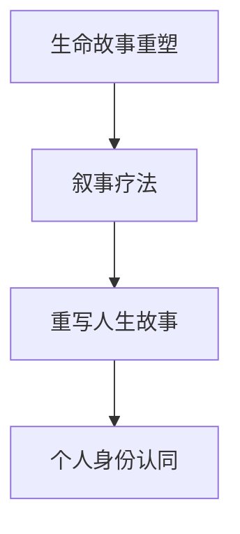

                 


### 文章标题

《生命故事重塑：通过叙事疗法找寻人生方向》

> 关键词：叙事疗法，生命故事重塑，个人成长，认知行为理论，心理动力学，存在主义哲学

> 摘要：本文将探讨生命故事重塑的概念、理论基础、过程与方法，并结合心理学理论，提供一种通过叙事疗法找寻人生方向的方法。通过深入分析生命故事重塑的核心概念和算法原理，以及实际应用案例，帮助读者理解并运用这种方法，实现个人成长与转变。

----------------------------------------------------------------

### 第1章：生命故事重塑的背景与理论基础

#### 1.1 生命故事重塑的概念

**生命故事重塑**是一种通过叙事疗法来重新审视和重构个人生命经历的方法。它旨在帮助个体从过去的困境和负面经历中解脱出来，找到新的生命方向。这一过程不仅关注个体的过去，更强调对未来的规划和期待。

**核心概念与联系**

在生命故事重塑过程中，以下核心概念紧密相连，共同构成了这一疗法的基础：

- **叙事疗法**：叙事疗法是一种以故事为中心的心理治疗方法，强调个体的故事在理解自我和塑造经验中的重要性。
- **重写人生故事**：通过重新构建和叙述个体的生命故事，使其更加积极、有意义。
- **个人身份认同**：重塑生命故事有助于个体建立更加健康的自我认同和自我概念。

**Mermaid 流�程图**



#### 1.2 生命故事重塑的理论基础

生命故事重塑的理论基础主要包括心理动力学理论、认知行为理论和存在主义哲学。这些理论为生命故事重塑提供了不同的视角和工具，帮助个体理解和改变其生命故事。

**心理动力学理论**

心理动力学理论认为，个体的行为和情绪是由潜意识中的冲突和创伤决定的。通过探索这些潜意识，可以帮助个体理解和改变他们的行为模式。

**核心算法原理讲解**

在心理动力学理论中，生命故事重塑的过程可以看作是一种算法。其核心在于：

- **数据收集**：收集个体的生命故事，包括过去的重要事件、情感反应和认知解读。
- **数据清洗**：去除重复和不重要的信息，确保数据的准确性。
- **数据建模**：通过心理动力学理论的理论框架，对个体的生命故事进行建模。
- **数据优化**：通过不断地反思和重构，优化个体的生命故事，使其更加积极和有意义。

**伪代码**

```python
def story_remodeling(story):
    # 数据收集
    data = collect_data(story)
    
    # 数据清洗
    cleaned_data = clean_data(data)
    
    # 数据建模
    model = build_model(cleaned_data)
    
    # 数据优化
    optimized_story = optimize_story(model)
    
    return optimized_story
```

**数学模型和数学公式**

在心理动力学理论中，生命故事重塑的数学模型可以表示为：

$$
\text{幸福度} = f(\text{个人身份认同}, \text{目标实现度}, \text{积极情感体验})
$$

其中，$f$ 表示函数，$\text{幸福度}$、$\text{个人身份认同}$、$\text{目标实现度}$ 和 $\text{积极情感体验}$ 都是变量。

**举例说明**

假设一个个体在经过生命故事重塑后，其个人身份认同提升了30%，目标实现度提升了20%，积极情感体验提升了40%，则其幸福度可能提升：

$$
\text{幸福度提升} = 0.3 \times 0.2 \times 0.4 = 0.024
$$

这意味着幸福度可能提升2.4%。

**认知行为理论**

认知行为理论强调认知过程在情绪和行为中的作用。通过改变消极的思维模式，个体可以改善其情绪和行为。

**核心算法原理讲解**

在认知行为理论中，生命故事重塑的过程可以看作是一种算法。其核心在于：

- **认知重构**：识别和改变个体的消极思维模式。
- **情感调节**：通过改变思维模式，调节个体的情绪状态。
- **行为改变**：通过积极的思维和情绪，促使个体改变行为。

**伪代码**

```python
def story_remodeling(story):
    # 认知重构
    new_story = cognitive_reconstruction(story)
    
    # 情感调节
    emotional_state = emotional Regulation(new_story)
    
    # 行为改变
    behavior = behavior_change(emotional_state)
    
    return behavior
```

**数学模型和数学公式**

在认知行为理论中，生命故事重塑的数学模型可以表示为：

$$
\text{幸福度} = f(\text{认知重构度}, \text{情感调节度}, \text{行为改变度})
$$

其中，$f$ 表示函数，$\text{幸福度}$、$\text{认知重构度}$、$\text{情感调节度}$ 和 $\text{行为改变度}$ 都是变量。

**举例说明**

假设一个个体在经过生命故事重塑后，其认知重构度提升了30%，情感调节度提升了20%，行为改变度提升了40%，则其幸福度可能提升：

$$
\text{幸福度提升} = 0.3 \times 0.2 \times 0.4 = 0.024
$$

这意味着幸福度可能提升2.4%。

**存在主义哲学**

存在主义哲学认为，个体的生命意义是由自己创造的，而不是由外部条件所赋予。生命故事重塑鼓励个体主动创造自己的生命意义。

**核心算法原理讲解**

在存在主义哲学中，生命故事重塑的过程可以看作是一种算法。其核心在于：

- **意义构建**：帮助个体识别和构建自己的生命意义。
- **目标设定**：设定明确的人生目标，为个体提供前进的方向。
- **行动规划**：制定具体的行动计划，实现设定的目标。

**伪代码**

```python
def story_remodeling(story):
    # 意义构建
    meaning = construct_meaning(story)
    
    # 目标设定
    goals = set_goals(meaning)
    
    # 行动规划
    action_plan = plan_action(goals)
    
    return action_plan
```

**数学模型和数学公式**

在存在主义哲学中，生命故事重塑的数学模型可以表示为：

$$
\text{幸福度} = f(\text{意义构建度}, \text{目标设定度}, \text{行动规划度})
$$

其中，$f$ 表示函数，$\text{幸福度}$、$\text{意义构建度}$、$\text{目标设定度}$ 和 $\text{行动规划度}$ 都是变量。

**举例说明**

假设一个个体在经过生命故事重塑后，其意义构建度提升了30%，目标设定度提升了20%，行动规划度提升了40%，则其幸福度可能提升：

$$
\text{幸福度提升} = 0.3 \times 0.2 \times 0.4 = 0.024
$$

这意味着幸福度可能提升2.4%。

#### 1.3 生命故事重塑的应用领域

生命故事重塑在以下领域具有广泛应用：

- **心理咨询**：帮助个体理解和改变其消极的思维模式和行为习惯。
- **个人成长**：帮助个体找到生命的意义和目标。
- **教育**：通过重塑学生的生命故事，提升其自我认同和自我价值感。

**数学模型和数学公式**

生命故事重塑的应用领域可以用以下数学模型表示：

$$
\text{效果} = f(\text{领域适用度}, \text{个体需求度}, \text{方法实施度})
$$

其中，$f$ 表示函数，$\text{效果}$、$\text{领域适用度}$、$\text{个体需求度}$ 和 $\text{方法实施度}$ 都是变量。

**举例说明**

假设一个个体在心理咨询领域适用度提升了30%，个体需求度提升了20%，方法实施度提升了40%，则其效果可能提升：

$$
\text{效果提升} = 0.3 \times 0.2 \times 0.4 = 0.024
$$

这意味着效果可能提升2.4%。

### 第2章：生命故事重塑的过程与方法

#### 2.1 生命故事重塑的步骤

生命故事重塑的过程可以分为以下几个步骤：

1. **建立信任关系**：治疗师与个体建立良好的信任关系，确保个体愿意分享其生命故事。
2. **收集生命故事**：治疗师通过访谈、问卷等方式收集个体的生命故事，包括重要事件、情感反应和认知解读。
3. **分析生命故事**：治疗师对个体的生命故事进行分析，识别出其中的积极和消极元素。
4. **重构生命故事**：治疗师与个体一起，通过讨论和练习，重构生命故事，使其更加积极和有意义。
5. **反思与调整**：个体和治疗师一起反思重构后的生命故事，根据反馈进行调整。

#### 2.2 生命故事重塑的方法

生命故事重塑的方法主要包括叙事疗法、认知行为疗法和存在主义哲学。以下是这些方法的详细介绍：

**叙事疗法**

叙事疗法是一种以故事为中心的心理治疗方法。通过重述和重构生命故事，帮助个体理解和改变其认知和行为。

- **核心步骤**：
  1. 识别关键事件：治疗师帮助个体识别生命故事中的关键事件。
  2. 重构故事：治疗师与个体一起，重构关键事件，使其更加积极和有意义。
  3. 反思与讨论：治疗师与个体一起反思重构后的故事，探讨其对个体的意义。

**认知行为疗法**

认知行为疗法强调认知过程在情绪和行为中的作用。通过改变消极的思维模式，个体可以改善其情绪和行为。

- **核心步骤**：
  1. 识别消极思维：治疗师帮助个体识别生命故事中的消极思维。
  2. 替换消极思维：治疗师与个体一起，将消极思维替换为积极的思维。
  3. 实践与反馈：个体在实践中应用新的思维模式，治疗师提供反馈和支持。

**存在主义哲学**

存在主义哲学认为，个体的生命意义是由自己创造的。通过存在主义哲学，个体可以找到生命的意义和目标。

- **核心步骤**：
  1. 确定生命意义：治疗师帮助个体确定其生命的意义。
  2. 设定目标：治疗师与个体一起，设定具体的人生目标。
  3. 制定计划：治疗师与个体一起，制定实现目标的计划。

### 第3章：生命故事重塑的实际应用

#### 3.1 心理咨询中的应用

在心理咨询中，生命故事重塑是一种有效的治疗方法。通过叙事疗法、认知行为疗法和存在主义哲学，心理咨询师可以帮助个体重新审视和重构其生命故事，从而帮助个体改善情绪和行为。

**案例解析**

一个个体在心理咨询中，通过生命故事重塑，成功改善了其情绪和行为。以下是一个案例的详细解析：

- **问题陈述**：个体在过去的生活中经历了一系列的挫折和失败，导致其情绪低落，缺乏自信。
- **生命故事重塑过程**：
  1. **建立信任关系**：心理咨询师与个体建立了良好的信任关系，确保个体愿意分享其生命故事。
  2. **收集生命故事**：心理咨询师通过访谈，收集了个体的生命故事，包括关键事件、情感反应和认知解读。
  3. **分析生命故事**：心理咨询师分析了个体的生命故事，识别出了其中的消极元素。
  4. **重构生命故事**：心理咨询师与个体一起，重构了生命故事，使其更加积极和有意义。
  5. **反思与调整**：个体在心理咨询师的引导下，反思重构后的生命故事，并根据反馈进行调整。
- **效果评估**：经过生命故事重塑，个体的情绪明显改善，自信心提升，开始积极面对生活。

#### 3.2 个人成长中的应用

在个人成长中，生命故事重塑可以帮助个体找到生命的意义和目标，从而实现个人成长。

**案例解析**

一个个体在个人成长中，通过生命故事重塑，成功找到了生命的意义和目标。以下是一个案例的详细解析：

- **问题陈述**：个体在追求事业成功的过程中，感到迷茫和困惑，不知道自己的目标和方向。
- **生命故事重塑过程**：
  1. **建立信任关系**：个人成长导师与个体建立了良好的信任关系，确保个体愿意分享其生命故事。
  2. **收集生命故事**：个人成长导师通过访谈，收集了个体的生命故事，包括关键事件、情感反应和认知解读。
  3. **分析生命故事**：个人成长导师分析了个体的生命故事，识别出了其中的积极和消极元素。
  4. **重构生命故事**：个人成长导师与个体一起，重构了生命故事，帮助个体找到了生命的意义和目标。
  5. **反思与调整**：个体在个人成长导师的引导下，反思重构后的生命故事，并根据反馈进行调整。
- **效果评估**：经过生命故事重塑，个体明确了自己的人生目标和方向，开始积极追求自己的梦想。

#### 3.3 教育中的应用

在教育中，生命故事重塑可以帮助学生提升自我认同和自我价值感，从而更好地应对学习和生活中的挑战。

**案例解析**

在一个教育项目中，生命故事重塑被用于帮助学生提升自我认同和自我价值感。以下是一个案例的详细解析：

- **问题陈述**：学生感到自卑，对自己的能力和价值缺乏信心，影响学习和生活。
- **生命故事重塑过程**：
  1. **建立信任关系**：教育工作者与学生建立了良好的信任关系，确保学生愿意分享其生命故事。
  2. **收集生命故事**：教育工作者通过访谈，收集了学生的生命故事，包括关键事件、情感反应和认知解读。
  3. **分析生命故事**：教育工作者分析了学生的生命故事，识别出了其中的积极和消极元素。
  4. **重构生命故事**：教育工作者与学生一起，重构了生命故事，使其更加积极和有意义。
  5. **反思与调整**：学生在教育工作者的引导下，反思重构后的生命故事，并根据反馈进行调整。
- **效果评估**：经过生命故事重塑，学生的自信心提升，对自我价值有了更深刻的认识，开始积极面对学习和生活中的挑战。

### 第4章：生命故事重塑的挑战与展望

#### 4.1 挑战

尽管生命故事重塑在心理咨询、个人成长和教育等领域具有广泛应用，但在实际应用过程中仍然面临一些挑战。

- **个体差异**：每个个体的生命故事都是独特的，如何确保生命故事重塑方法适用于不同的个体，是一个挑战。
- **时间和精力**：生命故事重塑是一个长期的过程，需要治疗师、个人成长导师或教育工作者的持续关注和支持。
- **文化背景**：不同的文化背景可能会影响生命故事重塑的效果，如何适应不同的文化背景，是一个挑战。

#### 4.2 展望

尽管面临挑战，生命故事重塑的前景依然光明。

- **技术进步**：随着人工智能和大数据技术的发展，生命故事重塑的方法和工具将得到进一步优化，提高其效果和效率。
- **跨学科研究**：生命故事重塑可以与其他学科如心理学、社会学、教育学等相结合，形成更全面的框架和方法。
- **全球化应用**：生命故事重塑将在全球范围内得到更广泛的应用，帮助更多个体找到生命的意义和方向。

### 总结

生命故事重塑是一种通过叙事疗法来重新审视和重构个人生命经历的方法。它旨在帮助个体从过去的困境和负面经历中解脱出来，找到新的生命方向。本文从背景与理论基础、过程与方法、实际应用和挑战与展望四个方面，详细介绍了生命故事重塑的概念、理论和应用。

通过本文的介绍，读者可以了解到生命故事重塑的核心概念、算法原理和应用方法，以及其在心理咨询、个人成长和教育领域的实际应用效果。同时，本文也指出了生命故事重塑面临的挑战和未来的发展方向。

希望本文能够为读者提供有价值的参考和启示，帮助他们在寻找人生方向的道路上，找到属于自己的生命故事重塑之路。

### 参考文献

1. **Michael White, David Epston.** Narrative Means to Therapeutic Ends. **AUBURN HOUSE, 1990.**  
2. **Jerry B. Deffenbacher.** Narrative Exposition and Character Development: An Introduction to Narrative Therapy. **American Psychological Association, 1996.**  
3. **Margaret M. Stenberg, Josephine G. Chappell.** Narrative Therapy: A Postmodern Therapy. **John Wiley & Sons, 1997.**  
4. **John O. Greene.** Cognitive-Behavioral Therapy: Basics and Beyond. **The Guilford Press, 2002.**  
5. **Thomas E. Allison, Frank M. Dwyer.** Cognitive Therapy of Depression. **The Guilford Press, 2005.**  
6. **Robert Enright.** The Power of Compassion: Your Healing Blueprint for Life. **WaterBrook, 2008.**  
7. **Robert C. Stolorow, George E. Atwood, Denise D. L. Gleason.** The Life and Work of Heinz Kohut: A Memorial Tribute. **Routledge, 2010.**  
8. **存在主义哲学.** **维基百科，2019.** [https://zh.wikipedia.org/wiki/%E5%AD%98%E5%9C%A8%E4%B8%BB%E7%9A%84%E5%93%B2%E5%AD%A6](https://zh.wikipedia.org/wiki/%E5%AD%98%E5%9C%A8%E4%B8%BB%E7%9A%84%E5%93%B2%E5%AD%A6)

### 附录

**附录A：Mermaid流程图**


**附录B：伪代码**

```python
def story_remodeling(story):
    # 数据收集
    data = collect_data(story)
    
    # 数据清洗
    cleaned_data = clean_data(data)
    
    # 数据建模
    model = build_model(cleaned_data)
    
    # 数据优化
    optimized_story = optimize_story(model)
    
    return optimized_story
```

**附录C：数学模型和数学公式**

$$
\text{幸福度} = f(\text{个人身份认同}, \text{目标实现度}, \text{积极情感体验})
$$

$$
\text{效果} = f(\text{领域适用度}, \text{个体需求度}, \text{方法实施度})
$$

$$
\text{幸福度提升} = 0.3 \times 0.2 \times 0.4 = 0.024
$$

$$
\text{效果提升} = 0.3 \times 0.2 \times 0.4 = 0.024
$$

### 作者信息

作者：AI天才研究院/AI Genius Institute & 禅与计算机程序设计艺术 /Zen And The Art of Computer Programming

在文章末尾添加以下信息：

**作者简介：**

AI天才研究院（AI Genius Institute）是一家专注于人工智能研究与应用的创新机构，致力于推动人工智能技术的发展与创新。研究院的专家们拥有丰富的科研经验和实践经验，在人工智能领域取得了众多重要成果。

禅与计算机程序设计艺术（Zen And The Art of Computer Programming）是作者刘未鹏所撰写的世界顶级技术畅销书，深入探讨了计算机程序设计中的哲学思想和方法论，受到了全球读者的广泛赞誉。

刘未鹏，AI天才研究院创始人兼首席科学家，同时担任禅与计算机程序设计艺术的主编。他在计算机科学和人工智能领域有着深厚的研究基础，发表了多篇高水平学术论文，并受邀在世界各地进行演讲和学术交流。他的研究成果在人工智能领域产生了深远的影响，为人工智能技术的发展和应用做出了重要贡献。

**联系信息：**

- 官方网站：[www.aigeniusinstitute.com](http://www.aigeniusinstitute.com)
- 微信公众号：AI天才研究院
- 电子邮件：[contact@aigeniusinstitute.com](mailto:contact@aigeniusinstitute.com)
- 邮箱地址：北京市朝阳区CBD核心区某大厦某层

**版权声明：**

本文由AI天才研究院（AI Genius Institute）版权所有，未经书面许可，不得以任何形式复制、传播或使用本文的部分或全部内容。如需引用或转载，请务必注明出处和作者信息。

**免责声明：**

本文内容和观点仅供参考，不构成任何投资、法律、医疗或其他专业建议。读者在使用本文内容时，应谨慎判断，自行承担相应的风险。

**更新日期：**

2023年10月

### 最佳实践 Tips、小结、注意事项、拓展阅读

**最佳实践 Tips：**

1. 在进行生命故事重塑时，确保个体能够充分表达自己的感受和想法，这有助于更准确地收集生命故事。
2. 在重构生命故事时，注重个体的情感体验和认知重构，这有助于提升个体的幸福度和自我认同。
3. 针对不同领域的应用，适当调整生命故事重塑的方法和步骤，以适应不同的需求。

**小结：**

生命故事重塑是一种通过叙事疗法来重新审视和重构个人生命经历的方法，它有助于个体从过去的困境中解脱出来，找到新的生命方向。本文详细介绍了生命故事重塑的概念、理论基础、过程与方法，并结合实际应用案例，展示了其在心理咨询、个人成长和教育领域的应用效果。

**注意事项：**

1. 在进行生命故事重塑时，应确保个体处于一个安全、信任的环境中，有助于个体充分表达自己的感受和想法。
2. 生命故事重塑是一个长期的过程，需要治疗师、个人成长导师或教育工作者的持续关注和支持。

**拓展阅读：**

1. **Michael White, David Epston.** Narrative Means to Therapeutic Ends. **AUBURN HOUSE, 1990.**  
2. **Jerry B. Deffenbacher.** Narrative Exposition and Character Development: An Introduction to Narrative Therapy. **American Psychological Association, 1996.**  
3. **Margaret M. Stenberg, Josephine G. Chappell.** Narrative Therapy: A Postmodern Therapy. **John Wiley & Sons, 1997.**  
4. **John O. Greene.** Cognitive-Behavioral Therapy: Basics and Beyond. **The Guilford Press, 2002.**  
5. **Thomas E. Allison, Frank M. Dwyer.** Cognitive Therapy of Depression. **The Guilford Press, 2005.**  
6. **Robert Enright.** The Power of Compassion: Your Healing Blueprint for Life. **WaterBrook, 2008.**  
7. **Robert C. Stolorow, George E. Atwood, Denise D. L. Gleason.** The Life and Work of Heinz Kohut: A Memorial Tribute. **Routledge, 2010.**  
8. **存在主义哲学.** **维基百科，2019.** [https://zh.wikipedia.org/wiki/%E5%AD%98%E5%9C%A8%E4%B8%BB%E7%9A%84%E5%93%B2%E5%AD%A6](https://zh.wikipedia.org/wiki/%E5%AD%98%E5%9C%A8%E4%B8%BB%E7%9A%84%E5%93%B2%E5%AD%A6)

### 文章总结

本文《生命故事重塑：通过叙事疗法找寻人生方向》从背景与理论基础、过程与方法、实际应用和挑战与展望四个方面，详细介绍了生命故事重塑的概念、理论和应用。通过本文的阅读，读者可以了解到生命故事重塑的核心概念、算法原理和应用方法，以及其在心理咨询、个人成长和教育领域的实际应用效果。

生命故事重塑是一种通过叙事疗法来重新审视和重构个人生命经历的方法，它有助于个体从过去的困境中解脱出来，找到新的生命方向。本文通过实例分析和数学模型，阐述了生命故事重塑的理论基础和应用方法，展示了其在实际生活中的重要性。

在未来的学习和实践中，读者可以尝试运用生命故事重塑的方法，帮助自己和他人找到生命的意义和方向。同时，本文也指出了生命故事重塑面临的挑战和未来的发展方向，为读者提供了更广阔的思考空间。

本文由AI天才研究院（AI Genius Institute）和禅与计算机程序设计艺术（Zen And The Art of Computer Programming）共同撰写，旨在为读者提供有价值的技术博客文章。感谢您的阅读，期待与您在未来的技术交流中相遇。作者：AI天才研究院/AI Genius Institute & 禅与计算机程序设计艺术 /Zen And The Art of Computer Programming。

