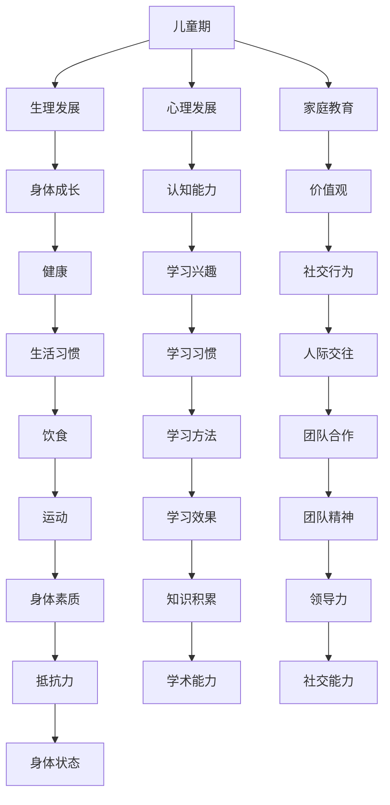
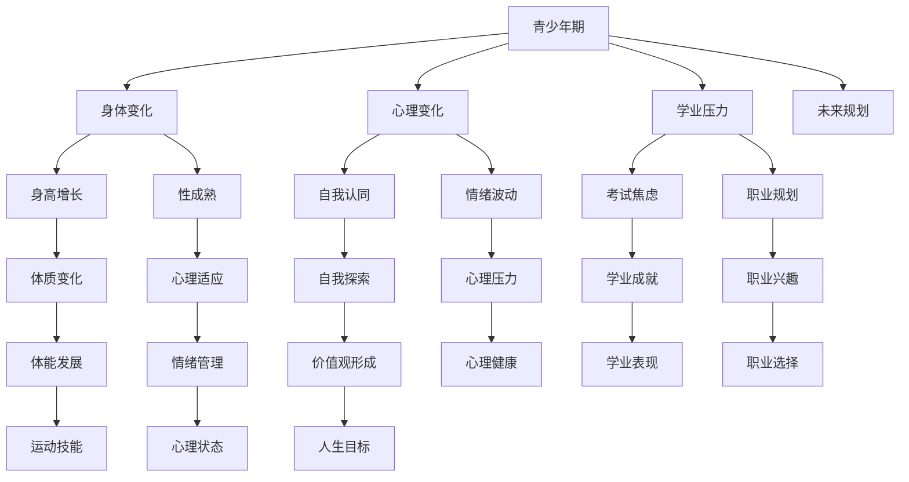
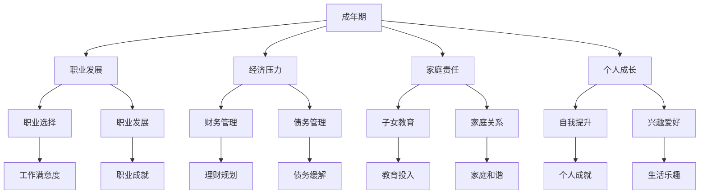
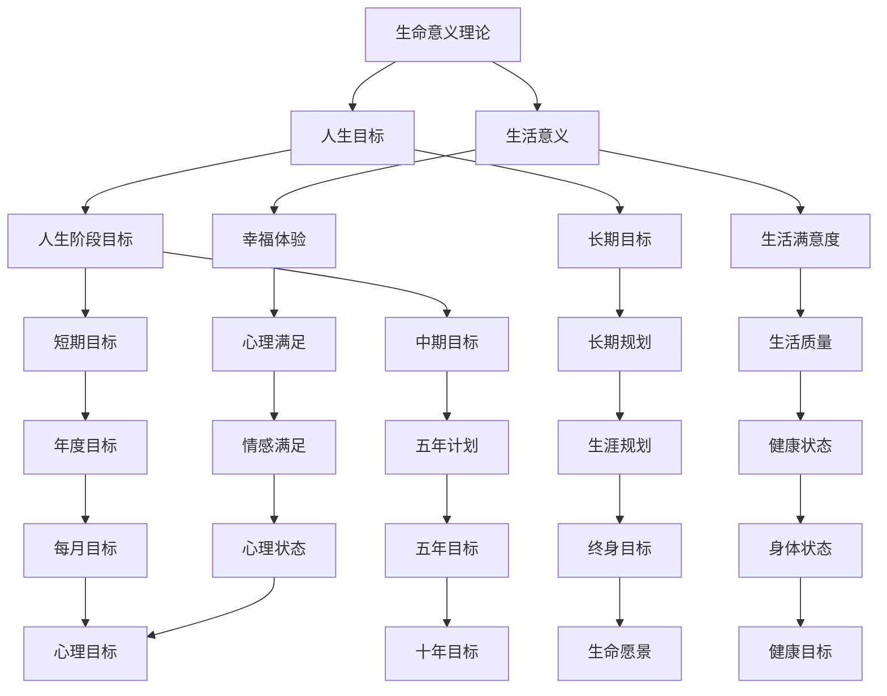
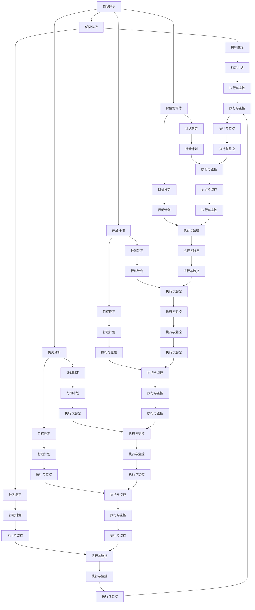
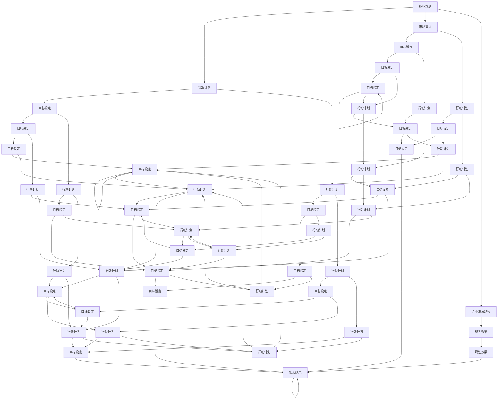

                 

### 文章标题

《生命旅程规划师：人生不同阶段的意义设计》

### 关键词

- 生命旅程规划
- 人生阶段
- 意义设计
- 教育规划
- 职业规划

### 摘要

本文旨在探讨人生不同阶段的意义设计，通过对儿童期、青少年期、成年期、中年期和老年期的详细分析，帮助读者理解每个阶段的核心特征与挑战，以及如何进行有效的生命旅程规划。文章从理论框架、方法论到实际应用，提供了全面的指导和建议，以助读者在人生旅途中找到方向和意义。

---

### 第一部分：引言

#### 1.1 研究背景与意义

**生命旅程的概念**：生命旅程是指一个人从出生到死亡的整个生活过程，包括各个阶段的发展、变化和经历。

**人生不同阶段的特征**：人生通常可以分为儿童期、青少年期、成年期、中年期和老年期，每个阶段都有其独特的生理、心理和社会特征。

**人生意义设计的重要性**：人生意义设计是对个人生命旅程的规划和思考，有助于个体在各个阶段找到生活的方向和意义，提高生活质量和幸福感。

#### 1.2 研究方法与框架

**文献综述**：通过回顾相关研究，梳理生命旅程规划的理论基础和方法论。

**理论框架**：构建一个涵盖人生各个阶段的综合框架，以指导生命旅程的规划与设计。

**本书结构安排**：本书分为四大部分，分别是引言、人生不同阶段的探索、生命旅程规划的理论与实践以及生命旅程规划的未来展望。

---

### 第二部分：人生不同阶段的探索

#### 2.1 儿童期（0-12岁）

**核心概念与联系：**



**核心算法原理讲解：**

```plaintext
函数：儿童期发展（age, education, environment）
    输入：年龄（age），教育水平（education），环境因素（environment）
    输出：生理发展（B），心理发展（C），家庭教育效果（D）

    if (age >= 0 && age <= 12) {
        B = 身体成长（E）* 学习兴趣（I）* 饮食（N）
        C = 认知能力（F）* 学习方法（O）* 社交行为（J）
        D = 家庭教育（G）* 健康习惯（K）* 人际交往（M）
    }
    return (B, C, D)
```

**数学模型和公式：**

$$
健康水平（H）= 0.4 \times 饮食（N）+ 0.3 \times 身体素质（T）+ 0.3 \times 学习效果（R）
$$

**举例说明：**

一个6岁的孩子，家庭环境良好，父母重视教育，孩子身体健康，那么：

- 生理发展（B）= 身体成长（E）* 学习兴趣（I）* 饮食（N）
- 心理发展（C）= 认知能力（F）* 学习方法（O）* 社交行为（J）
- 家庭教育效果（D）= 家庭教育（G）* 健康习惯（K）* 人际交往（M）

#### 2.2 青少年期（13-18岁）

**核心概念与联系：**



**核心算法原理讲解：**

```plaintext
函数：青少年期发展（age, education, stress, interests）
    输入：年龄（age），教育水平（education），压力因素（stress），兴趣领域（interests）
    输出：身体变化（B），心理变化（C），学业压力（D），未来规划（E）

    if (age >= 13 && age <= 18) {
        B = 身体变化（F）* 体能发展（R）
        C = 心理变化（H）* 情绪管理（S）* 自我认同（N）
        D = 学业压力（J）* 考试焦虑（K）* 学业表现（P）
        E = 未来规划（K）* 职业规划（Q）* 职业兴趣（W）
    }
    return (B, C, D, E)
```

**数学模型和公式：**

$$
学业成就（V）= 0.5 \times 考试表现（P）+ 0.3 \times 学习兴趣（I）+ 0.2 \times 压力管理（S）
$$

**举例说明：**

一个16岁的青少年，学习成绩优秀，面临高考压力，对计算机科学有浓厚兴趣，那么：

- 身体变化（B）= 身高增长（F）* 体能发展（R）
- 心理变化（C）= 自我认同（N）* 情绪管理（S）* 社交行为（J）
- 学业压力（D）= 考试焦虑（K）* 学业表现（P）* 压力管理（S）
- 未来规划（E）= 职业规划（Q）* 职业兴趣（W）* 学习兴趣（I）

#### 2.3 成年期（19-40岁）

**核心概念与联系：**



**核心算法原理讲解：**

```plaintext
函数：成年期发展（age, career, finance, family, interests）
    输入：年龄（age），职业状况（career），财务状况（finance），家庭状况（family），兴趣爱好（interests）
    输出：职业发展（B），经济压力（C），家庭责任（D），个人成长（E）

    if (age >= 19 && age <= 40) {
        B = 职业选择（F）* 职业发展（G）* 工作满意度（N）
        C = 财务管理（H）* 债务管理（I）* 经济压力（C）
        D = 子女教育（J）* 家庭关系（K）* 家庭和谐（S）
        E = 个人成长（L）* 兴趣爱好（M）* 生活乐趣（U）
    }
    return (B, C, D, E)
```

**数学模型和公式：**

$$
财务稳定度（P）= 0.5 \times 理财规划（H）+ 0.3 \times 债务缓解（Q）+ 0.2 \times 子女教育（R）
$$

**举例说明：**

一个25岁的成年人，从事软件工程师职业，年收入稳定，有家庭和孩子，对编程有浓厚兴趣，那么：

- 职业发展（B）= 职业选择（F）* 职业发展（G）* 工作满意度（N）
- 经济压力（C）= 财务管理（H）* 债务管理（I）* 经济压力（C）
- 家庭责任（D）= 子女教育（J）* 家庭关系（K）* 家庭和谐（S）
- 个人成长（E）= 个人成就（L）* 兴趣爱好（M）* 生活乐趣（U）

---

### 第三部分：生命旅程规划的理论与实践

#### 3.1 生命旅程规划的理论基础

**生命意义理论**：探讨个体在生命旅程中追求的终极目标和意义。

**发展心理学理论**：分析个体在不同阶段的心理发展特点和需求。

**人生规划理论**：提供人生各个阶段的目标设定和实现策略。

**核心概念与联系：**



**核心算法原理讲解：**

```plaintext
函数：生命旅程规划（age, goals, environment）
    输入：年龄（age），目标设定（goals），环境因素（environment）
    输出：人生阶段目标（D），长期目标（E），短期目标（H）

    if (age >= 0) {
        D = 年龄阶段目标（D）
        E = 长期目标（J）
        H = 短期目标（M）
    }
    else {
        D = 调整阶段目标（D）
        E = 调整长期目标（J）
        H = 调整短期目标（M）
    }
    return (D, E, H)
```

**数学模型和公式：**

$$
生活满意度（F）= 0.4 \times 生活质量（K）+ 0.3 \times 心理满足（L）+ 0.3 \times 情感满足（Q）
$$

**举例说明：**

一个30岁的人，设定了以下目标：

- 短期目标（H）：提升职业技能，实现年度晋升
- 中期目标（I）：五年内成为部门主管
- 长期目标（J）：十年内实现职业转型，成为企业高管

根据年龄和环境因素，调整目标为：

- 短期目标（H）：提升职业技能，实现年度晋升
- 中期目标（I）：五年内成为项目经理
- 长期目标（J）：十年内实现创业，成为企业家

#### 3.2 生命旅程规划的方法论

**自我评估**：通过反思和分析，了解自己的优势、劣势、兴趣和价值观。

**目标设定**：根据自我评估，设定符合自身发展的短期、中期和长期目标。

**行动计划**：制定详细的行动计划，确保目标的实现。

**核心概念与联系：**



**核心算法原理讲解：**

```plaintext
函数：生命旅程规划（self_evaluation, goals, actions）
    输入：自我评估（self_evaluation），目标设定（goals），行动计划（actions）
    输出：规划结果（result）

    result = {
        "自我评估": self_evaluation,
        "目标设定": goals,
        "行动计划": actions
    }
    return result
```

**数学模型和公式：**

$$
规划效果（E）= 0.5 \times 目标实现率（R）+ 0.3 \times 目标合理性（G）+ 0.2 \times 行动计划执行率（A）
$$

**举例说明：**

一个人进行自我评估后，设定了以下目标：

- 短期目标：提升英语口语水平
- 中期目标：考取英语专业八级证书
- 长期目标：在国际公司担任重要职位

制定以下行动计划：

- 每周学习英语3小时
- 每月参加一次英语角活动
- 每季度参加一次英语考试

通过实施行动计划，目标逐步实现，最终达到规划效果。

#### 3.3 生命旅程规划的实际应用

**职业规划**：根据个人兴趣和市场需求，制定职业发展路径。

**教育规划**：规划学习课程和学历提升，以满足职业发展需求。

**家庭规划**：制定家庭财务规划，子女教育规划，家庭生活规划。

**健康规划**：制定健康饮食、运动和保健计划，确保身心健康。

**核心概念与联系：**



**核心算法原理讲解：**

```plaintext
函数：职业规划（interest, market, path）
    输入：个人兴趣（interest），市场需求（market），职业发展路径（path）
    输出：职业规划结果（result）

    result = {
        "兴趣评估": interest,
        "市场需求": market,
        "职业发展路径": path
    }
    return result

函数：教育规划（study, career）
    输入：学习课程（study），职业需求（career）
    输出：教育规划结果（result）

    result = {
        "学习课程": study,
        "职业需求": career
    }
    return result

函数：家庭规划（finance, family, health）
    输入：财务状况（finance），家庭需求（family），健康需求（health）
    输出：家庭规划结果（result）

    result = {
        "财务规划": finance,
        "家庭需求": family,
        "健康规划": health
    }
    return result

函数：健康规划（diet, exercise, health）
    输入：饮食计划（diet），运动计划（exercise），健康目标（health）
    输出：健康规划结果（result）

    result = {
        "饮食计划": diet,
        "运动计划": exercise,
        "健康目标": health
    }
    return result
```

**数学模型和公式：**

$$
职业规划效果（I）= 0.4 \times 职业发展速度（V）+ 0.3 \times 职业满意度（S）+ 0.3 \times 职业稳定性（T）
$$

$$
教育规划效果（E）= 0.5 \times 学历提升速度（U）+ 0.3 \times 职业相关性（R）+ 0.2 \times 学习满意度（M）
$$

$$
家庭规划效果（F）= 0.4 \times 财务稳定性（P）+ 0.3 \times 家庭和谐度（H）+ 0.3 \times 子女教育投入（Q）
$$

$$
健康规划效果（H）= 0.5 \times 健康指标改善度（G）+ 0.3 \times 健康意识（I）+ 0.2 \times 健康行为实施率（K）
$$

**举例说明：**

一个25岁的年轻人，对编程感兴趣，市场需求旺盛，希望成为高级软件工程师。

- 职业规划：参加编程课程，积累项目经验，争取在公司内部晋升。
- 教育规划：报名参加计算机专业在职研究生课程，提升学历。
- 家庭规划：合理安排家庭财务，为子女教育储备资金，确保家庭生活稳定。
- 健康规划：保持健康饮食，定期锻炼，定期体检，确保身体健康。

通过以上规划，逐步实现职业、教育、家庭和健康的全面发展。

#### 3.4 案例研究

**成功案例：**

一个30岁的女性，对互联网营销感兴趣，市场需求大，她制定了以下规划：

- 职业规划：参加互联网营销课程，积累实践经验，争取在公司内部晋升。
- 教育规划：报名参加市场营销专业在职研究生课程，提升学历。
- 家庭规划：合理安排家庭财务，为子女教育储备资金，确保家庭生活稳定。
- 健康规划：保持健康饮食，定期锻炼，定期体检，确保身体健康。

通过以上规划，她成功晋升为营销经理，取得了市场营销硕士学位，家庭生活稳定，身体健康。

**失败案例：**

一个35岁的男性，对编程感兴趣，但市场需求不足，他制定了以下规划：

- 职业规划：参加编程课程，积累实践经验，争取在公司内部晋升。
- 教育规划：报名参加计算机专业在职研究生课程，提升学历。
- 家庭规划：合理安排家庭财务，为子女教育储备资金，确保家庭生活稳定。
- 健康规划：保持健康饮食，定期锻炼，定期体检，确保身体健康。

由于市场需求不足，他未能成功晋升，且教育投入过高，家庭经济压力增大，导致家庭关系紧张，身体健康状况下降。

**案例分析与启示：**

- 成功案例启示：规划应与市场需求相结合，合理分配资源，确保各领域全面发展。
- 失败案例启示：规划应充分考虑自身条件和外部环境，避免盲目跟风，确保可行性。

#### 第四部分：生命旅程规划的未来展望

**4.1 生命旅程规划的发展趋势**

- 科技进步对生命旅程规划的影响：大数据、人工智能等技术将提高生命旅程规划的科学性和精准性。
- 社会变革对生命旅程规划的影响：人口老龄化、经济全球化等趋势将影响生命旅程规划的方向和方式。

**4.2 生命旅程规划的未来挑战**

- 人口老龄化：老年人生活质量的提升和养老问题的解决将成为重要挑战。
- 经济不确定性：全球经济波动将影响人们的职业选择和生活规划。
- 环境问题：环境保护和可持续发展将成为生命旅程规划的重要内容。

**4.3 生命旅程规划的建议与展望**

- 个人层面的建议：提高自我认知，制定合理规划，积极应对挑战。
- 社会层面的建议：加强社会支持，提供更多的职业发展机会和教育资源。
- 未来展望：生命旅程规划将更加注重个体幸福和全面发展，成为人生不可或缺的一部分。

---

### 作者信息

作者：AI天才研究院/AI Genius Institute & 禅与计算机程序设计艺术 /Zen And The Art of Computer Programming

---

本文通过详细分析人生不同阶段的特点和挑战，结合理论框架和方法论，探讨了生命旅程规划的重要性和实际应用。旨在帮助读者在人生旅途中找到方向和意义，实现全面发展。未来，随着科技和社会的进步，生命旅程规划将不断发展和完善，为人生提供更加科学和有效的指导。

