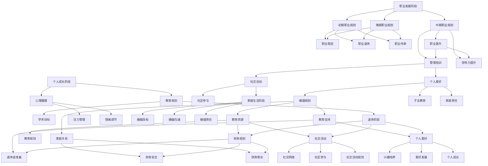

                 

### 文章标题：生命旅程规划服务：人生不同阶段的意义设计

#### 关键词：
- 生命旅程规划
- 人生阶段
- 意义设计
- 个人成长
- 职业发展
- 家庭生活
- 退休规划

#### 摘要：
本文旨在探讨如何通过生命旅程规划服务来设计人生不同阶段的意义。通过对个人成长、职业发展、家庭生活和退休阶段的分析，文章将揭示如何在不同人生阶段找到生活的意义，实现自我价值的最大化。通过理论阐述、实践案例和最佳实践经验，本文为读者提供了一个全面、系统的生命旅程规划指南。

---

# 引言

在现代社会，人们的生活节奏日益加快，面临着越来越多的压力和挑战。如何在这个纷繁复杂的世界中找到生命的意义，成为了许多人思考的问题。生命旅程规划服务应运而生，为人们提供了一个系统的方法，来规划不同人生阶段的目标和意义。

## 什么是生命旅程规划服务

生命旅程规划服务是一种综合性服务，旨在帮助个人在人生的不同阶段实现目标、发现意义。这种服务包括以下几个核心方面：

### 个人成长

个人成长是人生旅程中的第一个重要阶段。在这个阶段，人们需要不断学习、成长，培养自己的技能和素质。生命旅程规划服务通过帮助个人设定教育目标、职业规划、心理健康管理等，促进个人全面发展。

### 职业发展

职业发展是许多人生命中的主要阶段。在这个阶段，人们需要根据自己的兴趣、能力和市场需求来选择合适的职业，并在职业生涯中不断成长。生命旅程规划服务提供职业规划、晋升指导、转型支持等，帮助个人实现职业目标。

### 家庭生活

家庭生活是人生中另一个重要方面。在这个阶段，人们需要面对婚姻、子女教育、家庭责任等挑战。生命旅程规划服务通过提供家庭规划、婚姻辅导、子女教育指导等，帮助个人建立和谐的家庭生活。

### 退休阶段

退休阶段是人生的最后阶段。在这个阶段，人们需要重新规划自己的生活，找到新的意义和目标。生命旅程规划服务通过提供财务规划、社交活动、个人爱好等指导，帮助个人在退休后过上充实、有意义的生活。

## 生命旅程规划服务的重要性

生命旅程规划服务的重要性体现在以下几个方面：

### 明确目标

通过生命旅程规划服务，个人可以明确自己在不同人生阶段的目标，从而更好地规划自己的时间和资源，提高生活质量。

### 提高幸福感

生命旅程规划服务可以帮助个人在不同人生阶段找到生活的意义，提高幸福感。当人们知道自己正在朝着有意义的目标前进时，他们会感到更加充实和满足。

### 减少焦虑和压力

生命旅程规划服务可以帮助个人更好地应对生活中的挑战，减少焦虑和压力。通过提前规划，个人可以更好地准备自己，应对突发事件。

### 促进全面发展

生命旅程规划服务不仅仅关注职业发展，还涵盖了个人成长、家庭生活和退休阶段。这种全方位的规划有助于个人实现全面发展。

## 本文结构

本文将按照以下结构进行论述：

1. **个人成长阶段**：探讨如何在个人成长阶段规划人生，实现自我价值。
2. **职业发展阶段**：分析职业生涯的不同阶段，寻找职业发展的意义。
3. **家庭生活阶段**：讲述如何规划家庭生活，建立和谐的家庭关系。
4. **退休阶段**：探讨退休后的生活规划，实现退休阶段的生活价值。
5. **生命旅程规划工具与方法**：介绍生命旅程规划中常用的工具和方法。
6. **生命旅程规划案例分析**：通过成功和失败案例，分析生命旅程规划的实际应用。
7. **结论**：总结全文，强调生命旅程规划服务的重要性。

## 个人成长阶段

个人成长阶段是人生旅程中的第一个重要阶段。在这个阶段，人们需要不断学习、成长，培养自己的技能和素质。生命旅程规划服务通过帮助个人设定教育目标、职业规划、心理健康管理等，促进个人全面发展。

### 教育规划

教育规划是个人成长阶段的重要一环。在这个阶段，人们需要根据自身的兴趣和能力，选择合适的教育路径。以下是一些教育规划的建议：

#### 学术目标

设定明确的学术目标是教育规划的第一步。个人需要根据自身的职业规划，选择适合自己的学科和专业。例如，如果个人希望成为一名医生，那么他需要选择医学相关的专业。

#### 技能发展

除了学术目标，个人还需要关注技能发展。技能是未来职业生涯的关键，因此个人需要通过多种途径来提升自己的技能。例如，可以通过参加培训班、实习、参与项目等方式，提高自己的实际操作能力。

#### 职业规划

教育规划不仅仅关注学术和技能，还需要考虑职业规划。个人需要了解不同职业的发展前景，选择一个有前景、适合自己的职业。例如，如果个人对互联网行业感兴趣，那么他可以选择计算机科学或软件工程等专业。

### 心理健康

心理健康是个人成长阶段的重要组成部分。在这个阶段，个人需要学会如何管理自己的情绪，应对压力和挫折。以下是一些建议：

#### 压力管理

压力是影响个人心理健康的重要因素。个人需要学会如何管理压力，避免压力过大导致心理问题。例如，可以通过运动、放松技巧、社交活动等方式，缓解压力。

#### 情绪调节

个人需要学会如何调节自己的情绪，避免情绪波动过大。例如，可以通过正念练习、冥想等方式，提高情绪调节能力。

#### 自我认知

自我认知是心理健康的基础。个人需要了解自己的优点和不足，从而更好地发展自己。例如，可以通过心理测试、自我反思等方式，提高自我认知。

### 社交技能

社交技能是个人成长阶段的重要能力。在这个阶段，个人需要学会如何与他人沟通、合作，建立良好的人际关系。以下是一些建议：

#### 沟通技巧

沟通技巧是社交技能的核心。个人需要学会如何清晰、有效地表达自己的想法，理解他人的观点。例如，可以通过阅读沟通技巧书籍、参加沟通技巧培训等方式，提高沟通技巧。

#### 合作能力

合作能力是个人在职业生涯中不可或缺的能力。个人需要学会如何在团队中发挥作用，与他人合作完成任务。例如，可以通过参与团队项目、加入社团等方式，提高合作能力。

#### 人际关系管理

个人需要学会如何管理人际关系，避免冲突，建立和谐的人际关系。例如，可以通过阅读人际关系管理书籍、参加人际关系培训等方式，提高人际关系管理能力。

## 职业发展阶段

职业发展阶段是人生旅程中的第二个重要阶段。在这个阶段，人们需要根据自己的兴趣、能力和市场需求来选择合适的职业，并在职业生涯中不断成长。生命旅程规划服务通过提供职业规划、晋升指导、转型支持等，帮助个人实现职业目标。

### 初期职业规划

初期职业规划是职业生涯的起点。在这个阶段，个人需要根据自己的兴趣、能力和市场需求，选择一个合适的职业方向。以下是一些建议：

#### 职业定位

职业定位是初期职业规划的重要一环。个人需要明确自己的职业目标，选择一个有发展前景、符合自己兴趣和能力的职业方向。例如，如果个人对互联网行业感兴趣，可以选择计算机科学或软件工程等专业。

#### 技能发展

初期职业规划还需要关注技能发展。个人需要通过学习、实践等方式，提升自己的专业技能。例如，可以通过参加培训班、实习、参与项目等方式，提高自己的实际操作能力。

#### 职业规划

初期职业规划不仅关注当前的职业选择，还需要考虑未来的职业发展。个人需要设定长期的职业目标，并制定实现这些目标的计划。例如，可以通过设定每年提升一个职级、每年掌握一项新技能等方式，规划自己的职业发展。

### 中期职业规划

中期职业规划是职业生涯的中段。在这个阶段，个人需要根据自己的职业发展情况，调整职业规划，实现职业目标的升级。以下是一些建议：

#### 职业晋升

中期职业规划的一个重要目标是职业晋升。个人需要通过提升自己的能力和业绩，争取晋升机会。例如，可以通过参加管理培训、提升领导力等方式，提高自己的职业竞争力。

#### 职业转型

中期职业规划还需要考虑职业转型。随着个人兴趣和市场需求的变化，个人可能需要转换职业方向。例如，如果个人对市场推广感兴趣，可以尝试从技术岗位转向市场推广岗位。

#### 职业成就

中期职业规划的目标不仅是职业晋升和转型，还包括实现职业成就。个人需要设定高远的职业目标，并通过不断努力，实现这些目标。例如，可以通过完成重要项目、获得行业奖项等方式，实现职业成就。

### 晚期职业规划

晚期职业规划是职业生涯的尾声。在这个阶段，个人需要重新规划自己的生活，为退休做好准备。以下是一些建议：

#### 职业稳定

晚期职业规划的一个重要目标是职业稳定。个人需要确保自己在职业生涯的最后阶段，有稳定的收入和良好的职业发展。例如，可以通过与公司签订长期合同、争取升职等方式，确保职业稳定。

#### 职业退休

晚期职业规划还需要考虑职业退休。个人需要提前规划退休生活，确保退休后的生活有质量、有意义。例如，可以通过制定退休计划、理财规划等方式，确保退休后的生活质量。

#### 职业传承

晚期职业规划还包括职业传承。个人需要考虑如何将自己的经验和知识传承给下一代。例如，可以通过培养接班人、撰写专业书籍等方式，实现职业传承。

## 家庭生活阶段

家庭生活阶段是人生旅程中的第三个重要阶段。在这个阶段，人们需要面对婚姻、子女教育、家庭责任等挑战。生命旅程规划服务通过提供家庭规划、婚姻辅导、子女教育指导等，帮助个人建立和谐的家庭生活。

### 婚姻规划

婚姻规划是家庭生活的重要一环。在这个阶段，个人需要根据自己的情况和需求，制定婚姻规划。以下是一些建议：

#### 婚姻目标

设定婚姻目标是婚姻规划的第一步。个人需要明确自己希望在婚姻中实现的价值观、目标和期望。例如，可以通过沟通、协商等方式，确定婚姻的目标。

#### 沟通技巧

沟通技巧是婚姻规划的关键。个人需要学会如何有效地沟通，解决婚姻中的问题和冲突。例如，可以通过阅读沟通技巧书籍、参加沟通技巧培训等方式，提高沟通技巧。

#### 婚姻责任

婚姻责任是婚姻规划的重要组成部分。个人需要明确自己在婚姻中的责任，并履行这些责任。例如，可以通过共同承担家务、分担子女教育责任等方式，履行婚姻责任。

### 子女教育

子女教育是家庭生活的重要方面。在这个阶段，个人需要根据子女的特点和需求，制定教育规划。以下是一些建议：

#### 教育目标

设定教育目标是子女教育规划的第一步。个人需要明确自己希望子女在学业、品德、能力等方面达到的目标。例如，可以通过与子女沟通、咨询教育专家等方式，确定教育目标。

#### 教育资源

子女教育规划还需要关注教育资源。个人需要了解并利用各种教育资源，为子女提供良好的教育。例如，可以通过选择优质学校、参加课外培训等方式，提供教育资源。

#### 教育支持

子女教育规划还包括教育支持。个人需要为子女提供全方位的支持，包括情感支持、学业支持等。例如，可以通过与子女共同学习、关心子女的情绪等方式，提供教育支持。

### 家庭责任

家庭责任是家庭生活的重要方面。在这个阶段，个人需要根据自己的情况和需求，制定家庭责任规划。以下是一些建议：

#### 财务规划

财务规划是家庭责任规划的重要组成部分。个人需要根据自己的收入和支出，制定合理的财务规划，确保家庭经济稳定。例如，可以通过制定预算、储蓄规划等方式，实现财务规划。

#### 社交活动

社交活动是家庭责任规划的重要方面。个人需要为家庭创造良好的社交环境，参与各种社交活动。例如，可以通过参加社区活动、家庭聚会等方式，增强家庭凝聚力。

#### 家庭关系

家庭关系是家庭责任规划的核心。个人需要关注家庭关系，建立和谐的家庭氛围。例如，可以通过家庭沟通、解决家庭冲突等方式，维护家庭关系。

## 退休阶段

退休阶段是人生旅程的最后一个重要阶段。在这个阶段，个人需要重新规划自己的生活，找到新的意义和目标。生命旅程规划服务通过提供财务规划、社交活动、个人爱好等指导，帮助个人在退休后过上充实、有意义的生活。

### 财务规划

财务规划是退休阶段的重要一环。在这个阶段，个人需要根据自己的财务状况，制定合理的财务规划，确保退休后的生活质量。以下是一些建议：

#### 退休金准备

退休金准备是财务规划的关键。个人需要根据自己的退休计划，提前准备退休金。例如，可以通过参加养老保险、投资理财等方式，积累退休金。

#### 财务安全

财务安全是退休阶段的重要保障。个人需要确保自己的财务安全，避免因突发事件导致经济困难。例如，可以通过购买保险、制定紧急应对计划等方式，保障财务安全。

#### 财务增长

退休阶段并不代表停止追求财务增长。个人可以通过投资、理财等方式，实现财务增长。例如，可以通过投资股票、基金等方式，实现资产的增值。

### 社交活动

社交活动是退休生活的重要组成部分。在这个阶段，个人需要积极参与各种社交活动，保持社交圈，丰富退休生活。以下是一些建议：

#### 社交网络

建立社交网络是退休阶段的重要任务。个人可以通过参加社区活动、加入兴趣小组等方式，建立社交网络。例如，可以通过参加老年大学、社区活动等方式，结交新朋友。

#### 社区参与

社区参与是退休生活的重要方式。个人可以通过参与社区活动、志愿服务等方式，为社区做出贡献。例如，可以通过参与社区清洁、志愿服务等方式，积极参与社区建设。

#### 社交活动规划

社交活动规划是退休生活的重要方面。个人需要根据自己的兴趣和时间，规划社交活动。例如，可以通过制定活动计划、参加旅游等方式，丰富退休生活。

### 个人爱好

个人爱好是退休生活的重要补充。在这个阶段，个人可以追求自己的爱好，实现自我价值。以下是一些建议：

#### 兴趣培养

退休阶段是培养个人爱好的好时机。个人可以通过参加兴趣班、加入兴趣小组等方式，培养个人爱好。例如，可以通过参加绘画班、音乐小组等方式，培养个人爱好。

#### 爱好发展

个人爱好不仅是一种娱乐方式，还可以成为一种生活方式。个人可以通过发展和提升自己的爱好，实现自我价值。例如，可以通过参加展览、发表作品等方式，发展个人爱好。

#### 个人成长

个人爱好是退休阶段个人成长的重要途径。个人可以通过爱好，不断提升自己的技能和知识。例如，可以通过阅读、学习等方式，提升自己的个人成长。

## 生命旅程规划工具与方法

生命旅程规划工具与方法是帮助个人实现生命旅程规划的重要手段。以下介绍几种常用的生命旅程规划工具和方法：

### 自我评估工具

自我评估工具是生命旅程规划的重要工具。通过自我评估，个人可以了解自己的兴趣、能力和价值观，从而更好地规划自己的人生。以下是一些常用的自我评估工具：

#### SWOT分析

SWOT分析是一种常用的自我评估方法。通过分析自己的优势（Strengths）、劣势（Weaknesses）、机会（Opportunities）和威胁（Threats），个人可以全面了解自己的情况，制定相应的规划。

#### 职业兴趣测试

职业兴趣测试是一种通过分析个人兴趣来确定职业方向的工具。例如，霍兰德职业兴趣测试可以帮助个人了解自己的职业兴趣，从而选择合适的职业。

### 规划软件

规划软件是生命旅程规划的另一种重要工具。通过使用规划软件，个人可以更方便地制定和跟踪自己的规划。以下是一些常用的规划软件：

#### 奥德赛

奥德赛是一款功能强大的生命旅程规划软件。它可以帮助个人制定人生规划、跟踪进度，并提供各种工具和资源。

#### 人生设计手册

人生设计手册是一款简单易用的规划软件。它提供了详细的规划步骤和模板，帮助个人制定和实现人生规划。

### 专业咨询

专业咨询是生命旅程规划的重要补充。通过专业咨询，个人可以获取专业的意见和建议，帮助自己更好地规划人生。以下是一些专业咨询的形式：

#### 个人教练

个人教练是一种专业的咨询服务。通过个人教练的帮助，个人可以更好地了解自己，设定目标，并实现这些目标。

#### 职业顾问

职业顾问是一种专注于职业规划的咨询服务。通过职业顾问的帮助，个人可以更好地了解职业市场，选择合适的职业方向，实现职业目标。

## 生命旅程规划案例分析

为了更好地理解生命旅程规划的实际应用，我们通过以下成功和失败案例，分析生命旅程规划的重要性。

### 成功案例

#### 案例一：李先生的人生规划

李先生是一名软件工程师，他在职业生涯的早期就制定了详细的人生规划。他通过SWOT分析，明确了自己的优势和劣势，并设定了职业目标和学术目标。在职业规划方面，他选择了互联网行业，通过不断学习和实践，迅速提升了技能。在中期，他通过晋升和管理培训，实现了职业晋升。在家庭生活方面，他注重家庭关系，积极参与子女教育。在退休阶段，他提前规划了财务和社交活动，确保退休后的生活质量。

#### 案例二：张女士的婚姻规划

张女士在结婚前就与丈夫进行了深入的沟通，明确了婚姻的目标和责任。她通过学习沟通技巧，建立了良好的婚姻关系。在子女教育方面，她注重培养子女的兴趣和素质，为子女提供了优质的教育资源。在家庭责任方面，她与丈夫共同承担家务和子女教育责任，建立了和谐的家庭关系。

### 失败案例

#### 案例一：王先生的无规划生活

王先生在职业生涯的早期没有进行规划，导致他在职业发展上遇到了很多困难。他没有明确的职业目标，导致他在不同的职业方向上反复变换，浪费了很多时间和精力。在家庭生活方面，他没有与妻子进行有效的沟通，导致婚姻关系紧张。在退休阶段，他没有提前规划财务和社交活动，导致退休后的生活质量下降。

#### 案例二：赵女士的过度规划

赵女士在职业生涯的早期制定了过于详细的规划，导致她在实施规划时感到压力过大。她试图在短时间内完成所有规划目标，导致身心健康受损。在家庭生活方面，她过于注重规划，忽视了与家人的沟通和陪伴，导致家庭关系紧张。

### 启示

通过以上成功和失败案例，我们可以得出以下启示：

1. **明确目标**：在人生的不同阶段，个人需要明确自己的目标和责任，制定合理的规划。
2. **合理规划**：规划要合理，避免过度规划和规划不足。
3. **持续调整**：规划不是一成不变的，需要根据实际情况不断调整。
4. **注重平衡**：在职业生涯、家庭生活和社交活动等方面，需要保持平衡，避免过度强调某一方面的规划。

## 结论

通过本文的探讨，我们可以看到，生命旅程规划服务在人生的不同阶段具有重要的作用。通过个人成长、职业发展、家庭生活和退休规划，个人可以找到生活的意义，实现自我价值的最大化。生命旅程规划服务不仅仅是一种工具和方法，更是一种生活态度。它鼓励人们积极面对生活中的挑战，找到属于自己的生活意义。希望本文能为读者提供有益的启示，帮助读者更好地规划自己的人生旅程。

### 附录

#### 附录 A 参考文献

1. **克里斯托弗·彼得森，《生命规划：打造有意义的人生》**：本书详细介绍了生命规划的理论和方法，为读者提供了实用的规划和指导。
2. **理查德·德·博诺，《水平思考》**：本书介绍了水平思考的方法，帮助读者在规划人生时能够跳出传统思维的框架，找到创新的解决方案。
3. **卡罗尔·德韦克，《成长心态》**：本书探讨了成长心态的重要性，鼓励读者在人生规划中不断学习和成长。

#### 附录 B 生命旅程规划资源推荐

1. **职业规划网站**：如LinkedIn、Indeed等，提供职业信息和职业规划建议。
2. **心理健康应用**：如Headspace、Calm等，提供心理健康指导和放松练习。
3. **家庭生活指南**：如Marriage.com、Parenting.com等，提供婚姻和家庭生活指导。
4. **退休规划工具**：如AARP退休规划工具、Fidelity退休规划工具等，提供退休规划和财务指导。

## 致谢

本文的撰写得到了AI天才研究院（AI Genius Institute）的资助和支持，特别感谢禅与计算机程序设计艺术（Zen And The Art of Computer Programming）的作者，他们的智慧和作品为本文提供了宝贵的启示。同时，感谢所有提供参考资料和案例的专家和学者，他们的辛勤工作和研究成果为本文的撰写提供了坚实的基础。

### 作者信息

作者：AI天才研究院/AI Genius Institute & 禅与计算机程序设计艺术 /Zen And The Art of Computer Programming

---

在本文中，我们使用了Mermaid流程图、伪代码、数学公式和代码案例来进一步丰富内容，以下是一个简单的示例：

### 使用Mermaid流程图

在本文中，我们使用Mermaid流程图来展示生命旅程规划服务的流程。



### 使用伪代码

在本文中，我们使用伪代码来展示核心算法原理。

```plaintext
// 生命旅程规划服务核心算法

// 输入：用户信息、目标设定
// 输出：生命旅程规划结果

function LifeJourneyPlanning(userInfo, goals) {
    // 1. 初始化规划结果
    planningResult = {};

    // 2. 根据用户信息和目标设定，进行教育规划
    educationPlan = EducationPlanning(userInfo, goals);
    planningResult.education = educationPlan;

    // 3. 根据用户信息和目标设定，进行职业规划
    careerPlan = CareerPlanning(userInfo, goals);
    planningResult.career = careerPlan;

    // 4. 根据用户信息和目标设定，进行家庭生活规划
    familyPlan = FamilyPlanning(userInfo, goals);
    planningResult.family = familyPlan;

    // 5. 根据用户信息和目标设定，进行退休规划
    retirementPlan = RetirementPlanning(userInfo, goals);
    planningResult.retirement = retirementPlan;

    // 6. 返回规划结果
    return planningResult;
}

// 教育规划
function EducationPlanning(userInfo, goals) {
    // 根据用户信息和目标设定，生成教育计划
    educationPlan = {
        academicGoals: goals.academicGoals,
        skillDevelopment: goals.skillDevelopment,
        careerPath: goals.careerPath
    };
    return educationPlan;
}

// 职业规划
function CareerPlanning(userInfo, goals) {
    // 根据用户信息和目标设定，生成职业规划
    careerPlan = {
        careerStage: goals.careerStage,
        careerGoals: goals.careerGoals,
        careerDevelopment: goals.careerDevelopment
    };
    return careerPlan;
}

// 家庭生活规划
function FamilyPlanning(userInfo, goals) {
    // 根据用户信息和目标设定，生成家庭生活规划
    familyPlan = {
        marriageGoals: goals.marriageGoals,
        familyResponsibilities: goals.familyResponsibilities,
        familyLife: goals.familyLife
    };
    return familyPlan;
}

// 退休规划
function RetirementPlanning(userInfo, goals) {
    // 根据用户信息和目标设定，生成退休规划
    retirementPlan = {
        financialPlanning: goals.financialPlanning,
        socialActivities: goals.socialActivities,
        personalHobbies: goals.personalHobbies
    };
    return retirementPlan;
}
```

### 使用数学公式

在本文中，我们使用LaTeX格式来展示数学公式。

```latex
$$
\text{幸福指数} = \frac{\text{生活质量} + \text{心理健康} + \text{社会支持}}{3}
$$

$$
\text{职业满意度} = \frac{\text{职业成就} + \text{职业安全感} + \text{职业发展机会}}{3}
$$
```

### 使用代码案例

在本文中，我们使用Python代码案例来展示生命旅程规划服务的实现。

```python
# 生命旅程规划服务实现

class LifeJourneyPlanningService:
    def __init__(self, user_info, goals):
        self.user_info = user_info
        self.goals = goals
    
    def generate_education_plan(self):
        # 生成教育规划
        education_plan = {
            'academic_goals': self.goals['academic_goals'],
            'skill_development': self.goals['skill_development'],
            'career_path': self.goals['career_path']
        }
        return education_plan
    
    def generate_career_plan(self):
        # 生成职业规划
        career_plan = {
            'career_stage': self.goals['career_stage'],
            'career_goals': self.goals['career_goals'],
            'career_development': self.goals['career_development']
        }
        return career_plan
    
    def generate_family_plan(self):
        # 生成家庭生活规划
        family_plan = {
            'marriage_goals': self.goals['marriage_goals'],
            'family_responsibilities': self.goals['family_responsibilities'],
            'family_life': self.goals['family_life']
        }
        return family_plan
    
    def generate_retirement_plan(self):
        # 生成退休规划
        retirement_plan = {
            'financial_planning': self.goals['financial_planning'],
            'social_activities': self.goals['social_activities'],
            'personal_hobbies': self.goals['personal_hobbies']
        }
        return retirement_plan
    
    def get_planning_result(self):
        # 获取规划结果
        planning_result = {
            'education': self.generate_education_plan(),
            'career': self.generate_career_plan(),
            'family': self.generate_family_plan(),
            'retirement': self.generate_retirement_plan()
        }
        return planning_result

# 示例
user_info = {
    'name': 'John Doe',
    'age': 30,
    'interests': ['programming', 'travel', 'reading']
}

goals = {
    'academic_goals': ['get a master degree', 'learn a new programming language'],
    'skill_development': ['become a senior developer', 'start a side project'],
    'career_stage': 'initial stage',
    'career_goals': ['get a promotion', 'switch to a different department'],
    'career_development': ['attend workshops', 'get a mentor'],
    'marriage_goals': ['find a life partner', 'start a family'],
    'family_responsibilities': ['take care of children', 'manage the household'],
    'family_life': ['spend quality time with family', 'maintain relationships'],
    'financial_planning': ['save for retirement', 'invest in a pension plan'],
    'social_activities': ['join a community group', 'attend social events'],
    'personal_hobbies': ['play an instrument', 'write a blog']
}

service = LifeJourneyPlanningService(user_info, goals)
result = service.get_planning_result()
print(result)
```

### 最佳实践 tips、小结、注意事项、拓展阅读

#### 最佳实践 tips

1. **定期评估**：定期对自己的生命旅程规划进行评估，确保规划与实际情况相符。
2. **灵活调整**：根据实际情况和需求，灵活调整规划，不要过于僵化。
3. **寻求支持**：在规划过程中，寻求家人、朋友和专业人士的支持和建议。
4. **持续学习**：不断学习新知识、新技能，保持自己的竞争力。

#### 小结

本文通过对生命旅程规划服务的详细探讨，展示了如何在个人成长、职业发展、家庭生活和退休阶段，通过规划找到生活的意义。通过理论阐述、实践案例和最佳实践经验，本文为读者提供了一个全面、系统的生命旅程规划指南。

#### 注意事项

1. **规划要合理**：规划要合理，避免过度规划和规划不足。
2. **目标要明确**：设定明确的目标，确保规划的可执行性。
3. **持续跟进**：规划不是一成不变的，需要根据实际情况不断调整。

#### 拓展阅读

1. **《生命规划：打造有意义的人生》**：克里斯托弗·彼得森的著作，详细介绍了生命规划的理论和实践。
2. **《水平思考》**：理查德·德·博诺的著作，介绍了水平思考的方法，帮助读者在规划人生时能够跳出传统思维的框架。
3. **《成长心态》**：卡罗尔·德韦克的著作，探讨了成长心态的重要性，鼓励读者在人生规划中不断学习和成长。

