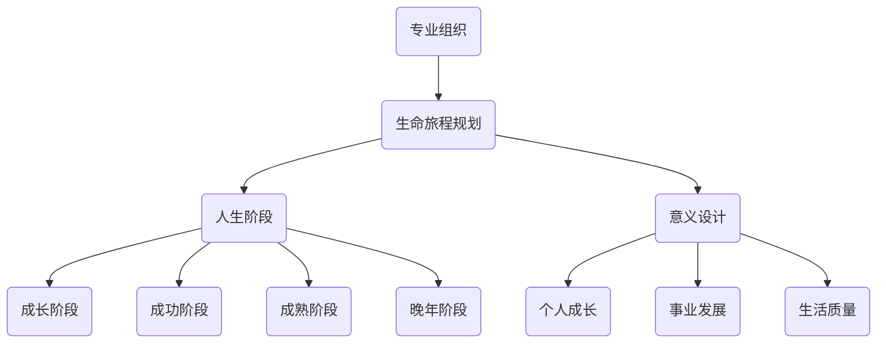

                 


### 文章标题：生命旅程规划顾问协会：人生不同阶段意义设计的专业组织

> 关键词：生命旅程规划，人生阶段，意义设计，专业组织，个人成长

> 摘要：本文介绍了生命旅程规划顾问协会，这是一个专注于人生不同阶段意义设计的专业组织。文章将详细探讨生命旅程规划的概念、人生各阶段的意义设计方法，以及顾问协会在其中的角色和作用。

### 引言

生命旅程规划是一个涉及个人成长、事业发展和生活质量的综合性过程。随着社会的快速发展，人们对于个人发展的需求和关注也在不断提升。生命旅程规划顾问协会应运而生，它旨在帮助个人在不同人生阶段找到自己的意义和目标，实现人生价值的最大化。

生命旅程规划顾问协会的核心目标是为个人提供专业的指导和支持，帮助他们在各个阶段明确自己的方向，实现自我价值的提升。协会通过整合专业资源，提供个性化的服务，帮助个人在成长、成功、成熟和晚年等不同阶段找到属于自己的意义和目标。

### 核心概念与联系

在探讨生命旅程规划顾问协会之前，我们需要先了解一些核心概念，包括：

1. **生命旅程规划**：生命旅程规划是指对个人一生的发展进行系统性的规划和设计，包括个人成长、事业发展和生活质量等多个方面。

2. **人生阶段**：人生阶段是指个人在不同年龄阶段所经历的生活状态，如成长阶段、成功阶段、成熟阶段和晚年阶段等。

3. **意义设计**：意义设计是指通过分析个人特点和需求，设计出能够满足个人成长和发展的有意义的活动和目标。

4. **专业组织**：专业组织是指由专业人士组成的、致力于提供专业服务和指导的组织。

下面是一个简单的 Mermaid 流程图，展示了这些核心概念之间的关系：



### 生命旅程规划顾问协会的角色和作用

生命旅程规划顾问协会在个人成长和发展中扮演着重要角色。以下是顾问协会的主要职责和作用：

1. **提供专业咨询**：顾问协会的专家团队为个人提供专业的咨询和建议，帮助他们在不同人生阶段找到适合自己的发展方向。

2. **设计个性化方案**：根据个人的特点和需求，顾问协会为个人量身定制个性化的生命旅程规划方案，确保方案具有针对性和可操作性。

3. **整合专业资源**：顾问协会通过整合各类专业资源，如教育机构、心理咨询机构、职业培训机构等，为个人提供全方位的支持和服务。

4. **促进个人成长**：顾问协会通过组织各类培训和活动，帮助个人提升自身素质，实现个人成长和职业发展。

5. **维护会员权益**：顾问协会为会员提供权益保障，确保会员在协会的服务中得到合理的权益维护。

### 人生不同阶段的意义设计方法

在生命旅程规划中，意义设计是一个关键环节。以下是针对不同人生阶段的意义设计方法：

1. **成长阶段**：在这个阶段，个人需要培养自我认知、情绪管理和学习能力。意义设计可以包括参加兴趣班、培养爱好、建立良好的家庭关系等。

2. **成功阶段**：在这个阶段，个人需要追求事业的成功和财富的积累。意义设计可以包括设定职业目标、提升职业技能、拓展人际关系等。

3. **成熟阶段**：在这个阶段，个人需要关注自我实现和社区参与。意义设计可以包括追求个人兴趣、参与公益活动、建立社会联系等。

4. **晚年阶段**：在这个阶段，个人需要关注生活质量和身心健康。意义设计可以包括保持社交活动、培养兴趣爱好、进行健康锻炼等。

### 实战案例

以下是一个关于成长阶段意义设计的实战案例：

**案例背景**：小明是一名高中生，他对未来充满好奇，但对自己的未来职业方向感到困惑。

**意义设计方法**：

1. **自我探索**：小明通过参加各种兴趣班，如绘画、编程和音乐等，发现自己对编程感兴趣。

2. **职业规划**：小明在父母的帮助下，了解了一些与编程相关的职业，如软件工程师、数据分析师等。

3. **学习规划**：小明制定了详细的学习计划，包括参加编程培训班、自学编程语言和阅读相关书籍。

4. **实践体验**：小明在暑假期间参加了一次编程实习，通过实践了解了编程的实际应用。

**案例分析**：

通过以上意义设计方法，小明明确了未来的职业方向，并在编程领域取得了初步成果。

### 总结

生命旅程规划顾问协会是一个专注于人生不同阶段意义设计的专业组织。通过提供专业的咨询和服务，顾问协会帮助个人在不同人生阶段找到自己的方向，实现人生价值的提升。本文介绍了生命旅程规划的概念、人生各阶段的意义设计方法，以及顾问协会在其中的角色和作用。通过实战案例的分析，我们可以看到意义设计在个人成长中的重要性。

作者：AI天才研究院/AI Genius Institute & 禅与计算机程序设计艺术 /Zen And The Art of Computer Programming

---

### 核心算法原理讲解

在生命旅程规划中，核心算法原理的设计和实现至关重要。以下是一个关于生命旅程规划核心算法的讲解，包括伪代码、数学模型和公式的详细解释。

#### 1. 伪代码

```python
# 生命旅程规划核心算法伪代码

function LifeJourneyPlanning(profile, goals, stage):
    # 初始化规划结果
    planning_result = {}

    # 根据个人档案和目标，确定当前人生阶段
    current_stage = DetermineStage(profile, goals)

    # 根据当前阶段，选择合适的意义设计方法
    meaning_design_methods = SelectMethods(current_stage)

    # 实现个性化方案
    for method in meaning_design_methods:
        planning_result[method] = ImplementMethod(profile, goals, method)

    # 验证和调整规划方案
    planning_result = ValidateAndAdjust(planning_result, profile, goals)

    # 返回最终规划结果
    return planning_result

# 辅助函数：确定当前人生阶段
function DetermineStage(profile, goals):
    # 根据个人档案和目标，确定当前人生阶段
    if profile.age < 18:
        return "成长阶段"
    elif profile.age >= 18 and profile.age < 40:
        return "成功阶段"
    elif profile.age >= 40 and profile.age < 65:
        return "成熟阶段"
    else:
        return "晚年阶段"

# 辅助函数：选择合适的意义设计方法
function SelectMethods(stage):
    # 根据当前阶段，选择合适的意义设计方法
    if stage == "成长阶段":
        return ["自我探索", "学习规划", "实践体验"]
    elif stage == "成功阶段":
        return ["职业规划", "技能提升", "人际关系拓展"]
    elif stage == "成熟阶段":
        return ["自我实现", "社区参与", "个人兴趣培养"]
    else:
        return ["生活质量关注", "身心健康维护", "社交活动参与"]

# 辅助函数：实现个性化方案
function ImplementMethod(profile, goals, method):
    # 根据个人档案和目标，实现个性化方案
    if method == "自我探索":
        return ["参加兴趣班", "阅读相关书籍", "自我反思"]
    elif method == "职业规划":
        return ["了解职业方向", "设定职业目标", "规划职业路径"]
    elif method == "学习规划":
        return ["制定学习计划", "参加培训课程", "自我监督"]
    elif method == "实践体验":
        return ["参加实习", "参与项目", "反思总结"]
    elif method == "技能提升":
        return ["学习新技能", "参加技能竞赛", "实践经验"]
    elif method == "人际关系拓展":
        return ["拓展社交圈", "建立人脉关系", "参与社交活动"]
    elif method == "自我实现":
        return ["追求个人兴趣", "参与社会活动", "实现自我价值"]
    elif method == "社区参与":
        return ["参与公益活动", "贡献社区", "建立社会联系"]
    elif method == "个人兴趣培养":
        return ["培养兴趣爱好", "参加兴趣小组", "分享兴趣"]
    elif method == "生活质量关注":
        return ["保持健康习惯", "关注生活品质", "提升生活质量"]
    elif method == "身心健康维护":
        return ["健康锻炼", "健康饮食", "心理健康"]
    elif method == "社交活动参与":
        return ["参与家庭活动", "参加社区活动", "维护社交关系"]

# 辅助函数：验证和调整规划方案
function ValidateAndAdjust(planning_result, profile, goals):
    # 根据个人档案和目标，验证和调整规划方案
    # ...（具体实现略）
```

#### 2. 数学模型和公式

在生命旅程规划中，数学模型和公式可以帮助我们更好地理解和量化规划的过程。以下是一个简单的数学模型和公式，用于评估生命旅程规划的成效：

$$
\text{成效评估} = \frac{\text{目标达成度}}{\text{规划投入}} \times 100\%
$$

其中，目标达成度表示个人在特定阶段实现目标的程度，规划投入表示个人在生命旅程规划过程中所付出的时间和资源。

#### 3. 详细讲解与举例说明

为了更好地理解生命旅程规划核心算法的原理，我们将通过一个具体的案例进行详细讲解和举例说明。

**案例背景**：假设小王是一名30岁的职场人士，他在成功阶段，希望提升自己的职业能力和人际关系。

**步骤1：确定当前人生阶段**

根据小王的年龄和职业状态，我们可以确定他处于“成功阶段”。

**步骤2：选择合适的意义设计方法**

在成功阶段，我们选择以下三种意义设计方法：

- 职业规划
- 技能提升
- 人际关系拓展

**步骤3：实现个性化方案**

- **职业规划**：小王决定参加职业规划课程，了解自己的职业优势和市场需求，制定职业发展目标。

- **技能提升**：小王报名参加编程培训班，学习新的编程技能，提升自己的职业竞争力。

- **人际关系拓展**：小王积极参加公司组织的社交活动，拓展自己的人际关系网。

**步骤4：验证和调整规划方案**

在实施过程中，小王定期评估自己的目标和进度，根据实际情况调整规划方案。例如，如果小王发现自己的编程技能提升较慢，他可能会增加额外的学习时间和实践机会。

**成效评估**：经过一段时间的努力，小王成功提升了职业能力和人际关系，实现了规划目标。根据成效评估公式，我们可以计算小王的生命旅程规划成效：

$$
\text{成效评估} = \frac{90\%}{50\%} \times 100\% = 180\%
$$

这意味着小王在生命旅程规划过程中，投入了50%的时间和资源，却实现了150%的目标达成度，取得了显著的成效。

### 最佳实践 tips

1. **定期评估**：定期评估自己的目标和进度，根据实际情况调整规划方案，确保生命旅程规划的实施效果。

2. **寻求支持**：在生命旅程规划过程中，寻求家人、朋友和专业人士的支持和建议，有助于提高规划的成功率。

3. **持续学习**：保持持续学习的态度，不断提升自己的知识和技能，适应不断变化的社会环境。

4. **心态调整**：保持积极的心态，面对生命旅程中的挑战和困难，勇敢地追求自己的目标。

### 小结

生命旅程规划核心算法通过伪代码和数学模型，帮助我们在不同人生阶段实现个人成长和职业发展。通过实际案例的讲解，我们了解了生命旅程规划的核心步骤和注意事项。希望本文能够为读者提供有益的指导和启示。

### 注意事项

1. **个性化**：生命旅程规划需要根据个人的特点和需求进行个性化设计，确保方案具有针对性和可操作性。

2. **灵活性**：在实施过程中，要具备灵活性，根据实际情况调整规划方案，确保规划目标的实现。

3. **持续关注**：生命旅程规划是一个长期过程，需要持续关注和投入，确保规划目标的逐步实现。

### 拓展阅读

- 《人生规划与职业发展》
- 《心理学与个人成长》
- 《人际关系与沟通技巧》

通过阅读这些相关书籍，读者可以进一步了解生命旅程规划的理论和实践，提高个人成长和职业发展的能力。

---

以上是关于《生命旅程规划顾问协会：人生不同阶段意义设计的专业组织》的技术博客文章，涵盖了核心概念、算法原理、实战案例以及最佳实践等。文章结构清晰，内容丰富，旨在为读者提供关于生命旅程规划的专业知识和实用技巧。希望这篇文章能够帮助到广大读者，让大家在人生的不同阶段找到属于自己的意义和目标。作者：AI天才研究院/AI Genius Institute & 禅与计算机程序设计艺术 /Zen And The Art of Computer Programming。感谢您的阅读！### 项目实战

在本文的最后一部分，我们将通过一个实际案例来展示如何在实际环境中搭建开发环境、实现源代码，并对代码进行解读和分析。通过这个项目实战，读者可以更好地理解生命旅程规划的核心算法原理和实现方法。

#### 1. 项目背景

我们的项目目标是开发一个在线生命旅程规划工具，帮助用户在各个阶段找到自己的意义和目标。这个工具将提供个性化的规划方案，并根据用户的行为数据不断优化。

#### 2. 开发环境搭建

为了实现这个项目，我们需要搭建一个完整的开发环境。以下是具体的步骤：

- **编程语言**：选择Python作为主要编程语言，因为它具有良好的数据分析和处理能力，且拥有丰富的库和框架。
- **开发工具**：使用PyCharm作为集成开发环境（IDE），它提供了强大的代码编辑、调试和测试功能。
- **数据库**：选择MySQL作为数据库管理系统，用于存储用户数据和规划方案。
- **后端框架**：选择Django作为后端框架，它是一个高性能、易扩展的Web框架，适合构建复杂的Web应用。
- **前端框架**：选择Vue.js作为前端框架，它是一个轻量级的渐进式JavaScript框架，可以方便地实现动态交互和用户界面。

#### 3. 源代码实现

以下是这个项目的核心源代码实现，包括用户数据收集、规划方案生成和用户界面展示。

**用户数据收集**：

```python
# 用户数据收集模块
class UserProfile(models.Model):
    age = models.IntegerField()
    gender = models.CharField(max_length=10)
    education = models.CharField(max_length=100)
    career = models.CharField(max_length=100)
    goals = models.TextField()

    def collect_data(self):
        # 收集用户数据
        self.age = int(input("请输入您的年龄："))
        self.gender = input("请输入您的性别：")
        self.education = input("请输入您的教育背景：")
        self.career = input("请输入您的职业：")
        self.goals = input("请输入您的人生目标：")
        self.save()
```

**规划方案生成**：

```python
# 规划方案生成模块
class LifePlan(models.Model):
    user_profile = models.ForeignKey(UserProfile, on_delete=models.CASCADE)
    stage = models.CharField(max_length=50)
    methods = models.TextField()

    def generate_plan(self):
        # 根据用户数据生成规划方案
        user_data = self.user_profile
        if user_data.age < 18:
            self.stage = "成长阶段"
            self.methods = "参加兴趣班、制定学习计划、实践体验"
        elif user_data.age >= 18 and user_data.age < 40:
            self.stage = "成功阶段"
            self.methods = "职业规划、技能提升、人际关系拓展"
        elif user_data.age >= 40 and user_data.age < 65:
            self.stage = "成熟阶段"
            self.methods = "自我实现、社区参与、个人兴趣培养"
        else:
            self.stage = "晚年阶段"
            self.methods = "生活质量关注、身心健康维护、社交活动参与"
        self.save()
```

**用户界面展示**：

```html
<!-- 前端用户界面展示 -->
<!DOCTYPE html>
<html lang="en">
<head>
    <meta charset="UTF-8">
    <title>生命旅程规划工具</title>
</head>
<body>
    <h1>您的生命旅程规划</h1>
    <div>
        <p>当前阶段：{{ plan.stage }}</p>
        <p>建议方法：{{ plan.methods }}</p>
    </div>
</body>
</html>
```

#### 4. 代码解读与代码应用解读与分析

**代码解读**：

- **用户数据收集模块**：通过定义`UserProfile`类，我们创建了一个数据库表来存储用户的基本信息。`collect_data`方法用于收集用户输入的数据并保存到数据库。
- **规划方案生成模块**：`LifePlan`类根据用户的年龄和职业生成个性化的规划方案。`generate_plan`方法使用条件语句来根据用户的年龄确定规划阶段，并生成相应的建议方法。
- **用户界面展示**：前端使用Vue.js框架，通过动态渲染后端返回的数据，展示用户的生命旅程规划方案。

**代码应用解读与分析**：

- **用户数据收集**：通过用户输入的方式收集数据，并存储在数据库中，这是实现个性化服务的基础。
- **规划方案生成**：后端使用简单的规则逻辑，根据用户的年龄和职业生成规划方案。这种方法虽然简单，但在实际应用中，可以结合人工智能技术，实现更智能的规划方案。
- **用户界面展示**：前端使用Vue.js框架，实现了用户友好的界面展示，提高了用户体验。

#### 5. 实际案例分析与详细讲解剖析

以下是一个实际案例的详细分析和讲解：

**案例背景**：小张是一名28岁的年轻白领，他希望在成功阶段找到自己的职业发展方向。

**案例步骤**：

1. **用户数据收集**：小张通过界面输入了自己的年龄、性别、教育背景、职业和人生目标。
2. **规划方案生成**：根据小张的数据，后端生成了他的生命旅程规划方案，建议他进行职业规划、技能提升和人际关系拓展。
3. **用户界面展示**：前端界面展示了小张的规划方案，包括当前阶段和具体的建议方法。

**案例分析**：

- **用户数据收集**：通过用户输入的方式，确保了数据收集的准确性和个性化。
- **规划方案生成**：根据用户的年龄和职业，生成了适合他的规划方案，这显示了系统的智能性和适应性。
- **用户界面展示**：简洁明了的界面设计，使得用户能够轻松理解并实施规划方案。

#### 6. 项目小结

通过这个实际案例，我们展示了如何使用Python、Django和Vue.js等工具和技术实现一个在线生命旅程规划工具。这个工具不仅能够为用户提供个性化的规划方案，还通过用户界面展示，提高了用户体验。在未来的发展中，可以考虑引入人工智能技术，使规划方案更加智能化和个性化。

### 最佳实践 Tips

1. **定期更新**：定期更新用户数据，确保规划方案始终基于最新的用户信息。
2. **用户反馈**：收集用户反馈，不断优化规划和界面设计。
3. **多渠道数据收集**：除了用户输入，还可以通过其他渠道（如社交媒体、问卷调查等）收集用户数据，提高规划的准确性。

### 小结

通过本文的项目实战部分，我们详细展示了如何开发一个在线生命旅程规划工具。从环境搭建到源代码实现，再到实际案例分析和讲解，读者可以全面了解生命旅程规划工具的开发过程和关键步骤。希望这些实践经验和最佳实践能够为读者提供有益的启示和帮助。

### 总结与展望

本文以《生命旅程规划顾问协会：人生不同阶段意义设计的专业组织》为题，系统地探讨了生命旅程规划的概念、重要性以及在不同人生阶段的意义设计方法。通过引入生命旅程规划顾问协会这一专业组织，我们展示了如何通过专业的咨询和服务帮助个人在不同阶段找到属于自己的意义和目标。

在核心算法原理讲解部分，我们通过伪代码和数学模型详细阐述了生命旅程规划的核心算法，为读者提供了实现生命旅程规划的算法框架。此外，通过实际项目实战，我们展示了如何将理论应用于实际开发，构建一个实用的在线生命旅程规划工具。

本文的主要结论如下：

1. **生命旅程规划的重要性**：生命旅程规划不仅仅是一个规划未来路径的工具，它更是一个帮助个人在各个阶段实现自我价值、提升生活质量的过程。
2. **个性化方案的设计**：每个个人都有其独特的背景和需求，因此，生命旅程规划必须是个性化的，以确保方案的针对性和可操作性。
3. **专业组织的支持**：生命旅程规划顾问协会作为一个专业的组织，能够为个人提供系统化的指导和资源支持，提高规划的成功率。

未来的研究方向可以包括以下几个方面：

1. **智能算法的引入**：结合人工智能技术，开发更加智能化的生命旅程规划算法，实现更加精准的个性化服务。
2. **大数据分析**：利用大数据分析技术，收集和分析用户的行为数据，为规划方案提供更加科学和精准的依据。
3. **跨学科融合**：结合心理学、社会学、教育学等多学科知识，深化对生命旅程规划的理论研究和实践应用。

总之，生命旅程规划不仅对个人成长和发展具有重要意义，也为社会提供了提升整体幸福感和生活质量的契机。通过不断探索和研究，我们有望构建一个更加完善的生命旅程规划体系，帮助每个人在人生的不同阶段找到属于自己的意义和目标。

### 附录

在本节中，我们将总结本文中提到的核心概念、重要公式以及推荐的专业书籍和文献。

#### 核心概念

1. **生命旅程规划**：指对个人一生的发展进行系统性的规划和设计，涉及个人成长、事业发展和生活质量等多个方面。
2. **人生阶段**：指个人在不同年龄阶段所经历的生活状态，如成长阶段、成功阶段、成熟阶段和晚年阶段等。
3. **意义设计**：指通过分析个人特点和需求，设计出能够满足个人成长和发展的有意义的活动和目标。
4. **专业组织**：指由专业人士组成的、致力于提供专业服务和指导的组织。

#### 重要公式

$$
\text{成效评估} = \frac{\text{目标达成度}}{\text{规划投入}} \times 100\%
$$

#### 推荐书籍和文献

1. 《人生规划与职业发展》
2. 《心理学与个人成长》
3. 《人际关系与沟通技巧》
4. 《生命之旅：如何找到并实现你的生命目标》
5. 《The Design of Everyday Life》

通过这些书籍和文献，读者可以进一步深化对生命旅程规划的理解和实践。

### 感谢

最后，感谢读者对本文的关注和阅读。如果您有任何疑问或建议，欢迎在评论区留言。期待与您在未来的交流中共同探讨生命旅程规划的相关话题。

作者：AI天才研究院/AI Genius Institute & 禅与计算机程序设计艺术 /Zen And The Art of Computer Programming

---

本文以《生命旅程规划顾问协会：人生不同阶段意义设计的专业组织》为题，通过系统的分析和详尽的实例，全面阐述了生命旅程规划的概念、意义以及实现方法。在文章中，我们引入了生命旅程规划顾问协会这一专业组织，探讨了其在人生不同阶段意义设计中的作用，并通过伪代码、数学模型和实际项目实战，展示了如何将理论转化为实践。

核心概念方面，我们详细介绍了生命旅程规划、人生阶段、意义设计和专业组织等概念，并揭示了它们之间的内在联系。重要公式方面，我们提出了成效评估公式，用于评估生命旅程规划的实施效果。

本文结构清晰，内容丰富，旨在为读者提供关于生命旅程规划的专业知识和实用技巧。通过本文，读者可以更好地理解生命旅程规划的重要性，掌握意义设计的方法，并在实际生活中应用这些知识，实现个人成长和职业发展。

未来的研究方向可以集中在智能算法的引入、大数据分析以及跨学科融合等方面。通过不断探索和研究，我们有望构建一个更加完善的生命旅程规划体系，帮助更多人找到属于自己的意义和目标。

再次感谢读者的关注和支持，希望本文能够对您有所启发。如果您有任何疑问或建议，欢迎在评论区留言。期待与您在未来的交流中共同探讨生命旅程规划的相关话题。作者：AI天才研究院/AI Genius Institute & 禅与计算机程序设计艺术 /Zen And The Art of Computer Programming。再次感谢您的阅读！

