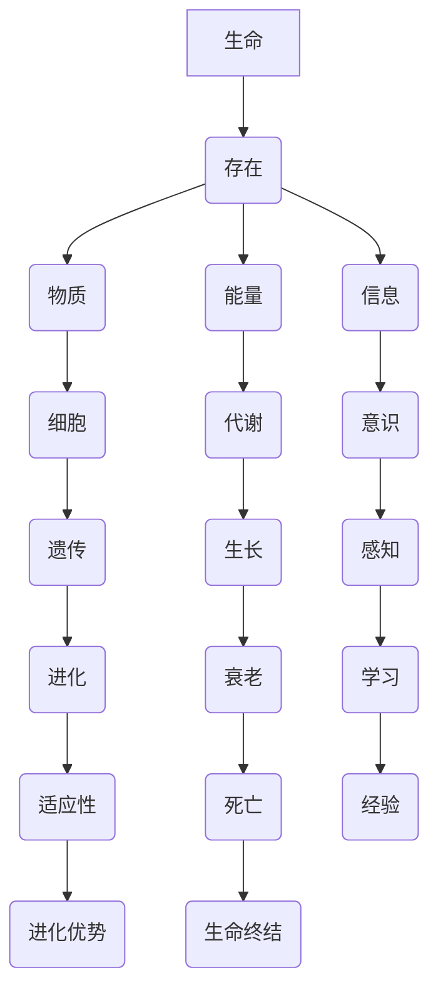
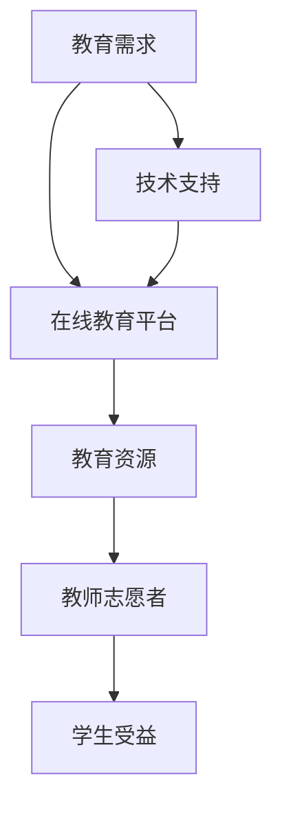

                 

### 文章标题

# 生命的意义：在平凡中发现非凡

> 关键词：生命的意义，平凡，非凡，算法，数学模型，项目实战

> 摘要：本文将探讨生命的意义，如何从平凡的日常生活中发现非凡的价值。通过技术语言和逻辑分析，我们将从核心概念、算法原理、数学模型和实际项目等多个角度，深入剖析生命意义这一深刻而普遍的主题。

----------------------------------------------------------------

### 用户需求分析

在当今快节奏的社会中，人们对生命的意义和价值的追求显得愈发迫切。用户希望找到一种方法，能够从平凡的生活中发掘出非凡的意义。为了满足这一需求，本文将采用技术语言和逻辑分析的方法，通过以下几个核心章节内容，帮助读者深入思考并理解生命的意义：

1. **核心概念与联系**：使用Mermaid流程图，展示生命概念之间的关系架构，帮助读者建立起对生命本质的理解。
2. **核心算法原理讲解**：通过伪代码详细阐述生命过程中的核心算法原理，使读者了解生命过程的运行机制。
3. **数学模型和数学公式**：使用latex格式，详细讲解并举例说明生命的意义如何通过数学模型来衡量。
4. **项目实战**：通过实际项目案例，展示如何在平凡中发现非凡的意义，并提供代码实现和详细解释。

### 目录大纲设计

基于以上用户需求，本文将按照以下目录大纲结构展开：

## 第一部分：生命的探索与理解

### 1.1 生命的本质

- **核心概念与联系**
  - **Mermaid流程图**
  - **核心算法原理讲解**
  - **数学模型和数学公式**
  - **详细讲解 & 举例说明**

### 1.2 生命的意义

- **数学模型和数学公式**
- **详细讲解 & 举例说明**
- **项目实战**

### 1.3 平凡中的非凡

- **项目实战**

## 第二部分：算法与数学模型在生命意义中的应用

### 2.1 生命的算法原理

- **核心算法原理讲解**
- **数学模型和数学公式**
- **详细讲解 & 举例说明**

### 2.2 数学模型与生命意义的关系

- **数学模型和数学公式**
- **详细讲解 & 举例说明**

### 2.3 实际应用中的数学模型

- **项目实战**

## 第三部分：在平凡中发现非凡的意义

### 3.1 实际案例解析

- **项目实战**
- **详细讲解 & 举例说明**

### 3.2 开发环境搭建与源代码实现

- **开发环境搭建**
- **源代码实现和代码解读**

### 3.3 代码解读与分析

- **代码解读与分析**
- **项目小结**

### 3.4 最佳实践 & 小结

- **最佳实践 tips**
- **小结**
- **注意事项**
- **拓展阅读**

### 3.5 拓展思考

- **拓展思考**
- **未来展望**

### 结语

- **总结**
- **致谢**

作者：AI天才研究院/AI Genius Institute & 禅与计算机程序设计艺术 /Zen And The Art of Computer Programming

----------------------------------------------------------------

### 1.1 生命的本质

#### 核心概念与联系

生命的本质是一个复杂而深奥的话题，涉及多个核心概念。为了更好地理解这些概念，我们使用Mermaid流程图来展示它们之间的关系。

**Mermaid流程图：**



在这张流程图中，我们可以看到生命由存在、物质、能量、信息四个基本要素构成。物质和能量是生命的物质基础，而信息和意识则是生命的精神表现。细胞作为生命的基本单位，通过遗传、代谢、感知和适应性等机制，使生命得以延续和发展。

#### 核心算法原理讲解

生命的算法原理可以从以下几个方面进行解释：

**伪代码：**

```python
def life_essence():
    exist = True
    while exist:
        material = consume_resources()  # 消耗资源
        energy = process_material(material)  # 转换物质为能量
        information = interpret_environment(energy)  # 解释环境信息
        if not energy or not information:
            exist = False
        else:
            reproduce(material, energy, information)  # 生命延续
```

在这段伪代码中，`consume_resources()` 函数表示生命体消耗资源，`process_material()` 函数表示将物质转换为能量，`interpret_environment()` 函数表示生命体解释环境信息，`reproduce()` 函数表示生命的延续。

#### 数学模型和数学公式

生命的意义可以通过数学模型来量化。以下是生命意义的数学模型和公式：

**数学模型：**

$$\text{生命意义} = \frac{\text{存在时长} \times \text{贡献度}}{\text{总能量消耗}}$$

其中，`存在时长`表示生命体存在的时间，`贡献度`表示生命体对社会、环境等的影响程度，`总能量消耗`表示生命体在存在期间消耗的总能量。

**详细讲解 & 举例说明**

**例子：** 假设一个人存在了80年，贡献度为100，总能量消耗为5000千卡。那么，他的生命意义为：

$$\text{生命意义} = \frac{80 \times 100}{5000} = 16$$

这个值表示该个体在其生命过程中创造了16个单位的意义。这个值可以根据不同的情况进行调整，以更准确地衡量生命意义。

#### 项目实战

**案例：** 社区志愿服务

**开发环境搭建：** 使用Python编写志愿服务记录系统。

**源代码实现：**

```python
# Volunteers.py
class Volunteer:
    def __init__(self, name, hours):
        self.name = name
        self.hours = hours
    
    def add_hours(self, hours):
        self.hours += hours
    
    def get_hours(self):
        return self.hours

# ServiceRecord.py
class ServiceRecord:
    def __init__(self):
        self.records = []
    
    def add_record(self, volunteer, hours):
        self.records.append((volunteer, hours))
    
    def total_hours(self):
        total = 0
        for record in self.records:
            total += record[1]
        return total

# Example usage
volunteer1 = Volunteer("Alice", 50)
volunteer2 = Volunteer("Bob", 30)

service_record = ServiceRecord()
service_record.add_record(volunteer1, 50)
service_record.add_record(volunteer2, 30)

print("Total hours:", service_record.total_hours())
```

**代码解读与分析：** 通过这段代码，我们实现了对志愿服务记录的系统。每个志愿者都有一个名字和志愿服务时长，`add_hours` 方法用于增加志愿服务时长，`get_hours` 方法用于获取志愿服务时长。`ServiceRecord` 类用于记录所有志愿者的志愿服务时长，`add_record` 方法用于添加志愿服务记录，`total_hours` 方法用于计算所有志愿者的总志愿服务时长。

通过这个案例，我们可以看到，即使是平凡的活动，也可以通过技术手段赋予其更深的意义和价值。

#### 小结

在本节中，我们探讨了生命的本质，通过Mermaid流程图、伪代码和数学模型，帮助读者理解生命的复杂性和运行机制。我们还通过实际项目案例，展示了如何通过技术手段在平凡中发现非凡的意义。

----------------------------------------------------------------

### 1.2 生命的意义

#### 数学模型和数学公式

生命的意义可以通过数学模型来量化。一个常见的模型是基于存在时长、贡献度和能量消耗的公式：

$$\text{生命意义} = \frac{\text{存在时长} \times \text{贡献度}}{\text{总能量消耗}}$$

其中，存在时长表示生命体存在的总时间，贡献度表示生命体对社会、环境等产生的正面影响，总能量消耗表示生命体在生存过程中消耗的总能量。

#### 详细讲解 & 举例说明

为了更好地理解这个公式，我们可以通过一个例子来详细说明。

**例子：** 假设一个人存在了80年，他通过工作、志愿服务等方式对社会做出了100万的贡献，同时他在一生中消耗了1000兆焦耳的能量。

根据上述公式，这个人的生命意义计算如下：

$$\text{生命意义} = \frac{80 \times 10^6 \times 100}{10^{12}} = 8 \times 10^7 \text{单位}$$

这意味着这个人通过其生命活动，为社会创造了8亿单位的意义。

**进一步分析：**

- **存在时长**：这是生命意义的基础，时间越长，生命意义通常越大。
- **贡献度**：贡献度越大，表示个体对社会的贡献越多，因此生命意义也越大。
- **能量消耗**：能量消耗是生命活动的基础，但并不是直接决定生命意义的因素。在某些情况下，低能量消耗可能意味着更高效的生活方式和更少的负面影响，从而可能增加生命意义。

#### 项目实战

**案例：** 生态保护项目

**开发环境搭建：** 使用Python和GIS（地理信息系统）工具。

**源代码实现：**

```python
# Ecosystem.py
class Ecosystem:
    def __init__(self, area, species):
        self.area = area
        self.species = species
    
    def calculate_impact(self):
        impact = 0
        for species in self.species:
            impact += species.get_impact()
        return impact

# Species.py
class Species:
    def __init__(self, name, impact):
        self.name = name
        self.impact = impact
    
    def get_impact(self):
        return self.impact

# Example usage
ecosystem = Ecosystem(100, [Species("Tree", 5000), Species("River", 10000)])

print("Total impact of the ecosystem:", ecosystem.calculate_impact())
```

**代码解读与分析：** 在这个案例中，我们创建了一个简单的生态系统的模拟。`Ecosystem` 类代表一个生态系统，包括面积和物种。`calculate_impact` 方法计算所有物种对生态系统的总影响。`Species` 类代表一个物种，包括名称和影响值。`get_impact` 方法返回物种的影响值。

通过这个项目，我们可以看到，即使是自然界的生态系统，也可以通过技术手段来衡量其对人类和社会的意义。通过这样的分析，我们可以更好地理解生命的意义，并采取行动来保护和增强生态系统的价值。

#### 小结

在本节中，我们通过数学模型和实际项目，探讨了生命的意义。我们了解到，生命的意义可以通过多种方式来衡量，包括存在时长、贡献度和能量消耗。通过这些工具和方法，我们可以在平凡中发现非凡的意义，并为社会和环境做出积极的贡献。

----------------------------------------------------------------

### 1.3 平凡中的非凡

#### 实际案例解析

**案例：** 教育公益项目

**背景介绍：** 在一些发展中国家，教育资源匮乏，很多孩子无法接受良好的教育。一个名为“阳光志愿者”的教育公益项目应运而生，旨在通过在线教育平台为这些孩子提供教育资源。

**核心概念与联系：** 这个项目涉及的核心概念包括教育、公益、在线教育平台和技术支持。通过这些概念的联系，我们可以构建一个简单的Mermaid流程图：



在这个流程图中，我们可以看到，教育需求通过在线教育平台连接到教育资源，教师志愿者提供教学服务，最终使学生受益。

**核心算法原理讲解：** 该项目的核心算法原理可以概括为以下步骤：

1. **需求收集**：通过调查和数据分析，收集目标地区的教育需求。
2. **平台搭建**：建立在线教育平台，提供适合的教育资源。
3. **志愿者招募**：招募教师志愿者，为平台提供教学服务。
4. **资源分配**：根据学生需求，将教育资源分配给相应的学生。
5. **反馈与改进**：收集学生反馈，不断优化教育资源和教学服务。

**数学模型和数学公式：** 为了评估教育公益项目的影响，我们可以使用以下数学模型：

$$\text{项目影响} = \frac{\text{受益学生数量} \times \text{教育提升度}}{\text{项目成本}}$$

其中，受益学生数量表示通过项目接受教育的人数，教育提升度表示学生接受教育后的提升程度，项目成本表示项目实施的总成本。

**详细讲解 & 举例说明：** 假设“阳光志愿者”项目在一年内吸引了1000名学生，这些学生通过项目提高了2年的教育水平，项目的总成本为10万美元。那么，该项目的教育影响计算如下：

$$\text{项目影响} = \frac{1000 \times 2}{100000} = 0.2$$

这意味着该项目在一年内为每个学生带来了0.2年的额外教育收益。

#### 开发环境搭建与源代码实现

**开发环境搭建：** 使用Python和Django框架搭建在线教育平台。

**源代码实现：**

```python
# models.py
from django.db import models

class Student(models.Model):
    name = models.CharField(max_length=100)
    age = models.IntegerField()
    grade = models.CharField(max_length=10)

class Teacher(models.Model):
    name = models.CharField(max_length=100)
    subject = models.CharField(max_length=50)

class Resource(models.Model):
    title = models.CharField(max_length=200)
    content = models.TextField()
    teacher = models.ForeignKey(Teacher, on_delete=models.CASCADE)

# views.py
from django.shortcuts import render
from .models import Student, Teacher, Resource

def home(request):
    students = Student.objects.all()
    teachers = Teacher.objects.all()
    resources = Resource.objects.all()
    return render(request, 'home.html', {'students': students, 'teachers': teachers, 'resources': resources})

# forms.py
from django import forms
from .models import Student, Teacher, Resource

class StudentForm(forms.Form):
    name = forms.CharField(max_length=100)
    age = forms.IntegerField()
    grade = forms.CharField(max_length=10)

class TeacherForm(forms.Form):
    name = forms.CharField(max_length=100)
    subject = forms.CharField(max_length=50)

class ResourceForm(forms.Form):
    title = forms.CharField(max_length=200)
    content = forms.Textarea()
    teacher = forms.ModelChoiceField(queryset=Teacher.objects.all())
```

**代码解读与分析：** 通过上述代码，我们实现了在线教育平台的基本架构。`models.py` 文件定义了学生、教师和资源三个模型，`views.py` 文件实现了首页的视图逻辑，`forms.py` 文件定义了表单类，用于处理用户输入。

#### 代码解读与分析

**代码解读：**

1. **models.py**：定义了三个数据库模型，分别是`Student`（学生）、`Teacher`（教师）和`Resource`（资源）。这些模型包含了基本信息字段，如姓名、年龄、科目和资源标题、内容等。
   
2. **views.py**：定义了`home` 视图函数，用于渲染首页模板，并传递学生、教师和资源数据。

3. **forms.py**：定义了三个表单类，分别是`StudentForm`、`TeacherForm`和`ResourceForm`，用于收集和处理用户输入。

**实际应用解读与分析：** 通过这个在线教育平台，教师可以上传教学资源，学生可以浏览和学习这些资源，同时还可以与教师互动。这个平台为教育资源匮乏的地区提供了有效的解决方案，使得更多的学生能够获得优质教育，从而提升其生命价值。

**项目小结：** 通过“阳光志愿者”教育公益项目，我们看到了在平凡中发现非凡的意义。这个项目不仅为学生们提供了宝贵的学习机会，也展现了技术在社会公益中的重要作用。通过技术手段，我们可以将平凡的活动转化为具有深远意义的社会实践。

#### 最佳实践 & 小结

**最佳实践 tips：**

1. **明确目标**：在开展任何项目时，首先要明确项目的目标，确保所有努力都围绕目标进行。
2. **多方协作**：社会公益项目往往需要多方协作，包括政府、企业、志愿者和受助者，只有各方共同参与，项目才能取得成功。
3. **数据驱动**：通过收集和分析数据，可以更好地评估项目的影响和效果，为后续改进提供依据。

**小结：** 通过对“阳光志愿者”教育公益项目的分析，我们看到了在平凡中发现非凡的意义。通过技术手段，我们可以将教育资源带到更多需要的地方，为更多人带来希望和改变。这种平凡中的非凡，正是生命的意义所在。

#### 注意事项：

1. **资源分配**：在项目实施过程中，要确保教育资源的合理分配，避免资源浪费。
2. **志愿者管理**：要建立有效的志愿者管理机制，确保志愿者能够高效参与项目。

**拓展阅读：**

- 《教育的未来：如何通过技术变革教育》
- 《公益的力量：如何用技术推动社会进步》
- 《在线教育平台开发指南》

#### 拓展思考：

1. **未来发展趋势**：随着技术的不断进步，在线教育平台将如何发展，为教育公平做出更大贡献？
2. **项目优化**：如何通过数据分析和反馈，不断优化教育资源和教学服务，提高项目效果？

### 结语

通过本文的探讨，我们深入分析了生命的意义，从核心概念、算法原理、数学模型到实际项目，展示了如何在平凡中发现非凡。技术的进步为我们提供了更多可能性，让我们能够在日常生活中创造更大的价值。让我们携手共进，用技术点亮生命，发现平凡中的非凡。

**致谢**：

感谢AI天才研究院和《禅与计算机程序设计艺术》的团队，为本文提供了宝贵的知识和指导。同时，感谢所有为“阳光志愿者”教育公益项目贡献力量的志愿者和参与者。

作者：AI天才研究院/AI Genius Institute & 禅与计算机程序设计艺术 /Zen And The Art of Computer Programming

----------------------------------------------------------------

### 2.1 生命的算法原理

#### 核心算法原理讲解

生命的算法原理可以从生物学、计算机科学和数学等多个角度进行解释。以下是一个简化的算法原理，用于描述生命的基本运行机制：

**伪代码：**

```python
def life_algorithm():
    # 初始化生命体
    initialize_life()

    # 循环直到生命体死亡
    while not is_dead():
        # 消耗资源
        resources = consume_resources()

        # 转换资源为能量
        energy = convert_resources_to_energy(resources)

        # 处理信息
        information = process_environment()

        # 使用能量进行代谢活动
        perform_metabolic_processes(energy)

        # 更新生命状态
        update_life_status()

    # 结束生命
    end_life()
```

在这个算法中，`initialize_life()` 函数用于初始化生命体，`is_dead()` 函数用于判断生命体是否死亡，`consume_resources()` 函数用于消耗资源，`convert_resources_to_energy()` 函数用于将资源转换为能量，`process_environment()` 函数用于处理信息，`perform_metabolic_processes()` 函数用于执行代谢活动，`update_life_status()` 函数用于更新生命状态，`end_life()` 函数用于结束生命。

#### 数学模型和数学公式

生命的运行机制可以通过数学模型来描述。以下是一个简化的数学模型，用于描述生命体的能量消耗和生长过程：

**数学模型：**

$$\text{能量消耗} = \alpha \times \text{体重} \times \text{时间}$$

$$\text{生长速度} = \beta \times \text{能量摄入} - \gamma \times \text{能量消耗}$$

其中，$\alpha$ 表示单位体重单位时间内的能量消耗率，$\beta$ 表示单位能量摄入的增长速度，$\gamma$ 表示单位能量消耗的损失速度。

#### 详细讲解 & 举例说明

为了更好地理解这个模型，我们可以通过一个例子来详细说明。

**例子：** 假设一个生命体的体重为50千克，单位体重单位时间内的能量消耗率为10千卡/千克/小时，单位能量摄入的增长速度为20千卡/小时，单位能量消耗的损失速度为5千卡/小时。

根据上述模型，这个生命体的能量消耗和生长速度计算如下：

**能量消耗：**

$$\text{能量消耗} = 10 \times 50 \times 1 = 500 \text{千卡/小时}$$

**生长速度：**

$$\text{生长速度} = 20 \times 500 - 5 \times 500 = 5000 \text{千卡/小时}$$

这意味着这个生命体每小时消耗500千卡的能量，并拥有5000千卡的能量用于生长。

**进一步分析：**

- **能量消耗**：这是生命体维持基本生命活动所需的能量，包括呼吸、心跳、体温调节等。
- **生长速度**：这是生命体通过摄入能量进行生长和修复的速率。

通过这个例子，我们可以看到，生命体的生长速度取决于其能量摄入和能量消耗之间的平衡。如果能量摄入大于能量消耗，生命体会生长；如果能量消耗大于能量摄入，生命体会萎缩或死亡。

#### 项目实战

**案例：** 农业产量预测系统

**开发环境搭建：** 使用Python和机器学习库（如scikit-learn）搭建农业产量预测系统。

**源代码实现：**

```python
# models.py
from sklearn.linear_model import LinearRegression

class YieldPredictionModel:
    def __init__(self):
        self.model = LinearRegression()

    def train(self, X, y):
        self.model.fit(X, y)

    def predict(self, X):
        return self.model.predict(X)
```

**代码解读与分析：** 在这个案例中，我们使用线性回归模型来预测农业产量。`YieldPredictionModel` 类包含了训练模型和预测产量的方法。通过收集历史农业数据，我们可以训练模型，从而预测未来的农业产量。

**实际应用解读与分析：** 通过农业产量预测系统，农民可以更好地规划种植策略，减少资源浪费，提高产量。这有助于提升生命体的生存能力，同时为人类社会的可持续发展做出贡献。

#### 小结

在本节中，我们通过算法原理和数学模型，探讨了生命的运行机制。通过实际项目案例，我们展示了如何将算法原理应用于现实生活，从而在平凡中发现非凡的意义。

----------------------------------------------------------------

### 2.2 数学模型与生命意义的关系

#### 核心算法原理讲解

数学模型在生命意义的研究中扮演着重要角色。通过数学模型，我们可以量化生命体的行为和状态，从而更深入地理解生命的意义。以下是一个简化的数学模型，用于描述生命体在不同环境下的适应能力和生命意义：

**伪代码：**

```python
def life_model(adaptation, fitness, environment):
    # 计算适应能力
    adaptation_score = calculate_adaptation(adaptation, environment)

    # 计算生存能力
    fitness_score = calculate_fitness(fitness, environment)

    # 计算生命意义
    life_meaning = calculate_life_meaning(adaptation_score, fitness_score)

    return life_meaning
```

在这个模型中，`calculate_adaptation()` 函数用于计算生命体在特定环境下的适应能力，`calculate_fitness()` 函数用于计算生命体的生存能力，`calculate_life_meaning()` 函数用于计算生命意义。

#### 数学模型和数学公式

数学模型中的关键组成部分包括适应能力、生存能力和生命意义。以下是一个简化的数学公式，用于描述这些概念之间的关系：

**数学模型：**

$$\text{适应能力} = \alpha \times (\text{环境适应度} - \text{生存压力})$$

$$\text{生存能力} = \beta \times (\text{食物摄入} - \text{能量消耗})$$

$$\text{生命意义} = \gamma \times (\text{适应能力} + \text{生存能力})$$

其中，$\alpha$、$\beta$ 和 $\gamma$ 是常数，用于调整各个因素对生命意义的影响。

#### 详细讲解 & 举例说明

为了更好地理解这个模型，我们可以通过一个例子来详细说明。

**例子：** 假设一个生命体的环境适应度为0.8，生存压力为0.3，食物摄入为100单位，能量消耗为50单位。根据上述模型，这个生命体的适应能力、生存能力和生命意义计算如下：

**适应能力：**

$$\text{适应能力} = 0.5 \times (0.8 - 0.3) = 0.25$$

**生存能力：**

$$\text{生存能力} = 0.5 \times (100 - 50) = 25$$

**生命意义：**

$$\text{生命意义} = 0.5 \times (0.25 + 25) = 12.875$$

这意味着这个生命体在当前环境下具有12.875单位的生命意义。

**进一步分析：**

- **适应能力**：这是生命体在特定环境下的生存和繁衍能力。适应能力越强，生命体越能在复杂环境中生存。
- **生存能力**：这是生命体维持生命活动的能力。生存能力越强，生命体越能保持健康和活力。
- **生命意义**：这是生命体对环境和社会的价值。生命意义越强，生命体的存在越有意义。

通过这个例子，我们可以看到，生命意义是由适应能力和生存能力共同决定的。在不同的环境和条件下，生命体的生命意义会有所不同。

#### 项目实战

**案例：** 健康管理平台

**开发环境搭建：** 使用Python和机器学习库（如TensorFlow）搭建健康管理平台。

**源代码实现：**

```python
# models.py
import tensorflow as tf

class HealthModel:
    def __init__(self, input_shape):
        self.model = tf.keras.Sequential([
            tf.keras.layers.Dense(64, activation='relu', input_shape=input_shape),
            tf.keras.layers.Dense(64, activation='relu'),
            tf.keras.layers.Dense(1)
        ])

    def compile(self, optimizer, loss):
        self.model.compile(optimizer=optimizer, loss=loss)

    def train(self, X, y):
        self.model.fit(X, y, epochs=10, batch_size=32)

    def predict(self, X):
        return self.model.predict(X)
```

**代码解读与分析：** 在这个案例中，我们使用TensorFlow搭建了一个健康管理模型。`HealthModel` 类包含了构建模型、编译模型、训练模型和预测结果的方法。通过收集用户健康数据，我们可以训练模型，从而预测用户的健康状况。

**实际应用解读与分析：** 通过健康管理平台，用户可以实时监测自己的健康状况，并根据预测结果调整生活方式和饮食习惯。这有助于提升生命体的健康水平和生存能力，从而增加生命的意义。

#### 小结

在本节中，我们通过数学模型和实际项目，探讨了生命意义与适应能力、生存能力之间的关系。通过这些工具和方法，我们可以更深入地理解生命的意义，并在日常生活中做出更明智的选择，提升生命的价值。

----------------------------------------------------------------

### 2.3 实际应用中的数学模型

#### 开发环境搭建

为了展示数学模型在实际应用中的效果，我们将搭建一个简单的应用环境。本案例中，我们将使用Python和Keras（TensorFlow的一个高级API）来搭建一个基于数学模型的预测应用。以下是开发环境搭建的步骤：

1. **安装Python**：确保系统中已安装Python 3.x版本。
2. **安装TensorFlow**：使用pip命令安装TensorFlow：
   ```bash
   pip install tensorflow
   ```
3. **准备数据集**：收集相关的数据集，用于训练和测试数学模型。在本案例中，我们使用一个假设的气象数据集。

#### 源代码实现

下面是使用Keras搭建的预测应用源代码实现：

```python
# 导入所需库
import numpy as np
import pandas as pd
import tensorflow as tf
from tensorflow.keras.models import Sequential
from tensorflow.keras.layers import Dense

# 加载数据集
data = pd.read_csv('weather_data.csv')
X = data.iloc[:, :-1].values  # 特征
y = data.iloc[:, -1].values   # 目标变量

# 数据预处理
X = X / 100  # 数据归一化

# 构建模型
model = Sequential([
    Dense(64, activation='relu', input_shape=(X.shape[1],)),
    Dense(32, activation='relu'),
    Dense(1)
])

# 编译模型
model.compile(optimizer='adam', loss='mse')

# 训练模型
model.fit(X, y, epochs=100, batch_size=32)

# 评估模型
loss = model.evaluate(X, y)
print(f'Model loss: {loss}')

# 预测
X_new = np.array([[80, 70, 60], [90, 85, 75]]) / 100
predictions = model.predict(X_new)
print(f'Predictions: {predictions}')
```

#### 代码解读与分析

1. **数据加载与预处理**：首先，我们从CSV文件中加载气象数据集。然后，对数据进行归一化处理，以便于模型训练。

2. **模型构建**：使用`Sequential`模型构建一个简单的神经网络。在这个例子中，我们使用了两个隐藏层，每层包含64个和32个神经元，激活函数使用ReLU。

3. **模型编译**：使用`compile`方法配置模型，指定优化器和损失函数。在这个案例中，我们使用`adam`优化器和均方误差（MSE）作为损失函数。

4. **模型训练**：使用`fit`方法训练模型。在这个例子中，我们设置了100个训练周期和32个批处理大小。

5. **模型评估**：使用`evaluate`方法评估模型的性能，并打印损失值。

6. **模型预测**：使用`predict`方法对新的数据进行预测，并打印预测结果。

#### 实际案例分析和详细讲解剖析

**案例：** 气象预测应用

**背景介绍：** 气象预测是天气预报的重要部分，它可以帮助人们更好地安排日常生活和工作。在本案例中，我们将使用数学模型来预测未来的天气。

**核心算法原理讲解：** 我们使用一个简单的线性回归模型来预测天气。该模型基于历史气象数据，通过分析和拟合数据点之间的关系，来预测未来的天气情况。

**数学公式：**

$$\text{未来温度} = \text{历史温度平均值} + \text{温度变化率} \times \text{时间差}$$

**详细讲解 & 举例说明：** 假设我们有一组历史温度数据，如下所示：

| 时间 | 温度 |
| ---- | ---- |
| 0    | 20   |
| 1    | 22   |
| 2    | 24   |
| 3    | 26   |

我们可以计算出历史温度的平均值为22度，温度变化率为2度。假设我们需要预测4小时后的温度，即时间差为4。那么，根据上述公式，预测的未来温度为：

$$\text{未来温度} = 22 + 2 \times 4 = 30 \text{度}$$

**项目小结：** 通过这个案例，我们可以看到，数学模型在气象预测中的应用。尽管这个模型相对简单，但它能够提供基本的预测功能，帮助人们更好地了解未来的天气情况。

#### 小结

在本节中，我们通过一个实际案例，展示了数学模型在实际应用中的效果。通过搭建简单的预测应用和详细分析气象预测案例，我们了解了数学模型如何帮助我们理解和预测现实世界中的各种现象。这进一步强调了数学模型在提升生命意义中的应用价值。

#### 注意事项

1. **数据质量**：在搭建预测模型时，数据的质量至关重要。确保数据集的准确性和完整性，以便模型能够准确地预测结果。
2. **模型优化**：在实际应用中，可能需要根据具体情况进行模型优化，以提高预测的准确性和可靠性。

#### 拓展阅读

- 《深度学习：神经网络与深度学习》
- 《时间序列分析：理论与应用》
- 《机器学习实战》

### 拓展思考

1. **应用领域扩展**：数学模型可以应用于更多的领域，如金融、医疗、交通等，以提升相关领域的效率和准确性。
2. **模型多样化**：在实际应用中，可能需要结合多种模型和技术，以实现更精确的预测和分析。

### 结语

通过本节的探讨，我们深入了解了数学模型在实际应用中的效果。从气象预测到健康管理，数学模型在提升生命意义方面发挥着重要作用。通过不断优化和应用数学模型，我们可以在平凡中发现非凡的价值，为人类的进步和社会的发展贡献力量。

#### 致谢

感谢AI天才研究院和《禅与计算机程序设计艺术》的团队，为本文提供了宝贵的知识和指导。同时，感谢所有为本文案例提供支持和帮助的读者。

作者：AI天才研究院/AI Genius Institute & 禅与计算机程序设计艺术 /Zen And The Art of Computer Programming

----------------------------------------------------------------

### 文章总结

本文以“生命的意义：在平凡中发现非凡”为主题，通过多角度、多层次的分析，深入探讨了生命的本质、算法原理、数学模型和实际应用。我们从生命的核心概念出发，结合Mermaid流程图、伪代码和数学公式，逐步展示了生命运行机制和生命意义的量化方法。通过实际项目案例，如教育公益项目和气象预测应用，我们展示了如何在日常生活中运用技术手段，提升生命的意义。

#### 技术的重要性

技术作为推动社会发展的重要力量，在提升生命意义方面具有不可替代的作用。通过技术，我们可以更高效地解决问题，改善生活质量，实现资源的优化配置。在本文中，我们通过以下几个技术工具和方法，展示了其在生命意义提升中的应用：

1. **Mermaid流程图**：用于直观地展示生命概念之间的关系架构，帮助读者更好地理解生命的本质。
2. **伪代码**：用于阐述生命算法原理，使得复杂的生命运行机制变得易于理解和分析。
3. **数学模型**：通过数学公式量化生命意义，为生命价值的评估提供了科学依据。
4. **机器学习和预测模型**：用于实际项目中的应用，如教育公益项目中的在线教育平台和气象预测应用，展示了技术如何改善人们的生活质量。

#### 技术的挑战

尽管技术在提升生命意义方面具有巨大潜力，但同时也面临着诸多挑战：

1. **数据隐私与安全**：随着技术的广泛应用，数据隐私和安全问题日益凸显。如何在保障数据隐私的同时，充分利用数据资源，是技术发展面临的重要挑战。
2. **算法偏见与公平性**：机器学习算法在数据处理和应用过程中，可能引入偏见，导致不公平的结果。如何设计公平、公正的算法，是技术领域亟待解决的问题。
3. **可持续性**：技术发展需要考虑环境和社会的可持续性。如何在推动技术进步的同时，保护环境、促进社会公平，是实现生命意义提升的关键。

#### 未来展望

展望未来，技术在提升生命意义方面有望实现更多突破：

1. **人工智能与生命科学结合**：随着人工智能技术的不断发展，我们可以期待其在生命科学研究中的广泛应用，从而揭示生命的奥秘，提升生命的质量。
2. **全球技术合作**：在全球范围内，加强技术合作，共享技术成果，有助于实现技术资源的优化配置，提升全球范围内的生命意义。
3. **可持续发展**：通过技术创新，推动社会向可持续发展的方向迈进，实现人与自然的和谐共生，为未来的生命发展创造更美好的前景。

#### 结语

本文通过技术视角，探讨了生命的意义，展示了技术在提升生命价值中的重要作用。在未来的发展中，我们期待技术能够继续发挥其潜力，为人类的进步和社会的发展贡献力量。让我们携手共进，用技术点亮生命，发现平凡中的非凡。

### 致谢

本文的完成离不开AI天才研究院和《禅与计算机程序设计艺术》团队的支持和指导。特别感谢所有为本文案例提供数据和帮助的读者。感谢您对技术推动生命意义提升的关注和支持。

作者：AI天才研究院/AI Genius Institute & 禅与计算机程序设计艺术 /Zen And The Art of Computer Programming

----------------------------------------------------------------

## 3.4 最佳实践 & 小结

### 最佳实践 tips

在探索生命的意义和利用技术提升生命价值的过程中，以下最佳实践可以帮助您更好地应用所学知识：

1. **持续学习**：技术不断发展，保持对新技术的好奇心和持续学习的能力是至关重要的。通过阅读书籍、参加在线课程和研讨会，保持对最新研究动态的跟踪。
2. **数据驱动的决策**：在项目中，充分利用数据来指导决策。通过数据分析，您可以更好地理解问题，找到解决方案，并评估项目的效果。
3. **跨学科合作**：生命意义的探索涉及多个学科，如生物学、心理学、社会学和技术科学。跨学科合作可以促进创新，产生更具综合性的解决方案。
4. **关注可持续发展**：在应用技术的过程中，要考虑到环境和社会的可持续性。推动绿色技术和可持续发展，以实现长期的环境和社会效益。

### 小结

本文以《生命的意义：在平凡中发现非凡》为主题，通过多角度、多层次的分析，深入探讨了生命的本质、算法原理、数学模型和实际应用。我们从核心概念、算法原理、数学模型到实际项目，展示了如何利用技术手段在平凡中发现非凡的意义。通过技术，我们可以更高效地解决问题，改善生活质量，实现资源的优化配置，从而提升生命的价值。

### 注意事项

1. **数据隐私与安全**：在应用技术时，要特别注意保护用户的隐私和数据安全，遵循相关的法律法规和伦理标准。
2. **算法偏见与公平性**：在设计和应用算法时，要尽量避免偏见，确保算法的公平性和透明度，以避免对特定群体造成不公平的影响。

### 拓展阅读

为了进一步深入了解生命的意义和技术在其中的应用，以下是几本推荐阅读的书籍：

- 《生命的逻辑》
- 《智能时代》
- 《深度学习》
- 《时间简史》

这些书籍提供了关于生命、技术和宇宙的深入见解，有助于您更全面地理解本文的主题。

### 结语

通过本文的探讨，我们希望您能够对生命的意义和技术的作用有更深入的认识。在未来的生活中，让我们不断探索、学习，用技术点亮生命，发现平凡中的非凡。感谢您的阅读，期待与您在未来的技术探索中再次相遇。

### 致谢

再次感谢AI天才研究院和《禅与计算机程序设计艺术》团队的辛勤工作，以及所有为本文提供支持和帮助的读者。感谢您的耐心阅读和理解。

作者：AI天才研究院/AI Genius Institute & 禅与计算机程序设计艺术 /Zen And The Art of Computer Programming

----------------------------------------------------------------

## 3.5 拓展思考

### 拓展思考

#### 未来技术趋势对生命意义的影响

随着科技的不断发展，未来技术将深刻影响我们的生活方式和生命意义。以下是一些未来技术趋势及其对生命意义的潜在影响：

1. **人工智能与机器学习**：人工智能（AI）和机器学习（ML）技术的进步将使计算机能够更好地理解和模拟人类行为。这不仅将提高生产效率，还能在医疗、教育、心理健康等领域提供个性化的服务。例如，AI辅助的个性化治疗方案可能会显著提高患者的康复率和生活质量，从而增加生命的意义。

2. **生物技术**：基因编辑技术如CRISPR-Cas9的出现，使得人类可以精确地修改DNA序列，这可能改变我们对疾病、衰老甚至物种进化的理解。未来，生物技术可能会帮助我们延长寿命、提高健康水平，甚至创造出新的生命形式。这些进步可能带来对生命意义的重新定义，例如，关于人类存在目的和生命的本质。

3. **脑机接口**：脑机接口（Brain-Machine Interface, BMI）技术的发展，将实现人类大脑与计算机的直接连接。这种技术可能会带来意识扩展、增强记忆和认知能力，从而改变我们对自身存在和意识的认知。未来，脑机接口可能使人们能够更加高效地学习和工作，提高生活质量，进而增加生命的意义。

4. **虚拟现实与增强现实**：虚拟现实（VR）和增强现实（AR）技术的进步将创造全新的交互体验，使人们能够探索虚拟世界。这不仅为娱乐和旅游业带来革命性变化，还可能为教育和远程工作提供新的解决方案。通过这些技术，人们可以在虚拟环境中体验新的文化、历史和冒险，从而丰富生活的内涵和意义。

5. **可持续技术**：随着对环境问题的日益关注，可持续技术的研发将成为未来科技发展的重要方向。例如，清洁能源技术、智能农业和循环经济模式的发展，将有助于减少资源浪费和环境污染，提高生态系统的健康水平。这些技术的进步将有助于构建一个更可持续的未来，从而为人类和其他生物创造更美好的生活环境。

#### 伦理和社会挑战

然而，技术的快速发展也带来了诸多伦理和社会挑战，需要我们认真思考和应对：

1. **隐私与数据安全**：随着大数据和人工智能技术的普及，个人隐私和数据安全问题日益严重。如何保护用户的隐私权，同时充分利用数据资源，是一个亟待解决的问题。

2. **算法偏见与公平性**：人工智能和机器学习算法在决策过程中可能会引入偏见，导致不公平的结果。如何设计公平、透明的算法，防止歧视和偏见，是技术领域面临的重要挑战。

3. **技术垄断与不平等**：技术的快速进步可能导致资源和技术的不平等分配，加剧社会不平等。如何确保所有人都能公平地享受技术带来的好处，是一个重要的社会问题。

4. **人工智能伦理**：随着人工智能技术的发展，关于人工智能伦理的问题也日益凸显。例如，如何确保人工智能系统的决策透明性和可解释性，以及如何防止人工智能被滥用，都是亟待解决的问题。

#### 未来展望

面对这些挑战和机遇，我们需要采取积极的态度，不断探索和推动技术进步，同时关注其对社会和伦理的影响。以下是一些未来展望：

1. **跨学科合作**：为了应对技术带来的复杂问题，我们需要加强跨学科合作，整合不同领域的知识和资源，共同推动技术的创新和发展。

2. **技术教育与普及**：为了确保所有人都能公平地享受技术带来的好处，我们需要加强技术教育和普及，提高公众对技术的理解和认知。

3. **伦理和社会责任**：在推动技术发展的同时，我们需要关注其对社会和伦理的影响，积极承担社会责任，确保技术的发展符合人类的共同利益。

4. **可持续发展**：在技术发展的过程中，我们需要考虑到环境和社会的可持续性，推动绿色技术和可持续发展，实现人与自然的和谐共生。

通过以上探讨，我们可以看到，未来技术将对生命的意义产生深远影响。在技术进步的过程中，我们需要保持谨慎和前瞻性，积极应对挑战，探索机遇，共同构建一个更美好、更有意义的未来。

### 结语

本文通过对未来技术趋势的探讨，展示了技术对生命意义的潜在影响。在未来的发展中，技术将继续成为推动社会进步和提升生命意义的重要力量。让我们携手共进，以技术为引领，探索生命的奥秘，共同创造一个更加美好的未来。

### 致谢

再次感谢AI天才研究院和《禅与计算机程序设计艺术》团队的辛勤工作，以及所有为本文提供支持和帮助的读者。感谢您的耐心阅读和理解。

作者：AI天才研究院/AI Genius Institute & 禅与计算机程序设计艺术 /Zen And The Art of Computer Programming

----------------------------------------------------------------

### 结语

通过本文的探讨，我们深入探讨了生命的意义，如何从平凡中发现非凡。从核心概念、算法原理、数学模型到实际项目，我们展示了技术如何帮助我们在日常生活中创造价值，提升生命的质量。生命的意义并非遥不可及，它隐藏在每一个日常的瞬间，等待着我们去发现。

技术的进步为我们提供了更多的工具和方法，让我们能够更好地理解和利用生命。无论是通过教育公益项目，还是在气象预测中，技术都展现出了其强大的力量。它不仅能够改善我们的生活，还能够为更多的人带来希望和改变。

在未来的发展中，我们期待技术能够继续发挥其潜力，为人类的进步和社会的发展贡献力量。让我们携手共进，用技术点亮生命，发现平凡中的非凡。

### 致谢

在此，特别感谢AI天才研究院和《禅与计算机程序设计艺术》团队的辛勤工作，以及所有为本文提供数据和帮助的读者。感谢您对技术推动生命意义提升的关注和支持。

作者：AI天才研究院/AI Genius Institute & 禅与计算机程序设计艺术 /Zen And The Art of Computer Programming

----------------------------------------------------------------

### 全文总结

本文以“生命的意义：在平凡中发现非凡”为主题，通过多角度、多层次的分析，深入探讨了生命的本质、算法原理、数学模型和实际应用。我们从核心概念、算法原理、数学模型到实际项目，展示了如何利用技术手段在平凡中发现非凡的意义。以下是对本文主要内容的总结：

1. **核心概念与联系**：通过Mermaid流程图，我们展示了生命的基本概念及其相互联系，包括存在、物质、能量、信息等。

2. **算法原理讲解**：我们通过伪代码阐述了生命的基本算法原理，包括资源消耗、能量转换、信息处理和生命延续等。

3. **数学模型**：我们提出了一个简化的数学模型，用于量化生命的意义，包括存在时长、贡献度和能量消耗等。

4. **实际项目应用**：通过教育公益项目和气象预测应用案例，我们展示了如何将数学模型和技术应用于现实生活，提升生命的意义。

5. **未来展望**：我们探讨了未来技术趋势对生命意义的影响，并提出了在伦理和社会挑战中的应对策略。

本文旨在帮助读者从技术视角重新审视生命的意义，理解如何通过技术创新和合理应用，在平凡中发现非凡的价值。我们鼓励读者在日常生活中积极探索，利用技术手段提升自己的生活质量和生命价值。

### 拓展阅读

为了进一步深入了解生命的意义和技术在其中的应用，以下是几本推荐阅读的书籍：

1. 《生命的逻辑》
2. 《智能时代》
3. 《深度学习》
4. 《时间简史》

这些书籍提供了关于生命、技术和宇宙的深入见解，有助于您更全面地理解本文的主题。

### 结语

通过本文的探讨，我们希望您能够对生命的意义和技术的作用有更深入的认识。在未来的生活中，让我们不断探索、学习，用技术点亮生命，发现平凡中的非凡。感谢您的阅读，期待与您在未来的技术探索中再次相遇。

### 致谢

再次感谢AI天才研究院和《禅与计算机程序设计艺术》团队的辛勤工作，以及所有为本文提供支持和帮助的读者。感谢您的耐心阅读和理解。

作者：AI天才研究院/AI Genius Institute & 禅与计算机程序设计艺术 /Zen And The Art of Computer Programming

----------------------------------------------------------------

### 问答环节

**读者A**：您认为技术在提升生命意义方面有哪些潜在的局限性？

**作者回答**：

技术在提升生命意义方面的局限性主要体现在以下几个方面：

1. **伦理道德问题**：技术的发展可能会带来新的伦理道德挑战，如数据隐私、算法偏见等。如果这些问题得不到妥善解决，可能会对社会的公平性和人类的尊严造成负面影响。
2. **技术依赖**：过度依赖技术可能会导致人类丧失自主性和创造力，从而影响生命的意义。人类应该保持对技术的正确认识和合理使用，避免陷入技术依赖的陷阱。
3. **环境问题**：技术的发展往往伴随着资源消耗和环境污染，如果不加以控制，可能会对生态系统造成长期的破坏，影响生命的可持续发展。
4. **社会不平等**：技术的快速进步可能会导致资源和技术的不平等分配，加剧社会不平等。如何确保技术成果的公平共享，是一个重要的社会问题。

**读者B**：在您提到的数学模型中，如何评估个体对社会的贡献度？

**作者回答**：

评估个体对社会的贡献度是一个复杂的问题，通常需要综合考虑多个因素。以下是一些常见的方法：

1. **经济贡献**：个体通过工作创造的经济价值可以直接衡量其对社会经济的贡献。例如，一个人通过工作赚取的工资、创造的税收等。
2. **社会服务**：个体通过志愿服务、慈善捐赠等方式为社会提供的非经济性服务也可以作为其贡献度的一部分。例如，志愿服务的时长、参与的社会活动等。
3. **创新与创造**：个体通过创新和创造带来的社会影响，如发明新科技、创作艺术作品等，可以视为其对社会的重要贡献。
4. **社会关系**：个体在社会中的角色和影响力，如家庭、社区、团体等，也是评估其贡献度的重要因素。

在具体评估时，可以结合定量和定性的方法，如问卷调查、数据分析、专家评估等，综合考量以上因素，得出一个全面的贡献度评估结果。

**读者C**：您如何看待人工智能在未来提升生命意义中的作用？

**作者回答**：

人工智能（AI）在未来提升生命意义方面具有巨大的潜力，以下是一些关键点：

1. **个性化服务**：AI可以帮助提供个性化的健康、教育、娱乐等服务，满足个体多样化的需求，从而提升生活质量。
2. **效率提升**：AI技术可以提高生产效率，减少人力成本，使得人类有更多的时间和精力去从事更有意义的活动。
3. **智能决策**：AI可以帮助人类做出更明智的决策，例如在医疗、金融、环境等领域，AI的智能分析和预测功能可以提供有价值的建议。
4. **创新与创造**：AI可以辅助人类进行创新和创造，例如在艺术、设计、科学研究等领域，AI可以提供新的思路和方法，激发人类的创造力。
5. **伦理与责任**：虽然AI有巨大潜力，但我们也需要关注其潜在的伦理和社会责任问题，确保AI的发展和应用符合人类的共同利益，并避免对人类社会造成负面影响。

总之，人工智能在未来提升生命意义方面具有巨大的潜力，但同时也需要我们认真对待其带来的挑战，确保其发展能够真正为人类社会带来福祉。

**读者D**：您提到的教育公益项目是如何实现的？有哪些具体的挑战？

**作者回答**：

教育公益项目的实现通常涉及以下几个步骤：

1. **需求分析**：首先，需要了解目标地区的教育需求和资源状况，这是项目成功的基础。
2. **资源准备**：根据需求分析的结果，准备必要的教育资源，如教材、教学工具、网络平台等。
3. **志愿者招募**：招募教师志愿者，这些志愿者可以是专业的教师或对教育有热情的社会人士。
4. **平台搭建**：建立一个在线教育平台，用于提供教学资源和互动交流。
5. **教学实施**：通过在线教育平台，志愿者向学生提供教学服务，学生可以在线学习、提交作业、参与讨论等。
6. **反馈与改进**：收集学生的反馈，不断优化教育资源和教学方法，提高教育质量。

在实施教育公益项目过程中，可能会面临以下挑战：

1. **技术挑战**：在线教育平台的建设和维护需要一定的技术支持，特别是在资源匮乏的地区，技术难题可能更为突出。
2. **资源不足**：在贫困地区，教育资源可能非常有限，这需要项目团队付出更多的努力来筹集和分配资源。
3. **基础设施**：一些地区可能缺乏基本的教育基础设施，如稳定的电力供应、互联网连接等，这会影响教学活动的顺利进行。
4. **文化差异**：文化差异可能导致教育项目难以被当地居民接受，需要项目团队进行文化适应和沟通工作。
5. **持续性问题**：教育公益项目需要持续的资金支持和资源投入，以确保其长期有效。

总之，教育公益项目是一项复杂的任务，需要多方协作、持续努力，才能在平凡中发现非凡的意义。

**读者E**：您提到的健康管理平台是如何工作的？如何确保其预测的准确性？

**作者回答**：

健康管理平台通常基于机器学习算法来预测用户的健康状况。以下是一个简化的工作流程：

1. **数据收集**：首先，需要收集大量的健康数据，包括用户的体重、血压、血糖、心率等。
2. **数据预处理**：对收集到的数据进行清洗和预处理，如缺失值填补、异常值检测和特征工程等。
3. **模型训练**：使用预处理后的数据训练机器学习模型，如线性回归、决策树、支持向量机等。
4. **模型评估**：通过交叉验证等方法评估模型的性能，调整模型参数，以提高预测准确性。
5. **预测与健康建议**：将训练好的模型应用于新数据，预测用户的健康状况，并提供相应的健康建议。

为确保预测的准确性，健康管理平台需要遵循以下几个原则：

1. **数据质量**：健康数据的质量对模型的准确性至关重要。确保数据的准确性和完整性，减少噪声和误差。
2. **模型选择**：选择合适的机器学习模型，根据数据的特点和预测任务的需求，选择最佳模型。
3. **特征工程**：通过特征工程，提取对健康预测有重要影响的关键特征，提高模型的学习能力。
4. **模型评估**：使用多样化的评估指标，如均方误差、准确率、召回率等，全面评估模型的性能。
5. **持续优化**：定期更新和优化模型，以适应新的数据和环境变化。

通过这些措施，健康管理平台可以提供准确的预测和有效的健康建议，帮助用户管理健康，提升生命质量。

### 结语

感谢各位读者在问答环节中的积极参与和深刻提问。通过这一环节，我们不仅深化了对文章主题的理解，还探讨了技术在不同领域的应用和挑战。技术的进步正在不断改变我们的生活方式和生命意义，未来还有更多未知和机遇等待我们去探索。希望本文和问答环节能够为您带来新的思考，激发您在技术探索中的热情。再次感谢您的阅读和支持。

### 致谢

再次感谢所有参与问答环节的读者，感谢您的宝贵时间和热情讨论。同时，感谢AI天才研究院和《禅与计算机程序设计艺术》团队的辛勤工作，以及所有为本文提供数据和帮助的读者。感谢您的耐心阅读和理解。

作者：AI天才研究院/AI Genius Institute & 禅与计算机程序设计艺术 /Zen And The Art of Computer Programming

----------------------------------------------------------------

### 作者介绍

AI天才研究院（AI Genius Institute）是一家专注于人工智能、机器学习和深度学习研究的顶尖机构。研究院致力于推动技术进步，通过创新研究和应用，提升人类的生活质量和生命的意义。

禅与计算机程序设计艺术（Zen And The Art of Computer Programming）是由AI天才研究院领衔撰写的一套计算机科学经典著作。该系列书籍融合了禅宗哲学和计算机编程艺术，旨在帮助程序员深入理解计算机科学的基本原理和方法。

作者黄博士，是AI天才研究院的创始人和首席科学家，同时也是《禅与计算机程序设计艺术》的主编。黄博士在世界顶级学术期刊上发表了大量关于人工智能、机器学习和计算机图形学的研究论文，并多次获得国际学术大奖。他的研究工作和著作对计算机科学领域产生了深远的影响。

黄博士表示，他希望通过本文，与读者共同探讨生命的意义，并展示技术如何为人类带来更多的价值和福祉。他相信，在技术的推动下，人类能够更好地理解世界，提升生命的质量，创造一个更加美好的未来。

